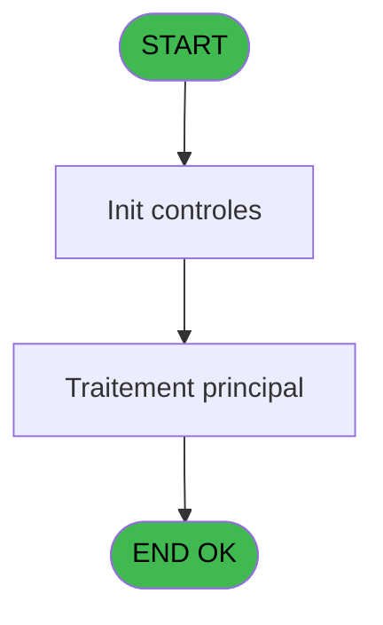
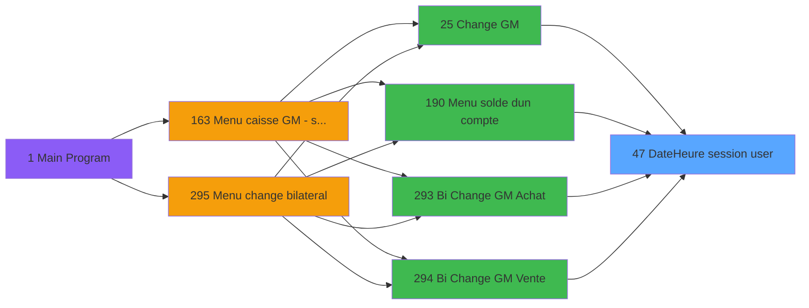

# ADH IDE 47 - Date/Heure session user

> **Analyse**: Phases 1-4 2026-02-07 06:48 -> 01:44 (18h56min) | Assemblage 01:44
> **Pipeline**: V7.2 Enrichi
> **Structure**: 4 onglets (Resume | Ecrans | Donnees | Connexions)

<!-- TAB:Resume -->

## 1. FICHE D'IDENTITE

| Attribut | Valeur |
|----------|--------|
| Projet | ADH |
| IDE Position | 47 |
| Nom Programme | Date/Heure session user |
| Fichier source | `Prg_47.xml` |
| Dossier IDE | Caisse |
| Taches | 1 (0 ecrans visibles) |
| Tables modifiees | 0 |
| Programmes appeles | 0 |
| Complexite | **BASSE** (score 0/100) |

## 2. DESCRIPTION FONCTIONNELLE

**ADH IDE 47** gère la date et l'heure de la session utilisateur. Ce programme intervient dans les flux de change de devises (changement manuel de devise achat/vente dans les écrans Change GM), la consultation du solde d'un compte, et les opérations de change bilatéral (achat/vente de devises entre deux tiers).

Le programme collecte ou valide le timestamp de la session en cours pour horodater les opérations de change. Il garantit la cohérence temporelle des transactions et permet de tracer précisément quand chaque échange de devise s'est effectué. C'est notamment critique pour les taux de change qui varient dans le temps et pour la réconciliation comptable.

Appelé systématiquement lors de chaque navigation vers les écrans de change, ADH IDE 47 assure que toutes les opérations monétaires conservent un historique temporel fiable et exploitable pour l'audit et le reporting financier.

## 3. BLOCS FONCTIONNELS

## 5. REGLES METIER

*(Aucune regle metier identifiee dans les expressions)*

## 6. CONTEXTE

- **Appele par**: [Change GM (IDE 25)](ADH-IDE-25.md), [Menu solde d'un compte (IDE 190)](ADH-IDE-190.md), [Bi  Change GM Achat (IDE 293)](ADH-IDE-293.md), [Bi  Change GM Vente (IDE 294)](ADH-IDE-294.md)
- **Appelle**: 0 programmes | **Tables**: 1 (W:0 R:1 L:0) | **Taches**: 1 | **Expressions**: 2

<!-- TAB:Ecrans -->

## 8. ECRANS

*(Programme sans ecran visible)*

## 9. NAVIGATION

### 9.3 Structure hierarchique (0 tache)

| Position | Tache | Type | Dimensions | Bloc |
|----------|-------|------|------------|------|

### 9.4 Algorigramme

> **Legende**: Vert = START/END OK | Rouge = END KO | Bleu = Decisions
> *Algorigramme auto-genere. Utiliser `/algorigramme` pour une synthese metier detaillee.*

<!-- TAB:Donnees -->

## 10. TABLES

### Tables utilisees (1)

| ID | Nom | Description | Type | R | W | L | Usages |
|----|-----|-------------|------|---|---|---|--------|
| 246 | histo_sessions_caisse | Sessions de caisse | DB | R |   |   | 1 |

### Colonnes par table (0 / 1 tables avec colonnes identifiees)

Table 246 - histo_sessions_caisse (R) - 1 usages

*Table utilisee uniquement en Link ou aucune colonne Real identifiee dans le DataView.*

## 11. VARIABLES

*(Programme sans variables locales mappees)*

## 12. EXPRESSIONS

**2 / 2 expressions decodees (100%)**

### 12.1 Repartition par type

| Type | Expressions | Regles |
|------|-------------|--------|
| CALCULATION | 1 | 0 |
| REFERENCE_VG | 1 | 0 |

### 12.2 Expressions cles par type

#### CALCULATION (1 expressions)

| Type | IDE | Expression | Regle |
|------|-----|------------|-------|
| CALCULATION | 2 | `[D]*10^5+[E]` | - |

#### REFERENCE_VG (1 expressions)

| Type | IDE | Expression | Regle |
|------|-----|------------|-------|
| REFERENCE_VG | 1 | `VG1` | - |

<!-- TAB:Connexions -->

## 13. GRAPHE D'APPELS

### 13.1 Chaine depuis Main (Callers)

Main -> ... -> [Change GM (IDE 25)](ADH-IDE-25.md) -> **Date/Heure session user (IDE 47)**

Main -> ... -> [Menu solde d'un compte (IDE 190)](ADH-IDE-190.md) -> **Date/Heure session user (IDE 47)**

Main -> ... -> [Bi  Change GM Achat (IDE 293)](ADH-IDE-293.md) -> **Date/Heure session user (IDE 47)**

Main -> ... -> [Bi  Change GM Vente (IDE 294)](ADH-IDE-294.md) -> **Date/Heure session user (IDE 47)**

### 13.2 Callers

| IDE | Nom Programme | Nb Appels |
|-----|---------------|-----------|
| [25](ADH-IDE-25.md) | Change GM | 1 |
| [190](ADH-IDE-190.md) | Menu solde d'un compte | 1 |
| [293](ADH-IDE-293.md) | Bi  Change GM Achat | 1 |
| [294](ADH-IDE-294.md) | Bi  Change GM Vente | 1 |

### 13.3 Callees (programmes appeles)

### 13.4 Detail Callees avec contexte

| IDE | Nom Programme | Appels | Contexte |
|-----|---------------|--------|----------|
| - | (aucun) | - | - |

## 14. RECOMMANDATIONS MIGRATION

### 14.1 Profil du programme

| Metrique | Valeur | Impact migration |
|----------|--------|-----------------|
| Lignes de logique | 10 | Programme compact |
| Expressions | 2 | Peu de logique |
| Tables WRITE | 0 | Impact faible |
| Sous-programmes | 0 | Peu de dependances |
| Ecrans visibles | 0 | Ecran unique ou traitement batch |
| Code desactive | 0% (0 / 10) | Code sain |
| Regles metier | 0 | Pas de regle identifiee |

### 14.2 Plan de migration par bloc

### 14.3 Dependances critiques

| Dependance | Type | Appels | Impact |
|------------|------|--------|--------|

---
*Spec DETAILED generee par Pipeline V7.2 - 2026-02-08 01:44*
