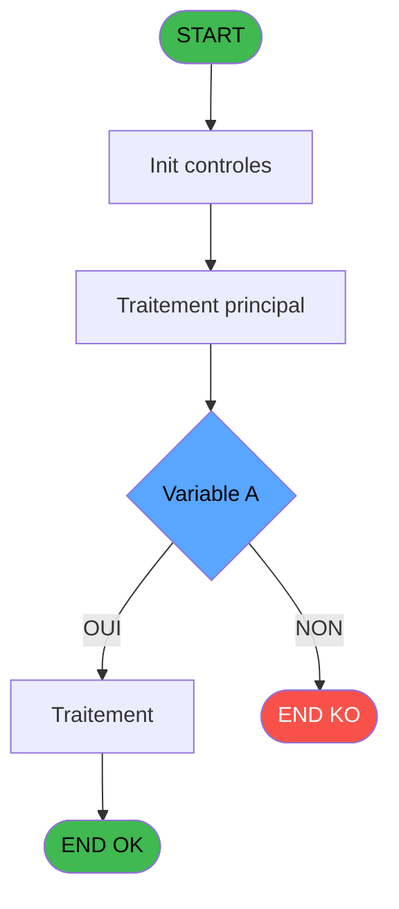
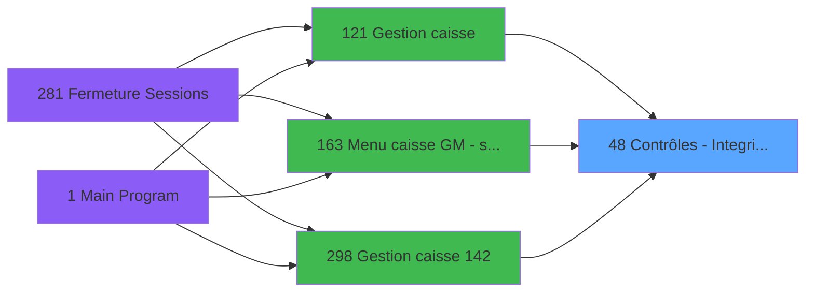

# ADH IDE 48 - Contrôles - Integrite dates

> **Analyse**: Phases 1-4 2026-02-08 01:45 -> 01:45 (5s) | Assemblage 01:45
> **Pipeline**: V7.2 Enrichi
> **Structure**: 4 onglets (Resume | Ecrans | Donnees | Connexions)

<!-- TAB:Resume -->

## 1. FICHE D'IDENTITE

| Attribut | Valeur |
|----------|--------|
| Projet | ADH |
| IDE Position | 48 |
| Nom Programme | Contrôles - Integrite dates |
| Fichier source | `Prg_48.xml` |
| Dossier IDE | General |
| Taches | 5 (0 ecrans visibles) |
| Tables modifiees | 0 |
| Programmes appeles | 0 |
| Complexite | **BASSE** (score 0/100) |

## 2. DESCRIPTION FONCTIONNELLE

Le programme ADH IDE 48 effectue une vérification d'intégrité des dates dans le contexte de gestion de caisse. Il valide que les dates saisies ou manipulées respectent les contraintes métier imposées par le système de caisse (date de session, date d'ouverture/fermeture, etc.). Ce contrôle intervient à plusieurs points critiques du flux: lors de l'ouverture de session (IDE 121), lors de la gestion avancée de caisse (IDE 298), et lors de la navigation dans le menu scrollable de caisse (IDE 163).

Les vérifications d'intégrité portent typiquement sur l'ordre chronologique des dates (date d'ouverture antérieure à celle de fermeture), la cohérence avec la date système, et le respect des règles de plage de dates autorisées. Le programme retourne un code de validation permettant aux appelants de bloquer ou signaler les incohérences avant que des transactions ne soient engagées sur une session avec des paramètres temporels invalides.

Ce programme fait partie de la couche de validation partagée entre les différents écrans de gestion de caisse, garantissant une logique cohérente et fiable d'acceptation des paramètres de session indépendamment du point d'entrée utilisateur.

## 3. BLOCS FONCTIONNELS

## 5. REGLES METIER

7 regles identifiees:

### Autres (7 regles)

#### [RM-001] Condition: P. O/T/F [A] egale 'O'

| Element | Detail |
|---------|--------|
| **Condition** | `P. O/T/F [A]='O'` |
| **Si vrai** | Action si vrai |
| **Variables** | EN (P. O/T/F) |
| **Expression source** | Expression 3 : `P. O/T/F [A]='O'` |
| **Exemple** | Si P. O/T/F [A]='O' → Action si vrai |

#### [RM-002] Negation de (Date ()>[E]+Val ([G],'##')) OR VG3 (condition inversee)

| Element | Detail |
|---------|--------|
| **Condition** | `NOT (Date ()>[E]+Val ([G],'##')) OR VG3` |
| **Si vrai** | Action si vrai |
| **Expression source** | Expression 4 : `NOT (Date ()>[E]+Val ([G],'##')) OR VG3` |
| **Exemple** | Si NOT (Date ()>[E]+Val ([G],'##')) OR VG3 → Action si vrai |

#### [RM-003] Condition composite: Date ()>[E]+Val ([G],'##') AND NOT(VG3)

| Element | Detail |
|---------|--------|
| **Condition** | `Date ()>[E]+Val ([G],'##') AND NOT(VG3)` |
| **Si vrai** | Action si vrai |
| **Expression source** | Expression 5 : `Date ()>[E]+Val ([G],'##') AND NOT(VG3)` |
| **Exemple** | Si Date ()>[E]+Val ([G],'##') AND NOT(VG3) → Action si vrai |

#### [RM-004] Condition: P. O/T/F [A] egale 'T'

| Element | Detail |
|---------|--------|
| **Condition** | `P. O/T/F [A]='T'` |
| **Si vrai** | Action si vrai |
| **Variables** | EN (P. O/T/F) |
| **Expression source** | Expression 6 : `P. O/T/F [A]='T'` |
| **Exemple** | Si P. O/T/F [A]='T' → Action si vrai |

#### [RM-005] Negation de (Date ()*10^5+Time ()<[J]*10^5+[K]) (condition inversee)

| Element | Detail |
|---------|--------|
| **Condition** | `NOT (Date ()*10^5+Time ()<[J]*10^5+[K])` |
| **Si vrai** | Action si vrai |
| **Expression source** | Expression 8 : `NOT (Date ()*10^5+Time ()<[J]*10^5+[K])` |
| **Exemple** | Si NOT (Date ()*10^5+Time ()<[J]*10^5+[K]) → Action si vrai |

#### [RM-006] Condition: P. O/T/F [A] egale 'F'

| Element | Detail |
|---------|--------|
| **Condition** | `P. O/T/F [A]='F'` |
| **Si vrai** | Action si vrai |
| **Variables** | EN (P. O/T/F) |
| **Expression source** | Expression 9 : `P. O/T/F [A]='F'` |
| **Exemple** | Si P. O/T/F [A]='F' → Action si vrai |

#### [RM-007] Negation de ([L]) (condition inversee)

| Element | Detail |
|---------|--------|
| **Condition** | `NOT ([L])` |
| **Si vrai** | Action si vrai |
| **Expression source** | Expression 10 : `NOT ([L])` |
| **Exemple** | Si NOT ([L]) → Action si vrai |

## 6. CONTEXTE

- **Appele par**: [Gestion caisse (IDE 121)](ADH-IDE-121.md), [Gestion caisse 142 (IDE 298)](ADH-IDE-298.md), [Menu caisse GM - scroll (IDE 163)](ADH-IDE-163.md)
- **Appelle**: 0 programmes | **Tables**: 7 (W:0 R:5 L:2) | **Taches**: 5 | **Expressions**: 13

<!-- TAB:Ecrans -->

## 8. ECRANS

*(Programme sans ecran visible)*

## 9. NAVIGATION

### 9.3 Structure hierarchique (0 tache)

| Position | Tache | Type | Dimensions | Bloc |
|----------|-------|------|------------|------|

### 9.4 Algorigramme

> **Legende**: Vert = START/END OK | Rouge = END KO | Bleu = Decisions
> *Algorigramme auto-genere. Utiliser `/algorigramme` pour une synthese metier detaillee.*

<!-- TAB:Donnees -->

## 10. TABLES

### Tables utilisees (7)

| ID | Nom | Description | Type | R | W | L | Usages |
|----|-----|-------------|------|---|---|---|--------|
| 44 | change___________chg |  | DB | R |   |   | 1 |
| 263 | vente | Donnees de ventes | DB | R |   |   | 1 |
| 70 | date_comptable___dat |  | DB | R |   |   | 1 |
| 147 | change_vente_____chg | Donnees de ventes | DB | R |   |   | 1 |
| 40 | comptable________cte |  | DB | R |   |   | 1 |
| 728 | arc_cc_total |  | DB |   |   | L | 1 |
| 246 | histo_sessions_caisse | Sessions de caisse | DB |   |   | L | 1 |

### Colonnes par table (1 / 5 tables avec colonnes identifiees)

Table 44 - change___________chg (R) - 1 usages

*Table utilisee uniquement en Link ou aucune colonne Real identifiee dans le DataView.*

Table 263 - vente (R) - 1 usages

*Table utilisee uniquement en Link ou aucune colonne Real identifiee dans le DataView.*

Table 70 - date_comptable___dat (R) - 1 usages

| Lettre | Variable | Acces | Type |
|--------|----------|-------|------|
| A | P. O/T/F | R | Alpha |
| B | P. Societe | R | Alpha |
| C | P. Contrôle OK | R | Logical |
| D | L Anomalie pour Fermeture | R | Logical |

Table 147 - change_vente_____chg (R) - 1 usages

*Table utilisee uniquement en Link ou aucune colonne Real identifiee dans le DataView.*

Table 40 - comptable________cte (R) - 1 usages

*Table utilisee uniquement en Link ou aucune colonne Real identifiee dans le DataView.*

## 11. VARIABLES

### 11.1 Parametres entrants (3)

Variables recues du programme appelant ([Gestion caisse (IDE 121)](ADH-IDE-121.md)).

| Lettre | Nom | Type | Usage dans |
|--------|-----|------|-----------|
| EN | P. O/T/F | Alpha | 3x parametre entrant |
| EO | P. Societe | Alpha | 1x parametre entrant |
| EP | P. Contrôle OK | Logical | - |

### 11.2 Autres (1)

Variables diverses.

| Lettre | Nom | Type | Usage dans |
|--------|-----|------|-----------|
| EQ | L Anomalie pour Fermeture | Logical | - |

## 12. EXPRESSIONS

**13 / 13 expressions decodees (100%)**

### 12.1 Repartition par type

| Type | Expressions | Regles |
|------|-------------|--------|
| CONDITION | 5 | 4 |
| NEGATION | 3 | 3 |
| OTHER | 2 | 0 |
| REFERENCE_VG | 1 | 0 |
| CAST_LOGIQUE | 2 | 0 |

### 12.2 Expressions cles par type

#### CONDITION (5 expressions)

| Type | IDE | Expression | Regle |
|------|-----|------------|-------|
| CONDITION | 6 | `P. O/T/F [A]='T'` | [RM-004](#rm-RM-004) |
| CONDITION | 9 | `P. O/T/F [A]='F'` | [RM-006](#rm-RM-006) |
| CONDITION | 3 | `P. O/T/F [A]='O'` | [RM-001](#rm-RM-001) |
| CONDITION | 5 | `Date ()>[E]+Val ([G],'##') AND NOT(VG3)` | [RM-003](#rm-RM-003) |
| CONDITION | 7 | `Date ()*10^5+Time ()<[J]*10^5+[K]` | - |

#### NEGATION (3 expressions)

| Type | IDE | Expression | Regle |
|------|-----|------------|-------|
| NEGATION | 10 | `NOT ([L])` | [RM-007](#rm-RM-007) |
| NEGATION | 8 | `NOT (Date ()*10^5+Time ()<[J]*10^5+[K])` | [RM-005](#rm-RM-005) |
| NEGATION | 4 | `NOT (Date ()>[E]+Val ([G],'##')) OR VG3` | [RM-002](#rm-RM-002) |

#### OTHER (2 expressions)

| Type | IDE | Expression | Regle |
|------|-----|------------|-------|
| OTHER | 11 | `[L]` | - |
| OTHER | 1 | `P. Societe [B]` | - |

#### REFERENCE_VG (1 expressions)

| Type | IDE | Expression | Regle |
|------|-----|------------|-------|
| REFERENCE_VG | 2 | `VG1` | - |

#### CAST_LOGIQUE (2 expressions)

| Type | IDE | Expression | Regle |
|------|-----|------------|-------|
| CAST_LOGIQUE | 13 | `'TRUE'LOG` | - |
| CAST_LOGIQUE | 12 | `'FALSE'LOG` | - |

<!-- TAB:Connexions -->

## 13. GRAPHE D'APPELS

### 13.1 Chaine depuis Main (Callers)

Main -> ... -> [Gestion caisse (IDE 121)](ADH-IDE-121.md) -> **Contrôles - Integrite dates (IDE 48)**

Main -> ... -> [Gestion caisse 142 (IDE 298)](ADH-IDE-298.md) -> **Contrôles - Integrite dates (IDE 48)**

Main -> ... -> [Menu caisse GM - scroll (IDE 163)](ADH-IDE-163.md) -> **Contrôles - Integrite dates (IDE 48)**

### 13.2 Callers

| IDE | Nom Programme | Nb Appels |
|-----|---------------|-----------|
| [121](ADH-IDE-121.md) | Gestion caisse | 2 |
| [298](ADH-IDE-298.md) | Gestion caisse 142 | 2 |
| [163](ADH-IDE-163.md) | Menu caisse GM - scroll | 1 |

### 13.3 Callees (programmes appeles)

### 13.4 Detail Callees avec contexte

| IDE | Nom Programme | Appels | Contexte |
|-----|---------------|--------|----------|
| - | (aucun) | - | - |

## 14. RECOMMANDATIONS MIGRATION

### 14.1 Profil du programme

| Metrique | Valeur | Impact migration |
|----------|--------|-----------------|
| Lignes de logique | 91 | Programme compact |
| Expressions | 13 | Peu de logique |
| Tables WRITE | 0 | Impact faible |
| Sous-programmes | 0 | Peu de dependances |
| Ecrans visibles | 0 | Ecran unique ou traitement batch |
| Code desactive | 0% (0 / 91) | Code sain |
| Regles metier | 7 | Quelques regles a preserver |

### 14.2 Plan de migration par bloc

### 14.3 Dependances critiques

| Dependance | Type | Appels | Impact |
|------------|------|--------|--------|

---
*Spec DETAILED generee par Pipeline V7.2 - 2026-02-08 01:45*
