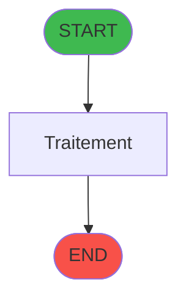
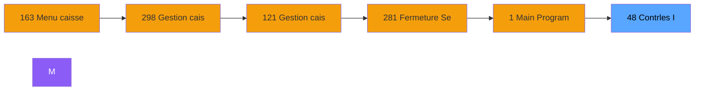

# ADH IDE 48 - Contrôles - Integrite dates

> **Version spec**: 3.5
> **Analyse**: 2026-01-27 17:56
> **Source**: `Prg_XXX.xml`

---

<!-- TAB:Fonctionnel -->

## SPECIFICATION FONCTIONNELLE

### 1.1 Objectif metier

| Element | Description |
|---------|-------------|
| **Qui** | Operateur |
| **Quoi** | Contrôles - Integrite dates
 |
| **Pourquoi** | A documenter |
| **Declencheur** | A identifier |

### 1.2 Regles metier

| Code | Regle | Condition |
|------|-------|-----------|
| RM-001 | A documenter | - |

### 1.3 Flux utilisateur

1. Demarrage programme
2. Traitement principal
3. Fin programme

### 1.4 Cas d'erreur

| Erreur | Comportement |
|--------|--------------|
| - | A documenter |

---

<!-- TAB:Technique -->

## SPECIFICATION TECHNIQUE

### 2.1 Identification

| Attribut | Valeur |
|----------|--------|
| **Format IDE** | ADH IDE 48 |
| **Description** | Contrôles - Integrite dates
 |
| **Module** | ADH |

### 2.2 Tables

| # | Nom logique | Nom physique | Acces | Usage |
|---|-------------|--------------|-------|-------|
| 40 | comptable________cte | `cafil018_dat` | R | 1x |
| 44 | change___________chg | `cafil022_dat` | R | 1x |
| 70 | date_comptable___dat | `cafil048_dat` | R | 1x |
| 147 | change_vente_____chg | `cafil125_dat` | R | 1x |
| 246 | histo_sessions_caisse | `caisse_session` | L | 1x |
| 263 | vente | `caisse_vente` | R | 1x |
| 728 | arc_cc_total | `arc_cctotal` | L | 1x |
### 2.3 Parametres d'entree

| Variable | Nom | Type | Picture |
|----------|-----|------|---------|
| - | Aucun parametre | - | - |
### 2.4 Algorigramme

### 2.5 Expressions cles

| IDE | Expression | Commentaire |
|-----|------------|-------------|
| 1 | `{0,2}` | - |
| 2 | `{32768,1}` | - |
| 3 | `{0,1}='O'` | - |
| 4 | `NOT (Date ()>{0,5}+Val ({0,7},'##')) OR {32768,3}` | - |
| 5 | `Date ()>{0,5}+Val ({0,7},'##') AND NOT({32768,3})` | - |
| 6 | `{0,1}='T'` | - |
| 7 | `Date ()*10^5+Time ()<{0,10}*10^5+{0,11}` | - |
| 8 | `NOT (Date ()*10^5+Time ()<{0,10}*10^5+{0,11})` | - |
| 9 | `{0,1}='F'` | - |
| 10 | `NOT ({0,12})` | - |
| 11 | `{0,12}` | - |
| 12 | `'FALSE'LOG` | - |
| 13 | `'TRUE'LOG` | - |

> **Total**: 13 expressions (affichees: 13)
### 2.6 Variables importantes

### 2.7 Statistiques

| Metrique | Valeur |
|----------|--------|
| **Taches** | 5 |
| **Lignes logique** | 91 |
| **Lignes desactivees** | 0 |
---

<!-- TAB:Cartographie -->

## CARTOGRAPHIE APPLICATIVE

### 3.1 Chaine d'appels depuis Main

### 3.2 Callers directs

| IDE | Programme | Nb appels |
|-----|-----------|-----------|
| 121 | Gestion caisse | 2 |
| 298 | Gestion caisse 142 | 2 |
| 163 | Menu caisse GM - scroll | 1 |
### 3.3 Callees

| Niv | IDE | Programme | Nb appels |
|-----|-----|-----------|-----------|
| - | - | Programme terminal | - |
### 3.4 Verification orphelin

| Critere | Resultat |
|---------|----------|
| Callers actifs | A verifier |
| **Conclusion** | A analyser |

---

## HISTORIQUE

| Date | Action | Auteur |
|------|--------|--------|
| 2026-01-27 20:18 | **DATA V2** - Tables reelles, Expressions, Stats, CallChain | Script |
| 2026-01-27 19:44 | **DATA POPULATED** - Tables, Callgraph (13 expr) | Script |
| 2026-01-27 17:56 | **Upgrade V3.5** - TAB markers, Mermaid | Claude |

---

*Specification V3.5 - Format avec TAB markers et Mermaid*
