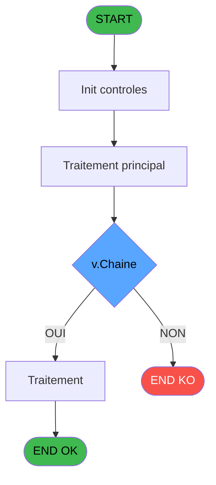

# ADH IDE 5 - Alimentation Combos NATION P

> **Analyse**: Phases 1-4 2026-02-07 03:38 -> 01:03 (21h25min) | Assemblage 01:03
> **Pipeline**: V7.2 Enrichi
> **Structure**: 4 onglets (Resume | Ecrans | Donnees | Connexions)

<!-- TAB:Resume -->

## 1. FICHE D'IDENTITE

| Attribut | Valeur |
|----------|--------|
| Projet | ADH |
| IDE Position | 5 |
| Nom Programme | Alimentation Combos NATION P |
| Fichier source | `Prg_5.xml` |
| Dossier IDE | General |
| Taches | 1 (0 ecrans visibles) |
| Tables modifiees | 0 |
| Programmes appeles | 1 |
| Complexite | **BASSE** (score 5/100) |

## 2. DESCRIPTION FONCTIONNELLE

ADH IDE 5 - Alimentation Combos NATION P est un programme de gestion des nationalités dans le système de gestion des adhérents. Il reçoit comme paramètre une nationalité et remplit des zones de combo (listes déroulantes) avec les données correspondantes. Ce programme agit comme un alimentateur de données pour les interfaces utilisateur qui nécessitent un sélecteur de nationalité, garantissant la cohérence des données affichées à l'écran.

Le programme contient une unique tâche "Sélection Nationalité" qui traite l'intégration des données de nationalité dans les contrôles combo de l'interface. Il interagit avec ADH IDE 6 (Suppression Carac interdit) pour gérer les caractères non autorisés dans les données, assurant ainsi que les informations de nationalité affichées sont valides et conformes aux règles métier définies.

Ce composant fait partie du flux de gestion des données maître pour les adhérents, appelé depuis le menu Data Catching (ADH IDE 7). Il s'inscrit dans une architecture modulaire où chaque écran de saisie dispose de programmes dédiés pour remplir dynamiquement ses listes de sélection avec les données appropriées.

## 3. BLOCS FONCTIONNELS

### 3.1 Traitement (1 tache)

Traitements internes.

---

#### 5 - Sélection Nationalité [[ECRAN]](#ecran-t1)

**Role** : Traitement : Sélection Nationalité.
**Ecran** : 310 x 152 DLU (MDI) | [Voir mockup](#ecran-t1)
**Delegue a** : [    Suppression Carac interdit (IDE 6)](ADH-IDE-6.md)

## 5. REGLES METIER

1 regles identifiees:

### Autres (1 regles)

#### [RM-001] Trim (v.Chaine [A])&Trim (IF (Counter (0)=1,'',',')&[D]&' '&[C])

| Element | Detail |
|---------|--------|
| **Condition** | `Trim (v.Chaine [A])&Trim (IF (Counter (0)=1,'',',')&[D]&' '&[C])` |
| **Si vrai** | Action conditionnelle |
| **Variables** | EN (v.Chaine) |
| **Expression source** | Expression 1 : `Trim (v.Chaine [A])&Trim (IF (Counter (0)=1,'',',')&[D]&' '&` |
| **Exemple** | Si Trim (v.Chaine [A])&Trim (IF (Counter (0)=1,'',',')&[D]&' '&[C]) → Action conditionnelle |

## 6. CONTEXTE

- **Appele par**: [Menu Data Catching (IDE 7)](ADH-IDE-7.md)
- **Appelle**: 1 programmes | **Tables**: 1 (W:0 R:1 L:0) | **Taches**: 1 | **Expressions**: 2

<!-- TAB:Ecrans -->

## 8. ECRANS

*(Programme sans ecran visible)*

## 9. NAVIGATION

### 9.3 Structure hierarchique (1 tache)

| Position | Tache | Type | Dimensions | Bloc |
|----------|-------|------|------------|------|
| **5.1** | [**Sélection Nationalité** (5)](#t1) [mockup](#ecran-t1) | MDI | 310x152 | Traitement |

### 9.4 Algorigramme

> **Legende**: Vert = START/END OK | Rouge = END KO | Bleu = Decisions
> *Algorigramme auto-genere. Utiliser `/algorigramme` pour une synthese metier detaillee.*

<!-- TAB:Donnees -->

## 10. TABLES

### Tables utilisees (1)

| ID | Nom | Description | Type | R | W | L | Usages |
|----|-----|-------------|------|---|---|---|--------|
| 364 | pms_footer_comment |  | DB | R |   |   | 1 |

### Colonnes par table (0 / 1 tables avec colonnes identifiees)

Table 364 - pms_footer_comment (R) - 1 usages

*Table utilisee uniquement en Link ou aucune colonne Real identifiee dans le DataView.*

## 11. VARIABLES

*(Programme sans variables locales mappees)*

## 12. EXPRESSIONS

**2 / 2 expressions decodees (100%)**

### 12.1 Repartition par type

| Type | Expressions | Regles |
|------|-------------|--------|
| CONCATENATION | 1 | 0 |
| OTHER | 1 | 0 |

### 12.2 Expressions cles par type

#### CONCATENATION (1 expressions)

| Type | IDE | Expression | Regle |
|------|-----|------------|-------|
| CONCATENATION | 1 | `Trim (v.Chaine [A])&Trim (IF (Counter (0)=1,'',',')&[D]&' '&[C])` | - |

#### OTHER (1 expressions)

| Type | IDE | Expression | Regle |
|------|-----|------------|-------|
| OTHER | 2 | `SetParam ('NATIONALITEP',v.Chaine [A])` | - |

<!-- TAB:Connexions -->

## 13. GRAPHE D'APPELS

### 13.1 Chaine depuis Main (Callers)

Main -> ... -> [Menu Data Catching (IDE 7)](ADH-IDE-7.md) -> **Alimentation Combos NATION P (IDE 5)**

### 13.2 Callers

| IDE | Nom Programme | Nb Appels |
|-----|---------------|-----------|
| [7](ADH-IDE-7.md) | Menu Data Catching | 1 |

### 13.3 Callees (programmes appeles)

### 13.4 Detail Callees avec contexte

| IDE | Nom Programme | Appels | Contexte |
|-----|---------------|--------|----------|
| [6](ADH-IDE-6.md) |     Suppression Carac interdit | 1 | Validation saisie |

## 14. RECOMMANDATIONS MIGRATION

### 14.1 Profil du programme

| Metrique | Valeur | Impact migration |
|----------|--------|-----------------|
| Lignes de logique | 10 | Programme compact |
| Expressions | 2 | Peu de logique |
| Tables WRITE | 0 | Impact faible |
| Sous-programmes | 1 | Peu de dependances |
| Ecrans visibles | 0 | Ecran unique ou traitement batch |
| Code desactive | 0% (0 / 10) | Code sain |
| Regles metier | 1 | Quelques regles a preserver |

### 14.2 Plan de migration par bloc

#### Traitement (1 tache: 1 ecran, 0 traitement)

- **Strategie** : 1 composant(s) UI (Razor/React) avec formulaires et validation.
- 1 sous-programme(s) a migrer ou a reutiliser depuis les services existants.
- Decomposer les taches en services unitaires testables.

### 14.3 Dependances critiques

| Dependance | Type | Appels | Impact |
|------------|------|--------|--------|
| [    Suppression Carac interdit (IDE 6)](ADH-IDE-6.md) | Sous-programme | 1x | Normale - Validation saisie |

---
*Spec DETAILED generee par Pipeline V7.2 - 2026-02-08 01:04*
