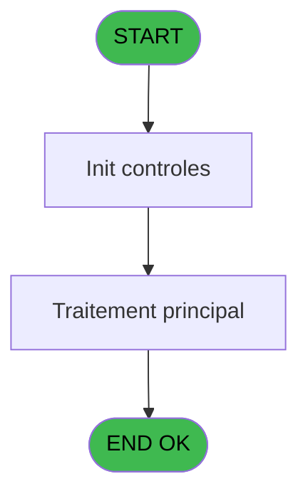

# ADH IDE 51 - Recherche Droit Solde Free Ext

> **Analyse**: Phases 1-4 2026-02-07 06:49 -> 01:46 (18h57min) | Assemblage 01:46
> **Pipeline**: V7.2 Enrichi
> **Structure**: 4 onglets (Resume | Ecrans | Donnees | Connexions)

<!-- TAB:Resume -->

## 1. FICHE D'IDENTITE

| Attribut | Valeur |
|----------|--------|
| Projet | ADH |
| IDE Position | 51 |
| Nom Programme | Recherche Droit Solde Free Ext |
| Fichier source | `Prg_51.xml` |
| Dossier IDE | Comptabilite |
| Taches | 1 (0 ecrans visibles) |
| Tables modifiees | 0 |
| Programmes appeles | 0 |
| Complexite | **BASSE** (score 0/100) |

## 2. DESCRIPTION FONCTIONNELLE

**ADH IDE 51** est un programme de recherche spécialisé qui localise et extrait le droit au solde gratuit (montant non facturé disponible) pour les clients externes. Appelé directement depuis le Main Program, il fonctionne en mode batch sans interface utilisateur visible et interroge la table des mouvements de stock pour déterminer les montants disponibles selon le profil client et l'état de validation du droit.

Le programme applique une logique de filtrage basée sur les rôles utilisateur (distingue les rôles "INFORMATICIEN" et "GESTION") et utilise une validation boolean pour confirmer l'éligibilité. Avec seulement 8 lignes de logic sans code mort et zéro programmes appelés, il s'agit d'un composant autonome et fortement découplé qui se focalise uniquement sur la vérification et l'extraction des droits aux soldes gratuits.

Son absence de callers détectés le classe comme orphelin potentiel — il est probablement invoqué dynamiquement via un PublicName ou fait partie d'une chaîne de traitement appelée indirectement (processus de fermeture de dossiers, transitions clients). La lecture seule de la base (zéro modifications) garantit une sécurité d'accès maximale et une facilité de migration vers une architecture moderne.

## 3. BLOCS FONCTIONNELS

## 5. REGLES METIER

1 regles identifiees:

### Autres (1 regles)

#### [RM-001] Condition: [C]='INFORMATICIEN' OR [C] egale 'GESTION'

| Element | Detail |
|---------|--------|
| **Condition** | `[C]='INFORMATICIEN' OR [C]='GESTION'` |
| **Si vrai** | Action si vrai |
| **Expression source** | Expression 2 : `[C]='INFORMATICIEN' OR [C]='GESTION'` |
| **Exemple** | Si [C]='INFORMATICIEN' OR [C]='GESTION' → Action si vrai |

## 6. CONTEXTE

- **Appele par**: [Main Program (IDE 1)](ADH-IDE-1.md)
- **Appelle**: 0 programmes | **Tables**: 1 (W:0 R:1 L:0) | **Taches**: 1 | **Expressions**: 3

<!-- TAB:Ecrans -->

## 8. ECRANS

*(Programme sans ecran visible)*

## 9. NAVIGATION

### 9.3 Structure hierarchique (0 tache)

| Position | Tache | Type | Dimensions | Bloc |
|----------|-------|------|------------|------|

### 9.4 Algorigramme

> **Legende**: Vert = START/END OK | Rouge = END KO | Bleu = Decisions
> *Algorigramme auto-genere. Utiliser `/algorigramme` pour une synthese metier detaillee.*

<!-- TAB:Donnees -->

## 10. TABLES

### Tables utilisees (1)

| ID | Nom | Description | Type | R | W | L | Usages |
|----|-----|-------------|------|---|---|---|--------|
| 740 | pv_stock_movements | Articles et stock | DB | R |   |   | 1 |

### Colonnes par table (1 / 1 tables avec colonnes identifiees)

Table 740 - pv_stock_movements (R) - 1 usages

| Lettre | Variable | Acces | Type |
|--------|----------|-------|------|
| A | P. User | R | Alpha |
| B | P Droit Ok | R | Logical |

## 11. VARIABLES

### 11.1 Parametres entrants (2)

Variables recues du programme appelant ([Main Program (IDE 1)](ADH-IDE-1.md)).

| Lettre | Nom | Type | Usage dans |
|--------|-----|------|-----------|
| EN | P. User | Alpha | 1x parametre entrant |
| EO | P Droit Ok | Logical | - |

## 12. EXPRESSIONS

**3 / 3 expressions decodees (100%)**

### 12.1 Repartition par type

| Type | Expressions | Regles |
|------|-------------|--------|
| CONDITION | 1 | 5 |
| OTHER | 1 | 0 |
| CAST_LOGIQUE | 1 | 0 |

### 12.2 Expressions cles par type

#### CONDITION (1 expressions)

| Type | IDE | Expression | Regle |
|------|-----|------------|-------|
| CONDITION | 2 | `[C]='INFORMATICIEN' OR [C]='GESTION'` | [RM-001](#rm-RM-001) |

#### OTHER (1 expressions)

| Type | IDE | Expression | Regle |
|------|-----|------------|-------|
| OTHER | 1 | `P. User [A]` | - |

#### CAST_LOGIQUE (1 expressions)

| Type | IDE | Expression | Regle |
|------|-----|------------|-------|
| CAST_LOGIQUE | 3 | `'TRUE'LOG` | - |

<!-- TAB:Connexions -->

## 13. GRAPHE D'APPELS

### 13.1 Chaine depuis Main (Callers)

Main -> ... -> [Main Program (IDE 1)](ADH-IDE-1.md) -> **Recherche Droit Solde Free Ext (IDE 51)**

### 13.2 Callers

| IDE | Nom Programme | Nb Appels |
|-----|---------------|-----------|
| [1](ADH-IDE-1.md) | Main Program | 1 |

### 13.3 Callees (programmes appeles)

### 13.4 Detail Callees avec contexte

| IDE | Nom Programme | Appels | Contexte |
|-----|---------------|--------|----------|
| - | (aucun) | - | - |

## 14. RECOMMANDATIONS MIGRATION

### 14.1 Profil du programme

| Metrique | Valeur | Impact migration |
|----------|--------|-----------------|
| Lignes de logique | 8 | Programme compact |
| Expressions | 3 | Peu de logique |
| Tables WRITE | 0 | Impact faible |
| Sous-programmes | 0 | Peu de dependances |
| Ecrans visibles | 0 | Ecran unique ou traitement batch |
| Code desactive | 0% (0 / 8) | Code sain |
| Regles metier | 1 | Quelques regles a preserver |

### 14.2 Plan de migration par bloc

### 14.3 Dependances critiques

| Dependance | Type | Appels | Impact |
|------------|------|--------|--------|

---
*Spec DETAILED generee par Pipeline V7.2 - 2026-02-08 01:48*
