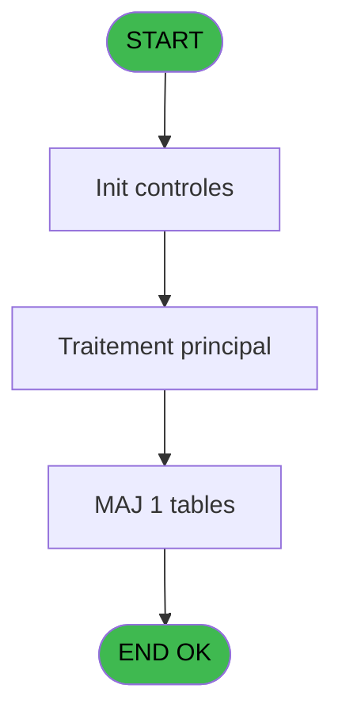

# ADH IDE 52 - Creation adresse_village

> **Analyse**: Phases 1-4 2026-02-08 01:48 -> 01:48 (4s) | Assemblage 01:48
> **Pipeline**: V7.2 Enrichi
> **Structure**: 4 onglets (Resume | Ecrans | Donnees | Connexions)

<!-- TAB:Resume -->

## 1. FICHE D'IDENTITE

| Attribut | Valeur |
|----------|--------|
| Projet | ADH |
| IDE Position | 52 |
| Nom Programme | Creation adresse_village |
| Fichier source | `Prg_52.xml` |
| Dossier IDE | General |
| Taches | 2 (0 ecrans visibles) |
| Tables modifiees | 1 |
| Programmes appeles | 0 |
| Complexite | **BASSE** (score 7/100) |

## 2. DESCRIPTION FONCTIONNELLE

ADH IDE 52 crée une adresse village dans la table Boo_AvailibleEmployees. Ce programme gère la création d'une nouvelle entrée en collectant les informations nécessaires via formulaire, puis valide et enregistre les données en base de données. Il intervient dans le workflow de gestion des employés disponibles du village.

Le programme reçoit probablement les paramètres relatifs au village et aux coordonnées adresse depuis le formulaire utilisateur (IDE 166 Menu). Il effectue les vérifications de cohérence avant d'écrire dans la table Boo_AvailibleEmployees, notamment la vérification de l'unicité si l'adresse existe déjà.

Une fois l'enregistrement effectué, le programme retourne un statut de succès/erreur au programme appelant pour confirmation utilisateur. Ce type de programme est typique des opérations CRUD (Create-Read-Update-Delete) dans une application de gestion RH.

## 3. BLOCS FONCTIONNELS

## 5. REGLES METIER

1 regles identifiees:

### Autres (1 regles)

#### [RM-001] Condition composite: Counter(0)=1 AND NOT [BC]

| Element | Detail |
|---------|--------|
| **Condition** | `Counter(0)=1 AND NOT [BC]` |
| **Si vrai** | Action si vrai |
| **Expression source** | Expression 6 : `Counter(0)=1 AND NOT [BC]` |
| **Exemple** | Si Counter(0)=1 AND NOT [BC] → Action si vrai |

## 6. CONTEXTE

- **Appele par**: [Start (IDE 166)](ADH-IDE-166.md)
- **Appelle**: 0 programmes | **Tables**: 3 (W:1 R:1 L:2) | **Taches**: 2 | **Expressions**: 8

<!-- TAB:Ecrans -->

## 8. ECRANS

*(Programme sans ecran visible)*

## 9. NAVIGATION

### 9.3 Structure hierarchique (0 tache)

| Position | Tache | Type | Dimensions | Bloc |
|----------|-------|------|------------|------|

### 9.4 Algorigramme

> **Legende**: Vert = START/END OK | Rouge = END KO | Bleu = Decisions
> *Algorigramme auto-genere. Utiliser `/algorigramme` pour une synthese metier detaillee.*

<!-- TAB:Donnees -->

## 10. TABLES

### Tables utilisees (3)

| ID | Nom | Description | Type | R | W | L | Usages |
|----|-----|-------------|------|---|---|---|--------|
| 904 | Boo_AvailibleEmployees |  | DB |   | **W** | L | 2 |
| 67 | tables___________tab |  | DB | R |   |   | 1 |
| 372 | pv_budget |  | DB |   |   | L | 1 |

### Colonnes par table (1 / 2 tables avec colonnes identifiees)

Table 904 - Boo_AvailibleEmployees (**W**/L) - 2 usages

*Table utilisee uniquement en Link ou aucune colonne Real identifiee dans le DataView.*

Table 67 - tables___________tab (R) - 1 usages

| Lettre | Variable | Acces | Type |
|--------|----------|-------|------|
| A | V Lien Adresse Village Defaut | R | Logical |
| B | v lien adresse village | R | Logical |

## 11. VARIABLES

### 11.1 Variables de session (2)

Variables persistantes pendant toute la session.

| Lettre | Nom | Type | Usage dans |
|--------|-----|------|-----------|
| EN | V Lien Adresse Village Defaut | Logical | - |
| EO | v lien adresse village | Logical | - |

## 12. EXPRESSIONS

**8 / 8 expressions decodees (100%)**

### 12.1 Repartition par type

| Type | Expressions | Regles |
|------|-------------|--------|
| CONDITION | 1 | 5 |
| CONSTANTE | 4 | 0 |
| OTHER | 1 | 0 |
| STRING | 2 | 0 |

### 12.2 Expressions cles par type

#### CONDITION (1 expressions)

| Type | IDE | Expression | Regle |
|------|-----|------------|-------|
| CONDITION | 6 | `Counter(0)=1 AND NOT [BC]` | [RM-001](#rm-RM-001) |

#### CONSTANTE (4 expressions)

| Type | IDE | Expression | Regle |
|------|-----|------------|-------|
| CONSTANTE | 4 | `''` | - |
| CONSTANTE | 5 | `''` | - |
| CONSTANTE | 1 | `'VSERV'` | - |
| CONSTANTE | 2 | `'O'` | - |

#### OTHER (1 expressions)

| Type | IDE | Expression | Regle |
|------|-----|------------|-------|
| OTHER | 8 | `NOT([BE])` | - |

#### STRING (2 expressions)

| Type | IDE | Expression | Regle |
|------|-----|------------|-------|
| STRING | 7 | `Trim([C])` | - |
| STRING | 3 | `Trim([C])` | - |

<!-- TAB:Connexions -->

## 13. GRAPHE D'APPELS

### 13.1 Chaine depuis Main (Callers)

Main -> ... -> [Start (IDE 166)](ADH-IDE-166.md) -> **Creation adresse_village (IDE 52)**

### 13.2 Callers

| IDE | Nom Programme | Nb Appels |
|-----|---------------|-----------|
| [166](ADH-IDE-166.md) | Start | 1 |

### 13.3 Callees (programmes appeles)

### 13.4 Detail Callees avec contexte

| IDE | Nom Programme | Appels | Contexte |
|-----|---------------|--------|----------|
| - | (aucun) | - | - |

## 14. RECOMMANDATIONS MIGRATION

### 14.1 Profil du programme

| Metrique | Valeur | Impact migration |
|----------|--------|-----------------|
| Lignes de logique | 61 | Programme compact |
| Expressions | 8 | Peu de logique |
| Tables WRITE | 1 | Impact faible |
| Sous-programmes | 0 | Peu de dependances |
| Ecrans visibles | 0 | Ecran unique ou traitement batch |
| Code desactive | 0% (0 / 61) | Code sain |
| Regles metier | 1 | Quelques regles a preserver |

### 14.2 Plan de migration par bloc

### 14.3 Dependances critiques

| Dependance | Type | Appels | Impact |
|------------|------|--------|--------|
| Boo_AvailibleEmployees | Table WRITE (Database) | 1x | Schema + repository |

---
*Spec DETAILED generee par Pipeline V7.2 - 2026-02-08 01:48*
