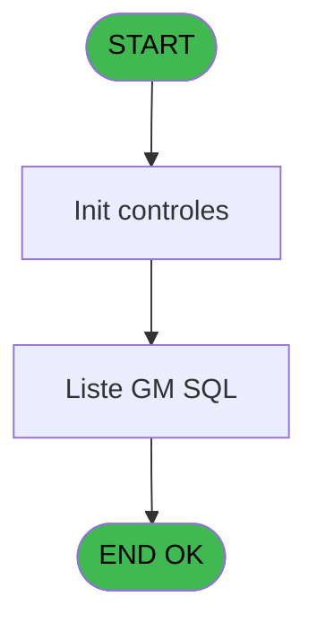
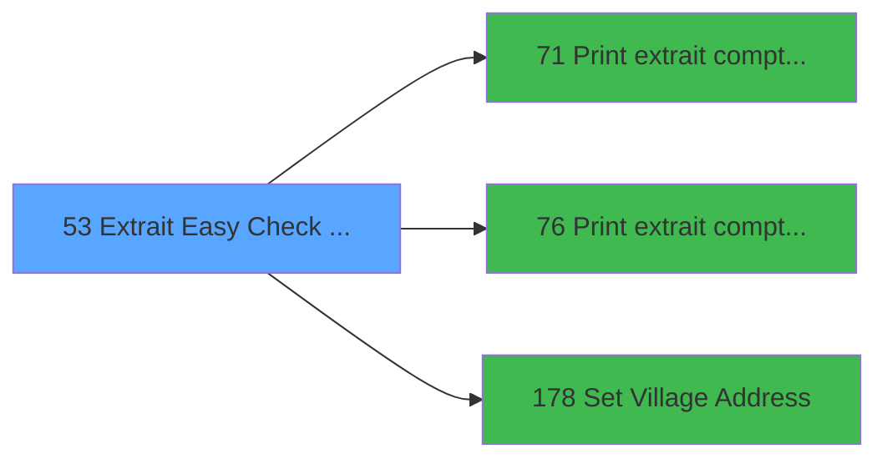

# ADH IDE 53 - Extrait Easy Check Out à J+1

> **Analyse**: Phases 1-4 2026-02-07 03:43 -> 01:49 (22h05min) | Assemblage 01:49
> **Pipeline**: V7.2 Enrichi
> **Structure**: 4 onglets (Resume | Ecrans | Donnees | Connexions)

<!-- TAB:Resume -->

## 1. FICHE D'IDENTITE

| Attribut | Valeur |
|----------|--------|
| Projet | ADH |
| IDE Position | 53 |
| Nom Programme | Extrait Easy Check Out à J+1 |
| Fichier source | `Prg_53.xml` |
| Dossier IDE | Comptabilite |
| Taches | 3 (1 ecrans visibles) |
| Tables modifiees | 0 |
| Programmes appeles | 3 |
| Complexite | **BASSE** (score 5/100) |

## 2. DESCRIPTION FONCTIONNELLE

ADH IDE 53 gère l'extraction d'un fichier de synthèse comptable pour le processus Easy Check Out du lendemain. Le programme orchestre trois tâches : initialisation des contrôles, affichage d'une grille de recherche GM avec trois colonnes (compte, filiation, email), et traitement des notifications email à envoyer aux clients concernés. Les trois sous-programmes appelés (IDE 71, 76, 178) assurent l'impression de l'extrait détaillé par date, l'extraction par service, et l'enregistrement de l'adresse du village associé.

Le flux commence par récupérer la date du lendemain via une expression (AddDate sur le jour courant), filtre les résultats dans une table SQL spécifique aux recherches GM, puis produit les impressions documentaires nécessaires à l'archivage. Le programme ne modifie aucune table directement ; c'est un orchestrateur de lecture et d'exportation de données financières, typiquement exécuté en batch quotidien après fermeture de caisse.

L'interface minimale (617×271 DLU) affiche simplement les résultats sans saisie complexe, confirmant son rôle de visualiseur et d'exportateur de synthèse plutôt que de gestionnaire transactionnel. Les variables peu nombreuses (6 variables totales) reflètent la logique métier simple et déterministe du processus.

## 3. BLOCS FONCTIONNELS

### 3.1 Traitement (3 taches)

Traitements internes.

---

#### 53 - Extrait Easy Check Out à J+1

**Role** : Traitement : Extrait Easy Check Out à J+1.
**Delegue a** : [Print extrait compte /Date (IDE 71)](ADH-IDE-71.md), [Print extrait compte /Service (IDE 76)](ADH-IDE-76.md), [Set Village Address (IDE 178)](ADH-IDE-178.md)

---

#### 53.1 - Liste GM SQL [[ECRAN]](#ecran-t2)

**Role** : Traitement : Liste GM SQL.
**Ecran** : 617 x 271 DLU | [Voir mockup](#ecran-t2)
**Delegue a** : [Set Village Address (IDE 178)](ADH-IDE-178.md)

---

#### 53.1.1 - Traitement des mails

**Role** : Traitement : Traitement des mails.
**Delegue a** : [Set Village Address (IDE 178)](ADH-IDE-178.md)

## 5. REGLES METIER

*(Aucune regle metier identifiee dans les expressions)*

## 6. CONTEXTE

- **Appele par**: (aucun)
- **Appelle**: 3 programmes | **Tables**: 5 (W:0 R:2 L:3) | **Taches**: 3 | **Expressions**: 2

<!-- TAB:Ecrans -->

## 8. ECRANS

### 8.1 Forms visibles (1 / 3)

| # | Position | Tache | Nom | Type | Largeur | Hauteur | Bloc |
|---|----------|-------|-----|------|---------|---------|------|
| 1 | 53.1 | 53.1 | Liste GM SQL | Type0 | 617 | 271 | Traitement |

### 8.2 Mockups Ecrans

---

#### 53.1 - Liste GM SQL
**Tache** : [53.1](#t2) | **Type** : Type0 | **Dimensions** : 617 x 271 DLU
**Bloc** : Traitement | **Titre IDE** : Liste GM SQL

<!-- FORM-DATA:
{
    "width":  617,
    "vFactor":  8,
    "type":  "Type0",
    "hFactor":  4,
    "controls":  [
                     {
                         "x":  4,
                         "type":  "table",
                         "var":  "",
                         "name":  "",
                         "titleH":  12,
                         "color":  "",
                         "w":  604,
                         "y":  8,
                         "fmt":  "",
                         "parent":  null,
                         "text":  "",
                         "rowH":  13,
                         "h":  256,
                         "cols":  [
                                      {
                                          "title":  "gmc_compte",
                                          "layer":  1,
                                          "w":  63
                                      },
                                      {
                                          "title":  "gmc_filiation_compte",
                                          "layer":  2,
                                          "w":  82
                                      },
                                      {
                                          "title":  "ema_email",
                                          "layer":  3,
                                          "w":  439
                                      }
                                  ],
                         "rows":  3
                     },
                     {
                         "x":  8,
                         "type":  "edit",
                         "var":  "",
                         "y":  23,
                         "w":  56,
                         "fmt":  "",
                         "name":  "gmc_compte",
                         "h":  10,
                         "color":  "",
                         "text":  "",
                         "parent":  1
                     },
                     {
                         "x":  71,
                         "type":  "edit",
                         "var":  "",
                         "y":  23,
                         "w":  56,
                         "fmt":  "",
                         "name":  "gmc_filiation_compte",
                         "h":  10,
                         "color":  "",
                         "text":  "",
                         "parent":  1
                     },
                     {
                         "x":  153,
                         "type":  "edit",
                         "var":  "",
                         "y":  23,
                         "w":  432,
                         "fmt":  "",
                         "name":  "ema_email",
                         "h":  10,
                         "color":  "",
                         "text":  "",
                         "parent":  1
                     }
                 ],
    "taskId":  "53.1",
    "height":  271
}
-->

<strong>Champs : 3 champs</strong>

| Pos (x,y) | Nom | Variable | Type |
|-----------|-----|----------|------|
| 8,23 | gmc_compte | - | edit |
| 71,23 | gmc_filiation_compte | - | edit |
| 153,23 | ema_email | - | edit |

## 9. NAVIGATION

Ecran unique: **Liste GM SQL**

### 9.3 Structure hierarchique (3 taches)

| Position | Tache | Type | Dimensions | Bloc |
|----------|-------|------|------------|------|
| **53.1** | [**Extrait Easy Check Out à J+1** (53)](#t1) | - | - | Traitement |
| 53.1.1 | [Liste GM SQL (53.1)](#t2) [mockup](#ecran-t2) | - | 617x271 | |
| 53.1.2 | [Traitement des mails (53.1.1)](#t3) | - | - | |

### 9.4 Algorigramme

> **Legende**: Vert = START/END OK | Rouge = END KO | Bleu = Decisions
> *Algorigramme auto-genere. Utiliser `/algorigramme` pour une synthese metier detaillee.*

<!-- TAB:Donnees -->

## 10. TABLES

### Tables utilisees (5)

| ID | Nom | Description | Type | R | W | L | Usages |
|----|-----|-------------|------|---|---|---|--------|
| 30 | gm-recherche_____gmr | Index de recherche | DB | R |   |   | 1 |
| 69 | initialisation___ini |  | DB | R |   |   | 1 |
| 372 | pv_budget |  | DB |   |   | L | 1 |
| 911 | log_booker |  | DB |   |   | L | 1 |
| 70 | date_comptable___dat |  | DB |   |   | L | 1 |

### Colonnes par table (1 / 2 tables avec colonnes identifiees)

Table 30 - gm-recherche_____gmr (R) - 1 usages

*Table utilisee uniquement en Link ou aucune colonne Real identifiee dans le DataView.*

Table 69 - initialisation___ini (R) - 1 usages

*Table utilisee uniquement en Link ou aucune colonne Real identifiee dans le DataView.*

## 11. VARIABLES

### 11.1 Variables de session (1)

Variables persistantes pendant toute la session.

| Lettre | Nom | Type | Usage dans |
|--------|-----|------|-----------|
| ES | v.nom fichier PDF | Alpha | - |

### 11.2 Autres (5)

Variables diverses.

| Lettre | Nom | Type | Usage dans |
|--------|-----|------|-----------|
| EN | V0.DateDepart | Alpha | - |
| EO | gmc_compte | Numeric | - |
| EP | gmc_filiation_compte | Numeric | - |
| EQ | ema_email | Unicode | - |
| ER | solde du compte | Numeric | - |

## 12. EXPRESSIONS

**2 / 2 expressions decodees (100%)**

### 12.1 Repartition par type

| Type | Expressions | Regles |
|------|-------------|--------|
| CONSTANTE | 1 | 0 |
| FORMAT | 1 | 0 |

### 12.2 Expressions cles par type

#### CONSTANTE (1 expressions)

| Type | IDE | Expression | Regle |
|------|-----|------------|-------|
| CONSTANTE | 2 | `'C'` | - |

#### FORMAT (1 expressions)

| Type | IDE | Expression | Regle |
|------|-----|------------|-------|
| FORMAT | 1 | `DStr(AddDate (Date(),0,0,1),'YYYYMMDD')` | - |

<!-- TAB:Connexions -->

## 13. GRAPHE D'APPELS

### 13.1 Chaine depuis Main (Callers)

**Chemin**: (pas de callers directs)

### 13.2 Callers

| IDE | Nom Programme | Nb Appels |
|-----|---------------|-----------|
| - | (aucun) | - |

### 13.3 Callees (programmes appeles)

### 13.4 Detail Callees avec contexte

| IDE | Nom Programme | Appels | Contexte |
|-----|---------------|--------|----------|
| [71](ADH-IDE-71.md) | Print extrait compte /Date | 1 | Impression ticket/document |
| [76](ADH-IDE-76.md) | Print extrait compte /Service | 1 | Impression ticket/document |
| [178](ADH-IDE-178.md) | Set Village Address | 1 | Sous-programme |

## 14. RECOMMANDATIONS MIGRATION

### 14.1 Profil du programme

| Metrique | Valeur | Impact migration |
|----------|--------|-----------------|
| Lignes de logique | 72 | Programme compact |
| Expressions | 2 | Peu de logique |
| Tables WRITE | 0 | Impact faible |
| Sous-programmes | 3 | Peu de dependances |
| Ecrans visibles | 1 | Ecran unique ou traitement batch |
| Code desactive | 0% (0 / 72) | Code sain |
| Regles metier | 0 | Pas de regle identifiee |

### 14.2 Plan de migration par bloc

#### Traitement (3 taches: 1 ecran, 2 traitements)

- **Strategie** : Orchestrateur avec 1 ecrans (Razor/React) et 2 traitements backend (services).
- Les ecrans deviennent des composants UI, les traitements invisibles deviennent des services injectables.
- 3 sous-programme(s) a migrer ou a reutiliser depuis les services existants.
- Decomposer les taches en services unitaires testables.

### 14.3 Dependances critiques

| Dependance | Type | Appels | Impact |
|------------|------|--------|--------|
| [Set Village Address (IDE 178)](ADH-IDE-178.md) | Sous-programme | 1x | Normale - Sous-programme |
| [Print extrait compte /Service (IDE 76)](ADH-IDE-76.md) | Sous-programme | 1x | Normale - Impression ticket/document |
| [Print extrait compte /Date (IDE 71)](ADH-IDE-71.md) | Sous-programme | 1x | Normale - Impression ticket/document |

---
*Spec DETAILED generee par Pipeline V7.2 - 2026-02-08 01:49*
