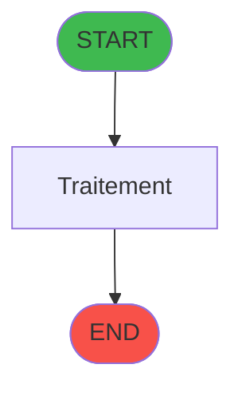
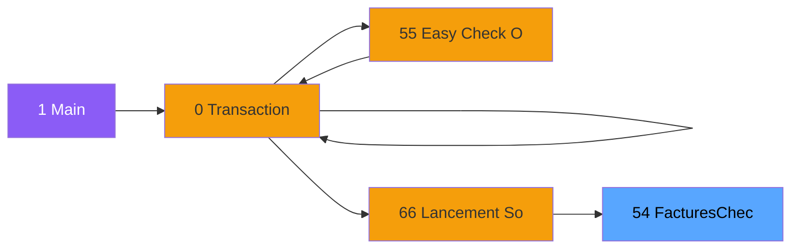
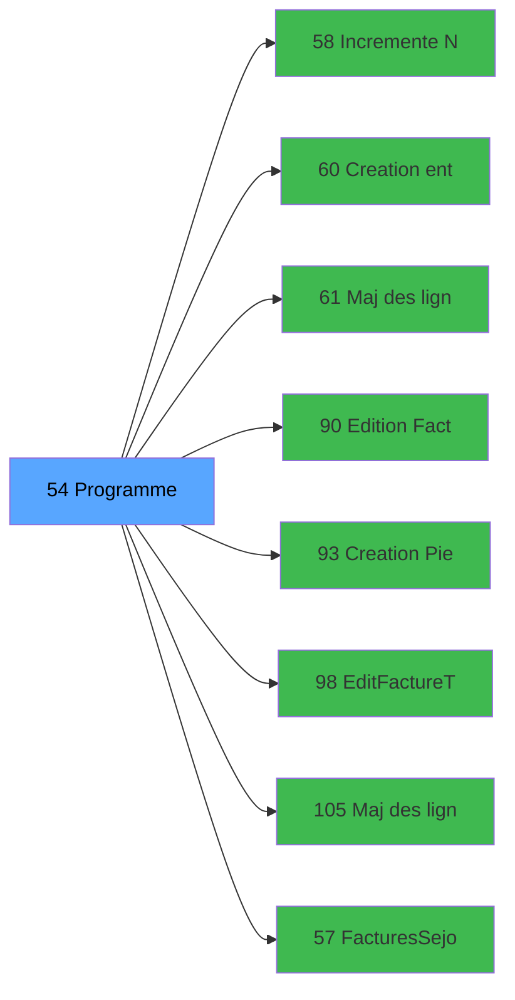

# ADH IDE 54 - Factures_Check_Out

> **Version spec**: 3.5
> **Analyse**: 2026-01-27 17:57
> **Source**: `Prg_XXX.xml`

---

<!-- TAB:Fonctionnel -->

## SPECIFICATION FONCTIONNELLE

### 1.1 Objectif metier

| Element | Description |
|---------|-------------|
| **Qui** | Operateur |
| **Quoi** | Factures_Check_Out
 |
| **Pourquoi** | A documenter |
| **Declencheur** | A identifier |

### 1.2 Regles metier

| Code | Regle | Condition |
|------|-------|-----------|
| RM-001 | A documenter | - |

### 1.3 Flux utilisateur

1. Demarrage programme
2. Traitement principal
3. Fin programme

### 1.4 Cas d'erreur

| Erreur | Comportement |
|--------|--------------|
| - | A documenter |

---

<!-- TAB:Technique -->

## SPECIFICATION TECHNIQUE

### 2.1 Identification

| Attribut | Valeur |
|----------|--------|
| **Format IDE** | ADH IDE 54 |
| **Description** | Factures_Check_Out
 |
| **Module** | ADH |

### 2.2 Tables

| # | Nom logique | Nom physique | Acces | Usage |
|---|-------------|--------------|-------|-------|
| 30 | gm-recherche_____gmr | `cafil008_dat` | L | 1x |
| 31 | gm-complet_______gmc | `cafil009_dat` | L | 1x |
| 372 | pv_budget | `pv_budget_dat` | L | 1x |
| 866 | maj_appli_tpe | `maj_appli_tpe` | L | 1x |
| 866 | maj_appli_tpe | `maj_appli_tpe` | R | 4x |
| 866 | maj_appli_tpe | `maj_appli_tpe` | **W** | 3x |
| 867 | log_maj_tpe | `log_maj_tpe` | R | 1x |
| 868 | Affectation_Gift_Pass | `affectation_gift_pass` | R | 1x |
| 870 | Rayons_Boutique | `rayons_boutique` | L | 3x |
| 870 | Rayons_Boutique | `rayons_boutique` | R | 1x |
| 870 | Rayons_Boutique | `rayons_boutique` | **W** | 1x |
| 932 | taxe_add_param | `taxe_add_param` | L | 1x |
| 932 | taxe_add_param | `taxe_add_param` | **W** | 1x |
### 2.3 Parametres d'entree

| Variable | Nom | Type | Picture |
|----------|-----|------|---------|
| - | Aucun parametre | - | - |
### 2.4 Algorigramme

### 2.5 Expressions cles

| IDE | Expression | Commentaire |
|-----|------------|-------------|
| 1 | `{0,1}` | - |
| 2 | `{0,2}` | - |
| 3 | `{0,3}` | - |
| 4 | `{0,10}` | - |
| 5 | `{0,11}` | - |
| 6 | `IF({0,42},Trim({0,45}),Trim({0,23})&' '&Trim({0...` | - |
| 7 | `IF({0,42},Trim({0,44}),Trim({0,19})&' '&Trim({0...` | - |
| 8 | `IF({0,42},Trim({0,46}),Trim({0,25}))` | - |
| 9 | `IF({0,42},Trim({0,47}),Trim({0,27}))` | - |
| 10 | `IF({0,42},Trim({0,49}),Trim({0,29}))` | - |
| 11 | `'Numéro d''adhérent'&' '&Trim(Str({0,22},'10Z'))` | - |
| 12 | `Trim({0,31})&Trim(Str(Year(Date()),'4'))&Trim(S...` | - |
| 13 | `Trim({0,31})&Trim(Str(Year(Date()),'4'))&Trim(S...` | - |
| 14 | `NOT({0,62})` | - |
| 15 | `{0,62}` | - |
| 16 | `MID(GetParam('SERVICE'),4,{0,60}-4)` | - |
| 17 | `InStr(GetParam('SERVICE'),',')` | - |
| 18 | `{32768,2}` | - |
| 19 | `Date()` | - |
| 20 | `{0,58}` | - |

> **Total**: 40 expressions (affichees: 20)
### 2.6 Variables importantes

### 2.7 Statistiques

| Metrique | Valeur |
|----------|--------|
| **Taches** | 13 |
| **Lignes logique** | 460 |
| **Lignes desactivees** | 0 |
---

<!-- TAB:Cartographie -->

## CARTOGRAPHIE APPLICATIVE

### 3.1 Chaine d'appels depuis Main

### 3.2 Callers directs

| IDE | Programme | Nb appels |
|-----|-----------|-----------|
| 283 | Easy Check-Out === V2.00 | 2 |
| 64 | Solde Easy Check Out | 1 |
| 280 | Lanceur Facture | 1 |
| 287 | Solde Easy Check Out | 1 |
| 313 | Easy Check-Out === V2.00 | 1 |
### 3.3 Callees

| Niv | IDE | Programme | Nb appels |
|-----|-----|-----------|-----------|
| 1 | 58 | Incremente N° de Facture | 2 |
| 1 | 60 | Creation entete facture | 2 |
| 1 | 61 | Maj des lignes saisies | 2 |
| 1 | 90 | Edition Facture Tva(Compta&Ve) | 2 |
| 1 | 93 | Creation Pied Facture | 2 |
| 1 | 98 | EditFactureTva(Compta&Ve) V3 | 2 |
| 1 | 105 | Maj des lignes saisies V3 | 2 |
| 1 | 57 | Factures_Sejour | 1 |
| 1 | 59 | Facture - chargement boutique | 1 |
| 1 | 62 | Maj Hebergement Tempo | 1 |
| 1 | 91 | Verif boutique | 1 |
| 1 | 92 | flag ligne boutique | 1 |
### 3.4 Verification orphelin

| Critere | Resultat |
|---------|----------|
| Callers actifs | A verifier |
| **Conclusion** | A analyser |

---

## HISTORIQUE

| Date | Action | Auteur |
|------|--------|--------|
| 2026-01-27 20:19 | **DATA V2** - Tables reelles, Expressions, Stats, CallChain | Script |
| 2026-01-27 19:44 | **DATA POPULATED** - Tables, Callgraph (40 expr) | Script |
| 2026-01-27 17:57 | **Upgrade V3.5** - TAB markers, Mermaid | Claude |

---

*Specification V3.5 - Format avec TAB markers et Mermaid*
