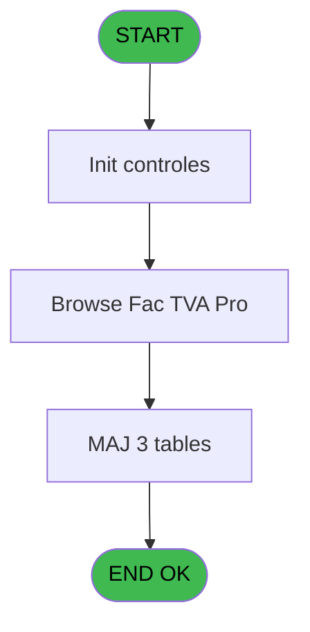
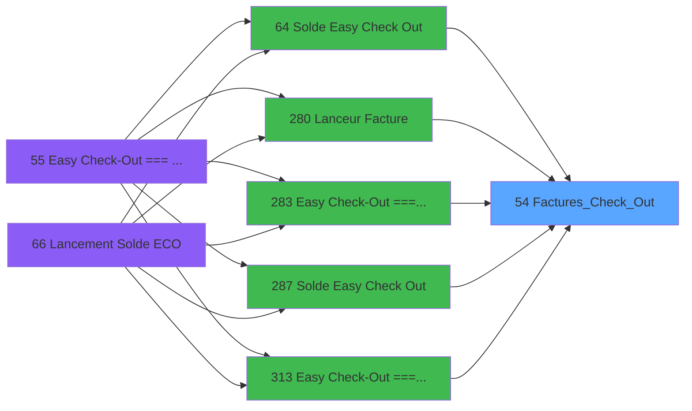
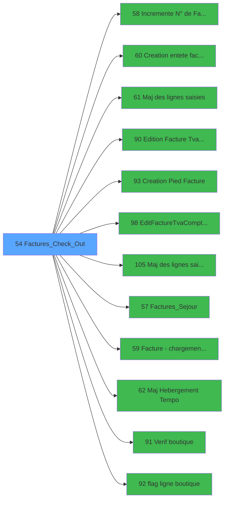

# ADH IDE 54 - Factures_Check_Out

> **Analyse**: Phases 1-4 2026-02-07 03:43 -> 01:49 (22h06min) | Assemblage 01:49
> **Pipeline**: V7.2 Enrichi
> **Structure**: 4 onglets (Resume | Ecrans | Donnees | Connexions)

<!-- TAB:Resume -->

## 1. FICHE D'IDENTITE

| Attribut | Valeur |
|----------|--------|
| Projet | ADH |
| IDE Position | 54 |
| Nom Programme | Factures_Check_Out |
| Fichier source | `Prg_54.xml` |
| Dossier IDE | Facturation |
| Taches | 13 (2 ecrans visibles) |
| Tables modifiees | 3 |
| Programmes appeles | 12 |
| Complexite | **BASSE** (score 29/100) |

## 2. DESCRIPTION FONCTIONNELLE

ADH IDE 54 - Factures_Check_Out gère la création et le suivi des factures lors du processus de clôture de caisse en Easy Check-Out. Ce programme orchestre l'ensemble du workflow facturation : validation des articles saisis, création des numéros séquentiels, génération des en-têtes et pieds de facture, et intégration des données de pied de chambre (hébergement temporaire). Il vérifie également que les articles de boutique sont correctement flaggés avant émission.

Le programme effectue des validations critiques sur l'intégrité des données avant d'émettre les factures. Il contrôle notamment que toutes les lignes de vente ont été correctement traitées, vérifie l'existence des rayons de boutique, et s'assure qu'aucune facture n'a déjà été éditée pour la même transaction. Il gère aussi des cas particuliers comme les hébergements temporaires qui nécessitent une mise à jour spécifique en parallèle de la facturation.

Dépendant de multiples programmes spécialisés (numérotation, édition TVA, pied de facture), ADH IDE 54 joue un rôle de coordinateur qui enchaîne les opérations dans le bon ordre tout en maintenant la cohérence des données de facturation entre le TPE, la comptabilité et les tables de référence boutique.

## 3. BLOCS FONCTIONNELS

### 3.1 Saisie (1 tache)

L'operateur saisit les donnees de la transaction via 1 ecran (Factures Bis(Ventes)).

---

#### 54 - Factures Bis(Ventes) [[ECRAN]](#ecran-t1)

**Role** : Saisie des donnees : Factures Bis(Ventes).
**Ecran** : 881 x 411 DLU | [Voir mockup](#ecran-t1)
**Delegue a** : [Maj des lignes saisies (IDE 61)](ADH-IDE-61.md), [Maj des lignes saisies V3 (IDE 105)](ADH-IDE-105.md), [Factures_Sejour (IDE 57)](ADH-IDE-57.md)

### 3.2 Validation (3 taches)

Controles de coherence : 3 taches verifient les donnees et conditions.

---

#### 54.1 - verif non flaguee

**Role** : Verification : verif non flaguee.
**Variables liees** : FO (V.Existe flaguee ?)
**Delegue a** : [Verif boutique (IDE 91)](ADH-IDE-91.md)

---

#### 54.2.2 - verif boutique

**Role** : Verification : verif boutique.
**Delegue a** : [Verif boutique (IDE 91)](ADH-IDE-91.md)

---

#### 54.4 - verif non flaguee

**Role** : Verification : verif non flaguee.
**Variables liees** : FO (V.Existe flaguee ?)
**Delegue a** : [Verif boutique (IDE 91)](ADH-IDE-91.md)

### 3.3 Traitement (6 taches)

Traitements internes.

---

#### 54.2 - Hebergement [[ECRAN]](#ecran-t3)

**Role** : Traitement : Hebergement.
**Ecran** : 866 x 250 DLU | [Voir mockup](#ecran-t3)
**Variables liees** : FL (V.Date Début Hebergement), FM (V.Date Fin Hebergement)
**Delegue a** : [Incremente N° de Facture (IDE 58)](ADH-IDE-58.md), [Factures_Sejour (IDE 57)](ADH-IDE-57.md), [Facture - chargement boutique (IDE 59)](ADH-IDE-59.md)

---

#### 54.2.1 - Flag All [[ECRAN]](#ecran-t4)

**Role** : Traitement : Flag All.
**Ecran** : 541 x 291 DLU | [Voir mockup](#ecran-t4)
**Variables liees** : FO (V.Existe flaguee ?)
**Delegue a** : [Incremente N° de Facture (IDE 58)](ADH-IDE-58.md), [Factures_Sejour (IDE 57)](ADH-IDE-57.md), [Facture - chargement boutique (IDE 59)](ADH-IDE-59.md)

---

#### 54.5 - chargement boutique

**Role** : Traitement : chargement boutique.
**Delegue a** : [Incremente N° de Facture (IDE 58)](ADH-IDE-58.md), [Factures_Sejour (IDE 57)](ADH-IDE-57.md), [Facture - chargement boutique (IDE 59)](ADH-IDE-59.md)

---

#### 54.6 - SQL parcourt facture [[ECRAN]](#ecran-t9)

**Role** : Traitement : SQL parcourt facture.
**Ecran** : 609 x 195 DLU | [Voir mockup](#ecran-t9)
**Variables liees** : EU (P.i.Facture ECO), EW (V.Lien Pied de facture), EX (V.Existe facture ?), FE (V.Facture Sans Nom), FF (V.Facture Sans Adresse)
**Delegue a** : [Incremente N° de Facture (IDE 58)](ADH-IDE-58.md), [Factures_Sejour (IDE 57)](ADH-IDE-57.md), [Facture - chargement boutique (IDE 59)](ADH-IDE-59.md)

---

#### 54.7 - Browse Fac TVA Pro [[ECRAN]](#ecran-t10)

**Role** : Traitement : Browse Fac TVA Pro.
**Ecran** : 1111 x 0 DLU | [Voir mockup](#ecran-t10)
**Delegue a** : [Incremente N° de Facture (IDE 58)](ADH-IDE-58.md), [Factures_Sejour (IDE 57)](ADH-IDE-57.md), [Facture - chargement boutique (IDE 59)](ADH-IDE-59.md)

---

#### 54.8 - Browse Fact Tempo [[ECRAN]](#ecran-t11)

**Role** : Traitement : Browse Fact Tempo.
**Ecran** : 798 x 316 DLU | [Voir mockup](#ecran-t11)
**Variables liees** : EU (P.i.Facture ECO), EW (V.Lien Pied de facture), EX (V.Existe facture ?), FE (V.Facture Sans Nom), FF (V.Facture Sans Adresse)
**Delegue a** : [Incremente N° de Facture (IDE 58)](ADH-IDE-58.md), [Factures_Sejour (IDE 57)](ADH-IDE-57.md), [Facture - chargement boutique (IDE 59)](ADH-IDE-59.md)

### 3.4 Consultation (1 tache)

Ecrans de recherche et consultation.

---

#### 54.3 - Recherche si Fact déjà éditée

**Role** : Traitement : Recherche si Fact déjà éditée.
**Variables liees** : EU (P.i.Facture ECO), EW (V.Lien Pied de facture), EX (V.Existe facture ?), FE (V.Facture Sans Nom), FF (V.Facture Sans Adresse)

### 3.5 Initialisation (2 taches)

Reinitialisation d'etats et variables de travail.

---

#### 54.9 - RAZ facture ECO

**Role** : Reinitialisation : RAZ facture ECO.
**Variables liees** : EU (P.i.Facture ECO), EW (V.Lien Pied de facture), EX (V.Existe facture ?), FE (V.Facture Sans Nom), FF (V.Facture Sans Adresse)

---

#### 54.9.1 - Raz détail facture

**Role** : Reinitialisation : Raz détail facture.
**Variables liees** : EU (P.i.Facture ECO), EW (V.Lien Pied de facture), EX (V.Existe facture ?), FE (V.Facture Sans Nom), FF (V.Facture Sans Adresse)

## 5. REGLES METIER

6 regles identifiees:

### Autres (6 regles)

#### [RM-001] Si [BP] alors Trim([BS]) sinon Trim(V.Service [W])&' '&Trim(V.Fact déjà editée [X]))

| Element | Detail |
|---------|--------|
| **Condition** | `[BP]` |
| **Si vrai** | Trim([BS]) |
| **Si faux** | Trim(V.Service [W])&' '&Trim(V.Fact déjà editée [X])) |
| **Variables** | FJ (V.Service), FK (V.Fact déjà editée) |
| **Expression source** | Expression 6 : `IF([BP],Trim([BS]),Trim(V.Service [W])&' '&Trim(V.Fact déjà ` |
| **Exemple** | Si [BP] → Trim([BS]). Sinon → Trim(V.Service [W])&' '&Trim(V.Fact déjà editée [X])) |

#### [RM-002] Si Trim(P.i.chemin [F]) <> '' alors Trim(P.i.chemin [F]) & Trim([CG]) sinon Translate ('%club_exportdata%')&'PDF\'&Trim([CG]))

| Element | Detail |
|---------|--------|
| **Condition** | `Trim(P.i.chemin [F]) <> ''` |
| **Si vrai** | Trim(P.i.chemin [F]) & Trim([CG]) |
| **Si faux** | Translate ('%club_exportdata%')&'PDF\'&Trim([CG])) |
| **Variables** | ES (P.i.chemin) |
| **Expression source** | Expression 23 : `IF(Trim(P.i.chemin [F]) <> '',Trim(P.i.chemin [F]) & Trim([C` |
| **Exemple** | Si Trim(P.i.chemin [F]) <> '' → Trim(P.i.chemin [F]) & Trim([CG]). Sinon → Translate ('%club_exportdata%')&'PDF\'&Trim([CG])) |

#### [RM-003] Condition: Trim([BX]) different de

| Element | Detail |
|---------|--------|
| **Condition** | `Trim([BX])<>''` |
| **Si vrai** | Action si vrai |
| **Expression source** | Expression 27 : `Trim([BX])<>''` |
| **Exemple** | Si Trim([BX])<>'' → Action si vrai |

#### [RM-004] Negation de [BP] (condition inversee)

| Element | Detail |
|---------|--------|
| **Condition** | `NOT [BP]` |
| **Si vrai** | Action si vrai |
| **Expression source** | Expression 30 : `NOT [BP]` |
| **Exemple** | Si NOT [BP] → Action si vrai |

#### [RM-005] Si Trim(P.i.TypeReglement [G]) vaut 'I' alors 'D', sinon 'I'

| Element | Detail |
|---------|--------|
| **Condition** | `Trim(P.i.TypeReglement [G])='I'` |
| **Si vrai** | 'D' |
| **Si faux** | 'I') |
| **Variables** | ET (P.i.TypeReglement) |
| **Expression source** | Expression 34 : `IF(Trim(P.i.TypeReglement [G])='I','D','I')` |
| **Exemple** | Si Trim(P.i.TypeReglement [G])='I' → 'D'. Sinon → 'I') |

#### [RM-006] Condition: [BN] different de 0

| Element | Detail |
|---------|--------|
| **Condition** | `[BN]<>0` |
| **Si vrai** | Action si vrai |
| **Expression source** | Expression 38 : `[BN]<>0` |
| **Exemple** | Si [BN]<>0 → Action si vrai |

## 6. CONTEXTE

- **Appele par**: [Easy Check-Out === V2.00 (IDE 283)](ADH-IDE-283.md), [Solde Easy Check Out (IDE 64)](ADH-IDE-64.md), [Lanceur Facture (IDE 280)](ADH-IDE-280.md), [Solde Easy Check Out (IDE 287)](ADH-IDE-287.md), [Easy Check-Out === V2.00 (IDE 313)](ADH-IDE-313.md)
- **Appelle**: 12 programmes | **Tables**: 8 (W:3 R:4 L:6) | **Taches**: 13 | **Expressions**: 40

<!-- TAB:Ecrans -->

## 8. ECRANS

### 8.1 Forms visibles (2 / 13)

| # | Position | Tache | Nom | Type | Largeur | Hauteur | Bloc |
|---|----------|-------|-----|------|---------|---------|------|
| 1 | 54.7 | 54.7 | Browse Fac TVA Pro | Type0 | 1111 | 0 | Traitement |
| 2 | 54.8 | 54.8 | Browse Fact Tempo | Type0 | 798 | 316 | Traitement |

### 8.2 Mockups Ecrans

---

#### 54.7 - Browse Fac TVA Pro
**Tache** : [54.7](#t10) | **Type** : Type0 | **Dimensions** : 1111 x 0 DLU
**Bloc** : Traitement | **Titre IDE** : Browse Fac TVA Pro

<!-- FORM-DATA:
{
    "width":  1111,
    "vFactor":  8,
    "type":  "Type0",
    "hFactor":  4,
    "controls":  [
                     {
                         "x":  8,
                         "type":  "table",
                         "var":  "",
                         "name":  "",
                         "titleH":  12,
                         "color":  "",
                         "w":  3378,
                         "y":  8,
                         "fmt":  "",
                         "parent":  null,
                         "text":  "",
                         "rowH":  13,
                         "h":  182,
                         "cols":  [
                                      {
                                          "title":  "societe",
                                          "layer":  1,
                                          "w":  30
                                      },
                                      {
                                          "title":  "service",
                                          "layer":  2,
                                          "w":  122
                                      },
                                      {
                                          "title":  "compte_gm",
                                          "layer":  3,
                                          "w":  49
                                      },
                                      {
                                          "title":  "filiation",
                                          "layer":  4,
                                          "w":  29
                                      },
                                      {
                                          "title":  "date",
                                          "layer":  5,
                                          "w":  68
                                      },
                                      {
                                          "title":  "row_id_vente",
                                          "layer":  6,
                                          "w":  54
                                      },
                                      {
                                          "title":  "Article",
                                          "layer":  7,
                                          "w":  49
                                      },
                                      {
                                          "title":  "flag",
                                          "layer":  8,
                                          "w":  38
                                      },
                                      {
                                          "title":  "utilisateur",
                                          "layer":  9,
                                          "w":  66
                                      },
                                      {
                                          "title":  "num_facture",
                                          "layer":  10,
                                          "w":  58
                                      },
                                      {
                                          "title":  "date_edition",
                                          "layer":  11,
                                          "w":  68
                                      },
                                      {
                                          "title":  "nom_fichier_facture",
                                          "layer":  12,
                                          "w":  570
                                      },
                                      {
                                          "title":  "avec_nom",
                                          "layer":  13,
                                          "w":  43
                                      },
                                      {
                                          "title":  "avec_adresse",
                                          "layer":  14,
                                          "w":  57
                                      },
                                      {
                                          "title":  "pu_ttc",
                                          "layer":  15,
                                          "w":  92
                                      },
                                      {
                                          "title":  "montant_remise",
                                          "layer":  16,
                                          "w":  92
                                      },
                                      {
                                          "title":  "pu_net",
                                          "layer":  17,
                                          "w":  92
                                      },
                                      {
                                          "title":  "pu_ht",
                                          "layer":  18,
                                          "w":  92
                                      },
                                      {
                                          "title":  "tva",
                                          "layer":  19,
                                          "w":  44
                                      },
                                      {
                                          "title":  "total_ht",
                                          "layer":  20,
                                          "w":  92
                                      },
                                      {
                                          "title":  "total_ttc",
                                          "layer":  21,
                                          "w":  92
                                      },
                                      {
                                          "title":  "qte",
                                          "layer":  22,
                                          "w":  25
                                      },
                                      {
                                          "title":  "designation",
                                          "layer":  23,
                                          "w":  850
                                      },
                                      {
                                          "title":  "date_vente",
                                          "layer":  24,
                                          "w":  68
                                      },
                                      {
                                          "title":  "date_debut_sejour",
                                          "layer":  25,
                                          "w":  74
                                      },
                                      {
                                          "title":  "date_fin_sejour",
                                          "layer":  26,
                                          "w":  68
                                      },
                                      {
                                          "title":  "row_id_bout",
                                          "layer":  27,
                                          "w":  53
                                      },
                                      {
                                          "title":  "code_application",
                                          "layer":  28,
                                          "w":  68
                                      },
                                      {
                                          "title":  "pourcent_remise",
                                          "layer":  29,
                                          "w":  66
                                      },
                                      {
                                          "title":  "time_edition",
                                          "layer":  30,
                                          "w":  53
                                      },
                                      {
                                          "title":  "Flag_selection_manuelle",
                                          "layer":  31,
                                          "w":  96
                                      },
                                      {
                                          "title":  "code_type",
                                          "layer":  32,
                                          "w":  43
                                      }
                                  ],
                         "rows":  32
                     },
                     {
                         "x":  12,
                         "type":  "edit",
                         "var":  "",
                         "y":  23,
                         "w":  9,
                         "fmt":  "",
                         "name":  "societe",
                         "h":  10,
                         "color":  "",
                         "text":  "",
                         "parent":  1
                     },
                     {
                         "x":  42,
                         "type":  "edit",
                         "var":  "",
                         "y":  23,
                         "w":  115,
                         "fmt":  "",
                         "name":  "service",
                         "h":  10,
                         "color":  "",
                         "text":  "",
                         "parent":  1
                     },
                     {
                         "x":  164,
                         "type":  "edit",
                         "var":  "",
                         "y":  23,
                         "w":  42,
                         "fmt":  "",
                         "name":  "compte_gm",
                         "h":  10,
                         "color":  "",
                         "text":  "",
                         "parent":  1
                     },
                     {
                         "x":  213,
                         "type":  "edit",
                         "var":  "",
                         "y":  23,
                         "w":  18,
                         "fmt":  "",
                         "name":  "filiation",
                         "h":  10,
                         "color":  "",
                         "text":  "",
                         "parent":  1
                     },
                     {
                         "x":  242,
                         "type":  "edit",
                         "var":  "",
                         "y":  23,
                         "w":  61,
                         "fmt":  "",
                         "name":  "date",
                         "h":  10,
                         "color":  "",
                         "text":  "",
                         "parent":  1
                     },
                     {
                         "x":  310,
                         "type":  "edit",
                         "var":  "",
                         "y":  23,
                         "w":  46,
                         "fmt":  "",
                         "name":  "row_id_vente",
                         "h":  10,
                         "color":  "",
                         "text":  "",
                         "parent":  1
                     },
                     {
                         "x":  364,
                         "type":  "edit",
                         "var":  "",
                         "y":  23,
                         "w":  42,
                         "fmt":  "",
                         "name":  "Article",
                         "h":  10,
                         "color":  "",
                         "text":  "",
                         "parent":  1
                     },
                     {
                         "x":  413,
                         "type":  "edit",
                         "var":  "",
                         "y":  23,
                         "w":  31,
                         "fmt":  "",
                         "name":  "flag",
                         "h":  10,
                         "color":  "",
                         "text":  "",
                         "parent":  1
                     },
                     {
                         "x":  451,
                         "type":  "edit",
                         "var":  "",
                         "y":  23,
                         "w":  59,
                         "fmt":  "",
                         "name":  "utilisateur",
                         "h":  10,
                         "color":  "",
                         "text":  "",
                         "parent":  1
                     },
                     {
                         "x":  517,
                         "type":  "edit",
                         "var":  "",
                         "y":  23,
                         "w":  51,
                         "fmt":  "",
                         "name":  "num_facture",
                         "h":  10,
                         "color":  "",
                         "text":  "",
                         "parent":  1
                     },
                     {
                         "x":  575,
                         "type":  "edit",
                         "var":  "",
                         "y":  23,
                         "w":  61,
                         "fmt":  "",
                         "name":  "date_edition",
                         "h":  10,
                         "color":  "",
                         "text":  "",
                         "parent":  1
                     },
                     {
                         "x":  643,
                         "type":  "edit",
                         "var":  "",
                         "y":  23,
                         "w":  563,
                         "fmt":  "",
                         "name":  "nom_fichier_facture",
                         "h":  10,
                         "color":  "",
                         "text":  "",
                         "parent":  1
                     },
                     {
                         "x":  1213,
                         "type":  "edit",
                         "var":  "",
                         "y":  23,
                         "w":  31,
                         "fmt":  "",
                         "name":  "avec_nom",
                         "h":  10,
                         "color":  "",
                         "text":  "",
                         "parent":  1
                     },
                     {
                         "x":  1256,
                         "type":  "edit",
                         "var":  "",
                         "y":  23,
                         "w":  31,
                         "fmt":  "",
                         "name":  "avec_adresse",
                         "h":  10,
                         "color":  "",
                         "text":  "",
                         "parent":  1
                     },
                     {
                         "x":  1313,
                         "type":  "edit",
                         "var":  "",
                         "y":  23,
                         "w":  85,
                         "fmt":  "",
                         "name":  "pu_ttc",
                         "h":  10,
                         "color":  "",
                         "text":  "",
                         "parent":  1
                     },
                     {
                         "x":  1405,
                         "type":  "edit",
                         "var":  "",
                         "y":  23,
                         "w":  85,
                         "fmt":  "",
                         "name":  "montant_remise",
                         "h":  10,
                         "color":  "",
                         "text":  "",
                         "parent":  1
                     },
                     {
                         "x":  1497,
                         "type":  "edit",
                         "var":  "",
                         "y":  23,
                         "w":  85,
                         "fmt":  "",
                         "name":  "pu_net",
                         "h":  10,
                         "color":  "",
                         "text":  "",
                         "parent":  1
                     },
                     {
                         "x":  1589,
                         "type":  "edit",
                         "var":  "",
                         "y":  23,
                         "w":  85,
                         "fmt":  "",
                         "name":  "pu_ht",
                         "h":  10,
                         "color":  "",
                         "text":  "",
                         "parent":  1
                     },
                     {
                         "x":  1681,
                         "type":  "edit",
                         "var":  "",
                         "y":  23,
                         "w":  37,
                         "fmt":  "",
                         "name":  "tva",
                         "h":  10,
                         "color":  "",
                         "text":  "",
                         "parent":  1
                     },
                     {
                         "x":  1725,
                         "type":  "edit",
                         "var":  "",
                         "y":  23,
                         "w":  85,
                         "fmt":  "",
                         "name":  "total_ht",
                         "h":  10,
                         "color":  "",
                         "text":  "",
                         "parent":  1
                     },
                     {
                         "x":  1817,
                         "type":  "edit",
                         "var":  "",
                         "y":  23,
                         "w":  85,
                         "fmt":  "",
                         "name":  "total_ttc",
                         "h":  10,
                         "color":  "",
                         "text":  "",
                         "parent":  1
                     },
                     {
                         "x":  1909,
                         "type":  "edit",
                         "var":  "",
                         "y":  23,
                         "w":  18,
                         "fmt":  "",
                         "name":  "qte",
                         "h":  10,
                         "color":  "",
                         "text":  "",
                         "parent":  1
                     },
                     {
                         "x":  1934,
                         "type":  "edit",
                         "var":  "",
                         "y":  23,
                         "w":  843,
                         "fmt":  "",
                         "name":  "designation",
                         "h":  10,
                         "color":  "",
                         "text":  "",
                         "parent":  1
                     },
                     {
                         "x":  2784,
                         "type":  "edit",
                         "var":  "",
                         "y":  23,
                         "w":  61,
                         "fmt":  "",
                         "name":  "date_vente",
                         "h":  10,
                         "color":  "",
                         "text":  "",
                         "parent":  1
                     },
                     {
                         "x":  2852,
                         "type":  "edit",
                         "var":  "",
                         "y":  23,
                         "w":  61,
                         "fmt":  "",
                         "name":  "date_debut_sejour",
                         "h":  10,
                         "color":  "",
                         "text":  "",
                         "parent":  1
                     },
                     {
                         "x":  2926,
                         "type":  "edit",
                         "var":  "",
                         "y":  23,
                         "w":  61,
                         "fmt":  "",
                         "name":  "date_fin_sejour",
                         "h":  10,
                         "color":  "",
                         "text":  "",
                         "parent":  1
                     },
                     {
                         "x":  2994,
                         "type":  "edit",
                         "var":  "",
                         "y":  23,
                         "w":  46,
                         "fmt":  "",
                         "name":  "row_id_bout",
                         "h":  10,
                         "color":  "",
                         "text":  "",
                         "parent":  1
                     },
                     {
                         "x":  3047,
                         "type":  "edit",
                         "var":  "",
                         "y":  23,
                         "w":  9,
                         "fmt":  "",
                         "name":  "code_application",
                         "h":  10,
                         "color":  "",
                         "text":  "",
                         "parent":  1
                     },
                     {
                         "x":  3115,
                         "type":  "edit",
                         "var":  "",
                         "y":  23,
                         "w":  37,
                         "fmt":  "",
                         "name":  "pourcent_remise",
                         "h":  10,
                         "color":  "",
                         "text":  "",
                         "parent":  1
                     },
                     {
                         "x":  3181,
                         "type":  "edit",
                         "var":  "",
                         "y":  23,
                         "w":  46,
                         "fmt":  "",
                         "name":  "time_edition",
                         "h":  10,
                         "color":  "",
                         "text":  "",
                         "parent":  1
                     },
                     {
                         "x":  3234,
                         "type":  "edit",
                         "var":  "",
                         "y":  23,
                         "w":  31,
                         "fmt":  "",
                         "name":  "Flag_selection_manuelle",
                         "h":  10,
                         "color":  "",
                         "text":  "",
                         "parent":  1
                     },
                     {
                         "x":  3330,
                         "type":  "edit",
                         "var":  "",
                         "y":  23,
                         "w":  9,
                         "fmt":  "",
                         "name":  "code_type",
                         "h":  10,
                         "color":  "",
                         "text":  "",
                         "parent":  1
                     }
                 ],
    "taskId":  "54.7",
    "height":  0
}
-->

<strong>Champs : 32 champs</strong>

| Pos (x,y) | Nom | Variable | Type |
|-----------|-----|----------|------|
| 12,23 | societe | - | edit |
| 42,23 | service | - | edit |
| 164,23 | compte_gm | - | edit |
| 213,23 | filiation | - | edit |
| 242,23 | date | - | edit |
| 310,23 | row_id_vente | - | edit |
| 364,23 | Article | - | edit |
| 413,23 | flag | - | edit |
| 451,23 | utilisateur | - | edit |
| 517,23 | num_facture | - | edit |
| 575,23 | date_edition | - | edit |
| 643,23 | nom_fichier_facture | - | edit |
| 1213,23 | avec_nom | - | edit |
| 1256,23 | avec_adresse | - | edit |
| 1313,23 | pu_ttc | - | edit |
| 1405,23 | montant_remise | - | edit |
| 1497,23 | pu_net | - | edit |
| 1589,23 | pu_ht | - | edit |
| 1681,23 | tva | - | edit |
| 1725,23 | total_ht | - | edit |
| 1817,23 | total_ttc | - | edit |
| 1909,23 | qte | - | edit |
| 1934,23 | designation | - | edit |
| 2784,23 | date_vente | - | edit |
| 2852,23 | date_debut_sejour | - | edit |
| 2926,23 | date_fin_sejour | - | edit |
| 2994,23 | row_id_bout | - | edit |
| 3047,23 | code_application | - | edit |
| 3115,23 | pourcent_remise | - | edit |
| 3181,23 | time_edition | - | edit |
| 3234,23 | Flag_selection_manuelle | - | edit |
| 3330,23 | code_type | - | edit |

---

#### 54.8 - Browse Fact Tempo
**Tache** : [54.8](#t11) | **Type** : Type0 | **Dimensions** : 798 x 316 DLU
**Bloc** : Traitement | **Titre IDE** : Browse Fact Tempo

<!-- FORM-DATA:
{
    "width":  798,
    "vFactor":  8,
    "type":  "Type0",
    "hFactor":  4,
    "controls":  [
                     {
                         "x":  4,
                         "type":  "table",
                         "var":  "",
                         "name":  "",
                         "titleH":  12,
                         "color":  "",
                         "w":  970,
                         "y":  8,
                         "fmt":  "",
                         "parent":  null,
                         "text":  "",
                         "rowH":  13,
                         "h":  184,
                         "cols":  [
                                      {
                                          "title":  "lg_ven_compte_gm",
                                          "layer":  1,
                                          "w":  78
                                      },
                                      {
                                          "title":  "lg_ven_filiation",
                                          "layer":  2,
                                          "w":  59
                                      },
                                      {
                                          "title":  "lg_ven_imputation",
                                          "layer":  3,
                                          "w":  72
                                      },
                                      {
                                          "title":  "lg_ven_sous_imputation",
                                          "layer":  4,
                                          "w":  94
                                      },
                                      {
                                          "title":  "lg_ven_libelle",
                                          "layer":  5,
                                          "w":  191
                                      },
                                      {
                                          "title":  "lg_ven_libelle_supplem_",
                                          "layer":  6,
                                          "w":  95
                                      },
                                      {
                                          "title":  "lg_ven_mode_de_paiement",
                                          "layer":  7,
                                          "w":  108
                                      },
                                      {
                                          "title":  "lg_ven_montant",
                                          "layer":  8,
                                          "w":  101
                                      },
                                      {
                                          "title":  "lg_ven_date_comptable",
                                          "layer":  9,
                                          "w":  94
                                      },
                                      {
                                          "title":  "lg_ven_service",
                                          "layer":  10,
                                          "w":  61
                                      }
                                  ],
                         "rows":  10
                     },
                     {
                         "x":  8,
                         "type":  "edit",
                         "var":  "",
                         "y":  23,
                         "w":  42,
                         "fmt":  "",
                         "name":  "lg_ven_compte_gm",
                         "h":  10,
                         "color":  "",
                         "text":  "",
                         "parent":  1
                     },
                     {
                         "x":  86,
                         "type":  "edit",
                         "var":  "",
                         "y":  23,
                         "w":  18,
                         "fmt":  "",
                         "name":  "lg_ven_filiation",
                         "h":  10,
                         "color":  "",
                         "text":  "",
                         "parent":  1
                     },
                     {
                         "x":  145,
                         "type":  "edit",
                         "var":  "",
                         "y":  23,
                         "w":  51,
                         "fmt":  "",
                         "name":  "lg_ven_imputation",
                         "h":  10,
                         "color":  "",
                         "text":  "",
                         "parent":  1
                     },
                     {
                         "x":  217,
                         "type":  "edit",
                         "var":  "",
                         "y":  23,
                         "w":  18,
                         "fmt":  "",
                         "name":  "lg_ven_sous_imputation",
                         "h":  10,
                         "color":  "",
                         "text":  "",
                         "parent":  1
                     },
                     {
                         "x":  311,
                         "type":  "edit",
                         "var":  "",
                         "y":  23,
                         "w":  188,
                         "fmt":  "",
                         "name":  "lg_ven_libelle",
                         "h":  10,
                         "color":  "",
                         "text":  "",
                         "parent":  1
                     },
                     {
                         "x":  502,
                         "type":  "edit",
                         "var":  "",
                         "y":  23,
                         "w":  87,
                         "fmt":  "",
                         "name":  "lg_ven_libelle_supplem_",
                         "h":  10,
                         "color":  "",
                         "text":  "",
                         "parent":  1
                     },
                     {
                         "x":  597,
                         "type":  "edit",
                         "var":  "",
                         "y":  23,
                         "w":  26,
                         "fmt":  "",
                         "name":  "lg_ven_mode_de_paiement",
                         "h":  10,
                         "color":  "",
                         "text":  "",
                         "parent":  1
                     },
                     {
                         "x":  705,
                         "type":  "edit",
                         "var":  "",
                         "y":  23,
                         "w":  94,
                         "fmt":  "",
                         "name":  "lg_ven_montant",
                         "h":  10,
                         "color":  "",
                         "text":  "",
                         "parent":  1
                     },
                     {
                         "x":  806,
                         "type":  "edit",
                         "var":  "",
                         "y":  23,
                         "w":  61,
                         "fmt":  "",
                         "name":  "lg_ven_date_comptable",
                         "h":  10,
                         "color":  "",
                         "text":  "",
                         "parent":  1
                     },
                     {
                         "x":  900,
                         "type":  "edit",
                         "var":  "",
                         "y":  23,
                         "w":  26,
                         "fmt":  "",
                         "name":  "lg_ven_service",
                         "h":  10,
                         "color":  "",
                         "text":  "",
                         "parent":  1
                     }
                 ],
    "taskId":  "54.8",
    "height":  316
}
-->

<strong>Champs : 10 champs</strong>

| Pos (x,y) | Nom | Variable | Type |
|-----------|-----|----------|------|
| 8,23 | lg_ven_compte_gm | - | edit |
| 86,23 | lg_ven_filiation | - | edit |
| 145,23 | lg_ven_imputation | - | edit |
| 217,23 | lg_ven_sous_imputation | - | edit |
| 311,23 | lg_ven_libelle | - | edit |
| 502,23 | lg_ven_libelle_supplem_ | - | edit |
| 597,23 | lg_ven_mode_de_paiement | - | edit |
| 705,23 | lg_ven_montant | - | edit |
| 806,23 | lg_ven_date_comptable | - | edit |
| 900,23 | lg_ven_service | - | edit |

## 9. NAVIGATION

### 9.1 Enchainement des ecrans

```mermaid
flowchart TD
    START([Entree])
    style START fill:#3fb950
    VF10[54.7 Browse Fac TVA Pro]
    style VF10 fill:#58a6ff
    VF11[54.8 Browse Fact Tempo]
    style VF11 fill:#58a6ff
    EXT58[IDE 58 Incremente N° d...]
    style EXT58 fill:#3fb950
    EXT60[IDE 60 Creation entete...]
    style EXT60 fill:#3fb950
    EXT61[IDE 61 Maj des lignes ...]
    style EXT61 fill:#3fb950
    EXT90[IDE 90 Edition Facture...]
    style EXT90 fill:#3fb950
    EXT93[IDE 93 Creation Pied F...]
    style EXT93 fill:#3fb950
    EXT98[IDE 98 EditFactureTvaC...]
    style EXT98 fill:#3fb950
    EXT105[IDE 105 Maj des lignes...]
    style EXT105 fill:#3fb950
    EXT57[IDE 57 Factures_Sejour]
    style EXT57 fill:#3fb950
    EXT59[IDE 59 Facture - charg...]
    style EXT59 fill:#3fb950
    EXT62[IDE 62 Maj Hebergement...]
    style EXT62 fill:#3fb950
    EXT91[IDE 91 Verif boutique]
    style EXT91 fill:#3fb950
    EXT92[IDE 92 flag ligne bout...]
    style EXT92 fill:#3fb950
    FIN([Sortie])
    style FIN fill:#f85149
    START --> VF10
    VF10 -->|Sous-programme| EXT58
    VF10 -->|Sous-programme| EXT60
    VF10 -->|Mise a jour donnees| EXT61
    VF10 -->|Impression ticket/document| EXT90
    VF10 -->|Sous-programme| EXT93
    VF10 -->|Sous-programme| EXT98
    VF10 -->|Mise a jour donnees| EXT105
    VF10 -->|Sous-programme| EXT57
    EXT92 --> FIN
```

**Detail par enchainement :**

| Depuis | Action | Vers | Retour |
|--------|--------|------|--------|
| Browse Fac TVA Pro | Sous-programme | [Incremente N° de Facture (IDE 58)](ADH-IDE-58.md) | Retour ecran |
| Browse Fac TVA Pro | Sous-programme | [Creation entete facture (IDE 60)](ADH-IDE-60.md) | Retour ecran |
| Browse Fac TVA Pro | Mise a jour donnees | [Maj des lignes saisies (IDE 61)](ADH-IDE-61.md) | Retour ecran |
| Browse Fac TVA Pro | Impression ticket/document | [Edition Facture Tva(Compta&Ve) (IDE 90)](ADH-IDE-90.md) | Retour ecran |
| Browse Fac TVA Pro | Sous-programme | [Creation Pied Facture (IDE 93)](ADH-IDE-93.md) | Retour ecran |
| Browse Fac TVA Pro | Sous-programme | [EditFactureTva(Compta&Ve) V3 (IDE 98)](ADH-IDE-98.md) | Retour ecran |
| Browse Fac TVA Pro | Mise a jour donnees | [Maj des lignes saisies V3 (IDE 105)](ADH-IDE-105.md) | Retour ecran |
| Browse Fac TVA Pro | Sous-programme | [Factures_Sejour (IDE 57)](ADH-IDE-57.md) | Retour ecran |
| Browse Fac TVA Pro | Sous-programme | [Facture - chargement boutique (IDE 59)](ADH-IDE-59.md) | Retour ecran |
| Browse Fac TVA Pro | Mise a jour donnees | [Maj Hebergement Tempo (IDE 62)](ADH-IDE-62.md) | Retour ecran |
| Browse Fac TVA Pro | Controle/validation | [Verif boutique (IDE 91)](ADH-IDE-91.md) | Retour ecran |
| Browse Fac TVA Pro | Sous-programme | [flag ligne boutique (IDE 92)](ADH-IDE-92.md) | Retour ecran |

### 9.3 Structure hierarchique (13 taches)

| Position | Tache | Type | Dimensions | Bloc |
|----------|-------|------|------------|------|
| **54.1** | [**Factures Bis(Ventes)** (54)](#t1) [mockup](#ecran-t1) | - | 881x411 | Saisie |
| **54.2** | [**verif non flaguee** (54.1)](#t2) | - | - | Validation |
| 54.2.1 | [verif boutique (54.2.2)](#t5) | - | - | |
| 54.2.2 | [verif non flaguee (54.4)](#t7) | - | - | |
| **54.3** | [**Hebergement** (54.2)](#t3) [mockup](#ecran-t3) | - | 866x250 | Traitement |
| 54.3.1 | [Flag All (54.2.1)](#t4) [mockup](#ecran-t4) | - | 541x291 | |
| 54.3.2 | [chargement boutique (54.5)](#t8) | - | - | |
| 54.3.3 | [SQL parcourt facture (54.6)](#t9) [mockup](#ecran-t9) | - | 609x195 | |
| 54.3.4 | [Browse Fac TVA Pro (54.7)](#t10) [mockup](#ecran-t10) | - | 1111x0 | |
| 54.3.5 | [Browse Fact Tempo (54.8)](#t11) [mockup](#ecran-t11) | - | 798x316 | |
| **54.4** | [**Recherche si Fact déjà éditée** (54.3)](#t6) | - | - | Consultation |
| **54.5** | [**RAZ facture ECO** (54.9)](#t12) | - | - | Initialisation |
| 54.5.1 | [Raz détail facture (54.9.1)](#t13) | - | - | |

### 9.4 Algorigramme

> **Legende**: Vert = START/END OK | Rouge = END KO | Bleu = Decisions
> *Algorigramme auto-genere. Utiliser `/algorigramme` pour une synthese metier detaillee.*

<!-- TAB:Donnees -->

## 10. TABLES

### Tables utilisees (8)

| ID | Nom | Description | Type | R | W | L | Usages |
|----|-----|-------------|------|---|---|---|--------|
| 866 | maj_appli_tpe |  | DB | R | **W** | L | 8 |
| 870 | Rayons_Boutique |  | DB | R | **W** | L | 5 |
| 932 | taxe_add_param |  | DB |   | **W** | L | 2 |
| 867 | log_maj_tpe |  | DB | R |   |   | 1 |
| 868 | Affectation_Gift_Pass |  | DB | R |   |   | 1 |
| 31 | gm-complet_______gmc |  | DB |   |   | L | 1 |
| 372 | pv_budget |  | DB |   |   | L | 1 |
| 30 | gm-recherche_____gmr | Index de recherche | DB |   |   | L | 1 |

### Colonnes par table (4 / 5 tables avec colonnes identifiees)

Table 866 - maj_appli_tpe (R/**W**/L) - 8 usages

| Lettre | Variable | Acces | Type |
|--------|----------|-------|------|
| A | V.Pu TTC | W | Numeric |
| B | V.Montant Remise | W | Numeric |
| C | V.Pu Net | W | Numeric |
| D | V.Pu HT | W | Numeric |
| E | V.Tva | W | Numeric |
| F | v.Total Tva | W | Numeric |
| G | V.Total HT | W | Numeric |
| H | V.Total TTC | W | Numeric |

Table 870 - Rayons_Boutique (R/**W**/L) - 5 usages

| Lettre | Variable | Acces | Type |
|--------|----------|-------|------|
| EN | v.Existe ligne boutique ? | W | Logical |
| ER | V.Boutique manquante ? | W | Logical |

Table 932 - taxe_add_param (**W**/L) - 2 usages

*Table utilisee uniquement en Link ou aucune colonne Real identifiee dans le DataView.*

Table 867 - log_maj_tpe (R) - 1 usages

| Lettre | Variable | Acces | Type |
|--------|----------|-------|------|
| A | P.i.Societe | R | Alpha |
| B | P.i.Code_Gm | R | Numeric |
| C | P.i.Filiation | R | Numeric |
| D | P.i.Application | R | Alpha |
| E | P.o.NomsPDF | R | Alpha |
| F | P.i.chemin | R | Alpha |
| G | P.i.TypeReglement | R | Unicode |
| H | P.i.Facture ECO | R | Logical |
| I | V.Lien Gm_Complet | R | Logical |
| J | V.Lien Pied de facture | R | Logical |
| K | V.Existe facture ? | R | Logical |
| L | V.Nom | R | Alpha |
| M | V.Adresse | R | Alpha |
| N | V.CP | R | Alpha |
| O | V.Ville | R | Alpha |
| P | V.Pays | R | Unicode |
| Q | V.Telephone | R | Alpha |
| R | V.Facture Sans Nom | R | Logical |
| S | V.Facture Sans Adresse | R | Logical |
| T | V.No Facture | R | Numeric |
| U | V.Nom Fichier PDF | R | Alpha |
| V | V.Pos , | R | Numeric |
| W | V.Service | R | Alpha |
| X | V.Fact déjà editée | R | Logical |
| Y | V.Date Début Hebergement | R | Date |
| Z | V.Date Fin Hebergement | R | Date |
| BA | V.Existe non facturee ? | R | Logical |
| BB | V.Existe flaguee ? | R | Logical |

Table 868 - Affectation_Gift_Pass (R) - 1 usages

| Lettre | Variable | Acces | Type |
|--------|----------|-------|------|
| A | P.Société | R | Alpha |
| B | P.Num compte | R | Numeric |
| C | P.Fliliation | R | Numeric |
| D | V Flag | R | Logical |
| E | V.Boutique manquante ? | R | Logical |

## 11. VARIABLES

### 11.1 Parametres entrants (8)

Variables recues du programme appelant ([Easy Check-Out === V2.00 (IDE 283)](ADH-IDE-283.md)).

| Lettre | Nom | Type | Usage dans |
|--------|-----|------|-----------|
| EN | P.i.Societe | Alpha | 1x parametre entrant |
| EO | P.i.Code_Gm | Numeric | 3x parametre entrant |
| EP | P.i.Filiation | Numeric | 3x parametre entrant |
| EQ | P.i.Application | Alpha | - |
| ER | P.o.NomsPDF | Alpha | 1x parametre entrant |
| ES | P.i.chemin | Alpha | 1x parametre entrant |
| ET | P.i.TypeReglement | Unicode | 1x parametre entrant |
| EU | P.i.Facture ECO | Logical | - |

### 11.2 Variables de session (20)

Variables persistantes pendant toute la session.

| Lettre | Nom | Type | Usage dans |
|--------|-----|------|-----------|
| EV | V.Lien Gm_Complet | Logical | - |
| EW | V.Lien Pied de facture | Logical | [54](#t1), [54.6](#t9), [54.9](#t12) |
| EX | V.Existe facture ? | Logical | [54](#t1), [54.6](#t9), [54.9](#t12) |
| EY | V.Nom | Alpha | 1x session |
| EZ | V.Adresse | Alpha | - |
| FA | V.CP | Alpha | 1x session |
| FB | V.Ville | Alpha | - |
| FC | V.Pays | Unicode | - |
| FD | V.Telephone | Alpha | - |
| FE | V.Facture Sans Nom | Logical | - |
| FF | V.Facture Sans Adresse | Logical | 1x session |
| FG | V.No Facture | Numeric | [54](#t1), [54.6](#t9), [54.9](#t12) |
| FH | V.Nom Fichier PDF | Alpha | 1x session |
| FI | V.Pos , | Numeric | 1x session |
| FJ | V.Service | Alpha | 1x session |
| FK | V.Fact déjà editée | Logical | [54.3](#t6) |
| FL | V.Date Début Hebergement | Date | [54.2](#t3) |
| FM | V.Date Fin Hebergement | Date | - |
| FN | V.Existe non facturee ? | Logical | 1x session |
| FO | V.Existe flaguee ? | Logical | - |

Toutes les 28 variables (liste complete)

| Cat | Lettre | Nom Variable | Type |
|-----|--------|--------------|------|
| P0 | **EN** | P.i.Societe | Alpha |
| P0 | **EO** | P.i.Code_Gm | Numeric |
| P0 | **EP** | P.i.Filiation | Numeric |
| P0 | **EQ** | P.i.Application | Alpha |
| P0 | **ER** | P.o.NomsPDF | Alpha |
| P0 | **ES** | P.i.chemin | Alpha |
| P0 | **ET** | P.i.TypeReglement | Unicode |
| P0 | **EU** | P.i.Facture ECO | Logical |
| V. | **EV** | V.Lien Gm_Complet | Logical |
| V. | **EW** | V.Lien Pied de facture | Logical |
| V. | **EX** | V.Existe facture ? | Logical |
| V. | **EY** | V.Nom | Alpha |
| V. | **EZ** | V.Adresse | Alpha |
| V. | **FA** | V.CP | Alpha |
| V. | **FB** | V.Ville | Alpha |
| V. | **FC** | V.Pays | Unicode |
| V. | **FD** | V.Telephone | Alpha |
| V. | **FE** | V.Facture Sans Nom | Logical |
| V. | **FF** | V.Facture Sans Adresse | Logical |
| V. | **FG** | V.No Facture | Numeric |
| V. | **FH** | V.Nom Fichier PDF | Alpha |
| V. | **FI** | V.Pos , | Numeric |
| V. | **FJ** | V.Service | Alpha |
| V. | **FK** | V.Fact déjà editée | Logical |
| V. | **FL** | V.Date Début Hebergement | Date |
| V. | **FM** | V.Date Fin Hebergement | Date |
| V. | **FN** | V.Existe non facturee ? | Logical |
| V. | **FO** | V.Existe flaguee ? | Logical |

## 12. EXPRESSIONS

**40 / 40 expressions decodees (100%)**

### 12.1 Repartition par type

| Type | Expressions | Regles |
|------|-------------|--------|
| CALCULATION | 1 | 0 |
| CONDITION | 9 | 5 |
| NEGATION | 1 | 5 |
| CONSTANTE | 2 | 0 |
| FORMAT | 5 | 0 |
| DATE | 1 | 0 |
| OTHER | 15 | 0 |
| REFERENCE_VG | 2 | 0 |
| CAST_LOGIQUE | 3 | 0 |
| CONCATENATION | 1 | 0 |

### 12.2 Expressions cles par type

#### CALCULATION (1 expressions)

| Type | IDE | Expression | Regle |
|------|-----|------------|-------|
| CALCULATION | 16 | `MID(GetParam('SERVICE'),4,[CH]-4)` | - |

#### CONDITION (9 expressions)

| Type | IDE | Expression | Regle |
|------|-----|------------|-------|
| CONDITION | 23 | `IF(Trim(P.i.chemin [F]) <> '',Trim(P.i.chemin [F]) & Trim([CG]), Translate ('%club_exportdata%')&'PDF\'&Trim([CG]))` | [RM-002](#rm-RM-002) |
| CONDITION | 38 | `[BN]<>0` | [RM-006](#rm-RM-006) |
| CONDITION | 34 | `IF(Trim(P.i.TypeReglement [G])='I','D','I')` | [RM-005](#rm-RM-005) |
| CONDITION | 27 | `Trim([BX])<>''` | [RM-003](#rm-RM-003) |
| CONDITION | 6 | `IF([BP],Trim([BS]),Trim(V.Service [W])&' '&Trim(V.Fact déjà editée [X]))` | [RM-001](#rm-RM-001) |
| ... | | *+4 autres* | |

#### NEGATION (1 expressions)

| Type | IDE | Expression | Regle |
|------|-----|------------|-------|
| NEGATION | 30 | `NOT [BP]` | [RM-004](#rm-RM-004) |

#### CONSTANTE (2 expressions)

| Type | IDE | Expression | Regle |
|------|-----|------------|-------|
| CONSTANTE | 37 | `'RELEVÉ DE DÉPENSES DEJA PAYÉES / ALREADY PAID ACCOUNT STATEMENT'` | - |
| CONSTANTE | 36 | `'RELEVÉ DE DÉPENSES CLUB MED PASS / CLUB MED PASS ACCOUNT STATEMENT'` | - |

#### FORMAT (5 expressions)

| Type | IDE | Expression | Regle |
|------|-----|------------|-------|
| FORMAT | 11 | `'Numéro d''adhérent'&' '&Trim(Str(V.Pos , [V],'10Z'))` | - |
| FORMAT | 17 | `InStr(GetParam('SERVICE'),',')` | - |
| FORMAT | 40 | `DStr(Date(),'YY')&'99'` | - |
| FORMAT | 12 | `Trim([BE])&Trim(Str(Year(Date()),'4'))&Trim(Str(Month(Date()),'2P0'))&Trim(Str([CF],'8P0'))&'_'&Str(P.i.Code_Gm [B],'8P0')&'_'&Str(P.i.Filiation [C],'#')&'_F.pdf'` | - |
| FORMAT | 13 | `Trim([BE])&Trim(Str(Year(Date()),'4'))&Trim(Str(Month(Date()),'2P0'))&Trim(Str([CF],'8P0'))&
'_'&Str(P.i.Code_Gm [B],'8P0')&'_'&Str(P.i.Filiation [C],'#')&'_NF.pdf'` | - |

#### DATE (1 expressions)

| Type | IDE | Expression | Regle |
|------|-----|------------|-------|
| DATE | 19 | `Date()` | - |

#### OTHER (15 expressions)

| Type | IDE | Expression | Regle |
|------|-----|------------|-------|
| OTHER | 28 | `[BN]` | - |
| OTHER | 26 | `[CN]` | - |
| OTHER | 25 | `[CM]` | - |
| OTHER | 29 | `[BV]` | - |
| OTHER | 39 | `V.CP [N]` | - |
| ... | | *+10 autres* | |

#### REFERENCE_VG (2 expressions)

| Type | IDE | Expression | Regle |
|------|-----|------------|-------|
| REFERENCE_VG | 33 | `VG53` | - |
| REFERENCE_VG | 18 | `VG2` | - |

#### CAST_LOGIQUE (3 expressions)

| Type | IDE | Expression | Regle |
|------|-----|------------|-------|
| CAST_LOGIQUE | 24 | `'FALSE'LOG` | - |
| CAST_LOGIQUE | 22 | `'FALSE'LOG` | - |
| CAST_LOGIQUE | 21 | `'TRUE'LOG` | - |

#### CONCATENATION (1 expressions)

| Type | IDE | Expression | Regle |
|------|-----|------------|-------|
| CONCATENATION | 35 | `Trim(P.o.NomsPDF [E])&','&Trim([CG])` | - |

### 12.3 Toutes les expressions (40)

Voir les 40 expressions

#### CALCULATION (1)

| IDE | Expression Decodee |
|-----|-------------------|
| 16 | `MID(GetParam('SERVICE'),4,[CH]-4)` |

#### CONDITION (9)

| IDE | Expression Decodee |
|-----|-------------------|
| 6 | `IF([BP],Trim([BS]),Trim(V.Service [W])&' '&Trim(V.Fact déjà editée [X]))` |
| 7 | `IF([BP],Trim([BR]),Trim(V.Facture Sans Adresse [S])&' '&Trim(V.Nom Fichier PDF [U])&' '&Trim(V.No Facture [T]))` |
| 8 | `IF([BP],Trim([BT]),Trim(V.Date Début Hebergement [Y]))` |
| 9 | `IF([BP],Trim([BU]),Trim(V.Existe non facturee ? [BA]))` |
| 10 | `IF([BP],Trim([BW]),Trim([BC]))` |
| 23 | `IF(Trim(P.i.chemin [F]) <> '',Trim(P.i.chemin [F]) & Trim([CG]), Translate ('%club_exportdata%')&'PDF\'&Trim([CG]))` |
| 27 | `Trim([BX])<>''` |
| 34 | `IF(Trim(P.i.TypeReglement [G])='I','D','I')` |
| 38 | `[BN]<>0` |

#### NEGATION (1)

| IDE | Expression Decodee |
|-----|-------------------|
| 30 | `NOT [BP]` |

#### CONSTANTE (2)

| IDE | Expression Decodee |
|-----|-------------------|
| 36 | `'RELEVÉ DE DÉPENSES CLUB MED PASS / CLUB MED PASS ACCOUNT STATEMENT'` |
| 37 | `'RELEVÉ DE DÉPENSES DEJA PAYÉES / ALREADY PAID ACCOUNT STATEMENT'` |

#### FORMAT (5)

| IDE | Expression Decodee |
|-----|-------------------|
| 12 | `Trim([BE])&Trim(Str(Year(Date()),'4'))&Trim(Str(Month(Date()),'2P0'))&Trim(Str([CF],'8P0'))&'_'&Str(P.i.Code_Gm [B],'8P0')&'_'&Str(P.i.Filiation [C],'#')&'_F.pdf'` |
| 13 | `Trim([BE])&Trim(Str(Year(Date()),'4'))&Trim(Str(Month(Date()),'2P0'))&Trim(Str([CF],'8P0'))&
'_'&Str(P.i.Code_Gm [B],'8P0')&'_'&Str(P.i.Filiation [C],'#')&'_NF.pdf'` |
| 40 | `DStr(Date(),'YY')&'99'` |
| 11 | `'Numéro d''adhérent'&' '&Trim(Str(V.Pos , [V],'10Z'))` |
| 17 | `InStr(GetParam('SERVICE'),',')` |

#### DATE (1)

| IDE | Expression Decodee |
|-----|-------------------|
| 19 | `Date()` |

#### OTHER (15)

| IDE | Expression Decodee |
|-----|-------------------|
| 1 | `P.i.Societe [A]` |
| 2 | `P.i.Code_Gm [B]` |
| 3 | `P.i.Filiation [C]` |
| 4 | `V.Lien Pied de facture [J]` |
| 5 | `V.Existe facture ? [K]` |
| 14 | `NOT([CJ])` |
| 15 | `[CJ]` |
| 20 | `[CF]` |
| 25 | `[CM]` |
| 26 | `[CN]` |
| 28 | `[BN]` |
| 29 | `[BV]` |
| 31 | `[CG]` |
| 32 | `NOT(VG53)` |
| 39 | `V.CP [N]` |

#### REFERENCE_VG (2)

| IDE | Expression Decodee |
|-----|-------------------|
| 18 | `VG2` |
| 33 | `VG53` |

#### CAST_LOGIQUE (3)

| IDE | Expression Decodee |
|-----|-------------------|
| 21 | `'TRUE'LOG` |
| 22 | `'FALSE'LOG` |
| 24 | `'FALSE'LOG` |

#### CONCATENATION (1)

| IDE | Expression Decodee |
|-----|-------------------|
| 35 | `Trim(P.o.NomsPDF [E])&','&Trim([CG])` |

<!-- TAB:Connexions -->

## 13. GRAPHE D'APPELS

### 13.1 Chaine depuis Main (Callers)

Main -> ... -> [Easy Check-Out === V2.00 (IDE 283)](ADH-IDE-283.md) -> **Factures_Check_Out (IDE 54)**

Main -> ... -> [Solde Easy Check Out (IDE 64)](ADH-IDE-64.md) -> **Factures_Check_Out (IDE 54)**

Main -> ... -> [Lanceur Facture (IDE 280)](ADH-IDE-280.md) -> **Factures_Check_Out (IDE 54)**

Main -> ... -> [Solde Easy Check Out (IDE 287)](ADH-IDE-287.md) -> **Factures_Check_Out (IDE 54)**

Main -> ... -> [Easy Check-Out === V2.00 (IDE 313)](ADH-IDE-313.md) -> **Factures_Check_Out (IDE 54)**

### 13.2 Callers

| IDE | Nom Programme | Nb Appels |
|-----|---------------|-----------|
| [283](ADH-IDE-283.md) | Easy Check-Out === V2.00 | 2 |
| [64](ADH-IDE-64.md) | Solde Easy Check Out | 1 |
| [280](ADH-IDE-280.md) | Lanceur Facture | 1 |
| [287](ADH-IDE-287.md) | Solde Easy Check Out | 1 |
| [313](ADH-IDE-313.md) | Easy Check-Out === V2.00 | 1 |

### 13.3 Callees (programmes appeles)

### 13.4 Detail Callees avec contexte

| IDE | Nom Programme | Appels | Contexte |
|-----|---------------|--------|----------|
| [58](ADH-IDE-58.md) | Incremente N° de Facture | 2 | Sous-programme |
| [60](ADH-IDE-60.md) | Creation entete facture | 2 | Sous-programme |
| [61](ADH-IDE-61.md) | Maj des lignes saisies | 2 | Mise a jour donnees |
| [90](ADH-IDE-90.md) | Edition Facture Tva(Compta&Ve) | 2 | Impression ticket/document |
| [93](ADH-IDE-93.md) | Creation Pied Facture | 2 | Sous-programme |
| [98](ADH-IDE-98.md) | EditFactureTva(Compta&Ve) V3 | 2 | Sous-programme |
| [105](ADH-IDE-105.md) | Maj des lignes saisies V3 | 2 | Mise a jour donnees |
| [57](ADH-IDE-57.md) | Factures_Sejour | 1 | Sous-programme |
| [59](ADH-IDE-59.md) | Facture - chargement boutique | 1 | Sous-programme |
| [62](ADH-IDE-62.md) | Maj Hebergement Tempo | 1 | Mise a jour donnees |
| [91](ADH-IDE-91.md) | Verif boutique | 1 | Controle/validation |
| [92](ADH-IDE-92.md) | flag ligne boutique | 1 | Sous-programme |

## 14. RECOMMANDATIONS MIGRATION

### 14.1 Profil du programme

| Metrique | Valeur | Impact migration |
|----------|--------|-----------------|
| Lignes de logique | 460 | Taille moyenne |
| Expressions | 40 | Peu de logique |
| Tables WRITE | 3 | Impact modere |
| Sous-programmes | 12 | Forte dependance |
| Ecrans visibles | 2 | Quelques ecrans |
| Code desactive | 1.7% (8 / 460) | Code sain |
| Regles metier | 6 | Quelques regles a preserver |

### 14.2 Plan de migration par bloc

#### Saisie (1 tache: 1 ecran, 0 traitement)

- **Strategie** : Formulaire React/Blazor avec validation Zod/FluentValidation.
- Reproduire 1 ecran : Factures Bis(Ventes)
- Validation temps reel cote client + serveur

#### Validation (3 taches: 0 ecran, 3 traitements)

- **Strategie** : FluentValidation avec validators specifiques.
- Chaque tache de validation -> un validator injectable

#### Traitement (6 taches: 5 ecrans, 1 traitement)

- **Strategie** : Orchestrateur avec 5 ecrans (Razor/React) et 1 traitements backend (services).
- Les ecrans deviennent des composants UI, les traitements invisibles deviennent des services injectables.
- 12 sous-programme(s) a migrer ou a reutiliser depuis les services existants.
- Decomposer les taches en services unitaires testables.

#### Consultation (1 tache: 0 ecran, 1 traitement)

- **Strategie** : Composants de recherche/selection en modales.

#### Initialisation (2 taches: 0 ecran, 2 traitements)

- **Strategie** : Constructeur/methode `InitAsync()` dans l'orchestrateur.

### 14.3 Dependances critiques

| Dependance | Type | Appels | Impact |
|------------|------|--------|--------|
| maj_appli_tpe | Table WRITE (Database) | 3x | Schema + repository |
| Rayons_Boutique | Table WRITE (Database) | 1x | Schema + repository |
| taxe_add_param | Table WRITE (Database) | 1x | Schema + repository |
| [Creation Pied Facture (IDE 93)](ADH-IDE-93.md) | Sous-programme | 2x | Haute - Sous-programme |
| [EditFactureTva(Compta&Ve) V3 (IDE 98)](ADH-IDE-98.md) | Sous-programme | 2x | Haute - Sous-programme |
| [Maj des lignes saisies V3 (IDE 105)](ADH-IDE-105.md) | Sous-programme | 2x | Haute - Mise a jour donnees |
| [Edition Facture Tva(Compta&Ve) (IDE 90)](ADH-IDE-90.md) | Sous-programme | 2x | Haute - Impression ticket/document |
| [Incremente N° de Facture (IDE 58)](ADH-IDE-58.md) | Sous-programme | 2x | Haute - Sous-programme |
| [Creation entete facture (IDE 60)](ADH-IDE-60.md) | Sous-programme | 2x | Haute - Sous-programme |
| [Maj des lignes saisies (IDE 61)](ADH-IDE-61.md) | Sous-programme | 2x | Haute - Mise a jour donnees |
| [Verif boutique (IDE 91)](ADH-IDE-91.md) | Sous-programme | 1x | Normale - Controle/validation |
| [flag ligne boutique (IDE 92)](ADH-IDE-92.md) | Sous-programme | 1x | Normale - Sous-programme |
| [Maj Hebergement Tempo (IDE 62)](ADH-IDE-62.md) | Sous-programme | 1x | Normale - Mise a jour donnees |

---
*Spec DETAILED generee par Pipeline V7.2 - 2026-02-08 01:50*
