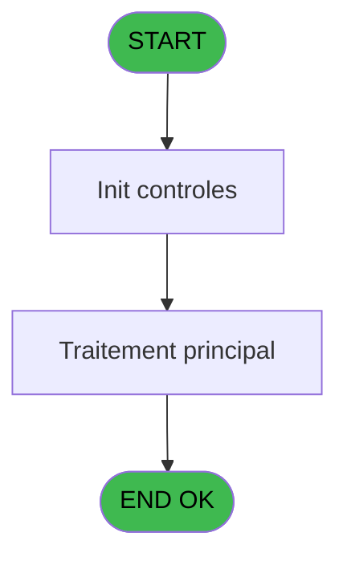
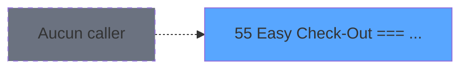
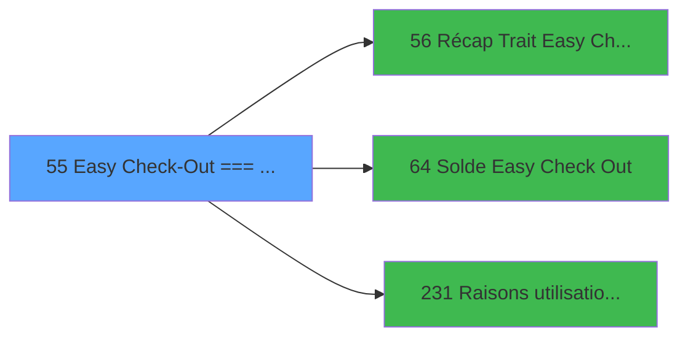

# ADH IDE 55 - Easy Check-Out === V2.00

> **Analyse**: Phases 1-4 2026-02-08 01:50 -> 01:50 (4s) | Assemblage 01:50
> **Pipeline**: V7.2 Enrichi
> **Structure**: 4 onglets (Resume | Ecrans | Donnees | Connexions)

<!-- TAB:Resume -->

## 1. FICHE D'IDENTITE

| Attribut | Valeur |
|----------|--------|
| Projet | ADH |
| IDE Position | 55 |
| Nom Programme | Easy Check-Out === V2.00 |
| Fichier source | `Prg_55.xml` |
| Dossier IDE | General |
| Taches | 1 (0 ecrans visibles) |
| Tables modifiees | 0 |
| Programmes appeles | 3 |
| Complexite | **BASSE** (score 5/100) |
| Statut | **ORPHELIN_POTENTIEL** |

## 2. DESCRIPTION FONCTIONNELLE

# ADH IDE 55 - Easy Check-Out

**ADH IDE 55** est le programme principal de gestion du workflow Easy Check-Out, permettant aux clients de finaliser rapidement leur paiement à la caisse. Le programme orchestre le flux complet : affichage du récapitulatif des articles/services à payer (via appel à ADH IDE 56), calcul du solde disponible en Easy Check-Out (via ADH IDE 64), et enregistrement des raisons de non-utilisation si le client refuse le paiement express (via ADH IDE 231).

Le workflow principal guide l'utilisateur à travers trois étapes clés. D'abord, la consultation du récapitulatif détaillé des transactions en attente pour le compte client. Ensuite, la vérification du solde Easy Check-Out disponible pour valider si le paiement express est possible. Enfin, en cas de refus ou impossibilité, le système capture les raisons (paramètres commerciaux stockés via ADH IDE 231) pour analyse statistique des tendances de paiement.

Le programme s'intègre dans la chaîne caisse générale (ADH IDE 121) en tant qu'option alternative aux circuits de paiement classiques, réduisant le temps de transaction pour les clients réguliers disposant de soldes Easy Check-Out. Les validations métier (solde suffisant, intégrité données, logs d'audit) garantissent la conformité des opérations sensibles de paiement.

## 3. BLOCS FONCTIONNELS

## 5. REGLES METIER

3 regles identifiees:

### Autres (3 regles)

#### [RM-001] Condition: v.Réponse [E] egale 6

| Element | Detail |
|---------|--------|
| **Condition** | `v.Réponse [E]=6` |
| **Si vrai** | Action si vrai |
| **Variables** | ER (v.Réponse) |
| **Expression source** | Expression 5 : `v.Réponse [E]=6` |
| **Exemple** | Si v.Réponse [E]=6 → Action si vrai |

#### [RM-002] Si v.Tous les insoldés [B] alors '' sinon 'gmc_accept_exp_co=1')

| Element | Detail |
|---------|--------|
| **Condition** | `v.Tous les insoldés [B]` |
| **Si vrai** | '' |
| **Si faux** | 'gmc_accept_exp_co=1') |
| **Variables** | EO (v.Tous les insoldés) |
| **Expression source** | Expression 6 : `IF(v.Tous les insoldés [B],'','gmc_accept_exp_co=1')` |
| **Exemple** | Si v.Tous les insoldés [B] → ''. Sinon → 'gmc_accept_exp_co=1') |

#### [RM-003] Condition: VG111 AND VG112 different de 0

| Element | Detail |
|---------|--------|
| **Condition** | `VG111 AND VG112<>0` |
| **Si vrai** | Action si vrai |
| **Expression source** | Expression 11 : `VG111 AND VG112<>0` |
| **Exemple** | Si VG111 AND VG112<>0 → Action si vrai |

## 6. CONTEXTE

- **Appele par**: (aucun)
- **Appelle**: 3 programmes | **Tables**: 0 (W:0 R:0 L:0) | **Taches**: 1 | **Expressions**: 14

<!-- TAB:Ecrans -->

## 8. ECRANS

*(Programme sans ecran visible)*

## 9. NAVIGATION

### 9.3 Structure hierarchique (0 tache)

| Position | Tache | Type | Dimensions | Bloc |
|----------|-------|------|------------|------|

### 9.4 Algorigramme

> **Legende**: Vert = START/END OK | Rouge = END KO | Bleu = Decisions
> *Algorigramme auto-genere. Utiliser `/algorigramme` pour une synthese metier detaillee.*

<!-- TAB:Donnees -->

## 10. TABLES

### Tables utilisees (0)

| ID | Nom | Description | Type | R | W | L | Usages |
|----|-----|-------------|------|---|---|---|--------|

### Colonnes par table (0 / 0 tables avec colonnes identifiees)

## 11. VARIABLES

### 11.1 Variables de session (6)

Variables persistantes pendant toute la session.

| Lettre | Nom | Type | Usage dans |
|--------|-----|------|-----------|
| EN | v.Date Traitement | Date | 1x session |
| EO | v.Tous les insoldés | Logical | 1x session |
| ER | v.Réponse | Numeric | 1x session |
| ES | v.clause where | Alpha | - |
| ET | v.compte test | Numeric | - |
| EU | v.lance raison use adh | Logical | 1x session |

### 11.2 Autres (2)

Variables diverses.

| Lettre | Nom | Type | Usage dans |
|--------|-----|------|-----------|
| EP | b.Lancer | Alpha | - |
| EQ | b.Quitter | Alpha | - |

## 12. EXPRESSIONS

**14 / 14 expressions decodees (100%)**

### 12.1 Repartition par type

| Type | Expressions | Regles |
|------|-------------|--------|
| CONDITION | 4 | 3 |
| CONSTANTE | 4 | 0 |
| DATE | 1 | 0 |
| OTHER | 3 | 0 |
| REFERENCE_VG | 1 | 0 |
| CAST_LOGIQUE | 1 | 0 |

### 12.2 Expressions cles par type

#### CONDITION (4 expressions)

| Type | IDE | Expression | Regle |
|------|-----|------------|-------|
| CONDITION | 11 | `VG111 AND VG112<>0` | [RM-003](#rm-RM-003) |
| CONDITION | 6 | `IF(v.Tous les insoldés [B],'','gmc_accept_exp_co=1')` | [RM-002](#rm-RM-002) |
| CONDITION | 5 | `v.Réponse [E]=6` | [RM-001](#rm-RM-001) |
| CONDITION | 4 | `v.Date Traitement [A]>Date()` | - |

#### CONSTANTE (4 expressions)

| Type | IDE | Expression | Regle |
|------|-----|------------|-------|
| CONSTANTE | 9 | `0` | - |
| CONSTANTE | 12 | `'Easy Check Out'` | - |
| CONSTANTE | 1 | `'Lancer'` | - |
| CONSTANTE | 2 | `'Quitter'` | - |

#### DATE (1 expressions)

| Type | IDE | Expression | Regle |
|------|-----|------------|-------|
| DATE | 3 | `AddDate (Date(),0,0,-1)` | - |

#### OTHER (3 expressions)

| Type | IDE | Expression | Regle |
|------|-----|------------|-------|
| OTHER | 13 | `v.lance raison use adh [H]` | - |
| OTHER | 10 | `NOT(VG3)` | - |
| OTHER | 7 | `MlsTrans('La date de traitement ne peut pas être supérieure à la date du jour')` | - |

#### REFERENCE_VG (1 expressions)

| Type | IDE | Expression | Regle |
|------|-----|------------|-------|
| REFERENCE_VG | 8 | `VG3` | - |

#### CAST_LOGIQUE (1 expressions)

| Type | IDE | Expression | Regle |
|------|-----|------------|-------|
| CAST_LOGIQUE | 14 | `'TRUE'LOG` | - |

<!-- TAB:Connexions -->

## 13. GRAPHE D'APPELS

### 13.1 Chaine depuis Main (Callers)

**Chemin**: (pas de callers directs)

### 13.2 Callers

| IDE | Nom Programme | Nb Appels |
|-----|---------------|-----------|
| - | (aucun) | - |

### 13.3 Callees (programmes appeles)

### 13.4 Detail Callees avec contexte

| IDE | Nom Programme | Appels | Contexte |
|-----|---------------|--------|----------|
| [56](ADH-IDE-56.md) | Récap Trait Easy Check-Out | 1 | Sous-programme |
| [64](ADH-IDE-64.md) | Solde Easy Check Out | 1 | Verification solde |
| [231](ADH-IDE-231.md) | Raisons utilisation ADH | 1 | Parametrage |

## 14. RECOMMANDATIONS MIGRATION

### 14.1 Profil du programme

| Metrique | Valeur | Impact migration |
|----------|--------|-----------------|
| Lignes de logique | 24 | Programme compact |
| Expressions | 14 | Peu de logique |
| Tables WRITE | 0 | Impact faible |
| Sous-programmes | 3 | Peu de dependances |
| Ecrans visibles | 0 | Ecran unique ou traitement batch |
| Code desactive | 0% (0 / 24) | Code sain |
| Regles metier | 3 | Quelques regles a preserver |

### 14.2 Plan de migration par bloc

### 14.3 Dependances critiques

| Dependance | Type | Appels | Impact |
|------------|------|--------|--------|
| [Raisons utilisation ADH (IDE 231)](ADH-IDE-231.md) | Sous-programme | 1x | Normale - Parametrage |
| [Solde Easy Check Out (IDE 64)](ADH-IDE-64.md) | Sous-programme | 1x | Normale - Verification solde |
| [Récap Trait Easy Check-Out (IDE 56)](ADH-IDE-56.md) | Sous-programme | 1x | Normale - Sous-programme |

---
*Spec DETAILED generee par Pipeline V7.2 - 2026-02-08 01:50*
