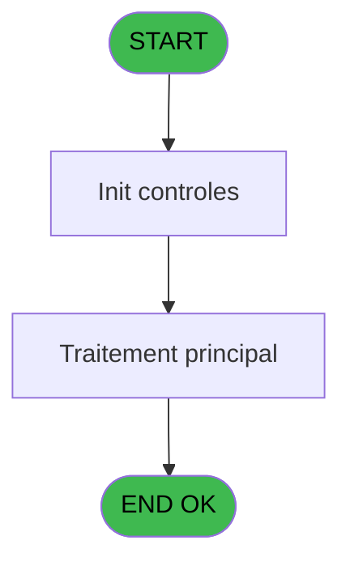
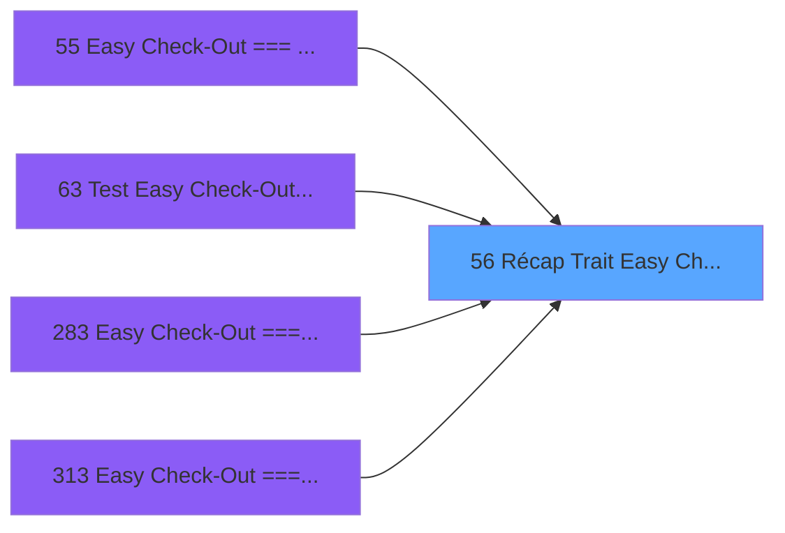

# ADH IDE 56 - Récap Trait Easy Check-Out

> **Analyse**: Phases 1-4 2026-02-08 01:50 -> 01:50 (4s) | Assemblage 01:50
> **Pipeline**: V7.2 Enrichi
> **Structure**: 4 onglets (Resume | Ecrans | Donnees | Connexions)

<!-- TAB:Resume -->

## 1. FICHE D'IDENTITE

| Attribut | Valeur |
|----------|--------|
| Projet | ADH |
| IDE Position | 56 |
| Nom Programme | Récap Trait Easy Check-Out |
| Fichier source | `Prg_56.xml` |
| Dossier IDE | General |
| Taches | 2 (0 ecrans visibles) |
| Tables modifiees | 0 |
| Programmes appeles | 1 |
| Complexite | **BASSE** (score 5/100) |

## 2. DESCRIPTION FONCTIONNELLE

ADH IDE 56 - Récap Trait Easy Check-Out est un programme de synthèse qui consolide les résultats d'une transaction Easy Check-Out. Il agit comme point d'arrivée naturel du flux de paiement sécurisé après validation du règlement et récupération des informations de compte. Le programme traite les données finales et prépare la génération des documents de clôture (reçu, facture).

Le programme reçoit les paramètres du flux Easy Check-Out précédent (solde avant/après, moyens de paiement utilisés, montants débités) et exécute les traitements finaux : enregistrement de la transaction, calcul des totaux définitifs, et préparation de la documentation client. Il appelle systématiquement ADH IDE 65 (Edition & Mail Easy Check Out) pour générer et envoyer les documents de synthèse.

ADH IDE 56 s'inscrit dans une chaîne fortement intégrée d'Easy Check-Out (IDE 53→54→55→56→63, variantes IDE 283/313) où chaque maillon traite une étape spécifique du processus. Son rôle de récapitulatif final le positionne comme passerelle obligatoire vers la clôture de la transaction et la création des pièces justificatives.

## 3. BLOCS FONCTIONNELS

## 5. REGLES METIER

3 regles identifiees:

### Autres (3 regles)

#### [RM-001] Traitement si [K] est non nul

| Element | Detail |
|---------|--------|
| **Condition** | `[K]<>0` |
| **Si vrai** | 179 |
| **Si faux** | 174) |
| **Expression source** | Expression 8 : `IF([K]<>0,179,174)` |
| **Exemple** | Si [K]<>0 → 179. Sinon → 174) |

#### [RM-002] Negation de [F] (condition inversee)

| Element | Detail |
|---------|--------|
| **Condition** | `NOT [F]` |
| **Si vrai** | Action si vrai |
| **Expression source** | Expression 9 : `NOT [F]` |
| **Exemple** | Si NOT [F] → Action si vrai |

#### [RM-003] Condition: [BD] egale 6

| Element | Detail |
|---------|--------|
| **Condition** | `[BD]=6` |
| **Si vrai** | Action si vrai |
| **Expression source** | Expression 11 : `[BD]=6` |
| **Exemple** | Si [BD]=6 → Action si vrai |

## 6. CONTEXTE

- **Appele par**: [Easy Check-Out === V2.00 (IDE 55)](ADH-IDE-55.md), [Test Easy Check-Out Online (IDE 63)](ADH-IDE-63.md), [Easy Check-Out === V2.00 (IDE 283)](ADH-IDE-283.md), [Easy Check-Out === V2.00 (IDE 313)](ADH-IDE-313.md)
- **Appelle**: 1 programmes | **Tables**: 6 (W:0 R:1 L:5) | **Taches**: 2 | **Expressions**: 13

<!-- TAB:Ecrans -->

## 8. ECRANS

*(Programme sans ecran visible)*

## 9. NAVIGATION

### 9.3 Structure hierarchique (0 tache)

| Position | Tache | Type | Dimensions | Bloc |
|----------|-------|------|------------|------|

### 9.4 Algorigramme

> **Legende**: Vert = START/END OK | Rouge = END KO | Bleu = Decisions
> *Algorigramme auto-genere. Utiliser `/algorigramme` pour une synthese metier detaillee.*

<!-- TAB:Donnees -->

## 10. TABLES

### Tables utilisees (6)

| ID | Nom | Description | Type | R | W | L | Usages |
|----|-----|-------------|------|---|---|---|--------|
| 34 | hebergement______heb | Hebergement (chambres) | DB | R |   |   | 2 |
| 39 | depot_garantie___dga | Depots et garanties | DB |   |   | L | 2 |
| 48 | lignes_de_solde__sld |  | DB |   |   | L | 2 |
| 934 | selection enregistrement diver |  | DB |   |   | L | 2 |
| 47 | compte_gm________cgm | Comptes GM (generaux) | DB |   |   | L | 2 |
| 372 | pv_budget |  | DB |   |   | L | 1 |

### Colonnes par table (1 / 1 tables avec colonnes identifiees)

Table 34 - hebergement______heb (R) - 2 usages

| Lettre | Variable | Acces | Type |
|--------|----------|-------|------|
| A | b.Quitter | R | Alpha |
| B | b.Imprimer | R | Alpha |
| C | v.Deja edité ? | R | Logical |
| D | v.Reponse | R | Numeric |
| E | v.Erreurs seules | R | Logical |

## 11. VARIABLES

### 11.1 Variables de session (3)

Variables persistantes pendant toute la session.

| Lettre | Nom | Type | Usage dans |
|--------|-----|------|-----------|
| EP | v.Deja edité ? | Logical | 1x session |
| EQ | v.Reponse | Numeric | - |
| ER | v.Erreurs seules | Logical | - |

### 11.2 Autres (2)

Variables diverses.

| Lettre | Nom | Type | Usage dans |
|--------|-----|------|-----------|
| EN | b.Quitter | Alpha | - |
| EO | b.Imprimer | Alpha | 1x refs |

## 12. EXPRESSIONS

**13 / 13 expressions decodees (100%)**

### 12.1 Repartition par type

| Type | Expressions | Regles |
|------|-------------|--------|
| CONDITION | 2 | 2 |
| NEGATION | 1 | 5 |
| CONSTANTE | 4 | 0 |
| DATE | 1 | 0 |
| OTHER | 3 | 0 |
| REFERENCE_VG | 1 | 0 |
| CAST_LOGIQUE | 1 | 0 |

### 12.2 Expressions cles par type

#### CONDITION (2 expressions)

| Type | IDE | Expression | Regle |
|------|-----|------------|-------|
| CONDITION | 11 | `[BD]=6` | [RM-003](#rm-RM-003) |
| CONDITION | 8 | `IF([K]<>0,179,174)` | [RM-001](#rm-RM-001) |

#### NEGATION (1 expressions)

| Type | IDE | Expression | Regle |
|------|-----|------------|-------|
| NEGATION | 9 | `NOT [F]` | [RM-002](#rm-RM-002) |

#### CONSTANTE (4 expressions)

| Type | IDE | Expression | Regle |
|------|-----|------------|-------|
| CONSTANTE | 4 | `'C'` | - |
| CONSTANTE | 7 | `'Z'` | - |
| CONSTANTE | 1 | `'Quitter'` | - |
| CONSTANTE | 2 | `'Imprimer'` | - |

#### DATE (1 expressions)

| Type | IDE | Expression | Regle |
|------|-----|------------|-------|
| DATE | 3 | `Date()` | - |

#### OTHER (3 expressions)

| Type | IDE | Expression | Regle |
|------|-----|------------|-------|
| OTHER | 10 | `[BC]` | - |
| OTHER | 6 | `v.Deja edité ? [C]` | - |
| OTHER | 5 | `b.Imprimer [B]` | - |

#### REFERENCE_VG (1 expressions)

| Type | IDE | Expression | Regle |
|------|-----|------------|-------|
| REFERENCE_VG | 12 | `VG22` | - |

#### CAST_LOGIQUE (1 expressions)

| Type | IDE | Expression | Regle |
|------|-----|------------|-------|
| CAST_LOGIQUE | 13 | `'FALSE'LOG` | - |

<!-- TAB:Connexions -->

## 13. GRAPHE D'APPELS

### 13.1 Chaine depuis Main (Callers)

Main -> ... -> [Easy Check-Out === V2.00 (IDE 55)](ADH-IDE-55.md) -> **Récap Trait Easy Check-Out (IDE 56)**

Main -> ... -> [Test Easy Check-Out Online (IDE 63)](ADH-IDE-63.md) -> **Récap Trait Easy Check-Out (IDE 56)**

Main -> ... -> [Easy Check-Out === V2.00 (IDE 283)](ADH-IDE-283.md) -> **Récap Trait Easy Check-Out (IDE 56)**

Main -> ... -> [Easy Check-Out === V2.00 (IDE 313)](ADH-IDE-313.md) -> **Récap Trait Easy Check-Out (IDE 56)**

### 13.2 Callers

| IDE | Nom Programme | Nb Appels |
|-----|---------------|-----------|
| [55](ADH-IDE-55.md) | Easy Check-Out === V2.00 | 1 |
| [63](ADH-IDE-63.md) | Test Easy Check-Out Online | 1 |
| [283](ADH-IDE-283.md) | Easy Check-Out === V2.00 | 1 |
| [313](ADH-IDE-313.md) | Easy Check-Out === V2.00 | 1 |

### 13.3 Callees (programmes appeles)

### 13.4 Detail Callees avec contexte

| IDE | Nom Programme | Appels | Contexte |
|-----|---------------|--------|----------|
| [65](ADH-IDE-65.md) | Edition & Mail Easy Check Out | 1 | Impression ticket/document |

## 14. RECOMMANDATIONS MIGRATION

### 14.1 Profil du programme

| Metrique | Valeur | Impact migration |
|----------|--------|-----------------|
| Lignes de logique | 103 | Programme compact |
| Expressions | 13 | Peu de logique |
| Tables WRITE | 0 | Impact faible |
| Sous-programmes | 1 | Peu de dependances |
| Ecrans visibles | 0 | Ecran unique ou traitement batch |
| Code desactive | 0% (0 / 103) | Code sain |
| Regles metier | 3 | Quelques regles a preserver |

### 14.2 Plan de migration par bloc

### 14.3 Dependances critiques

| Dependance | Type | Appels | Impact |
|------------|------|--------|--------|
| [Edition & Mail Easy Check Out (IDE 65)](ADH-IDE-65.md) | Sous-programme | 1x | Normale - Impression ticket/document |

---
*Spec DETAILED generee par Pipeline V7.2 - 2026-02-08 01:51*
