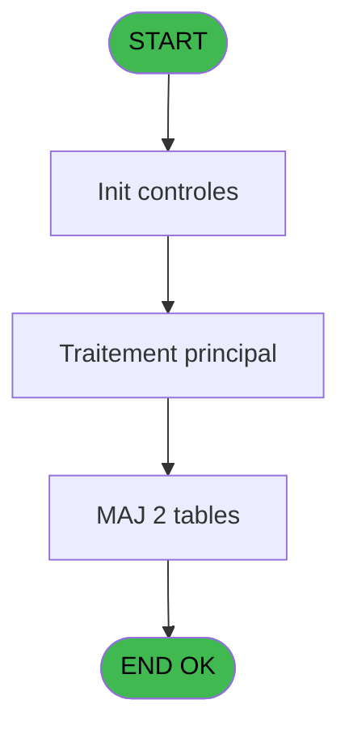
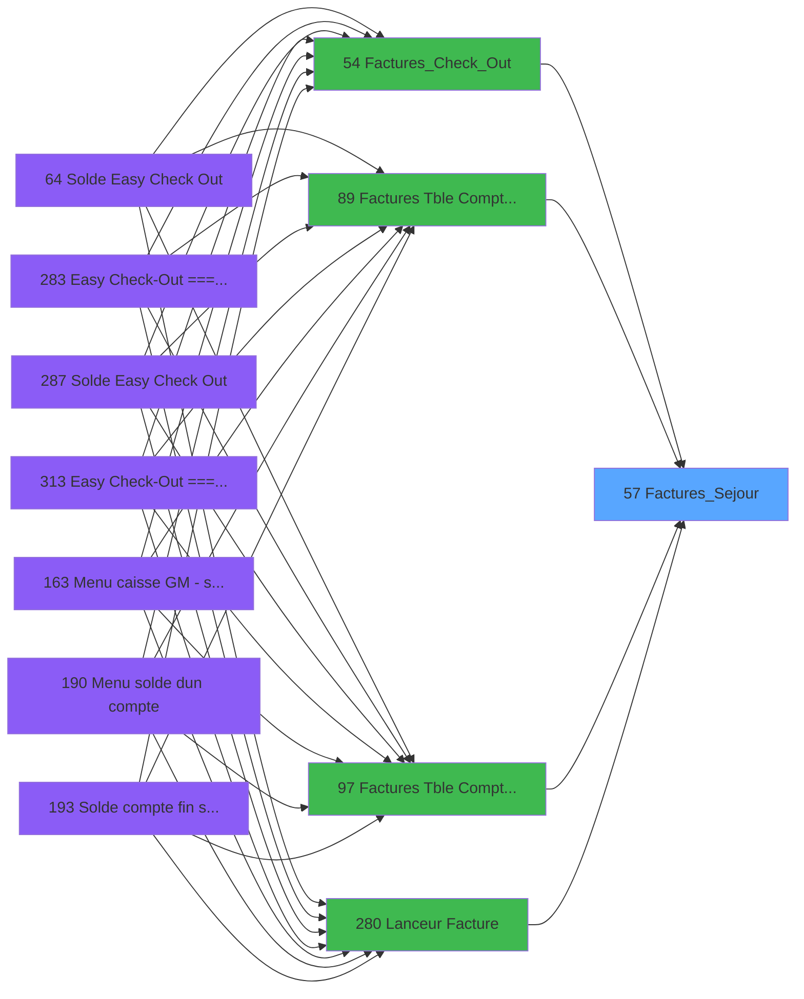

# ADH IDE 57 - Factures_Sejour

> **Analyse**: Phases 1-4 2026-02-08 01:51 -> 01:51 (4s) | Assemblage 01:51
> **Pipeline**: V7.2 Enrichi
> **Structure**: 4 onglets (Resume | Ecrans | Donnees | Connexions)

<!-- TAB:Resume -->

## 1. FICHE D'IDENTITE

| Attribut | Valeur |
|----------|--------|
| Projet | ADH |
| IDE Position | 57 |
| Nom Programme | Factures_Sejour |
| Fichier source | `Prg_57.xml` |
| Dossier IDE | Facturation |
| Taches | 6 (0 ecrans visibles) |
| Tables modifiees | 2 |
| Programmes appeles | 0 |
| Complexite | **BASSE** (score 14/100) |

## 2. DESCRIPTION FONCTIONNELLE

# ADH IDE 57 - Factures_Sejour

Programme de gestion des factures de séjour, appelé depuis le workflow de checkout (IDE 54) et les écrans de saisie facturation (IDE 89, 97). Responsable de la création et de la modification des lignes de facture associées aux séjours clients, en particulier pour la gestion des gift passes et la ventilation par rayons boutique.

Le programme manipule deux tables critiques : **Affectation_Gift_Pass** (enregistrement des gift passes attribués au séjour) et **Rayons_Boutique** (classification des produits/services vendus). Intègre la logique de calcul des montants facturables, de la gestion des remises et des ajustements tarifaires selon les conditions du séjour.

Fait partie de la chaîne de facturation complète : après vérification du checkout (IDE 54), les données de séjour sont traitées pour générer les lignes de facture finales, avec support des appels depuis multiple points d'entrée (lanceur direct IDE 280, interfaces de saisie IDE 89/97).

## 3. BLOCS FONCTIONNELS

## 5. REGLES METIER

*(Aucune regle metier identifiee dans les expressions)*

## 6. CONTEXTE

- **Appele par**: [Factures_Check_Out (IDE 54)](ADH-IDE-54.md), [Factures (Tble Compta&Vent (IDE 89)](ADH-IDE-89.md), [Factures (Tble Compta&Vent) V3 (IDE 97)](ADH-IDE-97.md), [Lanceur Facture (IDE 280)](ADH-IDE-280.md)
- **Appelle**: 0 programmes | **Tables**: 6 (W:2 R:1 L:4) | **Taches**: 6 | **Expressions**: 7

<!-- TAB:Ecrans -->

## 8. ECRANS

*(Programme sans ecran visible)*

## 9. NAVIGATION

### 9.3 Structure hierarchique (0 tache)

| Position | Tache | Type | Dimensions | Bloc |
|----------|-------|------|------------|------|

### 9.4 Algorigramme

> **Legende**: Vert = START/END OK | Rouge = END KO | Bleu = Decisions
> *Algorigramme auto-genere. Utiliser `/algorigramme` pour une synthese metier detaillee.*

<!-- TAB:Donnees -->

## 10. TABLES

### Tables utilisees (6)

| ID | Nom | Description | Type | R | W | L | Usages |
|----|-----|-------------|------|---|---|---|--------|
| 868 | Affectation_Gift_Pass |  | DB | R | **W** |   | 4 |
| 870 | Rayons_Boutique |  | DB |   | **W** |   | 2 |
| 400 | pv_cust_rentals |  | DB |   |   | L | 2 |
| 263 | vente | Donnees de ventes | DB |   |   | L | 1 |
| 40 | comptable________cte |  | DB |   |   | L | 1 |
| 30 | gm-recherche_____gmr | Index de recherche | DB |   |   | L | 1 |

### Colonnes par table (1 / 2 tables avec colonnes identifiees)

Table 868 - Affectation_Gift_Pass (R/**W**) - 4 usages

| Lettre | Variable | Acces | Type |
|--------|----------|-------|------|
| A | P.i.Société | W | Alpha |
| B | P.i.Num compte | W | Numeric |
| C | P.i.Fliliation | W | Numeric |
| D | P.i.Facture ECO | W | Logical |
| E | V.Lien Hebergement_Pro | W | Logical |

Table 870 - Rayons_Boutique (**W**) - 2 usages

*Table utilisee uniquement en Link ou aucune colonne Real identifiee dans le DataView.*

## 11. VARIABLES

### 11.1 Parametres entrants (4)

Variables recues du programme appelant ([Factures_Check_Out (IDE 54)](ADH-IDE-54.md)).

| Lettre | Nom | Type | Usage dans |
|--------|-----|------|-----------|
| EN | P.i.Société | Alpha | 1x parametre entrant |
| EO | P.i.Num compte | Numeric | 1x parametre entrant |
| EP | P.i.Fliliation | Numeric | 1x parametre entrant |
| EQ | P.i.Facture ECO | Logical | - |

### 11.2 Variables de session (1)

Variables persistantes pendant toute la session.

| Lettre | Nom | Type | Usage dans |
|--------|-----|------|-----------|
| ER | V.Lien Hebergement_Pro | Logical | - |

## 12. EXPRESSIONS

**7 / 7 expressions decodees (100%)**

### 12.1 Repartition par type

| Type | Expressions | Regles |
|------|-------------|--------|
| OTHER | 7 | 0 |

### 12.2 Expressions cles par type

#### OTHER (7 expressions)

| Type | IDE | Expression | Regle |
|------|-----|------------|-------|
| OTHER | 5 | `[I]` | - |
| OTHER | 6 | `NOT([J])` | - |
| OTHER | 7 | `DbDel('{870,4}'DSOURCE,'')` | - |
| OTHER | 4 | `[H]` | - |
| OTHER | 1 | `P.i.Société [A]` | - |
| ... | | *+2 autres* | |

<!-- TAB:Connexions -->

## 13. GRAPHE D'APPELS

### 13.1 Chaine depuis Main (Callers)

Main -> ... -> [Factures_Check_Out (IDE 54)](ADH-IDE-54.md) -> **Factures_Sejour (IDE 57)**

Main -> ... -> [Factures (Tble Compta&Vent (IDE 89)](ADH-IDE-89.md) -> **Factures_Sejour (IDE 57)**

Main -> ... -> [Factures (Tble Compta&Vent) V3 (IDE 97)](ADH-IDE-97.md) -> **Factures_Sejour (IDE 57)**

Main -> ... -> [Lanceur Facture (IDE 280)](ADH-IDE-280.md) -> **Factures_Sejour (IDE 57)**

### 13.2 Callers

| IDE | Nom Programme | Nb Appels |
|-----|---------------|-----------|
| [54](ADH-IDE-54.md) | Factures_Check_Out | 1 |
| [89](ADH-IDE-89.md) | Factures (Tble Compta&Vent | 1 |
| [97](ADH-IDE-97.md) | Factures (Tble Compta&Vent) V3 | 1 |
| [280](ADH-IDE-280.md) | Lanceur Facture | 1 |

### 13.3 Callees (programmes appeles)

### 13.4 Detail Callees avec contexte

| IDE | Nom Programme | Appels | Contexte |
|-----|---------------|--------|----------|
| - | (aucun) | - | - |

## 14. RECOMMANDATIONS MIGRATION

### 14.1 Profil du programme

| Metrique | Valeur | Impact migration |
|----------|--------|-----------------|
| Lignes de logique | 252 | Taille moyenne |
| Expressions | 7 | Peu de logique |
| Tables WRITE | 2 | Impact faible |
| Sous-programmes | 0 | Peu de dependances |
| Ecrans visibles | 0 | Ecran unique ou traitement batch |
| Code desactive | 0% (0 / 252) | Code sain |
| Regles metier | 0 | Pas de regle identifiee |

### 14.2 Plan de migration par bloc

### 14.3 Dependances critiques

| Dependance | Type | Appels | Impact |
|------------|------|--------|--------|
| Affectation_Gift_Pass | Table WRITE (Database) | 3x | Schema + repository |
| Rayons_Boutique | Table WRITE (Database) | 2x | Schema + repository |

---
*Spec DETAILED generee par Pipeline V7.2 - 2026-02-08 01:52*
