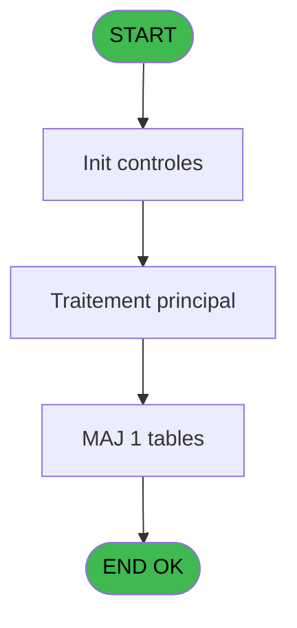
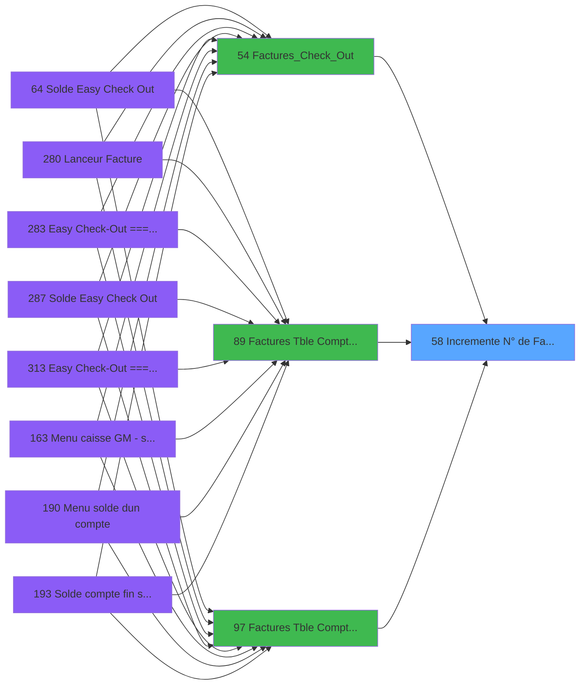

# ADH IDE 58 - Incremente N° de Facture

> **Analyse**: Phases 1-4 2026-02-08 01:52 -> 01:52 (4s) | Assemblage 01:52
> **Pipeline**: V7.2 Enrichi
> **Structure**: 4 onglets (Resume | Ecrans | Donnees | Connexions)

<!-- TAB:Resume -->

## 1. FICHE D'IDENTITE

| Attribut | Valeur |
|----------|--------|
| Projet | ADH |
| IDE Position | 58 |
| Nom Programme | Incremente N° de Facture |
| Fichier source | `Prg_58.xml` |
| Dossier IDE | Facturation |
| Taches | 1 (0 ecrans visibles) |
| Tables modifiees | 1 |
| Programmes appeles | 0 |
| Complexite | **BASSE** (score 7/100) |

## 2. DESCRIPTION FONCTIONNELLE

ADH IDE 58 - Incremente N° de Facture est un programme utilitaire de gestion des compteurs. Il modifie la table `compteurs________cpt` pour incrémenter le numéro de facture stocké dans cette table de référence. Ce programme fonctionne comme un service transactionnel critique, assurant que chaque nouvelle facture reçoit un numéro séquentiel unique et non réutilisable.

Le programme est appelé par trois points d'entrée principaux liés au workflow de facturation : ADH IDE 54 (Factures_Check_Out - facturation easy checkout), ADH IDE 89 (Table Compta&Vent - interface facturation comptable), et ADH IDE 97 (Factures V3 - version améliorée du module facturation). Cette multiplicité d'appels reflète l'importance du compteur dans différents contextes de vente et de gestion comptable.

L'opération d'incrémentation sur la table `compteurs________cpt` est une opération atomique typique dans les systèmes comptables, garantissant l'intégrité des numérotations fiscales. Le programme maintient la séquence des factures comme artefact de traçabilité critique pour l'audit et la conformité réglementaire, en particulier dans un contexte de gestion hôtelière où les numéros de facture sont soumis à des obligations légales strictes.

## 3. BLOCS FONCTIONNELS

## 5. REGLES METIER

2 regles identifiees:

### Autres (2 regles)

#### [RM-001] Valeur par defaut si P.i.Code compteur [B] est vide

| Element | Detail |
|---------|--------|
| **Condition** | `P.i.Code compteur [B]=''` |
| **Si vrai** | 'F'&DStr(Date() |
| **Si faux** | 'YYMM'),P.i.Code compteur [B]) |
| **Variables** | EO (P.i.Code compteur) |
| **Expression source** | Expression 3 : `IF(P.i.Code compteur [B]='','F'&DStr(Date(),'YYMM'),P.i.Code` |
| **Exemple** | Si P.i.Code compteur [B]='' → 'F'&DStr(Date(). Sinon → 'YYMM'),P.i.Code compteur [B]) |

#### [RM-002] Condition: [F]=9999 AND P.i.Code compteur [B] different de

| Element | Detail |
|---------|--------|
| **Condition** | `[F]=9999 AND P.i.Code compteur [B]<>''` |
| **Si vrai** | Action si vrai |
| **Variables** | EO (P.i.Code compteur) |
| **Expression source** | Expression 6 : `[F]=9999 AND P.i.Code compteur [B]<>''` |
| **Exemple** | Si [F]=9999 AND P.i.Code compteur [B]<>'' → Action si vrai |

## 6. CONTEXTE

- **Appele par**: [Factures_Check_Out (IDE 54)](ADH-IDE-54.md), [Factures (Tble Compta&Vent (IDE 89)](ADH-IDE-89.md), [Factures (Tble Compta&Vent) V3 (IDE 97)](ADH-IDE-97.md)
- **Appelle**: 0 programmes | **Tables**: 1 (W:1 R:0 L:0) | **Taches**: 1 | **Expressions**: 6

<!-- TAB:Ecrans -->

## 8. ECRANS

*(Programme sans ecran visible)*

## 9. NAVIGATION

### 9.3 Structure hierarchique (0 tache)

| Position | Tache | Type | Dimensions | Bloc |
|----------|-------|------|------------|------|

### 9.4 Algorigramme

> **Legende**: Vert = START/END OK | Rouge = END KO | Bleu = Decisions
> *Algorigramme auto-genere. Utiliser `/algorigramme` pour une synthese metier detaillee.*

<!-- TAB:Donnees -->

## 10. TABLES

### Tables utilisees (1)

| ID | Nom | Description | Type | R | W | L | Usages |
|----|-----|-------------|------|---|---|---|--------|
| 68 | compteurs________cpt | Comptes GM (generaux) | DB |   | **W** |   | 1 |

### Colonnes par table (1 / 1 tables avec colonnes identifiees)

Table 68 - compteurs________cpt (**W**) - 1 usages

| Lettre | Variable | Acces | Type |
|--------|----------|-------|------|
| A | p.NumFact | W | Numeric |
| B | P.i.Code compteur | W | Alpha |

## 11. VARIABLES

### 11.1 Parametres entrants (2)

Variables recues du programme appelant ([Factures_Check_Out (IDE 54)](ADH-IDE-54.md)).

| Lettre | Nom | Type | Usage dans |
|--------|-----|------|-----------|
| EN | p.NumFact | Numeric | - |
| EO | P.i.Code compteur | Alpha | 3x parametre entrant |

## 12. EXPRESSIONS

**6 / 6 expressions decodees (100%)**

### 12.1 Repartition par type

| Type | Expressions | Regles |
|------|-------------|--------|
| CALCULATION | 1 | 0 |
| CONDITION | 2 | 2 |
| FORMAT | 1 | 0 |
| CONSTANTE | 2 | 0 |

### 12.2 Expressions cles par type

#### CALCULATION (1 expressions)

| Type | IDE | Expression | Regle |
|------|-----|------------|-------|
| CALCULATION | 1 | `[F]+1` | - |

#### CONDITION (2 expressions)

| Type | IDE | Expression | Regle |
|------|-----|------------|-------|
| CONDITION | 6 | `[F]=9999 AND P.i.Code compteur [B]<>''` | [RM-002](#rm-RM-002) |
| CONDITION | 3 | `IF(P.i.Code compteur [B]='','F'&DStr(Date(),'YYMM'),P.i.Code compteur [B])` | [RM-001](#rm-RM-001) |

#### FORMAT (1 expressions)

| Type | IDE | Expression | Regle |
|------|-----|------------|-------|
| FORMAT | 4 | `Val( IF (P.i.Code compteur [B]='', DStr(Date(),'YYMM'),Trim(P.i.Code compteur [B])) &
Str([F],'4P0'),'8')` | - |

#### CONSTANTE (2 expressions)

| Type | IDE | Expression | Regle |
|------|-----|------------|-------|
| CONSTANTE | 5 | `1` | - |
| CONSTANTE | 2 | `'C'` | - |

<!-- TAB:Connexions -->

## 13. GRAPHE D'APPELS

### 13.1 Chaine depuis Main (Callers)

Main -> ... -> [Factures_Check_Out (IDE 54)](ADH-IDE-54.md) -> **Incremente N° de Facture (IDE 58)**

Main -> ... -> [Factures (Tble Compta&Vent (IDE 89)](ADH-IDE-89.md) -> **Incremente N° de Facture (IDE 58)**

Main -> ... -> [Factures (Tble Compta&Vent) V3 (IDE 97)](ADH-IDE-97.md) -> **Incremente N° de Facture (IDE 58)**

### 13.2 Callers

| IDE | Nom Programme | Nb Appels |
|-----|---------------|-----------|
| [54](ADH-IDE-54.md) | Factures_Check_Out | 2 |
| [89](ADH-IDE-89.md) | Factures (Tble Compta&Vent | 2 |
| [97](ADH-IDE-97.md) | Factures (Tble Compta&Vent) V3 | 2 |

### 13.3 Callees (programmes appeles)

### 13.4 Detail Callees avec contexte

| IDE | Nom Programme | Appels | Contexte |
|-----|---------------|--------|----------|
| - | (aucun) | - | - |

## 14. RECOMMANDATIONS MIGRATION

### 14.1 Profil du programme

| Metrique | Valeur | Impact migration |
|----------|--------|-----------------|
| Lignes de logique | 13 | Programme compact |
| Expressions | 6 | Peu de logique |
| Tables WRITE | 1 | Impact faible |
| Sous-programmes | 0 | Peu de dependances |
| Ecrans visibles | 0 | Ecran unique ou traitement batch |
| Code desactive | 0% (0 / 13) | Code sain |
| Regles metier | 2 | Quelques regles a preserver |

### 14.2 Plan de migration par bloc

### 14.3 Dependances critiques

| Dependance | Type | Appels | Impact |
|------------|------|--------|--------|
| compteurs________cpt | Table WRITE (Database) | 1x | Schema + repository |

---
*Spec DETAILED generee par Pipeline V7.2 - 2026-02-08 01:52*
