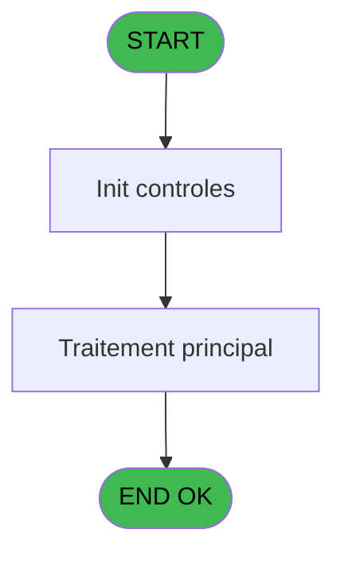
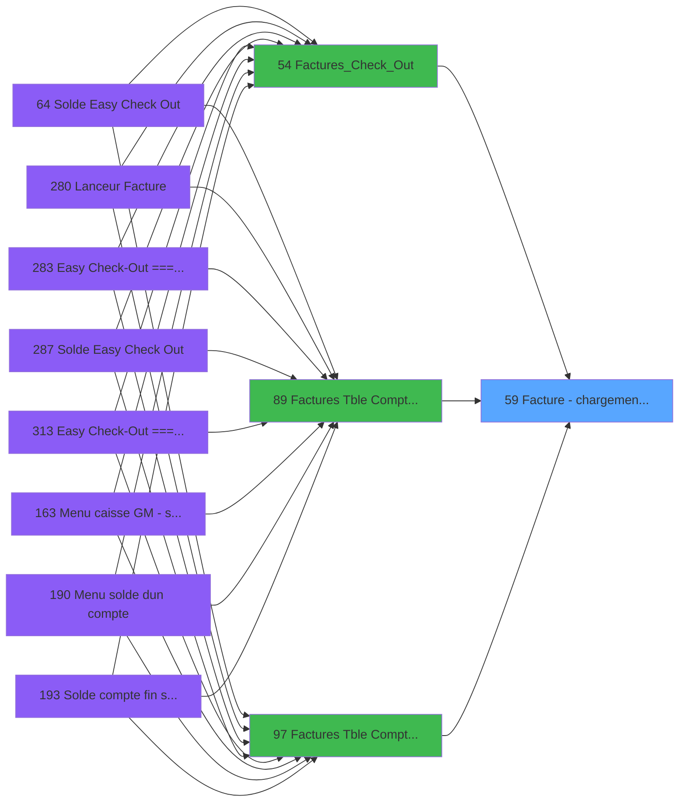

# ADH IDE 59 - Facture - chargement boutique

> **Analyse**: Phases 1-4 2026-02-08 01:52 -> 01:52 (4s) | Assemblage 01:52
> **Pipeline**: V7.2 Enrichi
> **Structure**: 4 onglets (Resume | Ecrans | Donnees | Connexions)

<!-- TAB:Resume -->

## 1. FICHE D'IDENTITE

| Attribut | Valeur |
|----------|--------|
| Projet | ADH |
| IDE Position | 59 |
| Nom Programme | Facture - chargement boutique |
| Fichier source | `Prg_59.xml` |
| Dossier IDE | Facturation |
| Taches | 1 (0 ecrans visibles) |
| Tables modifiees | 0 |
| Programmes appeles | 0 |
| Complexite | **BASSE** (score 0/100) |

## 2. DESCRIPTION FONCTIONNELLE

ADH IDE 59 est un module utilitaire de **chargement des données boutique** avant la facturation. Appelé directement par les 3 programmes principaux de facturation (IDEs 54, 89, 97), il charge en mémoire les configurations TPE et associe les rayons boutique au compte adhérent pour les étapes suivantes d'édition de facture. C'est un programme très simple (1 tâche, 104 lignes) qui ne fait que de la lecture : il accède à 2 tables (maj_appli_tpe en READ et Rayons_Boutique en LINK) sans effectuer aucune modification de données.

Le programme joue un rôle pivot dans le **workflow orchestré par Factures_Check_Out (IDE 54)**, se positionnant entre les vérifications préalables et la création des éléments de facture (entête, lignes, édition). C'est un terminal de l'arbre d'appels qui n'appelle lui-même aucun autre programme, ce qui rend sa migration straightforward : il suffira de mapper les 2 tables à des repositories et encapsuler la logique de chargement dans un service dédié de bootstrap boutique.

Aucune logique complexe n'est impliquée : zéro expression, zéro variable locale, zéro paramètre d'entrée. Les données manipulées proviennent du contexte global via variables VG* et les lectures tabulaires directes, ce qui le classe dans la catégorie **FACILE** pour une migration vers une architecture moderne (C#/.NET ou TypeScript).

## 3. BLOCS FONCTIONNELS

## 5. REGLES METIER

*(Aucune regle metier identifiee dans les expressions)*

## 6. CONTEXTE

- **Appele par**: [Factures_Check_Out (IDE 54)](ADH-IDE-54.md), [Factures (Tble Compta&Vent (IDE 89)](ADH-IDE-89.md), [Factures (Tble Compta&Vent) V3 (IDE 97)](ADH-IDE-97.md)
- **Appelle**: 0 programmes | **Tables**: 2 (W:0 R:1 L:1) | **Taches**: 1 | **Expressions**: 29

<!-- TAB:Ecrans -->

## 8. ECRANS

*(Programme sans ecran visible)*

## 9. NAVIGATION

### 9.3 Structure hierarchique (0 tache)

| Position | Tache | Type | Dimensions | Bloc |
|----------|-------|------|------------|------|

### 9.4 Algorigramme

> **Legende**: Vert = START/END OK | Rouge = END KO | Bleu = Decisions
> *Algorigramme auto-genere. Utiliser `/algorigramme` pour une synthese metier detaillee.*

<!-- TAB:Donnees -->

## 10. TABLES

### Tables utilisees (2)

| ID | Nom | Description | Type | R | W | L | Usages |
|----|-----|-------------|------|---|---|---|--------|
| 866 | maj_appli_tpe |  | DB | R |   |   | 1 |
| 870 | Rayons_Boutique |  | DB |   |   | L | 1 |

### Colonnes par table (1 / 1 tables avec colonnes identifiees)

Table 866 - maj_appli_tpe (R) - 1 usages

| Lettre | Variable | Acces | Type |
|--------|----------|-------|------|
| A | p.Societe | R | Unicode |
| B | p.Compte | R | Numeric |

## 11. VARIABLES

### 11.1 Parametres entrants (2)

Variables recues du programme appelant ([Factures_Check_Out (IDE 54)](ADH-IDE-54.md)).

| Lettre | Nom | Type | Usage dans |
|--------|-----|------|-----------|
| EN | p.Societe | Unicode | 1x parametre entrant |
| EO | p.Compte | Numeric | 1x parametre entrant |

## 12. EXPRESSIONS

**29 / 29 expressions decodees (100%)**

### 12.1 Repartition par type

| Type | Expressions | Regles |
|------|-------------|--------|
| CONSTANTE | 3 | 0 |
| OTHER | 26 | 0 |

### 12.2 Expressions cles par type

#### CONSTANTE (3 expressions)

| Type | IDE | Expression | Regle |
|------|-----|------------|-------|
| CONSTANTE | 28 | `1` | - |
| CONSTANTE | 18 | `''` | - |
| CONSTANTE | 4 | `'R'` | - |

#### OTHER (26 expressions)

| Type | IDE | Expression | Regle |
|------|-----|------------|-------|
| OTHER | 19 | `[H]` | - |
| OTHER | 20 | `[U]` | - |
| OTHER | 21 | `[L]` | - |
| OTHER | 15 | `[BQ]` | - |
| OTHER | 16 | `[BR]` | - |
| ... | | *+21 autres* | |

### 12.3 Toutes les expressions (29)

Voir les 29 expressions

#### CONSTANTE (3)

| IDE | Expression Decodee |
|-----|-------------------|
| 4 | `'R'` |
| 18 | `''` |
| 28 | `1` |

#### OTHER (26)

| IDE | Expression Decodee |
|-----|-------------------|
| 1 | `p.Societe [A]` |
| 2 | `p.Compte [B]` |
| 3 | `[H]` |
| 5 | `[BI]` |
| 6 | `[BJ]` |
| 7 | `[BG]` |
| 8 | `[Y]` |
| 9 | `[BK]` |
| 10 | `[BL]` |
| 11 | `[BM]` |
| 12 | `[BN]` |
| 13 | `[BO]` |
| 14 | `[BP]` |
| 15 | `[BQ]` |
| 16 | `[BR]` |
| 17 | `[X]` |
| 19 | `[H]` |
| 20 | `[U]` |
| 21 | `[L]` |
| 22 | `[E]` |
| 23 | `[R]` |
| 24 | `[BT]` |
| 25 | `[BE]` |
| 26 | `[BC]` |
| 27 | `[Q]` |
| 29 | `[W]` |

<!-- TAB:Connexions -->

## 13. GRAPHE D'APPELS

### 13.1 Chaine depuis Main (Callers)

Main -> ... -> [Factures_Check_Out (IDE 54)](ADH-IDE-54.md) -> **Facture - chargement boutique (IDE 59)**

Main -> ... -> [Factures (Tble Compta&Vent (IDE 89)](ADH-IDE-89.md) -> **Facture - chargement boutique (IDE 59)**

Main -> ... -> [Factures (Tble Compta&Vent) V3 (IDE 97)](ADH-IDE-97.md) -> **Facture - chargement boutique (IDE 59)**

### 13.2 Callers

| IDE | Nom Programme | Nb Appels |
|-----|---------------|-----------|
| [54](ADH-IDE-54.md) | Factures_Check_Out | 1 |
| [89](ADH-IDE-89.md) | Factures (Tble Compta&Vent | 1 |
| [97](ADH-IDE-97.md) | Factures (Tble Compta&Vent) V3 | 1 |

### 13.3 Callees (programmes appeles)

### 13.4 Detail Callees avec contexte

| IDE | Nom Programme | Appels | Contexte |
|-----|---------------|--------|----------|
| - | (aucun) | - | - |

## 14. RECOMMANDATIONS MIGRATION

### 14.1 Profil du programme

| Metrique | Valeur | Impact migration |
|----------|--------|-----------------|
| Lignes de logique | 104 | Programme compact |
| Expressions | 29 | Peu de logique |
| Tables WRITE | 0 | Impact faible |
| Sous-programmes | 0 | Peu de dependances |
| Ecrans visibles | 0 | Ecran unique ou traitement batch |
| Code desactive | 0% (0 / 104) | Code sain |
| Regles metier | 0 | Pas de regle identifiee |

### 14.2 Plan de migration par bloc

### 14.3 Dependances critiques

| Dependance | Type | Appels | Impact |
|------------|------|--------|--------|

---
*Spec DETAILED generee par Pipeline V7.2 - 2026-02-08 01:55*
