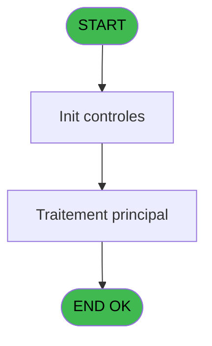

# ADH IDE 6 - Suppression Carac interdit

> **Analyse**: Phases 1-4 2026-02-07 03:37 -> 03:38 (32s) | Assemblage 12:44
> **Pipeline**: V7.2 Enrichi
> **Structure**: 4 onglets (Resume | Ecrans | Donnees | Connexions)

<!-- TAB:Resume -->

## 1. FICHE D'IDENTITE

| Attribut | Valeur |
|----------|--------|
| Projet | ADH |
| IDE Position | 6 |
| Nom Programme | Suppression Carac interdit |
| Fichier source | `Prg_6.xml` |
| Dossier IDE | General |
| Taches | 1 (0 ecrans visibles) |
| Tables modifiees | 0 |
| Programmes appeles | 0 |
| Complexite | **BASSE** (score 0/100) |

## 2. DESCRIPTION FONCTIONNELLE

Le programme **ADH IDE 6 - "Suppression Carac interdit"** est un utilitaire de normalisation des codes de nationalité. Son rôle exclusif est de nettoyer les tirets ('-') présents dans les chaînes de caractères en les remplaçant par des tirets bas ('_'). Appelé par le programme ADH IDE 5 "Alimentation Combos NATION P", il garantit que les codes de nationalité respectent un format standardisé requis par le système de réservation PMS. Le programme n'accède à aucune table de données — c'est une transformation purement en mémoire sur une variable locale (A) contenant la concaténation des nationalités.

La logique repose sur trois expressions : une première vérifie l'absence de tiret (aucune transformation nécessaire), une deuxième détecte la présence du caractère, et la troisième effectue la substitution en découpant la chaîne avant et après le tiret, en insérant un tiret bas. Cette opération est critique pour maintenir la cohérence des données de nationalité à travers la chaîne de traitement du système, sans risque de perte d'information puisque seul le caractère séparateur est transformé.

**Dépendance métier :** Le programme est terminal (aucun appelé) et fait partie intégrante du flux d'alimentation des combos de nationalité. Son remplacement ou suppression affecterait directement la cohérence des données de réservation en aval, ce qui le rend transversalement important malgré sa simplicité apparente.

## 3. BLOCS FONCTIONNELS

### 3.1 Traitement (1 tache)

Traitements internes.

---

#### 6 - Suppression Carac interdit

**Role** : Traitement : Suppression Carac interdit.

## 5. REGLES METIER

*(Aucune regle metier identifiee dans les expressions)*

## 6. CONTEXTE

- **Appele par**: [Alimentation Combos NATION P (IDE 5)](ADH-IDE-5.md)
- **Appelle**: 0 programmes | **Tables**: 0 (W:0 R:0 L:0) | **Taches**: 1 | **Expressions**: 3

<!-- TAB:Ecrans -->

## 8. ECRANS

*(Programme sans ecran visible)*

## 9. NAVIGATION

### 9.3 Structure hierarchique (1 tache)

| Position | Tache | Type | Dimensions | Bloc |
|----------|-------|------|------------|------|
| **6.1** | [**Suppression Carac interdit** (6)](#t1) | MDI | - | Traitement |

### 9.4 Algorigramme

> **Legende**: Vert = START/END OK | Rouge = END KO | Bleu = Decisions
> *Algorigramme auto-genere. Utiliser `/algorigramme` pour une synthese metier detaillee.*

<!-- TAB:Donnees -->

## 10. TABLES

### Tables utilisees (0)

| ID | Nom | Description | Type | R | W | L | Usages |
|----|-----|-------------|------|---|---|---|--------|

### Colonnes par table (0 / 0 tables avec colonnes identifiees)

## 11. VARIABLES

*(Programme sans variables locales mappees)*

## 12. EXPRESSIONS

**3 / 3 expressions decodees (100%)**

### 12.1 Repartition par type

| Type | Expressions | Regles |
|------|-------------|--------|
| CONDITION | 2 | 0 |
| CONCATENATION | 1 | 0 |

### 12.2 Expressions cles par type

#### CONDITION (2 expressions)

| Type | IDE | Expression | Regle |
|------|-----|------------|-------|
| CONDITION | 2 | `InStr (< v. combo [A],'-')<>0` | - |
| CONDITION | 1 | `InStr (< v. combo [A],'-')=0` | - |

#### CONCATENATION (1 expressions)

| Type | IDE | Expression | Regle |
|------|-----|------------|-------|
| CONCATENATION | 3 | `Left (< v. combo [A],InStr (< v. combo [A],'-')-1)&'_'&Right (< v. combo [A],Len (< v. combo [A])-InStr (< v. combo [A],'-'))` | - |

<!-- TAB:Connexions -->

## 13. GRAPHE D'APPELS

### 13.1 Chaine depuis Main (Callers)

Main -> ... -> [Alimentation Combos NATION P (IDE 5)](ADH-IDE-5.md) -> **Suppression Carac interdit (IDE 6)**

### 13.2 Callers

| IDE | Nom Programme | Nb Appels |
|-----|---------------|-----------|
| [5](ADH-IDE-5.md) | Alimentation Combos NATION P | 1 |

### 13.3 Callees (programmes appeles)

### 13.4 Detail Callees avec contexte

| IDE | Nom Programme | Appels | Contexte |
|-----|---------------|--------|----------|
| - | (aucun) | - | - |

## 14. RECOMMANDATIONS MIGRATION

### 14.1 Profil du programme

| Metrique | Valeur | Impact migration |
|----------|--------|-----------------|
| Lignes de logique | 3 | Programme compact |
| Expressions | 3 | Peu de logique |
| Tables WRITE | 0 | Impact faible |
| Sous-programmes | 0 | Peu de dependances |
| Ecrans visibles | 0 | Ecran unique ou traitement batch |
| Code desactive | 0% (0 / 3) | Code sain |
| Regles metier | 0 | Pas de regle identifiee |

### 14.2 Plan de migration par bloc

#### Traitement (1 tache: 0 ecran, 1 traitement)

- **Strategie** : 1 service(s) backend injectable(s) (Domain Services).
- Decomposer les taches en services unitaires testables.

### 14.3 Dependances critiques

| Dependance | Type | Appels | Impact |
|------------|------|--------|--------|

---
*Spec DETAILED generee par Pipeline V7.2 - 2026-02-07 12:46*
