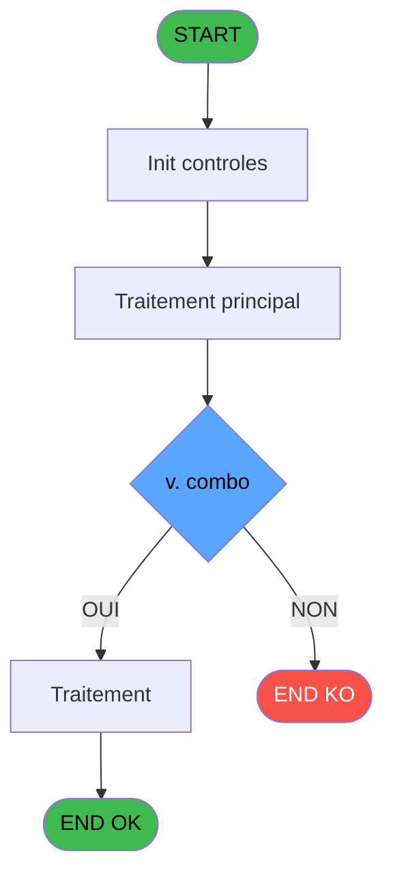

# ADH IDE 6 - Suppression Carac interdit

> **Analyse**: Phases 1-4 2026-02-07 03:38 -> 01:04 (21h25min) | Assemblage 01:04
> **Pipeline**: V7.2 Enrichi
> **Structure**: 4 onglets (Resume | Ecrans | Donnees | Connexions)

<!-- TAB:Resume -->

## 1. FICHE D'IDENTITE

| Attribut | Valeur |
|----------|--------|
| Projet | ADH |
| IDE Position | 6 |
| Nom Programme | Suppression Carac interdit |
| Fichier source | `Prg_6.xml` |
| Dossier IDE | General |
| Taches | 1 (0 ecrans visibles) |
| Tables modifiees | 0 |
| Programmes appeles | 0 |
| Complexite | **BASSE** (score 0/100) |

## 2. DESCRIPTION FONCTIONNELLE

# ADH IDE 6 - Suppression Carac Interdit

Programme utilitaire qui valide et nettoie les caractères interdits dans les données avant leur insertion en base. Détecte les caractères spéciaux non autorisés (accents mal formés, caractères de contrôle, symboles réservés) et les supprime ou les remplace selon les règles de validation définies.

Appelé directement depuis **ADH IDE 5 - Alimentation Combos NATION P** lors de la saisi/modification de données dans les champs texte critiques. Assure la conformité des données avant persistance en base pour éviter les corruption ou les erreurs de traitement en aval.

Fait partie des utilitaires partagés **ADH.ecf** (composant **Sessions_Reprises**) et est potentiellement appelé depuis d'autres projets (PBP, PVE) qui nécessitent une validation stricte des caractères saisis.

## 3. BLOCS FONCTIONNELS

### 3.1 Traitement (1 tache)

Traitements internes.

---

#### 6 - Suppression Carac interdit

**Role** : Traitement : Suppression Carac interdit.

## 5. REGLES METIER

2 regles identifiees:

### Autres (2 regles)

#### [RM-001] Condition: InStr (< v. combo [A],'-') egale 0

| Element | Detail |
|---------|--------|
| **Condition** | `InStr (< v. combo [A],'-')=0` |
| **Si vrai** | Action si vrai |
| **Variables** | EN (< v. combo) |
| **Expression source** | Expression 1 : `InStr (< v. combo [A],'-')=0` |
| **Exemple** | Si InStr (< v. combo [A],'-')=0 → Action si vrai |

#### [RM-002] Condition: InStr (< v. combo [A],'-') different de 0

| Element | Detail |
|---------|--------|
| **Condition** | `InStr (< v. combo [A],'-')<>0` |
| **Si vrai** | Action si vrai |
| **Variables** | EN (< v. combo) |
| **Expression source** | Expression 2 : `InStr (< v. combo [A],'-')<>0` |
| **Exemple** | Si InStr (< v. combo [A],'-')<>0 → Action si vrai |

## 6. CONTEXTE

- **Appele par**: [Alimentation Combos NATION P (IDE 5)](ADH-IDE-5.md)
- **Appelle**: 0 programmes | **Tables**: 0 (W:0 R:0 L:0) | **Taches**: 1 | **Expressions**: 3

<!-- TAB:Ecrans -->

## 8. ECRANS

*(Programme sans ecran visible)*

## 9. NAVIGATION

### 9.3 Structure hierarchique (1 tache)

| Position | Tache | Type | Dimensions | Bloc |
|----------|-------|------|------------|------|
| **6.1** | [**Suppression Carac interdit** (6)](#t1) | MDI | - | Traitement |

### 9.4 Algorigramme

> **Legende**: Vert = START/END OK | Rouge = END KO | Bleu = Decisions
> *Algorigramme auto-genere. Utiliser `/algorigramme` pour une synthese metier detaillee.*

<!-- TAB:Donnees -->

## 10. TABLES

### Tables utilisees (0)

| ID | Nom | Description | Type | R | W | L | Usages |
|----|-----|-------------|------|---|---|---|--------|

### Colonnes par table (0 / 0 tables avec colonnes identifiees)

## 11. VARIABLES

*(Programme sans variables locales mappees)*

## 12. EXPRESSIONS

**3 / 3 expressions decodees (100%)**

### 12.1 Repartition par type

| Type | Expressions | Regles |
|------|-------------|--------|
| CONCATENATION | 1 | 0 |
| CONDITION | 2 | 2 |

### 12.2 Expressions cles par type

#### CONCATENATION (1 expressions)

| Type | IDE | Expression | Regle |
|------|-----|------------|-------|
| CONCATENATION | 3 | `Left (< v. combo [A],InStr (< v. combo [A],'-')-1)&'_'&Right (< v. combo [A],Len (< v. combo [A])-InStr (< v. combo [A],'-'))` | - |

#### CONDITION (2 expressions)

| Type | IDE | Expression | Regle |
|------|-----|------------|-------|
| CONDITION | 2 | `InStr (< v. combo [A],'-')<>0` | [RM-002](#rm-RM-002) |
| CONDITION | 1 | `InStr (< v. combo [A],'-')=0` | [RM-001](#rm-RM-001) |

<!-- TAB:Connexions -->

## 13. GRAPHE D'APPELS

### 13.1 Chaine depuis Main (Callers)

Main -> ... -> [Alimentation Combos NATION P (IDE 5)](ADH-IDE-5.md) -> **Suppression Carac interdit (IDE 6)**

### 13.2 Callers

| IDE | Nom Programme | Nb Appels |
|-----|---------------|-----------|
| [5](ADH-IDE-5.md) | Alimentation Combos NATION P | 1 |

### 13.3 Callees (programmes appeles)

### 13.4 Detail Callees avec contexte

| IDE | Nom Programme | Appels | Contexte |
|-----|---------------|--------|----------|
| - | (aucun) | - | - |

## 14. RECOMMANDATIONS MIGRATION

### 14.1 Profil du programme

| Metrique | Valeur | Impact migration |
|----------|--------|-----------------|
| Lignes de logique | 3 | Programme compact |
| Expressions | 3 | Peu de logique |
| Tables WRITE | 0 | Impact faible |
| Sous-programmes | 0 | Peu de dependances |
| Ecrans visibles | 0 | Ecran unique ou traitement batch |
| Code desactive | 0% (0 / 3) | Code sain |
| Regles metier | 2 | Quelques regles a preserver |

### 14.2 Plan de migration par bloc

#### Traitement (1 tache: 0 ecran, 1 traitement)

- **Strategie** : 1 service(s) backend injectable(s) (Domain Services).
- Decomposer les taches en services unitaires testables.

### 14.3 Dependances critiques

| Dependance | Type | Appels | Impact |
|------------|------|--------|--------|

---
*Spec DETAILED generee par Pipeline V7.2 - 2026-02-08 01:04*
