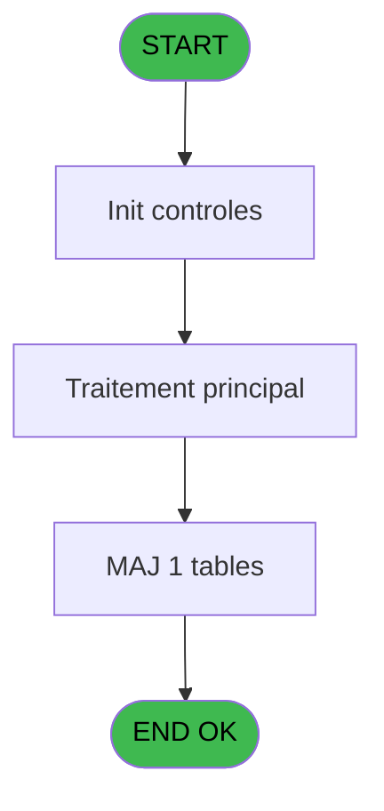
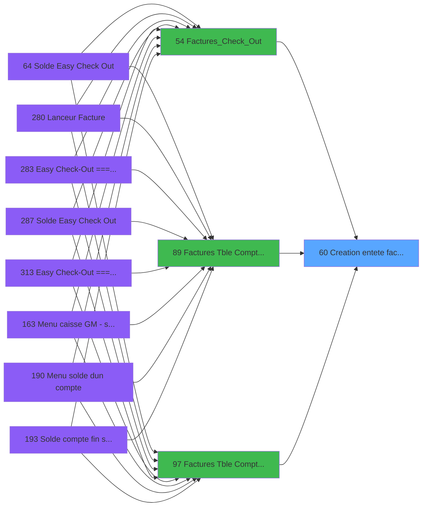

# ADH IDE 60 - Creation entete facture

> **Analyse**: Phases 1-4 2026-02-07 16:16 -> 01:55 (9h38min) | Assemblage 01:55
> **Pipeline**: V7.2 Enrichi
> **Structure**: 4 onglets (Resume | Ecrans | Donnees | Connexions)

<!-- TAB:Resume -->

## 1. FICHE D'IDENTITE

| Attribut | Valeur |
|----------|--------|
| Projet | ADH |
| IDE Position | 60 |
| Nom Programme | Creation entete facture |
| Fichier source | `Prg_60.xml` |
| Dossier IDE | Facturation |
| Taches | 1 (0 ecrans visibles) |
| Tables modifiees | 1 |
| Programmes appeles | 0 |
| Complexite | **BASSE** (score 7/100) |

## 2. DESCRIPTION FONCTIONNELLE

ADH IDE 60 crée les en-têtes de facture avec gestion automatique des paramètres TVA. Le programme initialise les structures de facturation en fonction du contexte appelant (mode comptabilité ou vente), puis insère ou met à jour les enregistrements dans la table `taxe_add_param` qui stocke les configurations de taxe spécifiques à chaque facture.

Le flux principal récupère les paramètres TVA du contexte session (devise, taux, régime fiscal) et les applique à la nouvelle facture en création. Il gère les cas particuliers où la TVA doit être calculée différemment selon le type de client ou le service rendu, en s'appuyant sur les données transmises par les programmes appelants (IDE 89, 54, 97).

Ce programme est un point de passage obligatoire avant la création des lignes de facture. Il garantit que chaque facture dispose d'une configuration TVA cohérente et traçable dans `taxe_add_param`, évitant les incohérences lors du calcul des totaux et des impressions ultérieures.

## 3. BLOCS FONCTIONNELS

## 5. REGLES METIER

*(Aucune regle metier identifiee dans les expressions)*

## 6. CONTEXTE

- **Appele par**: [Factures (Tble Compta&Vent (IDE 89)](ADH-IDE-89.md), [Factures_Check_Out (IDE 54)](ADH-IDE-54.md), [Factures (Tble Compta&Vent) V3 (IDE 97)](ADH-IDE-97.md)
- **Appelle**: 0 programmes | **Tables**: 1 (W:1 R:0 L:0) | **Taches**: 1 | **Expressions**: 7

<!-- TAB:Ecrans -->

## 8. ECRANS

*(Programme sans ecran visible)*

## 9. NAVIGATION

### 9.3 Structure hierarchique (0 tache)

| Position | Tache | Type | Dimensions | Bloc |
|----------|-------|------|------------|------|

### 9.4 Algorigramme

> **Legende**: Vert = START/END OK | Rouge = END KO | Bleu = Decisions
> *Algorigramme auto-genere. Utiliser `/algorigramme` pour une synthese metier detaillee.*

<!-- TAB:Donnees -->

## 10. TABLES

### Tables utilisees (1)

| ID | Nom | Description | Type | R | W | L | Usages |
|----|-----|-------------|------|---|---|---|--------|
| 932 | taxe_add_param |  | DB |   | **W** |   | 1 |

### Colonnes par table (1 / 1 tables avec colonnes identifiees)

Table 932 - taxe_add_param (**W**) - 1 usages

| Lettre | Variable | Acces | Type |
|--------|----------|-------|------|
| A | p.NumFact | W | Numeric |
| B | p.Nom | W | Unicode |
| C | p.Adresse | W | Unicode |
| D | p.CodePostal | W | Unicode |
| E | p.Ville | W | Unicode |
| F | p.Tel | W | Unicode |
| G | P.Pays | W | Unicode |

## 11. VARIABLES

### 11.1 Parametres entrants (7)

Variables recues du programme appelant ([Factures (Tble Compta&Vent (IDE 89)](ADH-IDE-89.md)).

| Lettre | Nom | Type | Usage dans |
|--------|-----|------|-----------|
| EN | p.NumFact | Numeric | 1x parametre entrant |
| EO | p.Nom | Unicode | 1x parametre entrant |
| EP | p.Adresse | Unicode | 1x parametre entrant |
| EQ | p.CodePostal | Unicode | 1x parametre entrant |
| ER | p.Ville | Unicode | 1x parametre entrant |
| ES | p.Tel | Unicode | 1x parametre entrant |
| ET | P.Pays | Unicode | 1x parametre entrant |

## 12. EXPRESSIONS

**7 / 7 expressions decodees (100%)**

### 12.1 Repartition par type

| Type | Expressions | Regles |
|------|-------------|--------|
| OTHER | 7 | 0 |

### 12.2 Expressions cles par type

#### OTHER (7 expressions)

| Type | IDE | Expression | Regle |
|------|-----|------------|-------|
| OTHER | 5 | `p.Ville [E]` | - |
| OTHER | 6 | `p.Tel [F]` | - |
| OTHER | 7 | `P.Pays [G]` | - |
| OTHER | 4 | `p.CodePostal [D]` | - |
| OTHER | 1 | `p.NumFact [A]` | - |
| ... | | *+2 autres* | |

<!-- TAB:Connexions -->

## 13. GRAPHE D'APPELS

### 13.1 Chaine depuis Main (Callers)

Main -> ... -> [Factures (Tble Compta&Vent (IDE 89)](ADH-IDE-89.md) -> **Creation entete facture (IDE 60)**

Main -> ... -> [Factures_Check_Out (IDE 54)](ADH-IDE-54.md) -> **Creation entete facture (IDE 60)**

Main -> ... -> [Factures (Tble Compta&Vent) V3 (IDE 97)](ADH-IDE-97.md) -> **Creation entete facture (IDE 60)**

### 13.2 Callers

| IDE | Nom Programme | Nb Appels |
|-----|---------------|-----------|
| [89](ADH-IDE-89.md) | Factures (Tble Compta&Vent | 3 |
| [54](ADH-IDE-54.md) | Factures_Check_Out | 2 |
| [97](ADH-IDE-97.md) | Factures (Tble Compta&Vent) V3 | 1 |

### 13.3 Callees (programmes appeles)

### 13.4 Detail Callees avec contexte

| IDE | Nom Programme | Appels | Contexte |
|-----|---------------|--------|----------|
| - | (aucun) | - | - |

## 14. RECOMMANDATIONS MIGRATION

### 14.1 Profil du programme

| Metrique | Valeur | Impact migration |
|----------|--------|-----------------|
| Lignes de logique | 23 | Programme compact |
| Expressions | 7 | Peu de logique |
| Tables WRITE | 1 | Impact faible |
| Sous-programmes | 0 | Peu de dependances |
| Ecrans visibles | 0 | Ecran unique ou traitement batch |
| Code desactive | 0% (0 / 23) | Code sain |
| Regles metier | 0 | Pas de regle identifiee |

### 14.2 Plan de migration par bloc

### 14.3 Dependances critiques

| Dependance | Type | Appels | Impact |
|------------|------|--------|--------|
| taxe_add_param | Table WRITE (Database) | 1x | Schema + repository |

---
*Spec DETAILED generee par Pipeline V7.2 - 2026-02-08 01:56*
