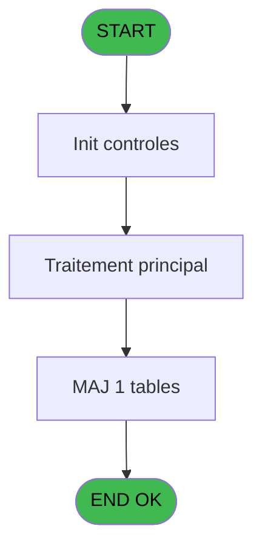
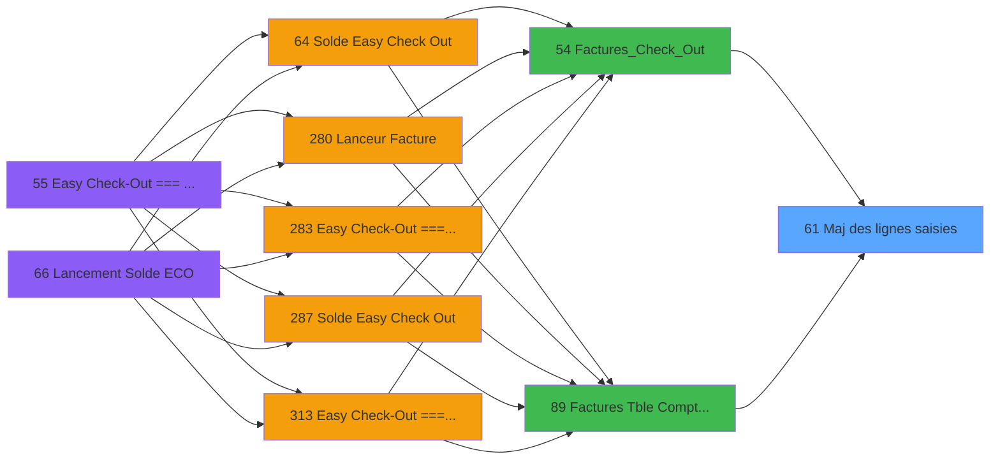

# ADH IDE 61 - Maj des lignes saisies

> **Analyse**: Phases 1-4 2026-02-08 01:56 -> 01:56 (4s) | Assemblage 01:56
> **Pipeline**: V7.2 Enrichi
> **Structure**: 4 onglets (Resume | Ecrans | Donnees | Connexions)

<!-- TAB:Resume -->

## 1. FICHE D'IDENTITE

| Attribut | Valeur |
|----------|--------|
| Projet | ADH |
| IDE Position | 61 |
| Nom Programme | Maj des lignes saisies |
| Fichier source | `Prg_61.xml` |
| Dossier IDE | General |
| Taches | 1 (0 ecrans visibles) |
| Tables modifiees | 1 |
| Programmes appeles | 0 |
| Complexite | **BASSE** (score 7/100) |

## 2. DESCRIPTION FONCTIONNELLE

Le programme ADH IDE 61 assure la mise à jour des lignes de facturation saisies dans la table comptable. Il intervient dans le flux de gestion des factures, spécifiquement après la saisie de nouvelles lignes comptables et avant leur validation définitive. Son rôle est de synchroniser l'état des enregistrements avec les modifications apportées par l'utilisateur.

Le programme reçoit des appels depuis deux points d'entrée majeurs : la table Compta & Vent (ADH IDE 89) qui gère l'interface de saisie des lignes comptables, et le programme Factures_Check_Out (ADH IDE 54) qui orchestrate le processus de checkout facturation. Il traite les paramètres de ligne (identifiants, montants, descriptions) et applique les modifications directement dans la table comptable.

L'opération cible la table `comptable________cte` qui stocke les détails des lignes de facturation. Le programme effectue des validations de cohérence (montants, codes comptables) avant de persister les changements, puis retourne un statut de succès ou d'erreur permettant à l'appelant de continuer le flux ou d'afficher un message d'alerte à l'utilisateur.

## 3. BLOCS FONCTIONNELS

## 5. REGLES METIER

3 regles identifiees:

### Autres (3 regles)

#### [RM-001] Condition: [Y] egale 0

| Element | Detail |
|---------|--------|
| **Condition** | `[Y]=0` |
| **Si vrai** | Action si vrai |
| **Expression source** | Expression 1 : `[Y]=0` |
| **Exemple** | Si [Y]=0 → Action si vrai |

#### [RM-002] Condition: [BH] egale 0

| Element | Detail |
|---------|--------|
| **Condition** | `[BH]=0` |
| **Si vrai** | Action si vrai |
| **Expression source** | Expression 2 : `[BH]=0` |
| **Exemple** | Si [BH]=0 → Action si vrai |

#### [RM-003] Condition toujours vraie (flag actif)

| Element | Detail |
|---------|--------|
| **Condition** | `P.Flague [C]` |
| **Si vrai** | 'TRUE'LOG |
| **Si faux** | 'FALSE'LOG) |
| **Variables** | EP (P.Flague) |
| **Expression source** | Expression 9 : `IF(P.Flague [C],'TRUE'LOG,'FALSE'LOG)` |
| **Exemple** | Si P.Flague [C] → 'TRUE'LOG. Sinon → 'FALSE'LOG) |

## 6. CONTEXTE

- **Appele par**: [Factures (Tble Compta&Vent (IDE 89)](ADH-IDE-89.md), [Factures_Check_Out (IDE 54)](ADH-IDE-54.md)
- **Appelle**: 0 programmes | **Tables**: 4 (W:1 R:0 L:3) | **Taches**: 1 | **Expressions**: 14

<!-- TAB:Ecrans -->

## 8. ECRANS

*(Programme sans ecran visible)*

## 9. NAVIGATION

### 9.3 Structure hierarchique (0 tache)

| Position | Tache | Type | Dimensions | Bloc |
|----------|-------|------|------------|------|

### 9.4 Algorigramme

> **Legende**: Vert = START/END OK | Rouge = END KO | Bleu = Decisions
> *Algorigramme auto-genere. Utiliser `/algorigramme` pour une synthese metier detaillee.*

<!-- TAB:Donnees -->

## 10. TABLES

### Tables utilisees (4)

| ID | Nom | Description | Type | R | W | L | Usages |
|----|-----|-------------|------|---|---|---|--------|
| 40 | comptable________cte |  | DB |   | **W** |   | 1 |
| 263 | vente | Donnees de ventes | DB |   |   | L | 1 |
| 866 | maj_appli_tpe |  | DB |   |   | L | 1 |
| 870 | Rayons_Boutique |  | DB |   |   | L | 1 |

### Colonnes par table (2 / 1 tables avec colonnes identifiees)

Table 40 - comptable________cte (**W**) - 1 usages

| Lettre | Variable | Acces | Type |
|--------|----------|-------|------|
| A | p.Societe | W | Unicode |
| B | p.Compte | W | Numeric |
| C | P.Flague | W | Logical |
| D | p.NumFac | W | Numeric |
| E | p.NomFacPDF | W | Alpha |
| F | V retour Compta | W | Logical |
| G | v Retour Vente | W | Logical |
| H | v Trouvé Compta | W | Logical |
| I | v Trouvé Vente | W | Logical |

## 11. VARIABLES

### 11.1 Parametres entrants (5)

Variables recues du programme appelant ([Factures (Tble Compta&Vent (IDE 89)](ADH-IDE-89.md)).

| Lettre | Nom | Type | Usage dans |
|--------|-----|------|-----------|
| EN | p.Societe | Unicode | 1x parametre entrant |
| EO | p.Compte | Numeric | 1x parametre entrant |
| EP | P.Flague | Logical | 1x parametre entrant |
| EQ | p.NumFac | Numeric | 1x parametre entrant |
| ER | p.NomFacPDF | Alpha | 1x parametre entrant |

### 11.2 Variables de session (4)

Variables persistantes pendant toute la session.

| Lettre | Nom | Type | Usage dans |
|--------|-----|------|-----------|
| ES | V retour Compta | Logical | - |
| ET | v Retour Vente | Logical | - |
| EU | v Trouvé Compta | Logical | - |
| EV | v Trouvé Vente | Logical | - |

## 12. EXPRESSIONS

**14 / 14 expressions decodees (100%)**

### 12.1 Repartition par type

| Type | Expressions | Regles |
|------|-------------|--------|
| CONDITION | 2 | 2 |
| CAST_LOGIQUE | 1 | 5 |
| DATE | 2 | 0 |
| OTHER | 9 | 0 |

### 12.2 Expressions cles par type

#### CONDITION (2 expressions)

| Type | IDE | Expression | Regle |
|------|-----|------------|-------|
| CONDITION | 2 | `[BH]=0` | [RM-002](#rm-RM-002) |
| CONDITION | 1 | `[Y]=0` | [RM-001](#rm-RM-001) |

#### CAST_LOGIQUE (1 expressions)

| Type | IDE | Expression | Regle |
|------|-----|------------|-------|
| CAST_LOGIQUE | 9 | `IF(P.Flague [C],'TRUE'LOG,'FALSE'LOG)` | [RM-003](#rm-RM-003) |

#### DATE (2 expressions)

| Type | IDE | Expression | Regle |
|------|-----|------------|-------|
| DATE | 8 | `Date()` | - |
| DATE | 4 | `Date()` | - |

#### OTHER (9 expressions)

| Type | IDE | Expression | Regle |
|------|-----|------------|-------|
| OTHER | 12 | `[BC]` | - |
| OTHER | 11 | `[W]` | - |
| OTHER | 14 | `[S]` | - |
| OTHER | 13 | `[K]` | - |
| OTHER | 10 | `[K]` | - |
| ... | | *+4 autres* | |

<!-- TAB:Connexions -->

## 13. GRAPHE D'APPELS

### 13.1 Chaine depuis Main (Callers)

Main -> ... -> [Factures (Tble Compta&Vent (IDE 89)](ADH-IDE-89.md) -> **Maj des lignes saisies (IDE 61)**

Main -> ... -> [Factures_Check_Out (IDE 54)](ADH-IDE-54.md) -> **Maj des lignes saisies (IDE 61)**

### 13.2 Callers

| IDE | Nom Programme | Nb Appels |
|-----|---------------|-----------|
| [89](ADH-IDE-89.md) | Factures (Tble Compta&Vent | 3 |
| [54](ADH-IDE-54.md) | Factures_Check_Out | 2 |

### 13.3 Callees (programmes appeles)

### 13.4 Detail Callees avec contexte

| IDE | Nom Programme | Appels | Contexte |
|-----|---------------|--------|----------|
| - | (aucun) | - | - |

## 14. RECOMMANDATIONS MIGRATION

### 14.1 Profil du programme

| Metrique | Valeur | Impact migration |
|----------|--------|-----------------|
| Lignes de logique | 62 | Programme compact |
| Expressions | 14 | Peu de logique |
| Tables WRITE | 1 | Impact faible |
| Sous-programmes | 0 | Peu de dependances |
| Ecrans visibles | 0 | Ecran unique ou traitement batch |
| Code desactive | 0% (0 / 62) | Code sain |
| Regles metier | 3 | Quelques regles a preserver |

### 14.2 Plan de migration par bloc

### 14.3 Dependances critiques

| Dependance | Type | Appels | Impact |
|------------|------|--------|--------|
| comptable________cte | Table WRITE (Database) | 1x | Schema + repository |

---
*Spec DETAILED generee par Pipeline V7.2 - 2026-02-08 01:56*
