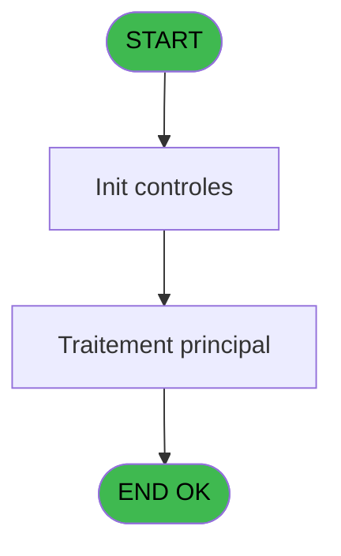
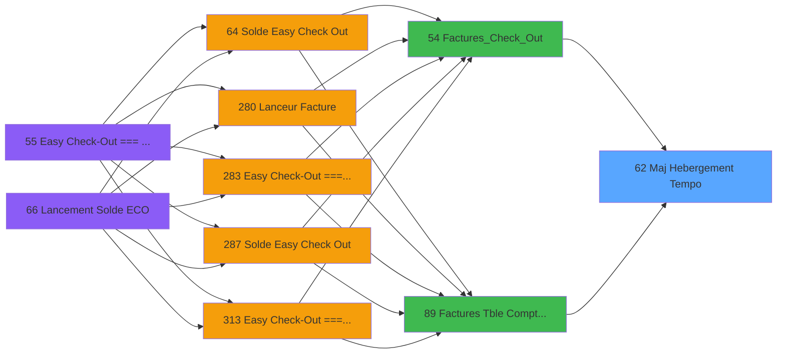

# ADH IDE 62 - Maj Hebergement Tempo

> **Analyse**: Phases 1-4 2026-02-08 01:56 -> 01:56 (4s) | Assemblage 01:56
> **Pipeline**: V7.2 Enrichi
> **Structure**: 4 onglets (Resume | Ecrans | Donnees | Connexions)

<!-- TAB:Resume -->

## 1. FICHE D'IDENTITE

| Attribut | Valeur |
|----------|--------|
| Projet | ADH |
| IDE Position | 62 |
| Nom Programme | Maj Hebergement Tempo |
| Fichier source | `Prg_62.xml` |
| Dossier IDE | General |
| Taches | 1 (0 ecrans visibles) |
| Tables modifiees | 0 |
| Programmes appeles | 0 |
| Complexite | **BASSE** (score 0/100) |

## 2. DESCRIPTION FONCTIONNELLE

ADH IDE 62 - "Maj Hebergement Tempo" est un sous-programme de synchronisation des données d'hébergement temporaire lors du processus de facturation. Appelé depuis IDE 54 (Factures_Check_Out) et IDE 89 (Factures - Table Compta & Ventes), il gère la cohérence entre trois ensembles de données : les informations de séjour, les allocations Gift Pass, et les mises à jour TPE (terminal de paiement). Le programme ne prend aucun paramètre en entrée et opère en lecture seule sur deux tables : maj_appli_tpe et affectation_gift_pass, sans créer ni modifier de données.

La logique métier repose sur une **validation conditionnelle et une synchronisation des données** : vérifier que les règles de cohérence des données d'hébergement sont respectées, assurer que les allocations Gift Pass se reflètent dans les enregistrements temporaires d'hébergement, et coordonner les mises à jour d'hébergement avec les données de l'application TPE. Exécuté comme étape du workflow de génération de factures, IDE 62 garantit l'alignement des informations de séjour temporaire dans le système de facturation avant l'émission des factures.

Son intégration dans les deux contextes d'appel confirme son rôle de **support orchestration** pour la facturation professionnelle (IDE 54) et la gestion comptable-vente (IDE 89), plutôt qu'un composant effectuant des transactions métier critiques. Les deux appelants le classent comme une mise à jour de données "Normale" sans impact critique, reflétant sa fonction de synchronisation accessoire.

## 3. BLOCS FONCTIONNELS

## 5. REGLES METIER

*(Aucune regle metier identifiee dans les expressions)*

## 6. CONTEXTE

- **Appele par**: [Factures_Check_Out (IDE 54)](ADH-IDE-54.md), [Factures (Tble Compta&Vent (IDE 89)](ADH-IDE-89.md)
- **Appelle**: 0 programmes | **Tables**: 2 (W:0 R:1 L:1) | **Taches**: 1 | **Expressions**: 8

<!-- TAB:Ecrans -->

## 8. ECRANS

*(Programme sans ecran visible)*

## 9. NAVIGATION

### 9.3 Structure hierarchique (0 tache)

| Position | Tache | Type | Dimensions | Bloc |
|----------|-------|------|------------|------|

### 9.4 Algorigramme

> **Legende**: Vert = START/END OK | Rouge = END KO | Bleu = Decisions
> *Algorigramme auto-genere. Utiliser `/algorigramme` pour une synthese metier detaillee.*

<!-- TAB:Donnees -->

## 10. TABLES

### Tables utilisees (2)

| ID | Nom | Description | Type | R | W | L | Usages |
|----|-----|-------------|------|---|---|---|--------|
| 866 | maj_appli_tpe |  | DB | R |   |   | 1 |
| 868 | Affectation_Gift_Pass |  | DB |   |   | L | 1 |

### Colonnes par table (1 / 1 tables avec colonnes identifiees)

Table 866 - maj_appli_tpe (R) - 1 usages

| Lettre | Variable | Acces | Type |
|--------|----------|-------|------|
| A | p.Societe | R | Unicode |
| B | p.Compte | R | Numeric |
| C | p.Filiation | R | Numeric |
| D | p.NumFac | R | Numeric |
| E | p.DateDebut | R | Date |
| F | p.DateFin | R | Date |
| G | V.Lien Hebergement_Pro | R | Logical |

## 11. VARIABLES

### 11.1 Parametres entrants (6)

Variables recues du programme appelant ([Factures_Check_Out (IDE 54)](ADH-IDE-54.md)).

| Lettre | Nom | Type | Usage dans |
|--------|-----|------|-----------|
| EN | p.Societe | Unicode | 1x parametre entrant |
| EO | p.Compte | Numeric | 1x parametre entrant |
| EP | p.Filiation | Numeric | 1x parametre entrant |
| EQ | p.NumFac | Numeric | 1x parametre entrant |
| ER | p.DateDebut | Date | 1x parametre entrant |
| ES | p.DateFin | Date | 1x parametre entrant |

### 11.2 Variables de session (1)

Variables persistantes pendant toute la session.

| Lettre | Nom | Type | Usage dans |
|--------|-----|------|-----------|
| ET | V.Lien Hebergement_Pro | Logical | 1x session |

## 12. EXPRESSIONS

**8 / 8 expressions decodees (100%)**

### 12.1 Repartition par type

| Type | Expressions | Regles |
|------|-------------|--------|
| DATE | 1 | 0 |
| OTHER | 7 | 0 |

### 12.2 Expressions cles par type

#### DATE (1 expressions)

| Type | IDE | Expression | Regle |
|------|-----|------------|-------|
| DATE | 1 | `Date()` | - |

#### OTHER (7 expressions)

| Type | IDE | Expression | Regle |
|------|-----|------------|-------|
| OTHER | 6 | `p.DateDebut [E]` | - |
| OTHER | 7 | `p.DateFin [F]` | - |
| OTHER | 8 | `V.Lien Hebergement_Pro [G]` | - |
| OTHER | 5 | `p.Filiation [C]` | - |
| OTHER | 2 | `p.NumFac [D]` | - |
| ... | | *+2 autres* | |

<!-- TAB:Connexions -->

## 13. GRAPHE D'APPELS

### 13.1 Chaine depuis Main (Callers)

Main -> ... -> [Factures_Check_Out (IDE 54)](ADH-IDE-54.md) -> **Maj Hebergement Tempo (IDE 62)**

Main -> ... -> [Factures (Tble Compta&Vent (IDE 89)](ADH-IDE-89.md) -> **Maj Hebergement Tempo (IDE 62)**

### 13.2 Callers

| IDE | Nom Programme | Nb Appels |
|-----|---------------|-----------|
| [54](ADH-IDE-54.md) | Factures_Check_Out | 1 |
| [89](ADH-IDE-89.md) | Factures (Tble Compta&Vent | 1 |

### 13.3 Callees (programmes appeles)

### 13.4 Detail Callees avec contexte

| IDE | Nom Programme | Appels | Contexte |
|-----|---------------|--------|----------|
| - | (aucun) | - | - |

## 14. RECOMMANDATIONS MIGRATION

### 14.1 Profil du programme

| Metrique | Valeur | Impact migration |
|----------|--------|-----------------|
| Lignes de logique | 25 | Programme compact |
| Expressions | 8 | Peu de logique |
| Tables WRITE | 0 | Impact faible |
| Sous-programmes | 0 | Peu de dependances |
| Ecrans visibles | 0 | Ecran unique ou traitement batch |
| Code desactive | 0% (0 / 25) | Code sain |
| Regles metier | 0 | Pas de regle identifiee |

### 14.2 Plan de migration par bloc

### 14.3 Dependances critiques

| Dependance | Type | Appels | Impact |
|------------|------|--------|--------|

---
*Spec DETAILED generee par Pipeline V7.2 - 2026-02-08 01:58*
