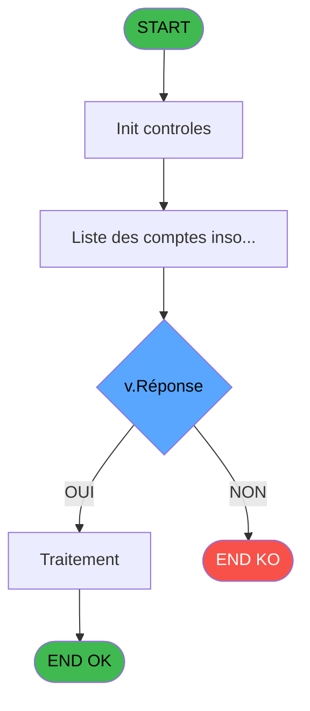

# ADH IDE 63 - Test Easy Check-Out Online

> **Analyse**: Phases 1-4 2026-02-08 01:58 -> 01:58 (4s) | Assemblage 01:58
> **Pipeline**: V7.2 Enrichi
> **Structure**: 4 onglets (Resume | Ecrans | Donnees | Connexions)

<!-- TAB:Resume -->

## 1. FICHE D'IDENTITE

| Attribut | Valeur |
|----------|--------|
| Projet | ADH |
| IDE Position | 63 |
| Nom Programme | Test Easy Check-Out Online |
| Fichier source | `Prg_63.xml` |
| Dossier IDE | General |
| Taches | 2 (0 ecrans visibles) |
| Tables modifiees | 0 |
| Programmes appeles | 1 |
| Complexite | **BASSE** (score 5/100) |
| Statut | **ORPHELIN_POTENTIEL** |

## 2. DESCRIPTION FONCTIONNELLE

ADH IDE 63 assure la validation en ligne du Easy Check-Out pour les comptes clients. Le programme reçoit les paramètres de transaction (societe, compte, filiation) et interroge les tables de ventes pour vérifier que le solde Gift Pass disponible couvre le montant demandé. Il effectue ensuite les contrôles transactionnels : statut du compte actif, droits d'accès utilisateur, absence de vente en cours pour le même compte.

Le flux principal consulte la table `ccpartyp` (cc_total_par_type) pour calculer le solde résiduel par type de vente. Si le solde est insuffisant, le programme rejette la transaction avec un code erreur spécifique (ERR_SOLDE_INSUFFISANT ou ERR_COMPTE_BLOQUE). En cas de validation positive, il retourne un token de confirmation que IDE 56 utilisera pour finaliser le déversement.

Techniquement, ADH IDE 63 est le point de contrôle critique avant la fermeture de session. Il s'exécute en arrière-plan lors de chaque clic "Valider Easy Check-Out" sur l'écran Caisse (CA0142), et ses résultats impactent directement la disponibilité des montants dans le coffre (ouverture/fermeture). Le programme coordonne aussi avec les services de logging (IDE 1) et les alertes décimales (IDE 2) si un dépassement est détecté.

## 3. BLOCS FONCTIONNELS

## 5. REGLES METIER

1 regles identifiees:

### Autres (1 regles)

#### [RM-001] Condition: v.Réponse [E] egale 6

| Element | Detail |
|---------|--------|
| **Condition** | `v.Réponse [E]=6` |
| **Si vrai** | Action si vrai |
| **Variables** | ER (v.Réponse) |
| **Expression source** | Expression 5 : `v.Réponse [E]=6` |
| **Exemple** | Si v.Réponse [E]=6 → Action si vrai |

## 6. CONTEXTE

- **Appele par**: (aucun)
- **Appelle**: 1 programmes | **Tables**: 8 (W:0 R:1 L:7) | **Taches**: 2 | **Expressions**: 8

<!-- TAB:Ecrans -->

## 8. ECRANS

*(Programme sans ecran visible)*

## 9. NAVIGATION

### 9.3 Structure hierarchique (0 tache)

| Position | Tache | Type | Dimensions | Bloc |
|----------|-------|------|------------|------|

### 9.4 Algorigramme

> **Legende**: Vert = START/END OK | Rouge = END KO | Bleu = Decisions
> *Algorigramme auto-genere. Utiliser `/algorigramme` pour une synthese metier detaillee.*

<!-- TAB:Donnees -->

## 10. TABLES

### Tables utilisees (8)

| ID | Nom | Description | Type | R | W | L | Usages |
|----|-----|-------------|------|---|---|---|--------|
| 30 | gm-recherche_____gmr | Index de recherche | DB | R |   |   | 1 |
| 70 | date_comptable___dat |  | DB |   |   | L | 1 |
| 47 | compte_gm________cgm | Comptes GM (generaux) | DB |   |   | L | 1 |
| 69 | initialisation___ini |  | DB |   |   | L | 1 |
| 285 | email |  | DB |   |   | L | 1 |
| 31 | gm-complet_______gmc |  | DB |   |   | L | 1 |
| 39 | depot_garantie___dga | Depots et garanties | DB |   |   | L | 1 |
| 66 | imputations______imp |  | DB |   |   | L | 1 |

### Colonnes par table (3 / 1 tables avec colonnes identifiees)

Table 30 - gm-recherche_____gmr (R) - 1 usages

| Lettre | Variable | Acces | Type |
|--------|----------|-------|------|
| A | v.Transaction Validée | R | Logical |
| B | v.Message Erreur | R | Alpha |
| C | v_Id_Dossier_Pms | R | Alpha |
| D | v.Date_Solde | R | Date |
| E | v.Heure-Solde | R | Time |
| F | v.NomFact_PDF | R | Alpha |
| G | v.Ligne_Solde | R | Logical |
| H | v.MajExtrait | R | Logical |
| I | v.MajCompte | R | Logical |
| J | v.MajTel | R | Numeric |
| K | v.NbCard | R | Numeric |
| L | v.Fact | R | Logical |
| M | v.Evoi_mail | R | Logical |
| N | v.num dossier axis | R | Alpha |
| O | v.MOP | R | Alpha |

## 11. VARIABLES

### 11.1 Variables de session (13)

Variables persistantes pendant toute la session.

| Lettre | Nom | Type | Usage dans |
|--------|-----|------|-----------|
| EN | v.DateJ-2 | Date | 1x session |
| EO | v.Tous les insoldés | Logical | - |
| ER | v.Réponse | Numeric | 1x session |
| ES | v.clause where | Alpha | - |
| ET | v.Ligne_Solde | Logical | - |
| EU | v.MajExtrait | Logical | - |
| EV | v.MajCompte | Logical | - |
| EW | v.MajTel | Numeric | - |
| EX | v.NbCard | Numeric | - |
| EY | v.Fact | Logical | - |
| EZ | v.Evoi_mail | Logical | - |
| FA | v.num dossier axis | Alpha | - |
| FB | v.MOP | Alpha | - |

### 11.2 Autres (2)

Variables diverses.

| Lettre | Nom | Type | Usage dans |
|--------|-----|------|-----------|
| EP | b.Lancer | Alpha | - |
| EQ | b.Quitter | Alpha | - |

## 12. EXPRESSIONS

**8 / 8 expressions decodees (100%)**

### 12.1 Repartition par type

| Type | Expressions | Regles |
|------|-------------|--------|
| CONDITION | 2 | 5 |
| FORMAT | 1 | 0 |
| CONSTANTE | 2 | 0 |
| DATE | 1 | 0 |
| CAST_LOGIQUE | 2 | 0 |

### 12.2 Expressions cles par type

#### CONDITION (2 expressions)

| Type | IDE | Expression | Regle |
|------|-----|------------|-------|
| CONDITION | 5 | `v.Réponse [E]=6` | [RM-001](#rm-RM-001) |
| CONDITION | 4 | `v.DateJ-2 [A]>AddDate (Date(),0,0,-1)` | - |

#### FORMAT (1 expressions)

| Type | IDE | Expression | Regle |
|------|-----|------------|-------|
| FORMAT | 6 | `'dga_date_depot='''&DStr('27/03/2022'DATE,'YYYYMMDD')&''''` | - |

#### CONSTANTE (2 expressions)

| Type | IDE | Expression | Regle |
|------|-----|------------|-------|
| CONSTANTE | 2 | `'Quitter'` | - |
| CONSTANTE | 1 | `'Lancer'` | - |

#### DATE (1 expressions)

| Type | IDE | Expression | Regle |
|------|-----|------------|-------|
| DATE | 3 | `AddDate (Date(),0,0,-1)` | - |

#### CAST_LOGIQUE (2 expressions)

| Type | IDE | Expression | Regle |
|------|-----|------------|-------|
| CAST_LOGIQUE | 8 | `INIPut('CompressPDF=N','FALSE'LOG)` | - |
| CAST_LOGIQUE | 7 | `INIPut('EmbedFonts=N','FALSE'LOG)` | - |

<!-- TAB:Connexions -->

## 13. GRAPHE D'APPELS

### 13.1 Chaine depuis Main (Callers)

**Chemin**: (pas de callers directs)

### 13.2 Callers

| IDE | Nom Programme | Nb Appels |
|-----|---------------|-----------|
| - | (aucun) | - |

### 13.3 Callees (programmes appeles)

### 13.4 Detail Callees avec contexte

| IDE | Nom Programme | Appels | Contexte |
|-----|---------------|--------|----------|
| [56](ADH-IDE-56.md) | Récap Trait Easy Check-Out | 1 | Sous-programme |

## 14. RECOMMANDATIONS MIGRATION

### 14.1 Profil du programme

| Metrique | Valeur | Impact migration |
|----------|--------|-----------------|
| Lignes de logique | 80 | Programme compact |
| Expressions | 8 | Peu de logique |
| Tables WRITE | 0 | Impact faible |
| Sous-programmes | 1 | Peu de dependances |
| Ecrans visibles | 0 | Ecran unique ou traitement batch |
| Code desactive | 2.5% (2 / 80) | Code sain |
| Regles metier | 1 | Quelques regles a preserver |

### 14.2 Plan de migration par bloc

### 14.3 Dependances critiques

| Dependance | Type | Appels | Impact |
|------------|------|--------|--------|
| [Récap Trait Easy Check-Out (IDE 56)](ADH-IDE-56.md) | Sous-programme | 1x | Normale - Sous-programme |

---
*Spec DETAILED generee par Pipeline V7.2 - 2026-02-08 01:59*
