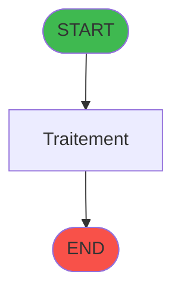
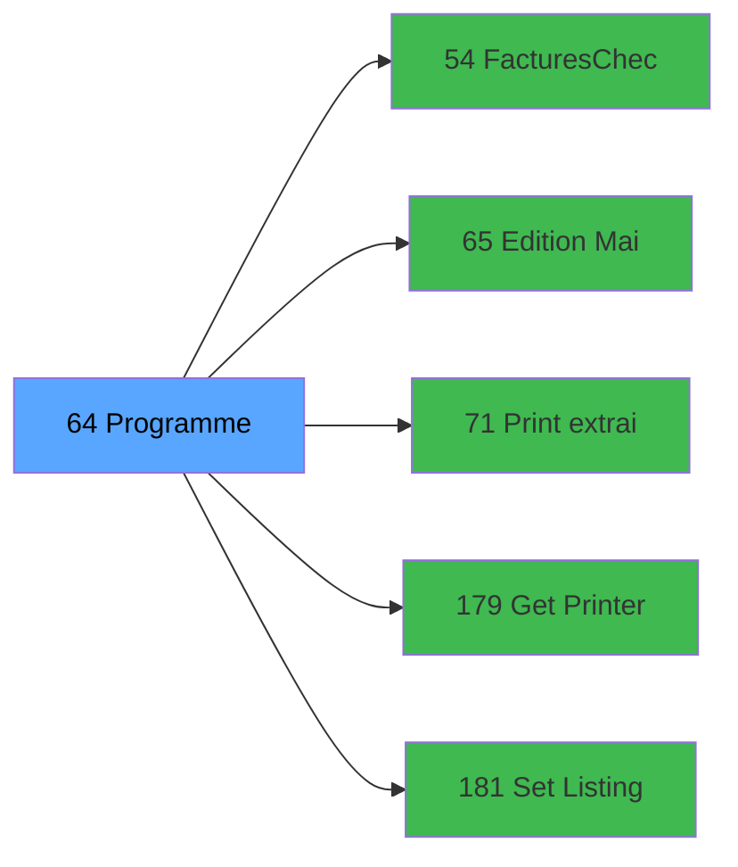

# ADH IDE 64 - Solde Easy Check Out

> **Version spec**: 3.5
> **Analyse**: 2026-01-27 17:57
> **Source**: `Prg_XXX.xml`

---

<!-- TAB:Fonctionnel -->

## SPECIFICATION FONCTIONNELLE

### 1.1 Objectif metier

| Element | Description |
|---------|-------------|
| **Qui** | Operateur |
| **Quoi** | Solde Easy Check Out
 |
| **Pourquoi** | A documenter |
| **Declencheur** | A identifier |

### 1.2 Regles metier

| Code | Regle | Condition |
|------|-------|-----------|
| RM-001 | A documenter | - |

### 1.3 Flux utilisateur

1. Demarrage programme
2. Traitement principal
3. Fin programme

### 1.4 Cas d'erreur

| Erreur | Comportement |
|--------|--------------|
| - | A documenter |

---

<!-- TAB:Technique -->

## SPECIFICATION TECHNIQUE

### 2.1 Identification

| Attribut | Valeur |
|----------|--------|
| **Format IDE** | ADH IDE 64 |
| **Description** | Solde Easy Check Out
 |
| **Module** | ADH |

### 2.2 Tables

| # | Nom logique | Nom physique | Acces | Usage |
|---|-------------|--------------|-------|-------|
| 30 | gm-recherche_____gmr | `cafil008_dat` | L | 1x |
| 30 | gm-recherche_____gmr | `cafil008_dat` | R | 1x |
| 31 | gm-complet_______gmc | `cafil009_dat` | L | 1x |
| 39 | depot_garantie___dga | `cafil017_dat` | L | 2x |
| 40 | comptable________cte | `cafil018_dat` | R | 1x |
| 40 | comptable________cte | `cafil018_dat` | **W** | 2x |
| 47 | compte_gm________cgm | `cafil025_dat` | **W** | 2x |
| 48 | lignes_de_solde__sld | `cafil026_dat` | **W** | 1x |
| 53 | ligne_telephone__lgn | `cafil031_dat` | **W** | 1x |
| 66 | imputations______imp | `cafil044_dat` | L | 2x |
| 68 | compteurs________cpt | `cafil046_dat` | **W** | 4x |
| 69 | initialisation___ini | `cafil047_dat` | L | 1x |
| 70 | date_comptable___dat | `cafil048_dat` | L | 1x |
| 75 | commande_autocom_cot | `cafil053_dat` | **W** | 1x |
| 78 | param__telephone_tel | `cafil056_dat` | L | 1x |
| 78 | param__telephone_tel | `cafil056_dat` | R | 1x |
| 80 | codes_autocom____aut | `cafil058_dat` | L | 1x |
| 80 | codes_autocom____aut | `cafil058_dat` | **W** | 1x |
| 87 | sda_telephone____sda | `cafil065_dat` | L | 2x |
| 87 | sda_telephone____sda | `cafil065_dat` | **W** | 2x |
| 91 | garantie_________gar | `cafil069_dat` | L | 1x |
| 136 | fichier_echanges | `cafil114_dat` | **W** | 2x |
| 151 | nb_code__poste | `cafil129_dat` | **W** | 2x |
| 285 | email | `email` | L | 1x |
| 312 | ez_card | `ezcard` | **W** | 1x |
| 911 | log_booker | `log_booker` | **W** | 1x |
| 934 | selection enregistrement diver | `selection_enregistrement_div` | **W** | 1x |
### 2.3 Parametres d'entree

| Variable | Nom | Type | Picture |
|----------|-----|------|---------|
| - | Aucun parametre | - | - |
### 2.4 Algorigramme

### 2.5 Expressions cles

| IDE | Expression | Commentaire |
|-----|------------|-------------|
| 1 | `{0,6}` | - |
| 2 | `{0,7}` | - |
| 3 | `{0,8}` | - |
| 4 | `{0,40}` | - |
| 5 | `Trim({0,11})&Trim({0,12})<>''` | - |
| 6 | `'00/00/0000'DATE` | - |
| 7 | `{0,1}` | - |
| 8 | `({32768,43} OR {32768,94}) AND NOT({0,5})` | - |
| 9 | `{0,5}` | - |
| 10 | `({32768,43} OR {32768,94}) AND {0,56}<0` | - |
| 11 | `{32768,23}` | - |
| 12 | `{32768,94} AND NOT({32768,23})` | - |
| 13 | `'S'` | - |
| 14 | `IF(Trim({0,12})<>'','A'&Trim({0,12}),{0,11})` | - |
| 15 | `Date()` | - |
| 16 | `Time()` | - |
| 17 | `Trim({0,36})<>'' AND Trim({0,57})<>''` | - |
| 18 | `'TRUE'LOG` | - |
| 19 | `'I'` | - |
| 20 | `{0,3}` | - |

> **Total**: 43 expressions (affichees: 20)
### 2.6 Variables importantes

### 2.7 Statistiques

| Metrique | Valeur |
|----------|--------|
| **Taches** | 26 |
| **Lignes logique** | 626 |
| **Lignes desactivees** | 0 |
---

<!-- TAB:Cartographie -->

## CARTOGRAPHIE APPLICATIVE

### 3.1 Chaine d'appels depuis Main

### 3.2 Callers directs

| IDE | Programme | Nb appels |
|-----|-----------|-----------|
| 55 | Easy Check-Out === V2.00 | 1 |
| 66 | Lancement Solde ECO | 1 |
| 283 | Easy Check-Out === V2.00 | 1 |
### 3.3 Callees

| Niv | IDE | Programme | Nb appels |
|-----|-----|-----------|-----------|
| 1 | 54 | Factures_Check_Out | 1 |
| 1 | 65 | Edition & Mail Easy Check Out | 1 |
| 1 | 71 | Print extrait compte /Date | 1 |
| 1 | 179 | Get Printer | 1 |
| 1 | 181 | Set Listing Number | 1 |
### 3.4 Verification orphelin

| Critere | Resultat |
|---------|----------|
| Callers actifs | A verifier |
| **Conclusion** | A analyser |

---

## HISTORIQUE

| Date | Action | Auteur |
|------|--------|--------|
| 2026-01-27 20:19 | **DATA V2** - Tables reelles, Expressions, Stats, CallChain | Script |
| 2026-01-27 19:45 | **DATA POPULATED** - Tables, Callgraph (43 expr) | Script |
| 2026-01-27 17:57 | **Upgrade V3.5** - TAB markers, Mermaid | Claude |

---

*Specification V3.5 - Format avec TAB markers et Mermaid*
