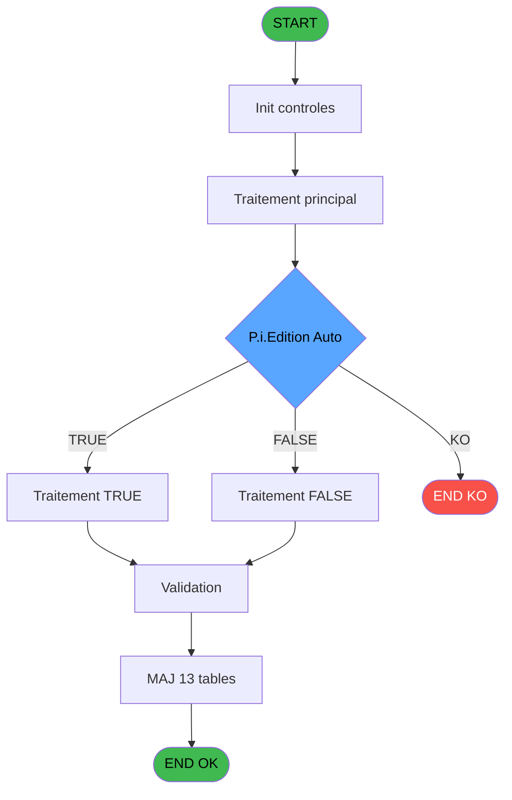
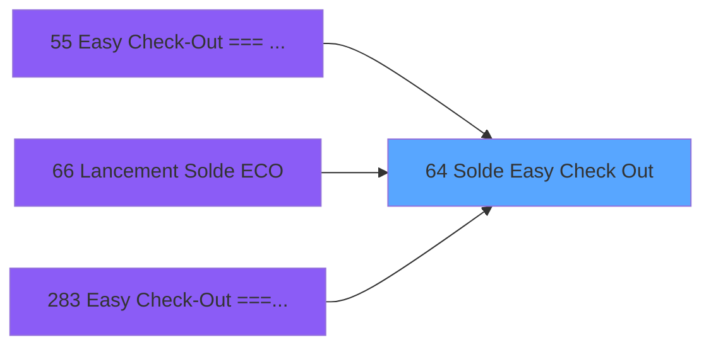
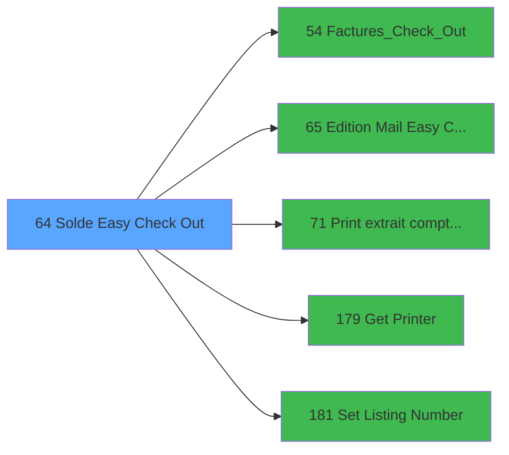

# ADH IDE 64 - Solde Easy Check Out

> **Analyse**: Phases 1-4 2026-02-07 03:43 -> 01:59 (22h16min) | Assemblage 01:59
> **Pipeline**: V7.2 Enrichi
> **Structure**: 4 onglets (Resume | Ecrans | Donnees | Connexions)

<!-- TAB:Resume -->

## 1. FICHE D'IDENTITE

| Attribut | Valeur |
|----------|--------|
| Projet | ADH |
| IDE Position | 64 |
| Nom Programme | Solde Easy Check Out |
| Fichier source | `Prg_64.xml` |
| Dossier IDE | Comptabilite |
| Taches | 26 (1 ecrans visibles) |
| Tables modifiees | 13 |
| Programmes appeles | 5 |
| Complexite | **BASSE** (score 38/100) |

## 2. DESCRIPTION FONCTIONNELLE

ADH IDE 64 - **Solde Easy Check Out** est le programme central de clôture des transactions Easy Check-Out. Il recalcule le solde de chaque compte Club Med après les opérations de paiement ou de crédits appliqués, en consolidant les mouvements depuis les tables de ventes (ccpartyp, resort_credit, etc.). Le programme met à jour les lignes de solde et génère les écritures comptables correspondantes pour la réconciliation des comptes.

Le flux de traitement enchaîne plusieurs sous-tâches critiques : d'abord le **Recalcul solde** qui agrège tous les débits/crédits par service et devise, puis **Solde GM** pour les adhérents Club Med Pass, suivi de la création des **Lignes de solde** (table sld) et des écritures **Creation comptable** pour la comptabilité analytique. Un mécanisme de récupération des compteurs (versements/retraits) alimenté par les lignes téléphone (lgn) permet de vérifier la cohérence avec les caissons.

Le programme s'intègre dans la chaîne Easy Check-Out en aval (appelé par IDE 55, 66, 283) et en amont avec les éditions/impressions (appelle IDE 54, 65, 71) et les utilitaires d'impression (IDE 179, 181). Les multiples tables modifiées (cte, cgm, sld, lgn, cpt, cot, aut, sda, etc.) montrent son impact transversal sur la gestion caisse et la comptabilité, d'où l'importance critique du bon fonctionnement des calculs de solde et de la génération des écritures.

## 3. BLOCS FONCTIONNELS

### 3.1 Traitement (15 taches)

Traitements internes.

---

#### 64 - Solde Easy Check Out [[ECRAN]](#ecran-t1)

**Role** : Tache d'orchestration : point d'entree du programme (15 sous-taches). Coordonne l'enchainement des traitements.
**Ecran** : 458 x 195 DLU | [Voir mockup](#ecran-t1)

14 sous-taches directes

| Tache | Nom | Bloc |
|-------|-----|------|
| [64.1.1](#t3) | Solde GM | Traitement |
| [64.2](#t4) | Lignes de solde **[[ECRAN]](#ecran-t4)** | Traitement |
| [64.6](#t10) | (sans nom) | Traitement |
| [64.6.1](#t11) | Mise opposition des CAM | Traitement |
| [64.6.1.3](#t14) | Liberation Ligne | Traitement |
| [64.6.1.4](#t15) | Liberation Poste | Traitement |
| [64.7](#t16) | Mise opposition des CAM | Traitement |
| [64.7.4](#t20) | Liberation Ligne | Traitement |
| [64.7.5](#t21) | Liberation Ligne | Traitement |
| [64.7.6](#t22) | Liberation Poste | Traitement |
| [64.8](#t23) | Désactiver Club Med Pass | Traitement |
| [64.9](#t24) | Log Facture | Traitement |
| [64.10](#t25) | Mail | Traitement |
| [64.11](#t26) | Création Ligne Log **[[ECRAN]](#ecran-t26)** | Traitement |

**Variables liees** : EV (v.Date_Solde), EW (v.Heure-Solde), EZ (v.Ligne_Solde), FJ (v.Solde du compte)

---

#### 64.1.1 - Solde GM

**Role** : Consultation/chargement : Solde GM.
**Variables liees** : EV (v.Date_Solde), EW (v.Heure-Solde), EZ (v.Ligne_Solde), FJ (v.Solde du compte)

---

#### 64.2 - Lignes de solde [[ECRAN]](#ecran-t4)

**Role** : Consultation/chargement : Lignes de solde.
**Ecran** : 640 x 110 DLU (MDI) | [Voir mockup](#ecran-t4)
**Variables liees** : EV (v.Date_Solde), EW (v.Heure-Solde), EZ (v.Ligne_Solde), FJ (v.Solde du compte)

---

#### 64.6 - (sans nom)

**Role** : Traitement interne.

---

#### 64.6.1 - Mise opposition des CAM

**Role** : Traitement : Mise opposition des CAM.

---

#### 64.6.1.3 - Liberation Ligne

**Role** : Traitement : Liberation Ligne.
**Variables liees** : EZ (v.Ligne_Solde)

---

#### 64.6.1.4 - Liberation Poste

**Role** : Traitement : Liberation Poste.

---

#### 64.7 - Mise opposition des CAM

**Role** : Traitement : Mise opposition des CAM.

---

#### 64.7.4 - Liberation Ligne

**Role** : Traitement : Liberation Ligne.
**Variables liees** : EZ (v.Ligne_Solde)

---

#### 64.7.5 - Liberation Ligne

**Role** : Traitement : Liberation Ligne.
**Variables liees** : EZ (v.Ligne_Solde)

---

#### 64.7.6 - Liberation Poste

**Role** : Traitement : Liberation Poste.

---

#### 64.8 - Désactiver Club Med Pass

**Role** : Traitement : Désactiver Club Med Pass.

---

#### 64.9 - Log Facture

**Role** : Traitement : Log Facture.

---

#### 64.10 - Mail

**Role** : Traitement : Mail.
**Variables liees** : FF (v.Evoi_mail), FK (v.MailAtachedFiles)

---

#### 64.11 - Création Ligne Log [[ECRAN]](#ecran-t26)

**Role** : Traitement : Création Ligne Log.
**Ecran** : 315 x 0 DLU | [Voir mockup](#ecran-t26)
**Variables liees** : EZ (v.Ligne_Solde)

### 3.2 Calcul (8 taches)

Calculs metier : montants, stocks, compteurs.

---

#### 64.1 - Recalcul solde

**Role** : Calcul : Recalcul solde.
**Variables liees** : EV (v.Date_Solde), EW (v.Heure-Solde), EZ (v.Ligne_Solde), FJ (v.Solde du compte)

---

#### 64.3 - Creation comptable [[ECRAN]](#ecran-t5)

**Role** : Creation d'enregistrement : Creation comptable.
**Ecran** : 426 x 98 DLU (MDI) | [Voir mockup](#ecran-t5)

---

#### 64.3.1 - Recup compteur verst/retrait

**Role** : Calcul : Recup compteur verst/retrait.

---

#### 64.4 - Creation comptable [[ECRAN]](#ecran-t7)

**Role** : Creation d'enregistrement : Creation comptable.
**Ecran** : 426 x 98 DLU (MDI) | [Voir mockup](#ecran-t7)

---

#### 64.4.1 - Recup compteur verst/retrait

**Role** : Calcul : Recup compteur verst/retrait.

---

#### 64.5 - MàJ compte et depôt garantie

**Role** : Traitement : MàJ compte et depôt garantie.
**Variables liees** : EQ (P.i.Num Compte Test), FB (v.MajCompte), FJ (v.Solde du compte)

---

#### 64.6.1.2 - Decrementation Compteur Tel

**Role** : Calcul : Decrementation Compteur Tel.

---

#### 64.7.3 - Decrementation Compteur Tel

**Role** : Calcul : Decrementation Compteur Tel.

### 3.3 Creation (3 taches)

Insertion de nouveaux enregistrements en base.

---

#### 64.6.1.1 - Creation commande

**Role** : Creation d'enregistrement : Creation commande.

---

#### 64.7.1 - Creation commande

**Role** : Creation d'enregistrement : Creation commande.

---

#### 64.7.2 - Creation commande

**Role** : Creation d'enregistrement : Creation commande.

## 5. REGLES METIER

9 regles identifiees:

### Autres (9 regles)

#### [RM-001] Condition: Trim(v.NomFact_PDF_OD [K])&Trim(v.NomFact_PDF_Autres [L]) different de

| Element | Detail |
|---------|--------|
| **Condition** | `Trim(v.NomFact_PDF_OD [K])&Trim(v.NomFact_PDF_Autres [L])<>''` |
| **Si vrai** | Action si vrai |
| **Variables** | EX (v.NomFact_PDF_OD), EY (v.NomFact_PDF_Autres) |
| **Expression source** | Expression 5 : `Trim(v.NomFact_PDF_OD [K])&Trim(v.NomFact_PDF_Autres [L])<>'` |
| **Exemple** | Si Trim(v.NomFact_PDF_OD [K])&Trim(v.NomFact_PDF_Autres [L])<>'' → Action si vrai |

#### [RM-002] Condition composite: (VG43 OR VG94) AND NOT(P.i.Test PES [E])

| Element | Detail |
|---------|--------|
| **Condition** | `(VG43 OR VG94) AND NOT(P.i.Test PES [E])` |
| **Si vrai** | Action si vrai |
| **Variables** | ER (P.i.Test PES) |
| **Expression source** | Expression 8 : `(VG43 OR VG94) AND NOT(P.i.Test PES [E])` |
| **Exemple** | Si (VG43 OR VG94) AND NOT(P.i.Test PES [E]) → Action si vrai |

#### [RM-003] Condition: (VG43 OR VG94) AND [CD] inferieur a 0

| Element | Detail |
|---------|--------|
| **Condition** | `(VG43 OR VG94) AND [CD]<0` |
| **Si vrai** | Action si vrai |
| **Expression source** | Expression 10 : `(VG43 OR VG94) AND [CD]<0` |
| **Exemple** | Si (VG43 OR VG94) AND [CD]<0 → Action si vrai |

#### [RM-004] Condition composite: VG94 AND NOT(VG23)

| Element | Detail |
|---------|--------|
| **Condition** | `VG94 AND NOT(VG23)` |
| **Si vrai** | Action si vrai |
| **Expression source** | Expression 12 : `VG94 AND NOT(VG23)` |
| **Exemple** | Si VG94 AND NOT(VG23) → Action si vrai |

#### [RM-005] Traitement si Trim(v.NomFact_PDF_Autres [L]) est renseigne

| Element | Detail |
|---------|--------|
| **Condition** | `Trim(v.NomFact_PDF_Autres [L])<>''` |
| **Si vrai** | 'A'&Trim(v.NomFact_PDF_Autres [L]) |
| **Si faux** | v.NomFact_PDF_OD [K]) |
| **Variables** | EX (v.NomFact_PDF_OD), EY (v.NomFact_PDF_Autres) |
| **Expression source** | Expression 14 : `IF(Trim(v.NomFact_PDF_Autres [L])<>'','A'&Trim(v.NomFact_PDF` |
| **Exemple** | Si Trim(v.NomFact_PDF_Autres [L])<>'' → 'A'&Trim(v.NomFact_PDF_Autres [L]). Sinon → v.NomFact_PDF_OD [K]) |

#### [RM-006] Condition: Trim([BJ])<>'' AND Trim([CE]) different de

| Element | Detail |
|---------|--------|
| **Condition** | `Trim([BJ])<>'' AND Trim([CE])<>''` |
| **Si vrai** | Action si vrai |
| **Expression source** | Expression 17 : `Trim([BJ])<>'' AND Trim([CE])<>''` |
| **Exemple** | Si Trim([BJ])<>'' AND Trim([CE])<>'' → Action si vrai |

#### [RM-007] Condition composite: VG76 AND NOT P.i.Edition Auto [C]

| Element | Detail |
|---------|--------|
| **Condition** | `VG76 AND NOT P.i.Edition Auto [C]` |
| **Si vrai** | Action si vrai |
| **Variables** | EP (P.i.Edition Auto) |
| **Expression source** | Expression 23 : `VG76 AND NOT P.i.Edition Auto [C]` |
| **Exemple** | Si VG76 AND NOT P.i.Edition Auto [C] → Action si vrai |

#### [RM-008] Condition toujours vraie (flag actif)

| Element | Detail |
|---------|--------|
| **Condition** | `P.i.Edition Auto [C]` |
| **Si vrai** | 'TRUE'LOG |
| **Si faux** | 'FALSE'LOG) |
| **Variables** | EP (P.i.Edition Auto) |
| **Expression source** | Expression 24 : `IF(P.i.Edition Auto [C],'TRUE'LOG,'FALSE'LOG)` |
| **Exemple** | Si P.i.Edition Auto [C] → 'TRUE'LOG. Sinon → 'FALSE'LOG) |

#### [RM-009] Negation de VG78 (condition inversee)

| Element | Detail |
|---------|--------|
| **Condition** | `NOT VG78` |
| **Si vrai** | Action si vrai |
| **Expression source** | Expression 32 : `NOT VG78` |
| **Exemple** | Si NOT VG78 → Action si vrai |

## 6. CONTEXTE

- **Appele par**: [Easy Check-Out === V2.00 (IDE 55)](ADH-IDE-55.md), [Lancement Solde ECO (IDE 66)](ADH-IDE-66.md), [Easy Check-Out === V2.00 (IDE 283)](ADH-IDE-283.md)
- **Appelle**: 5 programmes | **Tables**: 22 (W:13 R:3 L:11) | **Taches**: 26 | **Expressions**: 43

<!-- TAB:Ecrans -->

## 8. ECRANS

### 8.1 Forms visibles (1 / 26)

| # | Position | Tache | Nom | Type | Largeur | Hauteur | Bloc |
|---|----------|-------|-----|------|---------|---------|------|
| 1 | 64 | 64 | Solde Easy Check Out | Type0 | 458 | 195 | Traitement |

### 8.2 Mockups Ecrans

---

#### 64 - Solde Easy Check Out
**Tache** : [64](#t1) | **Type** : Type0 | **Dimensions** : 458 x 195 DLU
**Bloc** : Traitement | **Titre IDE** : Solde Easy Check Out

<!-- FORM-DATA:
{
    "width":  458,
    "vFactor":  8,
    "type":  "Type0",
    "hFactor":  4,
    "controls":  [
                     {
                         "x":  8,
                         "type":  "table",
                         "var":  "",
                         "name":  "",
                         "titleH":  12,
                         "color":  "6",
                         "w":  444,
                         "y":  8,
                         "fmt":  "",
                         "parent":  null,
                         "text":  "",
                         "rowH":  13,
                         "h":  184,
                         "cols":  [
                                      {
                                          "title":  "Date fin de séjour",
                                          "layer":  1,
                                          "w":  87
                                      },
                                      {
                                          "title":  "Code Adhérent",
                                          "layer":  2,
                                          "w":  82
                                      },
                                      {
                                          "title":  "Nom",
                                          "layer":  3,
                                          "w":  156
                                      },
                                      {
                                          "title":  "Solde du comte",
                                          "layer":  4,
                                          "w":  101
                                      }
                                  ],
                         "rows":  4
                     },
                     {
                         "x":  20,
                         "type":  "edit",
                         "var":  "",
                         "y":  23,
                         "w":  61,
                         "fmt":  "",
                         "name":  "cgm_date_lastoperat_",
                         "h":  10,
                         "color":  "6",
                         "text":  "",
                         "parent":  1
                     },
                     {
                         "x":  100,
                         "type":  "edit",
                         "var":  "",
                         "y":  23,
                         "w":  56,
                         "fmt":  "",
                         "name":  "cgm_code_adherent",
                         "h":  10,
                         "color":  "6",
                         "text":  "",
                         "parent":  1
                     },
                     {
                         "x":  184,
                         "type":  "edit",
                         "var":  "",
                         "y":  23,
                         "w":  144,
                         "fmt":  "",
                         "name":  "cgm_nom_prenom",
                         "h":  10,
                         "color":  "6",
                         "text":  "",
                         "parent":  1
                     },
                     {
                         "x":  337,
                         "type":  "edit",
                         "var":  "",
                         "y":  23,
                         "w":  94,
                         "fmt":  "",
                         "name":  "cgm_solde_du_compte",
                         "h":  10,
                         "color":  "6",
                         "text":  "",
                         "parent":  1
                     }
                 ],
    "taskId":  "64",
    "height":  195
}
-->

<strong>Champs : 4 champs</strong>

| Pos (x,y) | Nom | Variable | Type |
|-----------|-----|----------|------|
| 20,23 | cgm_date_lastoperat_ | - | edit |
| 100,23 | cgm_code_adherent | - | edit |
| 184,23 | cgm_nom_prenom | - | edit |
| 337,23 | cgm_solde_du_compte | - | edit |

## 9. NAVIGATION

Ecran unique: **Solde Easy Check Out**

### 9.3 Structure hierarchique (26 taches)

| Position | Tache | Type | Dimensions | Bloc |
|----------|-------|------|------------|------|
| **64.1** | [**Solde Easy Check Out** (64)](#t1) [mockup](#ecran-t1) | - | 458x195 | Traitement |
| 64.1.1 | [Solde GM (64.1.1)](#t3) | SDI | - | |
| 64.1.2 | [Lignes de solde (64.2)](#t4) [mockup](#ecran-t4) | MDI | 640x110 | |
| 64.1.3 | [(sans nom) (64.6)](#t10) | MDI | - | |
| 64.1.4 | [Mise opposition des CAM (64.6.1)](#t11) | MDI | - | |
| 64.1.5 | [Liberation Ligne (64.6.1.3)](#t14) | MDI | - | |
| 64.1.6 | [Liberation Poste (64.6.1.4)](#t15) | MDI | - | |
| 64.1.7 | [Mise opposition des CAM (64.7)](#t16) | MDI | - | |
| 64.1.8 | [Liberation Ligne (64.7.4)](#t20) | MDI | - | |
| 64.1.9 | [Liberation Ligne (64.7.5)](#t21) | MDI | - | |
| 64.1.10 | [Liberation Poste (64.7.6)](#t22) | MDI | - | |
| 64.1.11 | [Désactiver Club Med Pass (64.8)](#t23) | MDI | - | |
| 64.1.12 | [Log Facture (64.9)](#t24) | - | - | |
| 64.1.13 | [Mail (64.10)](#t25) | - | - | |
| 64.1.14 | [Création Ligne Log (64.11)](#t26) [mockup](#ecran-t26) | - | 315x0 | |
| **64.2** | [**Recalcul solde** (64.1)](#t2) | SDI | - | Calcul |
| 64.2.1 | [Creation comptable (64.3)](#t5) [mockup](#ecran-t5) | MDI | 426x98 | |
| 64.2.2 | [Recup compteur verst/retrait (64.3.1)](#t6) | MDI | - | |
| 64.2.3 | [Creation comptable (64.4)](#t7) [mockup](#ecran-t7) | MDI | 426x98 | |
| 64.2.4 | [Recup compteur verst/retrait (64.4.1)](#t8) | MDI | - | |
| 64.2.5 | [MàJ compte et depôt garantie (64.5)](#t9) | MDI | - | |
| 64.2.6 | [Decrementation Compteur Tel (64.6.1.2)](#t13) | MDI | - | |
| 64.2.7 | [Decrementation Compteur Tel (64.7.3)](#t19) | MDI | - | |
| **64.3** | [**Creation commande** (64.6.1.1)](#t12) | MDI | - | Creation |
| 64.3.1 | [Creation commande (64.7.1)](#t17) | MDI | - | |
| 64.3.2 | [Creation commande (64.7.2)](#t18) | MDI | - | |

### 9.4 Algorigramme

> **Legende**: Vert = START/END OK | Rouge = END KO | Bleu = Decisions
> *Algorigramme auto-genere. Utiliser `/algorigramme` pour une synthese metier detaillee.*

<!-- TAB:Donnees -->

## 10. TABLES

### Tables utilisees (22)

| ID | Nom | Description | Type | R | W | L | Usages |
|----|-----|-------------|------|---|---|---|--------|
| 40 | comptable________cte |  | DB | R | **W** |   | 3 |
| 87 | sda_telephone____sda |  | DB |   | **W** | L | 4 |
| 80 | codes_autocom____aut |  | DB |   | **W** | L | 2 |
| 68 | compteurs________cpt | Comptes GM (generaux) | DB |   | **W** |   | 4 |
| 47 | compte_gm________cgm | Comptes GM (generaux) | DB |   | **W** |   | 2 |
| 151 | nb_code__poste |  | DB |   | **W** |   | 2 |
| 136 | fichier_echanges |  | DB |   | **W** |   | 2 |
| 75 | commande_autocom_cot |  | DB |   | **W** |   | 1 |
| 48 | lignes_de_solde__sld |  | DB |   | **W** |   | 1 |
| 53 | ligne_telephone__lgn |  | DB |   | **W** |   | 1 |
| 312 | ez_card |  | DB |   | **W** |   | 1 |
| 934 | selection enregistrement diver |  | DB |   | **W** |   | 1 |
| 911 | log_booker |  | DB |   | **W** |   | 1 |
| 30 | gm-recherche_____gmr | Index de recherche | DB | R |   | L | 2 |
| 78 | param__telephone_tel |  | DB | R |   | L | 2 |
| 66 | imputations______imp |  | DB |   |   | L | 2 |
| 39 | depot_garantie___dga | Depots et garanties | DB |   |   | L | 2 |
| 31 | gm-complet_______gmc |  | DB |   |   | L | 1 |
| 70 | date_comptable___dat |  | DB |   |   | L | 1 |
| 91 | garantie_________gar | Depots et garanties | DB |   |   | L | 1 |
| 69 | initialisation___ini |  | DB |   |   | L | 1 |
| 285 | email |  | DB |   |   | L | 1 |

### Colonnes par table (10 / 15 tables avec colonnes identifiees)

Table 40 - comptable________cte (R/**W**) - 3 usages

| Lettre | Variable | Acces | Type |
|--------|----------|-------|------|
| EN | v.ChronoComptable | W | Numeric |

Table 87 - sda_telephone____sda (**W**/L) - 4 usages

*Table utilisee uniquement en Link ou aucune colonne Real identifiee dans le DataView.*

Table 80 - codes_autocom____aut (**W**/L) - 2 usages

| Lettre | Variable | Acces | Type |
|--------|----------|-------|------|
| A | v.Nbre | W | Numeric |
| B | W1 Nom (20) | W | Alpha |
| C | W1 ret.lien SDA | W | Numeric |

Table 68 - compteurs________cpt (**W**) - 4 usages

*Table utilisee uniquement en Link ou aucune colonne Real identifiee dans le DataView.*

Table 47 - compte_gm________cgm (**W**) - 2 usages

| Lettre | Variable | Acces | Type |
|--------|----------|-------|------|
| EQ | P.i.Num Compte Test | W | Numeric |
| FB | v.MajCompte | W | Logical |
| FJ | v.Solde du compte | W | Numeric |

Table 151 - nb_code__poste (**W**) - 2 usages

*Table utilisee uniquement en Link ou aucune colonne Real identifiee dans le DataView.*

Table 136 - fichier_echanges (**W**) - 2 usages

| Lettre | Variable | Acces | Type |
|--------|----------|-------|------|
| EN | W1 nom fichier ascii | W | Alpha |
| FL | v.NomFichierPDF | W | Alpha |

Table 75 - commande_autocom_cot (**W**) - 1 usages

*Table utilisee uniquement en Link ou aucune colonne Real identifiee dans le DataView.*

Table 48 - lignes_de_solde__sld (**W**) - 1 usages

| Lettre | Variable | Acces | Type |
|--------|----------|-------|------|
| EN | V Solde GM | W | Numeric |
| EV | v.Date_Solde | W | Date |
| EW | v.Heure-Solde | W | Time |
| EZ | v.Ligne_Solde | W | Logical |
| FJ | v.Solde du compte | W | Numeric |

Table 53 - ligne_telephone__lgn (**W**) - 1 usages

| Lettre | Variable | Acces | Type |
|--------|----------|-------|------|
| EZ | v.Ligne_Solde | W | Logical |

Table 312 - ez_card (**W**) - 1 usages

| Lettre | Variable | Acces | Type |
|--------|----------|-------|------|
| FD | v.NbCard | W | Numeric |

Table 934 - selection enregistrement diver (**W**) - 1 usages

*Table utilisee uniquement en Link ou aucune colonne Real identifiee dans le DataView.*

Table 911 - log_booker (**W**) - 1 usages

*Table utilisee uniquement en Link ou aucune colonne Real identifiee dans le DataView.*

Table 30 - gm-recherche_____gmr (R/L) - 2 usages

| Lettre | Variable | Acces | Type |
|--------|----------|-------|------|
| A | P.i.Date Fin Sejour | R | Date |
| B | P.i.Clause Where | R | Alpha |
| C | P.i.Edition Auto | R | Logical |
| D | P.i.Num Compte Test | R | Numeric |
| E | P.i.Test PES | R | Logical |
| F | v.Transaction Validée | R | Logical |
| G | v.Message Erreur | R | Alpha |
| H | v.Id_Dossier_Pms | R | Alpha |
| I | v.Date_Solde | R | Date |
| J | v.Heure-Solde | R | Time |
| K | v.NomFact_PDF_OD | R | Alpha |
| L | v.NomFact_PDF_Autres | R | Alpha |
| M | v.Ligne_Solde | R | Logical |
| N | v.MajExtrait | R | Logical |
| O | v.MajCompte | R | Logical |
| P | v.MajTel | R | Numeric |
| Q | v.NbCard | R | Numeric |
| R | v.Fact | R | Logical |
| S | v.Evoi_mail | R | Logical |
| T | v.Num dossier Axis | R | Alpha |
| U | v.Num Autorisation | R | Alpha |
| V | v.MOP | R | Alpha |
| W | v.Solde du compte | R | Numeric |
| X | v.MailAtachedFiles | R | Alpha |
| Y | v.NomFichierPDF | R | Alpha |
| Z | v.Access Token | R | Unicode |
| BA | v.Token Expiration Time | R | Time |

Table 78 - param__telephone_tel (R/L) - 2 usages

| Lettre | Variable | Acces | Type |
|--------|----------|-------|------|
| A | W1 triplet | R | Alpha |
| B | W1 ret.lien SDA | R | Numeric |

## 11. VARIABLES

### 11.1 Parametres entrants (5)

Variables recues du programme appelant ([Easy Check-Out === V2.00 (IDE 55)](ADH-IDE-55.md)).

| Lettre | Nom | Type | Usage dans |
|--------|-----|------|-----------|
| EN | P.i.Date Fin Sejour | Date | 1x parametre entrant |
| EO | P.i.Clause Where | Alpha | - |
| EP | P.i.Edition Auto | Logical | 7x parametre entrant |
| EQ | P.i.Num Compte Test | Numeric | [64.3.1](#t6), [64.4.1](#t8), [64.5](#t9) |
| ER | P.i.Test PES | Logical | 3x parametre entrant |

### 11.2 Variables de session (22)

Variables persistantes pendant toute la session.

| Lettre | Nom | Type | Usage dans |
|--------|-----|------|-----------|
| ES | v.Transaction Validée | Logical | 1x session |
| ET | v.Message Erreur | Alpha | 1x session |
| EU | v.Id_Dossier_Pms | Alpha | 1x session |
| EV | v.Date_Solde | Date | - |
| EW | v.Heure-Solde | Time | 1x session |
| EX | v.NomFact_PDF_OD | Alpha | 2x session |
| EY | v.NomFact_PDF_Autres | Alpha | 2x session |
| EZ | v.Ligne_Solde | Logical | - |
| FA | v.MajExtrait | Logical | - |
| FB | v.MajCompte | Logical | - |
| FC | v.MajTel | Numeric | - |
| FD | v.NbCard | Numeric | - |
| FE | v.Fact | Logical | - |
| FF | v.Evoi_mail | Logical | - |
| FG | v.Num dossier Axis | Alpha | - |
| FH | v.Num Autorisation | Alpha | - |
| FI | v.MOP | Alpha | - |
| FJ | v.Solde du compte | Numeric | - |
| FK | v.MailAtachedFiles | Alpha | - |
| FL | v.NomFichierPDF | Alpha | - |
| FM | v.Access Token | Unicode | - |
| FN | v.Token Expiration Time | Time | - |

Toutes les 27 variables (liste complete)

| Cat | Lettre | Nom Variable | Type |
|-----|--------|--------------|------|
| P0 | **EN** | P.i.Date Fin Sejour | Date |
| P0 | **EO** | P.i.Clause Where | Alpha |
| P0 | **EP** | P.i.Edition Auto | Logical |
| P0 | **EQ** | P.i.Num Compte Test | Numeric |
| P0 | **ER** | P.i.Test PES | Logical |
| V. | **ES** | v.Transaction Validée | Logical |
| V. | **ET** | v.Message Erreur | Alpha |
| V. | **EU** | v.Id_Dossier_Pms | Alpha |
| V. | **EV** | v.Date_Solde | Date |
| V. | **EW** | v.Heure-Solde | Time |
| V. | **EX** | v.NomFact_PDF_OD | Alpha |
| V. | **EY** | v.NomFact_PDF_Autres | Alpha |
| V. | **EZ** | v.Ligne_Solde | Logical |
| V. | **FA** | v.MajExtrait | Logical |
| V. | **FB** | v.MajCompte | Logical |
| V. | **FC** | v.MajTel | Numeric |
| V. | **FD** | v.NbCard | Numeric |
| V. | **FE** | v.Fact | Logical |
| V. | **FF** | v.Evoi_mail | Logical |
| V. | **FG** | v.Num dossier Axis | Alpha |
| V. | **FH** | v.Num Autorisation | Alpha |
| V. | **FI** | v.MOP | Alpha |
| V. | **FJ** | v.Solde du compte | Numeric |
| V. | **FK** | v.MailAtachedFiles | Alpha |
| V. | **FL** | v.NomFichierPDF | Alpha |
| V. | **FM** | v.Access Token | Unicode |
| V. | **FN** | v.Token Expiration Time | Time |

## 12. EXPRESSIONS

**43 / 43 expressions decodees (100%)**

### 12.1 Repartition par type

| Type | Expressions | Regles |
|------|-------------|--------|
| CALCULATION | 2 | 0 |
| CONCATENATION | 1 | 5 |
| CONDITION | 11 | 6 |
| CAST_LOGIQUE | 6 | 5 |
| NEGATION | 1 | 5 |
| CONSTANTE | 7 | 0 |
| DATE | 1 | 0 |
| FORMAT | 1 | 0 |
| OTHER | 10 | 0 |
| REFERENCE_VG | 3 | 0 |

### 12.2 Expressions cles par type

#### CALCULATION (2 expressions)

| Type | IDE | Expression | Regle |
|------|-----|------------|-------|
| CALCULATION | 42 | `[CD]*-1` | - |
| CALCULATION | 6 | `'00/00/0000'DATE` | - |

#### CONCATENATION (1 expressions)

| Type | IDE | Expression | Regle |
|------|-----|------------|-------|
| CONCATENATION | 5 | `Trim(v.NomFact_PDF_OD [K])&Trim(v.NomFact_PDF_Autres [L])<>''` | [RM-001](#rm-RM-001) |

#### CONDITION (11 expressions)

| Type | IDE | Expression | Regle |
|------|-----|------------|-------|
| CONDITION | 14 | `IF(Trim(v.NomFact_PDF_Autres [L])<>'','A'&Trim(v.NomFact_PDF_Autres [L]),v.NomFact_PDF_OD [K])` | [RM-005](#rm-RM-005) |
| CONDITION | 17 | `Trim([BJ])<>'' AND Trim([CE])<>''` | [RM-006](#rm-RM-006) |
| CONDITION | 23 | `VG76 AND NOT P.i.Edition Auto [C]` | [RM-007](#rm-RM-007) |
| CONDITION | 8 | `(VG43 OR VG94) AND NOT(P.i.Test PES [E])` | [RM-002](#rm-RM-002) |
| CONDITION | 10 | `(VG43 OR VG94) AND [CD]<0` | [RM-003](#rm-RM-003) |
| ... | | *+6 autres* | |

#### CAST_LOGIQUE (6 expressions)

| Type | IDE | Expression | Regle |
|------|-----|------------|-------|
| CAST_LOGIQUE | 24 | `IF(P.i.Edition Auto [C],'TRUE'LOG,'FALSE'LOG)` | [RM-008](#rm-RM-008) |
| CAST_LOGIQUE | 28 | `'TRUE'LOG` | - |
| CAST_LOGIQUE | 43 | `'FALSE'LOG` | - |
| CAST_LOGIQUE | 22 | `INIPut('CompressPDF=N','FALSE'LOG)` | - |
| CAST_LOGIQUE | 18 | `'TRUE'LOG` | - |
| ... | | *+1 autres* | |

#### NEGATION (1 expressions)

| Type | IDE | Expression | Regle |
|------|-----|------------|-------|
| NEGATION | 32 | `NOT VG78` | [RM-009](#rm-RM-009) |

#### CONSTANTE (7 expressions)

| Type | IDE | Expression | Regle |
|------|-----|------------|-------|
| CONSTANTE | 37 | `'P'` | - |
| CONSTANTE | 40 | `1` | - |
| CONSTANTE | 41 | `'PAY'` | - |
| CONSTANTE | 35 | `10` | - |
| CONSTANTE | 13 | `'S'` | - |
| ... | | *+2 autres* | |

#### DATE (1 expressions)

| Type | IDE | Expression | Regle |
|------|-----|------------|-------|
| DATE | 15 | `Date()` | - |

#### FORMAT (1 expressions)

| Type | IDE | Expression | Regle |
|------|-----|------------|-------|
| FORMAT | 26 | `'EXTCOMPTE_'&DStr(Date(),'YYYYMMDD')&'_'&TStr(Time(),'HHMM')&'.pdf'` | - |

#### OTHER (10 expressions)

| Type | IDE | Expression | Regle |
|------|-----|------------|-------|
| OTHER | 16 | `Time()` | - |
| OTHER | 9 | `P.i.Test PES [E]` | - |
| OTHER | 20 | `P.i.Edition Auto [C]` | - |
| OTHER | 39 | `P.i.Test PES [E]` | - |
| OTHER | 38 | `v.Heure-Solde [J]` | - |
| ... | | *+5 autres* | |

#### REFERENCE_VG (3 expressions)

| Type | IDE | Expression | Regle |
|------|-----|------------|-------|
| REFERENCE_VG | 36 | `VG3` | - |
| REFERENCE_VG | 33 | `VG78` | - |
| REFERENCE_VG | 11 | `VG23` | - |

### 12.3 Toutes les expressions (43)

Voir les 43 expressions

#### CALCULATION (2)

| IDE | Expression Decodee |
|-----|-------------------|
| 6 | `'00/00/0000'DATE` |
| 42 | `[CD]*-1` |

#### CONCATENATION (1)

| IDE | Expression Decodee |
|-----|-------------------|
| 5 | `Trim(v.NomFact_PDF_OD [K])&Trim(v.NomFact_PDF_Autres [L])<>''` |

#### CONDITION (11)

| IDE | Expression Decodee |
|-----|-------------------|
| 8 | `(VG43 OR VG94) AND NOT(P.i.Test PES [E])` |
| 10 | `(VG43 OR VG94) AND [CD]<0` |
| 12 | `VG94 AND NOT(VG23)` |
| 14 | `IF(Trim(v.NomFact_PDF_Autres [L])<>'','A'&Trim(v.NomFact_PDF_Autres [L]),v.NomFact_PDF_OD [K])` |
| 17 | `Trim([BJ])<>'' AND Trim([CE])<>''` |
| 23 | `VG76 AND NOT P.i.Edition Auto [C]` |
| 25 | `IF(P.i.Edition Auto [C],Translate('%club_exportdata%')&'Easy_Check_Out\','')` |
| 27 | `IF(P.i.Edition Auto [C],'E','P')` |
| 29 | `IF(P.i.Edition Auto [C],Trim([CF]),'')` |
| 30 | `IF(P.i.Edition Auto [C],'EditionPDF','')` |
| 34 | `CndRange(P.i.Num Compte Test [D]<>0,P.i.Num Compte Test [D])` |

#### CAST_LOGIQUE (6)

| IDE | Expression Decodee |
|-----|-------------------|
| 24 | `IF(P.i.Edition Auto [C],'TRUE'LOG,'FALSE'LOG)` |
| 18 | `'TRUE'LOG` |
| 21 | `INIPut('EmbedFonts=N','FALSE'LOG)` |
| 22 | `INIPut('CompressPDF=N','FALSE'LOG)` |
| 28 | `'TRUE'LOG` |
| 43 | `'FALSE'LOG` |

#### NEGATION (1)

| IDE | Expression Decodee |
|-----|-------------------|
| 32 | `NOT VG78` |

#### CONSTANTE (7)

| IDE | Expression Decodee |
|-----|-------------------|
| 13 | `'S'` |
| 19 | `'I'` |
| 31 | `''` |
| 35 | `10` |
| 37 | `'P'` |
| 40 | `1` |
| 41 | `'PAY'` |

#### DATE (1)

| IDE | Expression Decodee |
|-----|-------------------|
| 15 | `Date()` |

#### FORMAT (1)

| IDE | Expression Decodee |
|-----|-------------------|
| 26 | `'EXTCOMPTE_'&DStr(Date(),'YYYYMMDD')&'_'&TStr(Time(),'HHMM')&'.pdf'` |

#### OTHER (10)

| IDE | Expression Decodee |
|-----|-------------------|
| 1 | `v.Transaction Validée [F]` |
| 2 | `v.Message Erreur [G]` |
| 3 | `v.Id_Dossier_Pms [H]` |
| 4 | `[BN]` |
| 7 | `P.i.Date Fin Sejour [A]` |
| 9 | `P.i.Test PES [E]` |
| 16 | `Time()` |
| 20 | `P.i.Edition Auto [C]` |
| 38 | `v.Heure-Solde [J]` |
| 39 | `P.i.Test PES [E]` |

#### REFERENCE_VG (3)

| IDE | Expression Decodee |
|-----|-------------------|
| 11 | `VG23` |
| 33 | `VG78` |
| 36 | `VG3` |

<!-- TAB:Connexions -->

## 13. GRAPHE D'APPELS

### 13.1 Chaine depuis Main (Callers)

Main -> ... -> [Easy Check-Out === V2.00 (IDE 55)](ADH-IDE-55.md) -> **Solde Easy Check Out (IDE 64)**

Main -> ... -> [Lancement Solde ECO (IDE 66)](ADH-IDE-66.md) -> **Solde Easy Check Out (IDE 64)**

Main -> ... -> [Easy Check-Out === V2.00 (IDE 283)](ADH-IDE-283.md) -> **Solde Easy Check Out (IDE 64)**

### 13.2 Callers

| IDE | Nom Programme | Nb Appels |
|-----|---------------|-----------|
| [55](ADH-IDE-55.md) | Easy Check-Out === V2.00 | 1 |
| [66](ADH-IDE-66.md) | Lancement Solde ECO | 1 |
| [283](ADH-IDE-283.md) | Easy Check-Out === V2.00 | 1 |

### 13.3 Callees (programmes appeles)

### 13.4 Detail Callees avec contexte

| IDE | Nom Programme | Appels | Contexte |
|-----|---------------|--------|----------|
| [54](ADH-IDE-54.md) | Factures_Check_Out | 1 | Sous-programme |
| [65](ADH-IDE-65.md) | Edition & Mail Easy Check Out | 1 | Impression ticket/document |
| [71](ADH-IDE-71.md) | Print extrait compte /Date | 1 | Impression ticket/document |
| [179](ADH-IDE-179.md) | Get Printer | 1 | Impression ticket/document |
| [181](ADH-IDE-181.md) | Set Listing Number | 1 | Configuration impression |

## 14. RECOMMANDATIONS MIGRATION

### 14.1 Profil du programme

| Metrique | Valeur | Impact migration |
|----------|--------|-----------------|
| Lignes de logique | 626 | Programme volumineux |
| Expressions | 43 | Peu de logique |
| Tables WRITE | 13 | Fort impact donnees |
| Sous-programmes | 5 | Peu de dependances |
| Ecrans visibles | 1 | Ecran unique ou traitement batch |
| Code desactive | 0.2% (1 / 626) | Code sain |
| Regles metier | 9 | Quelques regles a preserver |

### 14.2 Plan de migration par bloc

#### Traitement (15 taches: 3 ecrans, 12 traitements)

- **Strategie** : Orchestrateur avec 3 ecrans (Razor/React) et 12 traitements backend (services).
- Les ecrans deviennent des composants UI, les traitements invisibles deviennent des services injectables.
- 5 sous-programme(s) a migrer ou a reutiliser depuis les services existants.
- Decomposer les taches en services unitaires testables.

#### Calcul (8 taches: 2 ecrans, 6 traitements)

- **Strategie** : Services de calcul purs (Domain Services).
- Migrer la logique de calcul (stock, compteurs, montants)

#### Creation (3 taches: 0 ecran, 3 traitements)

- **Strategie** : Repository pattern avec Entity Framework Core.
- Insertion via `IRepository<T>.CreateAsync()`

### 14.3 Dependances critiques

| Dependance | Type | Appels | Impact |
|------------|------|--------|--------|
| comptable________cte | Table WRITE (Database) | 2x | Schema + repository |
| compte_gm________cgm | Table WRITE (Database) | 2x | Schema + repository |
| lignes_de_solde__sld | Table WRITE (Database) | 1x | Schema + repository |
| ligne_telephone__lgn | Table WRITE (Database) | 1x | Schema + repository |
| compteurs________cpt | Table WRITE (Database) | 4x | Schema + repository |
| commande_autocom_cot | Table WRITE (Database) | 1x | Schema + repository |
| codes_autocom____aut | Table WRITE (Database) | 1x | Schema + repository |
| sda_telephone____sda | Table WRITE (Database) | 2x | Schema + repository |
| fichier_echanges | Table WRITE (Database) | 2x | Schema + repository |
| nb_code__poste | Table WRITE (Database) | 2x | Schema + repository |
| ez_card | Table WRITE (Database) | 1x | Schema + repository |
| log_booker | Table WRITE (Database) | 1x | Schema + repository |
| selection enregistrement diver | Table WRITE (Database) | 1x | Schema + repository |
| [Get Printer (IDE 179)](ADH-IDE-179.md) | Sous-programme | 1x | Normale - Impression ticket/document |
| [Set Listing Number (IDE 181)](ADH-IDE-181.md) | Sous-programme | 1x | Normale - Configuration impression |
| [Print extrait compte /Date (IDE 71)](ADH-IDE-71.md) | Sous-programme | 1x | Normale - Impression ticket/document |
| [Factures_Check_Out (IDE 54)](ADH-IDE-54.md) | Sous-programme | 1x | Normale - Sous-programme |
| [Edition & Mail Easy Check Out (IDE 65)](ADH-IDE-65.md) | Sous-programme | 1x | Normale - Impression ticket/document |

---
*Spec DETAILED generee par Pipeline V7.2 - 2026-02-08 02:00*
