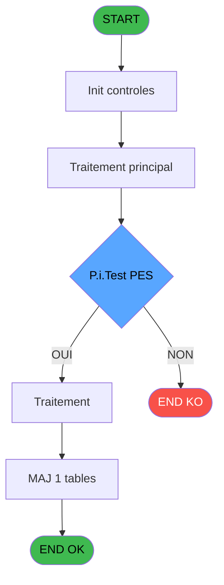
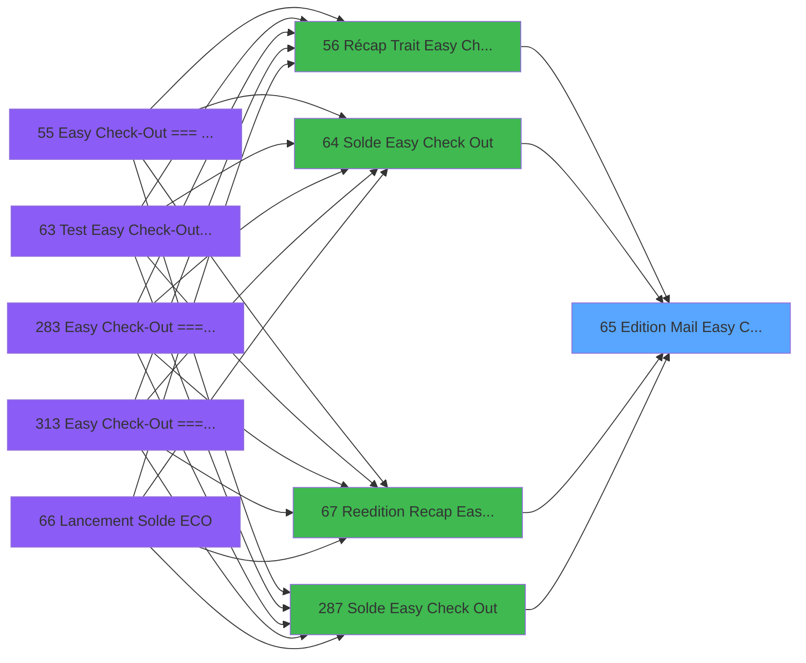

# ADH IDE 65 - Edition & Mail Easy Check Out

> **Analyse**: Phases 1-4 2026-02-07 03:43 -> 02:00 (22h16min) | Assemblage 02:00
> **Pipeline**: V7.2 Enrichi
> **Structure**: 4 onglets (Resume | Ecrans | Donnees | Connexions)

<!-- TAB:Resume -->

## 1. FICHE D'IDENTITE

| Attribut | Valeur |
|----------|--------|
| Projet | ADH |
| IDE Position | 65 |
| Nom Programme | Edition & Mail Easy Check Out |
| Fichier source | `Prg_65.xml` |
| Dossier IDE | Impression |
| Taches | 4 (0 ecrans visibles) |
| Tables modifiees | 1 |
| Programmes appeles | 0 |
| Complexite | **BASSE** (score 7/100) |

## 2. DESCRIPTION FONCTIONNELLE

ADH IDE 65 - EDITION & MAIL EASY CHECK OUT - Gère l'édition et l'envoi de récapitulatif de sortie pour les clients en easy check-out. Ce programme est appelé depuis quatre points d'entrée distincts (récap trait, solde, reedition, solde secondaire) et centralise toute la logique d'impression/émission de documents relatifs au processus de sortie simplifiée. Il modifie la table log_booker pour tracer les opérations effectuées.

Le programme structure son traitement autour de quatre tâches principales : d'abord l'édition du récapitulatif avec formatage des données de sortie, puis l'express check-out qui valide les pré-conditions de sortie rapide, suivi de la création et envoi du mail de confirmation au client, et enfin un mécanisme d'annulation permettant de revenir en arrière sur une opération d'easy check-out (correction d'erreur, changement d'avis client). Cette architecture modulaire permet de réutiliser les briques logiques depuis plusieurs chemins d'appel.

Le circuit de traitement implique une validation stricte de l'état du compte (solde, dépôts de sécurité), la génération dynamique du contenu d'édition (tickets, extraits, totaux), et l'intégration avec le système d'envoi mail pour notification client en temps réel. Les traces dans log_booker permettent l'audit complet du processus easy check-out, facilitant le support client et le diagnostic de dysfonctionnements.

## 3. BLOCS FONCTIONNELS

### 3.1 Impression (1 tache)

Generation des documents et tickets.

---

#### 65 - Edition & Mail Easy Check Out

**Role** : Generation du document : Edition & Mail Easy Check Out.
**Variables liees** : EO (P.i.Edition Auto), EQ (P.i.Date Edition)

### 3.2 Traitement (2 taches)

Traitements internes.

---

#### 65.1 - Express Check-Out [[ECRAN]](#ecran-t2)

**Role** : Traitement : Express Check-Out.
**Ecran** : 218 x 66 DLU | [Voir mockup](#ecran-t2)

---

#### 65.1.1 - Annulation ECO

**Role** : Traitement : Annulation ECO.

### 3.3 Creation (1 tache)

Insertion de nouveaux enregistrements en base.

---

#### 65.2 - Creation Envoi Mail

**Role** : Creation d'enregistrement : Creation Envoi Mail.

## 5. REGLES METIER

1 regles identifiees:

### Impression (1 regles)

#### [RM-001] Condition composite: P.i.Edition Auto [B] AND NOT(P.i.Test PES [C])

| Element | Detail |
|---------|--------|
| **Condition** | `P.i.Edition Auto [B] AND NOT(P.i.Test PES [C])` |
| **Si vrai** | Action si vrai |
| **Variables** | EO (P.i.Edition Auto), EP (P.i.Test PES) |
| **Expression source** | Expression 4 : `P.i.Edition Auto [B] AND NOT(P.i.Test PES [C])` |
| **Exemple** | Si P.i.Edition Auto [B] AND NOT(P.i.Test PES [C]) → Action si vrai |
| **Impact** | [65 - Edition & Mail Easy Check Out](#t1) |

## 6. CONTEXTE

- **Appele par**: [Récap Trait Easy Check-Out (IDE 56)](ADH-IDE-56.md), [Solde Easy Check Out (IDE 64)](ADH-IDE-64.md), [Reedition Recap Easy Check Out (IDE 67)](ADH-IDE-67.md), [Solde Easy Check Out (IDE 287)](ADH-IDE-287.md)
- **Appelle**: 0 programmes | **Tables**: 7 (W:1 R:2 L:5) | **Taches**: 4 | **Expressions**: 4

<!-- TAB:Ecrans -->

## 8. ECRANS

*(Programme sans ecran visible)*

## 9. NAVIGATION

### 9.3 Structure hierarchique (4 taches)

| Position | Tache | Type | Dimensions | Bloc |
|----------|-------|------|------------|------|
| **65.1** | [**Edition & Mail Easy Check Out** (65)](#t1) | - | - | Impression |
| **65.2** | [**Express Check-Out** (65.1)](#t2) [mockup](#ecran-t2) | - | 218x66 | Traitement |
| 65.2.1 | [Annulation ECO (65.1.1)](#t4) | - | - | |
| **65.3** | [**Creation Envoi Mail** (65.2)](#t3) | - | - | Creation |

### 9.4 Algorigramme

> **Legende**: Vert = START/END OK | Rouge = END KO | Bleu = Decisions
> *Algorigramme auto-genere. Utiliser `/algorigramme` pour une synthese metier detaillee.*

<!-- TAB:Donnees -->

## 10. TABLES

### Tables utilisees (7)

| ID | Nom | Description | Type | R | W | L | Usages |
|----|-----|-------------|------|---|---|---|--------|
| 911 | log_booker |  | DB |   | **W** |   | 1 |
| 372 | pv_budget |  | DB | R |   | L | 2 |
| 34 | hebergement______heb | Hebergement (chambres) | DB | R |   |   | 1 |
| 48 | lignes_de_solde__sld |  | DB |   |   | L | 1 |
| 47 | compte_gm________cgm | Comptes GM (generaux) | DB |   |   | L | 1 |
| 934 | selection enregistrement diver |  | DB |   |   | L | 1 |
| 39 | depot_garantie___dga | Depots et garanties | DB |   |   | L | 1 |

### Colonnes par table (2 / 3 tables avec colonnes identifiees)

Table 911 - log_booker (**W**) - 1 usages

*Table utilisee uniquement en Link ou aucune colonne Real identifiee dans le DataView.*

Table 372 - pv_budget (R/L) - 2 usages

| Lettre | Variable | Acces | Type |
|--------|----------|-------|------|
| A | P.i.Erreurs Seules | R | Logical |
| B | P.i.Edition Auto | R | Logical |
| C | P.i.Test PES | R | Logical |
| D | P.i.Date Edition | R | Date |
| E | v.Date | R | Date |
| F | v.Time | R | Time |
| G | v.Piece Jointe | R | Logical |

Table 34 - hebergement______heb (R) - 1 usages

| Lettre | Variable | Acces | Type |
|--------|----------|-------|------|
| A | v.Total_VISA | R | Numeric |
| B | v.Total_AMEX | R | Numeric |
| C | v.Message Erreur Test | R | Unicode |

## 11. VARIABLES

### 11.1 Parametres entrants (4)

Variables recues du programme appelant ([Récap Trait Easy Check-Out (IDE 56)](ADH-IDE-56.md)).

| Lettre | Nom | Type | Usage dans |
|--------|-----|------|-----------|
| EN | P.i.Erreurs Seules | Logical | - |
| EO | P.i.Edition Auto | Logical | 2x parametre entrant |
| EP | P.i.Test PES | Logical | 1x parametre entrant |
| EQ | P.i.Date Edition | Date | - |

### 11.2 Variables de session (3)

Variables persistantes pendant toute la session.

| Lettre | Nom | Type | Usage dans |
|--------|-----|------|-----------|
| ER | v.Date | Date | - |
| ES | v.Time | Time | - |
| ET | v.Piece Jointe | Logical | - |

## 12. EXPRESSIONS

**4 / 4 expressions decodees (100%)**

### 12.1 Repartition par type

| Type | Expressions | Regles |
|------|-------------|--------|
| CONDITION | 1 | 5 |
| DATE | 1 | 0 |
| OTHER | 2 | 0 |

### 12.2 Expressions cles par type

#### CONDITION (1 expressions)

| Type | IDE | Expression | Regle |
|------|-----|------------|-------|
| CONDITION | 4 | `P.i.Edition Auto [B] AND NOT(P.i.Test PES [C])` | [RM-001](#rm-RM-001) |

#### DATE (1 expressions)

| Type | IDE | Expression | Regle |
|------|-----|------------|-------|
| DATE | 1 | `Date()` | - |

#### OTHER (2 expressions)

| Type | IDE | Expression | Regle |
|------|-----|------------|-------|
| OTHER | 3 | `P.i.Edition Auto [B]` | - |
| OTHER | 2 | `Time()` | - |

<!-- TAB:Connexions -->

## 13. GRAPHE D'APPELS

### 13.1 Chaine depuis Main (Callers)

Main -> ... -> [Récap Trait Easy Check-Out (IDE 56)](ADH-IDE-56.md) -> **Edition & Mail Easy Check Out (IDE 65)**

Main -> ... -> [Solde Easy Check Out (IDE 64)](ADH-IDE-64.md) -> **Edition & Mail Easy Check Out (IDE 65)**

Main -> ... -> [Reedition Recap Easy Check Out (IDE 67)](ADH-IDE-67.md) -> **Edition & Mail Easy Check Out (IDE 65)**

Main -> ... -> [Solde Easy Check Out (IDE 287)](ADH-IDE-287.md) -> **Edition & Mail Easy Check Out (IDE 65)**

### 13.2 Callers

| IDE | Nom Programme | Nb Appels |
|-----|---------------|-----------|
| [56](ADH-IDE-56.md) | Récap Trait Easy Check-Out | 1 |
| [64](ADH-IDE-64.md) | Solde Easy Check Out | 1 |
| [67](ADH-IDE-67.md) | Reedition Recap Easy Check Out | 1 |
| [287](ADH-IDE-287.md) | Solde Easy Check Out | 1 |

### 13.3 Callees (programmes appeles)

### 13.4 Detail Callees avec contexte

| IDE | Nom Programme | Appels | Contexte |
|-----|---------------|--------|----------|
| - | (aucun) | - | - |

## 14. RECOMMANDATIONS MIGRATION

### 14.1 Profil du programme

| Metrique | Valeur | Impact migration |
|----------|--------|-----------------|
| Lignes de logique | 116 | Programme compact |
| Expressions | 4 | Peu de logique |
| Tables WRITE | 1 | Impact faible |
| Sous-programmes | 0 | Peu de dependances |
| Ecrans visibles | 0 | Ecran unique ou traitement batch |
| Code desactive | 0% (0 / 116) | Code sain |
| Regles metier | 1 | Quelques regles a preserver |

### 14.2 Plan de migration par bloc

#### Impression (1 tache: 0 ecran, 1 traitement)

- **Strategie** : Templates HTML -> PDF via wkhtmltopdf ou Puppeteer.
- `PrintService` injectable avec choix imprimante

#### Traitement (2 taches: 1 ecran, 1 traitement)

- **Strategie** : Orchestrateur avec 1 ecrans (Razor/React) et 1 traitements backend (services).
- Les ecrans deviennent des composants UI, les traitements invisibles deviennent des services injectables.
- Decomposer les taches en services unitaires testables.

#### Creation (1 tache: 0 ecran, 1 traitement)

- **Strategie** : Repository pattern avec Entity Framework Core.
- Insertion via `IRepository<T>.CreateAsync()`

### 14.3 Dependances critiques

| Dependance | Type | Appels | Impact |
|------------|------|--------|--------|
| log_booker | Table WRITE (Database) | 1x | Schema + repository |

---
*Spec DETAILED generee par Pipeline V7.2 - 2026-02-08 02:00*
