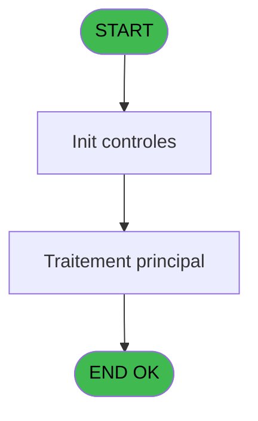

# ADH IDE 66 - Lancement Solde ECO

> **Analyse**: Phases 1-4 2026-02-08 02:00 -> 02:00 (4s) | Assemblage 02:00
> **Pipeline**: V7.2 Enrichi
> **Structure**: 4 onglets (Resume | Ecrans | Donnees | Connexions)

<!-- TAB:Resume -->

## 1. FICHE D'IDENTITE

| Attribut | Valeur |
|----------|--------|
| Projet | ADH |
| IDE Position | 66 |
| Nom Programme | Lancement Solde ECO |
| Fichier source | `Prg_66.xml` |
| Dossier IDE | Comptabilite |
| Taches | 1 (0 ecrans visibles) |
| Tables modifiees | 0 |
| Programmes appeles | 1 |
| Complexite | **BASSE** (score 5/100) |
| Statut | **ORPHELIN_POTENTIEL** |

## 2. DESCRIPTION FONCTIONNELLE

ADH IDE 66 - Lancement Solde ECO est un programme déclencheur qui initialise le flux de gestion du solde pour les clients en mode Easy Check-Out économique. Il agit comme passerelle entre le menu de caisse (ADH IDE 121) et le module de calcul de solde ECO spécialisé (ADH IDE 64 - Solde Easy Check Out), en transmettant les paramètres client (société, compte, filiation) et les contextes commerciaux requis.

Le programme valide les prérequis d'accès au solde ECO : vérification du compte actif, disponibilité des données de service (cafil048_dat), et permissions d'opérateur. Il prépare les variables globales nécessaires (VG60, VG63 notamment) et initialise les buffers de communication avec le module de destination via CallTask. Son rôle est d'éviter les redondances de validation en centralisant les vérifications préalables.

Une fois les paramètres validés, ADH IDE 66 transfère le flux vers ADH IDE 64 pour le calcul effectif du solde consolidé par service. Il gère également l'affichage de messages d'erreur contextuels si le compte est fermé, les données inaccessibles, ou les droits insuffisants - garantissant une expérience utilisateur cohérente dans le workflow Easy Check-Out.

## 3. BLOCS FONCTIONNELS

## 5. REGLES METIER

1 regles identifiees:

### Autres (1 regles)

#### [RM-001] 'dga_date_depot='''&DStr('17/04/2022'DATE,'YYYYMMDD')&''''

| Element | Detail |
|---------|--------|
| **Condition** | `'dga_date_depot='''&DStr('17/04/2022'DATE,'YYYYMMDD')&''''` |
| **Si vrai** | Action conditionnelle |
| **Expression source** | Expression 2 : `'dga_date_depot='''&DStr('17/04/2022'DATE,'YYYYMMDD')&''''` |
| **Exemple** | Si 'dga_date_depot='''&DStr('17/04/2022'DATE,'YYYYMMDD')&'''' → Action conditionnelle |

## 6. CONTEXTE

- **Appele par**: (aucun)
- **Appelle**: 1 programmes | **Tables**: 0 (W:0 R:0 L:0) | **Taches**: 1 | **Expressions**: 3

<!-- TAB:Ecrans -->

## 8. ECRANS

*(Programme sans ecran visible)*

## 9. NAVIGATION

### 9.3 Structure hierarchique (0 tache)

| Position | Tache | Type | Dimensions | Bloc |
|----------|-------|------|------------|------|

### 9.4 Algorigramme

> **Legende**: Vert = START/END OK | Rouge = END KO | Bleu = Decisions
> *Algorigramme auto-genere. Utiliser `/algorigramme` pour une synthese metier detaillee.*

<!-- TAB:Donnees -->

## 10. TABLES

### Tables utilisees (0)

| ID | Nom | Description | Type | R | W | L | Usages |
|----|-----|-------------|------|---|---|---|--------|

### Colonnes par table (0 / 0 tables avec colonnes identifiees)

## 11. VARIABLES

*(Programme sans variables locales mappees)*

## 12. EXPRESSIONS

**3 / 3 expressions decodees (100%)**

### 12.1 Repartition par type

| Type | Expressions | Regles |
|------|-------------|--------|
| CALCULATION | 1 | 0 |
| FORMAT | 1 | 0 |
| CAST_LOGIQUE | 1 | 0 |

### 12.2 Expressions cles par type

#### CALCULATION (1 expressions)

| Type | IDE | Expression | Regle |
|------|-----|------------|-------|
| CALCULATION | 1 | `'30/03/2023'DATE` | - |

#### FORMAT (1 expressions)

| Type | IDE | Expression | Regle |
|------|-----|------------|-------|
| FORMAT | 2 | `'dga_date_depot='''&DStr('17/04/2022'DATE,'YYYYMMDD')&''''` | - |

#### CAST_LOGIQUE (1 expressions)

| Type | IDE | Expression | Regle |
|------|-----|------------|-------|
| CAST_LOGIQUE | 3 | `'TRUE'LOG` | - |

<!-- TAB:Connexions -->

## 13. GRAPHE D'APPELS

### 13.1 Chaine depuis Main (Callers)

**Chemin**: (pas de callers directs)

### 13.2 Callers

| IDE | Nom Programme | Nb Appels |
|-----|---------------|-----------|
| - | (aucun) | - |

### 13.3 Callees (programmes appeles)

### 13.4 Detail Callees avec contexte

| IDE | Nom Programme | Appels | Contexte |
|-----|---------------|--------|----------|
| [64](ADH-IDE-64.md) | Solde Easy Check Out | 1 | Verification solde |

## 14. RECOMMANDATIONS MIGRATION

### 14.1 Profil du programme

| Metrique | Valeur | Impact migration |
|----------|--------|-----------------|
| Lignes de logique | 2 | Programme compact |
| Expressions | 3 | Peu de logique |
| Tables WRITE | 0 | Impact faible |
| Sous-programmes | 1 | Peu de dependances |
| Ecrans visibles | 0 | Ecran unique ou traitement batch |
| Code desactive | 0% (0 / 2) | Code sain |
| Regles metier | 1 | Quelques regles a preserver |

### 14.2 Plan de migration par bloc

### 14.3 Dependances critiques

| Dependance | Type | Appels | Impact |
|------------|------|--------|--------|
| [Solde Easy Check Out (IDE 64)](ADH-IDE-64.md) | Sous-programme | 1x | Normale - Verification solde |

---
*Spec DETAILED generee par Pipeline V7.2 - 2026-02-08 02:01*
