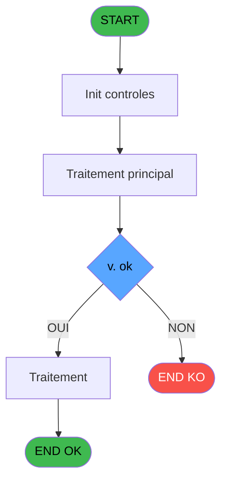

# ADH IDE 68 - Saisie date

> **Analyse**: Phases 1-4 2026-02-07 03:43 -> 02:02 (22h18min) | Assemblage 02:02
> **Pipeline**: V7.2 Enrichi
> **Structure**: 4 onglets (Resume | Ecrans | Donnees | Connexions)

<!-- TAB:Resume -->

## 1. FICHE D'IDENTITE

| Attribut | Valeur |
|----------|--------|
| Projet | ADH |
| IDE Position | 68 |
| Nom Programme | Saisie date |
| Fichier source | `Prg_68.xml` |
| Dossier IDE | General |
| Taches | 1 (1 ecrans visibles) |
| Tables modifiees | 0 |
| Programmes appeles | 1 |
| Complexite | **BASSE** (score 5/100) |

## 2. DESCRIPTION FONCTIONNELLE

**Saisie date** assure la gestion complete de ce processus, accessible depuis [Print extrait DateImp /O (IDE 74)](ADH-IDE-74.md).

Le flux de traitement s'organise en **1 blocs fonctionnels** :

- **Saisie** (1 tache) : ecrans de saisie utilisateur (formulaires, champs, donnees)

**Logique metier** : 1 regles identifiees couvrant conditions metier.

## 3. BLOCS FONCTIONNELS

### 3.1 Saisie (1 tache)

L'operateur saisit les donnees de la transaction via 1 ecran (Saisie dates).

---

#### 68 - Saisie dates [[ECRAN]](#ecran-t1)

**Role** : Saisie des donnees : Saisie dates.
**Ecran** : 533 x 92 DLU (MDI) | [Voir mockup](#ecran-t1)

## 5. REGLES METIER

1 regles identifiees:

### Autres (1 regles)

#### [RM-001] Negation de (v. ok [F]) (condition inversee)

| Element | Detail |
|---------|--------|
| **Condition** | `NOT (v. ok [F])` |
| **Si vrai** | Action si vrai |
| **Variables** | ES (v. ok) |
| **Expression source** | Expression 9 : `NOT (v. ok [F])` |
| **Exemple** | Si NOT (v. ok [F]) → Action si vrai |

## 6. CONTEXTE

- **Appele par**: [Print extrait DateImp /O (IDE 74)](ADH-IDE-74.md)
- **Appelle**: 1 programmes | **Tables**: 0 (W:0 R:0 L:0) | **Taches**: 1 | **Expressions**: 10

<!-- TAB:Ecrans -->

## 8. ECRANS

### 8.1 Forms visibles (1 / 1)

| # | Position | Tache | Nom | Type | Largeur | Hauteur | Bloc |
|---|----------|-------|-----|------|---------|---------|------|
| 1 | 68 | 68 | Saisie dates | MDI | 533 | 92 | Saisie |

### 8.2 Mockups Ecrans

---

#### 68 - Saisie dates
**Tache** : [68](#t1) | **Type** : MDI | **Dimensions** : 533 x 92 DLU
**Bloc** : Saisie | **Titre IDE** : Saisie dates

<!-- FORM-DATA:
{
    "width":  533,
    "vFactor":  8,
    "type":  "MDI",
    "hFactor":  8,
    "controls":  [
                     {
                         "x":  0,
                         "type":  "label",
                         "var":  "",
                         "y":  0,
                         "w":  533,
                         "fmt":  "",
                         "name":  "",
                         "h":  18,
                         "color":  "",
                         "text":  "",
                         "parent":  null
                     },
                     {
                         "x":  158,
                         "type":  "label",
                         "var":  "",
                         "y":  28,
                         "w":  127,
                         "fmt":  "",
                         "name":  "",
                         "h":  8,
                         "color":  "4",
                         "text":  "Du",
                         "parent":  null
                     },
                     {
                         "x":  157,
                         "type":  "label",
                         "var":  "",
                         "y":  46,
                         "w":  127,
                         "fmt":  "",
                         "name":  "",
                         "h":  8,
                         "color":  "4",
                         "text":  "Au",
                         "parent":  null
                     },
                     {
                         "x":  0,
                         "type":  "label",
                         "var":  "",
                         "y":  68,
                         "w":  531,
                         "fmt":  "",
                         "name":  "",
                         "h":  24,
                         "color":  "",
                         "text":  "",
                         "parent":  null
                     },
                     {
                         "x":  306,
                         "type":  "edit",
                         "var":  "",
                         "y":  27,
                         "w":  126,
                         "fmt":  "DD/MM/YYYYA",
                         "name":  "v.date Min",
                         "h":  10,
                         "color":  "6",
                         "text":  "",
                         "parent":  null
                     },
                     {
                         "x":  305,
                         "type":  "edit",
                         "var":  "",
                         "y":  45,
                         "w":  126,
                         "fmt":  "DD/MM/YYYYA",
                         "name":  "v.date Max",
                         "h":  10,
                         "color":  "6",
                         "text":  "",
                         "parent":  null
                     },
                     {
                         "x":  6,
                         "type":  "button",
                         "var":  "",
                         "y":  72,
                         "w":  154,
                         "fmt":  "\u0026Ok",
                         "name":  "Bouton Ok",
                         "h":  18,
                         "color":  "",
                         "text":  "",
                         "parent":  9
                     },
                     {
                         "x":  7,
                         "type":  "edit",
                         "var":  "",
                         "y":  4,
                         "w":  267,
                         "fmt":  "20",
                         "name":  "",
                         "h":  8,
                         "color":  "",
                         "text":  "",
                         "parent":  1
                     },
                     {
                         "x":  269,
                         "type":  "edit",
                         "var":  "",
                         "y":  5,
                         "w":  256,
                         "fmt":  "WWW DD MMM YYYYT",
                         "name":  "",
                         "h":  8,
                         "color":  "",
                         "text":  "",
                         "parent":  1
                     },
                     {
                         "x":  7,
                         "type":  "image",
                         "var":  "",
                         "y":  21,
                         "w":  128,
                         "fmt":  "",
                         "name":  "",
                         "h":  45,
                         "color":  "4",
                         "text":  "",
                         "parent":  null
                     },
                     {
                         "x":  173,
                         "type":  "button",
                         "var":  "",
                         "y":  72,
                         "w":  154,
                         "fmt":  "A\u0026bandonner",
                         "name":  "",
                         "h":  18,
                         "color":  "",
                         "text":  "",
                         "parent":  null
                     }
                 ],
    "taskId":  "68",
    "height":  92
}
-->

<strong>Champs : 4 champs</strong>

| Pos (x,y) | Nom | Variable | Type |
|-----------|-----|----------|------|
| 306,27 | v.date Min | - | edit |
| 305,45 | v.date Max | - | edit |
| 7,4 | 20 | - | edit |
| 269,5 | WWW DD MMM YYYYT | - | edit |

<strong>Boutons : 2 boutons</strong>

| Bouton | Pos (x,y) | Action |
|--------|-----------|--------|
| Ok | 6,72 | Valide la saisie et enregistre |
| Abandonner | 173,72 | Annule et retour au menu |

## 9. NAVIGATION

Ecran unique: **Saisie dates**

### 9.3 Structure hierarchique (1 tache)

| Position | Tache | Type | Dimensions | Bloc |
|----------|-------|------|------------|------|
| **68.1** | [**Saisie dates** (68)](#t1) [mockup](#ecran-t1) | MDI | 533x92 | Saisie |

### 9.4 Algorigramme

> **Legende**: Vert = START/END OK | Rouge = END KO | Bleu = Decisions
> *Algorigramme auto-genere. Utiliser `/algorigramme` pour une synthese metier detaillee.*

<!-- TAB:Donnees -->

## 10. TABLES

### Tables utilisees (0)

| ID | Nom | Description | Type | R | W | L | Usages |
|----|-----|-------------|------|---|---|---|--------|

### Colonnes par table (0 / 0 tables avec colonnes identifiees)

## 11. VARIABLES

### 11.1 Variables de session (4)

Variables persistantes pendant toute la session.

| Lettre | Nom | Type | Usage dans |
|--------|-----|------|-----------|
| EQ | v.date Min | Date | 1x session |
| ER | v.date Max | Date | 1x session |
| ES | v. ok | Logical | 1x session |
| EU | v.titre | Alpha | 1x session |

### 11.2 Autres (4)

Variables diverses.

| Lettre | Nom | Type | Usage dans |
|--------|-----|------|-----------|
| EN | > date comptable | Date | [68](#t1) |
| EO | < date min | Date | - |
| EP | < date max | Date | - |
| ET | Bouton Ok | Alpha | - |

## 12. EXPRESSIONS

**10 / 10 expressions decodees (100%)**

### 12.1 Repartition par type

| Type | Expressions | Regles |
|------|-------------|--------|
| CALCULATION | 1 | 0 |
| NEGATION | 1 | 5 |
| CONSTANTE | 1 | 0 |
| DATE | 1 | 0 |
| CONDITION | 1 | 0 |
| REFERENCE_VG | 1 | 0 |
| OTHER | 2 | 0 |
| CAST_LOGIQUE | 1 | 0 |
| STRING | 1 | 0 |

### 12.2 Expressions cles par type

#### CALCULATION (1 expressions)

| Type | IDE | Expression | Regle |
|------|-----|------------|-------|
| CALCULATION | 8 | `'00/00/0000'DATE` | - |

#### NEGATION (1 expressions)

| Type | IDE | Expression | Regle |
|------|-----|------------|-------|
| NEGATION | 9 | `NOT (v. ok [F])` | [RM-001](#rm-RM-001) |

#### CONSTANTE (1 expressions)

| Type | IDE | Expression | Regle |
|------|-----|------------|-------|
| CONSTANTE | 3 | `123` | - |

#### DATE (1 expressions)

| Type | IDE | Expression | Regle |
|------|-----|------------|-------|
| DATE | 4 | `Date ()` | - |

#### CONDITION (1 expressions)

| Type | IDE | Expression | Regle |
|------|-----|------------|-------|
| CONDITION | 1 | `> date comptable [A]` | - |

#### REFERENCE_VG (1 expressions)

| Type | IDE | Expression | Regle |
|------|-----|------------|-------|
| REFERENCE_VG | 5 | `VG2` | - |

#### OTHER (2 expressions)

| Type | IDE | Expression | Regle |
|------|-----|------------|-------|
| OTHER | 7 | `v.date Max [E]` | - |
| OTHER | 6 | `v.date Min [D]` | - |

#### CAST_LOGIQUE (1 expressions)

| Type | IDE | Expression | Regle |
|------|-----|------------|-------|
| CAST_LOGIQUE | 10 | `'TRUE'LOG` | - |

#### STRING (1 expressions)

| Type | IDE | Expression | Regle |
|------|-----|------------|-------|
| STRING | 2 | `Trim (v.titre [H])` | - |

<!-- TAB:Connexions -->

## 13. GRAPHE D'APPELS

### 13.1 Chaine depuis Main (Callers)

Main -> ... -> [Print extrait DateImp /O (IDE 74)](ADH-IDE-74.md) -> **Saisie date (IDE 68)**

### 13.2 Callers

| IDE | Nom Programme | Nb Appels |
|-----|---------------|-----------|
| [74](ADH-IDE-74.md) | Print extrait DateImp /O | 1 |

### 13.3 Callees (programmes appeles)

### 13.4 Detail Callees avec contexte

| IDE | Nom Programme | Appels | Contexte |
|-----|---------------|--------|----------|
| [43](ADH-IDE-43.md) | Recuperation du titre | 1 | Recuperation donnees |

## 14. RECOMMANDATIONS MIGRATION

### 14.1 Profil du programme

| Metrique | Valeur | Impact migration |
|----------|--------|-----------------|
| Lignes de logique | 23 | Programme compact |
| Expressions | 10 | Peu de logique |
| Tables WRITE | 0 | Impact faible |
| Sous-programmes | 1 | Peu de dependances |
| Ecrans visibles | 1 | Ecran unique ou traitement batch |
| Code desactive | 0% (0 / 23) | Code sain |
| Regles metier | 1 | Quelques regles a preserver |

### 14.2 Plan de migration par bloc

#### Saisie (1 tache: 1 ecran, 0 traitement)

- **Strategie** : Formulaire React/Blazor avec validation Zod/FluentValidation.
- Reproduire 1 ecran : Saisie dates
- Validation temps reel cote client + serveur

### 14.3 Dependances critiques

| Dependance | Type | Appels | Impact |
|------------|------|--------|--------|
| [Recuperation du titre (IDE 43)](ADH-IDE-43.md) | Sous-programme | 1x | Normale - Recuperation donnees |

---
*Spec DETAILED generee par Pipeline V7.2 - 2026-02-08 02:06*
