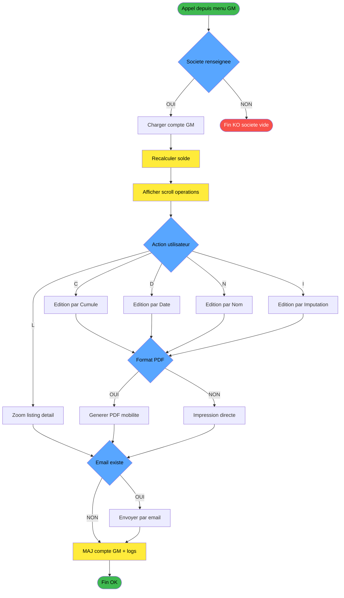

# ADH IDE 69 - Extrait de compte

> **Analyse**: Phases 1-4 2026-02-23 18:22 -> 18:22 (1s) | Assemblage 12:29
> **Pipeline**: V7.2 Enrichi
> **Structure**: 4 onglets (Resume | Ecrans | Donnees | Connexions)

<!-- TAB:Resume -->

## 1. FICHE D'IDENTITE

| Attribut | Valeur |
|----------|--------|
| Projet | ADH |
| IDE Position | 69 |
| Nom Programme | Extrait de compte |
| Fichier source | `Prg_69.xml` |
| Dossier IDE | Comptabilite |
| Taches | 12 (3 ecrans visibles) |
| Tables modifiees | 4 |
| Programmes appeles | 14 |
| Complexite | **BASSE** (score 35/100) |

## 2. DESCRIPTION FONCTIONNELLE

### 2.1 Objectif metier

**Extrait de compte** permet a l'operateur caisse de **consulter et imprimer l'historique des transactions** d'un adherent Club Med (compte GM). Le programme affiche la liste chronologique des debits/credits avec leurs details (date, heure, libelle, montant, Gift Pass) et propose **6 formats d'impression differents** selon le critere de tri souhaite.

### 2.2 Contexte d'appel

- **Appelant** : [Menu caisse GM - scroll (IDE 163)](ADH-IDE-163.md)
- **Parametres d'entree** (12) :
  - A : societe (Alpha)
  - B : code_retour (Alpha)
  - C : code_adherent (Numeric) - identifiant unique du GM
  - D : filiation (Numeric) - lien familial
  - E : masque_mtt (Alpha) - format affichage montants
  - F : nom_village (Alpha)
  - G : solde_compte (Numeric) - **RETOUR** : solde recalcule
  - H : etat_compte (Alpha) - **RETOUR** : etat du compte
  - I : date_solde (Date) - **RETOUR** : date du dernier calcul
  - J : garanti_O/N (Alpha)
  - K : P_FormatPDF (Logical) - mode PDF ou impression directe
  - L : ViensDe (Alpha) - contexte d'appel

### 2.3 Flux principal

1. **Chargement** : Lecture du compte GM (table 47) + ecritures comptables (table 40)
2. **Recalcul solde** : Somme des debits/credits depuis la table comptable
3. **Affichage scroll** : Liste des operations avec tri par date decroissant
4. **Actions utilisateur** : Boutons C/D/I/N/O/L/S pour choisir le format d'edition
5. **Impression/Email** : Generation du document selon le format choisi

### 2.4 Formats d'edition disponibles

| Bouton | Code | Programme | Description |
|--------|------|-----------|-------------|
| **C** | 12 | [IDE 72](ADH-IDE-72.md) | Edition par **Cumule** |
| **D** | 10 | [IDE 71](ADH-IDE-71.md) | Edition par **Date** |
| **I** | 14 | [IDE 73](ADH-IDE-73.md) | Edition par **Imputation** |
| **N** | 8 | [IDE 70](ADH-IDE-70.md) | Edition par **Nom** |
| **O** | 16 | [IDE 74](ADH-IDE-74.md) | Edition par **Date/Imputation ordonnee** |
| **L** | - | [IDE 226](ADH-IDE-226.md) | **Zoom Listing** (detail ligne) |
| **S** | 16 | [IDE 76](ADH-IDE-76.md) | Edition par **Service** |

### 2.5 Expressions cles

| IDE | Expression | Signification |
|-----|------------|---------------|
| 4 | `{0,5}+{0,3}` | Solde = cumul debits + credits precedents |
| 11 | `IF({0,16}>0,'x','')` | Marqueur si montant Gift Pass present |
| 12 | `IF({0,13}='X',141,IF({0,13}='A',143,7))` | Couleur ligne selon etat (X=rouge, A=orange, autre=noir) |
| 51 | `{0,65} OR ({0,24} AND NOT ISNULL({0,25}) AND isVenteODSignature()) OR ({32768,86} AND Exist_recu_detail())` | Condition affichage bouton detail recu |

### 2.6 Variables importantes

| Lettre | Nom | Role |
|--------|-----|------|
| E (tache 5) | W1 Choix_action | Stocke le choix utilisateur (C/D/I/N/O/L/S) |
| L (tache 5) | W1 Impr Recap Free Extra | Flag impression recapitulatif Gift Pass |
| M (tache 0) | W0 Presence Recap Free Extra | Indique si des Gift Pass existent sur le compte |
| N (tache 0) | W0 Print Recap Free Extra | Demande d'impression du recap Gift Pass |
| O (tache 0) | W0 Mail Existe | Indique si l'adherent a une adresse email |

**Donnees modifiees** : 4 tables en ecriture (comptable________cte, compte_gm________cgm, pms_print_param_default, log_booker).

Detail : phases du traitement

#### Phase 1 : Calcul (5 taches)

- **69** - Extrait de compte **[[ECRAN]](#ecran-t1)**
- **69.1** - Recalcul solde
- **69.2** - Reaffichage infos compte
- **69.3** - Scroll compte **[[ECRAN]](#ecran-t5)**
- **69.4** - Reaffichage infos compte

#### Phase 2 : Traitement (4 taches)

- **69.1.1** - Solde GM
- **69.3.3** - SendMail
- **69.3.5** - Check recu detail
- **69.3.6** - PDF mobilité POS **[[ECRAN]](#ecran-t11)**

Delegue a : [Set Listing Number (IDE 181)](ADH-IDE-181.md), [Other Listing (IDE 183)](ADH-IDE-183.md), [Recuperation du titre (IDE 43)](ADH-IDE-43.md), [Appel programme (IDE 44)](ADH-IDE-44.md)

#### Phase 3 : Impression (1 tache)

- **69.3.1** - Choix Edition **[[ECRAN]](#ecran-t6)**

Delegue a : [Get Printer (IDE 179)](ADH-IDE-179.md), [Set Listing Number (IDE 181)](ADH-IDE-181.md), [Other Listing (IDE 183)](ADH-IDE-183.md), [Print extrait compte /Date (IDE 71)](ADH-IDE-71.md), [Print extrait compte /Nom (IDE 70)](ADH-IDE-70.md), [Print extrait compte /Cum (IDE 72)](ADH-IDE-72.md), [Print extrait compte /Imp (IDE 73)](ADH-IDE-73.md), [Print extrait DateImp /O (IDE 74)](ADH-IDE-74.md), [Print extrait compte /Service (IDE 76)](ADH-IDE-76.md), [Printer choice (IDE 180)](ADH-IDE-180.md), [Raz Current Printer (IDE 182)](ADH-IDE-182.md)

#### Phase 4 : Consultation (1 tache)

- **69.3.2** - Zoom Listing **[[ECRAN]](#ecran-t7)**

Delegue a : [Recuperation du titre (IDE 43)](ADH-IDE-43.md), [Recherche Adresse Mail (IDE 226)](ADH-IDE-226.md)

#### Phase 5 : Saisie (1 tache)

- **69.3.4** - Vérif. Vente avec signature

#### Tables impactees

| Table | Operations | Role metier |
|-------|-----------|-------------|
| comptable________cte | R/**W** (3 usages) |  |
| compte_gm________cgm | R/**W** (3 usages) | Comptes GM (generaux) |
| pms_print_param_default | **W** (1 usages) |  |
| log_booker | **W** (1 usages) |  |

## 3. BLOCS FONCTIONNELS

### 3.1 Calcul (5 taches)

Calculs metier : montants, stocks, compteurs.

---

#### T1 - Extrait de compte [ECRAN]

**Role** : Traitement : Extrait de compte.
**Ecran** : 166 x 15 DLU (MDI) | [Voir mockup](#ecran-t1)

4 sous-taches directes

| Tache | Nom | Bloc |
|-------|-----|------|
| [T2](#t2) | Recalcul solde | Calcul |
| [T4](#t4) | Reaffichage infos compte | Calcul |
| [T5](#t5) | Scroll compte **[ECRAN]** | Calcul |
| [T12](#t12) | Reaffichage infos compte | Calcul |

**Variables liees** : ET (< solde compte), EU (< etat compte)
**Delegue a** : [Print extrait compte /Date (IDE 71)](ADH-IDE-71.md), [Print extrait compte /Nom (IDE 70)](ADH-IDE-70.md), [Print extrait compte /Cum (IDE 72)](ADH-IDE-72.md)

---

#### T2 - Recalcul solde

**Role** : Calcul : Recalcul solde.
**Variables liees** : ET (< solde compte), EV (< date solde)

---

#### T4 - Reaffichage infos compte

**Role** : Reinitialisation : Reaffichage infos compte.
**Variables liees** : ET (< solde compte), EU (< etat compte)

---

#### T5 - Scroll compte [ECRAN]

**Role** : Traitement : Scroll compte.
**Ecran** : 1496 x 291 DLU (MDI) | [Voir mockup](#ecran-t5)
**Variables liees** : ET (< solde compte), EU (< etat compte)

---

#### T12 - Reaffichage infos compte

**Role** : Reinitialisation : Reaffichage infos compte.
**Variables liees** : ET (< solde compte), EU (< etat compte)

### 3.2 Traitement (4 taches)

Traitements internes.

---

#### T3 - Solde GM

**Role** : Consultation/chargement : Solde GM.
**Variables liees** : ET (< solde compte), EV (< date solde)
**Delegue a** : [Set Listing Number (IDE 181)](ADH-IDE-181.md), [Other Listing (IDE 183)](ADH-IDE-183.md), [Recuperation du titre (IDE 43)](ADH-IDE-43.md)

---

#### T8 - SendMail

**Role** : Traitement : SendMail.
**Delegue a** : [Set Listing Number (IDE 181)](ADH-IDE-181.md), [Other Listing (IDE 183)](ADH-IDE-183.md), [Recuperation du titre (IDE 43)](ADH-IDE-43.md)

---

#### T10 - Check recu detail

**Role** : Traitement : Check recu detail.
**Variables liees** : FF (v.Flag recu détaillé), FG (v.Blob recu détaillé), FH (v.Fichier recu détaillé), FM (v.Retour_recu_detail)
**Delegue a** : [Set Listing Number (IDE 181)](ADH-IDE-181.md), [Other Listing (IDE 183)](ADH-IDE-183.md), [Recuperation du titre (IDE 43)](ADH-IDE-43.md)

---

#### T11 - PDF mobilité POS [ECRAN]

**Role** : Traitement : PDF mobilité POS.
**Ecran** : 123 x 195 DLU | [Voir mockup](#ecran-t11)
**Variables liees** : FN (v.Retour ticket mobilité POS)
**Delegue a** : [Set Listing Number (IDE 181)](ADH-IDE-181.md), [Other Listing (IDE 183)](ADH-IDE-183.md), [Recuperation du titre (IDE 43)](ADH-IDE-43.md)

### 3.3 Impression (1 tache)

Generation des documents et tickets.

---

#### T6 - Choix Edition [ECRAN]

**Role** : Generation du document : Choix Edition.
**Ecran** : 537 x 41 DLU | [Voir mockup](#ecran-t6)
**Variables liees** : FI (v. Edition partielle ?)
**Delegue a** : [Get Printer (IDE 179)](ADH-IDE-179.md), [Print extrait compte /Date (IDE 71)](ADH-IDE-71.md), [Print extrait compte /Nom (IDE 70)](ADH-IDE-70.md)

### 3.4 Consultation (1 tache)

Ecrans de recherche et consultation.

---

#### T7 - Zoom Listing [ECRAN]

**Role** : Selection par l'operateur : Zoom Listing.
**Ecran** : 818 x 0 DLU (MDI) | [Voir mockup](#ecran-t7)
**Delegue a** : [Recherche Adresse Mail (IDE 226)](ADH-IDE-226.md)

### 3.5 Saisie (1 tache)

Ce bloc traite la saisie des donnees de la transaction.

---

#### T9 - Vérif. Vente avec signature

**Role** : Saisie des donnees : Vérif. Vente avec signature.
**Variables liees** : FL (v.Retour isVenteODSignature)

## 5. REGLES METIER

2 regles identifiees:

### Autres (2 regles)

#### [RM-001] Condition: > societe [A] egale

| Element | Detail |
|---------|--------|
| **Condition** | `> societe [A]=''` |
| **Si vrai** | Action si vrai |
| **Variables** | EN (> societe) |
| **Expression source** | Expression 1 : `> societe [A]=''` |
| **Exemple** | Si > societe [A]='' → Action si vrai |

#### [RM-002] Negation de >P_FormatPDF [K] (condition inversee)

| Element | Detail |
|---------|--------|
| **Condition** | `NOT >P_FormatPDF [K]` |
| **Si vrai** | Action si vrai |
| **Variables** | EX (>P_FormatPDF) |
| **Expression source** | Expression 6 : `NOT >P_FormatPDF [K]` |
| **Exemple** | Si NOT >P_FormatPDF [K] → Action si vrai |

## 6. CONTEXTE

- **Appele par**: [Menu caisse GM - scroll (IDE 163)](ADH-IDE-163.md)
- **Appelle**: 14 programmes | **Tables**: 15 (W:4 R:4 L:10) | **Taches**: 12 | **Expressions**: 9

<!-- TAB:Ecrans -->

## 8. ECRANS

### 8.1 Forms visibles (3 / 12)

| # | Position | Tache | Nom | Type | Largeur | Hauteur | Bloc |
|---|----------|-------|-----|------|---------|---------|------|
| 1 | 69.3 | T5 | Scroll compte | MDI | 1496 | 291 | Calcul |
| 2 | 69.3.1 | T6 | Choix Edition | Type0 | 537 | 41 | Impression |
| 3 | 69.3.2 | T7 | Zoom Listing | MDI | 818 | 0 | Consultation |

### 8.2 Mockups Ecrans

---

#### 69.3 - Scroll compte
**Tache** : [T5](#t5) | **Type** : MDI | **Dimensions** : 1496 x 291 DLU
**Bloc** : Calcul | **Titre IDE** : Scroll compte

<!-- FORM-DATA:
{
    "width":  1496,
    "vFactor":  8,
    "type":  "MDI",
    "hFactor":  8,
    "controls":  [
                     {
                         "x":  0,
                         "type":  "label",
                         "var":  "",
                         "y":  1,
                         "w":  1481,
                         "fmt":  "",
                         "name":  "",
                         "h":  19,
                         "color":  "",
                         "text":  "",
                         "parent":  null
                     },
                     {
                         "x":  116,
                         "type":  "label",
                         "var":  "",
                         "y":  182,
                         "w":  663,
                         "fmt":  "",
                         "name":  "",
                         "h":  79,
                         "color":  "",
                         "text":  "",
                         "parent":  null
                     },
                     {
                         "x":  334,
                         "type":  "label",
                         "var":  "",
                         "y":  186,
                         "w":  434,
                         "fmt":  "",
                         "name":  "",
                         "h":  70,
                         "color":  "",
                         "text":  "",
                         "parent":  null
                     },
                     {
                         "x":  337,
                         "type":  "label",
                         "var":  "",
                         "y":  187,
                         "w":  430,
                         "fmt":  "",
                         "name":  "",
                         "h":  68,
                         "color":  "",
                         "text":  "",
                         "parent":  null
                     },
                     {
                         "x":  362,
                         "type":  "label",
                         "var":  "",
                         "y":  191,
                         "w":  186,
                         "fmt":  "",
                         "name":  "",
                         "h":  43,
                         "color":  "",
                         "text":  "",
                         "parent":  null
                     },
                     {
                         "x":  548,
                         "type":  "label",
                         "var":  "",
                         "y":  191,
                         "w":  208,
                         "fmt":  "",
                         "name":  "",
                         "h":  43,
                         "color":  "",
                         "text":  "",
                         "parent":  null
                     },
                     {
                         "x":  363,
                         "type":  "label",
                         "var":  "",
                         "y":  192,
                         "w":  37,
                         "fmt":  "",
                         "name":  "",
                         "h":  41,
                         "color":  "",
                         "text":  "",
                         "parent":  null
                     },
                     {
                         "x":  549,
                         "type":  "label",
                         "var":  "",
                         "y":  192,
                         "w":  37,
                         "fmt":  "",
                         "name":  "",
                         "h":  41,
                         "color":  "",
                         "text":  "",
                         "parent":  null
                     },
                     {
                         "x":  408,
                         "type":  "label",
                         "var":  "",
                         "y":  195,
                         "w":  127,
                         "fmt":  "",
                         "name":  "",
                         "h":  9,
                         "color":  "142",
                         "text":  "Cumulé",
                         "parent":  null
                     },
                     {
                         "x":  594,
                         "type":  "label",
                         "var":  "",
                         "y":  220,
                         "w":  154,
                         "fmt":  "",
                         "name":  "",
                         "h":  9,
                         "color":  "142",
                         "text":  "Libellé",
                         "parent":  null
                     },
                     {
                         "x":  408,
                         "type":  "label",
                         "var":  "",
                         "y":  208,
                         "w":  127,
                         "fmt":  "",
                         "name":  "",
                         "h":  9,
                         "color":  "142",
                         "text":  "Date",
                         "parent":  null
                     },
                     {
                         "x":  594,
                         "type":  "label",
                         "var":  "",
                         "y":  195,
                         "w":  154,
                         "fmt":  "",
                         "name":  "",
                         "h":  9,
                         "color":  "142",
                         "text":  "Nom",
                         "parent":  null
                     },
                     {
                         "x":  408,
                         "type":  "label",
                         "var":  "",
                         "y":  220,
                         "w":  127,
                         "fmt":  "",
                         "name":  "",
                         "h":  9,
                         "color":  "142",
                         "text":  "Imputation",
                         "parent":  null
                     },
                     {
                         "x":  594,
                         "type":  "label",
                         "var":  "",
                         "y":  208,
                         "w":  154,
                         "fmt":  "",
                         "name":  "",
                         "h":  9,
                         "color":  "142",
                         "text":  "Date / Imput.",
                         "parent":  null
                     },
                     {
                         "x":  463,
                         "type":  "label",
                         "var":  "",
                         "y":  241,
                         "w":  120,
                         "fmt":  "",
                         "name":  "",
                         "h":  9,
                         "color":  "",
                         "text":  "Votre choix",
                         "parent":  null
                     },
                     {
                         "x":  0,
                         "type":  "label",
                         "var":  "",
                         "y":  266,
                         "w":  1481,
                         "fmt":  "",
                         "name":  "",
                         "h":  24,
                         "color":  "",
                         "text":  "",
                         "parent":  null
                     },
                     {
                         "x":  7,
                         "type":  "table",
                         "var":  "",
                         "name":  "",
                         "titleH":  12,
                         "color":  "110",
                         "w":  1482,
                         "y":  23,
                         "fmt":  "",
                         "parent":  null,
                         "text":  "",
                         "rowH":  13,
                         "h":  138,
                         "cols":  [
                                      {
                                          "title":  "Crédit/Débit",
                                          "layer":  1,
                                          "w":  122
                                      },
                                      {
                                          "title":  "Date",
                                          "layer":  2,
                                          "w":  124
                                      },
                                      {
                                          "title":  "Heure",
                                          "layer":  3,
                                          "w":  149
                                      },
                                      {
                                          "title":  "Libellé",
                                          "layer":  4,
                                          "w":  257
                                      },
                                      {
                                          "title":  "Libellé Supplementaire",
                                          "layer":  5,
                                          "w":  273
                                      },
                                      {
                                          "title":  "Nb d\u0027articles",
                                          "layer":  6,
                                          "w":  131
                                      },
                                      {
                                          "title":  "Montant",
                                          "layer":  7,
                                          "w":  193
                                      },
                                      {
                                          "title":  "Gift Pass",
                                          "layer":  8,
                                          "w":  196
                                      }
                                  ],
                         "rows":  8
                     },
                     {
                         "x":  785,
                         "type":  "label",
                         "var":  "",
                         "y":  177,
                         "w":  596,
                         "fmt":  "",
                         "name":  "",
                         "h":  19,
                         "color":  "",
                         "text":  "",
                         "parent":  null
                     },
                     {
                         "x":  785,
                         "type":  "label",
                         "var":  "",
                         "y":  197,
                         "w":  596,
                         "fmt":  "",
                         "name":  "",
                         "h":  19,
                         "color":  "",
                         "text":  "",
                         "parent":  null
                     },
                     {
                         "x":  794,
                         "type":  "label",
                         "var":  "",
                         "y":  204,
                         "w":  83,
                         "fmt":  "",
                         "name":  "",
                         "h":  10,
                         "color":  "42",
                         "text":  "Operateur",
                         "parent":  45
                     },
                     {
                         "x":  918,
                         "type":  "label",
                         "var":  "",
                         "y":  158,
                         "w":  148,
                         "fmt":  "",
                         "name":  "",
                         "h":  10,
                         "color":  "42",
                         "text":  "Account Balance",
                         "parent":  null
                     },
                     {
                         "x":  134,
                         "type":  "edit",
                         "var":  "",
                         "y":  39,
                         "w":  114,
                         "fmt":  "##/##/####Z",
                         "name":  "",
                         "h":  8,
                         "color":  "110",
                         "text":  "",
                         "parent":  22
                     },
                     {
                         "x":  258,
                         "type":  "edit",
                         "var":  "",
                         "y":  38,
                         "w":  138,
                         "fmt":  "HH:MMZ",
                         "name":  "cte_heure_operation",
                         "h":  10,
                         "color":  "110",
                         "text":  "",
                         "parent":  22
                     },
                     {
                         "x":  413,
                         "type":  "edit",
                         "var":  "",
                         "y":  39,
                         "w":  242,
                         "fmt":  "",
                         "name":  "",
                         "h":  8,
                         "color":  "110",
                         "text":  "",
                         "parent":  22
                     },
                     {
                         "x":  664,
                         "type":  "edit",
                         "var":  "",
                         "y":  39,
                         "w":  224,
                         "fmt":  "U20",
                         "name":  "CTE libelle Supplem.",
                         "h":  8,
                         "color":  "110",
                         "text":  "",
                         "parent":  22
                     },
                     {
                         "x":  19,
                         "type":  "edit",
                         "var":  "",
                         "y":  39,
                         "w":  30,
                         "fmt":  "UX",
                         "name":  "",
                         "h":  8,
                         "color":  "110",
                         "text":  "",
                         "parent":  22
                     },
                     {
                         "x":  1074,
                         "type":  "edit",
                         "var":  "",
                         "y":  38,
                         "w":  176,
                         "fmt":  "15",
                         "name":  "",
                         "h":  8,
                         "color":  "110",
                         "text":  "",
                         "parent":  22
                     },
                     {
                         "x":  999,
                         "type":  "edit",
                         "var":  "",
                         "y":  39,
                         "w":  30,
                         "fmt":  "2Z",
                         "name":  "",
                         "h":  8,
                         "color":  "110",
                         "text":  "",
                         "parent":  22
                     },
                     {
                         "x":  167,
                         "type":  "checkbox",
                         "var":  "",
                         "y":  164,
                         "w":  274,
                         "fmt":  "",
                         "name":  "W1 Impr Recap Free Extra",
                         "h":  12,
                         "color":  "",
                         "text":  "Edition récapitulatif GIFT PASS",
                         "parent":  null
                     },
                     {
                         "x":  930,
                         "type":  "edit",
                         "var":  "",
                         "y":  204,
                         "w":  101,
                         "fmt":  "",
                         "name":  "",
                         "h":  10,
                         "color":  "42",
                         "text":  "",
                         "parent":  45
                     },
                     {
                         "x":  595,
                         "type":  "edit",
                         "var":  "",
                         "y":  240,
                         "w":  26,
                         "fmt":  "",
                         "name":  "W1 Choix_action",
                         "h":  10,
                         "color":  "6",
                         "text":  "",
                         "parent":  null
                     },
                     {
                         "x":  10,
                         "type":  "edit",
                         "var":  "",
                         "y":  6,
                         "w":  331,
                         "fmt":  "20",
                         "name":  "",
                         "h":  8,
                         "color":  "",
                         "text":  "",
                         "parent":  null
                     },
                     {
                         "x":  1267,
                         "type":  "edit",
                         "var":  "",
                         "y":  6,
                         "w":  203,
                         "fmt":  "WWW DD MMM YYYYT",
                         "name":  "",
                         "h":  8,
                         "color":  "",
                         "text":  "",
                         "parent":  null
                     },
                     {
                         "x":  970,
                         "type":  "edit",
                         "var":  "",
                         "y":  39,
                         "w":  19,
                         "fmt":  "1",
                         "name":  "",
                         "h":  8,
                         "color":  "110",
                         "text":  "",
                         "parent":  22
                     },
                     {
                         "x":  790,
                         "type":  "edit",
                         "var":  "",
                         "y":  184,
                         "w":  584,
                         "fmt":  "40",
                         "name":  "",
                         "h":  8,
                         "color":  "42",
                         "text":  "",
                         "parent":  41
                     },
                     {
                         "x":  139,
                         "type":  "image",
                         "var":  "",
                         "y":  193,
                         "w":  160,
                         "fmt":  "",
                         "name":  "",
                         "h":  58,
                         "color":  "",
                         "text":  "",
                         "parent":  null
                     },
                     {
                         "x":  367,
                         "type":  "button",
                         "var":  "",
                         "y":  195,
                         "w":  26,
                         "fmt":  "C",
                         "name":  "C",
                         "h":  9,
                         "color":  "",
                         "text":  "",
                         "parent":  null
                     },
                     {
                         "x":  553,
                         "type":  "button",
                         "var":  "",
                         "y":  220,
                         "w":  26,
                         "fmt":  "L",
                         "name":  "L",
                         "h":  9,
                         "color":  "",
                         "text":  "",
                         "parent":  null
                     },
                     {
                         "x":  367,
                         "type":  "button",
                         "var":  "",
                         "y":  208,
                         "w":  26,
                         "fmt":  "D",
                         "name":  "D",
                         "h":  9,
                         "color":  "",
                         "text":  "",
                         "parent":  null
                     },
                     {
                         "x":  553,
                         "type":  "button",
                         "var":  "",
                         "y":  195,
                         "w":  26,
                         "fmt":  "N",
                         "name":  "N",
                         "h":  9,
                         "color":  "",
                         "text":  "",
                         "parent":  null
                     },
                     {
                         "x":  787,
                         "type":  "image",
                         "var":  "",
                         "y":  218,
                         "w":  124,
                         "fmt":  "",
                         "name":  "",
                         "h":  42,
                         "color":  "",
                         "text":  "",
                         "parent":  null
                     },
                     {
                         "x":  367,
                         "type":  "button",
                         "var":  "",
                         "y":  220,
                         "w":  26,
                         "fmt":  "I",
                         "name":  "I",
                         "h":  9,
                         "color":  "",
                         "text":  "",
                         "parent":  null
                     },
                     {
                         "x":  553,
                         "type":  "button",
                         "var":  "",
                         "y":  208,
                         "w":  26,
                         "fmt":  "O",
                         "name":  "O",
                         "h":  9,
                         "color":  "",
                         "text":  "",
                         "parent":  null
                     },
                     {
                         "x":  9,
                         "type":  "button",
                         "var":  "",
                         "y":  269,
                         "w":  168,
                         "fmt":  "\u0026Quitter",
                         "name":  "",
                         "h":  18,
                         "color":  "",
                         "text":  "",
                         "parent":  null
                     },
                     {
                         "x":  1302,
                         "type":  "button",
                         "var":  "",
                         "y":  269,
                         "w":  168,
                         "fmt":  "Printer",
                         "name":  "",
                         "h":  18,
                         "color":  "",
                         "text":  "",
                         "parent":  null
                     },
                     {
                         "x":  1269,
                         "type":  "edit",
                         "var":  "",
                         "y":  38,
                         "w":  176,
                         "fmt":  "15",
                         "name":  "cte_montant_free_extra",
                         "h":  8,
                         "color":  "110",
                         "text":  "",
                         "parent":  22
                     },
                     {
                         "x":  896,
                         "type":  "button",
                         "var":  "",
                         "y":  38,
                         "w":  35,
                         "fmt":  "...",
                         "name":  "Fac",
                         "h":  10,
                         "color":  "",
                         "text":  "",
                         "parent":  22
                     },
                     {
                         "x":  367,
                         "type":  "button",
                         "var":  "",
                         "y":  237,
                         "w":  26,
                         "fmt":  "S",
                         "name":  "S",
                         "h":  9,
                         "color":  "",
                         "text":  "",
                         "parent":  null
                     },
                     {
                         "x":  1074,
                         "type":  "edit",
                         "var":  "",
                         "y":  158,
                         "w":  176,
                         "fmt":  "15",
                         "name":  "cgm_solde_du_compte",
                         "h":  10,
                         "color":  "42",
                         "text":  "",
                         "parent":  null
                     }
                 ],
    "taskId":  "69.3",
    "height":  291
}
-->

<strong>Champs : 16 champs</strong>

| Pos (x,y) | Nom | Variable | Type |
|-----------|-----|----------|------|
| 134,39 | ##/##/####Z | - | edit |
| 258,38 | cte_heure_operation | - | edit |
| 413,39 | (sans nom) | - | edit |
| 664,39 | CTE libelle Supplem. | - | edit |
| 19,39 | UX | - | edit |
| 1074,38 | 15 | - | edit |
| 999,39 | 2Z | - | edit |
| 167,164 | W1 Impr Recap Free Extra | - | checkbox |
| 930,204 | (sans nom) | - | edit |
| 595,240 | W1 Choix_action | - | edit |
| 10,6 | 20 | - | edit |
| 1267,6 | WWW DD MMM YYYYT | - | edit |
| 970,39 | 1 | - | edit |
| 790,184 | 40 | - | edit |
| 1269,38 | cte_montant_free_extra | - | edit |
| 1074,158 | cgm_solde_du_compte | - | edit |

<strong>Boutons : 10 boutons</strong>

| Bouton | Pos (x,y) | Action |
|--------|-----------|--------|
| C | 367,195 | Bouton fonctionnel |
| L | 553,220 | Bouton fonctionnel |
| D | 367,208 | Bouton fonctionnel |
| N | 553,195 | Bouton fonctionnel |
| I | 367,220 | Bouton fonctionnel |
| O | 553,208 | Bouton fonctionnel |
| Quitter | 9,269 | Quitte le programme |
| Printer | 1302,269 | Appel [Get Printer (IDE 179)](ADH-IDE-179.md) |
| ... | 896,38 | Bouton fonctionnel |
| S | 367,237 | Bouton fonctionnel |

---

#### 69.3.1 - Choix Edition
**Tache** : [T6](#t6) | **Type** : Type0 | **Dimensions** : 537 x 41 DLU
**Bloc** : Impression | **Titre IDE** : Choix Edition

<!-- FORM-DATA:
{
    "width":  537,
    "vFactor":  8,
    "type":  "Type0",
    "hFactor":  8,
    "controls":  [
                     {
                         "x":  14,
                         "type":  "button",
                         "var":  "",
                         "y":  11,
                         "w":  158,
                         "fmt":  "",
                         "name":  "",
                         "h":  18,
                         "color":  "",
                         "text":  "",
                         "parent":  null
                     },
                     {
                         "x":  189,
                         "type":  "button",
                         "var":  "",
                         "y":  11,
                         "w":  158,
                         "fmt":  "",
                         "name":  "Bt.Print",
                         "h":  18,
                         "color":  "",
                         "text":  "",
                         "parent":  null
                     },
                     {
                         "x":  365,
                         "type":  "button",
                         "var":  "",
                         "y":  11,
                         "w":  158,
                         "fmt":  "",
                         "name":  "Bt.Email",
                         "h":  18,
                         "color":  "",
                         "text":  "",
                         "parent":  null
                     }
                 ],
    "taskId":  "69.3.1",
    "height":  41
}
-->

<strong>Boutons : 3 boutons</strong>

| Bouton | Pos (x,y) | Action |
|--------|-----------|--------|
| (sans nom) | 14,11 | Action declenchee |
| Bt.Print | 189,11 | Lance l'impression |
| Bt.Email | 365,11 | Bouton fonctionnel |

---

#### 69.3.2 - Zoom Listing
**Tache** : [T7](#t7) | **Type** : MDI | **Dimensions** : 818 x 0 DLU
**Bloc** : Consultation | **Titre IDE** : Zoom Listing

<!-- FORM-DATA:
{
    "width":  818,
    "vFactor":  8,
    "type":  "MDI",
    "hFactor":  8,
    "controls":  [
                     {
                         "x":  28,
                         "type":  "table",
                         "var":  "",
                         "name":  "",
                         "titleH":  8,
                         "color":  "",
                         "w":  768,
                         "y":  12,
                         "fmt":  "",
                         "parent":  null,
                         "text":  "",
                         "rowH":  16,
                         "h":  176,
                         "cols":  [
                                      {
                                          "title":  "",
                                          "layer":  1,
                                          "w":  733
                                      }
                                  ],
                         "rows":  1
                     },
                     {
                         "x":  34,
                         "type":  "button",
                         "var":  "",
                         "y":  22,
                         "w":  722,
                         "fmt":  "",
                         "name":  "",
                         "h":  14,
                         "color":  "",
                         "text":  "",
                         "parent":  1
                     }
                 ],
    "taskId":  "69.3.2",
    "height":  0
}
-->

<strong>Boutons : 1 boutons</strong>

| Bouton | Pos (x,y) | Action |
|--------|-----------|--------|
| (sans nom) | 34,22 | Action declenchee |

## 9. NAVIGATION

### 9.1 Enchainement des ecrans

**Detail par enchainement :**

| Depuis | Action | Vers | Retour |
|--------|--------|------|--------|
| Scroll compte | Impression ticket/document | [Get Printer (IDE 179)](ADH-IDE-179.md) | Retour ecran |
| Scroll compte | Configuration impression | [Set Listing Number (IDE 181)](ADH-IDE-181.md) | Retour ecran |
| Scroll compte | Configuration impression | [Other Listing (IDE 183)](ADH-IDE-183.md) | Retour ecran |
| Scroll compte | Impression ticket/document | [Print extrait compte /Date (IDE 71)](ADH-IDE-71.md) | Retour ecran |
| Scroll compte | Recuperation donnees | [Recuperation du titre (IDE 43)](ADH-IDE-43.md) | Retour ecran |
| Scroll compte | Sous-programme | [Appel programme (IDE 44)](ADH-IDE-44.md) | Retour ecran |
| Scroll compte | Impression ticket/document | [Print extrait compte /Nom (IDE 70)](ADH-IDE-70.md) | Retour ecran |
| Scroll compte | Impression ticket/document | [Print extrait compte /Cum (IDE 72)](ADH-IDE-72.md) | Retour ecran |
| Scroll compte | Impression ticket/document | [Print extrait compte /Imp (IDE 73)](ADH-IDE-73.md) | Retour ecran |
| Scroll compte | Impression ticket/document | [Print extrait DateImp /O (IDE 74)](ADH-IDE-74.md) | Retour ecran |
| Scroll compte | Impression ticket/document | [Print extrait compte /Service (IDE 76)](ADH-IDE-76.md) | Retour ecran |
| Scroll compte | Impression ticket/document | [Printer choice (IDE 180)](ADH-IDE-180.md) | Retour ecran |
| Scroll compte | Impression ticket/document | [Raz Current Printer (IDE 182)](ADH-IDE-182.md) | Retour ecran |
| Scroll compte | Sous-programme | [Recherche Adresse Mail (IDE 226)](ADH-IDE-226.md) | Retour ecran |

### 9.3 Structure hierarchique (12 taches)

| Position | Tache | Type | Dimensions | Bloc |
|----------|-------|------|------------|------|
| **69.1** | [**Extrait de compte** (T1)](#t1) [mockup](#ecran-t1) | MDI | 166x15 | Calcul |
| 69.1.1 | [Recalcul solde (T2)](#t2) | SDI | - | |
| 69.1.2 | [Reaffichage infos compte (T4)](#t4) | MDI | - | |
| 69.1.3 | [Scroll compte (T5)](#t5) [mockup](#ecran-t5) | MDI | 1496x291 | |
| 69.1.4 | [Reaffichage infos compte (T12)](#t12) | MDI | - | |
| **69.2** | [**Solde GM** (T3)](#t3) | SDI | - | Traitement |
| 69.2.1 | [SendMail (T8)](#t8) | - | - | |
| 69.2.2 | [Check recu detail (T10)](#t10) | - | - | |
| 69.2.3 | [PDF mobilité POS (T11)](#t11) [mockup](#ecran-t11) | - | 123x195 | |
| **69.3** | [**Choix Edition** (T6)](#t6) [mockup](#ecran-t6) | - | 537x41 | Impression |
| **69.4** | [**Zoom Listing** (T7)](#t7) [mockup](#ecran-t7) | MDI | 818x0 | Consultation |
| **69.5** | [**Vérif. Vente avec signature** (T9)](#t9) | - | - | Saisie |

### 9.4 Algorigramme

> **Legende**: Vert = START/END OK | Rouge = END KO | Jaune = Flux extrait compte | Bleu = Decisions

| Noeud | Source | Justification |
|-------|--------|---------------|
| CHKSOC | Expression 1 | Si societe [A] est vide, le programme s'arrete immediatement |
| LOADCPT | Tache 69 | Lecture compte_gm (cafil025_dat) pour charger donnees adherent |
| RECALC | Tache 69.1 | Somme debits/credits depuis comptable________cte, recalcul solde |
| SCROLL | Tache 69.3 | Ecran principal : liste operations avec tri date decroissant |
| CHOIX | Tache 69.3.1 | 7 boutons (C/D/I/N/O/L/S) declenchent 6 formats d'edition differents |
| EDDATE | CallTask vers IDE 71 | Print extrait compte par Date |
| EDNOM | CallTask vers IDE 70 | Print extrait compte par Nom |
| EDCUM | CallTask vers IDE 72 | Print extrait compte par Cumule |
| EDIMP | CallTask vers IDE 73 | Print extrait compte par Imputation |
| ZOOM | Tache 69.3.2 | Zoom sur une ligne : detail operation via IDE 226 |
| CHKPDF | Expression 6 | NOT P_FormatPDF [K] : aiguillage impression vs PDF |
| GENPDF | Tache 69.3.6 | Generation PDF mobilite POS pour tablette/mobile |
| MAIL | Variable O | W0 Mail Existe : si email present, proposer envoi |
| MAJCPT | Taches ecriture | MAJ compte_gm + comptable + pms_print_param_default + log_booker |

<!-- TAB:Donnees -->

## 10. TABLES

### Tables utilisees (15)

| ID | Nom | Description | Type | R | W | L | Usages |
|----|-----|-------------|------|---|---|---|--------|
| 40 | comptable________cte |  | DB | R | **W** |   | 3 |
| 47 | compte_gm________cgm | Comptes GM (generaux) | DB | R | **W** |   | 3 |
| 911 | log_booker |  | DB |   | **W** |   | 1 |
| 367 | pms_print_param_default |  | DB |   | **W** |   | 1 |
| 945 | Table_945 |  | MEM | R |   | L | 2 |
| 377 | pv_contracts |  | DB | R |   |   | 1 |
| 396 | pv_cust_packages |  | DB |   |   | L | 2 |
| 728 | arc_cc_total |  | DB |   |   | L | 1 |
| 30 | gm-recherche_____gmr | Index de recherche | DB |   |   | L | 1 |
| 70 | date_comptable___dat |  | DB |   |   | L | 1 |
| 395 | pv_ownership |  | DB |   |   | L | 1 |
| 473 | comptage_caisse | Sessions de caisse | TMP |   |   | L | 1 |
| 67 | tables___________tab |  | DB |   |   | L | 1 |
| 786 | qualite_avant_reprise |  | DB |   |   | L | 1 |
| 285 | email |  | DB |   |   | L | 1 |

### Colonnes par table (5 / 6 tables avec colonnes identifiees)

Table 40 - comptable________cte (R/**W**) - 3 usages

*Table utilisee uniquement en Link ou aucune colonne Real identifiee dans le DataView.*

Table 47 - compte_gm________cgm (R/**W**) - 3 usages

| Lettre | Variable | Acces | Type |
|--------|----------|-------|------|
| A | > societe | W | Alpha |
| B | > code_retour | W | Alpha |
| C | > code_adherent | W | Numeric |
| D | > filiation | W | Numeric |
| E | > masque mtt | W | Alpha |
| F | > nom village | W | Alpha |
| G | < solde compte | W | Numeric |
| H | < etat compte | W | Alpha |
| I | < date solde | W | Date |
| J | < garanti O/N | W | Alpha |
| K | >P_FormatPDF | W | Logical |
| L | >P.ViensDe | W | Alpha |
| M | W0 Presence Recap Free Extra | W | Logical |
| N | W0 Print Recap Free Extra | W | Logical |
| O | W0 Mail Existe | W | Logical |

Table 911 - log_booker (**W**) - 1 usages

*Table utilisee uniquement en Link ou aucune colonne Real identifiee dans le DataView.*

Table 367 - pms_print_param_default (**W**) - 1 usages

| Lettre | Variable | Acces | Type |
|--------|----------|-------|------|
| EO | Bt.Print | W | Alpha |
| FA | W0 Print Recap Free Extra | W | Logical |

Table 945 - Table_945 (R/L) - 2 usages

*Table utilisee uniquement en Link ou aucune colonne Real identifiee dans le DataView.*

Table 377 - pv_contracts (R) - 1 usages

| Lettre | Variable | Acces | Type |
|--------|----------|-------|------|
| A | P.I Retour recu detail | R | Logical |
| B | v.Retour recu detail | R | Logical |

## 11. VARIABLES

### 11.1 Variables de session (10)

Variables persistantes pendant toute la session.

| Lettre | Nom | Type | Usage dans |
|--------|-----|------|-----------|
| FC | v.Cancel | Logical | - |
| FD | v.PDFFileName | Unicode | - |
| FE | v.FileLocation | Unicode | - |
| FF | v.Flag recu détaillé | Logical | - |
| FG | v.Blob recu détaillé | Blob | - |
| FH | v.Fichier recu détaillé | Alpha | - |
| FI | v. Edition partielle ? | Numeric | - |
| FL | v.Retour isVenteODSignature | Logical | - |
| FM | v.Retour_recu_detail | Logical | - |
| FN | v.Retour ticket mobilité POS | Logical | - |

### 11.2 Variables de travail (3)

Variables internes au programme.

| Lettre | Nom | Type | Usage dans |
|--------|-----|------|-----------|
| EZ | W0 Presence Recap Free Extra | Logical | - |
| FA | W0 Print Recap Free Extra | Logical | - |
| FB | W0 Mail Existe | Logical | - |

### 11.3 Autres (14)

Variables diverses.

| Lettre | Nom | Type | Usage dans |
|--------|-----|------|-----------|
| EN | > societe | Alpha | 2x refs |
| EO | > code_retour | Alpha | - |
| EP | > code_adherent | Numeric | 1x refs |
| EQ | > filiation | Numeric | 1x refs |
| ER | > masque mtt | Alpha | - |
| ES | > nom village | Alpha | - |
| ET | < solde compte | Numeric | - |
| EU | < etat compte | Alpha | - |
| EV | < date solde | Date | - |
| EW | < garanti O/N | Alpha | - |
| EX | >P_FormatPDF | Logical | 2x refs |
| EY | >P.ViensDe | Alpha | - |
| FJ | CHG_REASON_W1 Impr Recap Free | Numeric | - |
| FK | CHG_PRV_W1 Impr Recap Free Ext | Logical | - |

Toutes les 27 variables (liste complete)

| Cat | Lettre | Nom Variable | Type |
|-----|--------|--------------|------|
| W0 | **EZ** | W0 Presence Recap Free Extra | Logical |
| W0 | **FA** | W0 Print Recap Free Extra | Logical |
| W0 | **FB** | W0 Mail Existe | Logical |
| V. | **FC** | v.Cancel | Logical |
| V. | **FD** | v.PDFFileName | Unicode |
| V. | **FE** | v.FileLocation | Unicode |
| V. | **FF** | v.Flag recu détaillé | Logical |
| V. | **FG** | v.Blob recu détaillé | Blob |
| V. | **FH** | v.Fichier recu détaillé | Alpha |
| V. | **FI** | v. Edition partielle ? | Numeric |
| V. | **FL** | v.Retour isVenteODSignature | Logical |
| V. | **FM** | v.Retour_recu_detail | Logical |
| V. | **FN** | v.Retour ticket mobilité POS | Logical |
| Autre | **EN** | > societe | Alpha |
| Autre | **EO** | > code_retour | Alpha |
| Autre | **EP** | > code_adherent | Numeric |
| Autre | **EQ** | > filiation | Numeric |
| Autre | **ER** | > masque mtt | Alpha |
| Autre | **ES** | > nom village | Alpha |
| Autre | **ET** | < solde compte | Numeric |
| Autre | **EU** | < etat compte | Alpha |
| Autre | **EV** | < date solde | Date |
| Autre | **EW** | < garanti O/N | Alpha |
| Autre | **EX** | >P_FormatPDF | Logical |
| Autre | **EY** | >P.ViensDe | Alpha |
| Autre | **FJ** | CHG_REASON_W1 Impr Recap Free | Numeric |
| Autre | **FK** | CHG_PRV_W1 Impr Recap Free Ext | Logical |

## 12. EXPRESSIONS

**9 / 9 expressions decodees (100%)**

### 12.1 Repartition par type

| Type | Expressions | Regles |
|------|-------------|--------|
| CONDITION | 5 | 5 |
| NEGATION | 1 | 5 |
| CONSTANTE | 1 | 0 |
| REFERENCE_VG | 1 | 0 |
| CAST_LOGIQUE | 1 | 0 |

### 12.2 Expressions cles par type

#### CONDITION (5 expressions)

| Type | IDE | Expression | Regle |
|------|-----|------------|-------|
| CONDITION | 1 | `> societe [A]=''` | [RM-001](#rm-RM-001) |
| CONDITION | 5 | `> filiation [D]` | - |
| CONDITION | 7 | `>P_FormatPDF [K]` | - |
| CONDITION | 3 | `> societe [A]` | - |
| CONDITION | 4 | `> code_adherent [C]` | - |

#### NEGATION (1 expressions)

| Type | IDE | Expression | Regle |
|------|-----|------------|-------|
| NEGATION | 6 | `NOT >P_FormatPDF [K]` | [RM-002](#rm-RM-002) |

#### CONSTANTE (1 expressions)

| Type | IDE | Expression | Regle |
|------|-----|------------|-------|
| CONSTANTE | 2 | `'C'` | - |

#### REFERENCE_VG (1 expressions)

| Type | IDE | Expression | Regle |
|------|-----|------------|-------|
| REFERENCE_VG | 8 | `VG37` | - |

#### CAST_LOGIQUE (1 expressions)

| Type | IDE | Expression | Regle |
|------|-----|------------|-------|
| CAST_LOGIQUE | 9 | `'TRUE'LOG` | - |

<!-- TAB:Connexions -->

## 13. GRAPHE D'APPELS

### 13.1 Chaine depuis Main (Callers)

Main -> ... -> [Menu caisse GM - scroll (IDE 163)](ADH-IDE-163.md) -> **Extrait de compte (IDE 69)**

### 13.2 Callers

| IDE | Nom Programme | Nb Appels |
|-----|---------------|-----------|
| [163](ADH-IDE-163.md) | Menu caisse GM - scroll | 1 |

### 13.3 Callees (programmes appeles)

### 13.4 Detail Callees avec contexte

| IDE | Nom Programme | Appels | Contexte |
|-----|---------------|--------|----------|
| [179](ADH-IDE-179.md) | Get Printer | 7 | Impression ticket/document |
| [181](ADH-IDE-181.md) | Set Listing Number | 7 | Configuration impression |
| [183](ADH-IDE-183.md) | Other Listing | 6 | Configuration impression |
| [71](ADH-IDE-71.md) | Print extrait compte /Date | 2 | Impression ticket/document |
| [43](ADH-IDE-43.md) | Recuperation du titre | 1 | Recuperation donnees |
| [44](ADH-IDE-44.md) | Appel programme | 1 | Sous-programme |
| [70](ADH-IDE-70.md) | Print extrait compte /Nom | 1 | Impression ticket/document |
| [72](ADH-IDE-72.md) | Print extrait compte /Cum | 1 | Impression ticket/document |
| [73](ADH-IDE-73.md) | Print extrait compte /Imp | 1 | Impression ticket/document |
| [74](ADH-IDE-74.md) | Print extrait DateImp /O | 1 | Impression ticket/document |
| [76](ADH-IDE-76.md) | Print extrait compte /Service | 1 | Impression ticket/document |
| [180](ADH-IDE-180.md) | Printer choice | 1 | Impression ticket/document |
| [182](ADH-IDE-182.md) | Raz Current Printer | 1 | Impression ticket/document |
| [226](ADH-IDE-226.md) | Recherche Adresse Mail | 1 | Sous-programme |

## 14. RECOMMANDATIONS MIGRATION

### 14.1 Profil du programme

| Metrique | Valeur | Impact migration |
|----------|--------|-----------------|
| Lignes de logique | 464 | Taille moyenne |
| Expressions | 9 | Peu de logique |
| Tables WRITE | 4 | Impact modere |
| Sous-programmes | 14 | Forte dependance |
| Ecrans visibles | 3 | Quelques ecrans |
| Code desactive | 0.2% (1 / 464) | Code sain |
| Regles metier | 2 | Quelques regles a preserver |

### 14.2 Plan de migration par bloc

#### Calcul (5 taches: 2 ecrans, 3 traitements)

- **Strategie** : Services de calcul purs (Domain Services).
- Migrer la logique de calcul (stock, compteurs, montants)

#### Traitement (4 taches: 1 ecran, 3 traitements)

- **Strategie** : Orchestrateur avec 1 ecrans (Razor/React) et 3 traitements backend (services).
- Les ecrans deviennent des composants UI, les traitements invisibles deviennent des services injectables.
- 14 sous-programme(s) a migrer ou a reutiliser depuis les services existants.
- Decomposer les taches en services unitaires testables.

#### Impression (1 tache: 1 ecran, 0 traitement)

- **Strategie** : Templates HTML -> PDF via wkhtmltopdf ou Puppeteer.
- `PrintService` injectable avec choix imprimante

#### Consultation (1 tache: 1 ecran, 0 traitement)

- **Strategie** : Composants de recherche/selection en modales.
- 1 ecran : Zoom Listing

#### Saisie (1 tache: 0 ecran, 1 traitement)

- **Strategie** : Formulaire React/Blazor avec validation Zod/FluentValidation.
- Validation temps reel cote client + serveur

### 14.3 Dependances critiques

| Dependance | Type | Appels | Impact |
|------------|------|--------|--------|
| comptable________cte | Table WRITE (Database) | 1x | Schema + repository |
| compte_gm________cgm | Table WRITE (Database) | 1x | Schema + repository |
| pms_print_param_default | Table WRITE (Database) | 1x | Schema + repository |
| log_booker | Table WRITE (Database) | 1x | Schema + repository |
| [Set Listing Number (IDE 181)](ADH-IDE-181.md) | Sous-programme | 7x | **CRITIQUE** - Configuration impression |
| [Get Printer (IDE 179)](ADH-IDE-179.md) | Sous-programme | 7x | **CRITIQUE** - Impression ticket/document |
| [Other Listing (IDE 183)](ADH-IDE-183.md) | Sous-programme | 6x | **CRITIQUE** - Configuration impression |
| [Print extrait compte /Date (IDE 71)](ADH-IDE-71.md) | Sous-programme | 2x | Haute - Impression ticket/document |
| [Print extrait compte /Service (IDE 76)](ADH-IDE-76.md) | Sous-programme | 1x | Normale - Impression ticket/document |
| [Print extrait DateImp /O (IDE 74)](ADH-IDE-74.md) | Sous-programme | 1x | Normale - Impression ticket/document |
| [Printer choice (IDE 180)](ADH-IDE-180.md) | Sous-programme | 1x | Normale - Impression ticket/document |
| [Recherche Adresse Mail (IDE 226)](ADH-IDE-226.md) | Sous-programme | 1x | Normale - Sous-programme |
| [Raz Current Printer (IDE 182)](ADH-IDE-182.md) | Sous-programme | 1x | Normale - Impression ticket/document |
| [Appel programme (IDE 44)](ADH-IDE-44.md) | Sous-programme | 1x | Normale - Sous-programme |

---
*Spec DETAILED generee par Pipeline V7.2 - 2026-02-25 12:29*
