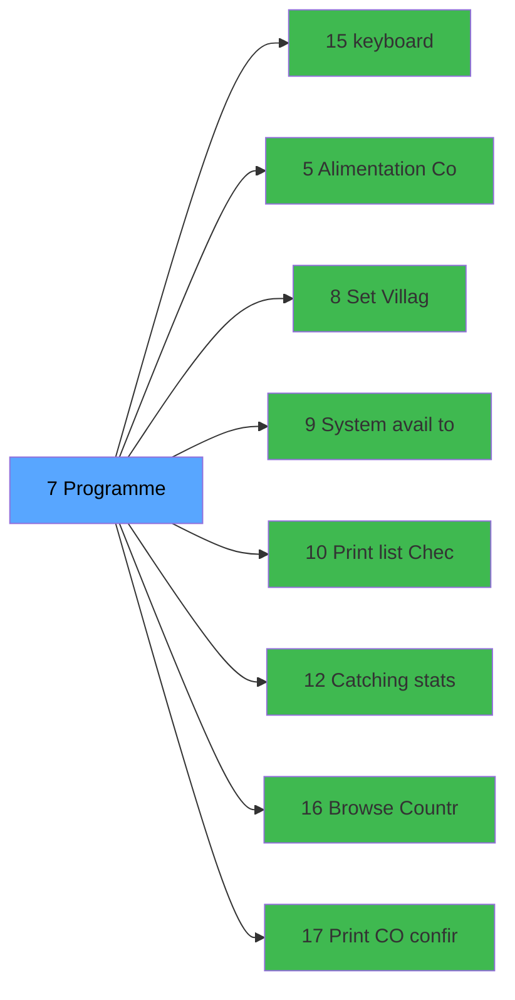

# ADH IDE 7 - Menu Data Catching

> **Version spec**: 3.5
> **Analyse**: 2026-01-27 17:56
> **Source**: `Prg_XXX.xml`

---

<!-- TAB:Fonctionnel -->

## SPECIFICATION FONCTIONNELLE

### 1.1 Objectif metier

| Element | Description |
|---------|-------------|
| **Qui** | Operateur |
| **Quoi** | Menu Data Catching
 |
| **Pourquoi** | A documenter |
| **Declencheur** | A identifier |

### 1.2 Regles metier

| Code | Regle | Condition |
|------|-------|-----------|
| RM-001 | A documenter | - |

### 1.3 Flux utilisateur

1. Demarrage programme
2. Traitement principal
3. Fin programme

### 1.4 Cas d'erreur

| Erreur | Comportement |
|--------|--------------|
| - | A documenter |

---

<!-- TAB:Technique -->

## SPECIFICATION TECHNIQUE

### 2.1 Identification

| Attribut | Valeur |
|----------|--------|
| **Format IDE** | ADH IDE 7 |
| **Description** | Menu Data Catching
 |
| **Module** | ADH |

### 2.2 Tables

| # | Nom physique | Acces | Usage |
|---|--------------|-------|-------|
| #22 | `Table_22` | R | 3x |
| #22 | `Table_22` | **W** | 2x |
| #30 | `Table_30` | LINK | 2x |
| #30 | `Table_30` | R | 2x |
| #31 | `Table_31` | LINK | 2x |
| #31 | `Table_31` | R | 4x |
| #34 | `Table_34` | LINK | 3x |
| #40 | `Table_40` | LINK | 1x |
| #40 | `Table_40` | R | 1x |
| #47 | `Table_47` | LINK | 1x |
| #47 | `Table_47` | R | 3x |
| #47 | `Table_47` | **W** | 1x |
| #312 | `Table_312` | **W** | 1x |
| #780 | `Table_780` | R | 1x |
| #781 | `Table_781` | LINK | 1x |
| #783 | `Table_783` | LINK | 3x |
| #783 | `Table_783` | R | 1x |
| #783 | `Table_783` | **W** | 2x |
| #784 | `Table_784` | LINK | 2x |
| #785 | `Table_785` | LINK | 4x |
| #785 | `Table_785` | **W** | 1x |
| #786 | `Table_786` | R | 1x |
### 2.3 Parametres d'entree

### 2.4 Algorigramme

### 2.5 Expressions cles

### 2.6 Variables importantes

### 2.7 Statistiques

---

<!-- TAB:Cartographie -->

## CARTOGRAPHIE APPLICATIVE

### 3.1 Chaine d'appels depuis Main

### 3.2 Callers directs

| IDE | Programme | Nb appels |
|-----|-----------|-----------|
| - | **Aucun caller** (point d'entree ou orphelin) | - |
### 3.3 Callees

| Niv | IDE | Programme | Nb appels |
|-----|-----|-----------|-----------|
| 1 | 15 | keyboard | 6 |
| 1 | 5 | Alimentation Combos NATION P | 1 |
| 1 | 8 |      Set Village info | 1 |
| 1 | 9 | System avail (top left corner | 1 |
| 1 | 10 | Print list Checkout (shift F9) | 1 |
| 1 | 12 | Catching stats | 1 |
| 1 | 16 | Browse - Countries iso | 1 |
| 1 | 17 | Print C/O confirmation | 1 |
| 1 | 18 | Print extrait compte | 1 |
### 3.4 Verification orphelin

| Critere | Resultat |
|---------|----------|
| Callers actifs | A verifier |
| **Conclusion** | A analyser |

---

## HISTORIQUE

| Date | Action | Auteur |
|------|--------|--------|
| 2026-01-27 19:43 | **DATA POPULATED** - Tables, Callgraph (5 expr) | Script |
| 2026-01-27 17:56 | **Upgrade V3.5** - TAB markers, Mermaid | Claude |

---

*Specification V3.5 - Format avec TAB markers et Mermaid*
