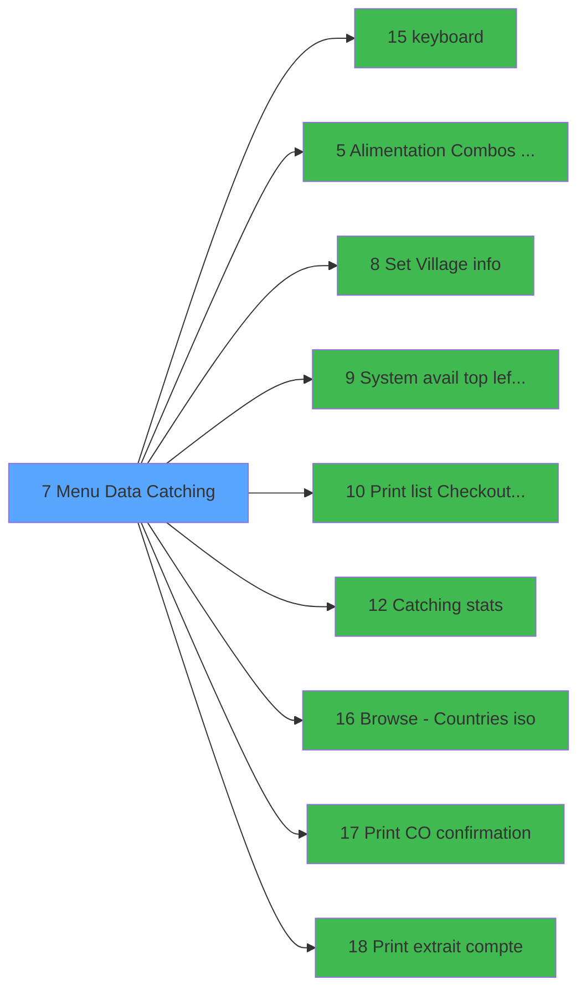

# ADH IDE 7 - Menu Data Catching

> **Analyse**: Phases 1-4 2026-02-07 03:38 -> 03:39 (28s) | Assemblage 12:46
> **Pipeline**: V7.2 Enrichi
> **Structure**: 4 onglets (Resume | Ecrans | Donnees | Connexions)

<!-- TAB:Resume -->

## 1. FICHE D'IDENTITE

| Attribut | Valeur |
|----------|--------|
| Projet | ADH |
| IDE Position | 7 |
| Nom Programme | Menu Data Catching |
| Fichier source | `Prg_7.xml` |
| Dossier IDE | Navigation |
| Taches | 33 (15 ecrans visibles) |
| Tables modifiees | 5 |
| Programmes appeles | 9 |
| Complexite | **MOYENNE** (score 43/100) |
| <span style="color:red">Statut</span> | <span style="color:red">**ORPHELIN_POTENTIEL**</span> |

## 2. DESCRIPTION FONCTIONNELLE

# Menu Data Catching - ADH IDE 7

Point d'entrée principal pour la saisie et gestion des données de catching (enregistrement des clients). Ce menu centralise toutes les opérations critiques liées aux informations de séjour : authentification par clavier, paramétrisation de la zone géographique et des offres combinées, définition des informations du village, consultation de la disponibilité système et génération des documents comptables (confirmations checkout, extraits de compte).

Le programme gère six tables majeures pour persister l'état de la saisie : les données brutes de catching (`address_data_catching`), les comptes clients (`compte_gm________cgm`), les cartes de paiement (`ez_card`), les hôtels virtuels (`vrl_hp`) et l'effectif quotidien. Cela en fait un hub de données transactionnel où chaque action impacte potentiellement plusieurs entités en aval.

Les tâches associées couvrent l'expérience utilisateur multilingue (accueil en anglais, mise à jour des labels menu et langue) et l'ergonomie de navigation (scroll sur les noms de clients, compteur d'enregistrements, affichage des données personnelles en anglais). L'architecture en étoile (9 appels de programmes liés) suggère une forte dépendance aux microfonctions de validation, impression et interrogation d'état système.

## 3. BLOCS FONCTIONNELS

### 3.1 Traitement (30 taches)

Traitements internes.

---

#### <a id="t1"></a>T1 - (sans nom) [ECRAN]

**Role** : Tache d'orchestration : point d'entree du programme (30 sous-taches). Coordonne l'enchainement des traitements.
**Ecran** : 815 x 431 DLU (MDI) | [Voir mockup](#ecran-t1)

<details>
<summary>29 sous-taches directes</summary>

| Tache | Nom | Bloc |
|-------|-----|------|
| [T2](#t2) | welcome ENG **[ECRAN]** | Traitement |
| [T3](#t3) | update menu | Traitement |
| [T4](#t4) | update language | Traitement |
| [T5](#t5) | Scroll sur noms **[ECRAN]** | Traitement |
| [T6](#t6) | Counter **[ECRAN]** | Traitement |
| [T7](#t7) | personal info ENG **[ECRAN]** | Traitement |
| [T8](#t8) | Loading **[ECRAN]** | Traitement |
| [T9](#t9) | Loading **[ECRAN]** | Traitement |
| [T10](#t10) | info ENG **[ECRAN]** | Traitement |
| [T11](#t11) | copy | Traitement |
| [T12](#t12) | Loading **[ECRAN]** | Traitement |
| [T13](#t13) | Loading ENG **[ECRAN]** | Traitement |
| [T14](#t14) | Update **[ECRAN]** | Traitement |
| [T17](#t17) | Loading **[ECRAN]** | Traitement |
| [T18](#t18) | Loading **[ECRAN]** | Traitement |
| [T19](#t19) | info ENG **[ECRAN]** | Traitement |
| [T20](#t20) | Del liste addr tmp | Traitement |
| [T21](#t21) | Check out ENG **[ECRAN]** | Traitement |
| [T22](#t22) | 0 Account review ENG **[ECRAN]** | Traitement |
| [T23](#t23) | detail ENG **[ECRAN]** | Traitement |
| [T24](#t24) | (sans nom) | Traitement |
| [T25](#t25) | compute tab chain **[ECRAN]** | Traitement |
| [T26](#t26) | 1 Check out ENG **[ECRAN]** | Traitement |
| [T27](#t27) | Accept/decline ENG **[ECRAN]** | Traitement |
| [T29](#t29) | change account satus | Traitement |
| [T30](#t30) | cancel clubmed pass | Traitement |
| [T31](#t31) | Update log | Traitement |
| [T32](#t32) | Thank you ENG **[ECRAN]** | Traitement |
| [T33](#t33) | 4 Log Out | Traitement |

</details>

---

#### <a id="t2"></a>T2 - welcome ENG [ECRAN]

**Role** : Traitement : welcome ENG.
**Ecran** : 812 x 398 DLU (MDI) | [Voir mockup](#ecran-t2)

---

#### <a id="t3"></a>T3 - update menu

**Role** : Traitement : update menu.
**Variables liees** : R (v.menu)

---

#### <a id="t4"></a>T4 - update language

**Role** : Traitement : update language.
**Variables liees** : S (v.language)

---

#### <a id="t5"></a>T5 - Scroll sur noms [ECRAN]

**Role** : Traitement : Scroll sur noms.
**Ecran** : 1616 x 390 DLU (MDI) | [Voir mockup](#ecran-t5)

---

#### <a id="t6"></a>T6 - Counter [ECRAN]

**Role** : Traitement : Counter.
**Ecran** : 373 x 86 DLU (MDI) | [Voir mockup](#ecran-t6)
**Variables liees** : P (v.bypass counter), Q (v.counter rec)

---

#### <a id="t7"></a>T7 - personal info ENG [ECRAN]

**Role** : Traitement : personal info ENG.
**Ecran** : 809 x 388 DLU (Modal) | [Voir mockup](#ecran-t7)

---

#### <a id="t8"></a>T8 - Loading [ECRAN]

**Role** : Traitement : Loading.
**Ecran** : 366 x 93 DLU (MDI) | [Voir mockup](#ecran-t8)

---

#### <a id="t9"></a>T9 - Loading [ECRAN]

**Role** : Traitement : Loading.
**Ecran** : 366 x 93 DLU (MDI) | [Voir mockup](#ecran-t9)

---

#### <a id="t10"></a>T10 - info ENG [ECRAN]

**Role** : Traitement : info ENG.
**Ecran** : 805 x 340 DLU (Modal) | [Voir mockup](#ecran-t10)

---

#### <a id="t11"></a>T11 - copy

**Role** : Traitement : copy.

---

#### <a id="t12"></a>T12 - Loading [ECRAN]

**Role** : Traitement : Loading.
**Ecran** : 366 x 100 DLU (MDI) | [Voir mockup](#ecran-t12)

---

#### <a id="t13"></a>T13 - Loading ENG [ECRAN]

**Role** : Traitement : Loading ENG.
**Ecran** : 364 x 88 DLU (MDI) | [Voir mockup](#ecran-t13)

---

#### <a id="t14"></a>T14 - Update [ECRAN]

**Role** : Traitement : Update.
**Ecran** : 364 x 88 DLU (MDI) | [Voir mockup](#ecran-t14)

---

#### <a id="t17"></a>T17 - Loading [ECRAN]

**Role** : Traitement : Loading.
**Ecran** : 366 x 93 DLU (MDI) | [Voir mockup](#ecran-t17)

---

#### <a id="t18"></a>T18 - Loading [ECRAN]

**Role** : Traitement : Loading.
**Ecran** : 366 x 93 DLU (MDI) | [Voir mockup](#ecran-t18)

---

#### <a id="t19"></a>T19 - info ENG [ECRAN]

**Role** : Traitement : info ENG.
**Ecran** : 334 x 116 DLU (MDI) | [Voir mockup](#ecran-t19)

---

#### <a id="t20"></a>T20 - Del liste addr tmp

**Role** : Traitement : Del liste addr tmp.

---

#### <a id="t21"></a>T21 - Check out ENG [ECRAN]

**Role** : Traitement : Check out ENG.
**Ecran** : 809 x 340 DLU (Modal) | [Voir mockup](#ecran-t21)
**Variables liees** : F (v.access to check out ok)

---

#### <a id="t22"></a>T22 - 0 Account review ENG [ECRAN]

**Role** : Traitement : 0 Account review ENG.
**Ecran** : 807 x 290 DLU (Modal) | [Voir mockup](#ecran-t22)
**Variables liees** : B (v.account GM last)

---

#### <a id="t23"></a>T23 - detail ENG [ECRAN]

**Role** : Traitement : detail ENG.
**Ecran** : 1589 x 235 DLU (Modal) | [Voir mockup](#ecran-t23)

---

#### <a id="t24"></a>T24 - (sans nom)

**Role** : Traitement interne.

---

#### <a id="t25"></a>T25 - compute tab chain [ECRAN]

**Role** : Traitement : compute tab chain.
**Ecran** : 626 x 252 DLU (MDI) | [Voir mockup](#ecran-t25)

---

#### <a id="t26"></a>T26 - 1 Check out ENG [ECRAN]

**Role** : Traitement : 1 Check out ENG.
**Ecran** : 806 x 293 DLU (Modal) | [Voir mockup](#ecran-t26)
**Variables liees** : F (v.access to check out ok)

---

#### <a id="t27"></a>T27 - Accept/decline ENG [ECRAN]

**Role** : Traitement : Accept/decline ENG.
**Ecran** : 526 x 174 DLU (MDI) | [Voir mockup](#ecran-t27)

---

#### <a id="t29"></a>T29 - change account satus

**Role** : Traitement : change account satus.
**Variables liees** : B (v.account GM last)

---

#### <a id="t30"></a>T30 - cancel clubmed pass

**Role** : Traitement : cancel clubmed pass.
**Variables liees** : P (v.bypass counter)

---

#### <a id="t31"></a>T31 - Update log

**Role** : Traitement : Update log.

---

#### <a id="t32"></a>T32 - Thank you ENG [ECRAN]

**Role** : Traitement : Thank you ENG.
**Ecran** : 807 x 293 DLU (Modal) | [Voir mockup](#ecran-t32)

---

#### <a id="t33"></a>T33 - 4 Log Out

**Role** : Traitement : 4 Log Out.


### 3.2 Impression (2 taches)

Generation des documents et tickets.

---

#### <a id="t15"></a>T15 - Print [ECRAN]

**Role** : Generation du document : Print.
**Ecran** : 417 x 112 DLU (MDI) | [Voir mockup](#ecran-t15)
**Delegue a** : [Print list Checkout (shift F9) (IDE 10)](ADH-IDE-10.md), [Print C/O confirmation (IDE 17)](ADH-IDE-17.md), [Print extrait compte (IDE 18)](ADH-IDE-18.md)

---

#### <a id="t16"></a>T16 - Print [ECRAN]

**Role** : Generation du document : Print.
**Ecran** : 306 x 89 DLU (MDI) | [Voir mockup](#ecran-t16)
**Delegue a** : [Print list Checkout (shift F9) (IDE 10)](ADH-IDE-10.md), [Print C/O confirmation (IDE 17)](ADH-IDE-17.md), [Print extrait compte (IDE 18)](ADH-IDE-18.md)


### 3.3 Validation (1 tache)

Controles de coherence : 1 tache verifie les donnees et conditions.

---

#### <a id="t28"></a>T28 - Valid check out

**Role** : Verification : Valid check out.
**Variables liees** : F (v.access to check out ok)


## 5. REGLES METIER

*(Programme d'impression - logique technique sans conditions metier)*

## 6. CONTEXTE

- **Appele par**: (aucun)
- **Appelle**: 9 programmes | **Tables**: 13 (W:5 R:8 L:9) | **Taches**: 33 | **Expressions**: 5

<!-- TAB:Ecrans -->

## 8. ECRANS

### 8.1 Forms visibles (15 / 33)

| # | Position | Tache | Nom | Type | Largeur | Hauteur | Bloc |
|---|----------|-------|-----|------|---------|---------|------|
| 1 | 7.1 | T2 | welcome ENG | MDI | 812 | 398 | Traitement |
| 2 | 7.1.3 | T5 | Scroll sur noms | MDI | 1616 | 390 | Traitement |
| 3 | 7.1.4 | T6 | Counter | MDI | 373 | 86 | Traitement |
| 4 | 7.1.5 | T7 | personal info ENG | Modal | 809 | 388 | Traitement |
| 5 | 7.1.5.3 | T10 | info ENG | Modal | 805 | 340 | Traitement |
| 6 | 7.1.5.4 | T13 | Loading ENG | MDI | 364 | 88 | Traitement |
| 7 | 7.1.5.5 | T14 | Update | MDI | 364 | 88 | Traitement |
| 8 | 7.1.6 | T15 | Print | MDI | 417 | 112 | Impression |
| 9 | 7.1.6.1 | T16 | Print | MDI | 306 | 89 | Impression |
| 10 | 7.1.7 | T21 | Check out ENG | Modal | 809 | 340 | Traitement |
| 11 | 7.1.7.1 | T22 | 0 Account review ENG | Modal | 807 | 290 | Traitement |
| 12 | 7.1.7.1.1 | T23 | detail ENG | Modal | 1589 | 235 | Traitement |
| 13 | 7.1.7.2 | T26 | 1 Check out ENG | Modal | 806 | 293 | Traitement |
| 14 | 7.1.7.2.1 | T27 | Accept/decline ENG | MDI | 526 | 174 | Traitement |
| 15 | 7.1.7.3 | T32 | Thank you ENG | Modal | 807 | 293 | Traitement |

### 8.2 Mockups Ecrans

---

#### <a id="ecran-t2"></a>7.1 - welcome ENG
**Tache** : [T2](#t2) | **Type** : MDI | **Dimensions** : 812 x 398 DLU
**Bloc** : Traitement | **Titre IDE** : welcome ENG

<!-- FORM-DATA:
{
    "width":  812,
    "vFactor":  8,
    "type":  "MDI",
    "hFactor":  4,
    "controls":  [
                     {
                         "x":  360,
                         "type":  "label",
                         "var":  "",
                         "y":  8,
                         "w":  24,
                         "fmt":  "",
                         "name":  "",
                         "h":  16,
                         "color":  "205",
                         "text":  "ó",
                         "parent":  null
                     },
                     {
                         "x":  28,
                         "type":  "label",
                         "var":  "",
                         "y":  71,
                         "w":  748,
                         "fmt":  "",
                         "name":  "",
                         "h":  269,
                         "color":  "201",
                         "text":  "Welcome to the Data Catching Center",
                         "parent":  null
                     },
                     {
                         "x":  4,
                         "type":  "edit",
                         "var":  "",
                         "y":  0,
                         "w":  4,
                         "fmt":  "",
                         "name":  "v.societe",
                         "h":  3,
                         "color":  "",
                         "text":  "",
                         "parent":  null
                     },
                     {
                         "x":  156,
                         "type":  "edit",
                         "var":  "",
                         "y":  8,
                         "w":  200,
                         "fmt":  "",
                         "name":  "",
                         "h":  16,
                         "color":  "205",
                         "text":  "",
                         "parent":  null
                     },
                     {
                         "x":  8,
                         "type":  "button",
                         "var":  "",
                         "y":  5,
                         "w":  140,
                         "fmt":  "Guest List",
                         "name":  "1",
                         "h":  21,
                         "color":  "",
                         "text":  "",
                         "parent":  null
                     },
                     {
                         "x":  392,
                         "type":  "button",
                         "var":  "",
                         "y":  5,
                         "w":  140,
                         "fmt":  "Guest Information",
                         "name":  "2",
                         "h":  21,
                         "color":  "",
                         "text":  "",
                         "parent":  null
                     },
                     {
                         "x":  528,
                         "type":  "button",
                         "var":  "",
                         "y":  5,
                         "w":  140,
                         "fmt":  "Guest Account",
                         "name":  "3",
                         "h":  21,
                         "color":  "",
                         "text":  "",
                         "parent":  null
                     },
                     {
                         "x":  668,
                         "type":  "button",
                         "var":  "",
                         "y":  5,
                         "w":  140,
                         "fmt":  "Log Out",
                         "name":  "9",
                         "h":  21,
                         "color":  "",
                         "text":  "",
                         "parent":  null
                     }
                 ],
    "taskId":  "7.1",
    "height":  398
}
-->

<details>
<summary><strong>Champs : 2 champs</strong></summary>

| Pos (x,y) | Nom | Variable | Type |
|-----------|-----|----------|------|
| 4,0 | v.societe | - | edit |
| 156,8 | (sans nom) | - | edit |

</details>

<details>
<summary><strong>Boutons : 4 boutons</strong></summary>

| Bouton | Pos (x,y) | Action |
|--------|-----------|--------|
| Guest List | 8,5 | Bouton fonctionnel |
| Guest Information | 392,5 | Bouton fonctionnel |
| Guest Account | 528,5 | Bouton fonctionnel |
| Log Out | 668,5 | Bouton fonctionnel |

</details>

---

#### <a id="ecran-t5"></a>7.1.3 - Scroll sur noms
**Tache** : [T5](#t5) | **Type** : MDI | **Dimensions** : 1616 x 390 DLU
**Bloc** : Traitement | **Titre IDE** : Scroll sur noms

<!-- FORM-DATA:
{
    "width":  1616,
    "vFactor":  8,
    "type":  "MDI",
    "hFactor":  8,
    "controls":  [
                     {
                         "x":  8,
                         "type":  "label",
                         "var":  "",
                         "y":  2,
                         "w":  1601,
                         "fmt":  "",
                         "name":  "",
                         "h":  35,
                         "color":  "200",
                         "text":  "",
                         "parent":  null
                     },
                     {
                         "x":  1232,
                         "type":  "label",
                         "var":  "",
                         "y":  48,
                         "w":  245,
                         "fmt":  "",
                         "name":  "",
                         "h":  19,
                         "color":  "200",
                         "text":  "",
                         "parent":  null
                     },
                     {
                         "x":  65,
                         "type":  "label",
                         "var":  "",
                         "y":  53,
                         "w":  52,
                         "fmt":  "",
                         "name":  "",
                         "h":  12,
                         "color":  "201",
                         "text":  "Title",
                         "parent":  null
                     },
                     {
                         "x":  124,
                         "type":  "label",
                         "var":  "",
                         "y":  53,
                         "w":  260,
                         "fmt":  "",
                         "name":  "",
                         "h":  12,
                         "color":  "201",
                         "text":  "Last name",
                         "parent":  null
                     },
                     {
                         "x":  465,
                         "type":  "label",
                         "var":  "",
                         "y":  53,
                         "w":  146,
                         "fmt":  "",
                         "name":  "",
                         "h":  12,
                         "color":  "201",
                         "text":  "FIrst name",
                         "parent":  null
                     },
                     {
                         "x":  717,
                         "type":  "label",
                         "var":  "",
                         "y":  53,
                         "w":  106,
                         "fmt":  "",
                         "name":  "",
                         "h":  12,
                         "color":  "201",
                         "text":  "Room #",
                         "parent":  null
                     },
                     {
                         "x":  846,
                         "type":  "label",
                         "var":  "",
                         "y":  53,
                         "w":  71,
                         "fmt":  "",
                         "name":  "",
                         "h":  12,
                         "color":  "201",
                         "text":  "Type",
                         "parent":  null
                     },
                     {
                         "x":  943,
                         "type":  "label",
                         "var":  "",
                         "y":  53,
                         "w":  126,
                         "fmt":  "",
                         "name":  "",
                         "h":  12,
                         "color":  "201",
                         "text":  "Adherent #",
                         "parent":  null
                     },
                     {
                         "x":  1099,
                         "type":  "label",
                         "var":  "",
                         "y":  53,
                         "w":  98,
                         "fmt":  "",
                         "name":  "",
                         "h":  12,
                         "color":  "201",
                         "text":  "File #",
                         "parent":  null
                     },
                     {
                         "x":  19,
                         "type":  "label",
                         "var":  "",
                         "y":  263,
                         "w":  103,
                         "fmt":  "",
                         "name":  "",
                         "h":  12,
                         "color":  "201",
                         "text":  "Filters",
                         "parent":  null
                     },
                     {
                         "x":  608,
                         "type":  "label",
                         "var":  "",
                         "y":  263,
                         "w":  207,
                         "fmt":  "",
                         "name":  "",
                         "h":  12,
                         "color":  "201",
                         "text":  "Police Forms",
                         "parent":  null
                     },
                     {
                         "x":  33,
                         "type":  "line",
                         "var":  "",
                         "y":  310,
                         "w":  509,
                         "fmt":  "",
                         "name":  "",
                         "h":  0,
                         "color":  "6",
                         "text":  "",
                         "parent":  null
                     },
                     {
                         "x":  21,
                         "type":  "label",
                         "var":  "",
                         "y":  13,
                         "w":  187,
                         "fmt":  "",
                         "name":  "",
                         "h":  14,
                         "color":  "205",
                         "text":  "Guest List",
                         "parent":  1
                     },
                     {
                         "x":  1253,
                         "type":  "label",
                         "var":  "",
                         "y":  53,
                         "w":  91,
                         "fmt":  "",
                         "name":  "",
                         "h":  12,
                         "color":  "205",
                         "text":  "Arrival",
                         "parent":  null
                     },
                     {
                         "x":  1359,
                         "type":  "label",
                         "var":  "",
                         "y":  53,
                         "w":  101,
                         "fmt":  "",
                         "name":  "",
                         "h":  12,
                         "color":  "205",
                         "text":  "Departure",
                         "parent":  null
                     },
                     {
                         "x":  28,
                         "type":  "table",
                         "var":  "",
                         "name":  "",
                         "titleH":  12,
                         "color":  "205",
                         "w":  1560,
                         "y":  67,
                         "fmt":  "",
                         "parent":  null,
                         "text":  "",
                         "rowH":  21,
                         "h":  189,
                         "cols":  [
                                      {
                                          "title":  "",
                                          "layer":  1,
                                          "w":  1202
                                      },
                                      {
                                          "title":  "",
                                          "layer":  2,
                                          "w":  243
                                      },
                                      {
                                          "title":  "",
                                          "layer":  3,
                                          "w":  82
                                      }
                                  ],
                         "rows":  3
                     },
                     {
                         "x":  31,
                         "type":  "label",
                         "var":  "",
                         "y":  67,
                         "w":  1447,
                         "fmt":  "",
                         "name":  "",
                         "h":  21,
                         "color":  "204",
                         "text":  "",
                         "parent":  17
                     },
                     {
                         "x":  38,
                         "type":  "label",
                         "var":  "",
                         "y":  69,
                         "w":  25,
                         "fmt":  "",
                         "name":  "",
                         "h":  14,
                         "color":  "206",
                         "text":  "F",
                         "parent":  17
                     },
                     {
                         "x":  1499,
                         "type":  "label",
                         "var":  "",
                         "y":  70,
                         "w":  18,
                         "fmt":  "",
                         "name":  "",
                         "h":  16,
                         "color":  "145",
                         "text":  "$",
                         "parent":  17
                     },
                     {
                         "x":  33,
                         "type":  "label",
                         "var":  "",
                         "y":  280,
                         "w":  509,
                         "fmt":  "",
                         "name":  "",
                         "h":  104,
                         "color":  "6",
                         "text":  "",
                         "parent":  null
                     },
                     {
                         "x":  221,
                         "type":  "label",
                         "var":  "",
                         "y":  286,
                         "w":  18,
                         "fmt":  "",
                         "name":  "",
                         "h":  8,
                         "color":  "114",
                         "text":  "*",
                         "parent":  34
                     },
                     {
                         "x":  362,
                         "type":  "label",
                         "var":  "",
                         "y":  286,
                         "w":  18,
                         "fmt":  "",
                         "name":  "",
                         "h":  8,
                         "color":  "114",
                         "text":  "*",
                         "parent":  34
                     },
                     {
                         "x":  514,
                         "type":  "label",
                         "var":  "",
                         "y":  286,
                         "w":  18,
                         "fmt":  "",
                         "name":  "",
                         "h":  8,
                         "color":  "114",
                         "text":  "*",
                         "parent":  34
                     },
                     {
                         "x":  54,
                         "type":  "label",
                         "var":  "",
                         "y":  344,
                         "w":  212,
                         "fmt":  "",
                         "name":  "",
                         "h":  15,
                         "color":  "201",
                         "text":  "Arrival date from",
                         "parent":  34
                     },
                     {
                         "x":  54,
                         "type":  "label",
                         "var":  "",
                         "y":  362,
                         "w":  212,
                         "fmt":  "",
                         "name":  "",
                         "h":  15,
                         "color":  "201",
                         "text":  "Arrival date to",
                         "parent":  34
                     },
                     {
                         "x":  622,
                         "type":  "label",
                         "var":  "",
                         "y":  280,
                         "w":  778,
                         "fmt":  "",
                         "name":  "",
                         "h":  104,
                         "color":  "6",
                         "text":  "",
                         "parent":  null
                     },
                     {
                         "x":  1232,
                         "type":  "label",
                         "var":  "",
                         "y":  236,
                         "w":  245,
                         "fmt":  "",
                         "name":  "",
                         "h":  19,
                         "color":  "200",
                         "text":  "",
                         "parent":  null
                     },
                     {
                         "x":  132,
                         "type":  "edit",
                         "var":  "",
                         "y":  70,
                         "w":  331,
                         "fmt":  "",
                         "name":  "GMR nom (30)",
                         "h":  10,
                         "color":  "110",
                         "text":  "",
                         "parent":  17
                     },
                     {
                         "x":  954,
                         "type":  "edit",
                         "var":  "",
                         "y":  70,
                         "w":  128,
                         "fmt":  "",
                         "name":  "GMR num. club",
                         "h":  10,
                         "color":  "110",
                         "text":  "",
                         "parent":  17
                     },
                     {
                         "x":  1262,
                         "type":  "edit",
                         "var":  "",
                         "y":  70,
                         "w":  88,
                         "fmt":  "DD/MMM",
                         "name":  "",
                         "h":  10,
                         "color":  "110",
                         "text":  "",
                         "parent":  17
                     },
                     {
                         "x":  1371,
                         "type":  "edit",
                         "var":  "",
                         "y":  70,
                         "w":  88,
                         "fmt":  "DD/MMM",
                         "name":  "",
                         "h":  10,
                         "color":  "110",
                         "text":  "",
                         "parent":  17
                     },
                     {
                         "x":  479,
                         "type":  "edit",
                         "var":  "",
                         "y":  70,
                         "w":  232,
                         "fmt":  "",
                         "name":  "",
                         "h":  10,
                         "color":  "110",
                         "text":  "",
                         "parent":  17
                     },
                     {
                         "x":  1111,
                         "type":  "edit",
                         "var":  "",
                         "y":  70,
                         "w":  114,
                         "fmt":  "",
                         "name":  "",
                         "h":  10,
                         "color":  "110",
                         "text":  "",
                         "parent":  17
                     },
                     {
                         "x":  731,
                         "type":  "edit",
                         "var":  "",
                         "y":  70,
                         "w":  80,
                         "fmt":  "",
                         "name":  "",
                         "h":  10,
                         "color":  "110",
                         "text":  "",
                         "parent":  17
                     },
                     {
                         "x":  853,
                         "type":  "edit",
                         "var":  "",
                         "y":  70,
                         "w":  64,
                         "fmt":  "",
                         "name":  "",
                         "h":  10,
                         "color":  "110",
                         "text":  "",
                         "parent":  17
                     },
                     {
                         "x":  282,
                         "type":  "edit",
                         "var":  "",
                         "y":  344,
                         "w":  139,
                         "fmt":  "",
                         "name":  "v.f.date from",
                         "h":  15,
                         "color":  "110",
                         "text":  "",
                         "parent":  34
                     },
                     {
                         "x":  282,
                         "type":  "edit",
                         "var":  "",
                         "y":  362,
                         "w":  139,
                         "fmt":  "",
                         "name":  "v.f.date to",
                         "h":  15,
                         "color":  "110",
                         "text":  "",
                         "parent":  34
                     },
                     {
                         "x":  48,
                         "type":  "button",
                         "var":  "",
                         "y":  317,
                         "w":  114,
                         "fmt":  "Clear",
                         "name":  "BTN CLEAR",
                         "h":  17,
                         "color":  "",
                         "text":  "",
                         "parent":  null
                     },
                     {
                         "x":  163,
                         "type":  "button",
                         "var":  "",
                         "y":  317,
                         "w":  114,
                         "fmt":  "Today",
                         "name":  "BTN TODAY",
                         "h":  17,
                         "color":  "",
                         "text":  "",
                         "parent":  null
                     },
                     {
                         "x":  278,
                         "type":  "button",
                         "var":  "",
                         "y":  317,
                         "w":  114,
                         "fmt":  "Tomorrow",
                         "name":  "BTN TOMORROW",
                         "h":  17,
                         "color":  "",
                         "text":  "",
                         "parent":  null
                     },
                     {
                         "x":  81,
                         "type":  "edit",
                         "var":  "",
                         "y":  70,
                         "w":  31,
                         "fmt":  "2",
                         "name":  "",
                         "h":  10,
                         "color":  "110",
                         "text":  "",
                         "parent":  17
                     },
                     {
                         "x":  1525,
                         "type":  "image",
                         "var":  "",
                         "y":  74,
                         "w":  26,
                         "fmt":  "",
                         "name":  "",
                         "h":  9,
                         "color":  "202",
                         "text":  "",
                         "parent":  17
                     },
                     {
                         "x":  1388,
                         "type":  "edit",
                         "var":  "",
                         "y":  258,
                         "w":  194,
                         "fmt":  "5 records",
                         "name":  "",
                         "h":  12,
                         "color":  "203",
                         "text":  "",
                         "parent":  null
                     },
                     {
                         "x":  49,
                         "type":  "button",
                         "var":  "",
                         "y":  285,
                         "w":  171,
                         "fmt":  "Exclude Groups",
                         "name":  "F2",
                         "h":  18,
                         "color":  "110",
                         "text":  "",
                         "parent":  null
                     },
                     {
                         "x":  287,
                         "type":  "button",
                         "var":  "",
                         "y":  285,
                         "w":  69,
                         "fmt":  "Qualite",
                         "name":  "F3",
                         "h":  18,
                         "color":  "110",
                         "text":  "",
                         "parent":  null
                     },
                     {
                         "x":  393,
                         "type":  "button",
                         "var":  "",
                         "y":  285,
                         "w":  120,
                         "fmt":  "Filliations",
                         "name":  "F1",
                         "h":  18,
                         "color":  "110",
                         "text":  "",
                         "parent":  null
                     },
                     {
                         "x":  678,
                         "type":  "button",
                         "var":  "",
                         "y":  290,
                         "w":  667,
                         "fmt":  "Print police form",
                         "name":  "P1",
                         "h":  18,
                         "color":  "110",
                         "text":  "",
                         "parent":  null
                     },
                     {
                         "x":  396,
                         "type":  "button",
                         "var":  "",
                         "y":  317,
                         "w":  131,
                         "fmt":  "Refresh",
                         "name":  "R",
                         "h":  18,
                         "color":  "110",
                         "text":  "",
                         "parent":  null
                     },
                     {
                         "x":  678,
                         "type":  "button",
                         "var":  "",
                         "y":  321,
                         "w":  667,
                         "fmt":  "Print police form",
                         "name":  "P2",
                         "h":  18,
                         "color":  "110",
                         "text":  "",
                         "parent":  null
                     },
                     {
                         "x":  420,
                         "type":  "button",
                         "var":  "",
                         "y":  343,
                         "w":  48,
                         "fmt":  "\u003e",
                         "name":  "",
                         "h":  16,
                         "color":  "",
                         "text":  "",
                         "parent":  null
                     },
                     {
                         "x":  678,
                         "type":  "button",
                         "var":  "",
                         "y":  352,
                         "w":  667,
                         "fmt":  "Print police form",
                         "name":  "P3",
                         "h":  18,
                         "color":  "110",
                         "text":  "",
                         "parent":  null
                     },
                     {
                         "x":  420,
                         "type":  "button",
                         "var":  "",
                         "y":  361,
                         "w":  48,
                         "fmt":  "\u003e",
                         "name":  "",
                         "h":  16,
                         "color":  "",
                         "text":  "",
                         "parent":  null
                     }
                 ],
    "taskId":  "7.1.3",
    "height":  390
}
-->

<details>
<summary><strong>Champs : 12 champs</strong></summary>

| Pos (x,y) | Nom | Variable | Type |
|-----------|-----|----------|------|
| 132,70 | GMR nom (30) | - | edit |
| 954,70 | GMR num. club | - | edit |
| 1262,70 | DD/MMM | - | edit |
| 1371,70 | DD/MMM | - | edit |
| 479,70 | (sans nom) | - | edit |
| 1111,70 | (sans nom) | - | edit |
| 731,70 | (sans nom) | - | edit |
| 853,70 | (sans nom) | - | edit |
| 282,344 | v.f.date from | - | edit |
| 282,362 | v.f.date to | - | edit |
| 81,70 | 2 | - | edit |
| 1388,258 | 5 records | - | edit |

</details>

<details>
<summary><strong>Boutons : 12 boutons</strong></summary>

| Bouton | Pos (x,y) | Action |
|--------|-----------|--------|
| Clear | 48,317 | Bouton fonctionnel |
| Today | 163,317 | Bouton fonctionnel |
| Tomorrow | 278,317 | Bouton fonctionnel |
| Exclude Groups | 49,285 | Bouton fonctionnel |
| Qualite | 287,285 | Bouton fonctionnel |
| Filliations | 393,285 | Bouton fonctionnel |
| Print police form | 678,290 | Appel [Print list Checkout (shift F9) (IDE 10)](ADH-IDE-10.md) |
| Refresh | 396,317 | Rafraichit l'affichage |
| Print police form | 678,321 | Appel [Print list Checkout (shift F9) (IDE 10)](ADH-IDE-10.md) |
| > | 420,343 | Bouton fonctionnel |
| Print police form | 678,352 | Appel [Print list Checkout (shift F9) (IDE 10)](ADH-IDE-10.md) |
| > | 420,361 | Bouton fonctionnel |

</details>

---

#### <a id="ecran-t6"></a>7.1.4 - Counter
**Tache** : [T6](#t6) | **Type** : MDI | **Dimensions** : 373 x 86 DLU
**Bloc** : Traitement | **Titre IDE** : Counter

<!-- FORM-DATA:
{
    "width":  373,
    "vFactor":  8,
    "type":  "MDI",
    "hFactor":  4,
    "controls":  [
                     {
                         "x":  99,
                         "type":  "label",
                         "var":  "",
                         "y":  20,
                         "w":  174,
                         "fmt":  "",
                         "name":  "",
                         "h":  46,
                         "color":  "208",
                         "text":  "The system is loading your information. Please wait...",
                         "parent":  null
                     }
                 ],
    "taskId":  "7.1.4",
    "height":  86
}
-->

---

#### <a id="ecran-t7"></a>7.1.5 - personal info ENG
**Tache** : [T7](#t7) | **Type** : Modal | **Dimensions** : 809 x 388 DLU
**Bloc** : Traitement | **Titre IDE** : personal info ENG

<!-- FORM-DATA:
{
    "width":  809,
    "vFactor":  8,
    "type":  "Modal",
    "hFactor":  4,
    "controls":  [
                     {
                         "x":  6,
                         "type":  "label",
                         "var":  "",
                         "y":  2,
                         "w":  801,
                         "fmt":  "",
                         "name":  "",
                         "h":  39,
                         "color":  "200",
                         "text":  "",
                         "parent":  null
                     },
                     {
                         "x":  125,
                         "type":  "label",
                         "var":  "",
                         "y":  5,
                         "w":  27,
                         "fmt":  "",
                         "name":  "",
                         "h":  31,
                         "color":  "205",
                         "text":  "4",
                         "parent":  1
                     },
                     {
                         "x":  266,
                         "type":  "label",
                         "var":  "",
                         "y":  5,
                         "w":  27,
                         "fmt":  "",
                         "name":  "",
                         "h":  31,
                         "color":  "205",
                         "text":  "4",
                         "parent":  1
                     },
                     {
                         "x":  157,
                         "type":  "label",
                         "var":  "",
                         "y":  9,
                         "w":  102,
                         "fmt":  "",
                         "name":  "",
                         "h":  25,
                         "color":  "205",
                         "text":  "Update the information",
                         "parent":  1
                     },
                     {
                         "x":  289,
                         "type":  "label",
                         "var":  "",
                         "y":  9,
                         "w":  102,
                         "fmt":  "",
                         "name":  "",
                         "h":  25,
                         "color":  "205",
                         "text":  "Confirm the update",
                         "parent":  1
                     },
                     {
                         "x":  23,
                         "type":  "label",
                         "var":  "",
                         "y":  14,
                         "w":  102,
                         "fmt":  "",
                         "name":  "",
                         "h":  14,
                         "color":  "205",
                         "text":  "Select guest",
                         "parent":  1
                     }
                 ],
    "taskId":  "7.1.5",
    "height":  388
}
-->

---

#### <a id="ecran-t10"></a>7.1.5.3 - info ENG
**Tache** : [T10](#t10) | **Type** : Modal | **Dimensions** : 805 x 340 DLU
**Bloc** : Traitement | **Titre IDE** : info ENG

<!-- FORM-DATA:
{
    "width":  805,
    "vFactor":  8,
    "type":  "Modal",
    "hFactor":  4,
    "controls":  [
                     {
                         "x":  6,
                         "type":  "label",
                         "var":  "",
                         "y":  12,
                         "w":  59,
                         "fmt":  "",
                         "name":  "",
                         "h":  13,
                         "color":  "201",
                         "text":  "Guests",
                         "parent":  null
                     },
                     {
                         "x":  389,
                         "type":  "label",
                         "var":  "",
                         "y":  12,
                         "w":  139,
                         "fmt":  "",
                         "name":  "",
                         "h":  13,
                         "color":  "201",
                         "text":  "Contact information",
                         "parent":  null
                     },
                     {
                         "x":  400,
                         "type":  "label",
                         "var":  "",
                         "y":  29,
                         "w":  396,
                         "fmt":  "",
                         "name":  "",
                         "h":  133,
                         "color":  "6",
                         "text":  "",
                         "parent":  null
                     },
                     {
                         "x":  404,
                         "type":  "label",
                         "var":  "",
                         "y":  39,
                         "w":  76,
                         "fmt":  "",
                         "name":  "",
                         "h":  11,
                         "color":  "205",
                         "text":  "Street number",
                         "parent":  null
                     },
                     {
                         "x":  404,
                         "type":  "label",
                         "var":  "",
                         "y":  56,
                         "w":  76,
                         "fmt":  "",
                         "name":  "",
                         "h":  11,
                         "color":  "205",
                         "text":  "Street",
                         "parent":  null
                     },
                     {
                         "x":  404,
                         "type":  "label",
                         "var":  "",
                         "y":  73,
                         "w":  76,
                         "fmt":  "",
                         "name":  "",
                         "h":  11,
                         "color":  "205",
                         "text":  "District",
                         "parent":  null
                     },
                     {
                         "x":  404,
                         "type":  "label",
                         "var":  "",
                         "y":  90,
                         "w":  76,
                         "fmt":  "",
                         "name":  "",
                         "h":  11,
                         "color":  "205",
                         "text":  "City",
                         "parent":  null
                     },
                     {
                         "x":  404,
                         "type":  "label",
                         "var":  "",
                         "y":  107,
                         "w":  76,
                         "fmt":  "",
                         "name":  "",
                         "h":  11,
                         "color":  "205",
                         "text":  "Zip code",
                         "parent":  null
                     },
                     {
                         "x":  404,
                         "type":  "label",
                         "var":  "",
                         "y":  124,
                         "w":  76,
                         "fmt":  "",
                         "name":  "",
                         "h":  11,
                         "color":  "205",
                         "text":  "State",
                         "parent":  null
                     },
                     {
                         "x":  404,
                         "type":  "label",
                         "var":  "",
                         "y":  141,
                         "w":  76,
                         "fmt":  "",
                         "name":  "",
                         "h":  11,
                         "color":  "205",
                         "text":  "Country",
                         "parent":  null
                     },
                     {
                         "x":  400,
                         "type":  "label",
                         "var":  "",
                         "y":  166,
                         "w":  396,
                         "fmt":  "",
                         "name":  "",
                         "h":  47,
                         "color":  "6",
                         "text":  "",
                         "parent":  null
                     },
                     {
                         "x":  405,
                         "type":  "label",
                         "var":  "",
                         "y":  177,
                         "w":  76,
                         "fmt":  "",
                         "name":  "",
                         "h":  11,
                         "color":  "205",
                         "text":  "Telephone",
                         "parent":  null
                     },
                     {
                         "x":  406,
                         "type":  "label",
                         "var":  "",
                         "y":  194,
                         "w":  77,
                         "fmt":  "",
                         "name":  "",
                         "h":  11,
                         "color":  "114",
                         "text":  "E-Mail address",
                         "parent":  null
                     },
                     {
                         "x":  16,
                         "type":  "label",
                         "var":  "",
                         "y":  203,
                         "w":  319,
                         "fmt":  "",
                         "name":  "",
                         "h":  25,
                         "color":  "6",
                         "text":  "",
                         "parent":  null
                     },
                     {
                         "x":  24,
                         "type":  "label",
                         "var":  "",
                         "y":  211,
                         "w":  64,
                         "fmt":  "",
                         "name":  "",
                         "h":  11,
                         "color":  "205",
                         "text":  "Profession",
                         "parent":  null
                     },
                     {
                         "x":  389,
                         "type":  "label",
                         "var":  "",
                         "y":  224,
                         "w":  139,
                         "fmt":  "",
                         "name":  "",
                         "h":  12,
                         "color":  "201",
                         "text":  "Identity",
                         "parent":  null
                     },
                     {
                         "x":  400,
                         "type":  "label",
                         "var":  "",
                         "y":  239,
                         "w":  396,
                         "fmt":  "",
                         "name":  "",
                         "h":  61,
                         "color":  "6",
                         "text":  "",
                         "parent":  null
                     },
                     {
                         "x":  7,
                         "type":  "label",
                         "var":  "",
                         "y":  244,
                         "w":  103,
                         "fmt":  "",
                         "name":  "",
                         "h":  12,
                         "color":  "201",
                         "text":  "Transportation",
                         "parent":  null
                     },
                     {
                         "x":  407,
                         "type":  "label",
                         "var":  "",
                         "y":  247,
                         "w":  76,
                         "fmt":  "",
                         "name":  "",
                         "h":  11,
                         "color":  "205",
                         "text":  "Birth date",
                         "parent":  null
                     },
                     {
                         "x":  16,
                         "type":  "label",
                         "var":  "",
                         "y":  259,
                         "w":  319,
                         "fmt":  "",
                         "name":  "",
                         "h":  41,
                         "color":  "6",
                         "text":  "",
                         "parent":  null
                     },
                     {
                         "x":  407,
                         "type":  "label",
                         "var":  "",
                         "y":  264,
                         "w":  76,
                         "fmt":  "",
                         "name":  "",
                         "h":  12,
                         "color":  "114",
                         "text":  "Nationality",
                         "parent":  null
                     },
                     {
                         "x":  24,
                         "type":  "label",
                         "var":  "",
                         "y":  266,
                         "w":  64,
                         "fmt":  "",
                         "name":  "",
                         "h":  11,
                         "color":  "205",
                         "text":  "From",
                         "parent":  null
                     },
                     {
                         "x":  407,
                         "type":  "label",
                         "var":  "",
                         "y":  281,
                         "w":  76,
                         "fmt":  "",
                         "name":  "",
                         "h":  12,
                         "color":  "205",
                         "text":  "ID Number",
                         "parent":  null
                     },
                     {
                         "x":  24,
                         "type":  "label",
                         "var":  "",
                         "y":  282,
                         "w":  64,
                         "fmt":  "",
                         "name":  "",
                         "h":  11,
                         "color":  "205",
                         "text":  "To",
                         "parent":  null
                     },
                     {
                         "x":  5,
                         "type":  "table",
                         "var":  "",
                         "name":  "",
                         "titleH":  12,
                         "color":  "205",
                         "w":  325,
                         "y":  29,
                         "fmt":  "",
                         "parent":  null,
                         "text":  "",
                         "rowH":  19,
                         "h":  132,
                         "cols":  [
                                      {
                                          "title":  "",
                                          "layer":  1,
                                          "w":  309
                                      }
                                  ],
                         "rows":  1
                     },
                     {
                         "x":  491,
                         "type":  "edit",
                         "var":  "",
                         "y":  39,
                         "w":  62,
                         "fmt":  "10",
                         "name":  "GMC n° dans la rue",
                         "h":  11,
                         "color":  "203",
                         "text":  "",
                         "parent":  null
                     },
                     {
                         "x":  491,
                         "type":  "edit",
                         "var":  "",
                         "y":  56,
                         "w":  209,
                         "fmt":  "",
                         "name":  "GMC nom de la rue",
                         "h":  11,
                         "color":  "203",
                         "text":  "",
                         "parent":  null
                     },
                     {
                         "x":  491,
                         "type":  "edit",
                         "var":  "",
                         "y":  73,
                         "w":  209,
                         "fmt":  "",
                         "name":  "GMC nom commune",
                         "h":  11,
                         "color":  "203",
                         "text":  "",
                         "parent":  null
                     },
                     {
                         "x":  491,
                         "type":  "edit",
                         "var":  "",
                         "y":  90,
                         "w":  209,
                         "fmt":  "",
                         "name":  "GMC ville",
                         "h":  11,
                         "color":  "203",
                         "text":  "",
                         "parent":  null
                     },
                     {
                         "x":  491,
                         "type":  "edit",
                         "var":  "",
                         "y":  107,
                         "w":  80,
                         "fmt":  "",
                         "name":  "GMC code postal",
                         "h":  11,
                         "color":  "203",
                         "text":  "",
                         "parent":  null
                     },
                     {
                         "x":  491,
                         "type":  "edit",
                         "var":  "",
                         "y":  124,
                         "w":  161,
                         "fmt":  "",
                         "name":  "GMC état/province",
                         "h":  11,
                         "color":  "203",
                         "text":  "",
                         "parent":  null
                     },
                     {
                         "x":  491,
                         "type":  "edit",
                         "var":  "",
                         "y":  141,
                         "w":  180,
                         "fmt":  "",
                         "name":  "v.Pays de residence calcule",
                         "h":  11,
                         "color":  "203",
                         "text":  "",
                         "parent":  null
                     },
                     {
                         "x":  491,
                         "type":  "edit",
                         "var":  "",
                         "y":  177,
                         "w":  161,
                         "fmt":  "",
                         "name":  "N° Tel",
                         "h":  11,
                         "color":  "203",
                         "text":  "",
                         "parent":  null
                     },
                     {
                         "x":  491,
                         "type":  "edit",
                         "var":  "",
                         "y":  194,
                         "w":  298,
                         "fmt":  "60",
                         "name":  "Email address",
                         "h":  11,
                         "color":  "203",
                         "text":  "",
                         "parent":  null
                     },
                     {
                         "x":  500,
                         "type":  "edit",
                         "var":  "",
                         "y":  247,
                         "w":  63,
                         "fmt":  "",
                         "name":  "GMC date naissance",
                         "h":  11,
                         "color":  "203",
                         "text":  "",
                         "parent":  null
                     },
                     {
                         "x":  500,
                         "type":  "combobox",
                         "var":  "",
                         "y":  264,
                         "w":  147,
                         "fmt":  "",
                         "name":  "v.combo nationalite",
                         "h":  12,
                         "color":  "110",
                         "text":  "GETPARAM (\u0027NATIONALITEP\u0027)",
                         "parent":  null
                     },
                     {
                         "x":  500,
                         "type":  "combobox",
                         "var":  "",
                         "y":  281,
                         "w":  47,
                         "fmt":  "",
                         "name":  "GMC type piece ID",
                         "h":  12,
                         "color":  "110",
                         "text":  "Passeport,CPF",
                         "parent":  null
                     },
                     {
                         "x":  553,
                         "type":  "edit",
                         "var":  "",
                         "y":  281,
                         "w":  161,
                         "fmt":  "",
                         "name":  "GMC piece d\u0027identite",
                         "h":  12,
                         "color":  "203",
                         "text":  "",
                         "parent":  null
                     },
                     {
                         "x":  99,
                         "type":  "edit",
                         "var":  "",
                         "y":  211,
                         "w":  161,
                         "fmt":  "",
                         "name":  "GMC profession",
                         "h":  11,
                         "color":  "203",
                         "text":  "",
                         "parent":  null
                     },
                     {
                         "x":  99,
                         "type":  "edit",
                         "var":  "",
                         "y":  266,
                         "w":  161,
                         "fmt":  "",
                         "name":  "Venant de",
                         "h":  11,
                         "color":  "203",
                         "text":  "",
                         "parent":  null
                     },
                     {
                         "x":  99,
                         "type":  "edit",
                         "var":  "",
                         "y":  282,
                         "w":  161,
                         "fmt":  "",
                         "name":  "Allant à",
                         "h":  11,
                         "color":  "203",
                         "text":  "",
                         "parent":  null
                     },
                     {
                         "x":  590,
                         "type":  "button",
                         "var":  "",
                         "y":  4,
                         "w":  103,
                         "fmt":  "Copy this address",
                         "name":  "",
                         "h":  24,
                         "color":  "",
                         "text":  "",
                         "parent":  null
                     },
                     {
                         "x":  693,
                         "type":  "button",
                         "var":  "",
                         "y":  4,
                         "w":  103,
                         "fmt":  "Paste address",
                         "name":  "",
                         "h":  24,
                         "color":  "",
                         "text":  "",
                         "parent":  null
                     },
                     {
                         "x":  330,
                         "type":  "button",
                         "var":  "",
                         "y":  28,
                         "w":  46,
                         "fmt":  "ñ",
                         "name":  "",
                         "h":  67,
                         "color":  "110",
                         "text":  "",
                         "parent":  null
                     },
                     {
                         "x":  17,
                         "type":  "edit",
                         "var":  "",
                         "y":  32,
                         "w":  293,
                         "fmt":  "60",
                         "name":  "",
                         "h":  12,
                         "color":  "205",
                         "text":  "",
                         "parent":  42
                     },
                     {
                         "x":  330,
                         "type":  "button",
                         "var":  "",
                         "y":  96,
                         "w":  46,
                         "fmt":  "ò",
                         "name":  "",
                         "h":  65,
                         "color":  "110",
                         "text":  "",
                         "parent":  null
                     },
                     {
                         "x":  671,
                         "type":  "button",
                         "var":  "",
                         "y":  140,
                         "w":  15,
                         "fmt":  "\u003e",
                         "name":  "",
                         "h":  12,
                         "color":  "1",
                         "text":  "",
                         "parent":  null
                     },
                     {
                         "x":  613,
                         "type":  "button",
                         "var":  "",
                         "y":  315,
                         "w":  109,
                         "fmt":  "Confirm changes",
                         "name":  "",
                         "h":  23,
                         "color":  "110",
                         "text":  "",
                         "parent":  null
                     },
                     {
                         "x":  727,
                         "type":  "button",
                         "var":  "",
                         "y":  315,
                         "w":  68,
                         "fmt":  "Exit",
                         "name":  "*EXIT",
                         "h":  23,
                         "color":  "110",
                         "text":  "",
                         "parent":  null
                     }
                 ],
    "taskId":  "7.1.5.3",
    "height":  340
}
-->

<details>
<summary><strong>Champs : 17 champs</strong></summary>

| Pos (x,y) | Nom | Variable | Type |
|-----------|-----|----------|------|
| 491,39 | GMC n° dans la rue | - | edit |
| 491,56 | GMC nom de la rue | - | edit |
| 491,73 | GMC nom commune | - | edit |
| 491,90 | GMC ville | - | edit |
| 491,107 | GMC code postal | - | edit |
| 491,124 | GMC état/province | - | edit |
| 491,141 | v.Pays de residence calcule | - | edit |
| 491,177 | N° Tel | - | edit |
| 491,194 | Email address | - | edit |
| 500,247 | GMC date naissance | - | edit |
| 500,264 | v.combo nationalite | - | combobox |
| 500,281 | GMC type piece ID | - | combobox |
| 553,281 | GMC piece d'identite | - | edit |
| 99,211 | GMC profession | - | edit |
| 99,266 | Venant de | - | edit |
| 99,282 | Allant à | - | edit |
| 17,32 | 60 | - | edit |

</details>

<details>
<summary><strong>Boutons : 7 boutons</strong></summary>

| Bouton | Pos (x,y) | Action |
|--------|-----------|--------|
| Copy this address | 590,4 | Ajoute un element |
| Paste address | 693,4 | Ajoute un element |
| ñ | 330,28 | Bouton fonctionnel |
| ò | 330,96 | Bouton fonctionnel |
| > | 671,140 | Bouton fonctionnel |
| Confirm changes | 613,315 | Appel [Print C/O confirmation (IDE 17)](ADH-IDE-17.md) |
| Exit | 727,315 | Quitte le programme |

</details>

---

#### <a id="ecran-t13"></a>7.1.5.4 - Loading ENG
**Tache** : [T13](#t13) | **Type** : MDI | **Dimensions** : 364 x 88 DLU
**Bloc** : Traitement | **Titre IDE** : Loading ENG

<!-- FORM-DATA:
{
    "width":  364,
    "vFactor":  8,
    "type":  "MDI",
    "hFactor":  4,
    "controls":  [
                     {
                         "x":  91,
                         "type":  "label",
                         "var":  "",
                         "y":  17,
                         "w":  174,
                         "fmt":  "",
                         "name":  "",
                         "h":  46,
                         "color":  "201",
                         "text":  "The system is updating your information. Please wait...",
                         "parent":  null
                     }
                 ],
    "taskId":  "7.1.5.4",
    "height":  88
}
-->

---

#### <a id="ecran-t14"></a>7.1.5.5 - Update
**Tache** : [T14](#t14) | **Type** : MDI | **Dimensions** : 364 x 88 DLU
**Bloc** : Traitement | **Titre IDE** : Update

<!-- FORM-DATA:
{
    "width":  364,
    "vFactor":  8,
    "type":  "MDI",
    "hFactor":  4,
    "controls":  [
                     {
                         "x":  179,
                         "type":  "label",
                         "var":  "",
                         "y":  26,
                         "w":  174,
                         "fmt":  "",
                         "name":  "",
                         "h":  46,
                         "color":  "201",
                         "text":  "The system is updating your information. Please wait...",
                         "parent":  null
                     },
                     {
                         "x":  11,
                         "type":  "image",
                         "var":  "",
                         "y":  7,
                         "w":  134,
                         "fmt":  "",
                         "name":  "",
                         "h":  75,
                         "color":  "6",
                         "text":  "",
                         "parent":  null
                     }
                 ],
    "taskId":  "7.1.5.5",
    "height":  88
}
-->

---

#### <a id="ecran-t15"></a>7.1.6 - Print
**Tache** : [T15](#t15) | **Type** : MDI | **Dimensions** : 417 x 112 DLU
**Bloc** : Impression | **Titre IDE** : Print

<!-- FORM-DATA:
{
    "width":  417,
    "vFactor":  8,
    "type":  "MDI",
    "hFactor":  4,
    "controls":  [
                     {
                         "x":  249,
                         "type":  "button",
                         "var":  "",
                         "y":  84,
                         "w":  78,
                         "fmt":  "Preview",
                         "name":  "btn preview",
                         "h":  23,
                         "color":  "110",
                         "text":  "",
                         "parent":  null
                     },
                     {
                         "x":  335,
                         "type":  "button",
                         "var":  "",
                         "y":  84,
                         "w":  78,
                         "fmt":  "Print",
                         "name":  "btn print",
                         "h":  23,
                         "color":  "110",
                         "text":  "",
                         "parent":  null
                     },
                     {
                         "x":  99,
                         "type":  "edit",
                         "var":  "",
                         "y":  24,
                         "w":  218,
                         "fmt":  "60",
                         "name":  "",
                         "h":  37,
                         "color":  "208",
                         "text":  "",
                         "parent":  null
                     },
                     {
                         "x":  163,
                         "type":  "button",
                         "var":  "",
                         "y":  84,
                         "w":  78,
                         "fmt":  "Cancel",
                         "name":  "",
                         "h":  23,
                         "color":  "110",
                         "text":  "",
                         "parent":  null
                     }
                 ],
    "taskId":  "7.1.6",
    "height":  112
}
-->

<details>
<summary><strong>Champs : 1 champs</strong></summary>

| Pos (x,y) | Nom | Variable | Type |
|-----------|-----|----------|------|
| 99,24 | 60 | - | edit |

</details>

<details>
<summary><strong>Boutons : 3 boutons</strong></summary>

| Bouton | Pos (x,y) | Action |
|--------|-----------|--------|
| Preview | 249,84 | Bouton fonctionnel |
| Print | 335,84 | Appel [Print list Checkout (shift F9) (IDE 10)](ADH-IDE-10.md) |
| Cancel | 163,84 | Annule et retour au menu |

</details>

---

#### <a id="ecran-t16"></a>7.1.6.1 - Print
**Tache** : [T16](#t16) | **Type** : MDI | **Dimensions** : 306 x 89 DLU
**Bloc** : Impression | **Titre IDE** : Print

<!-- FORM-DATA:
{
    "width":  306,
    "vFactor":  8,
    "type":  "MDI",
    "hFactor":  4,
    "controls":  [
                     {
                         "x":  77,
                         "type":  "label",
                         "var":  "",
                         "y":  20,
                         "w":  153,
                         "fmt":  "",
                         "name":  "",
                         "h":  46,
                         "color":  "208",
                         "text":  "The system is printing your information. Please wait...",
                         "parent":  null
                     }
                 ],
    "taskId":  "7.1.6.1",
    "height":  89
}
-->

---

#### <a id="ecran-t21"></a>7.1.7 - Check out ENG
**Tache** : [T21](#t21) | **Type** : Modal | **Dimensions** : 809 x 340 DLU
**Bloc** : Traitement | **Titre IDE** : Check out ENG

<!-- FORM-DATA:
{
    "width":  809,
    "vFactor":  8,
    "type":  "Modal",
    "hFactor":  4,
    "controls":  [
                     {
                         "x":  4,
                         "type":  "label",
                         "var":  "",
                         "y":  7,
                         "w":  801,
                         "fmt":  "",
                         "name":  "",
                         "h":  39,
                         "color":  "200",
                         "text":  "",
                         "parent":  null
                     },
                     {
                         "x":  125,
                         "type":  "label",
                         "var":  "",
                         "y":  9,
                         "w":  27,
                         "fmt":  "",
                         "name":  "",
                         "h":  31,
                         "color":  "205",
                         "text":  "4",
                         "parent":  1
                     },
                     {
                         "x":  266,
                         "type":  "label",
                         "var":  "",
                         "y":  9,
                         "w":  27,
                         "fmt":  "",
                         "name":  "",
                         "h":  31,
                         "color":  "205",
                         "text":  "4",
                         "parent":  1
                     },
                     {
                         "x":  400,
                         "type":  "label",
                         "var":  "",
                         "y":  9,
                         "w":  27,
                         "fmt":  "",
                         "name":  "",
                         "h":  31,
                         "color":  "205",
                         "text":  "4",
                         "parent":  1
                     },
                     {
                         "x":  19,
                         "type":  "label",
                         "var":  "",
                         "y":  13,
                         "w":  93,
                         "fmt":  "",
                         "name":  "",
                         "h":  29,
                         "color":  "205",
                         "text":  "Select a guest account",
                         "parent":  1
                     },
                     {
                         "x":  157,
                         "type":  "label",
                         "var":  "",
                         "y":  13,
                         "w":  102,
                         "fmt":  "",
                         "name":  "",
                         "h":  29,
                         "color":  "205",
                         "text":  "Review the account",
                         "parent":  1
                     },
                     {
                         "x":  422,
                         "type":  "label",
                         "var":  "",
                         "y":  13,
                         "w":  102,
                         "fmt":  "",
                         "name":  "",
                         "h":  29,
                         "color":  "205",
                         "text":  "Complete the check out",
                         "parent":  1
                     },
                     {
                         "x":  289,
                         "type":  "label",
                         "var":  "",
                         "y":  18,
                         "w":  102,
                         "fmt":  "",
                         "name":  "",
                         "h":  14,
                         "color":  "205",
                         "text":  "Check Out",
                         "parent":  1
                     }
                 ],
    "taskId":  "7.1.7",
    "height":  340
}
-->

---

#### <a id="ecran-t22"></a>7.1.7.1 - 0 Account review ENG
**Tache** : [T22](#t22) | **Type** : Modal | **Dimensions** : 807 x 290 DLU
**Bloc** : Traitement | **Titre IDE** : 0 Account review ENG

<!-- FORM-DATA:
{
    "width":  807,
    "vFactor":  8,
    "type":  "Modal",
    "hFactor":  4,
    "controls":  [
                     {
                         "x":  594,
                         "type":  "label",
                         "var":  "",
                         "y":  262,
                         "w":  209,
                         "fmt":  "",
                         "name":  "",
                         "h":  27,
                         "color":  "201",
                         "text":  "Our records indicate that you have already checked out",
                         "parent":  null
                     },
                     {
                         "x":  99,
                         "type":  "label",
                         "var":  "",
                         "y":  1,
                         "w":  708,
                         "fmt":  "",
                         "name":  "",
                         "h":  18,
                         "color":  "110",
                         "text":  "",
                         "parent":  2
                     },
                     {
                         "x":  2,
                         "type":  "tab",
                         "var":  "",
                         "y":  2,
                         "w":  803,
                         "fmt":  "",
                         "name":  "v.tab",
                         "h":  255,
                         "color":  "75",
                         "text":  "1,2",
                         "parent":  null
                     },
                     {
                         "x":  23,
                         "type":  "button",
                         "var":  "",
                         "y":  260,
                         "w":  93,
                         "fmt":  "Exit",
                         "name":  "*EXIT",
                         "h":  29,
                         "color":  "110",
                         "text":  "",
                         "parent":  null
                     },
                     {
                         "x":  287,
                         "type":  "button",
                         "var":  "",
                         "y":  260,
                         "w":  185,
                         "fmt":  "Print statement",
                         "name":  "*PRINT",
                         "h":  29,
                         "color":  "110",
                         "text":  "",
                         "parent":  null
                     },
                     {
                         "x":  643,
                         "type":  "button",
                         "var":  "",
                         "y":  260,
                         "w":  161,
                         "fmt":  "Proceed to check out",
                         "name":  "",
                         "h":  29,
                         "color":  "110",
                         "text":  "",
                         "parent":  null
                     },
                     {
                         "x":  5,
                         "type":  "subform",
                         "var":  "",
                         "y":  20,
                         "w":  796,
                         "fmt":  "",
                         "name":  "Scroll",
                         "h":  236,
                         "color":  "",
                         "text":  "",
                         "parent":  2
                     }
                 ],
    "taskId":  "7.1.7.1",
    "height":  290
}
-->

<details>
<summary><strong>Boutons : 3 boutons</strong></summary>

| Bouton | Pos (x,y) | Action |
|--------|-----------|--------|
| Exit | 23,260 | Quitte le programme |
| Print statement | 287,260 | Appel [Print list Checkout (shift F9) (IDE 10)](ADH-IDE-10.md) |
| Proceed to check out | 643,260 | Bouton fonctionnel |

</details>

---

#### <a id="ecran-t23"></a>7.1.7.1.1 - detail ENG
**Tache** : [T23](#t23) | **Type** : Modal | **Dimensions** : 1589 x 235 DLU
**Bloc** : Traitement | **Titre IDE** : detail ENG

<!-- FORM-DATA:
{
    "width":  1589,
    "vFactor":  8,
    "type":  "Modal",
    "hFactor":  8,
    "controls":  [
                     {
                         "x":  0,
                         "type":  "label",
                         "var":  "",
                         "y":  209,
                         "w":  1245,
                         "fmt":  "",
                         "name":  "",
                         "h":  18,
                         "color":  "200",
                         "text":  "",
                         "parent":  null
                     },
                     {
                         "x":  0,
                         "type":  "label",
                         "var":  "",
                         "y":  0,
                         "w":  1245,
                         "fmt":  "",
                         "name":  "",
                         "h":  26,
                         "color":  "200",
                         "text":  "",
                         "parent":  null
                     },
                     {
                         "x":  6,
                         "type":  "label",
                         "var":  "",
                         "y":  5,
                         "w":  118,
                         "fmt":  "",
                         "name":  "",
                         "h":  13,
                         "color":  "201",
                         "text":  "Date",
                         "parent":  2
                     },
                     {
                         "x":  130,
                         "type":  "label",
                         "var":  "",
                         "y":  5,
                         "w":  112,
                         "fmt":  "",
                         "name":  "",
                         "h":  13,
                         "color":  "201",
                         "text":  "Time",
                         "parent":  2
                     },
                     {
                         "x":  280,
                         "type":  "label",
                         "var":  "",
                         "y":  5,
                         "w":  160,
                         "fmt":  "",
                         "name":  "",
                         "h":  13,
                         "color":  "201",
                         "text":  "Guest",
                         "parent":  2
                     },
                     {
                         "x":  592,
                         "type":  "label",
                         "var":  "",
                         "y":  5,
                         "w":  420,
                         "fmt":  "",
                         "name":  "",
                         "h":  13,
                         "color":  "201",
                         "text":  "Description",
                         "parent":  2
                     },
                     {
                         "x":  1054,
                         "type":  "label",
                         "var":  "",
                         "y":  5,
                         "w":  164,
                         "fmt":  "",
                         "name":  "",
                         "h":  13,
                         "color":  "201",
                         "text":  "Amount",
                         "parent":  2
                     },
                     {
                         "x":  1260,
                         "type":  "label",
                         "var":  "",
                         "y":  5,
                         "w":  142,
                         "fmt":  "",
                         "name":  "",
                         "h":  13,
                         "color":  "201",
                         "text":  "G.O.",
                         "parent":  null
                     },
                     {
                         "x":  788,
                         "type":  "label",
                         "var":  "",
                         "y":  212,
                         "w":  224,
                         "fmt":  "",
                         "name":  "",
                         "h":  13,
                         "color":  "201",
                         "text":  "Balance due :",
                         "parent":  null
                     },
                     {
                         "x":  1250,
                         "type":  "label",
                         "var":  "",
                         "y":  212,
                         "w":  321,
                         "fmt":  "",
                         "name":  "",
                         "h":  13,
                         "color":  "205",
                         "text":  "All amounts shown are in local currency",
                         "parent":  null
                     },
                     {
                         "x":  0,
                         "type":  "table",
                         "var":  "",
                         "name":  "",
                         "titleH":  12,
                         "color":  "110",
                         "w":  1452,
                         "y":  21,
                         "fmt":  "",
                         "parent":  null,
                         "text":  "",
                         "rowH":  17,
                         "h":  190,
                         "cols":  [
                                      {
                                          "title":  "",
                                          "layer":  1,
                                          "w":  1244
                                      },
                                      {
                                          "title":  "",
                                          "layer":  2,
                                          "w":  180
                                      }
                                  ],
                         "rows":  2
                     },
                     {
                         "x":  588,
                         "type":  "edit",
                         "var":  "",
                         "y":  24,
                         "w":  206,
                         "fmt":  "",
                         "name":  "",
                         "h":  11,
                         "color":  "205",
                         "text":  "",
                         "parent":  13
                     },
                     {
                         "x":  814,
                         "type":  "edit",
                         "var":  "",
                         "y":  24,
                         "w":  206,
                         "fmt":  "",
                         "name":  "",
                         "h":  11,
                         "color":  "205",
                         "text":  "",
                         "parent":  13
                     },
                     {
                         "x":  1050,
                         "type":  "edit",
                         "var":  "",
                         "y":  24,
                         "w":  170,
                         "fmt":  "N10.2C",
                         "name":  "",
                         "h":  11,
                         "color":  "205",
                         "text":  "",
                         "parent":  13
                     },
                     {
                         "x":  6,
                         "type":  "edit",
                         "var":  "",
                         "y":  24,
                         "w":  114,
                         "fmt":  "",
                         "name":  "",
                         "h":  11,
                         "color":  "205",
                         "text":  "",
                         "parent":  13
                     },
                     {
                         "x":  132,
                         "type":  "edit",
                         "var":  "",
                         "y":  24,
                         "w":  60,
                         "fmt":  "HH:MM",
                         "name":  "",
                         "h":  11,
                         "color":  "205",
                         "text":  "",
                         "parent":  13
                     },
                     {
                         "x":  1260,
                         "type":  "edit",
                         "var":  "",
                         "y":  24,
                         "w":  148,
                         "fmt":  "",
                         "name":  "",
                         "h":  11,
                         "color":  "110",
                         "text":  "",
                         "parent":  13
                     },
                     {
                         "x":  282,
                         "type":  "edit",
                         "var":  "",
                         "y":  24,
                         "w":  232,
                         "fmt":  "",
                         "name":  "",
                         "h":  11,
                         "color":  "205",
                         "text":  "",
                         "parent":  13
                     },
                     {
                         "x":  1038,
                         "type":  "edit",
                         "var":  "",
                         "y":  212,
                         "w":  182,
                         "fmt":  "N10.2C+-;-;",
                         "name":  "",
                         "h":  13,
                         "color":  "201",
                         "text":  "",
                         "parent":  null
                     },
                     {
                         "x":  1452,
                         "type":  "button",
                         "var":  "",
                         "y":  20,
                         "w":  124,
                         "fmt":  "ñ",
                         "name":  "",
                         "h":  95,
                         "color":  "110",
                         "text":  "",
                         "parent":  null
                     },
                     {
                         "x":  1452,
                         "type":  "button",
                         "var":  "",
                         "y":  116,
                         "w":  124,
                         "fmt":  "ò",
                         "name":  "",
                         "h":  93,
                         "color":  "110",
                         "text":  "",
                         "parent":  null
                     }
                 ],
    "taskId":  "7.1.7.1.1",
    "height":  235
}
-->

<details>
<summary><strong>Champs : 8 champs</strong></summary>

| Pos (x,y) | Nom | Variable | Type |
|-----------|-----|----------|------|
| 588,24 | (sans nom) | - | edit |
| 814,24 | (sans nom) | - | edit |
| 1050,24 | N10.2C | - | edit |
| 6,24 | (sans nom) | - | edit |
| 132,24 | HH:MM | - | edit |
| 1260,24 | (sans nom) | - | edit |
| 282,24 | (sans nom) | - | edit |
| 1038,212 | N10.2C+-;-; | - | edit |

</details>

<details>
<summary><strong>Boutons : 2 boutons</strong></summary>

| Bouton | Pos (x,y) | Action |
|--------|-----------|--------|
| ñ | 1452,20 | Bouton fonctionnel |
| ò | 1452,116 | Bouton fonctionnel |

</details>

---

#### <a id="ecran-t26"></a>7.1.7.2 - 1 Check out ENG
**Tache** : [T26](#t26) | **Type** : Modal | **Dimensions** : 806 x 293 DLU
**Bloc** : Traitement | **Titre IDE** : 1 Check out ENG

<!-- FORM-DATA:
{
    "width":  806,
    "vFactor":  8,
    "type":  "Modal",
    "hFactor":  4,
    "controls":  [
                     {
                         "x":  352,
                         "type":  "label",
                         "var":  "",
                         "y":  87,
                         "w":  405,
                         "fmt":  "",
                         "name":  "",
                         "h":  35,
                         "color":  "201",
                         "text":  "The credit card used for a deposit at the time of check in, will be charged with the following amount:",
                         "parent":  null
                     },
                     {
                         "x":  597,
                         "type":  "label",
                         "var":  "",
                         "y":  125,
                         "w":  100,
                         "fmt":  "",
                         "name":  "",
                         "h":  13,
                         "color":  "205",
                         "text":  "Pesos",
                         "parent":  null
                     },
                     {
                         "x":  352,
                         "type":  "label",
                         "var":  "",
                         "y":  170,
                         "w":  405,
                         "fmt":  "",
                         "name":  "",
                         "h":  37,
                         "color":  "201",
                         "text":  "If you have any questions about these charges, please inquire at the Reception Desk.",
                         "parent":  null
                     },
                     {
                         "x":  429,
                         "type":  "edit",
                         "var":  "",
                         "y":  125,
                         "w":  157,
                         "fmt":  "N10.2CZ ++;-;",
                         "name":  "",
                         "h":  13,
                         "color":  "205",
                         "text":  "",
                         "parent":  null
                     },
                     {
                         "x":  709,
                         "type":  "button",
                         "var":  "",
                         "y":  259,
                         "w":  93,
                         "fmt":  "Continue",
                         "name":  "",
                         "h":  29,
                         "color":  "110",
                         "text":  "",
                         "parent":  null
                     },
                     {
                         "x":  595,
                         "type":  "button",
                         "var":  "",
                         "y":  259,
                         "w":  93,
                         "fmt":  "Back",
                         "name":  "BACK",
                         "h":  29,
                         "color":  "110",
                         "text":  "",
                         "parent":  null
                     }
                 ],
    "taskId":  "7.1.7.2",
    "height":  293
}
-->

<details>
<summary><strong>Champs : 1 champs</strong></summary>

| Pos (x,y) | Nom | Variable | Type |
|-----------|-----|----------|------|
| 429,125 | N10.2CZ ++;-; | - | edit |

</details>

<details>
<summary><strong>Boutons : 2 boutons</strong></summary>

| Bouton | Pos (x,y) | Action |
|--------|-----------|--------|
| Continue | 709,259 | Bouton fonctionnel |
| Back | 595,259 | Bouton fonctionnel |

</details>

---

#### <a id="ecran-t27"></a>7.1.7.2.1 - Accept/decline ENG
**Tache** : [T27](#t27) | **Type** : MDI | **Dimensions** : 526 x 174 DLU
**Bloc** : Traitement | **Titre IDE** : Accept/decline ENG

<!-- FORM-DATA:
{
    "width":  526,
    "vFactor":  8,
    "type":  "MDI",
    "hFactor":  4,
    "controls":  [
                     {
                         "x":  218,
                         "type":  "label",
                         "var":  "",
                         "y":  31,
                         "w":  96,
                         "fmt":  "",
                         "name":  "",
                         "h":  14,
                         "color":  "201",
                         "text":  "The amount of",
                         "parent":  null
                     },
                     {
                         "x":  402,
                         "type":  "label",
                         "var":  "",
                         "y":  31,
                         "w":  58,
                         "fmt":  "",
                         "name":  "",
                         "h":  14,
                         "color":  "201",
                         "text":  "Pesos",
                         "parent":  null
                     },
                     {
                         "x":  218,
                         "type":  "label",
                         "var":  "",
                         "y":  46,
                         "w":  250,
                         "fmt":  "",
                         "name":  "",
                         "h":  18,
                         "color":  "201",
                         "text":  "will be charged on your credit card.",
                         "parent":  null
                     },
                     {
                         "x":  216,
                         "type":  "label",
                         "var":  "",
                         "y":  78,
                         "w":  231,
                         "fmt":  "",
                         "name":  "",
                         "h":  50,
                         "color":  "201",
                         "text":  "Additional charges may not yet have posted to your account and will be billed separately to your credit card.",
                         "parent":  null
                     },
                     {
                         "x":  367,
                         "type":  "button",
                         "var":  "",
                         "y":  136,
                         "w":  126,
                         "fmt":  "\\Accept",
                         "name":  "ACCEPT",
                         "h":  28,
                         "color":  "110",
                         "text":  "",
                         "parent":  null
                     },
                     {
                         "x":  315,
                         "type":  "edit",
                         "var":  "",
                         "y":  31,
                         "w":  83,
                         "fmt":  "N10.2CZ ++;-;",
                         "name":  "",
                         "h":  14,
                         "color":  "203",
                         "text":  "",
                         "parent":  null
                     },
                     {
                         "x":  64,
                         "type":  "button",
                         "var":  "",
                         "y":  136,
                         "w":  126,
                         "fmt":  "Cancel",
                         "name":  "NO",
                         "h":  28,
                         "color":  "110",
                         "text":  "",
                         "parent":  null
                     },
                     {
                         "x":  14,
                         "type":  "image",
                         "var":  "",
                         "y":  11,
                         "w":  134,
                         "fmt":  "",
                         "name":  "",
                         "h":  75,
                         "color":  "6",
                         "text":  "",
                         "parent":  null
                     }
                 ],
    "taskId":  "7.1.7.2.1",
    "height":  174
}
-->

<details>
<summary><strong>Champs : 1 champs</strong></summary>

| Pos (x,y) | Nom | Variable | Type |
|-----------|-----|----------|------|
| 315,31 | N10.2CZ ++;-; | - | edit |

</details>

<details>
<summary><strong>Boutons : 2 boutons</strong></summary>

| Bouton | Pos (x,y) | Action |
|--------|-----------|--------|
| \Accept | 367,136 | Bouton fonctionnel |
| Cancel | 64,136 | Annule et retour au menu |

</details>

---

#### <a id="ecran-t32"></a>7.1.7.3 - Thank you ENG
**Tache** : [T32](#t32) | **Type** : Modal | **Dimensions** : 807 x 293 DLU
**Bloc** : Traitement | **Titre IDE** : Thank you ENG

<!-- FORM-DATA:
{
    "width":  807,
    "vFactor":  8,
    "type":  "Modal",
    "hFactor":  4,
    "controls":  [
                     {
                         "x":  327,
                         "type":  "label",
                         "var":  "",
                         "y":  23,
                         "w":  443,
                         "fmt":  "",
                         "name":  "",
                         "h":  56,
                         "color":  "201",
                         "text":  "You have successfully completed your check out and your Club Med Pass is now deactivated. Please return it to the Reception Desk, together with any other \"Club Med passes\" on this account before leaving the village.",
                         "parent":  null
                     },
                     {
                         "x":  327,
                         "type":  "label",
                         "var":  "",
                         "y":  105,
                         "w":  443,
                         "fmt":  "",
                         "name":  "",
                         "h":  44,
                         "color":  "201",
                         "text":  "Don\u0027t forget:\r\nUpdate your Club Med membership information before you leave, by visiting the link below",
                         "parent":  null
                     },
                     {
                         "x":  327,
                         "type":  "label",
                         "var":  "",
                         "y":  201,
                         "w":  443,
                         "fmt":  "",
                         "name":  "",
                         "h":  53,
                         "color":  "201",
                         "text":  "Club Med and its G.O. team would like to thank you for visiting, and wish you a safe trip home.",
                         "parent":  null
                     },
                     {
                         "x":  707,
                         "type":  "button",
                         "var":  "",
                         "y":  260,
                         "w":  93,
                         "fmt":  "Exit",
                         "name":  "EXIT",
                         "h":  29,
                         "color":  "110",
                         "text":  "",
                         "parent":  null
                     },
                     {
                         "x":  460,
                         "type":  "button",
                         "var":  "",
                         "y":  154,
                         "w":  193,
                         "fmt":  "Update your information",
                         "name":  "",
                         "h":  23,
                         "color":  "110",
                         "text":  "",
                         "parent":  null
                     },
                     {
                         "x":  3,
                         "type":  "image",
                         "var":  "",
                         "y":  0,
                         "w":  253,
                         "fmt":  "",
                         "name":  "",
                         "h":  292,
                         "color":  "6",
                         "text":  "",
                         "parent":  null
                     }
                 ],
    "taskId":  "7.1.7.3",
    "height":  293
}
-->

<details>
<summary><strong>Boutons : 2 boutons</strong></summary>

| Bouton | Pos (x,y) | Action |
|--------|-----------|--------|
| Exit | 707,260 | Quitte le programme |
| Update your information | 460,154 | Bouton fonctionnel |

</details>

## 9. NAVIGATION

### 9.1 Enchainement des ecrans

```mermaid
flowchart TD
    START([Entree])
    style START fill:#3fb950
    VF2[T2 welcome ENG]
    style VF2 fill:#58a6ff
    VF5[T5 Scroll sur noms]
    style VF5 fill:#58a6ff
    VF6[T6 Counter]
    style VF6 fill:#58a6ff
    VF7[T7 personal info ENG]
    style VF7 fill:#58a6ff
    VF10[T10 info ENG]
    style VF10 fill:#58a6ff
    VF13[T13 Loading ENG]
    style VF13 fill:#58a6ff
    VF14[T14 Update]
    style VF14 fill:#58a6ff
    VF15[T15 Print]
    style VF15 fill:#58a6ff
    VF16[T16 Print]
    style VF16 fill:#58a6ff
    VF21[T21 Check out ENG]
    style VF21 fill:#58a6ff
    VF22[T22 0 Account review ENG]
    style VF22 fill:#58a6ff
    VF23[T23 detail ENG]
    style VF23 fill:#58a6ff
    VF26[T26 1 Check out ENG]
    style VF26 fill:#58a6ff
    VF27[T27 Acceptdecline ENG]
    style VF27 fill:#58a6ff
    VF32[T32 Thank you ENG]
    style VF32 fill:#58a6ff
    EXT15[IDE 15 keyboard]
    style EXT15 fill:#3fb950
    EXT5[IDE 5 Alimentation Com...]
    style EXT5 fill:#3fb950
    EXT8[IDE 8 Set Village info]
    style EXT8 fill:#3fb950
    EXT9[IDE 9 System avail top...]
    style EXT9 fill:#3fb950
    EXT10[IDE 10 Print list Chec...]
    style EXT10 fill:#3fb950
    EXT12[IDE 12 Catching stats]
    style EXT12 fill:#3fb950
    EXT16[IDE 16 Browse - Countr...]
    style EXT16 fill:#3fb950
    EXT17[IDE 17 Print CO confir...]
    style EXT17 fill:#3fb950
    EXT18[IDE 18 Print extrait c...]
    style EXT18 fill:#3fb950
    FIN([Sortie])
    style FIN fill:#f85149
    START --> VF2
    VF2 -->|Sous-programme| EXT15
    VF2 -->|Sous-programme| EXT5
    VF2 -->|Sous-programme| EXT8
    VF2 -->|Sous-programme| EXT9
    VF2 -->|Impression ticket/document| EXT10
    VF2 -->|Sous-programme| EXT12
    VF2 -->|Sous-programme| EXT16
    VF2 -->|Impression ticket/document| EXT17
    EXT18 --> FIN
```



**Detail par enchainement :**

| Depuis | Action | Vers | Retour |
|--------|--------|------|--------|
| welcome ENG | Sous-programme | [keyboard (IDE 15)](ADH-IDE-15.md) | Retour ecran |
| welcome ENG | Sous-programme | [Alimentation Combos NATION P (IDE 5)](ADH-IDE-5.md) | Retour ecran |
| welcome ENG | Sous-programme | [     Set Village info (IDE 8)](ADH-IDE-8.md) | Retour ecran |
| welcome ENG | Sous-programme | [System avail (top left corner (IDE 9)](ADH-IDE-9.md) | Retour ecran |
| welcome ENG | Impression ticket/document | [Print list Checkout (shift F9) (IDE 10)](ADH-IDE-10.md) | Retour ecran |
| welcome ENG | Sous-programme | [Catching stats (IDE 12)](ADH-IDE-12.md) | Retour ecran |
| welcome ENG | Sous-programme | [Browse - Countries iso (IDE 16)](ADH-IDE-16.md) | Retour ecran |
| welcome ENG | Impression ticket/document | [Print C/O confirmation (IDE 17)](ADH-IDE-17.md) | Retour ecran |
| welcome ENG | Impression ticket/document | [Print extrait compte (IDE 18)](ADH-IDE-18.md) | Retour ecran |

### 9.3 Structure hierarchique (33 taches)

| Position | Tache | Type | Dimensions | Bloc |
|----------|-------|------|------------|------|
| **7.1** | [**(sans nom)** (T1)](#t1) [mockup](#ecran-t1) | MDI | 815x431 | Traitement |
| 7.1.1 | [welcome ENG (T2)](#t2) [mockup](#ecran-t2) | MDI | 812x398 | |
| 7.1.2 | [update menu (T3)](#t3) | MDI | - | |
| 7.1.3 | [update language (T4)](#t4) | MDI | - | |
| 7.1.4 | [Scroll sur noms (T5)](#t5) [mockup](#ecran-t5) | MDI | 1616x390 | |
| 7.1.5 | [Counter (T6)](#t6) [mockup](#ecran-t6) | MDI | 373x86 | |
| 7.1.6 | [personal info ENG (T7)](#t7) [mockup](#ecran-t7) | Modal | 809x388 | |
| 7.1.7 | [Loading (T8)](#t8) [mockup](#ecran-t8) | MDI | 366x93 | |
| 7.1.8 | [Loading (T9)](#t9) [mockup](#ecran-t9) | MDI | 366x93 | |
| 7.1.9 | [info ENG (T10)](#t10) [mockup](#ecran-t10) | Modal | 805x340 | |
| 7.1.10 | [copy (T11)](#t11) | MDI | - | |
| 7.1.11 | [Loading (T12)](#t12) [mockup](#ecran-t12) | MDI | 366x100 | |
| 7.1.12 | [Loading ENG (T13)](#t13) [mockup](#ecran-t13) | MDI | 364x88 | |
| 7.1.13 | [Update (T14)](#t14) [mockup](#ecran-t14) | MDI | 364x88 | |
| 7.1.14 | [Loading (T17)](#t17) [mockup](#ecran-t17) | MDI | 366x93 | |
| 7.1.15 | [Loading (T18)](#t18) [mockup](#ecran-t18) | MDI | 366x93 | |
| 7.1.16 | [info ENG (T19)](#t19) [mockup](#ecran-t19) | MDI | 334x116 | |
| 7.1.17 | [Del liste addr tmp (T20)](#t20) | MDI | - | |
| 7.1.18 | [Check out ENG (T21)](#t21) [mockup](#ecran-t21) | Modal | 809x340 | |
| 7.1.19 | [0 Account review ENG (T22)](#t22) [mockup](#ecran-t22) | Modal | 807x290 | |
| 7.1.20 | [detail ENG (T23)](#t23) [mockup](#ecran-t23) | Modal | 1589x235 | |
| 7.1.21 | [(sans nom) (T24)](#t24) | Modal | - | |
| 7.1.22 | [compute tab chain (T25)](#t25) [mockup](#ecran-t25) | MDI | 626x252 | |
| 7.1.23 | [1 Check out ENG (T26)](#t26) [mockup](#ecran-t26) | Modal | 806x293 | |
| 7.1.24 | [Accept/decline ENG (T27)](#t27) [mockup](#ecran-t27) | MDI | 526x174 | |
| 7.1.25 | [change account satus (T29)](#t29) | MDI | - | |
| 7.1.26 | [cancel clubmed pass (T30)](#t30) | MDI | - | |
| 7.1.27 | [Update log (T31)](#t31) | MDI | - | |
| 7.1.28 | [Thank you ENG (T32)](#t32) [mockup](#ecran-t32) | Modal | 807x293 | |
| 7.1.29 | [4 Log Out (T33)](#t33) | MDI | - | |
| **7.2** | [**Print** (T15)](#t15) [mockup](#ecran-t15) | MDI | 417x112 | Impression |
| 7.2.1 | [Print (T16)](#t16) [mockup](#ecran-t16) | MDI | 306x89 | |
| **7.3** | [**Valid check out** (T28)](#t28) | MDI | - | Validation |

### 9.4 Algorigramme

```mermaid
flowchart TD
    START([START])
    B1[Traitement (30t)]
    START --> B1
    B2[Impression (2t)]
    B1 --> B2
    B3[Validation (1t)]
    B2 --> B3
    WRITE[MAJ 5 tables]
    B3 --> WRITE
    ENDOK([END])
    WRITE --> ENDOK
    style START fill:#3fb950,color:#000
    style ENDOK fill:#3fb950,color:#000
    style WRITE fill:#ffeb3b,color:#000
```

> *Algorigramme simplifie base sur les blocs fonctionnels. Utiliser `/algorigramme` pour une synthese metier detaillee.*

<!-- TAB:Donnees -->

## 10. TABLES

### Tables utilisees (13)

| ID | Nom | Description | Type | R | W | L | Usages |
|----|-----|-------------|------|---|---|---|--------|
| 783 | vrl_hp |  | DB | R | **W** | L | 6 |
| 47 | compte_gm________cgm | Comptes GM (generaux) | DB | R | **W** | L | 5 |
| 22 | address_data_catching |  | DB | R | **W** |   | 5 |
| 785 | effectif_quotidien |  | DB |   | **W** | L | 5 |
| 312 | ez_card |  | DB |   | **W** |   | 1 |
| 31 | gm-complet_______gmc |  | DB | R |   | L | 6 |
| 30 | gm-recherche_____gmr | Index de recherche | DB | R |   | L | 4 |
| 40 | comptable________cte |  | DB | R |   | L | 2 |
| 786 | qualite_avant_reprise |  | DB | R |   |   | 1 |
| 780 | log_affec_auto_detail |  | DB | R |   |   | 1 |
| 34 | hebergement______heb | Hebergement (chambres) | DB |   |   | L | 3 |
| 784 | type_repas_nenc_vill |  | DB |   |   | L | 2 |
| 781 | log_affec_auto_entete |  | DB |   |   | L | 1 |

### Colonnes par table (5 / 10 tables avec colonnes identifiees)

<details>
<summary>Table 783 - vrl_hp (R/**W**/L) - 6 usages</summary>

| Lettre | Variable | Acces | Type |
|--------|----------|-------|------|
| A | v.color | W | Numeric |
| B | v.Pays de residence calcule | W | Alpha |
| C | v.combo nationalite | W | Alpha |
| D | v.selection ConutryName FRE | W | Alpha |
| E | v.selection ConutryName ANG | W | Alpha |
| F | v.societe for cut/paste | W | Alpha |
| G | v.type client for cut/paste | W | Alpha |
| H | v.adherent for cut/paste | W | Numeric |
| I | v.filliation for cut/paste | W | Numeric |

</details>

<details>
<summary>Table 47 - compte_gm________cgm (R/**W**/L) - 5 usages</summary>

| Lettre | Variable | Acces | Type |
|--------|----------|-------|------|
| A | v.tab chain | W | Alpha |
| B | v.tab | W | Alpha |
| C | v.total | W | Numeric |

</details>

<details>
<summary>Table 22 - address_data_catching (R/**W**) - 5 usages</summary>

| Lettre | Variable | Acces | Type |
|--------|----------|-------|------|
| A | v.step | W | Numeric |
| B | v.exit | W | Logical |
| C | R.exist in address | W | Logical |

</details>

<details>
<summary>Table 785 - effectif_quotidien (**W**/L) - 5 usages</summary>

*Table utilisee uniquement en Link ou aucune colonne Real identifiee dans le DataView.*

</details>

<details>
<summary>Table 312 - ez_card (**W**) - 1 usages</summary>

*Table utilisee uniquement en Link ou aucune colonne Real identifiee dans le DataView.*

</details>

<details>
<summary>Table 31 - gm-complet_______gmc (R/L) - 6 usages</summary>

*Table utilisee uniquement en Link ou aucune colonne Real identifiee dans le DataView.*

</details>

<details>
<summary>Table 30 - gm-recherche_____gmr (R/L) - 4 usages</summary>

*Table utilisee uniquement en Link ou aucune colonne Real identifiee dans le DataView.*

</details>

<details>
<summary>Table 40 - comptable________cte (R/L) - 2 usages</summary>

*Table utilisee uniquement en Link ou aucune colonne Real identifiee dans le DataView.*

</details>

<details>
<summary>Table 786 - qualite_avant_reprise (R) - 1 usages</summary>

| Lettre | Variable | Acces | Type |
|--------|----------|-------|------|
| A | v.visible | R | Logical |
| B | V est un compte spécial | R | Logical |
| C | v.f.date from | R | Date |
| D | v.f.date to | R | Date |
| E | BTN CLEAR | R | Alpha |
| F | BTN TODAY | R | Alpha |
| G | BTN TOMORROW | R | Alpha |
| H | V.Quitter | R | Logical |

</details>

<details>
<summary>Table 780 - log_affec_auto_detail (R) - 1 usages</summary>

*Table utilisee uniquement en Link ou aucune colonne Real identifiee dans le DataView.*

</details>

## 11. VARIABLES

### 11.1 Variables de session (12)

Variables persistantes pendant toute la session.

| Lettre | Nom | Type | Usage dans |
|--------|-----|------|-----------|
| A | v.no exit | Logical | 1x session |
| B | v.account GM last | Numeric | - |
| C | v.filiation last | Numeric | 1x session |
| D | v.nom last | Alpha | - |
| E | v.nom complet last | Alpha | - |
| F | v.access to check out ok | Logical | - |
| M | v.filter on filiation ? | Logical | - |
| N | v.filter exclude groups ? | Logical | - |
| P | v.bypass counter | Logical | - |
| Q | v.counter rec | Numeric | - |
| R | v.menu | Numeric | - |
| S | v.language | Alpha | - |

### 11.2 Autres (7)

Variables diverses.

| Lettre | Nom | Type | Usage dans |
|--------|-----|------|-----------|
| G | F.date from | Date | - |
| H | F.date to | Date | - |
| I | S.# adherent | Numeric | - |
| J | S.filiation club | Numeric | - |
| K | S.type de client | Alpha | - |
| L | s.filiation on ? (pour 0) | Logical | - |
| O | F.qualite | Alpha | - |

<details>
<summary>Toutes les 19 variables (liste complete)</summary>

| Cat | Lettre | Nom Variable | Type |
|-----|--------|--------------|------|
| V. | **A** | v.no exit | Logical |
| V. | **B** | v.account GM last | Numeric |
| V. | **C** | v.filiation last | Numeric |
| V. | **D** | v.nom last | Alpha |
| V. | **E** | v.nom complet last | Alpha |
| V. | **F** | v.access to check out ok | Logical |
| V. | **M** | v.filter on filiation ? | Logical |
| V. | **N** | v.filter exclude groups ? | Logical |
| V. | **P** | v.bypass counter | Logical |
| V. | **Q** | v.counter rec | Numeric |
| V. | **R** | v.menu | Numeric |
| V. | **S** | v.language | Alpha |
| Autre | **G** | F.date from | Date |
| Autre | **H** | F.date to | Date |
| Autre | **I** | S.# adherent | Numeric |
| Autre | **J** | S.filiation club | Numeric |
| Autre | **K** | S.type de client | Alpha |
| Autre | **L** | s.filiation on ? (pour 0) | Logical |
| Autre | **O** | F.qualite | Alpha |

</details>

## 12. EXPRESSIONS

**5 / 5 expressions decodees (100%)**

### 12.1 Repartition par type

| Type | Expressions | Regles |
|------|-------------|--------|
| REFERENCE_VG | 1 | 0 |
| OTHER | 1 | 0 |
| NEGATION | 2 | 0 |
| CAST_LOGIQUE | 1 | 0 |

### 12.2 Expressions cles par type

#### REFERENCE_VG (1 expressions)

| Type | IDE | Expression | Regle |
|------|-----|------------|-------|
| REFERENCE_VG | 1 | `VG79` | - |

#### OTHER (1 expressions)

| Type | IDE | Expression | Regle |
|------|-----|------------|-------|
| OTHER | 2 | `SetParam ('LANGUAGE','ENG')` | - |

#### NEGATION (2 expressions)

| Type | IDE | Expression | Regle |
|------|-----|------------|-------|
| NEGATION | 4 | `NOT (v.filiation last [C])` | - |
| NEGATION | 3 | `NOT (v.no exit [A])` | - |

#### CAST_LOGIQUE (1 expressions)

| Type | IDE | Expression | Regle |
|------|-----|------------|-------|
| CAST_LOGIQUE | 5 | `'FALSE'LOG` | - |

<!-- TAB:Connexions -->

## 13. GRAPHE D'APPELS

### 13.1 Chaine depuis Main (Callers)

**Chemin**: (pas de callers directs)


### 13.2 Callers

| IDE | Nom Programme | Nb Appels |
|-----|---------------|-----------|
| - | (aucun) | - |

### 13.3 Callees (programmes appeles)



### 13.4 Detail Callees avec contexte

| IDE | Nom Programme | Appels | Contexte |
|-----|---------------|--------|----------|
| [15](ADH-IDE-15.md) | keyboard | 6 | Sous-programme |
| [5](ADH-IDE-5.md) | Alimentation Combos NATION P | 1 | Sous-programme |
| [8](ADH-IDE-8.md) |      Set Village info | 1 | Sous-programme |
| [9](ADH-IDE-9.md) | System avail (top left corner | 1 | Sous-programme |
| [10](ADH-IDE-10.md) | Print list Checkout (shift F9) | 1 | Impression ticket/document |
| [12](ADH-IDE-12.md) | Catching stats | 1 | Sous-programme |
| [16](ADH-IDE-16.md) | Browse - Countries iso | 1 | Sous-programme |
| [17](ADH-IDE-17.md) | Print C/O confirmation | 1 | Impression ticket/document |
| [18](ADH-IDE-18.md) | Print extrait compte | 1 | Impression ticket/document |

## 14. RECOMMANDATIONS MIGRATION

### 14.1 Profil du programme

| Metrique | Valeur | Impact migration |
|----------|--------|-----------------|
| Lignes de logique | 1073 | Programme volumineux |
| Expressions | 5 | Peu de logique |
| Tables WRITE | 5 | Impact modere |
| Sous-programmes | 9 | Dependances moderees |
| Ecrans visibles | 15 | Interface complexe multi-ecrans |
| Code desactive | 0% (0 / 1073) | Code sain |
| Regles metier | 0 | Pas de regle identifiee |

### 14.2 Plan de migration par bloc

#### Traitement (30 taches: 21 ecrans, 9 traitements)

- **Strategie** : Orchestrateur avec 21 ecrans (Razor/React) et 9 traitements backend (services).
- Les ecrans deviennent des composants UI, les traitements invisibles deviennent des services injectables.
- 9 sous-programme(s) a migrer ou a reutiliser depuis les services existants.
- Decomposer les taches en services unitaires testables.

#### Impression (2 taches: 2 ecrans, 0 traitement)

- **Strategie** : Templates HTML -> PDF via wkhtmltopdf ou Puppeteer.
- `PrintService` injectable avec choix imprimante

#### Validation (1 tache: 0 ecran, 1 traitement)

- **Strategie** : FluentValidation avec validators specifiques.
- Chaque tache de validation -> un validator injectable

### 14.3 Dependances critiques

| Dependance | Type | Appels | Impact |
|------------|------|--------|--------|
| address_data_catching | Table WRITE (Database) | 2x | Schema + repository |
| compte_gm________cgm | Table WRITE (Database) | 1x | Schema + repository |
| ez_card | Table WRITE (Database) | 1x | Schema + repository |
| vrl_hp | Table WRITE (Database) | 2x | Schema + repository |
| effectif_quotidien | Table WRITE (Database) | 1x | Schema + repository |
| [keyboard (IDE 15)](ADH-IDE-15.md) | Sous-programme | 6x | **CRITIQUE** - Sous-programme |
| [Browse - Countries iso (IDE 16)](ADH-IDE-16.md) | Sous-programme | 1x | Normale - Sous-programme |
| [Catching stats (IDE 12)](ADH-IDE-12.md) | Sous-programme | 1x | Normale - Sous-programme |
| [Print extrait compte (IDE 18)](ADH-IDE-18.md) | Sous-programme | 1x | Normale - Impression ticket/document |
| [Print C/O confirmation (IDE 17)](ADH-IDE-17.md) | Sous-programme | 1x | Normale - Impression ticket/document |
| [     Set Village info (IDE 8)](ADH-IDE-8.md) | Sous-programme | 1x | Normale - Sous-programme |
| [Alimentation Combos NATION P (IDE 5)](ADH-IDE-5.md) | Sous-programme | 1x | Normale - Sous-programme |
| [Print list Checkout (shift F9) (IDE 10)](ADH-IDE-10.md) | Sous-programme | 1x | Normale - Impression ticket/document |
| [System avail (top left corner (IDE 9)](ADH-IDE-9.md) | Sous-programme | 1x | Normale - Sous-programme |

---
*Spec DETAILED generee par Pipeline V7.2 - 2026-02-07 12:47*
