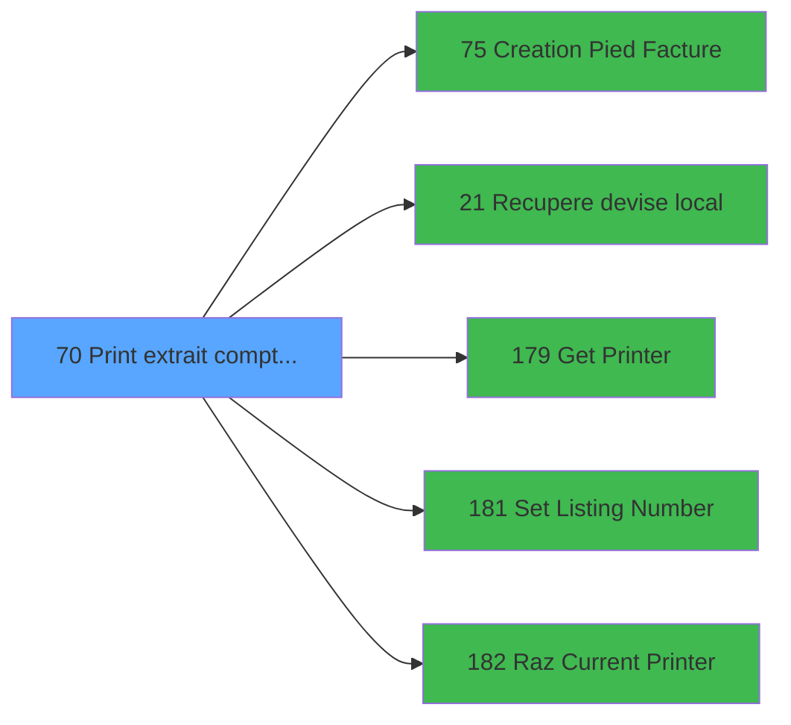

# ADH IDE 70 - Print extrait compte /Nom

> **Analyse**: Phases 1-4 2026-02-07 03:43 -> 03:43 (27s) | Assemblage 12:34
> **Pipeline**: V7.2 Enrichi
> **Structure**: 4 onglets (Resume | Ecrans | Donnees | Connexions)

<!-- TAB:Resume -->

## 1. FICHE D'IDENTITE

| Attribut | Valeur |
|----------|--------|
| Projet | ADH |
| IDE Position | 70 |
| Nom Programme | Print extrait compte /Nom |
| Fichier source | `Prg_70.xml` |
| Dossier IDE | Comptabilite |
| Taches | 19 (0 ecrans visibles) |
| Tables modifiees | 1 |
| Programmes appeles | 5 |
| Complexite | **BASSE** (score 25/100) |

## 2. DESCRIPTION FONCTIONNELLE

**ADH IDE 70** gère l'impression de l'extrait de compte pour un adhérent. Le programme affiche d'abord un message "Veuillez patienter..." avant de récupérer les informations essentielles : le nom de l'adhérent depuis la base de données, la devise locale via le programme IDE 21, et configure l'imprimante via IDE 179. Il initialise également le numéro de listage pour le document (IDE 181) et réinitialise les paramètres imprimante (IDE 182).

Le cœur du processus consiste à éditer l'extrait de compte avec tous les détails de l'adhérent en utilisant l'imprimante sélectionnée. Une fois le contenu principal généré, le programme ajoute le pied de page du document via IDE 75, puis édite un récapitulatif des extras gratuits. Chaque étape met à jour la table `log_maj_tpe` pour tracer les modifications effectuées.

Ce programme est un example classique de workflow d'édition/impression : il orchestestre plusieurs sous-programmes spécialisés (récupération données, configuration d'impression, génération de contenu) pour produire un document complet et correctement formaté. Il s'inscrit dans la chaîne d'édition des extraits de compte, appelé depuis IDE 69 lorsque l'utilisateur demande l'impression.

## 3. BLOCS FONCTIONNELS

### 3.1 Traitement (5 taches)

Traitements internes.

---

#### <a id="t1"></a>T1 - Veuillez patienter... [ECRAN]

**Role** : Traitement : Veuillez patienter....
**Ecran** : 422 x 56 DLU (MDI) | [Voir mockup](#ecran-t1)

<details>
<summary>4 sous-taches directes</summary>

| Tache | Nom | Bloc |
|-------|-----|------|
| [T2](#t2) | recup nom adherent | Traitement |
| [T11](#t11) | Veuillez pateinter... **[ECRAN]** | Traitement |
| [T13](#t13) | Veuillez pateinter... **[ECRAN]** | Traitement |
| [T17](#t17) | Veuillez pateinter... **[ECRAN]** | Traitement |

</details>
**Delegue a** : [Recupere devise local (IDE 21)](ADH-IDE-21.md), [Set Listing Number (IDE 181)](ADH-IDE-181.md)

---

#### <a id="t2"></a>T2 - recup nom adherent

**Role** : Consultation/chargement : recup nom adherent.
**Variables liees** : B (P0 code adherent), S (W0 n° adherent)
**Delegue a** : [Recupere devise local (IDE 21)](ADH-IDE-21.md), [Set Listing Number (IDE 181)](ADH-IDE-181.md)

---

#### <a id="t11"></a>T11 - Veuillez pateinter... [ECRAN]

**Role** : Traitement : Veuillez pateinter....
**Ecran** : 422 x 56 DLU (MDI) | [Voir mockup](#ecran-t11)
**Delegue a** : [Recupere devise local (IDE 21)](ADH-IDE-21.md), [Set Listing Number (IDE 181)](ADH-IDE-181.md)

---

#### <a id="t13"></a>T13 - Veuillez pateinter... [ECRAN]

**Role** : Traitement : Veuillez pateinter....
**Ecran** : 422 x 56 DLU (MDI) | [Voir mockup](#ecran-t13)
**Delegue a** : [Recupere devise local (IDE 21)](ADH-IDE-21.md), [Set Listing Number (IDE 181)](ADH-IDE-181.md)

---

#### <a id="t17"></a>T17 - Veuillez pateinter... [ECRAN]

**Role** : Traitement : Veuillez pateinter....
**Ecran** : 422 x 56 DLU (MDI) | [Voir mockup](#ecran-t17)
**Delegue a** : [Recupere devise local (IDE 21)](ADH-IDE-21.md), [Set Listing Number (IDE 181)](ADH-IDE-181.md)


### 3.2 Impression (14 taches)

Generation des documents et tickets.

---

#### <a id="t3"></a>T3 - Printer 1 [ECRAN]

**Role** : Generation du document : Printer 1.
**Ecran** : 1058 x 791 DLU (MDI) | [Voir mockup](#ecran-t3)

---

#### <a id="t4"></a>T4 - edition extrait compte [ECRAN]

**Role** : Generation du document : edition extrait compte.
**Ecran** : 1058 x 791 DLU (MDI) | [Voir mockup](#ecran-t4)
**Variables liees** : BC (W0 masque extrait), BA (v. Libelle edition)

---

#### <a id="t5"></a>T5 - Edition du pied

**Role** : Generation du document : Edition du pied.
**Variables liees** : BA (v. Libelle edition)

---

#### <a id="t6"></a>T6 - Edition recap Free Etra

**Role** : Generation du document : Edition recap Free Etra.
**Variables liees** : BA (v. Libelle edition)

---

#### <a id="t7"></a>T7 - edition extrait compte [ECRAN]

**Role** : Generation du document : edition extrait compte.
**Ecran** : 1058 x 791 DLU (MDI) | [Voir mockup](#ecran-t7)
**Variables liees** : BC (W0 masque extrait), BA (v. Libelle edition)

---

#### <a id="t8"></a>T8 - Edition du pied

**Role** : Generation du document : Edition du pied.
**Variables liees** : BA (v. Libelle edition)

---

#### <a id="t9"></a>T9 - Edition recap Free Etra

**Role** : Generation du document : Edition recap Free Etra.
**Variables liees** : BA (v. Libelle edition)

---

#### <a id="t10"></a>T10 - Printer 6 [ECRAN]

**Role** : Generation du document : Printer 6.
**Ecran** : 422 x 56 DLU (MDI) | [Voir mockup](#ecran-t10)

---

#### <a id="t12"></a>T12 - Printer 8 [ECRAN]

**Role** : Generation du document : Printer 8.
**Ecran** : 422 x 56 DLU (MDI) | [Voir mockup](#ecran-t12)

---

#### <a id="t14"></a>T14 - Edition du pied

**Role** : Generation du document : Edition du pied.
**Variables liees** : BA (v. Libelle edition)

---

#### <a id="t15"></a>T15 - Edition recap Free Etra

**Role** : Generation du document : Edition recap Free Etra.
**Variables liees** : BA (v. Libelle edition)

---

#### <a id="t16"></a>T16 - Printer 9 [ECRAN]

**Role** : Generation du document : Printer 9.
**Ecran** : 422 x 56 DLU (MDI) | [Voir mockup](#ecran-t16)

---

#### <a id="t18"></a>T18 - Edition du pied

**Role** : Generation du document : Edition du pied.
**Variables liees** : BA (v. Libelle edition)

---

#### <a id="t19"></a>T19 - Edition recap Gift Pass

**Role** : Generation du document : Edition recap Gift Pass.
**Variables liees** : M (P.Print GIFT PASS), BA (v. Libelle edition)


## 5. REGLES METIER

*(Programme d'impression - logique technique sans conditions metier)*

## 6. CONTEXTE

- **Appele par**: [Extrait de compte (IDE 69)](ADH-IDE-69.md)
- **Appelle**: 5 programmes | **Tables**: 8 (W:1 R:3 L:7) | **Taches**: 19 | **Expressions**: 14

<!-- TAB:Ecrans -->

## 8. ECRANS

*(Programme sans ecran visible)*

## 9. NAVIGATION

### 9.3 Structure hierarchique (19 taches)

| Position | Tache | Type | Dimensions | Bloc |
|----------|-------|------|------------|------|
| **70.1** | [**Veuillez patienter...** (T1)](#t1) [mockup](#ecran-t1) | MDI | 422x56 | Traitement |
| 70.1.1 | [recup nom adherent (T2)](#t2) | MDI | - | |
| 70.1.2 | [Veuillez pateinter... (T11)](#t11) [mockup](#ecran-t11) | MDI | 422x56 | |
| 70.1.3 | [Veuillez pateinter... (T13)](#t13) [mockup](#ecran-t13) | MDI | 422x56 | |
| 70.1.4 | [Veuillez pateinter... (T17)](#t17) [mockup](#ecran-t17) | MDI | 422x56 | |
| **70.2** | [**Printer 1** (T3)](#t3) [mockup](#ecran-t3) | MDI | 1058x791 | Impression |
| 70.2.1 | [edition extrait compte (T4)](#t4) [mockup](#ecran-t4) | MDI | 1058x791 | |
| 70.2.2 | [Edition du pied (T5)](#t5) | - | - | |
| 70.2.3 | [Edition recap Free Etra (T6)](#t6) | - | - | |
| 70.2.4 | [edition extrait compte (T7)](#t7) [mockup](#ecran-t7) | MDI | 1058x791 | |
| 70.2.5 | [Edition du pied (T8)](#t8) | - | - | |
| 70.2.6 | [Edition recap Free Etra (T9)](#t9) | - | - | |
| 70.2.7 | [Printer 6 (T10)](#t10) [mockup](#ecran-t10) | MDI | 422x56 | |
| 70.2.8 | [Printer 8 (T12)](#t12) [mockup](#ecran-t12) | MDI | 422x56 | |
| 70.2.9 | [Edition du pied (T14)](#t14) | - | - | |
| 70.2.10 | [Edition recap Free Etra (T15)](#t15) | - | - | |
| 70.2.11 | [Printer 9 (T16)](#t16) [mockup](#ecran-t16) | MDI | 422x56 | |
| 70.2.12 | [Edition du pied (T18)](#t18) | - | - | |
| 70.2.13 | [Edition recap Gift Pass (T19)](#t19) | - | - | |

### 9.4 Algorigramme

```mermaid
flowchart TD
    START([START])
    B1[Traitement (5t)]
    START --> B1
    B2[Impression (14t)]
    B1 --> B2
    WRITE[MAJ 1 tables]
    B2 --> WRITE
    ENDOK([END])
    WRITE --> ENDOK
    style START fill:#3fb950,color:#000
    style ENDOK fill:#3fb950,color:#000
    style WRITE fill:#ffeb3b,color:#000
```

> *Algorigramme simplifie base sur les blocs fonctionnels. Utiliser `/algorigramme` pour une synthese metier detaillee.*

<!-- TAB:Donnees -->

## 10. TABLES

### Tables utilisees (8)

| ID | Nom | Description | Type | R | W | L | Usages |
|----|-----|-------------|------|---|---|---|--------|
| 867 | log_maj_tpe |  | DB |   | **W** |   | 4 |
| 40 | comptable________cte |  | DB | R |   | L | 9 |
| 31 | gm-complet_______gmc |  | DB | R |   | L | 9 |
| 30 | gm-recherche_____gmr | Index de recherche | DB | R |   | L | 6 |
| 928 | type_lit |  | DB |   |   | L | 2 |
| 413 | pv_tva |  | DB |   |   | L | 1 |
| 400 | pv_cust_rentals |  | DB |   |   | L | 1 |
| 34 | hebergement______heb | Hebergement (chambres) | DB |   |   | L | 1 |

### Colonnes par table (1 / 4 tables avec colonnes identifiees)

<details>
<summary>Table 867 - log_maj_tpe (**W**) - 4 usages</summary>

*Table utilisee uniquement en Link ou aucune colonne Real identifiee dans le DataView.*

</details>

<details>
<summary>Table 40 - comptable________cte (R/L) - 9 usages</summary>

| Lettre | Variable | Acces | Type |
|--------|----------|-------|------|
| A | W1 cumul compte | R | Numeric |
| B | W1 solde compte | R | Numeric |
| C | W1 ss_total compte | R | Numeric |
| D | v.retour offre | R | Logical |
| E | W1 detection papier | R | Alpha |
| F | W1 inhibe panel | R | Alpha |
| G | W1 massicot | R | Alpha |
| H | W1 selection feuille | R | Alpha |
| I | W1 selection rouleau | R | Alpha |
| J | W1 cumul compte | R | Numeric |
| K | W1 solde compte | R | Numeric |
| L | W1 ss_total compte | R | Numeric |
| M | v.retour special offer | R | Logical |

</details>

<details>
<summary>Table 31 - gm-complet_______gmc (R/L) - 9 usages</summary>

*Table utilisee uniquement en Link ou aucune colonne Real identifiee dans le DataView.*

</details>

<details>
<summary>Table 30 - gm-recherche_____gmr (R/L) - 6 usages</summary>

*Table utilisee uniquement en Link ou aucune colonne Real identifiee dans le DataView.*

</details>

## 11. VARIABLES

### 11.1 Parametres entrants (15)

Variables recues du programme appelant ([Extrait de compte (IDE 69)](ADH-IDE-69.md)).

| Lettre | Nom | Type | Usage dans |
|--------|-----|------|-----------|
| A | P0 societe | Alpha | - |
| B | P0 code adherent | Numeric | - |
| C | P0 filiation | Numeric | - |
| D | P0 masque montant | Alpha | 1x parametre entrant |
| E | P0 nom village | Alpha | - |
| F | P0 Fictif | Logical | - |
| G | P0 date comptable | Date | - |
| H | P0 Affichage Tva ? | Logical | - |
| I | P.FormatPDF | Logical | - |
| J | P.Chemin | Alpha | - |
| K | p.NomFichierPDF | Alpha | - |
| L | P.Print or Mail | Alpha | - |
| M | P.Print GIFT PASS | Logical | - |
| N | P.Appel Direct | Logical | 1x parametre entrant |
| O | P. Sans annulations ? | Logical | - |

### 11.2 Variables de session (2)

Variables persistantes pendant toute la session.

| Lettre | Nom | Type | Usage dans |
|--------|-----|------|-----------|
| BA | v. Libelle edition | Alpha | - |
| BB | v. Libelle Categ | Alpha | - |

### 11.3 Variables de travail (14)

Variables internes au programme.

| Lettre | Nom | Type | Usage dans |
|--------|-----|------|-----------|
| P | W0 nom | Alpha | - |
| Q | W0 prenom | Alpha | - |
| R | W0 titre | Alpha | - |
| S | W0 n° adherent | Numeric | - |
| T | W0 lettre contrôle | Alpha | - |
| U | W0 filiation | Numeric | - |
| V | W0 langue parlee | Alpha | - |
| W | W0 chambre | Alpha | - |
| X | W0 D.Sejour Debut | Date | - |
| Y | W0 D.Sejour Fin | Date | - |
| Z | W0 code inscription | Unicode | - |
| BC | W0 masque extrait | Alpha | - |
| BD | W0 devise locale | Alpha | - |
| BE | W0.Nombre de copies | Numeric | - |

<details>
<summary>Toutes les 31 variables (liste complete)</summary>

| Cat | Lettre | Nom Variable | Type |
|-----|--------|--------------|------|
| P0 | **A** | P0 societe | Alpha |
| P0 | **B** | P0 code adherent | Numeric |
| P0 | **C** | P0 filiation | Numeric |
| P0 | **D** | P0 masque montant | Alpha |
| P0 | **E** | P0 nom village | Alpha |
| P0 | **F** | P0 Fictif | Logical |
| P0 | **G** | P0 date comptable | Date |
| P0 | **H** | P0 Affichage Tva ? | Logical |
| P0 | **I** | P.FormatPDF | Logical |
| P0 | **J** | P.Chemin | Alpha |
| P0 | **K** | p.NomFichierPDF | Alpha |
| P0 | **L** | P.Print or Mail | Alpha |
| P0 | **M** | P.Print GIFT PASS | Logical |
| P0 | **N** | P.Appel Direct | Logical |
| P0 | **O** | P. Sans annulations ? | Logical |
| W0 | **P** | W0 nom | Alpha |
| W0 | **Q** | W0 prenom | Alpha |
| W0 | **R** | W0 titre | Alpha |
| W0 | **S** | W0 n° adherent | Numeric |
| W0 | **T** | W0 lettre contrôle | Alpha |
| W0 | **U** | W0 filiation | Numeric |
| W0 | **V** | W0 langue parlee | Alpha |
| W0 | **W** | W0 chambre | Alpha |
| W0 | **X** | W0 D.Sejour Debut | Date |
| W0 | **Y** | W0 D.Sejour Fin | Date |
| W0 | **Z** | W0 code inscription | Unicode |
| W0 | **BC** | W0 masque extrait | Alpha |
| W0 | **BD** | W0 devise locale | Alpha |
| W0 | **BE** | W0.Nombre de copies | Numeric |
| V. | **BA** | v. Libelle edition | Alpha |
| V. | **BB** | v. Libelle Categ | Alpha |

</details>

## 12. EXPRESSIONS

**14 / 14 expressions decodees (100%)**

### 12.1 Repartition par type

| Type | Expressions | Regles |
|------|-------------|--------|
| CALCULATION | 1 | 0 |
| CONSTANTE | 2 | 0 |
| OTHER | 6 | 0 |
| CONDITION | 4 | 0 |
| CAST_LOGIQUE | 1 | 0 |

### 12.2 Expressions cles par type

#### CALCULATION (1 expressions)

| Type | IDE | Expression | Regle |
|------|-----|------------|-------|
| CALCULATION | 5 | `Left (P0 masque montant [D],Len (RTrim (P0 masque montant [D]))-1)` | - |

#### CONSTANTE (2 expressions)

| Type | IDE | Expression | Regle |
|------|-----|------------|-------|
| CONSTANTE | 12 | `'Par Nom / By Name'` | - |
| CONSTANTE | 11 | `'Extrait de compte/Account statement'` | - |

#### OTHER (6 expressions)

| Type | IDE | Expression | Regle |
|------|-----|------------|-------|
| OTHER | 4 | `SetCrsr (2)` | - |
| OTHER | 10 | `DbDel ('{867,4}'DSOURCE,'')` | - |
| OTHER | 14 | `GetParam ('NUMBERCOPIES')` | - |
| OTHER | 1 | `GetParam ('LISTINGNUMPRINTERCHOICE')` | - |
| OTHER | 2 | `IsComponent () AND NOT(P.Appel Direct [N])` | - |
| ... | | *+1 autres* | |

#### CONDITION (4 expressions)

| Type | IDE | Expression | Regle |
|------|-----|------------|-------|
| CONDITION | 8 | `GetParam ('CURRENTPRINTERNUM')=8` | - |
| CONDITION | 9 | `GetParam ('CURRENTPRINTERNUM')=9` | - |
| CONDITION | 6 | `GetParam ('CURRENTPRINTERNUM')=1` | - |
| CONDITION | 7 | `GetParam ('CURRENTPRINTERNUM')=6` | - |

#### CAST_LOGIQUE (1 expressions)

| Type | IDE | Expression | Regle |
|------|-----|------------|-------|
| CAST_LOGIQUE | 13 | `'TRUE'LOG` | - |

<!-- TAB:Connexions -->

## 13. GRAPHE D'APPELS

### 13.1 Chaine depuis Main (Callers)

Main -> ... -> [Extrait de compte (IDE 69)](ADH-IDE-69.md) -> **Print extrait compte /Nom (IDE 70)**


### 13.2 Callers

| IDE | Nom Programme | Nb Appels |
|-----|---------------|-----------|
| [69](ADH-IDE-69.md) | Extrait de compte | 1 |

### 13.3 Callees (programmes appeles)



### 13.4 Detail Callees avec contexte

| IDE | Nom Programme | Appels | Contexte |
|-----|---------------|--------|----------|
| [75](ADH-IDE-75.md) | Creation Pied Facture | 4 | Sous-programme |
| [21](ADH-IDE-21.md) | Recupere devise local | 1 | Recuperation donnees |
| [179](ADH-IDE-179.md) | Get Printer | 1 | Impression ticket/document |
| [181](ADH-IDE-181.md) | Set Listing Number | 1 | Configuration impression |
| [182](ADH-IDE-182.md) | Raz Current Printer | 1 | Impression ticket/document |

## 14. RECOMMANDATIONS MIGRATION

### 14.1 Profil du programme

| Metrique | Valeur | Impact migration |
|----------|--------|-----------------|
| Lignes de logique | 700 | Programme volumineux |
| Expressions | 14 | Peu de logique |
| Tables WRITE | 1 | Impact faible |
| Sous-programmes | 5 | Peu de dependances |
| Ecrans visibles | 0 | Ecran unique ou traitement batch |
| Code desactive | 0% (0 / 700) | Code sain |
| Regles metier | 0 | Pas de regle identifiee |

### 14.2 Plan de migration par bloc

#### Traitement (5 taches: 4 ecrans, 1 traitement)

- **Strategie** : Orchestrateur avec 4 ecrans (Razor/React) et 1 traitements backend (services).
- Les ecrans deviennent des composants UI, les traitements invisibles deviennent des services injectables.
- 5 sous-programme(s) a migrer ou a reutiliser depuis les services existants.
- Decomposer les taches en services unitaires testables.

#### Impression (14 taches: 6 ecrans, 8 traitements)

- **Strategie** : Templates HTML -> PDF via wkhtmltopdf ou Puppeteer.
- `PrintService` injectable avec choix imprimante

### 14.3 Dependances critiques

| Dependance | Type | Appels | Impact |
|------------|------|--------|--------|
| log_maj_tpe | Table WRITE (Database) | 4x | Schema + repository |
| [Creation Pied Facture (IDE 75)](ADH-IDE-75.md) | Sous-programme | 4x | **CRITIQUE** - Sous-programme |
| [Set Listing Number (IDE 181)](ADH-IDE-181.md) | Sous-programme | 1x | Normale - Configuration impression |
| [Raz Current Printer (IDE 182)](ADH-IDE-182.md) | Sous-programme | 1x | Normale - Impression ticket/document |
| [Recupere devise local (IDE 21)](ADH-IDE-21.md) | Sous-programme | 1x | Normale - Recuperation donnees |
| [Get Printer (IDE 179)](ADH-IDE-179.md) | Sous-programme | 1x | Normale - Impression ticket/document |

---
*Spec DETAILED generee par Pipeline V7.2 - 2026-02-07 12:34*
