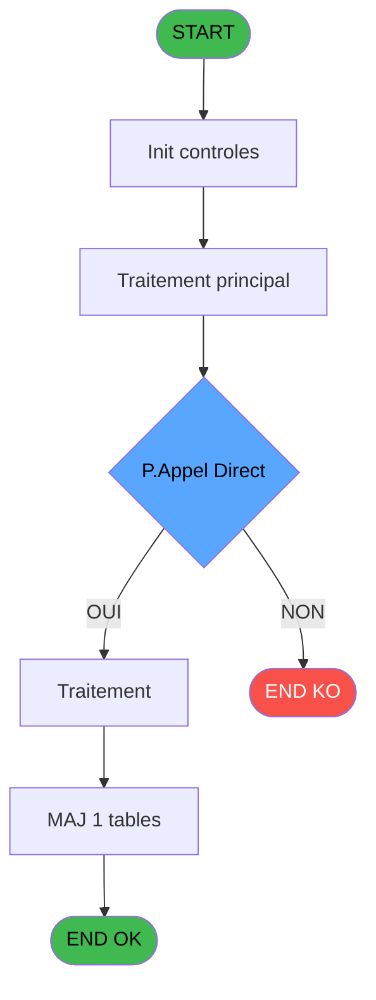
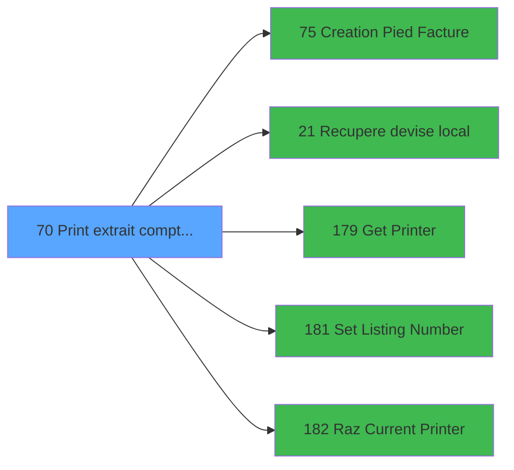

# ADH IDE 70 - Print extrait compte /Nom

> **Analyse**: Phases 1-4 2026-02-07 17:36 -> 17:36 (6s) | Assemblage 17:36
> **Pipeline**: V7.2 Enrichi
> **Structure**: 4 onglets (Resume | Ecrans | Donnees | Connexions)

<!-- TAB:Resume -->

## 1. FICHE D'IDENTITE

| Attribut | Valeur |
|----------|--------|
| Projet | ADH |
| IDE Position | 70 |
| Nom Programme | Print extrait compte /Nom |
| Fichier source | `Prg_70.xml` |
| Dossier IDE | Comptabilite |
| Taches | 19 (0 ecrans visibles) |
| Tables modifiees | 1 |
| Programmes appeles | 5 |
| Complexite | **BASSE** (score 25/100) |

## 2. DESCRIPTION FONCTIONNELLE

Le programme **ADH IDE 70** prépare et imprime l'extrait de compte d'un adhérent, en passant par une séquence d'initialisation de l'imprimante et de récupération des données critiques. Il commence par afficher un message "Veuillez patienter..." pour indiquer à l'utilisateur que le traitement est en cours, puis récupère le nom de l'adhérent à partir des tables de référence. Une fois les données compilées, il initialise le périphérique d'impression (IDE 179) et configure le numéro de listing courant (IDE 181).

L'édition de l'extrait compte constitue le cœur du programme : il formate et imprime l'ensemble des mouvements du compte (débits/crédits) avec les soldes progressifs, en utilisant la devise locale obtenue via IDE 21. Cette phase se termine par l'édition du pied de facture (IDE 75), qui ajoute les informations résumées (totaux, soldes finaux) au bas du document. Chaque étape d'impression met à jour la table **log_maj_tpe** pour tracer l'action dans les logs du système.

L'édition récapitulative "Free Etra" (probablement un récapitulatif libre) conclut le processus avant de nettoyer l'imprimante via IDE 182 (RAZ Current Printer). Ce programme est appelé depuis IDE 69 (Extrait de compte), formant un duo imprimante/affichage où IDE 69 gère l'écran de consultation et IDE 70 génère le document papier associé.

## 3. BLOCS FONCTIONNELS

### 3.1 Traitement (5 taches)

Traitements internes.

---

#### 70 - Veuillez patienter... [[ECRAN]](#ecran-t1)

**Role** : Traitement : Veuillez patienter....
**Ecran** : 422 x 56 DLU (MDI) | [Voir mockup](#ecran-t1)

4 sous-taches directes

| Tache | Nom | Bloc |
|-------|-----|------|
| [70.1](#t2) | recup nom adherent | Traitement |
| [70.3.1](#t11) | Veuillez pateinter... **[[ECRAN]](#ecran-t11)** | Traitement |
| [70.4.1](#t13) | Veuillez pateinter... **[[ECRAN]](#ecran-t13)** | Traitement |
| [70.5.1](#t17) | Veuillez pateinter... **[[ECRAN]](#ecran-t17)** | Traitement |

**Delegue a** : [Recupere devise local (IDE 21)](ADH-IDE-21.md), [Set Listing Number (IDE 181)](ADH-IDE-181.md)

---

#### 70.1 - recup nom adherent

**Role** : Consultation/chargement : recup nom adherent.
**Variables liees** : B (P0 code adherent), S (W0 n° adherent)
**Delegue a** : [Recupere devise local (IDE 21)](ADH-IDE-21.md), [Set Listing Number (IDE 181)](ADH-IDE-181.md)

---

#### 70.3.1 - Veuillez pateinter... [[ECRAN]](#ecran-t11)

**Role** : Traitement : Veuillez pateinter....
**Ecran** : 422 x 56 DLU (MDI) | [Voir mockup](#ecran-t11)
**Delegue a** : [Recupere devise local (IDE 21)](ADH-IDE-21.md), [Set Listing Number (IDE 181)](ADH-IDE-181.md)

---

#### 70.4.1 - Veuillez pateinter... [[ECRAN]](#ecran-t13)

**Role** : Traitement : Veuillez pateinter....
**Ecran** : 422 x 56 DLU (MDI) | [Voir mockup](#ecran-t13)
**Delegue a** : [Recupere devise local (IDE 21)](ADH-IDE-21.md), [Set Listing Number (IDE 181)](ADH-IDE-181.md)

---

#### 70.5.1 - Veuillez pateinter... [[ECRAN]](#ecran-t17)

**Role** : Traitement : Veuillez pateinter....
**Ecran** : 422 x 56 DLU (MDI) | [Voir mockup](#ecran-t17)
**Delegue a** : [Recupere devise local (IDE 21)](ADH-IDE-21.md), [Set Listing Number (IDE 181)](ADH-IDE-181.md)

### 3.2 Impression (14 taches)

Generation des documents et tickets.

---

#### 70.2 - Printer 1 [[ECRAN]](#ecran-t3)

**Role** : Generation du document : Printer 1.
**Ecran** : 1058 x 791 DLU (MDI) | [Voir mockup](#ecran-t3)

---

#### 70.2.1 - edition extrait compte [[ECRAN]](#ecran-t4)

**Role** : Generation du document : edition extrait compte.
**Ecran** : 1058 x 791 DLU (MDI) | [Voir mockup](#ecran-t4)
**Variables liees** : BC (W0 masque extrait), BA (v. Libelle edition)

---

#### 70.2.1.1 - Edition du pied

**Role** : Generation du document : Edition du pied.
**Variables liees** : BA (v. Libelle edition)

---

#### 70.2.1.2 - Edition recap Free Etra

**Role** : Generation du document : Edition recap Free Etra.
**Variables liees** : BA (v. Libelle edition)

---

#### 70.2.2 - edition extrait compte [[ECRAN]](#ecran-t7)

**Role** : Generation du document : edition extrait compte.
**Ecran** : 1058 x 791 DLU (MDI) | [Voir mockup](#ecran-t7)
**Variables liees** : BC (W0 masque extrait), BA (v. Libelle edition)

---

#### 70.2.2.1 - Edition du pied

**Role** : Generation du document : Edition du pied.
**Variables liees** : BA (v. Libelle edition)

---

#### 70.2.2.2 - Edition recap Free Etra

**Role** : Generation du document : Edition recap Free Etra.
**Variables liees** : BA (v. Libelle edition)

---

#### 70.3 - Printer 6 [[ECRAN]](#ecran-t10)

**Role** : Generation du document : Printer 6.
**Ecran** : 422 x 56 DLU (MDI) | [Voir mockup](#ecran-t10)

---

#### 70.4 - Printer 8 [[ECRAN]](#ecran-t12)

**Role** : Generation du document : Printer 8.
**Ecran** : 422 x 56 DLU (MDI) | [Voir mockup](#ecran-t12)

---

#### 70.4.1.1 - Edition du pied

**Role** : Generation du document : Edition du pied.
**Variables liees** : BA (v. Libelle edition)

---

#### 70.4.1.2 - Edition recap Free Etra

**Role** : Generation du document : Edition recap Free Etra.
**Variables liees** : BA (v. Libelle edition)

---

#### 70.5 - Printer 9 [[ECRAN]](#ecran-t16)

**Role** : Generation du document : Printer 9.
**Ecran** : 422 x 56 DLU (MDI) | [Voir mockup](#ecran-t16)

---

#### 70.5.1.1 - Edition du pied

**Role** : Generation du document : Edition du pied.
**Variables liees** : BA (v. Libelle edition)

---

#### 70.5.1.2 - Edition recap Gift Pass

**Role** : Generation du document : Edition recap Gift Pass.
**Variables liees** : M (P.Print GIFT PASS), BA (v. Libelle edition)

## 5. REGLES METIER

5 regles identifiees:

### Impression (4 regles)

#### [RM-002] Verification que l'imprimante courante est la n1

| Element | Detail |
|---------|--------|
| **Condition** | `GetParam ('CURRENTPRINTERNUM')=1` |
| **Si vrai** | Action si CURRENTPRINTERNUM = 1 |
| **Expression source** | Expression 6 : `GetParam ('CURRENTPRINTERNUM')=1` |
| **Exemple** | Si GetParam ('CURRENTPRINTERNUM')=1 → Action si CURRENTPRINTERNUM = 1 |
| **Impact** | [70.2 - Printer 1](#t3) |

#### [RM-003] Verification que l'imprimante courante est la n6

| Element | Detail |
|---------|--------|
| **Condition** | `GetParam ('CURRENTPRINTERNUM')=6` |
| **Si vrai** | Action si CURRENTPRINTERNUM = 6 |
| **Expression source** | Expression 7 : `GetParam ('CURRENTPRINTERNUM')=6` |
| **Exemple** | Si GetParam ('CURRENTPRINTERNUM')=6 → Action si CURRENTPRINTERNUM = 6 |
| **Impact** | [70.2 - Printer 1](#t3) |

#### [RM-004] Verification que l'imprimante courante est la n8

| Element | Detail |
|---------|--------|
| **Condition** | `GetParam ('CURRENTPRINTERNUM')=8` |
| **Si vrai** | Action si CURRENTPRINTERNUM = 8 |
| **Expression source** | Expression 8 : `GetParam ('CURRENTPRINTERNUM')=8` |
| **Exemple** | Si GetParam ('CURRENTPRINTERNUM')=8 → Action si CURRENTPRINTERNUM = 8 |
| **Impact** | [70.2 - Printer 1](#t3) |

#### [RM-005] Verification que l'imprimante courante est la n9

| Element | Detail |
|---------|--------|
| **Condition** | `GetParam ('CURRENTPRINTERNUM')=9` |
| **Si vrai** | Action si CURRENTPRINTERNUM = 9 |
| **Expression source** | Expression 9 : `GetParam ('CURRENTPRINTERNUM')=9` |
| **Exemple** | Si GetParam ('CURRENTPRINTERNUM')=9 → Action si CURRENTPRINTERNUM = 9 |
| **Impact** | [70.2 - Printer 1](#t3) |

### Autres (1 regles)

#### [RM-001] Condition composite: IsComponent () AND NOT(P.Appel Direct [N])

| Element | Detail |
|---------|--------|
| **Condition** | `IsComponent () AND NOT(P.Appel Direct [N])` |
| **Si vrai** | Action si vrai |
| **Variables** | N (P.Appel Direct) |
| **Expression source** | Expression 2 : `IsComponent () AND NOT(P.Appel Direct [N])` |
| **Exemple** | Si IsComponent () AND NOT(P.Appel Direct [N]) → Action si vrai |

## 6. CONTEXTE

- **Appele par**: [Extrait de compte (IDE 69)](ADH-IDE-69.md)
- **Appelle**: 5 programmes | **Tables**: 8 (W:1 R:3 L:7) | **Taches**: 19 | **Expressions**: 14

<!-- TAB:Ecrans -->

## 8. ECRANS

*(Programme sans ecran visible)*

## 9. NAVIGATION

### 9.3 Structure hierarchique (19 taches)

| Position | Tache | Type | Dimensions | Bloc |
|----------|-------|------|------------|------|
| **70.1** | [**Veuillez patienter...** (70)](#t1) [mockup](#ecran-t1) | MDI | 422x56 | Traitement |
| 70.1.1 | [recup nom adherent (70.1)](#t2) | MDI | - | |
| 70.1.2 | [Veuillez pateinter... (70.3.1)](#t11) [mockup](#ecran-t11) | MDI | 422x56 | |
| 70.1.3 | [Veuillez pateinter... (70.4.1)](#t13) [mockup](#ecran-t13) | MDI | 422x56 | |
| 70.1.4 | [Veuillez pateinter... (70.5.1)](#t17) [mockup](#ecran-t17) | MDI | 422x56 | |
| **70.2** | [**Printer 1** (70.2)](#t3) [mockup](#ecran-t3) | MDI | 1058x791 | Impression |
| 70.2.1 | [edition extrait compte (70.2.1)](#t4) [mockup](#ecran-t4) | MDI | 1058x791 | |
| 70.2.2 | [Edition du pied (70.2.1.1)](#t5) | - | - | |
| 70.2.3 | [Edition recap Free Etra (70.2.1.2)](#t6) | - | - | |
| 70.2.4 | [edition extrait compte (70.2.2)](#t7) [mockup](#ecran-t7) | MDI | 1058x791 | |
| 70.2.5 | [Edition du pied (70.2.2.1)](#t8) | - | - | |
| 70.2.6 | [Edition recap Free Etra (70.2.2.2)](#t9) | - | - | |
| 70.2.7 | [Printer 6 (70.3)](#t10) [mockup](#ecran-t10) | MDI | 422x56 | |
| 70.2.8 | [Printer 8 (70.4)](#t12) [mockup](#ecran-t12) | MDI | 422x56 | |
| 70.2.9 | [Edition du pied (70.4.1.1)](#t14) | - | - | |
| 70.2.10 | [Edition recap Free Etra (70.4.1.2)](#t15) | - | - | |
| 70.2.11 | [Printer 9 (70.5)](#t16) [mockup](#ecran-t16) | MDI | 422x56 | |
| 70.2.12 | [Edition du pied (70.5.1.1)](#t18) | - | - | |
| 70.2.13 | [Edition recap Gift Pass (70.5.1.2)](#t19) | - | - | |

### 9.4 Algorigramme

> **Legende**: Vert = START/END OK | Rouge = END KO | Bleu = Decisions
> *Algorigramme auto-genere. Utiliser `/algorigramme` pour une synthese metier detaillee.*

<!-- TAB:Donnees -->

## 10. TABLES

### Tables utilisees (8)

| ID | Nom | Description | Type | R | W | L | Usages |
|----|-----|-------------|------|---|---|---|--------|
| 867 | log_maj_tpe |  | DB |   | **W** |   | 4 |
| 40 | comptable________cte |  | DB | R |   | L | 9 |
| 31 | gm-complet_______gmc |  | DB | R |   | L | 9 |
| 30 | gm-recherche_____gmr | Index de recherche | DB | R |   | L | 6 |
| 928 | type_lit |  | DB |   |   | L | 2 |
| 413 | pv_tva |  | DB |   |   | L | 1 |
| 400 | pv_cust_rentals |  | DB |   |   | L | 1 |
| 34 | hebergement______heb | Hebergement (chambres) | DB |   |   | L | 1 |

### Colonnes par table (1 / 4 tables avec colonnes identifiees)

Table 867 - log_maj_tpe (**W**) - 4 usages

*Table utilisee uniquement en Link ou aucune colonne Real identifiee dans le DataView.*

Table 40 - comptable________cte (R/L) - 9 usages

| Lettre | Variable | Acces | Type |
|--------|----------|-------|------|
| A | W1 cumul compte | R | Numeric |
| B | W1 solde compte | R | Numeric |
| C | W1 ss_total compte | R | Numeric |
| D | v.retour offre | R | Logical |
| E | W1 detection papier | R | Alpha |
| F | W1 inhibe panel | R | Alpha |
| G | W1 massicot | R | Alpha |
| H | W1 selection feuille | R | Alpha |
| I | W1 selection rouleau | R | Alpha |
| J | W1 cumul compte | R | Numeric |
| K | W1 solde compte | R | Numeric |
| L | W1 ss_total compte | R | Numeric |
| M | v.retour special offer | R | Logical |

Table 31 - gm-complet_______gmc (R/L) - 9 usages

*Table utilisee uniquement en Link ou aucune colonne Real identifiee dans le DataView.*

Table 30 - gm-recherche_____gmr (R/L) - 6 usages

*Table utilisee uniquement en Link ou aucune colonne Real identifiee dans le DataView.*

## 11. VARIABLES

### 11.1 Parametres entrants (15)

Variables recues du programme appelant ([Extrait de compte (IDE 69)](ADH-IDE-69.md)).

| Lettre | Nom | Type | Usage dans |
|--------|-----|------|-----------|
| A | P0 societe | Alpha | - |
| B | P0 code adherent | Numeric | - |
| C | P0 filiation | Numeric | - |
| D | P0 masque montant | Alpha | 1x parametre entrant |
| E | P0 nom village | Alpha | - |
| F | P0 Fictif | Logical | - |
| G | P0 date comptable | Date | - |
| H | P0 Affichage Tva ? | Logical | - |
| I | P.FormatPDF | Logical | - |
| J | P.Chemin | Alpha | - |
| K | p.NomFichierPDF | Alpha | - |
| L | P.Print or Mail | Alpha | - |
| M | P.Print GIFT PASS | Logical | - |
| N | P.Appel Direct | Logical | 1x parametre entrant |
| O | P. Sans annulations ? | Logical | - |

### 11.2 Variables de session (2)

Variables persistantes pendant toute la session.

| Lettre | Nom | Type | Usage dans |
|--------|-----|------|-----------|
| BA | v. Libelle edition | Alpha | - |
| BB | v. Libelle Categ | Alpha | - |

### 11.3 Variables de travail (14)

Variables internes au programme.

| Lettre | Nom | Type | Usage dans |
|--------|-----|------|-----------|
| P | W0 nom | Alpha | - |
| Q | W0 prenom | Alpha | - |
| R | W0 titre | Alpha | - |
| S | W0 n° adherent | Numeric | - |
| T | W0 lettre contrôle | Alpha | - |
| U | W0 filiation | Numeric | - |
| V | W0 langue parlee | Alpha | - |
| W | W0 chambre | Alpha | - |
| X | W0 D.Sejour Debut | Date | - |
| Y | W0 D.Sejour Fin | Date | - |
| Z | W0 code inscription | Unicode | - |
| BC | W0 masque extrait | Alpha | - |
| BD | W0 devise locale | Alpha | - |
| BE | W0.Nombre de copies | Numeric | - |

Toutes les 31 variables (liste complete)

| Cat | Lettre | Nom Variable | Type |
|-----|--------|--------------|------|
| P0 | **A** | P0 societe | Alpha |
| P0 | **B** | P0 code adherent | Numeric |
| P0 | **C** | P0 filiation | Numeric |
| P0 | **D** | P0 masque montant | Alpha |
| P0 | **E** | P0 nom village | Alpha |
| P0 | **F** | P0 Fictif | Logical |
| P0 | **G** | P0 date comptable | Date |
| P0 | **H** | P0 Affichage Tva ? | Logical |
| P0 | **I** | P.FormatPDF | Logical |
| P0 | **J** | P.Chemin | Alpha |
| P0 | **K** | p.NomFichierPDF | Alpha |
| P0 | **L** | P.Print or Mail | Alpha |
| P0 | **M** | P.Print GIFT PASS | Logical |
| P0 | **N** | P.Appel Direct | Logical |
| P0 | **O** | P. Sans annulations ? | Logical |
| W0 | **P** | W0 nom | Alpha |
| W0 | **Q** | W0 prenom | Alpha |
| W0 | **R** | W0 titre | Alpha |
| W0 | **S** | W0 n° adherent | Numeric |
| W0 | **T** | W0 lettre contrôle | Alpha |
| W0 | **U** | W0 filiation | Numeric |
| W0 | **V** | W0 langue parlee | Alpha |
| W0 | **W** | W0 chambre | Alpha |
| W0 | **X** | W0 D.Sejour Debut | Date |
| W0 | **Y** | W0 D.Sejour Fin | Date |
| W0 | **Z** | W0 code inscription | Unicode |
| W0 | **BC** | W0 masque extrait | Alpha |
| W0 | **BD** | W0 devise locale | Alpha |
| W0 | **BE** | W0.Nombre de copies | Numeric |
| V. | **BA** | v. Libelle edition | Alpha |
| V. | **BB** | v. Libelle Categ | Alpha |

## 12. EXPRESSIONS

**14 / 14 expressions decodees (100%)**

### 12.1 Repartition par type

| Type | Expressions | Regles |
|------|-------------|--------|
| CALCULATION | 1 | 0 |
| CONDITION | 5 | 5 |
| CONSTANTE | 2 | 0 |
| OTHER | 5 | 0 |
| CAST_LOGIQUE | 1 | 0 |

### 12.2 Expressions cles par type

#### CALCULATION (1 expressions)

| Type | IDE | Expression | Regle |
|------|-----|------------|-------|
| CALCULATION | 5 | `Left (P0 masque montant [D],Len (RTrim (P0 masque montant [D]))-1)` | - |

#### CONDITION (5 expressions)

| Type | IDE | Expression | Regle |
|------|-----|------------|-------|
| CONDITION | 8 | `GetParam ('CURRENTPRINTERNUM')=8` | [RM-004](#rm-RM-004) |
| CONDITION | 9 | `GetParam ('CURRENTPRINTERNUM')=9` | [RM-005](#rm-RM-005) |
| CONDITION | 7 | `GetParam ('CURRENTPRINTERNUM')=6` | [RM-003](#rm-RM-003) |
| CONDITION | 2 | `IsComponent () AND NOT(P.Appel Direct [N])` | [RM-001](#rm-RM-001) |
| CONDITION | 6 | `GetParam ('CURRENTPRINTERNUM')=1` | [RM-002](#rm-RM-002) |

#### CONSTANTE (2 expressions)

| Type | IDE | Expression | Regle |
|------|-----|------------|-------|
| CONSTANTE | 12 | `'Par Nom / By Name'` | - |
| CONSTANTE | 11 | `'Extrait de compte/Account statement'` | - |

#### OTHER (5 expressions)

| Type | IDE | Expression | Regle |
|------|-----|------------|-------|
| OTHER | 10 | `DbDel ('{867,4}'DSOURCE,'')` | - |
| OTHER | 14 | `GetParam ('NUMBERCOPIES')` | - |
| OTHER | 4 | `SetCrsr (2)` | - |
| OTHER | 1 | `GetParam ('LISTINGNUMPRINTERCHOICE')` | - |
| OTHER | 3 | `SetCrsr (1)` | - |

#### CAST_LOGIQUE (1 expressions)

| Type | IDE | Expression | Regle |
|------|-----|------------|-------|
| CAST_LOGIQUE | 13 | `'TRUE'LOG` | - |

<!-- TAB:Connexions -->

## 13. GRAPHE D'APPELS

### 13.1 Chaine depuis Main (Callers)

Main -> ... -> [Extrait de compte (IDE 69)](ADH-IDE-69.md) -> **Print extrait compte /Nom (IDE 70)**

### 13.2 Callers

| IDE | Nom Programme | Nb Appels |
|-----|---------------|-----------|
| [69](ADH-IDE-69.md) | Extrait de compte | 1 |

### 13.3 Callees (programmes appeles)

### 13.4 Detail Callees avec contexte

| IDE | Nom Programme | Appels | Contexte |
|-----|---------------|--------|----------|
| [75](ADH-IDE-75.md) | Creation Pied Facture | 4 | Sous-programme |
| [21](ADH-IDE-21.md) | Recupere devise local | 1 | Recuperation donnees |
| [179](ADH-IDE-179.md) | Get Printer | 1 | Impression ticket/document |
| [181](ADH-IDE-181.md) | Set Listing Number | 1 | Configuration impression |
| [182](ADH-IDE-182.md) | Raz Current Printer | 1 | Impression ticket/document |

## 14. RECOMMANDATIONS MIGRATION

### 14.1 Profil du programme

| Metrique | Valeur | Impact migration |
|----------|--------|-----------------|
| Lignes de logique | 700 | Programme volumineux |
| Expressions | 14 | Peu de logique |
| Tables WRITE | 1 | Impact faible |
| Sous-programmes | 5 | Peu de dependances |
| Ecrans visibles | 0 | Ecran unique ou traitement batch |
| Code desactive | 0% (0 / 700) | Code sain |
| Regles metier | 5 | Quelques regles a preserver |

### 14.2 Plan de migration par bloc

#### Traitement (5 taches: 4 ecrans, 1 traitement)

- **Strategie** : Orchestrateur avec 4 ecrans (Razor/React) et 1 traitements backend (services).
- Les ecrans deviennent des composants UI, les traitements invisibles deviennent des services injectables.
- 5 sous-programme(s) a migrer ou a reutiliser depuis les services existants.
- Decomposer les taches en services unitaires testables.

#### Impression (14 taches: 6 ecrans, 8 traitements)

- **Strategie** : Templates HTML -> PDF via wkhtmltopdf ou Puppeteer.
- `PrintService` injectable avec choix imprimante

### 14.3 Dependances critiques

| Dependance | Type | Appels | Impact |
|------------|------|--------|--------|
| log_maj_tpe | Table WRITE (Database) | 4x | Schema + repository |
| [Creation Pied Facture (IDE 75)](ADH-IDE-75.md) | Sous-programme | 4x | **CRITIQUE** - Sous-programme |
| [Set Listing Number (IDE 181)](ADH-IDE-181.md) | Sous-programme | 1x | Normale - Configuration impression |
| [Raz Current Printer (IDE 182)](ADH-IDE-182.md) | Sous-programme | 1x | Normale - Impression ticket/document |
| [Recupere devise local (IDE 21)](ADH-IDE-21.md) | Sous-programme | 1x | Normale - Recuperation donnees |
| [Get Printer (IDE 179)](ADH-IDE-179.md) | Sous-programme | 1x | Normale - Impression ticket/document |

---
*Spec DETAILED generee par Pipeline V7.2 - 2026-02-07 17:36*
