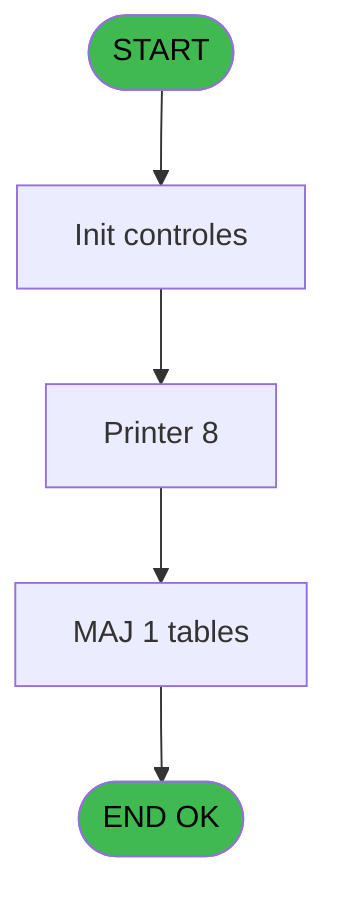
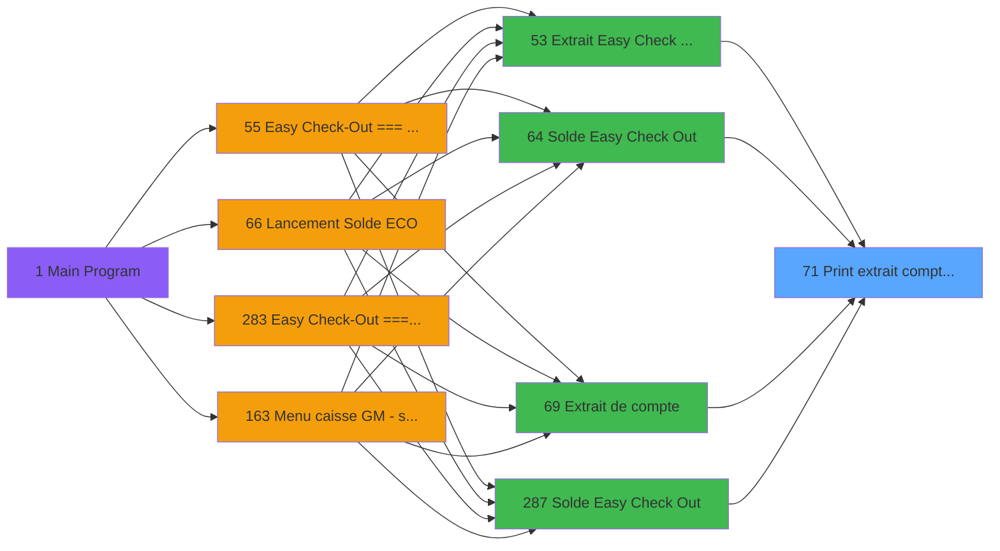
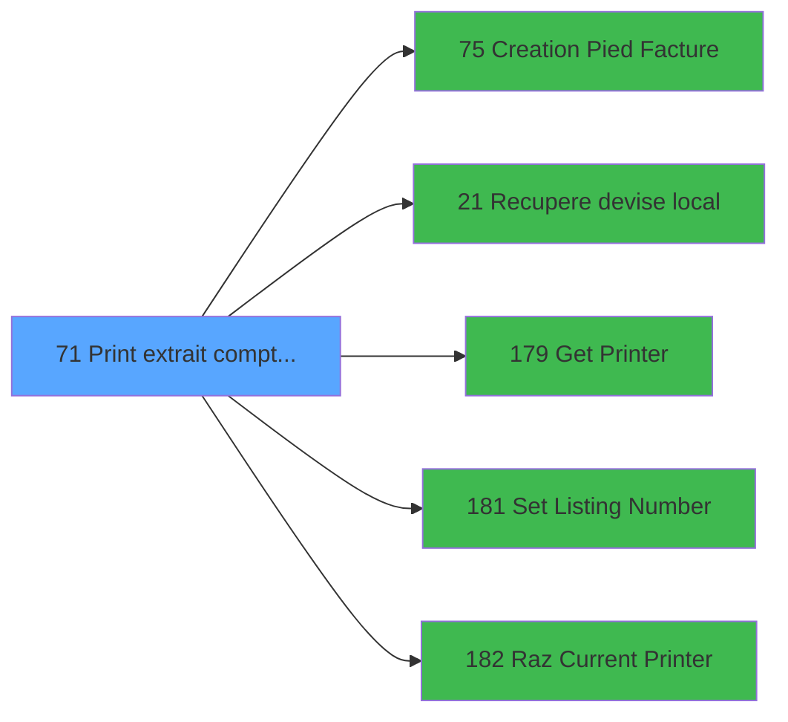

# ADH IDE 71 - Print extrait compte /Date

> **Analyse**: Phases 1-4 2026-02-07 03:43 -> 03:43 (28s) | Assemblage 03:43
> **Pipeline**: V7.2 Enrichi
> **Structure**: 4 onglets (Resume | Ecrans | Donnees | Connexions)

<!-- TAB:Resume -->

## 1. FICHE D'IDENTITE

| Attribut | Valeur |
|----------|--------|
| Projet | ADH |
| IDE Position | 71 |
| Nom Programme | Print extrait compte /Date |
| Fichier source | `Prg_71.xml` |
| Dossier IDE | Comptabilite |
| Taches | 24 (0 ecrans visibles) |
| Tables modifiees | 1 |
| Programmes appeles | 5 |

## 2. DESCRIPTION FONCTIONNELLE

**Print extrait compte /Date** assure la gestion complete de ce processus, accessible depuis [Extrait de compte (IDE 69)](ADH-IDE-69.md), [Extrait Easy Check Out à J+1 (IDE 53)](ADH-IDE-53.md), [Solde Easy Check Out (IDE 64)](ADH-IDE-64.md), [Solde Easy Check Out (IDE 287)](ADH-IDE-287.md).

Le flux de traitement s'organise en **2 blocs fonctionnels** :

- **Impression** (19 taches) : generation de tickets et documents
- **Traitement** (5 taches) : traitements metier divers

**Donnees modifiees** : 1 tables en ecriture (log_maj_tpe).

Detail : phases du traitement

#### Phase 1 : Traitement (5 taches)

- **71** - Veuillez patienter... **[[ECRAN]](#ecran-t1)**
- **71.1** - recup nom adherent
- **71.4.1** - Veuillez patienter... **[[ECRAN]](#ecran-t16)**
- **71.5.1** - Veuillez patienter... **[[ECRAN]](#ecran-t18)**
- **71.6.1** - Veuillez patienter... **[[ECRAN]](#ecran-t22)**

Delegue a : [Recupere devise local (IDE 21)](ADH-IDE-21.md), [Set Listing Number (IDE 181)](ADH-IDE-181.md)

#### Phase 2 : Impression (19 taches)

- **71.2** - Printer 1
- **71.2.1** - edition extrait compte
- **71.2.1.1** - Edition du pied
- **71.2.1.2** - Edition recap Free Etra
- **71.2.2** - edition extrait compte
- **71.2.2.1** - Edition du pied
- **71.2.2.2** - Edition recap Free Etra
- **71.3** - Printer 4
- **71.3.1** - edition extrait compte
- **71.3.2** - edition extrait compte
- **71.3.2.1** - Edition du pied
- **71.3.2.2** - Edition recap Free Etra
- **71.4** - Printer 6
- **71.5** - Printer 8
- **71.5.1.1** - Edition du pied
- **71.5.1.2** - Edition recap Free Etra
- **71.6** - Printer 9
- **71.6.1.1** - Edition du pied
- **71.6.1.2** - Edition recap Free Etra

Delegue a : [Get Printer (IDE 179)](ADH-IDE-179.md), [Set Listing Number (IDE 181)](ADH-IDE-181.md), [Raz Current Printer (IDE 182)](ADH-IDE-182.md)

#### Tables impactees

| Table | Operations | Role metier |
|-------|-----------|-------------|
| log_maj_tpe | **W** (5 usages) |  |

## 3. BLOCS FONCTIONNELS

### 3.1 Traitement (5 taches)

Traitements internes.

---

#### 71 - Veuillez patienter... [[ECRAN]](#ecran-t1)

**Role** : Traitement : Veuillez patienter....
**Ecran** : 432 x 60 DLU (MDI) | [Voir mockup](#ecran-t1)

4 sous-taches directes

| Tache | Nom | Bloc |
|-------|-----|------|
| [71.1](#t2) | recup nom adherent | Traitement |
| [71.4.1](#t16) | Veuillez patienter... **[[ECRAN]](#ecran-t16)** | Traitement |
| [71.5.1](#t18) | Veuillez patienter... **[[ECRAN]](#ecran-t18)** | Traitement |
| [71.6.1](#t22) | Veuillez patienter... **[[ECRAN]](#ecran-t22)** | Traitement |

**Delegue a** : [Recupere devise local (IDE 21)](ADH-IDE-21.md), [Set Listing Number (IDE 181)](ADH-IDE-181.md)

---

#### 71.1 - recup nom adherent

**Role** : Consultation/chargement : recup nom adherent.
**Variables liees** : S (W0 nom adherent), T (W0 prenom adherent), U (W0 n° adherent)
**Delegue a** : [Recupere devise local (IDE 21)](ADH-IDE-21.md), [Set Listing Number (IDE 181)](ADH-IDE-181.md)

---

#### 71.4.1 - Veuillez patienter... [[ECRAN]](#ecran-t16)

**Role** : Traitement : Veuillez patienter....
**Ecran** : 422 x 56 DLU (MDI) | [Voir mockup](#ecran-t16)
**Delegue a** : [Recupere devise local (IDE 21)](ADH-IDE-21.md), [Set Listing Number (IDE 181)](ADH-IDE-181.md)

---

#### 71.5.1 - Veuillez patienter... [[ECRAN]](#ecran-t18)

**Role** : Traitement : Veuillez patienter....
**Ecran** : 422 x 56 DLU (MDI) | [Voir mockup](#ecran-t18)
**Delegue a** : [Recupere devise local (IDE 21)](ADH-IDE-21.md), [Set Listing Number (IDE 181)](ADH-IDE-181.md)

---

#### 71.6.1 - Veuillez patienter... [[ECRAN]](#ecran-t22)

**Role** : Traitement : Veuillez patienter....
**Ecran** : 422 x 56 DLU (MDI) | [Voir mockup](#ecran-t22)
**Delegue a** : [Recupere devise local (IDE 21)](ADH-IDE-21.md), [Set Listing Number (IDE 181)](ADH-IDE-181.md)

### 3.2 Impression (19 taches)

Generation des documents et tickets.

---

#### 71.2 - Printer 1

**Role** : Generation du document : Printer 1.

---

#### 71.2.1 - edition extrait compte

**Role** : Generation du document : edition extrait compte.
**Variables liees** : B (P0 n° compte), H (P0 edition Tva V2), O (P. Edition Auto), X (W0 masque extrait), BD (v. Libelle edition)

---

#### 71.2.1.1 - Edition du pied

**Role** : Generation du document : Edition du pied.
**Variables liees** : H (P0 edition Tva V2), O (P. Edition Auto), BD (v. Libelle edition)

---

#### 71.2.1.2 - Edition recap Free Etra

**Role** : Generation du document : Edition recap Free Etra.
**Variables liees** : H (P0 edition Tva V2), O (P. Edition Auto), BD (v. Libelle edition)

---

#### 71.2.2 - edition extrait compte

**Role** : Generation du document : edition extrait compte.
**Variables liees** : B (P0 n° compte), H (P0 edition Tva V2), O (P. Edition Auto), X (W0 masque extrait), BD (v. Libelle edition)

---

#### 71.2.2.1 - Edition du pied

**Role** : Generation du document : Edition du pied.
**Variables liees** : H (P0 edition Tva V2), O (P. Edition Auto), BD (v. Libelle edition)

---

#### 71.2.2.2 - Edition recap Free Etra

**Role** : Generation du document : Edition recap Free Etra.
**Variables liees** : H (P0 edition Tva V2), O (P. Edition Auto), BD (v. Libelle edition)

---

#### 71.3 - Printer 4

**Role** : Generation du document : Printer 4.

---

#### 71.3.1 - edition extrait compte

**Role** : Generation du document : edition extrait compte.
**Variables liees** : B (P0 n° compte), H (P0 edition Tva V2), O (P. Edition Auto), X (W0 masque extrait), BD (v. Libelle edition)

---

#### 71.3.2 - edition extrait compte

**Role** : Generation du document : edition extrait compte.
**Variables liees** : B (P0 n° compte), H (P0 edition Tva V2), O (P. Edition Auto), X (W0 masque extrait), BD (v. Libelle edition)

---

#### 71.3.2.1 - Edition du pied

**Role** : Generation du document : Edition du pied.
**Variables liees** : H (P0 edition Tva V2), O (P. Edition Auto), BD (v. Libelle edition)

---

#### 71.3.2.2 - Edition recap Free Etra

**Role** : Generation du document : Edition recap Free Etra.
**Variables liees** : H (P0 edition Tva V2), O (P. Edition Auto), BD (v. Libelle edition)

---

#### 71.4 - Printer 6

**Role** : Generation du document : Printer 6.

---

#### 71.5 - Printer 8

**Role** : Generation du document : Printer 8.

---

#### 71.5.1.1 - Edition du pied

**Role** : Generation du document : Edition du pied.
**Variables liees** : H (P0 edition Tva V2), O (P. Edition Auto), BD (v. Libelle edition)

---

#### 71.5.1.2 - Edition recap Free Etra

**Role** : Generation du document : Edition recap Free Etra.
**Variables liees** : H (P0 edition Tva V2), O (P. Edition Auto), BD (v. Libelle edition)

---

#### 71.6 - Printer 9

**Role** : Generation du document : Printer 9.

---

#### 71.6.1.1 - Edition du pied

**Role** : Generation du document : Edition du pied.
**Variables liees** : H (P0 edition Tva V2), O (P. Edition Auto), BD (v. Libelle edition)

---

#### 71.6.1.2 - Edition recap Free Etra

**Role** : Generation du document : Edition recap Free Etra.
**Variables liees** : H (P0 edition Tva V2), O (P. Edition Auto), BD (v. Libelle edition)

## 5. REGLES METIER

*(Aucune regle metier identifiee)*

## 6. CONTEXTE

- **Appele par**: [Extrait de compte (IDE 69)](ADH-IDE-69.md), [Extrait Easy Check Out à J+1 (IDE 53)](ADH-IDE-53.md), [Solde Easy Check Out (IDE 64)](ADH-IDE-64.md), [Solde Easy Check Out (IDE 287)](ADH-IDE-287.md)
- **Appelle**: 5 programmes | **Tables**: 8 (W:1 R:3 L:7) | **Taches**: 24 | **Expressions**: 16

<!-- TAB:Ecrans -->

## 8. ECRANS

*(Programme sans ecran visible)*

## 9. NAVIGATION

### 9.3 Structure hierarchique (24 taches)

| Position | Tache | Type | Dimensions | Bloc |
|----------|-------|------|------------|------|
| **71.1** | [**Veuillez patienter...** (71)](#t1) [mockup](#ecran-t1) | MDI | 432x60 | Traitement |
| 71.1.1 | [recup nom adherent (71.1)](#t2) | MDI | - | |
| 71.1.2 | [Veuillez patienter... (71.4.1)](#t16) [mockup](#ecran-t16) | MDI | 422x56 | |
| 71.1.3 | [Veuillez patienter... (71.5.1)](#t18) [mockup](#ecran-t18) | MDI | 422x56 | |
| 71.1.4 | [Veuillez patienter... (71.6.1)](#t22) [mockup](#ecran-t22) | MDI | 422x56 | |
| **71.2** | [**Printer 1** (71.2)](#t3) | MDI | - | Impression |
| 71.2.1 | [edition extrait compte (71.2.1)](#t4) | MDI | - | |
| 71.2.2 | [Edition du pied (71.2.1.1)](#t5) | - | - | |
| 71.2.3 | [Edition recap Free Etra (71.2.1.2)](#t6) | - | - | |
| 71.2.4 | [edition extrait compte (71.2.2)](#t7) | MDI | - | |
| 71.2.5 | [Edition du pied (71.2.2.1)](#t8) | - | - | |
| 71.2.6 | [Edition recap Free Etra (71.2.2.2)](#t9) | - | - | |
| 71.2.7 | [Printer 4 (71.3)](#t10) | MDI | - | |
| 71.2.8 | [edition extrait compte (71.3.1)](#t11) | MDI | - | |
| 71.2.9 | [edition extrait compte (71.3.2)](#t12) | MDI | - | |
| 71.2.10 | [Edition du pied (71.3.2.1)](#t13) | - | - | |
| 71.2.11 | [Edition recap Free Etra (71.3.2.2)](#t14) | - | - | |
| 71.2.12 | [Printer 6 (71.4)](#t15) | MDI | - | |
| 71.2.13 | [Printer 8 (71.5)](#t17) | MDI | - | |
| 71.2.14 | [Edition du pied (71.5.1.1)](#t19) | - | - | |
| 71.2.15 | [Edition recap Free Etra (71.5.1.2)](#t20) | - | - | |
| 71.2.16 | [Printer 9 (71.6)](#t21) | MDI | - | |
| 71.2.17 | [Edition du pied (71.6.1.1)](#t23) | - | - | |
| 71.2.18 | [Edition recap Free Etra (71.6.1.2)](#t24) | - | - | |

### 9.4 Algorigramme

> **Legende**: Vert = START/END OK | Rouge = END KO | Bleu = Decisions
> *Algorigramme auto-genere. Utiliser `/algorigramme` pour une synthese metier detaillee.*

<!-- TAB:Donnees -->

## 10. TABLES

### Tables utilisees (8)

| ID | Nom | Description | Type | R | W | L | Usages |
|----|-----|-------------|------|---|---|---|--------|
| 30 | gm-recherche_____gmr | Index de recherche | DB | R |   | L | 8 |
| 31 | gm-complet_______gmc |  | DB | R |   | L | 10 |
| 34 | hebergement______heb | Hebergement (chambres) | DB |   |   | L | 1 |
| 40 | comptable________cte |  | DB | R |   | L | 12 |
| 400 | pv_cust_rentals |  | DB |   |   | L | 1 |
| 413 | pv_tva |  | DB |   |   | L | 1 |
| 867 | log_maj_tpe |  | DB |   | **W** |   | 5 |
| 928 | type_lit |  | DB |   |   | L | 2 |

### Colonnes par table (1 / 4 tables avec colonnes identifiees)

Table 30 - gm-recherche_____gmr (R/L) - 8 usages

*Table utilisee uniquement en Link ou aucune colonne Real identifiee dans le DataView.*

Table 31 - gm-complet_______gmc (R/L) - 10 usages

*Table utilisee uniquement en Link ou aucune colonne Real identifiee dans le DataView.*

Table 40 - comptable________cte (R/L) - 12 usages

| Lettre | Variable | Acces | Type |
|--------|----------|-------|------|
| A | W1 solde compte | R | Numeric |
| B | v.retour offre | R | Logical |
| C | W1 normal | R | Alpha |
| D | W1 condense | R | Alpha |
| E | W1 detecteur papier | R | Alpha |
| F | W1 inhibe panel | R | Alpha |
| G | W1 massicot | R | Alpha |
| H | W1 selection feuille | R | Alpha |
| I | W1 selection rouleau | R | Alpha |
| J | W1 solde compte | R | Numeric |
| K | v.retour special offer | R | Logical |

Table 867 - log_maj_tpe (**W**) - 5 usages

*Table utilisee uniquement en Link ou aucune colonne Real identifiee dans le DataView.*

## 11. VARIABLES

### 11.1 Parametres entrants (11)

Variables recues du programme appelant ([Extrait de compte (IDE 69)](ADH-IDE-69.md)).

| Lettre | Nom | Type | Usage dans |
|--------|-----|------|-----------|
| A | P0 societe | Alpha | - |
| B | P0 n° compte | Numeric | - |
| C | P0 filiation | Numeric | - |
| D | P0 masque montant | Alpha | 1x parametre entrant |
| E | P0 nom village | Alpha | - |
| F | P0 fictif | Logical | - |
| G | P0 date comptable | Date | - |
| H | P0 edition Tva V2 | Logical | - |
| O | P. Edition Auto | Logical | - |
| P | P.i.Nom Fichier I/O | Unicode | - |
| Q | P. Sans annulations | Logical | - |

### 11.2 Variables de session (2)

Variables persistantes pendant toute la session.

| Lettre | Nom | Type | Usage dans |
|--------|-----|------|-----------|
| BD | v. Libelle edition | Alpha | - |
| BE | v. Libelle Categ | Alpha | - |

### 11.3 Variables de travail (13)

Variables internes au programme.

| Lettre | Nom | Type | Usage dans |
|--------|-----|------|-----------|
| R | W0 titre | Alpha | - |
| S | W0 nom adherent | Alpha | - |
| T | W0 prenom adherent | Alpha | - |
| U | W0 n° adherent | Numeric | - |
| V | W0 lettre contrôle | Alpha | - |
| W | W0 filiation | Numeric | - |
| X | W0 masque extrait | Alpha | - |
| Y | W0 langue parlee | Alpha | - |
| Z | W0 chambre | Alpha | - |
| BA | W0 Date debut Sejour | Date | - |
| BB | W0 Fin debut Sejour | Date | - |
| BC | W0 code inscription | Unicode | - |
| BF | W0 devise locale | Alpha | - |

### 11.4 Autres (6)

Variables diverses.

| Lettre | Nom | Type | Usage dans |
|--------|-----|------|-----------|
| I | P_FormatPDF | Logical | 1x refs |
| J | P_Chemin | Alpha | - |
| K | P_NomFichierPDF | Alpha | - |
| L | P_Print or Mail | Alpha | - |
| M | P_Print GIFT PASS | Logical | - |
| N | P_Appel Direct | Logical | 1x refs |

Toutes les 32 variables (liste complete)

| Cat | Lettre | Nom Variable | Type |
|-----|--------|--------------|------|
| P0 | **A** | P0 societe | Alpha |
| P0 | **B** | P0 n° compte | Numeric |
| P0 | **C** | P0 filiation | Numeric |
| P0 | **D** | P0 masque montant | Alpha |
| P0 | **E** | P0 nom village | Alpha |
| P0 | **F** | P0 fictif | Logical |
| P0 | **G** | P0 date comptable | Date |
| P0 | **H** | P0 edition Tva V2 | Logical |
| P0 | **O** | P. Edition Auto | Logical |
| P0 | **P** | P.i.Nom Fichier I/O | Unicode |
| P0 | **Q** | P. Sans annulations | Logical |
| W0 | **R** | W0 titre | Alpha |
| W0 | **S** | W0 nom adherent | Alpha |
| W0 | **T** | W0 prenom adherent | Alpha |
| W0 | **U** | W0 n° adherent | Numeric |
| W0 | **V** | W0 lettre contrôle | Alpha |
| W0 | **W** | W0 filiation | Numeric |
| W0 | **X** | W0 masque extrait | Alpha |
| W0 | **Y** | W0 langue parlee | Alpha |
| W0 | **Z** | W0 chambre | Alpha |
| W0 | **BA** | W0 Date debut Sejour | Date |
| W0 | **BB** | W0 Fin debut Sejour | Date |
| W0 | **BC** | W0 code inscription | Unicode |
| W0 | **BF** | W0 devise locale | Alpha |
| V. | **BD** | v. Libelle edition | Alpha |
| V. | **BE** | v. Libelle Categ | Alpha |
| Autre | **I** | P_FormatPDF | Logical |
| Autre | **J** | P_Chemin | Alpha |
| Autre | **K** | P_NomFichierPDF | Alpha |
| Autre | **L** | P_Print or Mail | Alpha |
| Autre | **M** | P_Print GIFT PASS | Logical |
| Autre | **N** | P_Appel Direct | Logical |

## 12. EXPRESSIONS

**16 / 16 expressions decodees (100%)**

### 12.1 Repartition par type

| Type | Expressions | Regles |
|------|-------------|--------|
| CALCULATION | 1 | 0 |
| CONSTANTE | 2 | 0 |
| OTHER | 5 | 0 |
| CONDITION | 5 | 0 |
| NEGATION | 1 | 0 |
| CAST_LOGIQUE | 2 | 0 |

### 12.2 Expressions cles par type

#### CALCULATION (1 expressions)

| Type | IDE | Expression | Regle |
|------|-----|------------|-------|
| CALCULATION | 10 | `Left (P0 masque montant [D],Len (RTrim (P0 masque montant [D]))-1)` | - |

#### CONSTANTE (2 expressions)

| Type | IDE | Expression | Regle |
|------|-----|------------|-------|
| CONSTANTE | 15 | `'Par Date / By Date'` | - |
| CONSTANTE | 14 | `'Extrait de compte / Account statement'` | - |

#### OTHER (5 expressions)

| Type | IDE | Expression | Regle |
|------|-----|------------|-------|
| OTHER | 4 | `SetCrsr (2)` | - |
| OTHER | 11 | `DbDel ('{867,4}'DSOURCE,'')` | - |
| OTHER | 3 | `SetCrsr (1)` | - |
| OTHER | 1 | `GetParam ('LISTINGNUMPRINTERCHOICE')` | - |
| OTHER | 2 | `IsComponent () AND NOT(P_Appel Direct [N])` | - |

#### CONDITION (5 expressions)

| Type | IDE | Expression | Regle |
|------|-----|------------|-------|
| CONDITION | 8 | `GetParam ('CURRENTPRINTERNUM')=8` | - |
| CONDITION | 9 | `GetParam ('CURRENTPRINTERNUM')=9` | - |
| CONDITION | 7 | `GetParam ('CURRENTPRINTERNUM')=6` | - |
| CONDITION | 5 | `GetParam ('CURRENTPRINTERNUM')=1` | - |
| CONDITION | 6 | `GetParam ('CURRENTPRINTERNUM')=4` | - |

#### NEGATION (1 expressions)

| Type | IDE | Expression | Regle |
|------|-----|------------|-------|
| NEGATION | 12 | `NOT P_FormatPDF [I]` | - |

#### CAST_LOGIQUE (2 expressions)

| Type | IDE | Expression | Regle |
|------|-----|------------|-------|
| CAST_LOGIQUE | 16 | `'TRUE'LOG` | - |
| CAST_LOGIQUE | 13 | `INIPut('EmbedFonts=N','FALSE'LOG)` | - |

<!-- TAB:Connexions -->

## 13. GRAPHE D'APPELS

### 13.1 Chaine depuis Main (Callers)

Main -> ... -> [Extrait de compte (IDE 69)](ADH-IDE-69.md) -> **Print extrait compte /Date (IDE 71)**

Main -> ... -> [Extrait Easy Check Out à J+1 (IDE 53)](ADH-IDE-53.md) -> **Print extrait compte /Date (IDE 71)**

Main -> ... -> [Solde Easy Check Out (IDE 64)](ADH-IDE-64.md) -> **Print extrait compte /Date (IDE 71)**

Main -> ... -> [Solde Easy Check Out (IDE 287)](ADH-IDE-287.md) -> **Print extrait compte /Date (IDE 71)**

### 13.2 Callers

| IDE | Nom Programme | Nb Appels |
|-----|---------------|-----------|
| [69](ADH-IDE-69.md) | Extrait de compte | 2 |
| [53](ADH-IDE-53.md) | Extrait Easy Check Out à J+1 | 1 |
| [64](ADH-IDE-64.md) | Solde Easy Check Out | 1 |
| [287](ADH-IDE-287.md) | Solde Easy Check Out | 1 |

### 13.3 Callees (programmes appeles)

### 13.4 Detail Callees avec contexte

| IDE | Nom Programme | Appels | Contexte |
|-----|---------------|--------|----------|
| [75](ADH-IDE-75.md) | Creation Pied Facture | 5 | Sous-programme |
| [21](ADH-IDE-21.md) | Recupere devise local | 1 | Recuperation donnees |
| [179](ADH-IDE-179.md) | Get Printer | 1 | Impression ticket/document |
| [181](ADH-IDE-181.md) | Set Listing Number | 1 | Configuration impression |
| [182](ADH-IDE-182.md) | Raz Current Printer | 1 | Impression ticket/document |

## 14. RECOMMANDATIONS MIGRATION

### 14.1 Profil du programme

| Metrique | Valeur | Impact migration |
|----------|--------|-----------------|
| Lignes de logique | 780 | Programme volumineux |
| Expressions | 16 | Peu de logique |
| Tables WRITE | 1 | Impact faible |
| Sous-programmes | 5 | Peu de dependances |
| Ecrans visibles | 0 | Ecran unique ou traitement batch |
| Code desactive | 0.1% (1 / 780) | Code sain |
| Regles metier | 0 | Pas de regle identifiee |

### 14.2 Plan de migration par bloc

#### Traitement (5 taches: 4 ecrans, 1 traitement)

- **Strategie** : Orchestrateur avec 4 ecrans (Razor/React) et 1 traitements backend (services).
- Les ecrans deviennent des composants UI, les traitements invisibles deviennent des services injectables.
- 5 sous-programme(s) a migrer ou a reutiliser depuis les services existants.
- Decomposer les taches en services unitaires testables.

#### Impression (19 taches: 0 ecran, 19 traitements)

- **Strategie** : Templates HTML -> PDF via wkhtmltopdf ou Puppeteer.
- `PrintService` injectable avec choix imprimante

### 14.3 Dependances critiques

| Dependance | Type | Appels | Impact |
|------------|------|--------|--------|
| log_maj_tpe | Table WRITE (Database) | 5x | Schema + repository |
| [Creation Pied Facture (IDE 75)](ADH-IDE-75.md) | Sous-programme | 5x | **CRITIQUE** - Sous-programme |
| [Set Listing Number (IDE 181)](ADH-IDE-181.md) | Sous-programme | 1x | Normale - Configuration impression |
| [Raz Current Printer (IDE 182)](ADH-IDE-182.md) | Sous-programme | 1x | Normale - Impression ticket/document |
| [Recupere devise local (IDE 21)](ADH-IDE-21.md) | Sous-programme | 1x | Normale - Recuperation donnees |
| [Get Printer (IDE 179)](ADH-IDE-179.md) | Sous-programme | 1x | Normale - Impression ticket/document |

---
*Spec DETAILED generee par Pipeline V7.2 - 2026-02-07 03:44*
