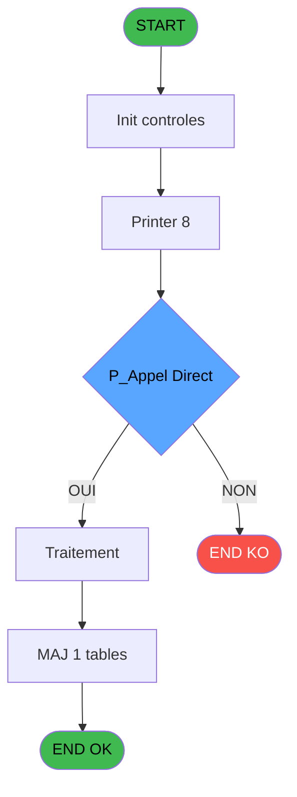
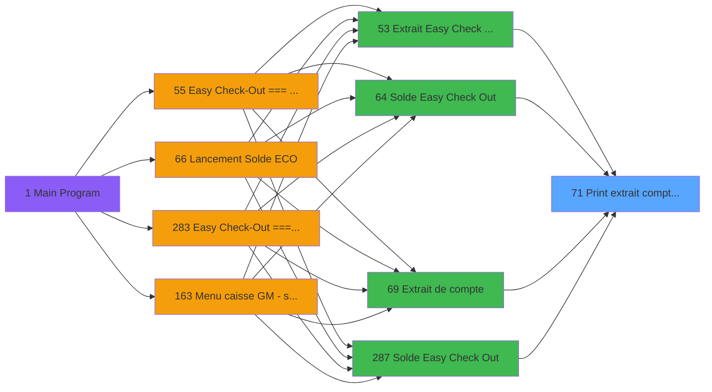
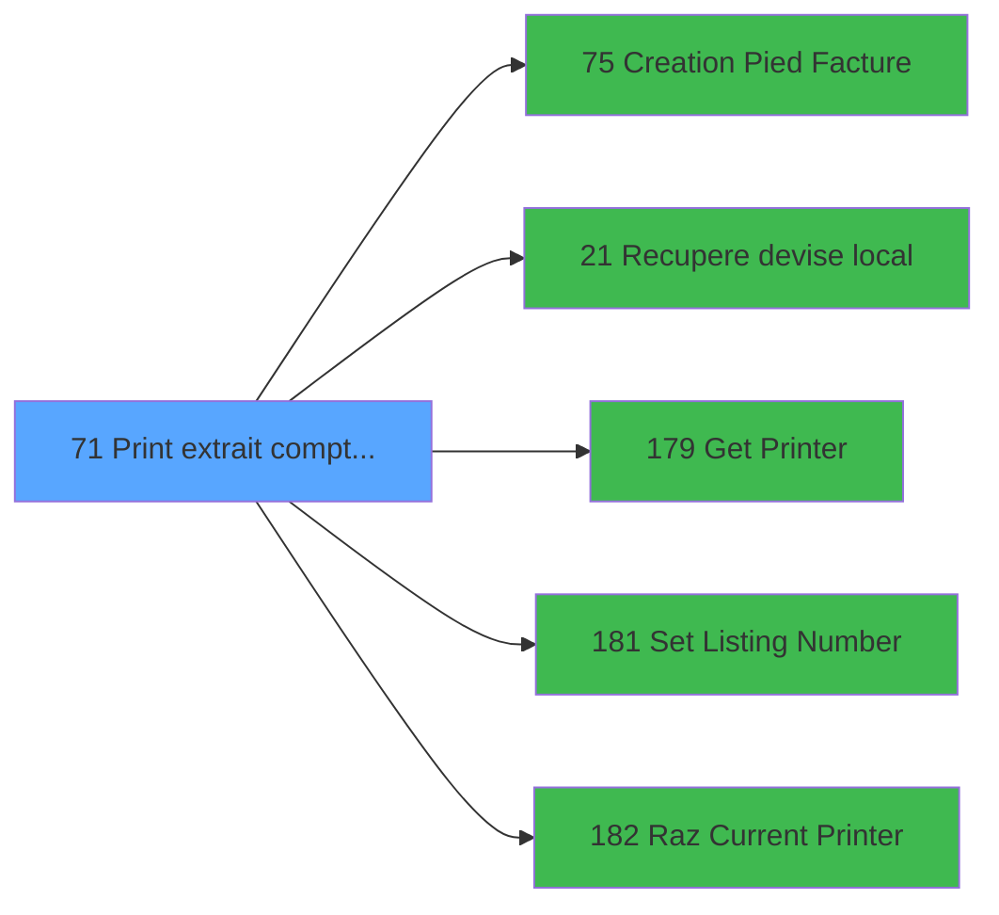

# ADH IDE 71 - Print extrait compte /Date

> **Analyse**: Phases 1-4 2026-02-07 03:43 -> 02:08 (22h24min) | Assemblage 02:08
> **Pipeline**: V7.2 Enrichi
> **Structure**: 4 onglets (Resume | Ecrans | Donnees | Connexions)

<!-- TAB:Resume -->

## 1. FICHE D'IDENTITE

| Attribut | Valeur |
|----------|--------|
| Projet | ADH |
| IDE Position | 71 |
| Nom Programme | Print extrait compte /Date |
| Fichier source | `Prg_71.xml` |
| Dossier IDE | Comptabilite |
| Taches | 24 (0 ecrans visibles) |
| Tables modifiees | 1 |
| Programmes appeles | 5 |
| Complexite | **BASSE** (score 25/100) |

## 2. DESCRIPTION FONCTIONNELLE

ADH IDE 71 affiche un extrait de compte filtré par date. Le programme récupère d'abord le nom de l'adhérent et la devise locale (EUR par défaut), puis configure l'imprimante pour débuter l'édition. L'extraction date est formattée selon les paramètres locaux avant affichage.

Le flux d'impression gère trois éléments distincts : l'en-tête avec infos adhérent, le détail des mouvements triés par date de la période sélectionnée, et le pied de facture qui récapitule les totaux. Chaque section déclenche des sous-programmes : IDE 179 valide la disponibilité imprimante, IDE 181 positionne le numéro de ligne d'édition, IDE 182 réinitialise après utilisation.

Le programme enregistre systématiquement dans `log_maj_tpe` chaque impression lancée, permettant la traçabilité des éditions. Il est appelé depuis quatre points d'entrée (IDE 69, 53, 64, 287) avec le même paramètre date, ce qui en fait le point centralisé d'édition extraits datés du module Adhérents.

## 3. BLOCS FONCTIONNELS

### 3.1 Traitement (5 taches)

Traitements internes.

---

#### 71 - Veuillez patienter... [[ECRAN]](#ecran-t1)

**Role** : Traitement : Veuillez patienter....
**Ecran** : 432 x 60 DLU (MDI) | [Voir mockup](#ecran-t1)

4 sous-taches directes

| Tache | Nom | Bloc |
|-------|-----|------|
| [71.1](#t2) | recup nom adherent | Traitement |
| [71.4.1](#t16) | Veuillez patienter... **[[ECRAN]](#ecran-t16)** | Traitement |
| [71.5.1](#t18) | Veuillez patienter... **[[ECRAN]](#ecran-t18)** | Traitement |
| [71.6.1](#t22) | Veuillez patienter... **[[ECRAN]](#ecran-t22)** | Traitement |

**Delegue a** : [Recupere devise local (IDE 21)](ADH-IDE-21.md), [Set Listing Number (IDE 181)](ADH-IDE-181.md)

---

#### 71.1 - recup nom adherent

**Role** : Consultation/chargement : recup nom adherent.
**Variables liees** : FF (W0 nom adherent), FG (W0 prenom adherent), FH (W0 n° adherent)
**Delegue a** : [Recupere devise local (IDE 21)](ADH-IDE-21.md), [Set Listing Number (IDE 181)](ADH-IDE-181.md)

---

#### 71.4.1 - Veuillez patienter... [[ECRAN]](#ecran-t16)

**Role** : Traitement : Veuillez patienter....
**Ecran** : 422 x 56 DLU (MDI) | [Voir mockup](#ecran-t16)
**Delegue a** : [Recupere devise local (IDE 21)](ADH-IDE-21.md), [Set Listing Number (IDE 181)](ADH-IDE-181.md)

---

#### 71.5.1 - Veuillez patienter... [[ECRAN]](#ecran-t18)

**Role** : Traitement : Veuillez patienter....
**Ecran** : 422 x 56 DLU (MDI) | [Voir mockup](#ecran-t18)
**Delegue a** : [Recupere devise local (IDE 21)](ADH-IDE-21.md), [Set Listing Number (IDE 181)](ADH-IDE-181.md)

---

#### 71.6.1 - Veuillez patienter... [[ECRAN]](#ecran-t22)

**Role** : Traitement : Veuillez patienter....
**Ecran** : 422 x 56 DLU (MDI) | [Voir mockup](#ecran-t22)
**Delegue a** : [Recupere devise local (IDE 21)](ADH-IDE-21.md), [Set Listing Number (IDE 181)](ADH-IDE-181.md)

### 3.2 Impression (19 taches)

Generation des documents et tickets.

---

#### 71.2 - Printer 1

**Role** : Generation du document : Printer 1.

---

#### 71.2.1 - edition extrait compte

**Role** : Generation du document : edition extrait compte.
**Variables liees** : EO (P0 n° compte), EU (P0 edition Tva V2), FB (P. Edition Auto), FK (W0 masque extrait), FQ (v. Libelle edition)

---

#### 71.2.1.1 - Edition du pied

**Role** : Generation du document : Edition du pied.
**Variables liees** : EU (P0 edition Tva V2), FB (P. Edition Auto), FQ (v. Libelle edition)

---

#### 71.2.1.2 - Edition recap Free Etra

**Role** : Generation du document : Edition recap Free Etra.
**Variables liees** : EU (P0 edition Tva V2), FB (P. Edition Auto), FQ (v. Libelle edition)

---

#### 71.2.2 - edition extrait compte

**Role** : Generation du document : edition extrait compte.
**Variables liees** : EO (P0 n° compte), EU (P0 edition Tva V2), FB (P. Edition Auto), FK (W0 masque extrait), FQ (v. Libelle edition)

---

#### 71.2.2.1 - Edition du pied

**Role** : Generation du document : Edition du pied.
**Variables liees** : EU (P0 edition Tva V2), FB (P. Edition Auto), FQ (v. Libelle edition)

---

#### 71.2.2.2 - Edition recap Free Etra

**Role** : Generation du document : Edition recap Free Etra.
**Variables liees** : EU (P0 edition Tva V2), FB (P. Edition Auto), FQ (v. Libelle edition)

---

#### 71.3 - Printer 4

**Role** : Generation du document : Printer 4.

---

#### 71.3.1 - edition extrait compte

**Role** : Generation du document : edition extrait compte.
**Variables liees** : EO (P0 n° compte), EU (P0 edition Tva V2), FB (P. Edition Auto), FK (W0 masque extrait), FQ (v. Libelle edition)

---

#### 71.3.2 - edition extrait compte

**Role** : Generation du document : edition extrait compte.
**Variables liees** : EO (P0 n° compte), EU (P0 edition Tva V2), FB (P. Edition Auto), FK (W0 masque extrait), FQ (v. Libelle edition)

---

#### 71.3.2.1 - Edition du pied

**Role** : Generation du document : Edition du pied.
**Variables liees** : EU (P0 edition Tva V2), FB (P. Edition Auto), FQ (v. Libelle edition)

---

#### 71.3.2.2 - Edition recap Free Etra

**Role** : Generation du document : Edition recap Free Etra.
**Variables liees** : EU (P0 edition Tva V2), FB (P. Edition Auto), FQ (v. Libelle edition)

---

#### 71.4 - Printer 6

**Role** : Generation du document : Printer 6.

---

#### 71.5 - Printer 8

**Role** : Generation du document : Printer 8.

---

#### 71.5.1.1 - Edition du pied

**Role** : Generation du document : Edition du pied.
**Variables liees** : EU (P0 edition Tva V2), FB (P. Edition Auto), FQ (v. Libelle edition)

---

#### 71.5.1.2 - Edition recap Free Etra

**Role** : Generation du document : Edition recap Free Etra.
**Variables liees** : EU (P0 edition Tva V2), FB (P. Edition Auto), FQ (v. Libelle edition)

---

#### 71.6 - Printer 9

**Role** : Generation du document : Printer 9.

---

#### 71.6.1.1 - Edition du pied

**Role** : Generation du document : Edition du pied.
**Variables liees** : EU (P0 edition Tva V2), FB (P. Edition Auto), FQ (v. Libelle edition)

---

#### 71.6.1.2 - Edition recap Free Etra

**Role** : Generation du document : Edition recap Free Etra.
**Variables liees** : EU (P0 edition Tva V2), FB (P. Edition Auto), FQ (v. Libelle edition)

## 5. REGLES METIER

7 regles identifiees:

### Impression (5 regles)

#### [RM-002] Verification que l'imprimante courante est la n1

| Element | Detail |
|---------|--------|
| **Condition** | `GetParam ('CURRENTPRINTERNUM')=1` |
| **Si vrai** | Action si CURRENTPRINTERNUM = 1 |
| **Expression source** | Expression 5 : `GetParam ('CURRENTPRINTERNUM')=1` |
| **Exemple** | Si GetParam ('CURRENTPRINTERNUM')=1 → Action si CURRENTPRINTERNUM = 1 |
| **Impact** | [71.2 - Printer 1](#t3) |

#### [RM-003] Verification que l'imprimante courante est la n4

| Element | Detail |
|---------|--------|
| **Condition** | `GetParam ('CURRENTPRINTERNUM')=4` |
| **Si vrai** | Action si CURRENTPRINTERNUM = 4 |
| **Expression source** | Expression 6 : `GetParam ('CURRENTPRINTERNUM')=4` |
| **Exemple** | Si GetParam ('CURRENTPRINTERNUM')=4 → Action si CURRENTPRINTERNUM = 4 |
| **Impact** | [71.2 - Printer 1](#t3) |

#### [RM-004] Verification que l'imprimante courante est la n6

| Element | Detail |
|---------|--------|
| **Condition** | `GetParam ('CURRENTPRINTERNUM')=6` |
| **Si vrai** | Action si CURRENTPRINTERNUM = 6 |
| **Expression source** | Expression 7 : `GetParam ('CURRENTPRINTERNUM')=6` |
| **Exemple** | Si GetParam ('CURRENTPRINTERNUM')=6 → Action si CURRENTPRINTERNUM = 6 |
| **Impact** | [71.2 - Printer 1](#t3) |

#### [RM-005] Verification que l'imprimante courante est la n8

| Element | Detail |
|---------|--------|
| **Condition** | `GetParam ('CURRENTPRINTERNUM')=8` |
| **Si vrai** | Action si CURRENTPRINTERNUM = 8 |
| **Expression source** | Expression 8 : `GetParam ('CURRENTPRINTERNUM')=8` |
| **Exemple** | Si GetParam ('CURRENTPRINTERNUM')=8 → Action si CURRENTPRINTERNUM = 8 |
| **Impact** | [71.2 - Printer 1](#t3) |

#### [RM-006] Verification que l'imprimante courante est la n9

| Element | Detail |
|---------|--------|
| **Condition** | `GetParam ('CURRENTPRINTERNUM')=9` |
| **Si vrai** | Action si CURRENTPRINTERNUM = 9 |
| **Expression source** | Expression 9 : `GetParam ('CURRENTPRINTERNUM')=9` |
| **Exemple** | Si GetParam ('CURRENTPRINTERNUM')=9 → Action si CURRENTPRINTERNUM = 9 |
| **Impact** | [71.2 - Printer 1](#t3) |

### Autres (2 regles)

#### [RM-001] Condition composite: IsComponent () AND NOT(P_Appel Direct [N])

| Element | Detail |
|---------|--------|
| **Condition** | `IsComponent () AND NOT(P_Appel Direct [N])` |
| **Si vrai** | Action si vrai |
| **Variables** | FA (P_Appel Direct) |
| **Expression source** | Expression 2 : `IsComponent () AND NOT(P_Appel Direct [N])` |
| **Exemple** | Si IsComponent () AND NOT(P_Appel Direct [N]) → Action si vrai |

#### [RM-007] Negation de P_FormatPDF [I] (condition inversee)

| Element | Detail |
|---------|--------|
| **Condition** | `NOT P_FormatPDF [I]` |
| **Si vrai** | Action si vrai |
| **Variables** | EV (P_FormatPDF) |
| **Expression source** | Expression 12 : `NOT P_FormatPDF [I]` |
| **Exemple** | Si NOT P_FormatPDF [I] → Action si vrai |

## 6. CONTEXTE

- **Appele par**: [Extrait de compte (IDE 69)](ADH-IDE-69.md), [Extrait Easy Check Out à J+1 (IDE 53)](ADH-IDE-53.md), [Solde Easy Check Out (IDE 64)](ADH-IDE-64.md), [Solde Easy Check Out (IDE 287)](ADH-IDE-287.md)
- **Appelle**: 5 programmes | **Tables**: 8 (W:1 R:3 L:7) | **Taches**: 24 | **Expressions**: 16

<!-- TAB:Ecrans -->

## 8. ECRANS

*(Programme sans ecran visible)*

## 9. NAVIGATION

### 9.3 Structure hierarchique (24 taches)

| Position | Tache | Type | Dimensions | Bloc |
|----------|-------|------|------------|------|
| **71.1** | [**Veuillez patienter...** (71)](#t1) [mockup](#ecran-t1) | MDI | 432x60 | Traitement |
| 71.1.1 | [recup nom adherent (71.1)](#t2) | MDI | - | |
| 71.1.2 | [Veuillez patienter... (71.4.1)](#t16) [mockup](#ecran-t16) | MDI | 422x56 | |
| 71.1.3 | [Veuillez patienter... (71.5.1)](#t18) [mockup](#ecran-t18) | MDI | 422x56 | |
| 71.1.4 | [Veuillez patienter... (71.6.1)](#t22) [mockup](#ecran-t22) | MDI | 422x56 | |
| **71.2** | [**Printer 1** (71.2)](#t3) | MDI | - | Impression |
| 71.2.1 | [edition extrait compte (71.2.1)](#t4) | MDI | - | |
| 71.2.2 | [Edition du pied (71.2.1.1)](#t5) | - | - | |
| 71.2.3 | [Edition recap Free Etra (71.2.1.2)](#t6) | - | - | |
| 71.2.4 | [edition extrait compte (71.2.2)](#t7) | MDI | - | |
| 71.2.5 | [Edition du pied (71.2.2.1)](#t8) | - | - | |
| 71.2.6 | [Edition recap Free Etra (71.2.2.2)](#t9) | - | - | |
| 71.2.7 | [Printer 4 (71.3)](#t10) | MDI | - | |
| 71.2.8 | [edition extrait compte (71.3.1)](#t11) | MDI | - | |
| 71.2.9 | [edition extrait compte (71.3.2)](#t12) | MDI | - | |
| 71.2.10 | [Edition du pied (71.3.2.1)](#t13) | - | - | |
| 71.2.11 | [Edition recap Free Etra (71.3.2.2)](#t14) | - | - | |
| 71.2.12 | [Printer 6 (71.4)](#t15) | MDI | - | |
| 71.2.13 | [Printer 8 (71.5)](#t17) | MDI | - | |
| 71.2.14 | [Edition du pied (71.5.1.1)](#t19) | - | - | |
| 71.2.15 | [Edition recap Free Etra (71.5.1.2)](#t20) | - | - | |
| 71.2.16 | [Printer 9 (71.6)](#t21) | MDI | - | |
| 71.2.17 | [Edition du pied (71.6.1.1)](#t23) | - | - | |
| 71.2.18 | [Edition recap Free Etra (71.6.1.2)](#t24) | - | - | |

### 9.4 Algorigramme

> **Legende**: Vert = START/END OK | Rouge = END KO | Bleu = Decisions
> *Algorigramme auto-genere. Utiliser `/algorigramme` pour une synthese metier detaillee.*

<!-- TAB:Donnees -->

## 10. TABLES

### Tables utilisees (8)

| ID | Nom | Description | Type | R | W | L | Usages |
|----|-----|-------------|------|---|---|---|--------|
| 867 | log_maj_tpe |  | DB |   | **W** |   | 5 |
| 40 | comptable________cte |  | DB | R |   | L | 12 |
| 31 | gm-complet_______gmc |  | DB | R |   | L | 10 |
| 30 | gm-recherche_____gmr | Index de recherche | DB | R |   | L | 8 |
| 928 | type_lit |  | DB |   |   | L | 2 |
| 413 | pv_tva |  | DB |   |   | L | 1 |
| 400 | pv_cust_rentals |  | DB |   |   | L | 1 |
| 34 | hebergement______heb | Hebergement (chambres) | DB |   |   | L | 1 |

### Colonnes par table (1 / 4 tables avec colonnes identifiees)

Table 867 - log_maj_tpe (**W**) - 5 usages

*Table utilisee uniquement en Link ou aucune colonne Real identifiee dans le DataView.*

Table 40 - comptable________cte (R/L) - 12 usages

| Lettre | Variable | Acces | Type |
|--------|----------|-------|------|
| A | W1 solde compte | R | Numeric |
| B | v.retour offre | R | Logical |
| C | W1 normal | R | Alpha |
| D | W1 condense | R | Alpha |
| E | W1 detecteur papier | R | Alpha |
| F | W1 inhibe panel | R | Alpha |
| G | W1 massicot | R | Alpha |
| H | W1 selection feuille | R | Alpha |
| I | W1 selection rouleau | R | Alpha |
| J | W1 solde compte | R | Numeric |
| K | v.retour special offer | R | Logical |

Table 31 - gm-complet_______gmc (R/L) - 10 usages

*Table utilisee uniquement en Link ou aucune colonne Real identifiee dans le DataView.*

Table 30 - gm-recherche_____gmr (R/L) - 8 usages

*Table utilisee uniquement en Link ou aucune colonne Real identifiee dans le DataView.*

## 11. VARIABLES

### 11.1 Parametres entrants (11)

Variables recues du programme appelant ([Extrait de compte (IDE 69)](ADH-IDE-69.md)).

| Lettre | Nom | Type | Usage dans |
|--------|-----|------|-----------|
| EN | P0 societe | Alpha | - |
| EO | P0 n° compte | Numeric | - |
| EP | P0 filiation | Numeric | - |
| EQ | P0 masque montant | Alpha | 1x parametre entrant |
| ER | P0 nom village | Alpha | - |
| ES | P0 fictif | Logical | - |
| ET | P0 date comptable | Date | - |
| EU | P0 edition Tva V2 | Logical | - |
| FB | P. Edition Auto | Logical | - |
| FC | P.i.Nom Fichier I/O | Unicode | - |
| FD | P. Sans annulations | Logical | - |

### 11.2 Variables de session (2)

Variables persistantes pendant toute la session.

| Lettre | Nom | Type | Usage dans |
|--------|-----|------|-----------|
| FQ | v. Libelle edition | Alpha | - |
| FR | v. Libelle Categ | Alpha | - |

### 11.3 Variables de travail (13)

Variables internes au programme.

| Lettre | Nom | Type | Usage dans |
|--------|-----|------|-----------|
| FE | W0 titre | Alpha | - |
| FF | W0 nom adherent | Alpha | - |
| FG | W0 prenom adherent | Alpha | - |
| FH | W0 n° adherent | Numeric | - |
| FI | W0 lettre contrôle | Alpha | - |
| FJ | W0 filiation | Numeric | - |
| FK | W0 masque extrait | Alpha | - |
| FL | W0 langue parlee | Alpha | - |
| FM | W0 chambre | Alpha | - |
| FN | W0 Date debut Sejour | Date | - |
| FO | W0 Fin debut Sejour | Date | - |
| FP | W0 code inscription | Unicode | - |
| FS | W0 devise locale | Alpha | - |

### 11.4 Autres (6)

Variables diverses.

| Lettre | Nom | Type | Usage dans |
|--------|-----|------|-----------|
| EV | P_FormatPDF | Logical | 1x refs |
| EW | P_Chemin | Alpha | - |
| EX | P_NomFichierPDF | Alpha | - |
| EY | P_Print or Mail | Alpha | - |
| EZ | P_Print GIFT PASS | Logical | - |
| FA | P_Appel Direct | Logical | 1x refs |

Toutes les 32 variables (liste complete)

| Cat | Lettre | Nom Variable | Type |
|-----|--------|--------------|------|
| P0 | **EN** | P0 societe | Alpha |
| P0 | **EO** | P0 n° compte | Numeric |
| P0 | **EP** | P0 filiation | Numeric |
| P0 | **EQ** | P0 masque montant | Alpha |
| P0 | **ER** | P0 nom village | Alpha |
| P0 | **ES** | P0 fictif | Logical |
| P0 | **ET** | P0 date comptable | Date |
| P0 | **EU** | P0 edition Tva V2 | Logical |
| P0 | **FB** | P. Edition Auto | Logical |
| P0 | **FC** | P.i.Nom Fichier I/O | Unicode |
| P0 | **FD** | P. Sans annulations | Logical |
| W0 | **FE** | W0 titre | Alpha |
| W0 | **FF** | W0 nom adherent | Alpha |
| W0 | **FG** | W0 prenom adherent | Alpha |
| W0 | **FH** | W0 n° adherent | Numeric |
| W0 | **FI** | W0 lettre contrôle | Alpha |
| W0 | **FJ** | W0 filiation | Numeric |
| W0 | **FK** | W0 masque extrait | Alpha |
| W0 | **FL** | W0 langue parlee | Alpha |
| W0 | **FM** | W0 chambre | Alpha |
| W0 | **FN** | W0 Date debut Sejour | Date |
| W0 | **FO** | W0 Fin debut Sejour | Date |
| W0 | **FP** | W0 code inscription | Unicode |
| W0 | **FS** | W0 devise locale | Alpha |
| V. | **FQ** | v. Libelle edition | Alpha |
| V. | **FR** | v. Libelle Categ | Alpha |
| Autre | **EV** | P_FormatPDF | Logical |
| Autre | **EW** | P_Chemin | Alpha |
| Autre | **EX** | P_NomFichierPDF | Alpha |
| Autre | **EY** | P_Print or Mail | Alpha |
| Autre | **EZ** | P_Print GIFT PASS | Logical |
| Autre | **FA** | P_Appel Direct | Logical |

## 12. EXPRESSIONS

**16 / 16 expressions decodees (100%)**

### 12.1 Repartition par type

| Type | Expressions | Regles |
|------|-------------|--------|
| CALCULATION | 1 | 0 |
| CONDITION | 6 | 6 |
| NEGATION | 1 | 5 |
| CONSTANTE | 2 | 0 |
| OTHER | 4 | 0 |
| CAST_LOGIQUE | 2 | 0 |

### 12.2 Expressions cles par type

#### CALCULATION (1 expressions)

| Type | IDE | Expression | Regle |
|------|-----|------------|-------|
| CALCULATION | 10 | `Left (P0 masque montant [D],Len (RTrim (P0 masque montant [D]))-1)` | - |

#### CONDITION (6 expressions)

| Type | IDE | Expression | Regle |
|------|-----|------------|-------|
| CONDITION | 7 | `GetParam ('CURRENTPRINTERNUM')=6` | [RM-004](#rm-RM-004) |
| CONDITION | 8 | `GetParam ('CURRENTPRINTERNUM')=8` | [RM-005](#rm-RM-005) |
| CONDITION | 9 | `GetParam ('CURRENTPRINTERNUM')=9` | [RM-006](#rm-RM-006) |
| CONDITION | 2 | `IsComponent () AND NOT(P_Appel Direct [N])` | [RM-001](#rm-RM-001) |
| CONDITION | 5 | `GetParam ('CURRENTPRINTERNUM')=1` | [RM-002](#rm-RM-002) |
| ... | | *+1 autres* | |

#### NEGATION (1 expressions)

| Type | IDE | Expression | Regle |
|------|-----|------------|-------|
| NEGATION | 12 | `NOT P_FormatPDF [I]` | [RM-007](#rm-RM-007) |

#### CONSTANTE (2 expressions)

| Type | IDE | Expression | Regle |
|------|-----|------------|-------|
| CONSTANTE | 15 | `'Par Date / By Date'` | - |
| CONSTANTE | 14 | `'Extrait de compte / Account statement'` | - |

#### OTHER (4 expressions)

| Type | IDE | Expression | Regle |
|------|-----|------------|-------|
| OTHER | 4 | `SetCrsr (2)` | - |
| OTHER | 11 | `DbDel ('{867,4}'DSOURCE,'')` | - |
| OTHER | 1 | `GetParam ('LISTINGNUMPRINTERCHOICE')` | - |
| OTHER | 3 | `SetCrsr (1)` | - |

#### CAST_LOGIQUE (2 expressions)

| Type | IDE | Expression | Regle |
|------|-----|------------|-------|
| CAST_LOGIQUE | 16 | `'TRUE'LOG` | - |
| CAST_LOGIQUE | 13 | `INIPut('EmbedFonts=N','FALSE'LOG)` | - |

<!-- TAB:Connexions -->

## 13. GRAPHE D'APPELS

### 13.1 Chaine depuis Main (Callers)

Main -> ... -> [Extrait de compte (IDE 69)](ADH-IDE-69.md) -> **Print extrait compte /Date (IDE 71)**

Main -> ... -> [Extrait Easy Check Out à J+1 (IDE 53)](ADH-IDE-53.md) -> **Print extrait compte /Date (IDE 71)**

Main -> ... -> [Solde Easy Check Out (IDE 64)](ADH-IDE-64.md) -> **Print extrait compte /Date (IDE 71)**

Main -> ... -> [Solde Easy Check Out (IDE 287)](ADH-IDE-287.md) -> **Print extrait compte /Date (IDE 71)**

### 13.2 Callers

| IDE | Nom Programme | Nb Appels |
|-----|---------------|-----------|
| [69](ADH-IDE-69.md) | Extrait de compte | 2 |
| [53](ADH-IDE-53.md) | Extrait Easy Check Out à J+1 | 1 |
| [64](ADH-IDE-64.md) | Solde Easy Check Out | 1 |
| [287](ADH-IDE-287.md) | Solde Easy Check Out | 1 |

### 13.3 Callees (programmes appeles)

### 13.4 Detail Callees avec contexte

| IDE | Nom Programme | Appels | Contexte |
|-----|---------------|--------|----------|
| [75](ADH-IDE-75.md) | Creation Pied Facture | 5 | Sous-programme |
| [21](ADH-IDE-21.md) | Recupere devise local | 1 | Recuperation donnees |
| [179](ADH-IDE-179.md) | Get Printer | 1 | Impression ticket/document |
| [181](ADH-IDE-181.md) | Set Listing Number | 1 | Configuration impression |
| [182](ADH-IDE-182.md) | Raz Current Printer | 1 | Impression ticket/document |

## 14. RECOMMANDATIONS MIGRATION

### 14.1 Profil du programme

| Metrique | Valeur | Impact migration |
|----------|--------|-----------------|
| Lignes de logique | 780 | Programme volumineux |
| Expressions | 16 | Peu de logique |
| Tables WRITE | 1 | Impact faible |
| Sous-programmes | 5 | Peu de dependances |
| Ecrans visibles | 0 | Ecran unique ou traitement batch |
| Code desactive | 0.1% (1 / 780) | Code sain |
| Regles metier | 7 | Quelques regles a preserver |

### 14.2 Plan de migration par bloc

#### Traitement (5 taches: 4 ecrans, 1 traitement)

- **Strategie** : Orchestrateur avec 4 ecrans (Razor/React) et 1 traitements backend (services).
- Les ecrans deviennent des composants UI, les traitements invisibles deviennent des services injectables.
- 5 sous-programme(s) a migrer ou a reutiliser depuis les services existants.
- Decomposer les taches en services unitaires testables.

#### Impression (19 taches: 0 ecran, 19 traitements)

- **Strategie** : Templates HTML -> PDF via wkhtmltopdf ou Puppeteer.
- `PrintService` injectable avec choix imprimante

### 14.3 Dependances critiques

| Dependance | Type | Appels | Impact |
|------------|------|--------|--------|
| log_maj_tpe | Table WRITE (Database) | 5x | Schema + repository |
| [Creation Pied Facture (IDE 75)](ADH-IDE-75.md) | Sous-programme | 5x | **CRITIQUE** - Sous-programme |
| [Set Listing Number (IDE 181)](ADH-IDE-181.md) | Sous-programme | 1x | Normale - Configuration impression |
| [Raz Current Printer (IDE 182)](ADH-IDE-182.md) | Sous-programme | 1x | Normale - Impression ticket/document |
| [Recupere devise local (IDE 21)](ADH-IDE-21.md) | Sous-programme | 1x | Normale - Recuperation donnees |
| [Get Printer (IDE 179)](ADH-IDE-179.md) | Sous-programme | 1x | Normale - Impression ticket/document |

---
*Spec DETAILED generee par Pipeline V7.2 - 2026-02-08 02:09*
