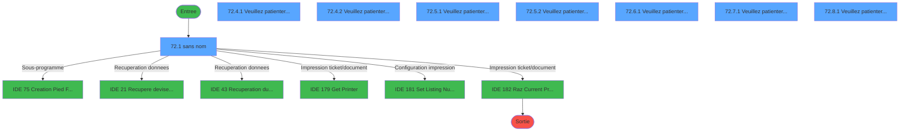
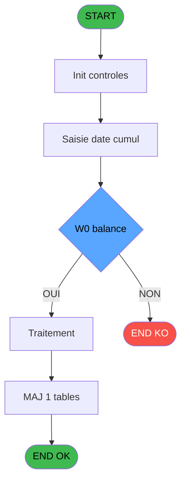
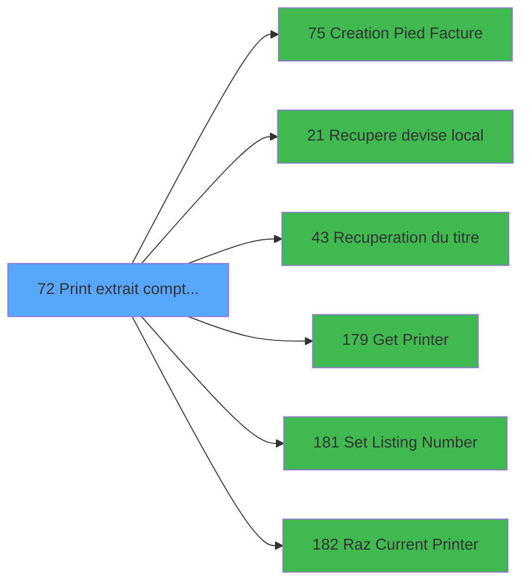

# ADH IDE 72 - Print extrait compte /Cum

> **Analyse**: Phases 1-4 2026-02-07 03:44 -> 02:09 (22h25min) | Assemblage 02:09
> **Pipeline**: V7.2 Enrichi
> **Structure**: 4 onglets (Resume | Ecrans | Donnees | Connexions)

<!-- TAB:Resume -->

## 1. FICHE D'IDENTITE

| Attribut | Valeur |
|----------|--------|
| Projet | ADH |
| IDE Position | 72 |
| Nom Programme | Print extrait compte /Cum |
| Fichier source | `Prg_72.xml` |
| Dossier IDE | Comptabilite |
| Taches | 27 (8 ecrans visibles) |
| Tables modifiees | 1 |
| Programmes appeles | 6 |
| Complexite | **BASSE** (score 30/100) |

## 2. DESCRIPTION FONCTIONNELLE

ADH IDE 72 édite l'extrait de compte cumulé pour un adhérent. Le programme récupère d'abord les informations de base (nom adhérent, solde global), puis initialise l'imprimante via les outils d'impression (Get Printer, Set Listing Number). L'affichage montre un écran "Veuillez patienter..." pendant le traitement.

Le cœur du traitement s'articule en trois phases. Premièrement, il génère l'en-tête avec le titre du document (récupéré via IDE 43) et la devise locale (IDE 21) pour contextualiser les montants. Deuxièmement, il édite le récapitulatif des mouvements, probablement en consolidant les opérations par service ou type (d'où le lien vers IDE 0 "Print extrait /Service"). Troisièmement, il finalise le document avec le pied de facture via IDE 75.

À la fermeture, le programme enregistre dans `log_maj_tpe` (table de audit/logs) et libère l'imprimante (Raz Current Printer, IDE 182). L'enchaînement suggère un workflow standard d'édition : initialisation → contenu → pied → cleanup.

## 3. BLOCS FONCTIONNELS

### 3.1 Traitement (11 taches)

Traitements internes.

---

#### 72 - (sans nom)

**Role** : Tache d'orchestration : point d'entree du programme (11 sous-taches). Coordonne l'enchainement des traitements.

10 sous-taches directes

| Tache | Nom | Bloc |
|-------|-----|------|
| [72.1](#t2) | (sans nom) **[[ECRAN]](#ecran-t2)** | Traitement |
| [72.2](#t3) | recup nom adherent | Traitement |
| [72.3](#t4) | Balance | Traitement |
| [72.4.1](#t6) | Veuillez patienter... **[[ECRAN]](#ecran-t6)** | Traitement |
| [72.4.2](#t9) | Veuillez patienter... **[[ECRAN]](#ecran-t9)** | Traitement |
| [72.5.1](#t13) | Veuillez patienter... **[[ECRAN]](#ecran-t13)** | Traitement |
| [72.5.2](#t16) | Veuillez patienter... **[[ECRAN]](#ecran-t16)** | Traitement |
| [72.6.1](#t19) | Veuillez patienter... **[[ECRAN]](#ecran-t19)** | Traitement |
| [72.7.1](#t21) | Veuillez patienter... **[[ECRAN]](#ecran-t21)** | Traitement |
| [72.8.1](#t25) | Veuillez patienter... **[[ECRAN]](#ecran-t25)** | Traitement |

---

#### 72.1 - (sans nom) [[ECRAN]](#ecran-t2)

**Role** : Traitement interne.
**Ecran** : 533 x 92 DLU (MDI) | [Voir mockup](#ecran-t2)

---

#### 72.2 - recup nom adherent

**Role** : Consultation/chargement : recup nom adherent.
**Variables liees** : FC (W0 nom adherent), FD (W0 prenom adherent), FE (W0 n° adherent)

---

#### 72.3 - Balance

**Role** : Traitement : Balance.
**Variables liees** : FH (W0 balance)

---

#### 72.4.1 - Veuillez patienter... [[ECRAN]](#ecran-t6)

**Role** : Traitement : Veuillez patienter....
**Ecran** : 422 x 56 DLU (MDI) | [Voir mockup](#ecran-t6)

---

#### 72.4.2 - Veuillez patienter... [[ECRAN]](#ecran-t9)

**Role** : Traitement : Veuillez patienter....
**Ecran** : 422 x 56 DLU (MDI) | [Voir mockup](#ecran-t9)

---

#### 72.5.1 - Veuillez patienter... [[ECRAN]](#ecran-t13)

**Role** : Traitement : Veuillez patienter....
**Ecran** : 422 x 56 DLU (MDI) | [Voir mockup](#ecran-t13)

---

#### 72.5.2 - Veuillez patienter... [[ECRAN]](#ecran-t16)

**Role** : Traitement : Veuillez patienter....
**Ecran** : 422 x 56 DLU (MDI) | [Voir mockup](#ecran-t16)

---

#### 72.6.1 - Veuillez patienter... [[ECRAN]](#ecran-t19)

**Role** : Traitement : Veuillez patienter....
**Ecran** : 422 x 57 DLU (MDI) | [Voir mockup](#ecran-t19)

---

#### 72.7.1 - Veuillez patienter... [[ECRAN]](#ecran-t21)

**Role** : Traitement : Veuillez patienter....
**Ecran** : 422 x 57 DLU (MDI) | [Voir mockup](#ecran-t21)

---

#### 72.8.1 - Veuillez patienter... [[ECRAN]](#ecran-t25)

**Role** : Traitement : Veuillez patienter....
**Ecran** : 422 x 57 DLU (MDI) | [Voir mockup](#ecran-t25)

### 3.2 Impression (16 taches)

Generation des documents et tickets.

---

#### 72.4 - Printer 1 [[ECRAN]](#ecran-t5)

**Role** : Generation du document : Printer 1.
**Ecran** : 422 x 56 DLU (MDI) | [Voir mockup](#ecran-t5)

---

#### 72.4.1.1 - Edition du pied

**Role** : Generation du document : Edition du pied.

---

#### 72.4.1.2 - Edition recap Free Etra

**Role** : Generation du document : Edition recap Free Etra.

---

#### 72.4.2.1 - Edition du pied

**Role** : Generation du document : Edition du pied.

---

#### 72.4.2.2 - Edition recap Free Etra

**Role** : Generation du document : Edition recap Free Etra.

---

#### 72.5 - Printer 4 [[ECRAN]](#ecran-t12)

**Role** : Generation du document : Printer 4.
**Ecran** : 422 x 56 DLU (MDI) | [Voir mockup](#ecran-t12)

---

#### 72.5.1.1 - Edition du pied

**Role** : Generation du document : Edition du pied.

---

#### 72.5.1.2 - Edition recap Free Etra

**Role** : Generation du document : Edition recap Free Etra.

---

#### 72.5.2.1 - Edition recap Free Etra

**Role** : Generation du document : Edition recap Free Etra.

---

#### 72.6 - Printer 6 [[ECRAN]](#ecran-t18)

**Role** : Generation du document : Printer 6.
**Ecran** : 422 x 56 DLU (MDI) | [Voir mockup](#ecran-t18)

---

#### 72.7 - Printer 8 [[ECRAN]](#ecran-t20)

**Role** : Generation du document : Printer 8.
**Ecran** : 422 x 56 DLU (MDI) | [Voir mockup](#ecran-t20)

---

#### 72.7.1.1 - Edition du pied

**Role** : Generation du document : Edition du pied.

---

#### 72.7.1.2 - Edition recap Free Etra

**Role** : Generation du document : Edition recap Free Etra.

---

#### 72.8 - Printer 9 [[ECRAN]](#ecran-t24)

**Role** : Generation du document : Printer 9.
**Ecran** : 422 x 56 DLU (MDI) | [Voir mockup](#ecran-t24)

---

#### 72.8.1.1 - Edition du pied

**Role** : Generation du document : Edition du pied.

---

#### 72.8.1.2 - Edition recap Free Etra

**Role** : Generation du document : Edition recap Free Etra.

## 5. REGLES METIER

6 regles identifiees:

### Impression (5 regles)

#### [RM-002] Verification que l'imprimante courante est la n1

| Element | Detail |
|---------|--------|
| **Condition** | `GetParam ('CURRENTPRINTERNUM')=1` |
| **Si vrai** | Action si CURRENTPRINTERNUM = 1 |
| **Expression source** | Expression 7 : `GetParam ('CURRENTPRINTERNUM')=1` |
| **Exemple** | Si GetParam ('CURRENTPRINTERNUM')=1 → Action si CURRENTPRINTERNUM = 1 |
| **Impact** | [72.4 - Printer 1](#t5) |

#### [RM-003] Verification que l'imprimante courante est la n4

| Element | Detail |
|---------|--------|
| **Condition** | `GetParam ('CURRENTPRINTERNUM')=4` |
| **Si vrai** | Action si CURRENTPRINTERNUM = 4 |
| **Expression source** | Expression 8 : `GetParam ('CURRENTPRINTERNUM')=4` |
| **Exemple** | Si GetParam ('CURRENTPRINTERNUM')=4 → Action si CURRENTPRINTERNUM = 4 |
| **Impact** | [72.4 - Printer 1](#t5) |

#### [RM-004] Verification que l'imprimante courante est la n6

| Element | Detail |
|---------|--------|
| **Condition** | `GetParam ('CURRENTPRINTERNUM')=6` |
| **Si vrai** | Action si CURRENTPRINTERNUM = 6 |
| **Expression source** | Expression 9 : `GetParam ('CURRENTPRINTERNUM')=6` |
| **Exemple** | Si GetParam ('CURRENTPRINTERNUM')=6 → Action si CURRENTPRINTERNUM = 6 |
| **Impact** | [72.4 - Printer 1](#t5) |

#### [RM-005] Verification que l'imprimante courante est la n8

| Element | Detail |
|---------|--------|
| **Condition** | `GetParam ('CURRENTPRINTERNUM')=8` |
| **Si vrai** | Action si CURRENTPRINTERNUM = 8 |
| **Expression source** | Expression 10 : `GetParam ('CURRENTPRINTERNUM')=8` |
| **Exemple** | Si GetParam ('CURRENTPRINTERNUM')=8 → Action si CURRENTPRINTERNUM = 8 |
| **Impact** | [72.4 - Printer 1](#t5) |

#### [RM-006] Verification que l'imprimante courante est la n9

| Element | Detail |
|---------|--------|
| **Condition** | `GetParam ('CURRENTPRINTERNUM')=9` |
| **Si vrai** | Action si CURRENTPRINTERNUM = 9 |
| **Expression source** | Expression 11 : `GetParam ('CURRENTPRINTERNUM')=9` |
| **Exemple** | Si GetParam ('CURRENTPRINTERNUM')=9 → Action si CURRENTPRINTERNUM = 9 |
| **Impact** | [72.4 - Printer 1](#t5) |

### Autres (1 regles)

#### [RM-001] Verification: IsComponent

| Element | Detail |
|---------|--------|
| **Condition** | `IsComponent ()` |
| **Si vrai** | Action si vrai |
| **Expression source** | Expression 2 : `IsComponent ()` |
| **Exemple** | Si IsComponent () → Action si vrai |

## 6. CONTEXTE

- **Appele par**: [Print extrait compte /Service (IDE 0)](ADH-IDE-0.md), [Extrait de compte (IDE 69)](ADH-IDE-69.md)
- **Appelle**: 6 programmes | **Tables**: 6 (W:1 R:3 L:5) | **Taches**: 27 | **Expressions**: 13

<!-- TAB:Ecrans -->

## 8. ECRANS

### 8.1 Forms visibles (8 / 27)

| # | Position | Tache | Nom | Type | Largeur | Hauteur | Bloc |
|---|----------|-------|-----|------|---------|---------|------|
| 1 | 72.1 | 72.1 | (sans nom) | MDI | 533 | 92 | Traitement |
| 2 | 72.4.1 | 72.4.1 | Veuillez patienter... | MDI | 422 | 56 | Traitement |
| 3 | 72.4.2 | 72.4.2 | Veuillez patienter... | MDI | 422 | 56 | Traitement |
| 4 | 72.5.1 | 72.5.1 | Veuillez patienter... | MDI | 422 | 56 | Traitement |
| 5 | 72.5.2 | 72.5.2 | Veuillez patienter... | MDI | 422 | 56 | Traitement |
| 6 | 72.6.1 | 72.6.1 | Veuillez patienter... | MDI | 422 | 57 | Traitement |
| 7 | 72.7.1 | 72.7.1 | Veuillez patienter... | MDI | 422 | 57 | Traitement |
| 8 | 72.8.1 | 72.8.1 | Veuillez patienter... | MDI | 422 | 57 | Traitement |

### 8.2 Mockups Ecrans

---

#### 72.1 - (sans nom)
**Tache** : [72.1](#t2) | **Type** : MDI | **Dimensions** : 533 x 92 DLU
**Bloc** : Traitement | **Titre IDE** : (sans nom)

<!-- FORM-DATA:
{
    "width":  533,
    "vFactor":  8,
    "type":  "MDI",
    "hFactor":  8,
    "controls":  [
                     {
                         "x":  0,
                         "type":  "label",
                         "var":  "",
                         "y":  0,
                         "w":  533,
                         "fmt":  "",
                         "name":  "",
                         "h":  18,
                         "color":  "",
                         "text":  "",
                         "parent":  null
                     },
                     {
                         "x":  158,
                         "type":  "label",
                         "var":  "",
                         "y":  39,
                         "w":  127,
                         "fmt":  "",
                         "name":  "",
                         "h":  8,
                         "color":  "4",
                         "text":  "Cumulé au",
                         "parent":  null
                     },
                     {
                         "x":  0,
                         "type":  "label",
                         "var":  "",
                         "y":  68,
                         "w":  531,
                         "fmt":  "",
                         "name":  "",
                         "h":  24,
                         "color":  "",
                         "text":  "",
                         "parent":  null
                     },
                     {
                         "x":  306,
                         "type":  "edit",
                         "var":  "",
                         "y":  38,
                         "w":  126,
                         "fmt":  "DD/MM/YYYYA",
                         "name":  "",
                         "h":  10,
                         "color":  "6",
                         "text":  "",
                         "parent":  null
                     },
                     {
                         "x":  6,
                         "type":  "button",
                         "var":  "",
                         "y":  72,
                         "w":  154,
                         "fmt":  "\u0026Ok",
                         "name":  "",
                         "h":  18,
                         "color":  "",
                         "text":  "",
                         "parent":  7
                     },
                     {
                         "x":  269,
                         "type":  "edit",
                         "var":  "",
                         "y":  5,
                         "w":  256,
                         "fmt":  "WWW DD MMM YYYYT",
                         "name":  "",
                         "h":  8,
                         "color":  "",
                         "text":  "",
                         "parent":  1
                     },
                     {
                         "x":  7,
                         "type":  "image",
                         "var":  "",
                         "y":  21,
                         "w":  128,
                         "fmt":  "",
                         "name":  "",
                         "h":  45,
                         "color":  "4",
                         "text":  "",
                         "parent":  null
                     },
                     {
                         "x":  173,
                         "type":  "button",
                         "var":  "",
                         "y":  72,
                         "w":  154,
                         "fmt":  "A\u0026bandonner",
                         "name":  "",
                         "h":  18,
                         "color":  "",
                         "text":  "",
                         "parent":  null
                     },
                     {
                         "x":  7,
                         "type":  "edit",
                         "var":  "",
                         "y":  4,
                         "w":  267,
                         "fmt":  "20",
                         "name":  "",
                         "h":  8,
                         "color":  "",
                         "text":  "",
                         "parent":  1
                     }
                 ],
    "taskId":  "72.1",
    "height":  92
}
-->

<strong>Champs : 3 champs</strong>

| Pos (x,y) | Nom | Variable | Type |
|-----------|-----|----------|------|
| 306,38 | DD/MM/YYYYA | - | edit |
| 269,5 | WWW DD MMM YYYYT | - | edit |
| 7,4 | 20 | - | edit |

<strong>Boutons : 2 boutons</strong>

| Bouton | Pos (x,y) | Action |
|--------|-----------|--------|
| Ok | 6,72 | Valide la saisie et enregistre |
| Abandonner | 173,72 | Annule et retour au menu |

---

#### 72.4.1 - Veuillez patienter...
**Tache** : [72.4.1](#t6) | **Type** : MDI | **Dimensions** : 422 x 56 DLU
**Bloc** : Traitement | **Titre IDE** : Veuillez patienter...

<!-- FORM-DATA:
{
    "width":  422,
    "vFactor":  8,
    "type":  "MDI",
    "hFactor":  8,
    "controls":  [
                     {
                         "x":  0,
                         "type":  "label",
                         "var":  "",
                         "y":  0,
                         "w":  423,
                         "fmt":  "",
                         "name":  "",
                         "h":  29,
                         "color":  "",
                         "text":  "",
                         "parent":  null
                     },
                     {
                         "x":  120,
                         "type":  "label",
                         "var":  "",
                         "y":  10,
                         "w":  221,
                         "fmt":  "",
                         "name":  "",
                         "h":  8,
                         "color":  "7",
                         "text":  "Impression en cours ...",
                         "parent":  null
                     },
                     {
                         "x":  0,
                         "type":  "label",
                         "var":  "",
                         "y":  29,
                         "w":  423,
                         "fmt":  "",
                         "name":  "",
                         "h":  27,
                         "color":  "",
                         "text":  "",
                         "parent":  null
                     },
                     {
                         "x":  34,
                         "type":  "label",
                         "var":  "",
                         "y":  38,
                         "w":  355,
                         "fmt":  "",
                         "name":  "",
                         "h":  8,
                         "color":  "",
                         "text":  "Edition de l\u0027extrait de compte cumule",
                         "parent":  null
                     },
                     {
                         "x":  4,
                         "type":  "image",
                         "var":  "",
                         "y":  2,
                         "w":  72,
                         "fmt":  "",
                         "name":  "",
                         "h":  25,
                         "color":  "",
                         "text":  "",
                         "parent":  null
                     }
                 ],
    "taskId":  "72.4.1",
    "height":  56
}
-->

---

#### 72.4.2 - Veuillez patienter...
**Tache** : [72.4.2](#t9) | **Type** : MDI | **Dimensions** : 422 x 56 DLU
**Bloc** : Traitement | **Titre IDE** : Veuillez patienter...

<!-- FORM-DATA:
{
    "width":  422,
    "vFactor":  8,
    "type":  "MDI",
    "hFactor":  8,
    "controls":  [
                     {
                         "x":  0,
                         "type":  "label",
                         "var":  "",
                         "y":  0,
                         "w":  423,
                         "fmt":  "",
                         "name":  "",
                         "h":  29,
                         "color":  "",
                         "text":  "",
                         "parent":  null
                     },
                     {
                         "x":  120,
                         "type":  "label",
                         "var":  "",
                         "y":  10,
                         "w":  221,
                         "fmt":  "",
                         "name":  "",
                         "h":  8,
                         "color":  "7",
                         "text":  "Impression en cours ...",
                         "parent":  null
                     },
                     {
                         "x":  0,
                         "type":  "label",
                         "var":  "",
                         "y":  29,
                         "w":  423,
                         "fmt":  "",
                         "name":  "",
                         "h":  27,
                         "color":  "",
                         "text":  "",
                         "parent":  null
                     },
                     {
                         "x":  34,
                         "type":  "label",
                         "var":  "",
                         "y":  38,
                         "w":  355,
                         "fmt":  "",
                         "name":  "",
                         "h":  8,
                         "color":  "",
                         "text":  "Edition de l\u0027extrait de compte cumule",
                         "parent":  null
                     },
                     {
                         "x":  4,
                         "type":  "image",
                         "var":  "",
                         "y":  2,
                         "w":  72,
                         "fmt":  "",
                         "name":  "",
                         "h":  25,
                         "color":  "",
                         "text":  "",
                         "parent":  null
                     }
                 ],
    "taskId":  "72.4.2",
    "height":  56
}
-->

---

#### 72.5.1 - Veuillez patienter...
**Tache** : [72.5.1](#t13) | **Type** : MDI | **Dimensions** : 422 x 56 DLU
**Bloc** : Traitement | **Titre IDE** : Veuillez patienter...

<!-- FORM-DATA:
{
    "width":  422,
    "vFactor":  8,
    "type":  "MDI",
    "hFactor":  8,
    "controls":  [
                     {
                         "x":  0,
                         "type":  "label",
                         "var":  "",
                         "y":  0,
                         "w":  423,
                         "fmt":  "",
                         "name":  "",
                         "h":  29,
                         "color":  "",
                         "text":  "",
                         "parent":  null
                     },
                     {
                         "x":  120,
                         "type":  "label",
                         "var":  "",
                         "y":  10,
                         "w":  221,
                         "fmt":  "",
                         "name":  "",
                         "h":  8,
                         "color":  "7",
                         "text":  "Impression en cours ...",
                         "parent":  null
                     },
                     {
                         "x":  0,
                         "type":  "label",
                         "var":  "",
                         "y":  29,
                         "w":  423,
                         "fmt":  "",
                         "name":  "",
                         "h":  27,
                         "color":  "",
                         "text":  "",
                         "parent":  null
                     },
                     {
                         "x":  34,
                         "type":  "label",
                         "var":  "",
                         "y":  38,
                         "w":  355,
                         "fmt":  "",
                         "name":  "",
                         "h":  8,
                         "color":  "",
                         "text":  "Edition de l\u0027extrait de compte cumule",
                         "parent":  null
                     },
                     {
                         "x":  4,
                         "type":  "image",
                         "var":  "",
                         "y":  2,
                         "w":  72,
                         "fmt":  "",
                         "name":  "",
                         "h":  25,
                         "color":  "",
                         "text":  "",
                         "parent":  null
                     }
                 ],
    "taskId":  "72.5.1",
    "height":  56
}
-->

---

#### 72.5.2 - Veuillez patienter...
**Tache** : [72.5.2](#t16) | **Type** : MDI | **Dimensions** : 422 x 56 DLU
**Bloc** : Traitement | **Titre IDE** : Veuillez patienter...

<!-- FORM-DATA:
{
    "width":  422,
    "vFactor":  8,
    "type":  "MDI",
    "hFactor":  8,
    "controls":  [
                     {
                         "x":  0,
                         "type":  "label",
                         "var":  "",
                         "y":  0,
                         "w":  423,
                         "fmt":  "",
                         "name":  "",
                         "h":  29,
                         "color":  "",
                         "text":  "",
                         "parent":  null
                     },
                     {
                         "x":  120,
                         "type":  "label",
                         "var":  "",
                         "y":  10,
                         "w":  221,
                         "fmt":  "",
                         "name":  "",
                         "h":  8,
                         "color":  "7",
                         "text":  "Impression en cours ...",
                         "parent":  null
                     },
                     {
                         "x":  0,
                         "type":  "label",
                         "var":  "",
                         "y":  29,
                         "w":  423,
                         "fmt":  "",
                         "name":  "",
                         "h":  27,
                         "color":  "",
                         "text":  "",
                         "parent":  null
                     },
                     {
                         "x":  34,
                         "type":  "label",
                         "var":  "",
                         "y":  38,
                         "w":  355,
                         "fmt":  "",
                         "name":  "",
                         "h":  8,
                         "color":  "",
                         "text":  "Edition de l\u0027extrait de compte cumule",
                         "parent":  null
                     },
                     {
                         "x":  4,
                         "type":  "image",
                         "var":  "",
                         "y":  2,
                         "w":  72,
                         "fmt":  "",
                         "name":  "",
                         "h":  25,
                         "color":  "",
                         "text":  "",
                         "parent":  null
                     }
                 ],
    "taskId":  "72.5.2",
    "height":  56
}
-->

---

#### 72.6.1 - Veuillez patienter...
**Tache** : [72.6.1](#t19) | **Type** : MDI | **Dimensions** : 422 x 57 DLU
**Bloc** : Traitement | **Titre IDE** : Veuillez patienter...

<!-- FORM-DATA:
{
    "width":  422,
    "vFactor":  8,
    "type":  "MDI",
    "hFactor":  8,
    "controls":  [
                     {
                         "x":  0,
                         "type":  "label",
                         "var":  "",
                         "y":  0,
                         "w":  423,
                         "fmt":  "",
                         "name":  "",
                         "h":  29,
                         "color":  "",
                         "text":  "",
                         "parent":  null
                     },
                     {
                         "x":  120,
                         "type":  "label",
                         "var":  "",
                         "y":  10,
                         "w":  221,
                         "fmt":  "",
                         "name":  "",
                         "h":  8,
                         "color":  "7",
                         "text":  "Impression en cours ...",
                         "parent":  null
                     },
                     {
                         "x":  0,
                         "type":  "label",
                         "var":  "",
                         "y":  29,
                         "w":  423,
                         "fmt":  "",
                         "name":  "",
                         "h":  27,
                         "color":  "",
                         "text":  "",
                         "parent":  null
                     },
                     {
                         "x":  34,
                         "type":  "label",
                         "var":  "",
                         "y":  38,
                         "w":  355,
                         "fmt":  "",
                         "name":  "",
                         "h":  8,
                         "color":  "",
                         "text":  "Edition de l\u0027extrait de compte cumule",
                         "parent":  null
                     },
                     {
                         "x":  4,
                         "type":  "image",
                         "var":  "",
                         "y":  2,
                         "w":  72,
                         "fmt":  "",
                         "name":  "",
                         "h":  25,
                         "color":  "",
                         "text":  "",
                         "parent":  null
                     }
                 ],
    "taskId":  "72.6.1",
    "height":  57
}
-->

---

#### 72.7.1 - Veuillez patienter...
**Tache** : [72.7.1](#t21) | **Type** : MDI | **Dimensions** : 422 x 57 DLU
**Bloc** : Traitement | **Titre IDE** : Veuillez patienter...

<!-- FORM-DATA:
{
    "width":  422,
    "vFactor":  8,
    "type":  "MDI",
    "hFactor":  8,
    "controls":  [
                     {
                         "x":  0,
                         "type":  "label",
                         "var":  "",
                         "y":  0,
                         "w":  423,
                         "fmt":  "",
                         "name":  "",
                         "h":  29,
                         "color":  "",
                         "text":  "",
                         "parent":  null
                     },
                     {
                         "x":  120,
                         "type":  "label",
                         "var":  "",
                         "y":  10,
                         "w":  221,
                         "fmt":  "",
                         "name":  "",
                         "h":  8,
                         "color":  "7",
                         "text":  "Impression en cours ...",
                         "parent":  null
                     },
                     {
                         "x":  0,
                         "type":  "label",
                         "var":  "",
                         "y":  29,
                         "w":  423,
                         "fmt":  "",
                         "name":  "",
                         "h":  27,
                         "color":  "",
                         "text":  "",
                         "parent":  null
                     },
                     {
                         "x":  34,
                         "type":  "label",
                         "var":  "",
                         "y":  38,
                         "w":  355,
                         "fmt":  "",
                         "name":  "",
                         "h":  8,
                         "color":  "",
                         "text":  "Edition de l\u0027extrait de compte cumule",
                         "parent":  null
                     },
                     {
                         "x":  4,
                         "type":  "image",
                         "var":  "",
                         "y":  2,
                         "w":  72,
                         "fmt":  "",
                         "name":  "",
                         "h":  25,
                         "color":  "",
                         "text":  "",
                         "parent":  null
                     }
                 ],
    "taskId":  "72.7.1",
    "height":  57
}
-->

---

#### 72.8.1 - Veuillez patienter...
**Tache** : [72.8.1](#t25) | **Type** : MDI | **Dimensions** : 422 x 57 DLU
**Bloc** : Traitement | **Titre IDE** : Veuillez patienter...

<!-- FORM-DATA:
{
    "width":  422,
    "vFactor":  8,
    "type":  "MDI",
    "hFactor":  8,
    "controls":  [
                     {
                         "x":  0,
                         "type":  "label",
                         "var":  "",
                         "y":  0,
                         "w":  423,
                         "fmt":  "",
                         "name":  "",
                         "h":  29,
                         "color":  "",
                         "text":  "",
                         "parent":  null
                     },
                     {
                         "x":  120,
                         "type":  "label",
                         "var":  "",
                         "y":  10,
                         "w":  221,
                         "fmt":  "",
                         "name":  "",
                         "h":  8,
                         "color":  "7",
                         "text":  "Impression en cours ...",
                         "parent":  null
                     },
                     {
                         "x":  0,
                         "type":  "label",
                         "var":  "",
                         "y":  29,
                         "w":  423,
                         "fmt":  "",
                         "name":  "",
                         "h":  27,
                         "color":  "",
                         "text":  "",
                         "parent":  null
                     },
                     {
                         "x":  34,
                         "type":  "label",
                         "var":  "",
                         "y":  38,
                         "w":  355,
                         "fmt":  "",
                         "name":  "",
                         "h":  8,
                         "color":  "",
                         "text":  "Edition de l\u0027extrait de compte cumule",
                         "parent":  null
                     },
                     {
                         "x":  4,
                         "type":  "image",
                         "var":  "",
                         "y":  2,
                         "w":  72,
                         "fmt":  "",
                         "name":  "",
                         "h":  25,
                         "color":  "",
                         "text":  "",
                         "parent":  null
                     }
                 ],
    "taskId":  "72.8.1",
    "height":  57
}
-->

## 9. NAVIGATION

### 9.1 Enchainement des ecrans

**Detail par enchainement :**

| Depuis | Action | Vers | Retour |
|--------|--------|------|--------|
|  | Sous-programme | [Creation Pied Facture (IDE 75)](ADH-IDE-75.md) | Retour ecran |
|  | Recuperation donnees | [Recupere devise local (IDE 21)](ADH-IDE-21.md) | Retour ecran |
|  | Recuperation donnees | [Recuperation du titre (IDE 43)](ADH-IDE-43.md) | Retour ecran |
|  | Impression ticket/document | [Get Printer (IDE 179)](ADH-IDE-179.md) | Retour ecran |
|  | Configuration impression | [Set Listing Number (IDE 181)](ADH-IDE-181.md) | Retour ecran |
|  | Impression ticket/document | [Raz Current Printer (IDE 182)](ADH-IDE-182.md) | Retour ecran |

### 9.3 Structure hierarchique (27 taches)

| Position | Tache | Type | Dimensions | Bloc |
|----------|-------|------|------------|------|
| **72.1** | [**(sans nom)** (72)](#t1) | MDI | - | Traitement |
| 72.1.1 | [(sans nom) (72.1)](#t2) [mockup](#ecran-t2) | MDI | 533x92 | |
| 72.1.2 | [recup nom adherent (72.2)](#t3) | MDI | - | |
| 72.1.3 | [Balance (72.3)](#t4) | MDI | - | |
| 72.1.4 | [Veuillez patienter... (72.4.1)](#t6) [mockup](#ecran-t6) | MDI | 422x56 | |
| 72.1.5 | [Veuillez patienter... (72.4.2)](#t9) [mockup](#ecran-t9) | MDI | 422x56 | |
| 72.1.6 | [Veuillez patienter... (72.5.1)](#t13) [mockup](#ecran-t13) | MDI | 422x56 | |
| 72.1.7 | [Veuillez patienter... (72.5.2)](#t16) [mockup](#ecran-t16) | MDI | 422x56 | |
| 72.1.8 | [Veuillez patienter... (72.6.1)](#t19) [mockup](#ecran-t19) | MDI | 422x57 | |
| 72.1.9 | [Veuillez patienter... (72.7.1)](#t21) [mockup](#ecran-t21) | MDI | 422x57 | |
| 72.1.10 | [Veuillez patienter... (72.8.1)](#t25) [mockup](#ecran-t25) | MDI | 422x57 | |
| **72.2** | [**Printer 1** (72.4)](#t5) [mockup](#ecran-t5) | MDI | 422x56 | Impression |
| 72.2.1 | [Edition du pied (72.4.1.1)](#t7) | - | - | |
| 72.2.2 | [Edition recap Free Etra (72.4.1.2)](#t8) | - | - | |
| 72.2.3 | [Edition du pied (72.4.2.1)](#t10) | - | - | |
| 72.2.4 | [Edition recap Free Etra (72.4.2.2)](#t11) | - | - | |
| 72.2.5 | [Printer 4 (72.5)](#t12) [mockup](#ecran-t12) | MDI | 422x56 | |
| 72.2.6 | [Edition du pied (72.5.1.1)](#t14) | - | - | |
| 72.2.7 | [Edition recap Free Etra (72.5.1.2)](#t15) | - | - | |
| 72.2.8 | [Edition recap Free Etra (72.5.2.1)](#t17) | - | - | |
| 72.2.9 | [Printer 6 (72.6)](#t18) [mockup](#ecran-t18) | MDI | 422x56 | |
| 72.2.10 | [Printer 8 (72.7)](#t20) [mockup](#ecran-t20) | MDI | 422x56 | |
| 72.2.11 | [Edition du pied (72.7.1.1)](#t22) | - | - | |
| 72.2.12 | [Edition recap Free Etra (72.7.1.2)](#t23) | - | - | |
| 72.2.13 | [Printer 9 (72.8)](#t24) [mockup](#ecran-t24) | MDI | 422x56 | |
| 72.2.14 | [Edition du pied (72.8.1.1)](#t26) | - | - | |
| 72.2.15 | [Edition recap Free Etra (72.8.1.2)](#t27) | - | - | |

### 9.4 Algorigramme

> **Legende**: Vert = START/END OK | Rouge = END KO | Bleu = Decisions
> *Algorigramme auto-genere. Utiliser `/algorigramme` pour une synthese metier detaillee.*

<!-- TAB:Donnees -->

## 10. TABLES

### Tables utilisees (6)

| ID | Nom | Description | Type | R | W | L | Usages |
|----|-----|-------------|------|---|---|---|--------|
| 867 | log_maj_tpe |  | DB |   | **W** |   | 5 |
| 40 | comptable________cte |  | DB | R |   | L | 14 |
| 31 | gm-complet_______gmc |  | DB | R |   | L | 9 |
| 30 | gm-recherche_____gmr | Index de recherche | DB | R |   | L | 8 |
| 928 | type_lit |  | DB |   |   | L | 2 |
| 34 | hebergement______heb | Hebergement (chambres) | DB |   |   | L | 1 |

### Colonnes par table (1 / 4 tables avec colonnes identifiees)

Table 867 - log_maj_tpe (**W**) - 5 usages

*Table utilisee uniquement en Link ou aucune colonne Real identifiee dans le DataView.*

Table 40 - comptable________cte (R/L) - 14 usages

| Lettre | Variable | Acces | Type |
|--------|----------|-------|------|
| A | W1 solde compte | R | Numeric |
| B | v.retour offre | R | Logical |
| C | W1 normal | R | Alpha |
| D | W1 condense | R | Alpha |
| E | W1 detecteur papier | R | Alpha |
| F | W1 inhibe panel | R | Alpha |
| G | W1 massicot | R | Alpha |
| H | W1 selection feuille | R | Alpha |
| I | W1 selection rouleau | R | Alpha |
| J | W1 solde compte | R | Numeric |
| K | v.retour special offer | R | Logical |

Table 31 - gm-complet_______gmc (R/L) - 9 usages

*Table utilisee uniquement en Link ou aucune colonne Real identifiee dans le DataView.*

Table 30 - gm-recherche_____gmr (R/L) - 8 usages

*Table utilisee uniquement en Link ou aucune colonne Real identifiee dans le DataView.*

## 11. VARIABLES

### 11.1 Parametres entrants (14)

Variables recues du programme appelant ([Print extrait compte /Service (IDE 0)](ADH-IDE-0.md)).

| Lettre | Nom | Type | Usage dans |
|--------|-----|------|-----------|
| EN | P0 societe | Alpha | - |
| EO | P0 n° compte | Numeric | - |
| EP | P0 filiation | Numeric | - |
| EQ | P0 masque montant | Alpha | 1x parametre entrant |
| ER | P0 nom village | Alpha | - |
| ES | P0 fictif | Logical | - |
| ET | P0 date comptable | Date | - |
| EU | P0 edtion tva 2 | Logical | - |
| EV | P.FormatPdf | Logical | - |
| EW | P.Chemin | Alpha | - |
| EX | P.NomFichierPdf | Alpha | - |
| EY | P.Print Or Mail | Alpha | - |
| EZ | P.Print GIFT PASS | Logical | - |
| FA | P. Sans annulations | Logical | - |

### 11.2 Variables de travail (12)

Variables internes au programme.

| Lettre | Nom | Type | Usage dans |
|--------|-----|------|-----------|
| FB | W0 titre | Alpha | - |
| FC | W0 nom adherent | Alpha | - |
| FD | W0 prenom adherent | Alpha | - |
| FE | W0 n° adherent | Numeric | - |
| FF | W0 lettre contrôle | Alpha | - |
| FG | W0 filiation | Numeric | - |
| FH | W0 balance | Numeric | [72.3](#t4) |
| FI | W0 date cumul | Date | - |
| FJ | W0 masque extrait | Alpha | - |
| FK | W0 langue parlee | Alpha | - |
| FL | W0 chambre | Alpha | - |
| FM | W0 devise locale | Alpha | - |

Toutes les 26 variables (liste complete)

| Cat | Lettre | Nom Variable | Type |
|-----|--------|--------------|------|
| P0 | **EN** | P0 societe | Alpha |
| P0 | **EO** | P0 n° compte | Numeric |
| P0 | **EP** | P0 filiation | Numeric |
| P0 | **EQ** | P0 masque montant | Alpha |
| P0 | **ER** | P0 nom village | Alpha |
| P0 | **ES** | P0 fictif | Logical |
| P0 | **ET** | P0 date comptable | Date |
| P0 | **EU** | P0 edtion tva 2 | Logical |
| P0 | **EV** | P.FormatPdf | Logical |
| P0 | **EW** | P.Chemin | Alpha |
| P0 | **EX** | P.NomFichierPdf | Alpha |
| P0 | **EY** | P.Print Or Mail | Alpha |
| P0 | **EZ** | P.Print GIFT PASS | Logical |
| P0 | **FA** | P. Sans annulations | Logical |
| W0 | **FB** | W0 titre | Alpha |
| W0 | **FC** | W0 nom adherent | Alpha |
| W0 | **FD** | W0 prenom adherent | Alpha |
| W0 | **FE** | W0 n° adherent | Numeric |
| W0 | **FF** | W0 lettre contrôle | Alpha |
| W0 | **FG** | W0 filiation | Numeric |
| W0 | **FH** | W0 balance | Numeric |
| W0 | **FI** | W0 date cumul | Date |
| W0 | **FJ** | W0 masque extrait | Alpha |
| W0 | **FK** | W0 langue parlee | Alpha |
| W0 | **FL** | W0 chambre | Alpha |
| W0 | **FM** | W0 devise locale | Alpha |

## 12. EXPRESSIONS

**13 / 13 expressions decodees (100%)**

### 12.1 Repartition par type

| Type | Expressions | Regles |
|------|-------------|--------|
| CALCULATION | 1 | 0 |
| CONDITION | 7 | 6 |
| OTHER | 4 | 0 |
| CAST_LOGIQUE | 1 | 0 |

### 12.2 Expressions cles par type

#### CALCULATION (1 expressions)

| Type | IDE | Expression | Regle |
|------|-----|------------|-------|
| CALCULATION | 6 | `Left (P0 masque montant [D],Len (RTrim (P0 masque montant [D]))-1)` | - |

#### CONDITION (7 expressions)

| Type | IDE | Expression | Regle |
|------|-----|------------|-------|
| CONDITION | 9 | `GetParam ('CURRENTPRINTERNUM')=6` | [RM-004](#rm-RM-004) |
| CONDITION | 10 | `GetParam ('CURRENTPRINTERNUM')=8` | [RM-005](#rm-RM-005) |
| CONDITION | 11 | `GetParam ('CURRENTPRINTERNUM')=9` | [RM-006](#rm-RM-006) |
| CONDITION | 8 | `GetParam ('CURRENTPRINTERNUM')=4` | [RM-003](#rm-RM-003) |
| CONDITION | 2 | `IsComponent ()` | [RM-001](#rm-RM-001) |
| ... | | *+2 autres* | |

#### OTHER (4 expressions)

| Type | IDE | Expression | Regle |
|------|-----|------------|-------|
| OTHER | 5 | `SetCrsr (2)` | - |
| OTHER | 12 | `DbDel ('{867,4}'DSOURCE,'')` | - |
| OTHER | 1 | `GetParam ('LISTINGNUMPRINTERCHOICE')` | - |
| OTHER | 4 | `SetCrsr (1)` | - |

#### CAST_LOGIQUE (1 expressions)

| Type | IDE | Expression | Regle |
|------|-----|------------|-------|
| CAST_LOGIQUE | 13 | `'TRUE'LOG` | - |

<!-- TAB:Connexions -->

## 13. GRAPHE D'APPELS

### 13.1 Chaine depuis Main (Callers)

Main -> ... -> [Print extrait compte /Service (IDE 0)](ADH-IDE-0.md) -> **Print extrait compte /Cum (IDE 72)**

Main -> ... -> [Extrait de compte (IDE 69)](ADH-IDE-69.md) -> **Print extrait compte /Cum (IDE 72)**

### 13.2 Callers

| IDE | Nom Programme | Nb Appels |
|-----|---------------|-----------|
| [0](ADH-IDE-0.md) | Print extrait compte /Service | 4 |
| [69](ADH-IDE-69.md) | Extrait de compte | 1 |

### 13.3 Callees (programmes appeles)

### 13.4 Detail Callees avec contexte

| IDE | Nom Programme | Appels | Contexte |
|-----|---------------|--------|----------|
| [75](ADH-IDE-75.md) | Creation Pied Facture | 5 | Sous-programme |
| [21](ADH-IDE-21.md) | Recupere devise local | 1 | Recuperation donnees |
| [43](ADH-IDE-43.md) | Recuperation du titre | 1 | Recuperation donnees |
| [179](ADH-IDE-179.md) | Get Printer | 1 | Impression ticket/document |
| [181](ADH-IDE-181.md) | Set Listing Number | 1 | Configuration impression |
| [182](ADH-IDE-182.md) | Raz Current Printer | 1 | Impression ticket/document |

## 14. RECOMMANDATIONS MIGRATION

### 14.1 Profil du programme

| Metrique | Valeur | Impact migration |
|----------|--------|-----------------|
| Lignes de logique | 760 | Programme volumineux |
| Expressions | 13 | Peu de logique |
| Tables WRITE | 1 | Impact faible |
| Sous-programmes | 6 | Dependances moderees |
| Ecrans visibles | 8 | Interface complexe multi-ecrans |
| Code desactive | 0% (0 / 760) | Code sain |
| Regles metier | 6 | Quelques regles a preserver |

### 14.2 Plan de migration par bloc

#### Traitement (11 taches: 8 ecrans, 3 traitements)

- **Strategie** : Orchestrateur avec 8 ecrans (Razor/React) et 3 traitements backend (services).
- Les ecrans deviennent des composants UI, les traitements invisibles deviennent des services injectables.
- 6 sous-programme(s) a migrer ou a reutiliser depuis les services existants.
- Decomposer les taches en services unitaires testables.

#### Impression (16 taches: 5 ecrans, 11 traitements)

- **Strategie** : Templates HTML -> PDF via wkhtmltopdf ou Puppeteer.
- `PrintService` injectable avec choix imprimante

### 14.3 Dependances critiques

| Dependance | Type | Appels | Impact |
|------------|------|--------|--------|
| log_maj_tpe | Table WRITE (Database) | 5x | Schema + repository |
| [Creation Pied Facture (IDE 75)](ADH-IDE-75.md) | Sous-programme | 5x | **CRITIQUE** - Sous-programme |
| [Set Listing Number (IDE 181)](ADH-IDE-181.md) | Sous-programme | 1x | Normale - Configuration impression |
| [Raz Current Printer (IDE 182)](ADH-IDE-182.md) | Sous-programme | 1x | Normale - Impression ticket/document |
| [Get Printer (IDE 179)](ADH-IDE-179.md) | Sous-programme | 1x | Normale - Impression ticket/document |
| [Recupere devise local (IDE 21)](ADH-IDE-21.md) | Sous-programme | 1x | Normale - Recuperation donnees |
| [Recuperation du titre (IDE 43)](ADH-IDE-43.md) | Sous-programme | 1x | Normale - Recuperation donnees |

---
*Spec DETAILED generee par Pipeline V7.2 - 2026-02-08 02:09*
