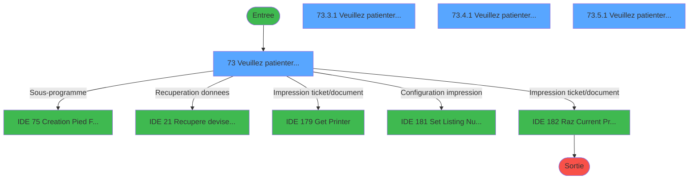
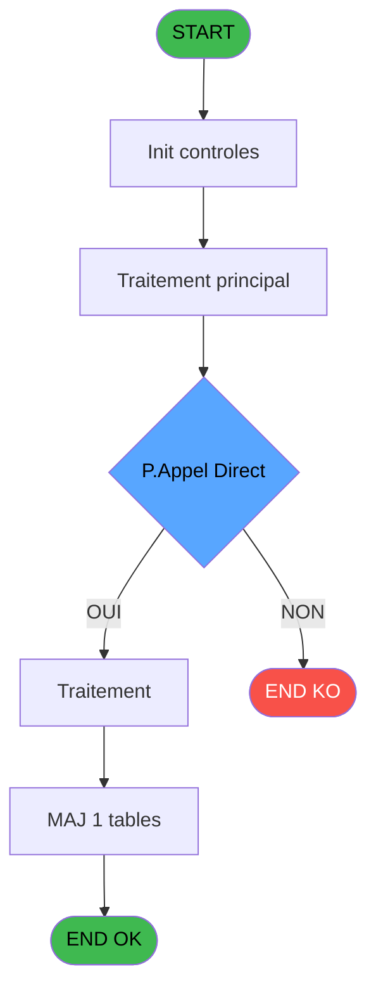
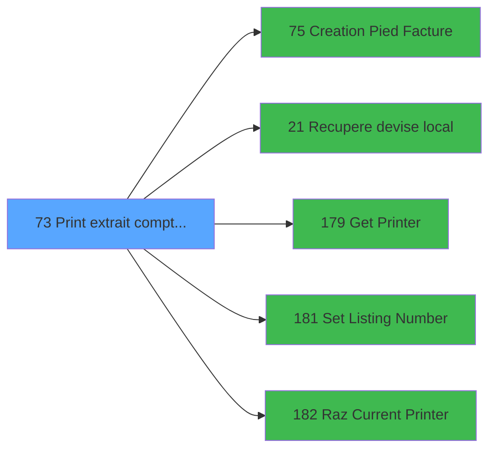

# ADH IDE 73 - Print extrait compte /Imp

> **Analyse**: Phases 1-4 2026-02-07 03:44 -> 02:10 (22h25min) | Assemblage 02:10
> **Pipeline**: V7.2 Enrichi
> **Structure**: 4 onglets (Resume | Ecrans | Donnees | Connexions)

<!-- TAB:Resume -->

## 1. FICHE D'IDENTITE

| Attribut | Valeur |
|----------|--------|
| Projet | ADH |
| IDE Position | 73 |
| Nom Programme | Print extrait compte /Imp |
| Fichier source | `Prg_73.xml` |
| Dossier IDE | Comptabilite |
| Taches | 26 (4 ecrans visibles) |
| Tables modifiees | 1 |
| Programmes appeles | 5 |
| Complexite | **BASSE** (score 25/100) |

## 2. DESCRIPTION FONCTIONNELLE

ADH IDE 73 - EXTRAIT_IMP assure l'édition et l'impression de l'extrait de compte. Il reçoit les paramètres de l'écran ADH IDE 69 (EXTRAIT_COMPTE), construit la liste des mouvements à imprimer, puis orchestre l'envoi vers l'imprimante. Le programme gère l'initialisation du contexte d'impression via ADH IDE 179 (GET_PRINTER) et ADH IDE 181 (SET_LIST_NUMBER), puis lance l'édition proprement dite.

Le flux d'édition se décompose en trois phases : d'abord l'en-tête et les paramètres de filtrage appliqués, ensuite l'itération sur chaque mouvement avec montant, service, et date, enfin le pied de facture généré par ADH IDE 75 (CREATION PIED FACTURE). La devise locale est récupérée dynamiquement via ADH IDE 21 pour afficher les montants au format correct. Une barre de progression « Veuillez patienter… » signale au utilisateur que l'édition est en cours.

À la fin du traitement, ADH IDE 182 (RAZ_PRINTER) remet l'imprimante à zéro et ADH IDE 73 enregistre l'événement dans la table log_maj_tpe pour audit. Si l'impression échoue ou est annulée, le programme gère l'erreur et laisse l'utilisateur revenir à l'écran de consultation sans perdre les données de l'extrait.

## 3. BLOCS FONCTIONNELS

### 3.1 Traitement (5 taches)

Traitements internes.

---

#### 73 - Veuillez patienter... [[ECRAN]](#ecran-t1)

**Role** : Traitement : Veuillez patienter....
**Ecran** : 422 x 56 DLU (MDI) | [Voir mockup](#ecran-t1)

4 sous-taches directes

| Tache | Nom | Bloc |
|-------|-----|------|
| [73.3.1](#t17) | Veuillez patienter... **[[ECRAN]](#ecran-t17)** | Traitement |
| [73.4.1](#t19) | Veuillez patienter... **[[ECRAN]](#ecran-t19)** | Traitement |
| [73.5.1](#t23) | Veuillez patienter... **[[ECRAN]](#ecran-t23)** | Traitement |
| [73.6](#t26) | recup nom adherent | Traitement |

**Delegue a** : [Recupere devise local (IDE 21)](ADH-IDE-21.md), [Set Listing Number (IDE 181)](ADH-IDE-181.md)

---

#### 73.3.1 - Veuillez patienter... [[ECRAN]](#ecran-t17)

**Role** : Traitement : Veuillez patienter....
**Ecran** : 422 x 57 DLU (MDI) | [Voir mockup](#ecran-t17)
**Delegue a** : [Recupere devise local (IDE 21)](ADH-IDE-21.md), [Set Listing Number (IDE 181)](ADH-IDE-181.md)

---

#### 73.4.1 - Veuillez patienter... [[ECRAN]](#ecran-t19)

**Role** : Traitement : Veuillez patienter....
**Ecran** : 422 x 57 DLU (MDI) | [Voir mockup](#ecran-t19)
**Delegue a** : [Recupere devise local (IDE 21)](ADH-IDE-21.md), [Set Listing Number (IDE 181)](ADH-IDE-181.md)

---

#### 73.5.1 - Veuillez patienter... [[ECRAN]](#ecran-t23)

**Role** : Traitement : Veuillez patienter....
**Ecran** : 422 x 57 DLU (MDI) | [Voir mockup](#ecran-t23)
**Delegue a** : [Recupere devise local (IDE 21)](ADH-IDE-21.md), [Set Listing Number (IDE 181)](ADH-IDE-181.md)

---

#### 73.6 - recup nom adherent

**Role** : Consultation/chargement : recup nom adherent.
**Variables liees** : EO (P0 code adherent), FF (W0 n° adherent)
**Delegue a** : [Recupere devise local (IDE 21)](ADH-IDE-21.md), [Set Listing Number (IDE 181)](ADH-IDE-181.md)

### 3.2 Impression (21 taches)

Generation des documents et tickets.

---

#### 73.1 - Printer 1

**Role** : Generation du document : Printer 1.

---

#### 73.1.1 - edition extrait compte

**Role** : Generation du document : edition extrait compte.
**Variables liees** : FK (W0 masque extrait)

---

#### 73.1.1.1 - Edition du pied

**Role** : Generation du document : Edition du pied.

---

#### 73.1.1.2 - Edition recap Free Etra

**Role** : Generation du document : Edition recap Free Etra.

---

#### 73.1.2 - edition extrait compte

**Role** : Generation du document : edition extrait compte.
**Variables liees** : FK (W0 masque extrait)

---

#### 73.1.2.1 - Edition du pied

**Role** : Generation du document : Edition du pied.

---

#### 73.1.2.2 - Edition recap Free Etra

**Role** : Generation du document : Edition recap Free Etra.

---

#### 73.2 - Printer 4

**Role** : Generation du document : Printer 4.

---

#### 73.2.1 - edition extrait compte

**Role** : Generation du document : edition extrait compte.
**Variables liees** : FK (W0 masque extrait)

---

#### 73.2.1.1 - Edition du pied

**Role** : Generation du document : Edition du pied.

---

#### 73.2.1.2 - Edition recap Free Etra

**Role** : Generation du document : Edition recap Free Etra.

---

#### 73.2.2 - edition extrait compte

**Role** : Generation du document : edition extrait compte.
**Variables liees** : FK (W0 masque extrait)

---

#### 73.2.2.1 - Edition recap Free Etra

**Role** : Generation du document : Edition recap Free Etra.

---

#### 73.2.2.2 - Edition du pied

**Role** : Generation du document : Edition du pied.

---

#### 73.3 - Printer 6 [[ECRAN]](#ecran-t16)

**Role** : Generation du document : Printer 6.
**Ecran** : 422 x 57 DLU (MDI) | [Voir mockup](#ecran-t16)

---

#### 73.4 - Printer 8 [[ECRAN]](#ecran-t18)

**Role** : Generation du document : Printer 8.
**Ecran** : 422 x 57 DLU (MDI) | [Voir mockup](#ecran-t18)

---

#### 73.4.1.1 - Edition du pied

**Role** : Generation du document : Edition du pied.

---

#### 73.4.1.2 - Edition recap Free Etra

**Role** : Generation du document : Edition recap Free Etra.

---

#### 73.5 - Printer 9 [[ECRAN]](#ecran-t22)

**Role** : Generation du document : Printer 9.
**Ecran** : 422 x 57 DLU (MDI) | [Voir mockup](#ecran-t22)

---

#### 73.5.1.1 - Edition du pied

**Role** : Generation du document : Edition du pied.

---

#### 73.5.1.2 - Edition recap Free Etra

**Role** : Generation du document : Edition recap Free Etra.

## 5. REGLES METIER

6 regles identifiees:

### Impression (5 regles)

#### [RM-002] Verification que l'imprimante courante est la n1

| Element | Detail |
|---------|--------|
| **Condition** | `GetParam ('CURRENTPRINTERNUM')=1` |
| **Si vrai** | Action si CURRENTPRINTERNUM = 1 |
| **Expression source** | Expression 6 : `GetParam ('CURRENTPRINTERNUM')=1` |
| **Exemple** | Si GetParam ('CURRENTPRINTERNUM')=1 → Action si CURRENTPRINTERNUM = 1 |
| **Impact** | [73.1 - Printer 1](#t2) |

#### [RM-003] Verification que l'imprimante courante est la n4

| Element | Detail |
|---------|--------|
| **Condition** | `GetParam ('CURRENTPRINTERNUM')=4` |
| **Si vrai** | Action si CURRENTPRINTERNUM = 4 |
| **Expression source** | Expression 7 : `GetParam ('CURRENTPRINTERNUM')=4` |
| **Exemple** | Si GetParam ('CURRENTPRINTERNUM')=4 → Action si CURRENTPRINTERNUM = 4 |
| **Impact** | [73.1 - Printer 1](#t2) |

#### [RM-004] Verification que l'imprimante courante est la n6

| Element | Detail |
|---------|--------|
| **Condition** | `GetParam ('CURRENTPRINTERNUM')=6` |
| **Si vrai** | Action si CURRENTPRINTERNUM = 6 |
| **Expression source** | Expression 8 : `GetParam ('CURRENTPRINTERNUM')=6` |
| **Exemple** | Si GetParam ('CURRENTPRINTERNUM')=6 → Action si CURRENTPRINTERNUM = 6 |
| **Impact** | [73.1 - Printer 1](#t2) |

#### [RM-005] Verification que l'imprimante courante est la n8

| Element | Detail |
|---------|--------|
| **Condition** | `GetParam ('CURRENTPRINTERNUM')=8` |
| **Si vrai** | Action si CURRENTPRINTERNUM = 8 |
| **Expression source** | Expression 9 : `GetParam ('CURRENTPRINTERNUM')=8` |
| **Exemple** | Si GetParam ('CURRENTPRINTERNUM')=8 → Action si CURRENTPRINTERNUM = 8 |
| **Impact** | [73.1 - Printer 1](#t2) |

#### [RM-006] Verification que l'imprimante courante est la n9

| Element | Detail |
|---------|--------|
| **Condition** | `GetParam ('CURRENTPRINTERNUM')=9` |
| **Si vrai** | Action si CURRENTPRINTERNUM = 9 |
| **Expression source** | Expression 10 : `GetParam ('CURRENTPRINTERNUM')=9` |
| **Exemple** | Si GetParam ('CURRENTPRINTERNUM')=9 → Action si CURRENTPRINTERNUM = 9 |
| **Impact** | [73.1 - Printer 1](#t2) |

### Autres (1 regles)

#### [RM-001] Condition composite: IsComponent () AND NOT(P.Appel Direct [N])

| Element | Detail |
|---------|--------|
| **Condition** | `IsComponent () AND NOT(P.Appel Direct [N])` |
| **Si vrai** | Action si vrai |
| **Variables** | FA (P.Appel Direct) |
| **Expression source** | Expression 2 : `IsComponent () AND NOT(P.Appel Direct [N])` |
| **Exemple** | Si IsComponent () AND NOT(P.Appel Direct [N]) → Action si vrai |

## 6. CONTEXTE

- **Appele par**: [Extrait de compte (IDE 69)](ADH-IDE-69.md)
- **Appelle**: 5 programmes | **Tables**: 6 (W:1 R:3 L:5) | **Taches**: 26 | **Expressions**: 12

<!-- TAB:Ecrans -->

## 8. ECRANS

### 8.1 Forms visibles (4 / 26)

| # | Position | Tache | Nom | Type | Largeur | Hauteur | Bloc |
|---|----------|-------|-----|------|---------|---------|------|
| 1 | 73 | 73 | Veuillez patienter... | MDI | 422 | 56 | Traitement |
| 2 | 73.3.1 | 73.3.1 | Veuillez patienter... | MDI | 422 | 57 | Traitement |
| 3 | 73.4.1 | 73.4.1 | Veuillez patienter... | MDI | 422 | 57 | Traitement |
| 4 | 73.5.1 | 73.5.1 | Veuillez patienter... | MDI | 422 | 57 | Traitement |

### 8.2 Mockups Ecrans

---

#### 73 - Veuillez patienter...
**Tache** : [73](#t1) | **Type** : MDI | **Dimensions** : 422 x 56 DLU
**Bloc** : Traitement | **Titre IDE** : Veuillez patienter...

<!-- FORM-DATA:
{
    "width":  422,
    "vFactor":  8,
    "type":  "MDI",
    "hFactor":  8,
    "controls":  [
                     {
                         "x":  0,
                         "type":  "label",
                         "var":  "",
                         "y":  0,
                         "w":  423,
                         "fmt":  "",
                         "name":  "",
                         "h":  29,
                         "color":  "",
                         "text":  "",
                         "parent":  null
                     },
                     {
                         "x":  120,
                         "type":  "label",
                         "var":  "",
                         "y":  10,
                         "w":  221,
                         "fmt":  "",
                         "name":  "",
                         "h":  8,
                         "color":  "7",
                         "text":  "Impression en cours ...",
                         "parent":  null
                     },
                     {
                         "x":  0,
                         "type":  "label",
                         "var":  "",
                         "y":  29,
                         "w":  423,
                         "fmt":  "",
                         "name":  "",
                         "h":  27,
                         "color":  "",
                         "text":  "",
                         "parent":  null
                     },
                     {
                         "x":  69,
                         "type":  "label",
                         "var":  "",
                         "y":  38,
                         "w":  285,
                         "fmt":  "",
                         "name":  "",
                         "h":  8,
                         "color":  "",
                         "text":  "Edition de l\u0027extrait de compte",
                         "parent":  null
                     },
                     {
                         "x":  4,
                         "type":  "image",
                         "var":  "",
                         "y":  2,
                         "w":  72,
                         "fmt":  "",
                         "name":  "",
                         "h":  25,
                         "color":  "",
                         "text":  "",
                         "parent":  null
                     }
                 ],
    "taskId":  "73",
    "height":  56
}
-->

---

#### 73.3.1 - Veuillez patienter...
**Tache** : [73.3.1](#t17) | **Type** : MDI | **Dimensions** : 422 x 57 DLU
**Bloc** : Traitement | **Titre IDE** : Veuillez patienter...

<!-- FORM-DATA:
{
    "width":  422,
    "vFactor":  8,
    "type":  "MDI",
    "hFactor":  8,
    "controls":  [
                     {
                         "x":  0,
                         "type":  "label",
                         "var":  "",
                         "y":  0,
                         "w":  423,
                         "fmt":  "",
                         "name":  "",
                         "h":  29,
                         "color":  "",
                         "text":  "",
                         "parent":  null
                     },
                     {
                         "x":  120,
                         "type":  "label",
                         "var":  "",
                         "y":  10,
                         "w":  221,
                         "fmt":  "",
                         "name":  "",
                         "h":  8,
                         "color":  "7",
                         "text":  "Impression en cours ...",
                         "parent":  null
                     },
                     {
                         "x":  0,
                         "type":  "label",
                         "var":  "",
                         "y":  29,
                         "w":  423,
                         "fmt":  "",
                         "name":  "",
                         "h":  27,
                         "color":  "",
                         "text":  "",
                         "parent":  null
                     },
                     {
                         "x":  69,
                         "type":  "label",
                         "var":  "",
                         "y":  38,
                         "w":  285,
                         "fmt":  "",
                         "name":  "",
                         "h":  8,
                         "color":  "",
                         "text":  "Edition de l\u0027extrait de compte",
                         "parent":  null
                     },
                     {
                         "x":  4,
                         "type":  "image",
                         "var":  "",
                         "y":  2,
                         "w":  72,
                         "fmt":  "",
                         "name":  "",
                         "h":  25,
                         "color":  "",
                         "text":  "",
                         "parent":  null
                     }
                 ],
    "taskId":  "73.3.1",
    "height":  57
}
-->

---

#### 73.4.1 - Veuillez patienter...
**Tache** : [73.4.1](#t19) | **Type** : MDI | **Dimensions** : 422 x 57 DLU
**Bloc** : Traitement | **Titre IDE** : Veuillez patienter...

<!-- FORM-DATA:
{
    "width":  422,
    "vFactor":  8,
    "type":  "MDI",
    "hFactor":  8,
    "controls":  [
                     {
                         "x":  0,
                         "type":  "label",
                         "var":  "",
                         "y":  0,
                         "w":  423,
                         "fmt":  "",
                         "name":  "",
                         "h":  29,
                         "color":  "",
                         "text":  "",
                         "parent":  null
                     },
                     {
                         "x":  120,
                         "type":  "label",
                         "var":  "",
                         "y":  10,
                         "w":  221,
                         "fmt":  "",
                         "name":  "",
                         "h":  8,
                         "color":  "7",
                         "text":  "Impression en cours ...",
                         "parent":  null
                     },
                     {
                         "x":  0,
                         "type":  "label",
                         "var":  "",
                         "y":  29,
                         "w":  423,
                         "fmt":  "",
                         "name":  "",
                         "h":  27,
                         "color":  "",
                         "text":  "",
                         "parent":  null
                     },
                     {
                         "x":  69,
                         "type":  "label",
                         "var":  "",
                         "y":  38,
                         "w":  285,
                         "fmt":  "",
                         "name":  "",
                         "h":  8,
                         "color":  "",
                         "text":  "Edition de l\u0027extrait de compte",
                         "parent":  null
                     },
                     {
                         "x":  4,
                         "type":  "image",
                         "var":  "",
                         "y":  2,
                         "w":  72,
                         "fmt":  "",
                         "name":  "",
                         "h":  25,
                         "color":  "",
                         "text":  "",
                         "parent":  null
                     }
                 ],
    "taskId":  "73.4.1",
    "height":  57
}
-->

---

#### 73.5.1 - Veuillez patienter...
**Tache** : [73.5.1](#t23) | **Type** : MDI | **Dimensions** : 422 x 57 DLU
**Bloc** : Traitement | **Titre IDE** : Veuillez patienter...

<!-- FORM-DATA:
{
    "width":  422,
    "vFactor":  8,
    "type":  "MDI",
    "hFactor":  8,
    "controls":  [
                     {
                         "x":  0,
                         "type":  "label",
                         "var":  "",
                         "y":  0,
                         "w":  423,
                         "fmt":  "",
                         "name":  "",
                         "h":  29,
                         "color":  "",
                         "text":  "",
                         "parent":  null
                     },
                     {
                         "x":  120,
                         "type":  "label",
                         "var":  "",
                         "y":  10,
                         "w":  221,
                         "fmt":  "",
                         "name":  "",
                         "h":  8,
                         "color":  "7",
                         "text":  "Impression en cours ...",
                         "parent":  null
                     },
                     {
                         "x":  0,
                         "type":  "label",
                         "var":  "",
                         "y":  29,
                         "w":  423,
                         "fmt":  "",
                         "name":  "",
                         "h":  27,
                         "color":  "",
                         "text":  "",
                         "parent":  null
                     },
                     {
                         "x":  69,
                         "type":  "label",
                         "var":  "",
                         "y":  38,
                         "w":  285,
                         "fmt":  "",
                         "name":  "",
                         "h":  8,
                         "color":  "",
                         "text":  "Edition de l\u0027extrait de compte",
                         "parent":  null
                     },
                     {
                         "x":  4,
                         "type":  "image",
                         "var":  "",
                         "y":  2,
                         "w":  72,
                         "fmt":  "",
                         "name":  "",
                         "h":  25,
                         "color":  "",
                         "text":  "",
                         "parent":  null
                     }
                 ],
    "taskId":  "73.5.1",
    "height":  57
}
-->

## 9. NAVIGATION

### 9.1 Enchainement des ecrans

**Detail par enchainement :**

| Depuis | Action | Vers | Retour |
|--------|--------|------|--------|
| Veuillez patienter... | Sous-programme | [Creation Pied Facture (IDE 75)](ADH-IDE-75.md) | Retour ecran |
| Veuillez patienter... | Recuperation donnees | [Recupere devise local (IDE 21)](ADH-IDE-21.md) | Retour ecran |
| Veuillez patienter... | Impression ticket/document | [Get Printer (IDE 179)](ADH-IDE-179.md) | Retour ecran |
| Veuillez patienter... | Configuration impression | [Set Listing Number (IDE 181)](ADH-IDE-181.md) | Retour ecran |
| Veuillez patienter... | Impression ticket/document | [Raz Current Printer (IDE 182)](ADH-IDE-182.md) | Retour ecran |

### 9.3 Structure hierarchique (26 taches)

| Position | Tache | Type | Dimensions | Bloc |
|----------|-------|------|------------|------|
| **73.1** | [**Veuillez patienter...** (73)](#t1) [mockup](#ecran-t1) | MDI | 422x56 | Traitement |
| 73.1.1 | [Veuillez patienter... (73.3.1)](#t17) [mockup](#ecran-t17) | MDI | 422x57 | |
| 73.1.2 | [Veuillez patienter... (73.4.1)](#t19) [mockup](#ecran-t19) | MDI | 422x57 | |
| 73.1.3 | [Veuillez patienter... (73.5.1)](#t23) [mockup](#ecran-t23) | MDI | 422x57 | |
| 73.1.4 | [recup nom adherent (73.6)](#t26) | MDI | - | |
| **73.2** | [**Printer 1** (73.1)](#t2) | MDI | - | Impression |
| 73.2.1 | [edition extrait compte (73.1.1)](#t3) | MDI | - | |
| 73.2.2 | [Edition du pied (73.1.1.1)](#t4) | - | - | |
| 73.2.3 | [Edition recap Free Etra (73.1.1.2)](#t5) | - | - | |
| 73.2.4 | [edition extrait compte (73.1.2)](#t6) | MDI | - | |
| 73.2.5 | [Edition du pied (73.1.2.1)](#t7) | - | - | |
| 73.2.6 | [Edition recap Free Etra (73.1.2.2)](#t8) | - | - | |
| 73.2.7 | [Printer 4 (73.2)](#t9) | MDI | - | |
| 73.2.8 | [edition extrait compte (73.2.1)](#t10) | MDI | - | |
| 73.2.9 | [Edition du pied (73.2.1.1)](#t11) | - | - | |
| 73.2.10 | [Edition recap Free Etra (73.2.1.2)](#t12) | - | - | |
| 73.2.11 | [edition extrait compte (73.2.2)](#t13) | MDI | - | |
| 73.2.12 | [Edition recap Free Etra (73.2.2.1)](#t14) | - | - | |
| 73.2.13 | [Edition du pied (73.2.2.2)](#t15) | - | - | |
| 73.2.14 | [Printer 6 (73.3)](#t16) [mockup](#ecran-t16) | MDI | 422x57 | |
| 73.2.15 | [Printer 8 (73.4)](#t18) [mockup](#ecran-t18) | MDI | 422x57 | |
| 73.2.16 | [Edition du pied (73.4.1.1)](#t20) | - | - | |
| 73.2.17 | [Edition recap Free Etra (73.4.1.2)](#t21) | - | - | |
| 73.2.18 | [Printer 9 (73.5)](#t22) [mockup](#ecran-t22) | MDI | 422x57 | |
| 73.2.19 | [Edition du pied (73.5.1.1)](#t24) | - | - | |
| 73.2.20 | [Edition recap Free Etra (73.5.1.2)](#t25) | - | - | |

### 9.4 Algorigramme

> **Legende**: Vert = START/END OK | Rouge = END KO | Bleu = Decisions
> *Algorigramme auto-genere. Utiliser `/algorigramme` pour une synthese metier detaillee.*

<!-- TAB:Donnees -->

## 10. TABLES

### Tables utilisees (6)

| ID | Nom | Description | Type | R | W | L | Usages |
|----|-----|-------------|------|---|---|---|--------|
| 867 | log_maj_tpe |  | DB |   | **W** |   | 6 |
| 40 | comptable________cte |  | DB | R |   | L | 13 |
| 30 | gm-recherche_____gmr | Index de recherche | DB | R |   | L | 8 |
| 31 | gm-complet_______gmc |  | DB | R |   | L | 7 |
| 928 | type_lit |  | DB |   |   | L | 2 |
| 34 | hebergement______heb | Hebergement (chambres) | DB |   |   | L | 1 |

### Colonnes par table (1 / 4 tables avec colonnes identifiees)

Table 867 - log_maj_tpe (**W**) - 6 usages

*Table utilisee uniquement en Link ou aucune colonne Real identifiee dans le DataView.*

Table 40 - comptable________cte (R/L) - 13 usages

| Lettre | Variable | Acces | Type |
|--------|----------|-------|------|
| A | W1 cumul compte | R | Numeric |
| B | W1 solde compte | R | Numeric |
| C | W1 ss_total compte | R | Numeric |
| D | v.retour offre | R | Logical |
| E | W1 detection papier | R | Alpha |
| F | W1 inhibe panel | R | Alpha |
| G | W1 massicot | R | Alpha |
| H | W1 selection feuille | R | Alpha |
| I | W1 selection rouleau | R | Alpha |
| J | W1 cumul compte | R | Numeric |
| K | W1 solde compte | R | Numeric |
| L | W1 ss_total compte | R | Numeric |
| M | v.retour special offer | R | Logical |

Table 30 - gm-recherche_____gmr (R/L) - 8 usages

*Table utilisee uniquement en Link ou aucune colonne Real identifiee dans le DataView.*

Table 31 - gm-complet_______gmc (R/L) - 7 usages

*Table utilisee uniquement en Link ou aucune colonne Real identifiee dans le DataView.*

## 11. VARIABLES

### 11.1 Parametres entrants (15)

Variables recues du programme appelant ([Extrait de compte (IDE 69)](ADH-IDE-69.md)).

| Lettre | Nom | Type | Usage dans |
|--------|-----|------|-----------|
| EN | P0 societe | Alpha | - |
| EO | P0 code adherent | Numeric | - |
| EP | P0 filiation | Numeric | - |
| EQ | P0 masque montant | Alpha | 1x parametre entrant |
| ER | P0 nom village | Alpha | - |
| ES | P0 fictif | Logical | - |
| ET | P0 date comptable | Date | - |
| EU | P0 Edtion Tva V2 | Logical | - |
| EV | P.FormatPdf | Logical | - |
| EW | P.Chemin | Alpha | - |
| EX | P.NomFichierPdf | Alpha | - |
| EY | P.Print or Email | Alpha | - |
| EZ | P.Print GIFT PASS | Logical | - |
| FA | P.Appel Direct | Logical | 1x parametre entrant |
| FB | P. Sans annulations | Logical | - |

### 11.2 Variables de travail (10)

Variables internes au programme.

| Lettre | Nom | Type | Usage dans |
|--------|-----|------|-----------|
| FC | W0 nom | Alpha | - |
| FD | W0 prenom | Alpha | - |
| FE | W0 titre | Alpha | - |
| FF | W0 n° adherent | Numeric | - |
| FG | W0 lettre contrôle | Alpha | - |
| FH | W0 filiation | Numeric | - |
| FI | W0 langue parlee | Alpha | - |
| FJ | W0 chambre | Alpha | - |
| FK | W0 masque extrait | Alpha | - |
| FL | W0 devise local | Alpha | - |

Toutes les 25 variables (liste complete)

| Cat | Lettre | Nom Variable | Type |
|-----|--------|--------------|------|
| P0 | **EN** | P0 societe | Alpha |
| P0 | **EO** | P0 code adherent | Numeric |
| P0 | **EP** | P0 filiation | Numeric |
| P0 | **EQ** | P0 masque montant | Alpha |
| P0 | **ER** | P0 nom village | Alpha |
| P0 | **ES** | P0 fictif | Logical |
| P0 | **ET** | P0 date comptable | Date |
| P0 | **EU** | P0 Edtion Tva V2 | Logical |
| P0 | **EV** | P.FormatPdf | Logical |
| P0 | **EW** | P.Chemin | Alpha |
| P0 | **EX** | P.NomFichierPdf | Alpha |
| P0 | **EY** | P.Print or Email | Alpha |
| P0 | **EZ** | P.Print GIFT PASS | Logical |
| P0 | **FA** | P.Appel Direct | Logical |
| P0 | **FB** | P. Sans annulations | Logical |
| W0 | **FC** | W0 nom | Alpha |
| W0 | **FD** | W0 prenom | Alpha |
| W0 | **FE** | W0 titre | Alpha |
| W0 | **FF** | W0 n° adherent | Numeric |
| W0 | **FG** | W0 lettre contrôle | Alpha |
| W0 | **FH** | W0 filiation | Numeric |
| W0 | **FI** | W0 langue parlee | Alpha |
| W0 | **FJ** | W0 chambre | Alpha |
| W0 | **FK** | W0 masque extrait | Alpha |
| W0 | **FL** | W0 devise local | Alpha |

## 12. EXPRESSIONS

**12 / 12 expressions decodees (100%)**

### 12.1 Repartition par type

| Type | Expressions | Regles |
|------|-------------|--------|
| CALCULATION | 1 | 0 |
| CONDITION | 6 | 6 |
| OTHER | 4 | 0 |
| CAST_LOGIQUE | 1 | 0 |

### 12.2 Expressions cles par type

#### CALCULATION (1 expressions)

| Type | IDE | Expression | Regle |
|------|-----|------------|-------|
| CALCULATION | 5 | `Left (P0 masque montant [D],Len (RTrim (P0 masque montant [D]))-1)` | - |

#### CONDITION (6 expressions)

| Type | IDE | Expression | Regle |
|------|-----|------------|-------|
| CONDITION | 8 | `GetParam ('CURRENTPRINTERNUM')=6` | [RM-004](#rm-RM-004) |
| CONDITION | 9 | `GetParam ('CURRENTPRINTERNUM')=8` | [RM-005](#rm-RM-005) |
| CONDITION | 10 | `GetParam ('CURRENTPRINTERNUM')=9` | [RM-006](#rm-RM-006) |
| CONDITION | 2 | `IsComponent () AND NOT(P.Appel Direct [N])` | [RM-001](#rm-RM-001) |
| CONDITION | 6 | `GetParam ('CURRENTPRINTERNUM')=1` | [RM-002](#rm-RM-002) |
| ... | | *+1 autres* | |

#### OTHER (4 expressions)

| Type | IDE | Expression | Regle |
|------|-----|------------|-------|
| OTHER | 4 | `SetCrsr (2)` | - |
| OTHER | 11 | `DbDel ('{867,4}'DSOURCE,'')` | - |
| OTHER | 1 | `GetParam ('LISTINGNUMPRINTERCHOICE')` | - |
| OTHER | 3 | `SetCrsr (1)` | - |

#### CAST_LOGIQUE (1 expressions)

| Type | IDE | Expression | Regle |
|------|-----|------------|-------|
| CAST_LOGIQUE | 12 | `'TRUE'LOG` | - |

<!-- TAB:Connexions -->

## 13. GRAPHE D'APPELS

### 13.1 Chaine depuis Main (Callers)

Main -> ... -> [Extrait de compte (IDE 69)](ADH-IDE-69.md) -> **Print extrait compte /Imp (IDE 73)**

### 13.2 Callers

| IDE | Nom Programme | Nb Appels |
|-----|---------------|-----------|
| [69](ADH-IDE-69.md) | Extrait de compte | 1 |

### 13.3 Callees (programmes appeles)

### 13.4 Detail Callees avec contexte

| IDE | Nom Programme | Appels | Contexte |
|-----|---------------|--------|----------|
| [75](ADH-IDE-75.md) | Creation Pied Facture | 6 | Sous-programme |
| [21](ADH-IDE-21.md) | Recupere devise local | 1 | Recuperation donnees |
| [179](ADH-IDE-179.md) | Get Printer | 1 | Impression ticket/document |
| [181](ADH-IDE-181.md) | Set Listing Number | 1 | Configuration impression |
| [182](ADH-IDE-182.md) | Raz Current Printer | 1 | Impression ticket/document |

## 14. RECOMMANDATIONS MIGRATION

### 14.1 Profil du programme

| Metrique | Valeur | Impact migration |
|----------|--------|-----------------|
| Lignes de logique | 792 | Programme volumineux |
| Expressions | 12 | Peu de logique |
| Tables WRITE | 1 | Impact faible |
| Sous-programmes | 5 | Peu de dependances |
| Ecrans visibles | 4 | Quelques ecrans |
| Code desactive | 0% (0 / 792) | Code sain |
| Regles metier | 6 | Quelques regles a preserver |

### 14.2 Plan de migration par bloc

#### Traitement (5 taches: 4 ecrans, 1 traitement)

- **Strategie** : Orchestrateur avec 4 ecrans (Razor/React) et 1 traitements backend (services).
- Les ecrans deviennent des composants UI, les traitements invisibles deviennent des services injectables.
- 5 sous-programme(s) a migrer ou a reutiliser depuis les services existants.
- Decomposer les taches en services unitaires testables.

#### Impression (21 taches: 3 ecrans, 18 traitements)

- **Strategie** : Templates HTML -> PDF via wkhtmltopdf ou Puppeteer.
- `PrintService` injectable avec choix imprimante

### 14.3 Dependances critiques

| Dependance | Type | Appels | Impact |
|------------|------|--------|--------|
| log_maj_tpe | Table WRITE (Database) | 6x | Schema + repository |
| [Creation Pied Facture (IDE 75)](ADH-IDE-75.md) | Sous-programme | 6x | **CRITIQUE** - Sous-programme |
| [Set Listing Number (IDE 181)](ADH-IDE-181.md) | Sous-programme | 1x | Normale - Configuration impression |
| [Raz Current Printer (IDE 182)](ADH-IDE-182.md) | Sous-programme | 1x | Normale - Impression ticket/document |
| [Recupere devise local (IDE 21)](ADH-IDE-21.md) | Sous-programme | 1x | Normale - Recuperation donnees |
| [Get Printer (IDE 179)](ADH-IDE-179.md) | Sous-programme | 1x | Normale - Impression ticket/document |

---
*Spec DETAILED generee par Pipeline V7.2 - 2026-02-08 02:10*
