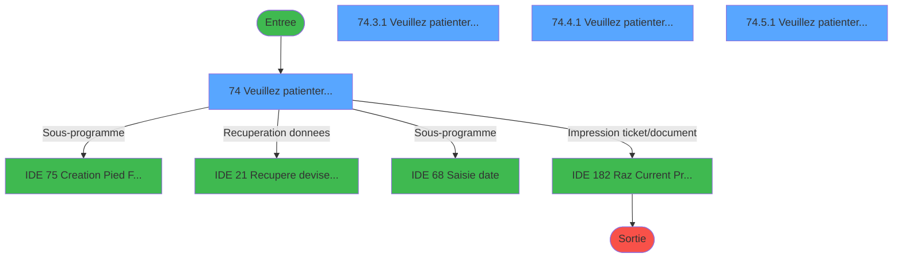
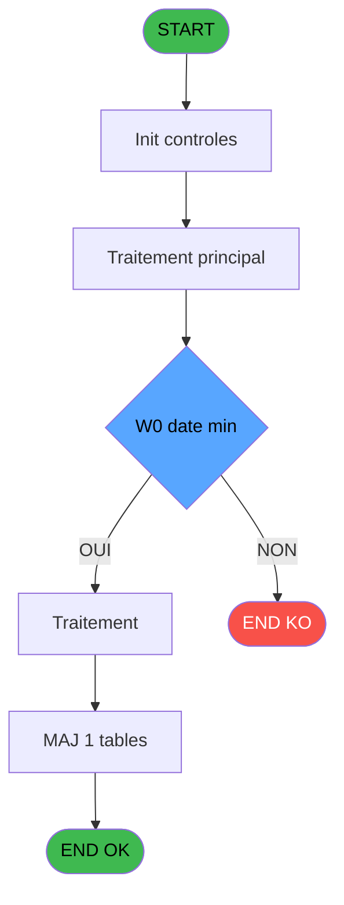
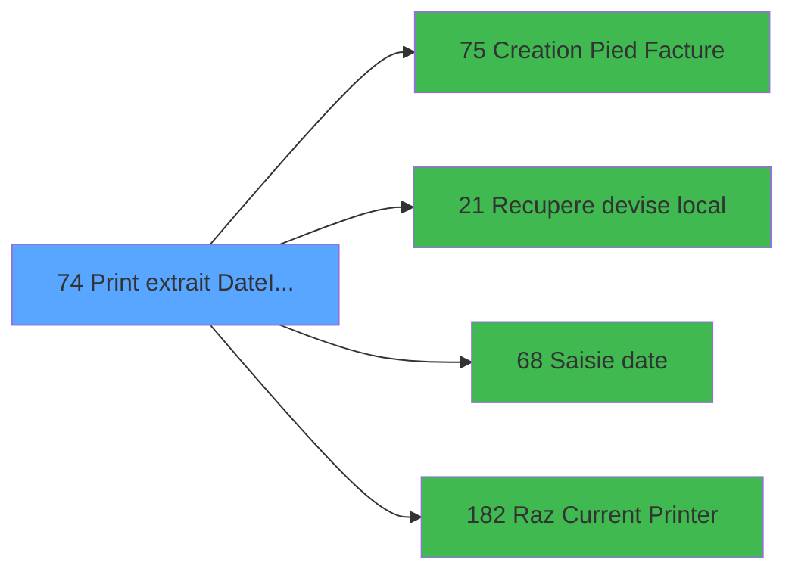

# ADH IDE 74 - Print extrait DateImp /O

> **Analyse**: Phases 1-4 2026-02-07 03:44 -> 02:10 (22h26min) | Assemblage 02:10
> **Pipeline**: V7.2 Enrichi
> **Structure**: 4 onglets (Resume | Ecrans | Donnees | Connexions)

<!-- TAB:Resume -->

## 1. FICHE D'IDENTITE

| Attribut | Valeur |
|----------|--------|
| Projet | ADH |
| IDE Position | 74 |
| Nom Programme | Print extrait DateImp /O |
| Fichier source | `Prg_74.xml` |
| Dossier IDE | Comptabilite |
| Taches | 26 (4 ecrans visibles) |
| Tables modifiees | 1 |
| Programmes appeles | 4 |
| Complexite | **BASSE** (score 25/100) |

## 2. DESCRIPTION FONCTIONNELLE

ADH IDE 74 - **PRINT_EXTRAIT** est le programme d'édition et d'impression de l'extrait de compte. Il gère le workflow complet d'édition du document : initialisation de l'imprimante, mise en page du contenu (en-têtes, détails mouvements, pied de facture), puis envoi à l'imprimante. Le programme reçoit comme paramètre la date d'impression (`DateImp`) et un flag optionnel `/O` pour outpasser certaines vérifications. Les tâches sequentielles ("Veuillez patienter...", "Printer 1", "edition extrait compte", etc.) orchestrent le rendu multi-sections du document.

Le programme s'insère dans le flux Extrait de Compte (IDE 69) : après consultation des mouvements, l'utilisateur demande l'impression, et ADH IDE 74 prend le relais pour générer et imprimer le document. Il communique avec l'imprimante via Récupère devise local (IDE 21) pour les montants en devises locales, et appelle la tâche Saisie date (IDE 68) si la date d'impression doit être saisie manuellement. La création du pied de facture (IDE 75) enrichit le document avec les éléments de fermeture comptable.

L'enregistrement dans `log_maj_tpe` trace chaque impression, permettant l'audit des documents édités. Le reset Raz Current Printer (IDE 182) nettoie l'état de l'imprimante après édition, assurant que les prochaines impressions commencent dans un état cohérent. Ce programme est critique pour la traçabilité comptable des extraits imprimés.

## 3. BLOCS FONCTIONNELS

### 3.1 Traitement (5 taches)

Traitements internes.

---

#### 74 - Veuillez patienter... [[ECRAN]](#ecran-t1)

**Role** : Traitement : Veuillez patienter....
**Ecran** : 422 x 56 DLU (MDI) | [Voir mockup](#ecran-t1)

4 sous-taches directes

| Tache | Nom | Bloc |
|-------|-----|------|
| [74.3.1](#t17) | Veuillez patienter... **[[ECRAN]](#ecran-t17)** | Traitement |
| [74.4.1](#t19) | Veuillez patienter... **[[ECRAN]](#ecran-t19)** | Traitement |
| [74.5.1](#t23) | Veuillez patienter... **[[ECRAN]](#ecran-t23)** | Traitement |
| [74.6](#t26) | recup nom adherent | Traitement |

**Delegue a** : [Recupere devise local (IDE 21)](ADH-IDE-21.md)

---

#### 74.3.1 - Veuillez patienter... [[ECRAN]](#ecran-t17)

**Role** : Traitement : Veuillez patienter....
**Ecran** : 422 x 57 DLU (MDI) | [Voir mockup](#ecran-t17)
**Delegue a** : [Recupere devise local (IDE 21)](ADH-IDE-21.md)

---

#### 74.4.1 - Veuillez patienter... [[ECRAN]](#ecran-t19)

**Role** : Traitement : Veuillez patienter....
**Ecran** : 422 x 57 DLU (MDI) | [Voir mockup](#ecran-t19)
**Delegue a** : [Recupere devise local (IDE 21)](ADH-IDE-21.md)

---

#### 74.5.1 - Veuillez patienter... [[ECRAN]](#ecran-t23)

**Role** : Traitement : Veuillez patienter....
**Ecran** : 422 x 57 DLU (MDI) | [Voir mockup](#ecran-t23)
**Delegue a** : [Recupere devise local (IDE 21)](ADH-IDE-21.md)

---

#### 74.6 - recup nom adherent

**Role** : Consultation/chargement : recup nom adherent.
**Variables liees** : EO (P0 code adherent), EZ (W0 n° adherent)
**Delegue a** : [Recupere devise local (IDE 21)](ADH-IDE-21.md)

### 3.2 Impression (21 taches)

Generation des documents et tickets.

---

#### 74.1 - Printer 1

**Role** : Generation du document : Printer 1.

---

#### 74.1.1 - edition extrait compte

**Role** : Generation du document : edition extrait compte.
**Variables liees** : EU (P0 edition Tva V2), FE (W0 masque extrait)

---

#### 74.1.1.1 - Edition du pied

**Role** : Generation du document : Edition du pied.
**Variables liees** : EU (P0 edition Tva V2)

---

#### 74.1.1.2 - Edition recap Free Etra

**Role** : Generation du document : Edition recap Free Etra.
**Variables liees** : EU (P0 edition Tva V2)

---

#### 74.1.2 - edition extrait compte

**Role** : Generation du document : edition extrait compte.
**Variables liees** : EU (P0 edition Tva V2), FE (W0 masque extrait)

---

#### 74.1.2.1 - Edition du pied

**Role** : Generation du document : Edition du pied.
**Variables liees** : EU (P0 edition Tva V2)

---

#### 74.1.2.2 - Edition recap Free Etra

**Role** : Generation du document : Edition recap Free Etra.
**Variables liees** : EU (P0 edition Tva V2)

---

#### 74.2 - Printer 4

**Role** : Generation du document : Printer 4.

---

#### 74.2.1 - edition extrait compte

**Role** : Generation du document : edition extrait compte.
**Variables liees** : EU (P0 edition Tva V2), FE (W0 masque extrait)

---

#### 74.2.1.1 - Edition recap Free Etra

**Role** : Generation du document : Edition recap Free Etra.
**Variables liees** : EU (P0 edition Tva V2)

---

#### 74.2.1.2 - Edition du pied

**Role** : Generation du document : Edition du pied.
**Variables liees** : EU (P0 edition Tva V2)

---

#### 74.2.2 - edition extrait compte

**Role** : Generation du document : edition extrait compte.
**Variables liees** : EU (P0 edition Tva V2), FE (W0 masque extrait)

---

#### 74.2.2.1 - Edition recap Free Etra

**Role** : Generation du document : Edition recap Free Etra.
**Variables liees** : EU (P0 edition Tva V2)

---

#### 74.2.2.2 - Edition du pied

**Role** : Generation du document : Edition du pied.
**Variables liees** : EU (P0 edition Tva V2)

---

#### 74.3 - Printer 6 [[ECRAN]](#ecran-t16)

**Role** : Generation du document : Printer 6.
**Ecran** : 422 x 57 DLU (MDI) | [Voir mockup](#ecran-t16)

---

#### 74.4 - Printer 8 [[ECRAN]](#ecran-t18)

**Role** : Generation du document : Printer 8.
**Ecran** : 422 x 57 DLU (MDI) | [Voir mockup](#ecran-t18)

---

#### 74.4.1.1 - Edition du pied

**Role** : Generation du document : Edition du pied.
**Variables liees** : EU (P0 edition Tva V2)

---

#### 74.4.1.2 - Edition recap Free Etra

**Role** : Generation du document : Edition recap Free Etra.
**Variables liees** : EU (P0 edition Tva V2)

---

#### 74.5 - Printer 9 [[ECRAN]](#ecran-t22)

**Role** : Generation du document : Printer 9.
**Ecran** : 422 x 57 DLU (MDI) | [Voir mockup](#ecran-t22)

---

#### 74.5.1.1 - Edition du pied

**Role** : Generation du document : Edition du pied.
**Variables liees** : EU (P0 edition Tva V2)

---

#### 74.5.1.2 - Edition recap Free Etra

**Role** : Generation du document : Edition recap Free Etra.
**Variables liees** : EU (P0 edition Tva V2)

## 5. REGLES METIER

5 regles identifiees:

### Impression (5 regles)

#### [RM-001] Verification que l'imprimante courante est la n1

| Element | Detail |
|---------|--------|
| **Condition** | `GetParam ('CURRENTPRINTERNUM')=1` |
| **Si vrai** | Action si CURRENTPRINTERNUM = 1 |
| **Expression source** | Expression 5 : `GetParam ('CURRENTPRINTERNUM')=1` |
| **Exemple** | Si GetParam ('CURRENTPRINTERNUM')=1 → Action si CURRENTPRINTERNUM = 1 |
| **Impact** | [74.1 - Printer 1](#t2) |

#### [RM-002] Verification que l'imprimante courante est la n4

| Element | Detail |
|---------|--------|
| **Condition** | `GetParam ('CURRENTPRINTERNUM')=4` |
| **Si vrai** | Action si CURRENTPRINTERNUM = 4 |
| **Expression source** | Expression 6 : `GetParam ('CURRENTPRINTERNUM')=4` |
| **Exemple** | Si GetParam ('CURRENTPRINTERNUM')=4 → Action si CURRENTPRINTERNUM = 4 |
| **Impact** | [74.1 - Printer 1](#t2) |

#### [RM-003] Verification que l'imprimante courante est la n6

| Element | Detail |
|---------|--------|
| **Condition** | `GetParam ('CURRENTPRINTERNUM')=6` |
| **Si vrai** | Action si CURRENTPRINTERNUM = 6 |
| **Expression source** | Expression 7 : `GetParam ('CURRENTPRINTERNUM')=6` |
| **Exemple** | Si GetParam ('CURRENTPRINTERNUM')=6 → Action si CURRENTPRINTERNUM = 6 |
| **Impact** | [74.1 - Printer 1](#t2) |

#### [RM-004] Verification que l'imprimante courante est la n8

| Element | Detail |
|---------|--------|
| **Condition** | `GetParam ('CURRENTPRINTERNUM')=8` |
| **Si vrai** | Action si CURRENTPRINTERNUM = 8 |
| **Expression source** | Expression 8 : `GetParam ('CURRENTPRINTERNUM')=8` |
| **Exemple** | Si GetParam ('CURRENTPRINTERNUM')=8 → Action si CURRENTPRINTERNUM = 8 |
| **Impact** | [74.1 - Printer 1](#t2) |

#### [RM-005] Verification que l'imprimante courante est la n9

| Element | Detail |
|---------|--------|
| **Condition** | `GetParam ('CURRENTPRINTERNUM')=9` |
| **Si vrai** | Action si CURRENTPRINTERNUM = 9 |
| **Expression source** | Expression 9 : `GetParam ('CURRENTPRINTERNUM')=9` |
| **Exemple** | Si GetParam ('CURRENTPRINTERNUM')=9 → Action si CURRENTPRINTERNUM = 9 |
| **Impact** | [74.1 - Printer 1](#t2) |

## 6. CONTEXTE

- **Appele par**: [Extrait de compte (IDE 69)](ADH-IDE-69.md)
- **Appelle**: 4 programmes | **Tables**: 6 (W:1 R:3 L:5) | **Taches**: 26 | **Expressions**: 11

<!-- TAB:Ecrans -->

## 8. ECRANS

### 8.1 Forms visibles (4 / 26)

| # | Position | Tache | Nom | Type | Largeur | Hauteur | Bloc |
|---|----------|-------|-----|------|---------|---------|------|
| 1 | 74 | 74 | Veuillez patienter... | MDI | 422 | 56 | Traitement |
| 2 | 74.3.1 | 74.3.1 | Veuillez patienter... | MDI | 422 | 57 | Traitement |
| 3 | 74.4.1 | 74.4.1 | Veuillez patienter... | MDI | 422 | 57 | Traitement |
| 4 | 74.5.1 | 74.5.1 | Veuillez patienter... | MDI | 422 | 57 | Traitement |

### 8.2 Mockups Ecrans

---

#### 74 - Veuillez patienter...
**Tache** : [74](#t1) | **Type** : MDI | **Dimensions** : 422 x 56 DLU
**Bloc** : Traitement | **Titre IDE** : Veuillez patienter...

<!-- FORM-DATA:
{
    "width":  422,
    "vFactor":  8,
    "type":  "MDI",
    "hFactor":  8,
    "controls":  [
                     {
                         "x":  0,
                         "type":  "label",
                         "var":  "",
                         "y":  0,
                         "w":  423,
                         "fmt":  "",
                         "name":  "",
                         "h":  29,
                         "color":  "",
                         "text":  "",
                         "parent":  null
                     },
                     {
                         "x":  120,
                         "type":  "label",
                         "var":  "",
                         "y":  10,
                         "w":  221,
                         "fmt":  "",
                         "name":  "",
                         "h":  8,
                         "color":  "7",
                         "text":  "Impression en cours ...",
                         "parent":  null
                     },
                     {
                         "x":  0,
                         "type":  "label",
                         "var":  "",
                         "y":  29,
                         "w":  423,
                         "fmt":  "",
                         "name":  "",
                         "h":  27,
                         "color":  "",
                         "text":  "",
                         "parent":  null
                     },
                     {
                         "x":  69,
                         "type":  "label",
                         "var":  "",
                         "y":  38,
                         "w":  285,
                         "fmt":  "",
                         "name":  "",
                         "h":  8,
                         "color":  "",
                         "text":  "Edition de l\u0027extrait de compte",
                         "parent":  null
                     },
                     {
                         "x":  4,
                         "type":  "image",
                         "var":  "",
                         "y":  2,
                         "w":  72,
                         "fmt":  "",
                         "name":  "",
                         "h":  25,
                         "color":  "",
                         "text":  "",
                         "parent":  null
                     }
                 ],
    "taskId":  "74",
    "height":  56
}
-->

---

#### 74.3.1 - Veuillez patienter...
**Tache** : [74.3.1](#t17) | **Type** : MDI | **Dimensions** : 422 x 57 DLU
**Bloc** : Traitement | **Titre IDE** : Veuillez patienter...

<!-- FORM-DATA:
{
    "width":  422,
    "vFactor":  8,
    "type":  "MDI",
    "hFactor":  8,
    "controls":  [
                     {
                         "x":  0,
                         "type":  "label",
                         "var":  "",
                         "y":  0,
                         "w":  423,
                         "fmt":  "",
                         "name":  "",
                         "h":  29,
                         "color":  "",
                         "text":  "",
                         "parent":  null
                     },
                     {
                         "x":  120,
                         "type":  "label",
                         "var":  "",
                         "y":  10,
                         "w":  221,
                         "fmt":  "",
                         "name":  "",
                         "h":  8,
                         "color":  "7",
                         "text":  "Impression en cours ...",
                         "parent":  null
                     },
                     {
                         "x":  0,
                         "type":  "label",
                         "var":  "",
                         "y":  29,
                         "w":  423,
                         "fmt":  "",
                         "name":  "",
                         "h":  27,
                         "color":  "",
                         "text":  "",
                         "parent":  null
                     },
                     {
                         "x":  69,
                         "type":  "label",
                         "var":  "",
                         "y":  38,
                         "w":  285,
                         "fmt":  "",
                         "name":  "",
                         "h":  8,
                         "color":  "",
                         "text":  "Edition de l\u0027extrait de compte",
                         "parent":  null
                     },
                     {
                         "x":  4,
                         "type":  "image",
                         "var":  "",
                         "y":  2,
                         "w":  72,
                         "fmt":  "",
                         "name":  "",
                         "h":  25,
                         "color":  "",
                         "text":  "",
                         "parent":  null
                     }
                 ],
    "taskId":  "74.3.1",
    "height":  57
}
-->

---

#### 74.4.1 - Veuillez patienter...
**Tache** : [74.4.1](#t19) | **Type** : MDI | **Dimensions** : 422 x 57 DLU
**Bloc** : Traitement | **Titre IDE** : Veuillez patienter...

<!-- FORM-DATA:
{
    "width":  422,
    "vFactor":  8,
    "type":  "MDI",
    "hFactor":  8,
    "controls":  [
                     {
                         "x":  0,
                         "type":  "label",
                         "var":  "",
                         "y":  0,
                         "w":  423,
                         "fmt":  "",
                         "name":  "",
                         "h":  29,
                         "color":  "",
                         "text":  "",
                         "parent":  null
                     },
                     {
                         "x":  120,
                         "type":  "label",
                         "var":  "",
                         "y":  10,
                         "w":  221,
                         "fmt":  "",
                         "name":  "",
                         "h":  8,
                         "color":  "7",
                         "text":  "Impression en cours ...",
                         "parent":  null
                     },
                     {
                         "x":  0,
                         "type":  "label",
                         "var":  "",
                         "y":  29,
                         "w":  423,
                         "fmt":  "",
                         "name":  "",
                         "h":  27,
                         "color":  "",
                         "text":  "",
                         "parent":  null
                     },
                     {
                         "x":  69,
                         "type":  "label",
                         "var":  "",
                         "y":  38,
                         "w":  285,
                         "fmt":  "",
                         "name":  "",
                         "h":  8,
                         "color":  "",
                         "text":  "Edition de l\u0027extrait de compte",
                         "parent":  null
                     },
                     {
                         "x":  4,
                         "type":  "image",
                         "var":  "",
                         "y":  2,
                         "w":  72,
                         "fmt":  "",
                         "name":  "",
                         "h":  25,
                         "color":  "",
                         "text":  "",
                         "parent":  null
                     }
                 ],
    "taskId":  "74.4.1",
    "height":  57
}
-->

---

#### 74.5.1 - Veuillez patienter...
**Tache** : [74.5.1](#t23) | **Type** : MDI | **Dimensions** : 422 x 57 DLU
**Bloc** : Traitement | **Titre IDE** : Veuillez patienter...

<!-- FORM-DATA:
{
    "width":  422,
    "vFactor":  8,
    "type":  "MDI",
    "hFactor":  8,
    "controls":  [
                     {
                         "x":  0,
                         "type":  "label",
                         "var":  "",
                         "y":  0,
                         "w":  423,
                         "fmt":  "",
                         "name":  "",
                         "h":  29,
                         "color":  "",
                         "text":  "",
                         "parent":  null
                     },
                     {
                         "x":  120,
                         "type":  "label",
                         "var":  "",
                         "y":  10,
                         "w":  221,
                         "fmt":  "",
                         "name":  "",
                         "h":  8,
                         "color":  "7",
                         "text":  "Impression en cours ...",
                         "parent":  null
                     },
                     {
                         "x":  0,
                         "type":  "label",
                         "var":  "",
                         "y":  29,
                         "w":  423,
                         "fmt":  "",
                         "name":  "",
                         "h":  27,
                         "color":  "",
                         "text":  "",
                         "parent":  null
                     },
                     {
                         "x":  69,
                         "type":  "label",
                         "var":  "",
                         "y":  38,
                         "w":  285,
                         "fmt":  "",
                         "name":  "",
                         "h":  8,
                         "color":  "",
                         "text":  "Edition de l\u0027extrait de compte",
                         "parent":  null
                     },
                     {
                         "x":  4,
                         "type":  "image",
                         "var":  "",
                         "y":  2,
                         "w":  72,
                         "fmt":  "",
                         "name":  "",
                         "h":  25,
                         "color":  "",
                         "text":  "",
                         "parent":  null
                     }
                 ],
    "taskId":  "74.5.1",
    "height":  57
}
-->

## 9. NAVIGATION

### 9.1 Enchainement des ecrans

**Detail par enchainement :**

| Depuis | Action | Vers | Retour |
|--------|--------|------|--------|
| Veuillez patienter... | Sous-programme | [Creation Pied Facture (IDE 75)](ADH-IDE-75.md) | Retour ecran |
| Veuillez patienter... | Recuperation donnees | [Recupere devise local (IDE 21)](ADH-IDE-21.md) | Retour ecran |
| Veuillez patienter... | Sous-programme | [ Saisie date (IDE 68)](ADH-IDE-68.md) | Retour ecran |
| Veuillez patienter... | Impression ticket/document | [Raz Current Printer (IDE 182)](ADH-IDE-182.md) | Retour ecran |

### 9.3 Structure hierarchique (26 taches)

| Position | Tache | Type | Dimensions | Bloc |
|----------|-------|------|------------|------|
| **74.1** | [**Veuillez patienter...** (74)](#t1) [mockup](#ecran-t1) | MDI | 422x56 | Traitement |
| 74.1.1 | [Veuillez patienter... (74.3.1)](#t17) [mockup](#ecran-t17) | MDI | 422x57 | |
| 74.1.2 | [Veuillez patienter... (74.4.1)](#t19) [mockup](#ecran-t19) | MDI | 422x57 | |
| 74.1.3 | [Veuillez patienter... (74.5.1)](#t23) [mockup](#ecran-t23) | MDI | 422x57 | |
| 74.1.4 | [recup nom adherent (74.6)](#t26) | MDI | - | |
| **74.2** | [**Printer 1** (74.1)](#t2) | MDI | - | Impression |
| 74.2.1 | [edition extrait compte (74.1.1)](#t3) | MDI | - | |
| 74.2.2 | [Edition du pied (74.1.1.1)](#t4) | - | - | |
| 74.2.3 | [Edition recap Free Etra (74.1.1.2)](#t5) | - | - | |
| 74.2.4 | [edition extrait compte (74.1.2)](#t6) | MDI | - | |
| 74.2.5 | [Edition du pied (74.1.2.1)](#t7) | - | - | |
| 74.2.6 | [Edition recap Free Etra (74.1.2.2)](#t8) | - | - | |
| 74.2.7 | [Printer 4 (74.2)](#t9) | MDI | - | |
| 74.2.8 | [edition extrait compte (74.2.1)](#t10) | MDI | - | |
| 74.2.9 | [Edition recap Free Etra (74.2.1.1)](#t11) | - | - | |
| 74.2.10 | [Edition du pied (74.2.1.2)](#t12) | - | - | |
| 74.2.11 | [edition extrait compte (74.2.2)](#t13) | MDI | - | |
| 74.2.12 | [Edition recap Free Etra (74.2.2.1)](#t14) | - | - | |
| 74.2.13 | [Edition du pied (74.2.2.2)](#t15) | - | - | |
| 74.2.14 | [Printer 6 (74.3)](#t16) [mockup](#ecran-t16) | MDI | 422x57 | |
| 74.2.15 | [Printer 8 (74.4)](#t18) [mockup](#ecran-t18) | MDI | 422x57 | |
| 74.2.16 | [Edition du pied (74.4.1.1)](#t20) | - | - | |
| 74.2.17 | [Edition recap Free Etra (74.4.1.2)](#t21) | - | - | |
| 74.2.18 | [Printer 9 (74.5)](#t22) [mockup](#ecran-t22) | MDI | 422x57 | |
| 74.2.19 | [Edition du pied (74.5.1.1)](#t24) | - | - | |
| 74.2.20 | [Edition recap Free Etra (74.5.1.2)](#t25) | - | - | |

### 9.4 Algorigramme

> **Legende**: Vert = START/END OK | Rouge = END KO | Bleu = Decisions
> *Algorigramme auto-genere. Utiliser `/algorigramme` pour une synthese metier detaillee.*

<!-- TAB:Donnees -->

## 10. TABLES

### Tables utilisees (6)

| ID | Nom | Description | Type | R | W | L | Usages |
|----|-----|-------------|------|---|---|---|--------|
| 867 | log_maj_tpe |  | DB |   | **W** |   | 6 |
| 40 | comptable________cte |  | DB | R |   | L | 13 |
| 30 | gm-recherche_____gmr | Index de recherche | DB | R |   | L | 8 |
| 31 | gm-complet_______gmc |  | DB | R |   | L | 7 |
| 928 | type_lit |  | DB |   |   | L | 2 |
| 34 | hebergement______heb | Hebergement (chambres) | DB |   |   | L | 1 |

### Colonnes par table (1 / 4 tables avec colonnes identifiees)

Table 867 - log_maj_tpe (**W**) - 6 usages

*Table utilisee uniquement en Link ou aucune colonne Real identifiee dans le DataView.*

Table 40 - comptable________cte (R/L) - 13 usages

| Lettre | Variable | Acces | Type |
|--------|----------|-------|------|
| A | W1 cumul compte | R | Numeric |
| B | W1 solde compte | R | Numeric |
| C | W1 ss_total compte | R | Numeric |
| D | v.retour offre | R | Logical |
| E | W1 detection papier | R | Alpha |
| F | W1 inhibe panel | R | Alpha |
| G | W1 massicot | R | Alpha |
| H | W1 selection feuille | R | Alpha |
| I | W1 selection rouleau | R | Alpha |
| J | W1 cumul compte | R | Numeric |
| K | W1 solde compte | R | Numeric |
| L | W1 ss_total compte | R | Numeric |
| M | v.retour special offer | R | Logical |

Table 30 - gm-recherche_____gmr (R/L) - 8 usages

*Table utilisee uniquement en Link ou aucune colonne Real identifiee dans le DataView.*

Table 31 - gm-complet_______gmc (R/L) - 7 usages

*Table utilisee uniquement en Link ou aucune colonne Real identifiee dans le DataView.*

## 11. VARIABLES

### 11.1 Parametres entrants (9)

Variables recues du programme appelant ([Extrait de compte (IDE 69)](ADH-IDE-69.md)).

| Lettre | Nom | Type | Usage dans |
|--------|-----|------|-----------|
| EN | P0 societe | Alpha | - |
| EO | P0 code adherent | Numeric | - |
| EP | P0 filiation | Numeric | - |
| EQ | P0 masque montant | Alpha | 1x parametre entrant |
| ER | P0 nom village | Alpha | - |
| ES | P0 fictif | Logical | - |
| ET | P0 date comptable | Date | - |
| EU | P0 edition Tva V2 | Logical | - |
| EV | P.Print GIFT PASS | Logical | - |

### 11.2 Variables de travail (12)

Variables internes au programme.

| Lettre | Nom | Type | Usage dans |
|--------|-----|------|-----------|
| EW | W0 nom | Alpha | - |
| EX | W0 prenom | Alpha | - |
| EY | W0 titre | Alpha | - |
| EZ | W0 n° adherent | Numeric | - |
| FA | W0 lettre contrôle | Alpha | - |
| FB | W0 filiation | Numeric | - |
| FC | W0 langue parlee | Alpha | - |
| FD | W0 chambre | Alpha | - |
| FE | W0 masque extrait | Alpha | - |
| FF | W0 devise local | Alpha | - |
| FG | W0 date min | Date | 1x calcul interne |
| FH | W0 date max | Date | - |

Toutes les 21 variables (liste complete)

| Cat | Lettre | Nom Variable | Type |
|-----|--------|--------------|------|
| P0 | **EN** | P0 societe | Alpha |
| P0 | **EO** | P0 code adherent | Numeric |
| P0 | **EP** | P0 filiation | Numeric |
| P0 | **EQ** | P0 masque montant | Alpha |
| P0 | **ER** | P0 nom village | Alpha |
| P0 | **ES** | P0 fictif | Logical |
| P0 | **ET** | P0 date comptable | Date |
| P0 | **EU** | P0 edition Tva V2 | Logical |
| P0 | **EV** | P.Print GIFT PASS | Logical |
| W0 | **EW** | W0 nom | Alpha |
| W0 | **EX** | W0 prenom | Alpha |
| W0 | **EY** | W0 titre | Alpha |
| W0 | **EZ** | W0 n° adherent | Numeric |
| W0 | **FA** | W0 lettre contrôle | Alpha |
| W0 | **FB** | W0 filiation | Numeric |
| W0 | **FC** | W0 langue parlee | Alpha |
| W0 | **FD** | W0 chambre | Alpha |
| W0 | **FE** | W0 masque extrait | Alpha |
| W0 | **FF** | W0 devise local | Alpha |
| W0 | **FG** | W0 date min | Date |
| W0 | **FH** | W0 date max | Date |

## 12. EXPRESSIONS

**11 / 11 expressions decodees (100%)**

### 12.1 Repartition par type

| Type | Expressions | Regles |
|------|-------------|--------|
| CALCULATION | 1 | 0 |
| CONDITION | 6 | 5 |
| OTHER | 3 | 0 |
| CAST_LOGIQUE | 1 | 0 |

### 12.2 Expressions cles par type

#### CALCULATION (1 expressions)

| Type | IDE | Expression | Regle |
|------|-----|------------|-------|
| CALCULATION | 3 | `Left (P0 masque montant [D],Len (RTrim (P0 masque montant [D]))-1)` | - |

#### CONDITION (6 expressions)

| Type | IDE | Expression | Regle |
|------|-----|------------|-------|
| CONDITION | 7 | `GetParam ('CURRENTPRINTERNUM')=6` | [RM-003](#rm-RM-003) |
| CONDITION | 8 | `GetParam ('CURRENTPRINTERNUM')=8` | [RM-004](#rm-RM-004) |
| CONDITION | 9 | `GetParam ('CURRENTPRINTERNUM')=9` | [RM-005](#rm-RM-005) |
| CONDITION | 6 | `GetParam ('CURRENTPRINTERNUM')=4` | [RM-002](#rm-RM-002) |
| CONDITION | 5 | `GetParam ('CURRENTPRINTERNUM')=1` | [RM-001](#rm-RM-001) |
| ... | | *+1 autres* | |

#### OTHER (3 expressions)

| Type | IDE | Expression | Regle |
|------|-----|------------|-------|
| OTHER | 10 | `DbDel ('{867,4}'DSOURCE,'')` | - |
| OTHER | 2 | `SetCrsr (2)` | - |
| OTHER | 1 | `SetCrsr (1)` | - |

#### CAST_LOGIQUE (1 expressions)

| Type | IDE | Expression | Regle |
|------|-----|------------|-------|
| CAST_LOGIQUE | 11 | `'TRUE'LOG` | - |

<!-- TAB:Connexions -->

## 13. GRAPHE D'APPELS

### 13.1 Chaine depuis Main (Callers)

Main -> ... -> [Extrait de compte (IDE 69)](ADH-IDE-69.md) -> **Print extrait DateImp /O (IDE 74)**

### 13.2 Callers

| IDE | Nom Programme | Nb Appels |
|-----|---------------|-----------|
| [69](ADH-IDE-69.md) | Extrait de compte | 1 |

### 13.3 Callees (programmes appeles)

### 13.4 Detail Callees avec contexte

| IDE | Nom Programme | Appels | Contexte |
|-----|---------------|--------|----------|
| [75](ADH-IDE-75.md) | Creation Pied Facture | 6 | Sous-programme |
| [21](ADH-IDE-21.md) | Recupere devise local | 1 | Recuperation donnees |
| [68](ADH-IDE-68.md) |  Saisie date | 1 | Sous-programme |
| [182](ADH-IDE-182.md) | Raz Current Printer | 1 | Impression ticket/document |

## 14. RECOMMANDATIONS MIGRATION

### 14.1 Profil du programme

| Metrique | Valeur | Impact migration |
|----------|--------|-----------------|
| Lignes de logique | 770 | Programme volumineux |
| Expressions | 11 | Peu de logique |
| Tables WRITE | 1 | Impact faible |
| Sous-programmes | 4 | Peu de dependances |
| Ecrans visibles | 4 | Quelques ecrans |
| Code desactive | 0% (0 / 770) | Code sain |
| Regles metier | 5 | Quelques regles a preserver |

### 14.2 Plan de migration par bloc

#### Traitement (5 taches: 4 ecrans, 1 traitement)

- **Strategie** : Orchestrateur avec 4 ecrans (Razor/React) et 1 traitements backend (services).
- Les ecrans deviennent des composants UI, les traitements invisibles deviennent des services injectables.
- 4 sous-programme(s) a migrer ou a reutiliser depuis les services existants.
- Decomposer les taches en services unitaires testables.

#### Impression (21 taches: 3 ecrans, 18 traitements)

- **Strategie** : Templates HTML -> PDF via wkhtmltopdf ou Puppeteer.
- `PrintService` injectable avec choix imprimante

### 14.3 Dependances critiques

| Dependance | Type | Appels | Impact |
|------------|------|--------|--------|
| log_maj_tpe | Table WRITE (Database) | 6x | Schema + repository |
| [Creation Pied Facture (IDE 75)](ADH-IDE-75.md) | Sous-programme | 6x | **CRITIQUE** - Sous-programme |
| [Raz Current Printer (IDE 182)](ADH-IDE-182.md) | Sous-programme | 1x | Normale - Impression ticket/document |
| [ Saisie date (IDE 68)](ADH-IDE-68.md) | Sous-programme | 1x | Normale - Sous-programme |
| [Recupere devise local (IDE 21)](ADH-IDE-21.md) | Sous-programme | 1x | Normale - Recuperation donnees |

---
*Spec DETAILED generee par Pipeline V7.2 - 2026-02-08 02:11*
