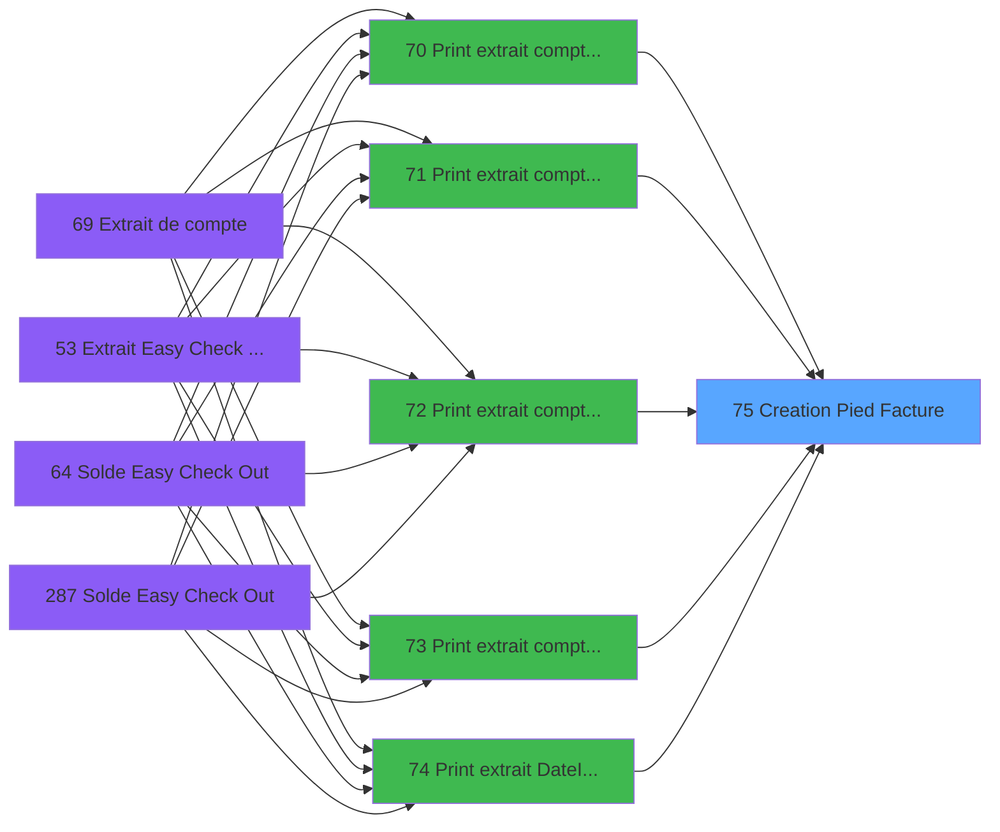

# ADH IDE 75 - Creation Pied Facture

> **Analyse**: Phases 1-4 2026-02-07 03:44 -> 02:11 (22h26min) | Assemblage 02:11
> **Pipeline**: V7.2 Enrichi
> **Structure**: 4 onglets (Resume | Ecrans | Donnees | Connexions)

<!-- TAB:Resume -->

## 1. FICHE D'IDENTITE

| Attribut | Valeur |
|----------|--------|
| Projet | ADH |
| IDE Position | 75 |
| Nom Programme | Creation Pied Facture |
| Fichier source | `Prg_75.xml` |
| Dossier IDE | Facturation |
| Taches | 1 (0 ecrans visibles) |
| Tables modifiees | 1 |
| Programmes appeles | 0 |
| Complexite | **BASSE** (score 7/100) |

## 2. DESCRIPTION FONCTIONNELLE

ADH IDE 75 - EXTRAIT_IMP est un programme utilitaire de génération de pied de page pour les factures d'extrait de compte. Appelé depuis six variantes d'impression d'extrait (filtrées par date, cumul, service, impression, etc.), il gère la création d'une zone de pied de page standardisée contenant les informations de synthèse et de clôture du document imprimé. Le programme opère exclusivement sur la table `log_maj_tpe` (log des mises à jour TPE), ce qui indique qu'il enregistre les traces d'impression pour audit ou rejeu.

Son rôle est de centraliser la logique de formatage du pied de facture, évitant la duplication de code entre les six points d'entrée d'impression. Cette architecture en entonnoir (6 callers → 1 programme utilitaire) garantit une cohérence visuelle et une maintenance unique des éléments de clôture (totaux, dates, signatures numériques, références document). L'enregistrement dans `log_maj_tpe` permet une traçabilité des impressions pour les audits de caisse.

Le programme s'inscrit dans la chaîne de production d'extraits de compte (ADH IDE 69-76), où chaque variante d'impression définit les critères de filtrage des mouvements, tandis que ce module 75 assure une présentation uniforme du résumé final. Son appel systématique depuis toutes les variantes d'impression confirm que le pied de facture est un élément obligatoire de tout extrait édité.

## 3. BLOCS FONCTIONNELS

### 3.1 Creation (1 tache)

Insertion de nouveaux enregistrements en base.

---

#### 75 - Creation Pied Facture [[ECRAN]](#ecran-t1)

**Role** : Creation d'enregistrement : Creation Pied Facture.
**Ecran** : 619 x 474 DLU | [Voir mockup](#ecran-t1)

## 5. REGLES METIER

*(Aucune regle metier identifiee dans les expressions)*

## 6. CONTEXTE

- **Appele par**: [Print extrait compte /Imp (IDE 73)](ADH-IDE-73.md), [Print extrait DateImp /O (IDE 74)](ADH-IDE-74.md), [Print extrait compte /Date (IDE 71)](ADH-IDE-71.md), [Print extrait compte /Cum (IDE 72)](ADH-IDE-72.md), [Print extrait compte /Nom (IDE 70)](ADH-IDE-70.md), [Print extrait compte /Service (IDE 76)](ADH-IDE-76.md)
- **Appelle**: 0 programmes | **Tables**: 1 (W:1 R:0 L:0) | **Taches**: 1 | **Expressions**: 12

<!-- TAB:Ecrans -->

## 8. ECRANS

*(Programme sans ecran visible)*

## 9. NAVIGATION

### 9.3 Structure hierarchique (1 tache)

| Position | Tache | Type | Dimensions | Bloc |
|----------|-------|------|------------|------|
| **75.1** | [**Creation Pied Facture** (75)](#t1) [mockup](#ecran-t1) | - | 619x474 | Creation |

### 9.4 Algorigramme

> **Legende**: Vert = START/END OK | Rouge = END KO | Bleu = Decisions
> *Algorigramme auto-genere. Utiliser `/algorigramme` pour une synthese metier detaillee.*

<!-- TAB:Donnees -->

## 10. TABLES

### Tables utilisees (1)

| ID | Nom | Description | Type | R | W | L | Usages |
|----|-----|-------------|------|---|---|---|--------|
| 867 | log_maj_tpe |  | DB |   | **W** |   | 1 |

### Colonnes par table (1 / 1 tables avec colonnes identifiees)

Table 867 - log_maj_tpe (**W**) - 1 usages

| Lettre | Variable | Acces | Type |
|--------|----------|-------|------|
| A | P.Societe | W | Alpha |
| B | P.Compte Gm | W | Numeric |
| C | P.Filiation | W | Numeric |
| D | P.Taux Tva | W | Numeric |
| E | P.Montant Ttc | W | Numeric |

## 11. VARIABLES

### 11.1 Parametres entrants (5)

Variables recues du programme appelant ([Print extrait compte /Imp (IDE 73)](ADH-IDE-73.md)).

| Lettre | Nom | Type | Usage dans |
|--------|-----|------|-----------|
| EN | P.Societe | Alpha | 1x parametre entrant |
| EO | P.Compte Gm | Numeric | 1x parametre entrant |
| EP | P.Filiation | Numeric | 1x parametre entrant |
| EQ | P.Taux Tva | Numeric | 5x parametre entrant |
| ER | P.Montant Ttc | Numeric | 6x parametre entrant |

## 12. EXPRESSIONS

**12 / 12 expressions decodees (100%)**

### 12.1 Repartition par type

| Type | Expressions | Regles |
|------|-------------|--------|
| CALCULATION | 4 | 0 |
| CALCUL | 2 | 0 |
| CONSTANTE | 1 | 0 |
| OTHER | 4 | 0 |
| STRING | 1 | 0 |

### 12.2 Expressions cles par type

#### CALCULATION (4 expressions)

| Type | IDE | Expression | Regle |
|------|-----|------------|-------|
| CALCULATION | 8 | `[N]+P.Montant Ttc [E]` | - |
| CALCULATION | 9 | `[W]+P.Montant Ttc [E]` | - |
| CALCULATION | 4 | `[L]+(P.Montant Ttc [E]/(1+P.Taux Tva [D]/100))` | - |
| CALCULATION | 5 | `[U]+(P.Montant Ttc [E]/(1+P.Taux Tva [D]/100))` | - |

#### CALCUL (2 expressions)

| Type | IDE | Expression | Regle |
|------|-----|------------|-------|
| CALCUL | 7 | `[V]+Round((P.Montant Ttc [E]/(1+P.Taux Tva [D]/100)*P.Taux Tva [D]/100),12,2)` | - |
| CALCUL | 6 | `[M]+Round((P.Montant Ttc [E]/(1+P.Taux Tva [D]/100)*P.Taux Tva [D]/100),12,2)` | - |

#### CONSTANTE (1 expressions)

| Type | IDE | Expression | Regle |
|------|-----|------------|-------|
| CONSTANTE | 3 | `999` | - |

#### OTHER (4 expressions)

| Type | IDE | Expression | Regle |
|------|-----|------------|-------|
| OTHER | 11 | `P.Compte Gm [B]` | - |
| OTHER | 12 | `P.Filiation [C]` | - |
| OTHER | 2 | `P.Taux Tva [D]` | - |
| OTHER | 10 | `P.Societe [A]` | - |

#### STRING (1 expressions)

| Type | IDE | Expression | Regle |
|------|-----|------------|-------|
| STRING | 1 | `Val(Fill('9',10),'10')` | - |

<!-- TAB:Connexions -->

## 13. GRAPHE D'APPELS

### 13.1 Chaine depuis Main (Callers)

Main -> ... -> [Print extrait compte /Imp (IDE 73)](ADH-IDE-73.md) -> **Creation Pied Facture (IDE 75)**

Main -> ... -> [Print extrait DateImp /O (IDE 74)](ADH-IDE-74.md) -> **Creation Pied Facture (IDE 75)**

Main -> ... -> [Print extrait compte /Date (IDE 71)](ADH-IDE-71.md) -> **Creation Pied Facture (IDE 75)**

Main -> ... -> [Print extrait compte /Cum (IDE 72)](ADH-IDE-72.md) -> **Creation Pied Facture (IDE 75)**

Main -> ... -> [Print extrait compte /Nom (IDE 70)](ADH-IDE-70.md) -> **Creation Pied Facture (IDE 75)**

Main -> ... -> [Print extrait compte /Service (IDE 76)](ADH-IDE-76.md) -> **Creation Pied Facture (IDE 75)**

### 13.2 Callers

| IDE | Nom Programme | Nb Appels |
|-----|---------------|-----------|
| [73](ADH-IDE-73.md) | Print extrait compte /Imp | 6 |
| [74](ADH-IDE-74.md) | Print extrait DateImp /O | 6 |
| [71](ADH-IDE-71.md) | Print extrait compte /Date | 5 |
| [72](ADH-IDE-72.md) | Print extrait compte /Cum | 5 |
| [70](ADH-IDE-70.md) | Print extrait compte /Nom | 4 |
| [76](ADH-IDE-76.md) | Print extrait compte /Service | 4 |

### 13.3 Callees (programmes appeles)

### 13.4 Detail Callees avec contexte

| IDE | Nom Programme | Appels | Contexte |
|-----|---------------|--------|----------|
| - | (aucun) | - | - |

## 14. RECOMMANDATIONS MIGRATION

### 14.1 Profil du programme

| Metrique | Valeur | Impact migration |
|----------|--------|-----------------|
| Lignes de logique | 39 | Programme compact |
| Expressions | 12 | Peu de logique |
| Tables WRITE | 1 | Impact faible |
| Sous-programmes | 0 | Peu de dependances |
| Ecrans visibles | 0 | Ecran unique ou traitement batch |
| Code desactive | 0% (0 / 39) | Code sain |
| Regles metier | 0 | Pas de regle identifiee |

### 14.2 Plan de migration par bloc

#### Creation (1 tache: 1 ecran, 0 traitement)

- **Strategie** : Repository pattern avec Entity Framework Core.
- Insertion via `IRepository<T>.CreateAsync()`

### 14.3 Dependances critiques

| Dependance | Type | Appels | Impact |
|------------|------|--------|--------|
| log_maj_tpe | Table WRITE (Database) | 1x | Schema + repository |

---
*Spec DETAILED generee par Pipeline V7.2 - 2026-02-08 02:11*
