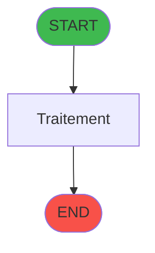
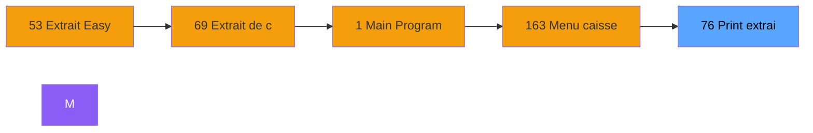
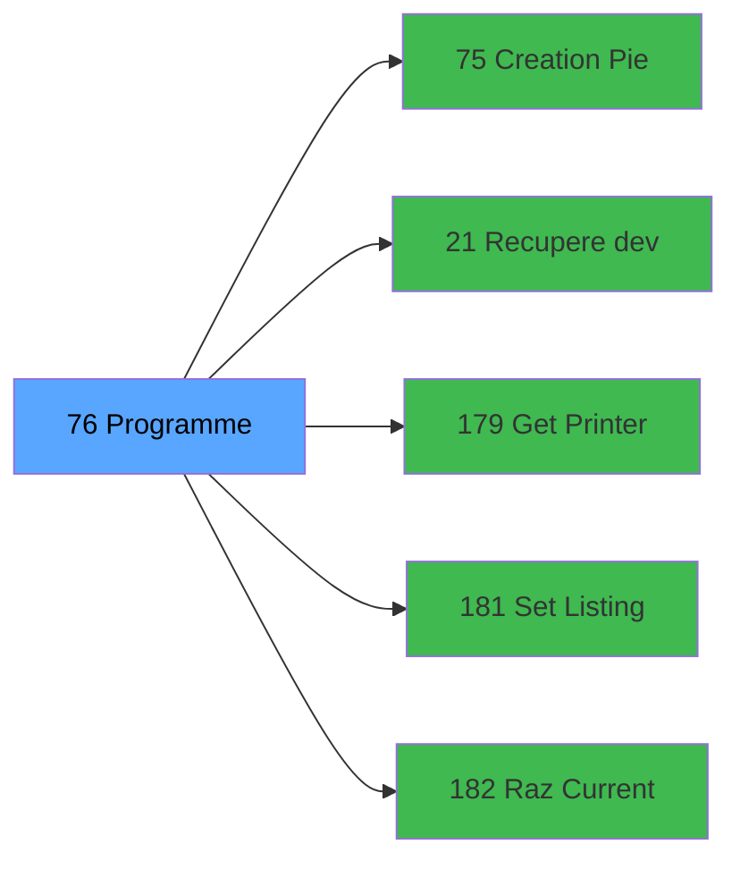

# ADH IDE 76 - Print extrait compte /Service

> **Version spec**: 3.5
> **Analyse**: 2026-01-27 17:57
> **Source**: `Prg_XXX.xml`

---

<!-- TAB:Fonctionnel -->

## SPECIFICATION FONCTIONNELLE

### 1.1 Objectif metier

| Element | Description |
|---------|-------------|
| **Qui** | Operateur |
| **Quoi** | Print extrait compte /Service
 |
| **Pourquoi** | A documenter |
| **Declencheur** | A identifier |

### 1.2 Regles metier

| Code | Regle | Condition |
|------|-------|-----------|
| RM-001 | A documenter | - |

### 1.3 Flux utilisateur

1. Demarrage programme
2. Traitement principal
3. Fin programme

### 1.4 Cas d'erreur

| Erreur | Comportement |
|--------|--------------|
| - | A documenter |

---

<!-- TAB:Technique -->

## SPECIFICATION TECHNIQUE

### 2.1 Identification

| Attribut | Valeur |
|----------|--------|
| **Format IDE** | ADH IDE 76 |
| **Description** | Print extrait compte /Service
 |
| **Module** | ADH |

### 2.2 Tables

| # | Nom logique | Nom physique | Acces | Usage |
|---|-------------|--------------|-------|-------|
| 30 | gm-recherche_____gmr | `cafil008_dat` | L | 4x |
| 30 | gm-recherche_____gmr | `cafil008_dat` | R | 1x |
| 31 | gm-complet_______gmc | `cafil009_dat` | L | 1x |
| 31 | gm-complet_______gmc | `cafil009_dat` | R | 2x |
| 34 | hebergement______heb | `cafil012_dat` | L | 1x |
| 40 | comptable________cte | `cafil018_dat` | L | 2x |
| 40 | comptable________cte | `cafil018_dat` | R | 6x |
| 67 | tables___________tab | `cafil045_dat` | L | 3x |
| 400 | pv_cust_rentals | `pv_rentals_dat` | L | 1x |
| 413 | pv_tva | `pv_tva_dat` | L | 1x |
| 867 | log_maj_tpe | `log_maj_tpe` | **W** | 4x |
| 928 | type_lit | `type_lit` | L | 2x |
### 2.3 Parametres d'entree

| Variable | Nom | Type | Picture |
|----------|-----|------|---------|
| - | Aucun parametre | - | - |
### 2.4 Algorigramme

### 2.5 Expressions cles

| IDE | Expression | Commentaire |
|-----|------------|-------------|
| 1 | `GetParam ('LISTINGNUMPRINTERCHOICE')` | - |
| 2 | `IsComponent () AND NOT({0,14})` | - |
| 3 | `SetCrsr (1)` | - |
| 4 | `SetCrsr (2)` | - |
| 5 | `Left ({0,4},Len (RTrim ({0,4}))-1)` | - |
| 6 | `GetParam ('CURRENTPRINTERNUM')=1` | - |
| 7 | `GetParam ('CURRENTPRINTERNUM')=8` | - |
| 8 | `GetParam ('CURRENTPRINTERNUM')=9` | - |
| 9 | `DbDel ('{867,4}'DSOURCE,'')` | - |
| 10 | `NOT({0,9})` | - |
| 11 | `'Extrait de compte / Account statement'` | - |
| 12 | `'Par Service / By Service'` | - |
| 13 | `'TRUE'LOG` | - |

> **Total**: 13 expressions (affichees: 13)
### 2.6 Variables importantes

### 2.7 Statistiques

| Metrique | Valeur |
|----------|--------|
| **Taches** | 17 |
| **Lignes logique** | 626 |
| **Lignes desactivees** | 0 |
---

<!-- TAB:Cartographie -->

## CARTOGRAPHIE APPLICATIVE

### 3.1 Chaine d'appels depuis Main

### 3.2 Callers directs

| IDE | Programme | Nb appels |
|-----|-----------|-----------|
| 53 | Extrait Easy Check Out à J+1 | 1 |
| 69 | Extrait de compte | 1 |
### 3.3 Callees

| Niv | IDE | Programme | Nb appels |
|-----|-----|-----------|-----------|
| 1 | 75 | Creation Pied Facture | 4 |
| 1 | 21 | Recupere devise local | 1 |
| 1 | 179 | Get Printer | 1 |
| 1 | 181 | Set Listing Number | 1 |
| 1 | 182 | Raz Current Printer | 1 |
### 3.4 Verification orphelin

| Critere | Resultat |
|---------|----------|
| Callers actifs | A verifier |
| **Conclusion** | A analyser |

---

## HISTORIQUE

| Date | Action | Auteur |
|------|--------|--------|
| 2026-01-27 20:19 | **DATA V2** - Tables reelles, Expressions, Stats, CallChain | Script |
| 2026-01-27 19:45 | **DATA POPULATED** - Tables, Callgraph (13 expr) | Script |
| 2026-01-27 17:57 | **Upgrade V3.5** - TAB markers, Mermaid | Claude |

---

*Specification V3.5 - Format avec TAB markers et Mermaid*
