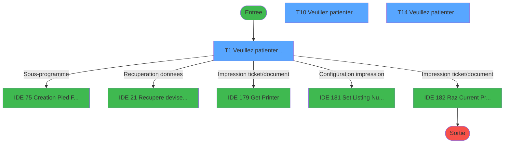
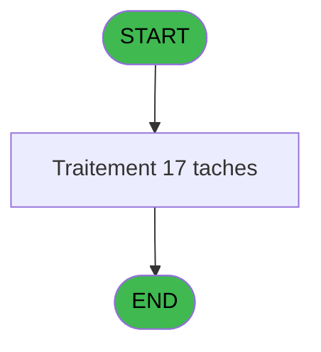

# ADH IDE 76 - Print extrait compte /Service

> **Analyse**: Phases 1-4 2026-02-07 03:44 -> 03:44 (28s) | Assemblage 06:50
> **Pipeline**: V7.2 Enrichi
> **Structure**: 4 onglets (Resume | Ecrans | Donnees | Connexions)

<!-- TAB:Resume -->

## 1. FICHE D'IDENTITE

| Attribut | Valeur |
|----------|--------|
| Projet | ADH |
| IDE Position | 76 |
| Nom Programme | Print extrait compte /Service |
| Fichier source | `Prg_76.xml` |
| Dossier IDE | EzCard |
| Taches | 17 (3 ecrans visibles) |
| Tables modifiees | 1 |
| Programmes appeles | 5 |

## 2. DESCRIPTION FONCTIONNELLE

**Print extrait compte /Service** assure la gestion complete de ce processus, accessible depuis [Extrait Easy Check Out à J+1 (IDE 53)](ADH-IDE-53.md), [Extrait de compte (IDE 69)](ADH-IDE-69.md).

Le flux de traitement s'organise en **2 blocs fonctionnels** :

- **Impression** (13 taches) : generation de tickets et documents
- **Traitement** (4 taches) : traitements metier divers

**Donnees modifiees** : 1 tables en ecriture (log_maj_tpe).

Detail : phases du traitement

#### Phase 1 : Traitement (4 taches)

- **T1** - Veuillez patienter... **[ECRAN]**
- **T10** - Veuillez patienter... **[ECRAN]**
- **T14** - Veuillez patienter... **[ECRAN]**
- **T17** - recup nom adherent

Delegue a : [Recupere devise local (IDE 21)](ADH-IDE-21.md), [Set Listing Number (IDE 181)](ADH-IDE-181.md)

#### Phase 2 : Impression (13 taches)

- **T2** - Printer 1
- **T3** - edition extrait compte
- **T4** - Edition du pied
- **T5** - Edition recap Free Etra
- **T6** - edition extrait compte
- **T7** - Edition du pied
- **T8** - Edition recap Free Etra
- **T9** - Printer 8 **[ECRAN]**
- **T11** - Edition du pied
- **T12** - Edition recap Free Etra
- **T13** - Printer 9 **[ECRAN]**
- **T15** - Edition du pied
- **T16** - Edition recap Free Etra

Delegue a : [Get Printer (IDE 179)](ADH-IDE-179.md), [Set Listing Number (IDE 181)](ADH-IDE-181.md), [Raz Current Printer (IDE 182)](ADH-IDE-182.md)

#### Tables impactees

| Table | Operations | Role metier |
|-------|-----------|-------------|
| log_maj_tpe | **W** (4 usages) |  |

## 3. BLOCS FONCTIONNELS

### 3.1 Traitement (4 taches)

Traitements internes.

---

#### T1 - Veuillez patienter... [ECRAN]

**Role** : Traitement : Veuillez patienter....
**Ecran** : 422 x 56 DLU (MDI) | [Voir mockup](#ecran-t1)

3 sous-taches directes

| Tache | Nom | Bloc |
|-------|-----|------|
| [T10](#t10) | Veuillez patienter... **[ECRAN]** | Traitement |
| [T14](#t14) | Veuillez patienter... **[ECRAN]** | Traitement |
| [T17](#t17) | recup nom adherent | Traitement |

**Delegue a** : [Recupere devise local (IDE 21)](ADH-IDE-21.md), [Set Listing Number (IDE 181)](ADH-IDE-181.md)

---

#### T10 - Veuillez patienter... [ECRAN]

**Role** : Traitement : Veuillez patienter....
**Ecran** : 422 x 57 DLU (MDI) | [Voir mockup](#ecran-t10)
**Delegue a** : [Recupere devise local (IDE 21)](ADH-IDE-21.md), [Set Listing Number (IDE 181)](ADH-IDE-181.md)

---

#### T14 - Veuillez patienter... [ECRAN]

**Role** : Traitement : Veuillez patienter....
**Ecran** : 422 x 57 DLU (MDI) | [Voir mockup](#ecran-t14)
**Delegue a** : [Recupere devise local (IDE 21)](ADH-IDE-21.md), [Set Listing Number (IDE 181)](ADH-IDE-181.md)

---

#### T17 - recup nom adherent

**Role** : Consultation/chargement : recup nom adherent.
**Variables liees** : B (P0 code adherent), S (W0 n° adherent)
**Delegue a** : [Recupere devise local (IDE 21)](ADH-IDE-21.md), [Set Listing Number (IDE 181)](ADH-IDE-181.md)

### 3.2 Impression (13 taches)

Generation des documents et tickets.

---

#### T2 - Printer 1

**Role** : Generation du document : Printer 1.

---

#### T3 - edition extrait compte

**Role** : Generation du document : edition extrait compte.
**Variables liees** : BC (W0 masque extrait), BA (v. Libelle edition)

---

#### T4 - Edition du pied

**Role** : Generation du document : Edition du pied.
**Variables liees** : BA (v. Libelle edition)

---

#### T5 - Edition recap Free Etra

**Role** : Generation du document : Edition recap Free Etra.
**Variables liees** : BA (v. Libelle edition)

---

#### T6 - edition extrait compte

**Role** : Generation du document : edition extrait compte.
**Variables liees** : BC (W0 masque extrait), BA (v. Libelle edition)

---

#### T7 - Edition du pied

**Role** : Generation du document : Edition du pied.
**Variables liees** : BA (v. Libelle edition)

---

#### T8 - Edition recap Free Etra

**Role** : Generation du document : Edition recap Free Etra.
**Variables liees** : BA (v. Libelle edition)

---

#### T9 - Printer 8 [ECRAN]

**Role** : Generation du document : Printer 8.
**Ecran** : 422 x 57 DLU (MDI) | [Voir mockup](#ecran-t9)

---

#### T11 - Edition du pied

**Role** : Generation du document : Edition du pied.
**Variables liees** : BA (v. Libelle edition)

---

#### T12 - Edition recap Free Etra

**Role** : Generation du document : Edition recap Free Etra.
**Variables liees** : BA (v. Libelle edition)

---

#### T13 - Printer 9 [ECRAN]

**Role** : Generation du document : Printer 9.
**Ecran** : 422 x 57 DLU (MDI) | [Voir mockup](#ecran-t13)

---

#### T15 - Edition du pied

**Role** : Generation du document : Edition du pied.
**Variables liees** : BA (v. Libelle edition)

---

#### T16 - Edition recap Free Etra

**Role** : Generation du document : Edition recap Free Etra.
**Variables liees** : BA (v. Libelle edition)

## 5. REGLES METIER

*(Aucune regle metier identifiee)*

## 6. CONTEXTE

- **Appele par**: [Extrait Easy Check Out à J+1 (IDE 53)](ADH-IDE-53.md), [Extrait de compte (IDE 69)](ADH-IDE-69.md)
- **Appelle**: 5 programmes | **Tables**: 9 (W:1 R:3 L:8) | **Taches**: 17 | **Expressions**: 13

<!-- TAB:Ecrans -->

## 8. ECRANS

### 8.1 Forms visibles (3 / 17)

| # | Position | Tache | Nom | Type | Largeur | Hauteur | Bloc |
|---|----------|-------|-----|------|---------|---------|------|
| 1 | 76 | T1 | Veuillez patienter... | MDI | 422 | 56 | Traitement |
| 2 | 76.2.1 | T10 | Veuillez patienter... | MDI | 422 | 57 | Traitement |
| 3 | 76.3.1 | T14 | Veuillez patienter... | MDI | 422 | 57 | Traitement |

### 8.2 Mockups Ecrans

---

#### 76 - Veuillez patienter...
**Tache** : [T1](#t1) | **Type** : MDI | **Dimensions** : 422 x 56 DLU
**Bloc** : Traitement | **Titre IDE** : Veuillez patienter...

<!-- FORM-DATA:
{
    "width":  422,
    "vFactor":  8,
    "type":  "MDI",
    "hFactor":  8,
    "controls":  [
                     {
                         "x":  0,
                         "type":  "label",
                         "var":  "",
                         "y":  0,
                         "w":  423,
                         "fmt":  "",
                         "name":  "",
                         "h":  29,
                         "color":  "",
                         "text":  "",
                         "parent":  null
                     },
                     {
                         "x":  120,
                         "type":  "label",
                         "var":  "",
                         "y":  10,
                         "w":  221,
                         "fmt":  "",
                         "name":  "",
                         "h":  8,
                         "color":  "7",
                         "text":  "Impression en cours ...",
                         "parent":  null
                     },
                     {
                         "x":  0,
                         "type":  "label",
                         "var":  "",
                         "y":  29,
                         "w":  423,
                         "fmt":  "",
                         "name":  "",
                         "h":  27,
                         "color":  "",
                         "text":  "",
                         "parent":  null
                     },
                     {
                         "x":  69,
                         "type":  "label",
                         "var":  "",
                         "y":  38,
                         "w":  285,
                         "fmt":  "",
                         "name":  "",
                         "h":  8,
                         "color":  "",
                         "text":  "Edition de l\u0027extrait de compte",
                         "parent":  null
                     },
                     {
                         "x":  4,
                         "type":  "image",
                         "var":  "",
                         "y":  2,
                         "w":  72,
                         "fmt":  "",
                         "name":  "",
                         "h":  25,
                         "color":  "",
                         "text":  "",
                         "parent":  null
                     }
                 ],
    "taskId":  "76",
    "height":  56
}
-->

---

#### 76.2.1 - Veuillez patienter...
**Tache** : [T10](#t10) | **Type** : MDI | **Dimensions** : 422 x 57 DLU
**Bloc** : Traitement | **Titre IDE** : Veuillez patienter...

<!-- FORM-DATA:
{
    "width":  422,
    "vFactor":  8,
    "type":  "MDI",
    "hFactor":  8,
    "controls":  [
                     {
                         "x":  0,
                         "type":  "label",
                         "var":  "",
                         "y":  0,
                         "w":  423,
                         "fmt":  "",
                         "name":  "",
                         "h":  29,
                         "color":  "",
                         "text":  "",
                         "parent":  null
                     },
                     {
                         "x":  120,
                         "type":  "label",
                         "var":  "",
                         "y":  10,
                         "w":  221,
                         "fmt":  "",
                         "name":  "",
                         "h":  8,
                         "color":  "7",
                         "text":  "Impression en cours ...",
                         "parent":  null
                     },
                     {
                         "x":  0,
                         "type":  "label",
                         "var":  "",
                         "y":  29,
                         "w":  423,
                         "fmt":  "",
                         "name":  "",
                         "h":  27,
                         "color":  "",
                         "text":  "",
                         "parent":  null
                     },
                     {
                         "x":  69,
                         "type":  "label",
                         "var":  "",
                         "y":  38,
                         "w":  285,
                         "fmt":  "",
                         "name":  "",
                         "h":  8,
                         "color":  "",
                         "text":  "Edition de l\u0027extrait de compte",
                         "parent":  null
                     },
                     {
                         "x":  4,
                         "type":  "image",
                         "var":  "",
                         "y":  2,
                         "w":  72,
                         "fmt":  "",
                         "name":  "",
                         "h":  25,
                         "color":  "",
                         "text":  "",
                         "parent":  null
                     }
                 ],
    "taskId":  "76.2.1",
    "height":  57
}
-->

---

#### 76.3.1 - Veuillez patienter...
**Tache** : [T14](#t14) | **Type** : MDI | **Dimensions** : 422 x 57 DLU
**Bloc** : Traitement | **Titre IDE** : Veuillez patienter...

<!-- FORM-DATA:
{
    "width":  422,
    "vFactor":  8,
    "type":  "MDI",
    "hFactor":  8,
    "controls":  [
                     {
                         "x":  0,
                         "type":  "label",
                         "var":  "",
                         "y":  0,
                         "w":  423,
                         "fmt":  "",
                         "name":  "",
                         "h":  29,
                         "color":  "",
                         "text":  "",
                         "parent":  null
                     },
                     {
                         "x":  120,
                         "type":  "label",
                         "var":  "",
                         "y":  10,
                         "w":  221,
                         "fmt":  "",
                         "name":  "",
                         "h":  8,
                         "color":  "7",
                         "text":  "Impression en cours ...",
                         "parent":  null
                     },
                     {
                         "x":  0,
                         "type":  "label",
                         "var":  "",
                         "y":  29,
                         "w":  423,
                         "fmt":  "",
                         "name":  "",
                         "h":  27,
                         "color":  "",
                         "text":  "",
                         "parent":  null
                     },
                     {
                         "x":  69,
                         "type":  "label",
                         "var":  "",
                         "y":  38,
                         "w":  285,
                         "fmt":  "",
                         "name":  "",
                         "h":  8,
                         "color":  "",
                         "text":  "Edition de l\u0027extrait de compte",
                         "parent":  null
                     },
                     {
                         "x":  4,
                         "type":  "image",
                         "var":  "",
                         "y":  2,
                         "w":  72,
                         "fmt":  "",
                         "name":  "",
                         "h":  25,
                         "color":  "",
                         "text":  "",
                         "parent":  null
                     }
                 ],
    "taskId":  "76.3.1",
    "height":  57
}
-->

## 9. NAVIGATION

### 9.1 Enchainement des ecrans

**Detail par enchainement :**

| Depuis | Action | Vers | Retour |
|--------|--------|------|--------|
| Veuillez patienter... | Sous-programme | [Creation Pied Facture (IDE 75)](ADH-IDE-75.md) | Retour ecran |
| Veuillez patienter... | Recuperation donnees | [Recupere devise local (IDE 21)](ADH-IDE-21.md) | Retour ecran |
| Veuillez patienter... | Impression ticket/document | [Get Printer (IDE 179)](ADH-IDE-179.md) | Retour ecran |
| Veuillez patienter... | Configuration impression | [Set Listing Number (IDE 181)](ADH-IDE-181.md) | Retour ecran |
| Veuillez patienter... | Impression ticket/document | [Raz Current Printer (IDE 182)](ADH-IDE-182.md) | Retour ecran |

### 9.3 Structure hierarchique (17 taches)

| Position | Tache | Type | Dimensions | Bloc |
|----------|-------|------|------------|------|
| **76.1** | [**Veuillez patienter...** (T1)](#t1) [mockup](#ecran-t1) | MDI | 422x56 | Traitement |
| 76.1.1 | [Veuillez patienter... (T10)](#t10) [mockup](#ecran-t10) | MDI | 422x57 | |
| 76.1.2 | [Veuillez patienter... (T14)](#t14) [mockup](#ecran-t14) | MDI | 422x57 | |
| 76.1.3 | [recup nom adherent (T17)](#t17) | MDI | - | |
| **76.2** | [**Printer 1** (T2)](#t2) | MDI | - | Impression |
| 76.2.1 | [edition extrait compte (T3)](#t3) | MDI | - | |
| 76.2.2 | [Edition du pied (T4)](#t4) | - | - | |
| 76.2.3 | [Edition recap Free Etra (T5)](#t5) | - | - | |
| 76.2.4 | [edition extrait compte (T6)](#t6) | MDI | - | |
| 76.2.5 | [Edition du pied (T7)](#t7) | - | - | |
| 76.2.6 | [Edition recap Free Etra (T8)](#t8) | - | - | |
| 76.2.7 | [Printer 8 (T9)](#t9) [mockup](#ecran-t9) | MDI | 422x57 | |
| 76.2.8 | [Edition du pied (T11)](#t11) | - | - | |
| 76.2.9 | [Edition recap Free Etra (T12)](#t12) | - | - | |
| 76.2.10 | [Printer 9 (T13)](#t13) [mockup](#ecran-t13) | MDI | 422x57 | |
| 76.2.11 | [Edition du pied (T15)](#t15) | - | - | |
| 76.2.12 | [Edition recap Free Etra (T16)](#t16) | - | - | |

### 9.4 Algorigramme

> *algo-data indisponible. Utiliser `/algorigramme` pour generer.*

<!-- TAB:Donnees -->

## 10. TABLES

### Tables utilisees (9)

| ID | Nom | Description | Type | R | W | L | Usages |
|----|-----|-------------|------|---|---|---|--------|
| 30 | gm-recherche_____gmr | Index de recherche | DB | R |   | L | 5 |
| 31 | gm-complet_______gmc |  | DB | R |   | L | 3 |
| 34 | hebergement______heb | Hebergement (chambres) | DB |   |   | L | 1 |
| 40 | comptable________cte |  | DB | R |   | L | 8 |
| 67 | tables___________tab |  | DB |   |   | L | 3 |
| 400 | pv_cust_rentals |  | DB |   |   | L | 1 |
| 413 | pv_tva |  | DB |   |   | L | 1 |
| 867 | log_maj_tpe |  | DB |   | **W** |   | 4 |
| 928 | type_lit |  | DB |   |   | L | 2 |

### Colonnes par table (1 / 4 tables avec colonnes identifiees)

Table 30 - gm-recherche_____gmr (R/L) - 5 usages

*Table utilisee uniquement en Link ou aucune colonne Real identifiee dans le DataView.*

Table 31 - gm-complet_______gmc (R/L) - 3 usages

*Table utilisee uniquement en Link ou aucune colonne Real identifiee dans le DataView.*

Table 40 - comptable________cte (R/L) - 8 usages

| Lettre | Variable | Acces | Type |
|--------|----------|-------|------|
| A | W1 cumul compte | R | Numeric |
| B | W1 solde compte | R | Numeric |
| C | W1 ss_total compte | R | Numeric |
| D | v.retour offre | R | Logical |
| E | W1 detection papier | R | Alpha |
| F | W1 inhibe panel | R | Alpha |
| G | W1 massicot | R | Alpha |
| H | W1 selection feuille | R | Alpha |
| I | W1 selection rouleau | R | Alpha |
| J | W1 cumul compte | R | Numeric |
| K | W1 solde compte | R | Numeric |
| L | W1 ss_total compte | R | Numeric |
| M | v.retour special offer | R | Logical |

Table 867 - log_maj_tpe (**W**) - 4 usages

*Table utilisee uniquement en Link ou aucune colonne Real identifiee dans le DataView.*

## 11. VARIABLES

### 11.1 Parametres entrants (15)

Variables recues du programme appelant ([Extrait Easy Check Out à J+1 (IDE 53)](ADH-IDE-53.md)).

| Lettre | Nom | Type | Usage dans |
|--------|-----|------|-----------|
| A | P0 societe | Alpha | - |
| B | P0 code adherent | Numeric | - |
| C | P0 filiation | Numeric | - |
| D | P0 masque montant | Alpha | 1x parametre entrant |
| E | P0 nom village | Alpha | - |
| F | P0 fictif | Logical | - |
| G | P0 date comptable | Date | - |
| H | P0 Edtion Tva V2 | Logical | - |
| I | P.FormatPdf | Logical | 1x parametre entrant |
| J | P.Chemin | Alpha | - |
| K | P.NomFichierPdf | Alpha | - |
| L | P.Print or Email | Alpha | - |
| M | P.Print GIFT PASS | Logical | - |
| N | P.Appel Direct | Logical | 1x parametre entrant |
| O | P. Sans annulations | Logical | - |

### 11.2 Variables de session (2)

Variables persistantes pendant toute la session.

| Lettre | Nom | Type | Usage dans |
|--------|-----|------|-----------|
| BA | v. Libelle edition | Alpha | - |
| BB | v. Libelle Categ | Alpha | - |

### 11.3 Variables de travail (13)

Variables internes au programme.

| Lettre | Nom | Type | Usage dans |
|--------|-----|------|-----------|
| P | W0 nom | Alpha | - |
| Q | W0 prenom | Alpha | - |
| R | W0 titre | Alpha | - |
| S | W0 n° adherent | Numeric | - |
| T | W0 lettre contrôle | Alpha | - |
| U | W0 filiation | Numeric | - |
| V | W0 langue parlee | Alpha | - |
| W | W0 chambre | Alpha | - |
| X | W0 Date Début Séjour | Date | - |
| Y | W0 Date Fin Séjour | Date | - |
| Z | W0 code inscription | Unicode | - |
| BC | W0 masque extrait | Alpha | - |
| BD | W0 devise local | Alpha | - |

Toutes les 30 variables (liste complete)

| Cat | Lettre | Nom Variable | Type |
|-----|--------|--------------|------|
| P0 | **A** | P0 societe | Alpha |
| P0 | **B** | P0 code adherent | Numeric |
| P0 | **C** | P0 filiation | Numeric |
| P0 | **D** | P0 masque montant | Alpha |
| P0 | **E** | P0 nom village | Alpha |
| P0 | **F** | P0 fictif | Logical |
| P0 | **G** | P0 date comptable | Date |
| P0 | **H** | P0 Edtion Tva V2 | Logical |
| P0 | **I** | P.FormatPdf | Logical |
| P0 | **J** | P.Chemin | Alpha |
| P0 | **K** | P.NomFichierPdf | Alpha |
| P0 | **L** | P.Print or Email | Alpha |
| P0 | **M** | P.Print GIFT PASS | Logical |
| P0 | **N** | P.Appel Direct | Logical |
| P0 | **O** | P. Sans annulations | Logical |
| W0 | **P** | W0 nom | Alpha |
| W0 | **Q** | W0 prenom | Alpha |
| W0 | **R** | W0 titre | Alpha |
| W0 | **S** | W0 n° adherent | Numeric |
| W0 | **T** | W0 lettre contrôle | Alpha |
| W0 | **U** | W0 filiation | Numeric |
| W0 | **V** | W0 langue parlee | Alpha |
| W0 | **W** | W0 chambre | Alpha |
| W0 | **X** | W0 Date Début Séjour | Date |
| W0 | **Y** | W0 Date Fin Séjour | Date |
| W0 | **Z** | W0 code inscription | Unicode |
| W0 | **BC** | W0 masque extrait | Alpha |
| W0 | **BD** | W0 devise local | Alpha |
| V. | **BA** | v. Libelle edition | Alpha |
| V. | **BB** | v. Libelle Categ | Alpha |

## 12. EXPRESSIONS

**13 / 13 expressions decodees (100%)**

### 12.1 Repartition par type

| Type | Expressions | Regles |
|------|-------------|--------|
| CALCULATION | 1 | 0 |
| CONSTANTE | 2 | 0 |
| OTHER | 6 | 0 |
| CONDITION | 3 | 0 |
| CAST_LOGIQUE | 1 | 0 |

### 12.2 Expressions cles par type

#### CALCULATION (1 expressions)

| Type | IDE | Expression | Regle |
|------|-----|------------|-------|
| CALCULATION | 5 | `Left (P0 masque montant [D],Len (RTrim (P0 masque montant [D]))-1)` | - |

#### CONSTANTE (2 expressions)

| Type | IDE | Expression | Regle |
|------|-----|------------|-------|
| CONSTANTE | 12 | `'Par Service / By Service'` | - |
| CONSTANTE | 11 | `'Extrait de compte / Account statement'` | - |

#### OTHER (6 expressions)

| Type | IDE | Expression | Regle |
|------|-----|------------|-------|
| OTHER | 4 | `SetCrsr (2)` | - |
| OTHER | 9 | `DbDel ('{867,4}'DSOURCE,'')` | - |
| OTHER | 10 | `NOT(P.FormatPdf [I])` | - |
| OTHER | 1 | `GetParam ('LISTINGNUMPRINTERCHOICE')` | - |
| OTHER | 2 | `IsComponent () AND NOT(P.Appel Direct [N])` | - |
| ... | | *+1 autres* | |

#### CONDITION (3 expressions)

| Type | IDE | Expression | Regle |
|------|-----|------------|-------|
| CONDITION | 8 | `GetParam ('CURRENTPRINTERNUM')=9` | - |
| CONDITION | 7 | `GetParam ('CURRENTPRINTERNUM')=8` | - |
| CONDITION | 6 | `GetParam ('CURRENTPRINTERNUM')=1` | - |

#### CAST_LOGIQUE (1 expressions)

| Type | IDE | Expression | Regle |
|------|-----|------------|-------|
| CAST_LOGIQUE | 13 | `'TRUE'LOG` | - |

<!-- TAB:Connexions -->

## 13. GRAPHE D'APPELS

### 13.1 Chaine depuis Main (Callers)

Main -> ... -> [Extrait Easy Check Out à J+1 (IDE 53)](ADH-IDE-53.md) -> **Print extrait compte /Service (IDE 76)**

Main -> ... -> [Extrait de compte (IDE 69)](ADH-IDE-69.md) -> **Print extrait compte /Service (IDE 76)**

### 13.2 Callers

| IDE | Nom Programme | Nb Appels |
|-----|---------------|-----------|
| [53](ADH-IDE-53.md) | Extrait Easy Check Out à J+1 | 1 |
| [69](ADH-IDE-69.md) | Extrait de compte | 1 |

### 13.3 Callees (programmes appeles)

### 13.4 Detail Callees avec contexte

| IDE | Nom Programme | Appels | Contexte |
|-----|---------------|--------|----------|
| [75](ADH-IDE-75.md) | Creation Pied Facture | 4 | Sous-programme |
| [21](ADH-IDE-21.md) | Recupere devise local | 1 | Recuperation donnees |
| [179](ADH-IDE-179.md) | Get Printer | 1 | Impression ticket/document |
| [181](ADH-IDE-181.md) | Set Listing Number | 1 | Configuration impression |
| [182](ADH-IDE-182.md) | Raz Current Printer | 1 | Impression ticket/document |

## 14. RECOMMANDATIONS MIGRATION

### 14.1 Profil du programme

| Metrique | Valeur | Impact migration |
|----------|--------|-----------------|
| Lignes de logique | 626 | Programme volumineux |
| Expressions | 13 | Peu de logique |
| Tables WRITE | 1 | Impact faible |
| Sous-programmes | 5 | Peu de dependances |
| Ecrans visibles | 3 | Quelques ecrans |
| Code desactive | 0.2% (1 / 626) | Code sain |
| Regles metier | 0 | Pas de regle identifiee |

### 14.2 Plan de migration par bloc

#### Traitement (4 taches: 3 ecrans, 1 traitement)

- **Strategie** : Orchestrateur avec 3 ecrans (Razor/React) et 1 traitements backend (services).
- Les ecrans deviennent des composants UI, les traitements invisibles deviennent des services injectables.
- 5 sous-programme(s) a migrer ou a reutiliser depuis les services existants.
- Decomposer les taches en services unitaires testables.

#### Impression (13 taches: 2 ecrans, 11 traitements)

- **Strategie** : Templates HTML -> PDF via wkhtmltopdf ou Puppeteer.
- `PrintService` injectable avec choix imprimante

### 14.3 Dependances critiques

| Dependance | Type | Appels | Impact |
|------------|------|--------|--------|
| log_maj_tpe | Table WRITE (Database) | 4x | Schema + repository |
| [Creation Pied Facture (IDE 75)](ADH-IDE-75.md) | Sous-programme | 4x | **CRITIQUE** - Sous-programme |
| [Set Listing Number (IDE 181)](ADH-IDE-181.md) | Sous-programme | 1x | Normale - Configuration impression |
| [Raz Current Printer (IDE 182)](ADH-IDE-182.md) | Sous-programme | 1x | Normale - Impression ticket/document |
| [Recupere devise local (IDE 21)](ADH-IDE-21.md) | Sous-programme | 1x | Normale - Recuperation donnees |
| [Get Printer (IDE 179)](ADH-IDE-179.md) | Sous-programme | 1x | Normale - Impression ticket/document |

---
*Spec DETAILED generee par Pipeline V7.2 - 2026-02-07 06:50*
