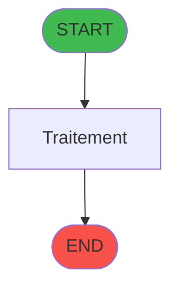
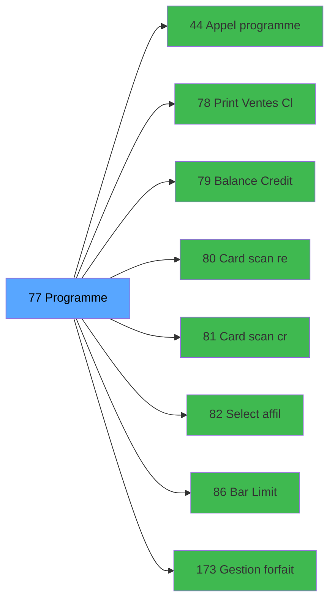

# ADH IDE 77 - Club Med Pass menu

> **Version spec**: 3.5
> **Analyse**: 2026-01-27 17:57
> **Source**: `Prg_XXX.xml`

---

<!-- TAB:Fonctionnel -->

## SPECIFICATION FONCTIONNELLE

### 1.1 Objectif metier

| Element | Description |
|---------|-------------|
| **Qui** | Operateur |
| **Quoi** | Club Med Pass menu
 |
| **Pourquoi** | A documenter |
| **Declencheur** | A identifier |

### 1.2 Regles metier

| Code | Regle | Condition |
|------|-------|-----------|
| RM-001 | A documenter | - |

### 1.3 Flux utilisateur

1. Demarrage programme
2. Traitement principal
3. Fin programme

### 1.4 Cas d'erreur

| Erreur | Comportement |
|--------|--------------|
| - | A documenter |

---

<!-- TAB:Technique -->

## SPECIFICATION TECHNIQUE

### 2.1 Identification

| Attribut | Valeur |
|----------|--------|
| **Format IDE** | ADH IDE 77 |
| **Description** | Club Med Pass menu
 |
| **Module** | ADH |

### 2.2 Tables

| # | Nom physique | Acces | Usage |
|---|--------------|-------|-------|
| #14 | `Table_14` | R | 1x |
| #15 | `Table_15` | LINK | 1x |
| #31 | `Table_31` | R | 2x |
| #34 | `Table_34` | LINK | 1x |
| #47 | `Table_47` | LINK | 1x |
| #131 | `Table_131` | LINK | 1x |
| #312 | `Table_312` | LINK | 1x |
| #312 | `Table_312` | **W** | 3x |
| #470 | `Table_470` | LINK | 1x |
| #728 | `Table_728` | R | 1x |
| #786 | `Table_786` | R | 1x |
### 2.3 Parametres d'entree

### 2.4 Algorigramme

### 2.5 Expressions cles

### 2.6 Variables importantes

### 2.7 Statistiques

---

<!-- TAB:Cartographie -->

## CARTOGRAPHIE APPLICATIVE

### 3.1 Chaine d'appels depuis Main

### 3.2 Callers directs

| IDE | Programme | Nb appels |
|-----|-----------|-----------|
| 163 | Menu caisse GM - scroll | 1 |
### 3.3 Callees

| Niv | IDE | Programme | Nb appels |
|-----|-----|-----------|-----------|
| 1 | 44 | Appel programme | 1 |
| 1 | 78 | Print Ventes Club Med Pass | 1 |
| 1 | 79 | Balance Credit de conso | 1 |
| 1 | 80 |    Card scan read | 1 |
| 1 | 81 |    Card scan create | 1 |
| 1 | 82 |    Select affilies | 1 |
| 1 | 86 | Bar Limit | 1 |
| 1 | 173 | Gestion forfait TAI LOCAL | 1 |
| 1 | 179 | Get Printer | 1 |
| 1 | 180 | Printer choice | 1 |
| 1 | 181 | Set Listing Number | 1 |
| 1 | 182 | Raz Current Printer | 1 |
### 3.4 Verification orphelin

| Critere | Resultat |
|---------|----------|
| Callers actifs | A verifier |
| **Conclusion** | A analyser |

---

## HISTORIQUE

| Date | Action | Auteur |
|------|--------|--------|
| 2026-01-27 19:45 | **DATA POPULATED** - Tables, Callgraph (46 expr) | Script |
| 2026-01-27 17:57 | **Upgrade V3.5** - TAB markers, Mermaid | Claude |

---

*Specification V3.5 - Format avec TAB markers et Mermaid*
