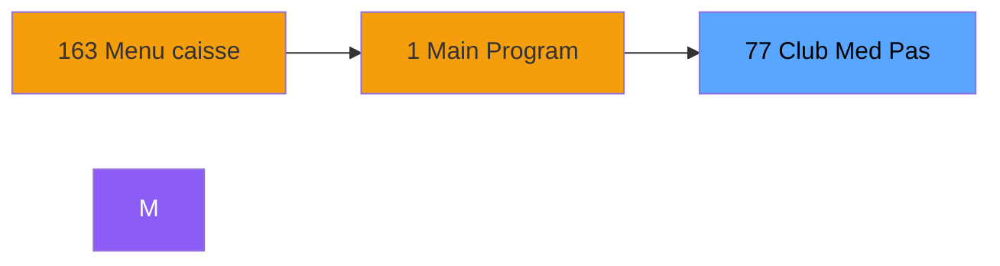
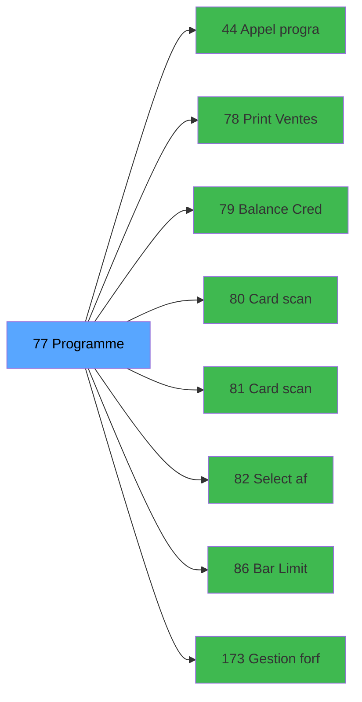

# ADH IDE 77 - Club Med Pass menu

> **Version spec**: 3.5
> **Analyse**: 2026-01-27 17:57
> **Source**: `Prg_XXX.xml`

---

<!-- TAB:Fonctionnel -->

## SPECIFICATION FONCTIONNELLE

### 1.1 Objectif metier

| Element | Description |
|---------|-------------|
| **Qui** | Operateur |
| **Quoi** | Club Med Pass menu
 |
| **Pourquoi** | A documenter |
| **Declencheur** | A identifier |

### 1.2 Regles metier

| Code | Regle | Condition |
|------|-------|-----------|
| RM-001 | A documenter | - |

### 1.3 Flux utilisateur

1. Demarrage programme
2. Traitement principal
3. Fin programme

### 1.4 Cas d'erreur

| Erreur | Comportement |
|--------|--------------|
| - | A documenter |

---

<!-- TAB:Technique -->

## SPECIFICATION TECHNIQUE

### 2.1 Identification

| Attribut | Valeur |
|----------|--------|
| **Format IDE** | ADH IDE 77 |
| **Description** | Club Med Pass menu
 |
| **Module** | ADH |

### 2.2 Tables

| # | Nom logique | Nom physique | Acces | Usage |
|---|-------------|--------------|-------|-------|
| 14 | transac_detail_bar | `bartransacdet` | R | 1x |
| 15 | transac_entete_bar | `bartransacent` | L | 1x |
| 31 | gm-complet_______gmc | `cafil009_dat` | R | 2x |
| 34 | hebergement______heb | `cafil012_dat` | L | 1x |
| 47 | compte_gm________cgm | `cafil025_dat` | L | 1x |
| 131 | fichier_validation | `cafil109_dat` | L | 1x |
| 312 | ez_card | `ezcard` | L | 1x |
| 312 | ez_card | `ezcard` | **W** | 3x |
| 470 | comptage_coffre | `%club_user%_caisse_coffre_compcais` | L | 1x |
| 728 | arc_cc_total | `arc_cctotal` | R | 1x |
| 786 | qualite_avant_reprise | `qualite_avant_reprise` | R | 1x |
### 2.3 Parametres d'entree

| Variable | Nom | Type | Picture |
|----------|-----|------|---------|
| - | Aucun parametre | - | - |
### 2.4 Algorigramme

### 2.5 Expressions cles

| IDE | Expression | Commentaire |
|-----|------------|-------------|
| 1 | `''` | - |
| 2 | `{0,26}>'' AND {0,39}<>{0,2}` | - |
| 3 | `IF (GetParam ('CODELANGUE')='FRA','Cette carte ...` | - |
| 4 | `Date ()` | - |
| 5 | `{32768,2}` | - |
| 6 | `{0,27}='V'` | - |
| 7 | `{0,27}='O' AND NOT ({0,28}) AND {0,42}='O' AND ...` | - |
| 8 | `IF ({0,36}='O',IF ({0,37}=0,'Bar Limit Activate...` | - |
| 9 | `IF ({0,36}='O',IF ({0,37}=0,'TRUE'LOG,IF ({0,29...` | - |
| 10 | `{0,1}` | - |
| 11 | `{0,2}` | - |
| 12 | `{0,3}` | - |
| 13 | `'EZGUA'` | - |
| 14 | `'H'` | - |
| 15 | `{0,33}='A'` | - |
| 16 | `IF (GetParam ('CODELANGUE')='FRA','Ce compte n'...` | - |
| 17 | `{0,42}<>'O' AND {0,51}='Oui' AND IF ({0,52},{0,...` | - |
| 18 | `{0,42}='O' OR {0,51}='Non' OR {0,48}='N' OR {32...` | - |
| 19 | `{0,32}` | - |
| 20 | `{0,25}>'' AND {0,32}` | - |

> **Total**: 46 expressions (affichees: 20)
### 2.6 Variables importantes

### 2.7 Statistiques

| Metrique | Valeur |
|----------|--------|
| **Taches** | 9 |
| **Lignes logique** | 261 |
| **Lignes desactivees** | 0 |
---

<!-- TAB:Cartographie -->

## CARTOGRAPHIE APPLICATIVE

### 3.1 Chaine d'appels depuis Main

### 3.2 Callers directs

| IDE | Programme | Nb appels |
|-----|-----------|-----------|
| 163 | Menu caisse GM - scroll | 1 |
### 3.3 Callees

| Niv | IDE | Programme | Nb appels |
|-----|-----|-----------|-----------|
| 1 | 44 | Appel programme | 1 |
| 1 | 78 | Print Ventes Club Med Pass | 1 |
| 1 | 79 | Balance Credit de conso | 1 |
| 1 | 80 |    Card scan read | 1 |
| 1 | 81 |    Card scan create | 1 |
| 1 | 82 |    Select affilies | 1 |
| 1 | 86 | Bar Limit | 1 |
| 1 | 173 | Gestion forfait TAI LOCAL | 1 |
| 1 | 179 | Get Printer | 1 |
| 1 | 180 | Printer choice | 1 |
| 1 | 181 | Set Listing Number | 1 |
| 1 | 182 | Raz Current Printer | 1 |
### 3.4 Verification orphelin

| Critere | Resultat |
|---------|----------|
| Callers actifs | A verifier |
| **Conclusion** | A analyser |

---

## HISTORIQUE

| Date | Action | Auteur |
|------|--------|--------|
| 2026-01-27 20:19 | **DATA V2** - Tables reelles, Expressions, Stats, CallChain | Script |
| 2026-01-27 19:45 | **DATA POPULATED** - Tables, Callgraph (46 expr) | Script |
| 2026-01-27 17:57 | **Upgrade V3.5** - TAB markers, Mermaid | Claude |

---

*Specification V3.5 - Format avec TAB markers et Mermaid*
