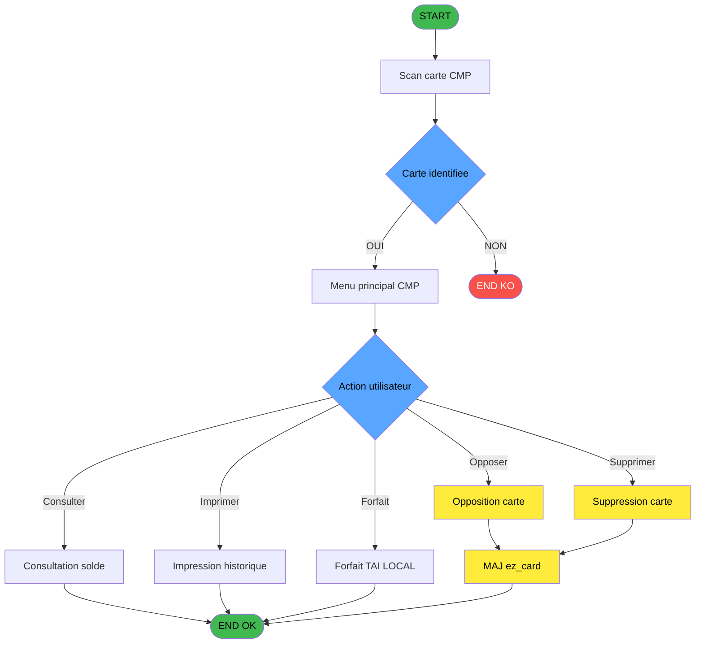
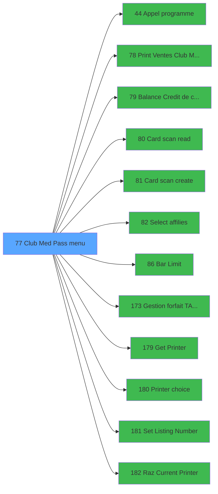

# ADH IDE 77 - Club Med Pass menu

> **Analyse**: Phases 1-4 2026-02-23 18:22 -> 18:22 (1s) | Assemblage 13:17
> **Pipeline**: V7.2 Enrichi
> **Structure**: 4 onglets (Resume | Ecrans | Donnees | Connexions)

<!-- TAB:Resume -->

## 1. FICHE D'IDENTITE

| Attribut | Valeur |
|----------|--------|
| Projet | ADH |
| IDE Position | 77 |
| Nom Programme | Club Med Pass menu |
| Fichier source | `Prg_77.xml` |
| Dossier IDE | Navigation |
| Taches | 9 (5 ecrans visibles) |
| Tables modifiees | 1 |
| Programmes appeles | 12 |
| Complexite | **BASSE** (score 29/100) |

## 2. DESCRIPTION FONCTIONNELLE

**Club Med Pass menu** est le programme central de gestion des cartes Club Med Pass (cartes de paiement prepayees) au guichet de caisse. Accessible depuis le [Menu caisse GM (IDE 163)](ADH-IDE-163.md), il orchestre 9 taches sur 5 ecrans pour permettre la consultation, la creation, l'opposition et la suppression des cartes Pass. Le programme modifie la table `ez_card` et consulte les donnees GM et transactions bar.

### Scan et identification de la carte

Le programme debute par la lecture de la carte physique via [Card scan read (IDE 80)](ADH-IDE-80.md), qui identifie le porteur a partir du numero scanne. Cette identification est critique car elle conditionne toutes les operations suivantes : sans identification valide, aucune operation de modification n'est autorisee sur la carte. Le systeme lit la table `gm-complet` (compte GM du porteur) et `fichier_validation` pour verifier l'eligibilite. En cas d'echec de lecture ou de carte inconnue, le programme affiche un ecran "Processing..." (T2) le temps de la verification, evitant ainsi un blocage de l'interface utilisateur.

### Consultation et operations carte

L'ecran principal (T1/T9) presente un menu avec les operations disponibles : consultation du solde, historique des ventes, et gestion des affilies. La consultation du solde appelle [Balance Credit de conso (IDE 79)](ADH-IDE-79.md) pour recuperer le credit restant. L'historique des ventes est imprime via [Print Ventes Club Med Pass (IDE 78)](ADH-IDE-78.md). La selection des affilies ([Select affilies (IDE 82)](ADH-IDE-82.md)) permet de gerer les membres rattaches a la carte principale. Le programme lit aussi `transac_detail_bar` et `arc_cc_total` pour les donnees de consommation bar, ce qui permet une vue consolidee des depenses du porteur.

### Opposition et suppression de carte

La tache T5 (Opposition) permet de bloquer une carte perdue ou volee en ecrivant un flag dans `ez_card`. Cette operation est irreversible et empeche toute nouvelle transaction avec cette carte, protegant le solde du porteur contre une utilisation frauduleuse. La tache T6 (Delete) supprime definitivement une carte du systeme apres confirmation utilisateur (variable FQ). La consequence d'une suppression est la perte du lien entre le compte GM et la carte physique. Les deux operations necessitent un scan prealable de la carte via [Card scan read (IDE 80)](ADH-IDE-80.md) pour securiser l'identite.

### Services complementaires et impression

Le programme offre des services additionnels : gestion du forfait TAI LOCAL via [Gestion forfait TAI LOCAL (IDE 173)](ADH-IDE-173.md) et limite Bar via [Bar Limit (IDE 86)](ADH-IDE-86.md). La creation d'une nouvelle carte passe par [Card scan create (IDE 81)](ADH-IDE-81.md). Pour l'impression, le programme utilise une chaine de gestion d'imprimante : [Get Printer (IDE 179)](ADH-IDE-179.md), [Printer choice (IDE 180)](ADH-IDE-180.md), [Set Listing Number (IDE 181)](ADH-IDE-181.md), et [Raz Current Printer (IDE 182)](ADH-IDE-182.md). La table `qualite_avant_reprise` est lue pour verifier l'etat de qualite des donnees avant toute impression.

## 3. BLOCS FONCTIONNELS

### 3.1 Traitement (6 taches)

Traitements internes.

---

#### T1 - Club Med Pass menu [ECRAN]

**Role** : Tache d'orchestration : point d'entree du programme (6 sous-taches). Coordonne l'enchainement des traitements.
**Ecran** : 1056 x 256 DLU (MDI) | [Voir mockup](#ecran-t1)

5 sous-taches directes

| Tache | Nom | Bloc |
|-------|-----|------|
| [T2](#t2) | Processing ... **[ECRAN]** | Traitement |
| [T5](#t5) | Opposition Club Med Pass | Traitement |
| [T6](#t6) | Delete Club Med Pass | Traitement |
| [T8](#t8) | paramètre | Traitement |
| [T9](#t9) | Club Med Pass menu **[ECRAN]** | Traitement |

**Variables liees** : FL (v.Club Med Pass ID), FM (V.ID Club Med Pass scannee)
**Delegue a** : [Appel programme (IDE 44)](ADH-IDE-44.md), [Print Ventes Club Med Pass (IDE 78)](ADH-IDE-78.md), [Balance Credit de conso (IDE 79)](ADH-IDE-79.md)

---

#### T2 - Processing ... [ECRAN]

**Role** : Traitement : Processing ....
**Ecran** : 129 x 64 DLU (MDI) | [Voir mockup](#ecran-t2)
**Delegue a** : [Appel programme (IDE 44)](ADH-IDE-44.md), [Balance Credit de conso (IDE 79)](ADH-IDE-79.md), [   Card scan read (IDE 80)](ADH-IDE-80.md)

---

#### T5 - Opposition Club Med Pass

**Role** : Traitement : Opposition Club Med Pass.
**Variables liees** : FL (v.Club Med Pass ID), FM (V.ID Club Med Pass scannee)
**Delegue a** : [Appel programme (IDE 44)](ADH-IDE-44.md), [Balance Credit de conso (IDE 79)](ADH-IDE-79.md), [   Card scan read (IDE 80)](ADH-IDE-80.md)

---

#### T6 - Delete Club Med Pass

**Role** : Traitement : Delete Club Med Pass.
**Variables liees** : FL (v.Club Med Pass ID), FM (V.ID Club Med Pass scannee), FQ (v.delete confirmation)
**Delegue a** : [Appel programme (IDE 44)](ADH-IDE-44.md), [Balance Credit de conso (IDE 79)](ADH-IDE-79.md), [   Card scan read (IDE 80)](ADH-IDE-80.md)

---

#### T8 - paramètre

**Role** : Traitement : paramètre.
**Delegue a** : [Appel programme (IDE 44)](ADH-IDE-44.md), [Balance Credit de conso (IDE 79)](ADH-IDE-79.md), [   Card scan read (IDE 80)](ADH-IDE-80.md)

---

#### T9 - Club Med Pass menu [ECRAN]

**Role** : Traitement : Club Med Pass menu.
**Ecran** : 1050 x 73 DLU (Modal) | [Voir mockup](#ecran-t9)
**Variables liees** : FL (v.Club Med Pass ID), FM (V.ID Club Med Pass scannee)
**Delegue a** : [Appel programme (IDE 44)](ADH-IDE-44.md), [Print Ventes Club Med Pass (IDE 78)](ADH-IDE-78.md), [Balance Credit de conso (IDE 79)](ADH-IDE-79.md)

### 3.2 Saisie (2 taches)

L'operateur saisit les donnees de la transaction via 2 ecrans (Detail des transactions CMP, Transactions details).

---

#### T3 - Detail des transactions CMP [ECRAN]

**Role** : Saisie des donnees : Detail des transactions CMP.
**Ecran** : 1190 x 294 DLU (MDI) | [Voir mockup](#ecran-t3)
**Variables liees** : FR (v.ez detail empty)
**Delegue a** : [Print Ventes Club Med Pass (IDE 78)](ADH-IDE-78.md)

---

#### T4 - Transactions details [ECRAN]

**Role** : Saisie des donnees : Transactions details.
**Ecran** : 594 x 87 DLU (Modal) | [Voir mockup](#ecran-t4)
**Delegue a** : [Print Ventes Club Med Pass (IDE 78)](ADH-IDE-78.md)

### 3.3 Creation (1 tache)

Insertion de nouveaux enregistrements en base.

---

#### T7 - Create Club Med Pass

**Role** : Traitement : Create Club Med Pass.
**Variables liees** : FL (v.Club Med Pass ID), FM (V.ID Club Med Pass scannee), FS (v.ok to create)
**Delegue a** : [   Card scan create (IDE 81)](ADH-IDE-81.md)

## 5. REGLES METIER

22 regles identifiees:

### Creation (1 regles)

#### [RM-009] Condition composite: v.Club Med Pass ID [Y]>'' AND v.ok to create [BF]

| Element | Detail |
|---------|--------|
| **Condition** | `v.Club Med Pass ID [Y]>'' AND v.ok to create [BF]` |
| **Si vrai** | Action si vrai |
| **Variables** | FL (v.Club Med Pass ID), FS (v.ok to create) |
| **Expression source** | Expression 20 : `v.Club Med Pass ID [Y]>'' AND v.ok to create [BF]` |
| **Exemple** | Si v.Club Med Pass ID [Y]>'' AND v.ok to create [BF] → Action si vrai |
| **Impact** | [T1 - Club Med Pass menu](#t1) |

### Autres (21 regles)

#### [RM-001] Condition composite: V.ID Club Med Pass sca... [Z]>'' AND V.Compte scanne [BM]<>P.Code 8 chiffres [B]

| Element | Detail |
|---------|--------|
| **Condition** | `V.ID Club Med Pass sca... [Z]>'' AND V.Compte scanne [BM]<>P.Code 8 chiffres [B]` |
| **Si vrai** | Action si vrai |
| **Variables** | EO (P.Code 8 chiffres), FZ (V.Compte scanne) |
| **Expression source** | Expression 2 : `V.ID Club Med Pass sca... [Z]>'' AND V.Compte scanne [BM]<>P` |
| **Exemple** | Si V.ID Club Med Pass sca... [Z]>'' AND V.Compte scanne [BM]<>P.Code 8 chiffres [B] → Action si vrai |
| **Impact** | [T1 - Club Med Pass menu](#t1) |

#### [RM-002] Si GetParam ('CODELANGUE')='FRA' alors 'Cette carte n''appartient pas a ce compte' sinon 'This card do not belong to this account')

| Element | Detail |
|---------|--------|
| **Condition** | `GetParam ('CODELANGUE')='FRA'` |
| **Si vrai** | 'Cette carte n''appartient pas a ce compte' |
| **Si faux** | 'This card do not belong to this account') |
| **Expression source** | Expression 3 : `IF (GetParam ('CODELANGUE')='FRA','Cette carte n''appartient` |
| **Exemple** | Si GetParam ('CODELANGUE')='FRA' → 'Cette carte n''appartient pas a ce compte'. Sinon → 'This card do not belong to this account') |

#### [RM-003] Condition: V.Status card [BA] egale 'V'

| Element | Detail |
|---------|--------|
| **Condition** | `V.Status card [BA]='V'` |
| **Si vrai** | Action si vrai |
| **Variables** | FN (V.Status card) |
| **Expression source** | Expression 6 : `V.Status card [BA]='V'` |
| **Exemple** | Si V.Status card [BA]='V' → Action si vrai |

#### [RM-004] Condition composite: V.Status card [BA]='O' AND NOT (V.Other card valid [BB]) AND [BP]='O' AND [BR]<=p.TAI.date fin sejour [M]

| Element | Detail |
|---------|--------|
| **Condition** | `V.Status card [BA]='O' AND NOT (V.Other card valid [BB]) AND [BP]='O' AND [BR]<=p.TAI.date fin sejour [M]` |
| **Si vrai** | Action si vrai |
| **Variables** | EZ (p.TAI.date fin sejour), FN (V.Status card), FO (V.Other card valid) |
| **Expression source** | Expression 7 : `V.Status card [BA]='O' AND NOT (V.Other card valid [BB]) AND` |
| **Exemple** | Si V.Status card [BA]='O' AND NOT (V.Other card valid [BB]) AND [BP]='O' AND [BR]<=p.TAI.date fin sejour [M] → Action si vrai |

#### [RM-005] Si v.Activation Bar Limit [BJ]='O' alors IF (v.Age Bar Limit [BK]=0 sinon 'Bar Limit Activated for All','Bar Limit Activated under '&Trim (Str (v.Age Bar Limit [BK],'2'))),'Bar Limit Desactivated')

| Element | Detail |
|---------|--------|
| **Condition** | `v.Activation Bar Limit [BJ]='O'` |
| **Si vrai** | IF (v.Age Bar Limit [BK]=0 |
| **Si faux** | 'Bar Limit Activated for All','Bar Limit Activated under '&Trim (Str (v.Age Bar Limit [BK],'2'))),'Bar Limit Desactivated') |
| **Variables** | FW (v.Activation Bar Limit), FX (v.Age Bar Limit) |
| **Expression source** | Expression 8 : `IF (v.Activation Bar Limit [BJ]='O',IF (v.Age Bar Limit [BK]` |
| **Exemple** | Si v.Activation Bar Limit [BJ]='O' → IF (v.Age Bar Limit [BK]=0 |

#### [RM-006] Condition: V.Action [BG] egale 'A'

| Element | Detail |
|---------|--------|
| **Condition** | `V.Action [BG]='A'` |
| **Si vrai** | Action si vrai |
| **Variables** | FT (V.Action) |
| **Expression source** | Expression 15 : `V.Action [BG]='A'` |
| **Exemple** | Si V.Action [BG]='A' → Action si vrai |

#### [RM-007] Condition composite: [BP]<>'O' AND [BY]='Oui' AND IF ([BZ],[BZ],[BV]='O')

| Element | Detail |
|---------|--------|
| **Condition** | `[BP]<>'O' AND [BY]='Oui' AND IF ([BZ],[BZ],[BV]='O')` |
| **Si vrai** | Action si vrai |
| **Expression source** | Expression 17 : `[BP]<>'O' AND [BY]='Oui' AND IF ([BZ],[BZ],[BV]='O')` |
| **Exemple** | Si [BP]<>'O' AND [BY]='Oui' AND IF ([BZ],[BZ],[BV]='O') → Action si vrai |

#### [RM-008] Condition composite: [BP]='O' OR [BY]='Non' OR [BV]='N' OR VG74

| Element | Detail |
|---------|--------|
| **Condition** | `[BP]='O' OR [BY]='Non' OR [BV]='N' OR VG74` |
| **Si vrai** | Action si vrai |
| **Expression source** | Expression 18 : `[BP]='O' OR [BY]='Non' OR [BV]='N' OR VG74` |
| **Exemple** | Si [BP]='O' OR [BY]='Non' OR [BV]='N' OR VG74 → Action si vrai |

#### [RM-010] Condition: V.Action [BG]='C' OR V.Action [BG] egale 'D'

| Element | Detail |
|---------|--------|
| **Condition** | `V.Action [BG]='C' OR V.Action [BG]='D'` |
| **Si vrai** | Action si vrai |
| **Variables** | FT (V.Action) |
| **Expression source** | Expression 21 : `V.Action [BG]='C' OR V.Action [BG]='D'` |
| **Exemple** | Si V.Action [BG]='C' OR V.Action [BG]='D' → Action si vrai |

#### [RM-011] Condition: v.delete confirmation [BD] egale 6

| Element | Detail |
|---------|--------|
| **Condition** | `v.delete confirmation [BD]=6` |
| **Si vrai** | Action si vrai |
| **Variables** | FQ (v.delete confirmation) |
| **Expression source** | Expression 23 : `v.delete confirmation [BD]=6` |
| **Exemple** | Si v.delete confirmation [BD]=6 → Action si vrai |
| **Impact** | [T6 - Delete Club Med Pass](#t6) |

#### [RM-012] Condition: V.Action [BG]='E' OR V.Action [BG] egale 'B'

| Element | Detail |
|---------|--------|
| **Condition** | `V.Action [BG]='E' OR V.Action [BG]='B'` |
| **Si vrai** | Action si vrai |
| **Variables** | FT (V.Action) |
| **Expression source** | Expression 24 : `V.Action [BG]='E' OR V.Action [BG]='B'` |
| **Exemple** | Si V.Action [BG]='E' OR V.Action [BG]='B' → Action si vrai |

#### [RM-013] Condition: V.Action [BG] egale 'Z'

| Element | Detail |
|---------|--------|
| **Condition** | `V.Action [BG]='Z'` |
| **Si vrai** | Action si vrai |
| **Variables** | FT (V.Action) |
| **Expression source** | Expression 27 : `V.Action [BG]='Z'` |
| **Exemple** | Si V.Action [BG]='Z' → Action si vrai |

#### [RM-014] Condition: V.Action [BG] egale 'F'

| Element | Detail |
|---------|--------|
| **Condition** | `V.Action [BG]='F'` |
| **Si vrai** | Action si vrai |
| **Variables** | FT (V.Action) |
| **Expression source** | Expression 28 : `V.Action [BG]='F'` |
| **Exemple** | Si V.Action [BG]='F' → Action si vrai |

#### [RM-015] Condition: V.Action [BG] egale 'P'

| Element | Detail |
|---------|--------|
| **Condition** | `V.Action [BG]='P'` |
| **Si vrai** | Action si vrai |
| **Variables** | FT (V.Action) |
| **Expression source** | Expression 29 : `V.Action [BG]='P'` |
| **Exemple** | Si V.Action [BG]='P' → Action si vrai |

#### [RM-016] Condition: V.Action [BG] egale 'G'

| Element | Detail |
|---------|--------|
| **Condition** | `V.Action [BG]='G'` |
| **Si vrai** | Action si vrai |
| **Variables** | FT (V.Action) |
| **Expression source** | Expression 31 : `V.Action [BG]='G'` |
| **Exemple** | Si V.Action [BG]='G' → Action si vrai |

#### [RM-017] Condition: [CI] egale

| Element | Detail |
|---------|--------|
| **Condition** | `[CI]=''` |
| **Si vrai** | Action si vrai |
| **Expression source** | Expression 35 : `[CI]=''` |
| **Exemple** | Si [CI]='' → Action si vrai |

#### [RM-018] Condition: [BV] different de 'O'

| Element | Detail |
|---------|--------|
| **Condition** | `[BV]<>'O'` |
| **Si vrai** | Action si vrai |
| **Expression source** | Expression 36 : `[BV]<>'O'` |
| **Exemple** | Si [BV]<>'O' → Action si vrai |

#### [RM-019] Condition: [CI]<>'' AND [BV] egale 'O'

| Element | Detail |
|---------|--------|
| **Condition** | `[CI]<>'' AND [BV]='O'` |
| **Si vrai** | Action si vrai |
| **Expression source** | Expression 39 : `[CI]<>'' AND [BV]='O'` |
| **Exemple** | Si [CI]<>'' AND [BV]='O' → Action si vrai |

#### [RM-020] Condition: v.Club Med Pass ID [Y] different de

| Element | Detail |
|---------|--------|
| **Condition** | `v.Club Med Pass ID [Y]<>''` |
| **Si vrai** | Action si vrai |
| **Variables** | FL (v.Club Med Pass ID) |
| **Expression source** | Expression 40 : `v.Club Med Pass ID [Y]<>''` |
| **Exemple** | Si v.Club Med Pass ID [Y]<>'' → Action si vrai |
| **Impact** | [T1 - Club Med Pass menu](#t1) |

#### [RM-021] Condition composite: V.Choix action [BH]>'' AND (InStr ('ABEFGHPZ',V.Choix action [BH])>0 OR V.Status card [BA]='O' AND NOT (V.Other card valid [BB]) AND [BQ]<>'S' AND [BP]='O' AND V.Choix action [BH]='D' OR V.Status card [BA]='V' AND V.Choix action [BH]='C' OR V.Status card [BA]='O' AND NOT (V.Other card valid [BB]) AND [BR]<=p.TAI.date fin sejour [M] AND [BP]='O' AND V.Choix action [BH]='D')

| Element | Detail |
|---------|--------|
| **Condition** | `V.Choix action [BH]>'' AND (InStr ('ABEFGHPZ',V.Choix action [BH])>0 OR V.Status card [BA]='O' AND NOT (V.Other card valid [BB]) AND [BQ]<>'S' AND [BP]='O' AND V.Choix action [BH]='D' OR V.Status card [BA]='V' AND V.Choix action [BH]='C' OR V.Status card [BA]='O' AND NOT (V.Other card valid [BB]) AND [BR]<=p.TAI.date fin sejour [M] AND [BP]='O' AND V.Choix action [BH]='D')` |
| **Si vrai** | Action si vrai |
| **Variables** | EZ (p.TAI.date fin sejour), FN (V.Status card), FO (V.Other card valid), FU (V.Choix action) |
| **Expression source** | Expression 45 : `V.Choix action [BH]>'' AND (InStr ('ABEFGHPZ',V.Choix action` |
| **Exemple** | Si V.Choix action [BH]>'' AND (InStr ('ABEFGHPZ',V.Choix action [BH])>0 OR V.Status card [BA]='O' AND NOT (V.Other card valid [BB]) AND [BQ]<>'S' AND [BP]='O' AND V.Choix action [BH]='D' OR V.Status card [BA]='V' AND V.Choix action [BH]='C' OR V.Status card [BA]='O' AND NOT (V.Other card valid [BB]) AND [BR]<=p.TAI.date fin sejour [M] AND [BP]='O' AND V.Choix action [BH]='D') → Action si vrai |

#### [RM-022] Negation de ExpCalc('45'EXP) (condition inversee)

| Element | Detail |
|---------|--------|
| **Condition** | `NOT ExpCalc('45'EXP)` |
| **Si vrai** | Action si vrai |
| **Expression source** | Expression 46 : `NOT ExpCalc('45'EXP)` |
| **Exemple** | Si NOT ExpCalc('45'EXP) → Action si vrai |

## 6. CONTEXTE

- **Appele par**: [Menu caisse GM - scroll (IDE 163)](ADH-IDE-163.md)
- **Appelle**: 12 programmes | **Tables**: 10 (W:1 R:4 L:6) | **Taches**: 9 | **Expressions**: 46

<!-- TAB:Ecrans -->

## 8. ECRANS

### 8.1 Forms visibles (5 / 9)

| # | Position | Tache | Nom | Type | Largeur | Hauteur | Bloc |
|---|----------|-------|-----|------|---------|---------|------|
| 1 | 77 | T1 | Club Med Pass menu | MDI | 1056 | 256 | Traitement |
| 2 | 77.1 | T2 | Processing ... | MDI | 129 | 64 | Traitement |
| 3 | 77.2 | T3 | Detail des transactions CMP | MDI | 1190 | 294 | Saisie |
| 4 | 77.2.1 | T4 | Transactions details | Modal | 594 | 87 | Saisie |
| 5 | 77.7 | T9 | Club Med Pass menu | Modal | 1050 | 73 | Traitement |

### 8.2 Mockups Ecrans

---

#### 77 - Club Med Pass menu
**Tache** : [T1](#t1) | **Type** : MDI | **Dimensions** : 1056 x 256 DLU
**Bloc** : Traitement | **Titre IDE** : Club Med Pass menu

<!-- FORM-DATA:
{
    "width":  1056,
    "vFactor":  8,
    "type":  "MDI",
    "hFactor":  8,
    "controls":  [
                     {
                         "x":  0,
                         "type":  "label",
                         "var":  "",
                         "y":  1,
                         "w":  1044,
                         "fmt":  "",
                         "name":  "",
                         "h":  21,
                         "color":  "",
                         "text":  "",
                         "parent":  null
                     },
                     {
                         "x":  0,
                         "type":  "label",
                         "var":  "",
                         "y":  231,
                         "w":  1044,
                         "fmt":  "",
                         "name":  "",
                         "h":  24,
                         "color":  "",
                         "text":  "",
                         "parent":  null
                     },
                     {
                         "x":  33,
                         "type":  "label",
                         "var":  "",
                         "y":  112,
                         "w":  997,
                         "fmt":  "",
                         "name":  "",
                         "h":  108,
                         "color":  "",
                         "text":  "",
                         "parent":  null
                     },
                     {
                         "x":  37,
                         "type":  "label",
                         "var":  "",
                         "y":  114,
                         "w":  306,
                         "fmt":  "",
                         "name":  "",
                         "h":  69,
                         "color":  "",
                         "text":  "",
                         "parent":  7
                     },
                     {
                         "x":  341,
                         "type":  "label",
                         "var":  "",
                         "y":  114,
                         "w":  344,
                         "fmt":  "",
                         "name":  "",
                         "h":  69,
                         "color":  "",
                         "text":  "",
                         "parent":  7
                     },
                     {
                         "x":  690,
                         "type":  "label",
                         "var":  "",
                         "y":  114,
                         "w":  336,
                         "fmt":  "",
                         "name":  "",
                         "h":  69,
                         "color":  "",
                         "text":  "",
                         "parent":  7
                     },
                     {
                         "x":  40,
                         "type":  "label",
                         "var":  "",
                         "y":  116,
                         "w":  42,
                         "fmt":  "",
                         "name":  "",
                         "h":  64,
                         "color":  "",
                         "text":  "",
                         "parent":  7
                     },
                     {
                         "x":  345,
                         "type":  "label",
                         "var":  "",
                         "y":  116,
                         "w":  42,
                         "fmt":  "",
                         "name":  "",
                         "h":  64,
                         "color":  "",
                         "text":  "",
                         "parent":  7
                     },
                     {
                         "x":  692,
                         "type":  "label",
                         "var":  "",
                         "y":  116,
                         "w":  42,
                         "fmt":  "",
                         "name":  "",
                         "h":  64,
                         "color":  "",
                         "text":  "",
                         "parent":  7
                     },
                     {
                         "x":  104,
                         "type":  "label",
                         "var":  "",
                         "y":  117,
                         "w":  223,
                         "fmt":  "",
                         "name":  "",
                         "h":  10,
                         "color":  "142",
                         "text":  "Sur le compte",
                         "parent":  7
                     },
                     {
                         "x":  390,
                         "type":  "label",
                         "var":  "",
                         "y":  117,
                         "w":  274,
                         "fmt":  "",
                         "name":  "",
                         "h":  10,
                         "color":  "142",
                         "text":  "Sur la filiation",
                         "parent":  7
                     },
                     {
                         "x":  739,
                         "type":  "label",
                         "var":  "",
                         "y":  117,
                         "w":  274,
                         "fmt":  "",
                         "name":  "",
                         "h":  10,
                         "color":  "142",
                         "text":  "Sur la carte",
                         "parent":  7
                     },
                     {
                         "x":  398,
                         "type":  "line",
                         "var":  "",
                         "y":  128,
                         "w":  274,
                         "fmt":  "",
                         "name":  "",
                         "h":  0,
                         "color":  "",
                         "text":  "",
                         "parent":  9
                     },
                     {
                         "x":  747,
                         "type":  "line",
                         "var":  "",
                         "y":  128,
                         "w":  274,
                         "fmt":  "",
                         "name":  "",
                         "h":  0,
                         "color":  "",
                         "text":  "",
                         "parent":  10
                     },
                     {
                         "x":  91,
                         "type":  "label",
                         "var":  "",
                         "y":  132,
                         "w":  222,
                         "fmt":  "",
                         "name":  "",
                         "h":  9,
                         "color":  "142",
                         "text":  "Création",
                         "parent":  7
                     },
                     {
                         "x":  395,
                         "type":  "label",
                         "var":  "",
                         "y":  132,
                         "w":  278,
                         "fmt":  "",
                         "name":  "",
                         "h":  9,
                         "color":  "142",
                         "text":  "Détail",
                         "parent":  7
                     },
                     {
                         "x":  742,
                         "type":  "label",
                         "var":  "",
                         "y":  132,
                         "w":  269,
                         "fmt":  "",
                         "name":  "",
                         "h":  9,
                         "color":  "142",
                         "text":  "Opposition",
                         "parent":  7
                     },
                     {
                         "x":  91,
                         "type":  "label",
                         "var":  "",
                         "y":  143,
                         "w":  222,
                         "fmt":  "",
                         "name":  "",
                         "h":  9,
                         "color":  "142",
                         "text":  "Détail",
                         "parent":  7
                     },
                     {
                         "x":  395,
                         "type":  "label",
                         "var":  "",
                         "y":  143,
                         "w":  278,
                         "fmt":  "",
                         "name":  "",
                         "h":  9,
                         "color":  "142",
                         "text":  "Balance crédit de conso",
                         "parent":  7
                     },
                     {
                         "x":  742,
                         "type":  "label",
                         "var":  "",
                         "y":  143,
                         "w":  269,
                         "fmt":  "",
                         "name":  "",
                         "h":  9,
                         "color":  "142",
                         "text":  "Annulation d\u0027opposition",
                         "parent":  7
                     },
                     {
                         "x":  742,
                         "type":  "label",
                         "var":  "",
                         "y":  155,
                         "w":  222,
                         "fmt":  "",
                         "name":  "",
                         "h":  9,
                         "color":  "142",
                         "text":  "Bar Limit",
                         "parent":  7
                     },
                     {
                         "x":  455,
                         "type":  "label",
                         "var":  "",
                         "y":  198,
                         "w":  120,
                         "fmt":  "",
                         "name":  "",
                         "h":  10,
                         "color":  "",
                         "text":  "Votre choix",
                         "parent":  7
                     },
                     {
                         "x":  104,
                         "type":  "line",
                         "var":  "",
                         "y":  128,
                         "w":  223,
                         "fmt":  "",
                         "name":  "",
                         "h":  0,
                         "color":  "",
                         "text":  "",
                         "parent":  8
                     },
                     {
                         "x":  579,
                         "type":  "edit",
                         "var":  "",
                         "y":  198,
                         "w":  26,
                         "fmt":  "UA",
                         "name":  "v.choix action",
                         "h":  10,
                         "color":  "6",
                         "text":  "",
                         "parent":  7
                     },
                     {
                         "x":  5,
                         "type":  "image",
                         "var":  "",
                         "y":  3,
                         "w":  59,
                         "fmt":  "",
                         "name":  "",
                         "h":  18,
                         "color":  "",
                         "text":  "",
                         "parent":  null
                     },
                     {
                         "x":  77,
                         "type":  "edit",
                         "var":  "",
                         "y":  7,
                         "w":  379,
                         "fmt":  "60",
                         "name":  "",
                         "h":  8,
                         "color":  "",
                         "text":  "",
                         "parent":  null
                     },
                     {
                         "x":  768,
                         "type":  "edit",
                         "var":  "",
                         "y":  7,
                         "w":  259,
                         "fmt":  "WWW DD MMM YYYYT",
                         "name":  "",
                         "h":  10,
                         "color":  "",
                         "text":  "",
                         "parent":  null
                     },
                     {
                         "x":  48,
                         "type":  "button",
                         "var":  "",
                         "y":  132,
                         "w":  27,
                         "fmt":  "A",
                         "name":  "A",
                         "h":  9,
                         "color":  "",
                         "text":  "",
                         "parent":  null
                     },
                     {
                         "x":  350,
                         "type":  "button",
                         "var":  "",
                         "y":  132,
                         "w":  29,
                         "fmt":  "E",
                         "name":  "E",
                         "h":  9,
                         "color":  "",
                         "text":  "",
                         "parent":  null
                     },
                     {
                         "x":  698,
                         "type":  "button",
                         "var":  "",
                         "y":  132,
                         "w":  27,
                         "fmt":  "C",
                         "name":  "C",
                         "h":  9,
                         "color":  "",
                         "text":  "",
                         "parent":  null
                     },
                     {
                         "x":  48,
                         "type":  "button",
                         "var":  "",
                         "y":  143,
                         "w":  29,
                         "fmt":  "B",
                         "name":  "B",
                         "h":  9,
                         "color":  "",
                         "text":  "",
                         "parent":  null
                     },
                     {
                         "x":  350,
                         "type":  "button",
                         "var":  "",
                         "y":  143,
                         "w":  29,
                         "fmt":  "F",
                         "name":  "F",
                         "h":  9,
                         "color":  "",
                         "text":  "",
                         "parent":  null
                     },
                     {
                         "x":  697,
                         "type":  "button",
                         "var":  "",
                         "y":  143,
                         "w":  29,
                         "fmt":  "D",
                         "name":  "D",
                         "h":  9,
                         "color":  "",
                         "text":  "",
                         "parent":  null
                     },
                     {
                         "x":  697,
                         "type":  "button",
                         "var":  "",
                         "y":  155,
                         "w":  29,
                         "fmt":  "P",
                         "name":  "P",
                         "h":  9,
                         "color":  "",
                         "text":  "",
                         "parent":  null
                     },
                     {
                         "x":  46,
                         "type":  "image",
                         "var":  "",
                         "y":  186,
                         "w":  94,
                         "fmt":  "",
                         "name":  "",
                         "h":  31,
                         "color":  "",
                         "text":  "",
                         "parent":  null
                     },
                     {
                         "x":  742,
                         "type":  "edit",
                         "var":  "",
                         "y":  198,
                         "w":  277,
                         "fmt":  "50",
                         "name":  "",
                         "h":  10,
                         "color":  "143",
                         "text":  "",
                         "parent":  7
                     },
                     {
                         "x":  8,
                         "type":  "button",
                         "var":  "",
                         "y":  234,
                         "w":  154,
                         "fmt":  "\u0026Quitter",
                         "name":  "",
                         "h":  18,
                         "color":  "",
                         "text":  "",
                         "parent":  6
                     },
                     {
                         "x":  817,
                         "type":  "button",
                         "var":  "",
                         "y":  234,
                         "w":  215,
                         "fmt":  "\u0026Scan Club Med Pass",
                         "name":  "Z",
                         "h":  18,
                         "color":  "",
                         "text":  "",
                         "parent":  6
                     },
                     {
                         "x":  3,
                         "type":  "subform",
                         "var":  "",
                         "y":  24,
                         "w":  1050,
                         "fmt":  "",
                         "name":  "LISTECARD",
                         "h":  88,
                         "color":  "",
                         "text":  "",
                         "parent":  null
                     }
                 ],
    "taskId":  "77",
    "height":  256
}
-->

<strong>Champs : 4 champs</strong>

| Pos (x,y) | Nom | Variable | Type |
|-----------|-----|----------|------|
| 579,198 | v.choix action | - | edit |
| 77,7 | 60 | - | edit |
| 768,7 | WWW DD MMM YYYYT | - | edit |
| 742,198 | 50 | - | edit |

<strong>Boutons : 9 boutons</strong>

| Bouton | Pos (x,y) | Action |
|--------|-----------|--------|
| A | 48,132 | Bouton fonctionnel |
| E | 350,132 | Bouton fonctionnel |
| C | 698,132 | Bouton fonctionnel |
| B | 48,143 | Bouton fonctionnel |
| F | 350,143 | Bouton fonctionnel |
| D | 697,143 | Bouton fonctionnel |
| P | 697,155 | Bouton fonctionnel |
| Quitter | 8,234 | Quitte le programme |
| Scan Club Med Pass | 817,234 | Appel [   Card scan read (IDE 80)](ADH-IDE-80.md) |

---

#### 77.1 - Processing ...
**Tache** : [T2](#t2) | **Type** : MDI | **Dimensions** : 129 x 64 DLU
**Bloc** : Traitement | **Titre IDE** : Processing ...

<!-- FORM-DATA:
{
    "width":  129,
    "vFactor":  8,
    "type":  "MDI",
    "hFactor":  4,
    "controls":  [
                     {
                         "x":  26,
                         "type":  "button",
                         "var":  "",
                         "y":  25,
                         "w":  77,
                         "fmt":  "",
                         "name":  "bouton",
                         "h":  14,
                         "color":  "",
                         "text":  "",
                         "parent":  null
                     }
                 ],
    "taskId":  "77.1",
    "height":  64
}
-->

<strong>Boutons : 1 boutons</strong>

| Bouton | Pos (x,y) | Action |
|--------|-----------|--------|
| (sans nom) | 26,25 | Action declenchee |

---

#### 77.2 - Detail des transactions CMP
**Tache** : [T3](#t3) | **Type** : MDI | **Dimensions** : 1190 x 294 DLU
**Bloc** : Saisie | **Titre IDE** : Detail des transactions CMP

<!-- FORM-DATA:
{
    "width":  1190,
    "vFactor":  8,
    "type":  "MDI",
    "hFactor":  8,
    "controls":  [
                     {
                         "x":  0,
                         "type":  "label",
                         "var":  "",
                         "y":  0,
                         "w":  1190,
                         "fmt":  "",
                         "name":  "",
                         "h":  21,
                         "color":  "",
                         "text":  "",
                         "parent":  null
                     },
                     {
                         "x":  10,
                         "type":  "table",
                         "var":  "",
                         "name":  "",
                         "titleH":  14,
                         "color":  "6",
                         "w":  1171,
                         "y":  43,
                         "fmt":  "",
                         "parent":  null,
                         "text":  "",
                         "rowH":  12,
                         "h":  114,
                         "cols":  [
                                      {
                                          "title":  "Bar",
                                          "layer":  1,
                                          "w":  160
                                      },
                                      {
                                          "title":  "Ticket #",
                                          "layer":  2,
                                          "w":  223
                                      },
                                      {
                                          "title":  "Vente",
                                          "layer":  3,
                                          "w":  167
                                      },
                                      {
                                          "title":  "Payant",
                                          "layer":  4,
                                          "w":  163
                                      },
                                      {
                                          "title":  "Crédit conso",
                                          "layer":  5,
                                          "w":  168
                                      },
                                      {
                                          "title":  "Date",
                                          "layer":  6,
                                          "w":  158
                                      },
                                      {
                                          "title":  "Heure",
                                          "layer":  7,
                                          "w":  97
                                      }
                                  ],
                         "rows":  7
                     },
                     {
                         "x":  8,
                         "type":  "edit",
                         "var":  "",
                         "y":  27,
                         "w":  296,
                         "fmt":  "",
                         "name":  "",
                         "h":  12,
                         "color":  "",
                         "text":  "",
                         "parent":  null
                     },
                     {
                         "x":  228,
                         "type":  "edit",
                         "var":  "",
                         "y":  28,
                         "w":  42,
                         "fmt":  "",
                         "name":  "",
                         "h":  10,
                         "color":  "",
                         "text":  "",
                         "parent":  null
                     },
                     {
                         "x":  395,
                         "type":  "edit",
                         "var":  "",
                         "y":  59,
                         "w":  151,
                         "fmt":  "",
                         "name":  "",
                         "h":  8,
                         "color":  "6",
                         "text":  "",
                         "parent":  8
                     },
                     {
                         "x":  566,
                         "type":  "edit",
                         "var":  "",
                         "y":  60,
                         "w":  151,
                         "fmt":  "",
                         "name":  "",
                         "h":  8,
                         "color":  "6",
                         "text":  "",
                         "parent":  8
                     },
                     {
                         "x":  739,
                         "type":  "edit",
                         "var":  "",
                         "y":  59,
                         "w":  151,
                         "fmt":  "",
                         "name":  "",
                         "h":  8,
                         "color":  "6",
                         "text":  "",
                         "parent":  8
                     },
                     {
                         "x":  918,
                         "type":  "edit",
                         "var":  "",
                         "y":  59,
                         "w":  124,
                         "fmt":  "",
                         "name":  "",
                         "h":  8,
                         "color":  "6",
                         "text":  "",
                         "parent":  8
                     },
                     {
                         "x":  1058,
                         "type":  "edit",
                         "var":  "",
                         "y":  59,
                         "w":  76,
                         "fmt":  "HH:MMZ",
                         "name":  "",
                         "h":  8,
                         "color":  "6",
                         "text":  "",
                         "parent":  8
                     },
                     {
                         "x":  980,
                         "type":  "button",
                         "var":  "",
                         "y":  159,
                         "w":  198,
                         "fmt":  "",
                         "name":  "bt view details",
                         "h":  18,
                         "color":  "",
                         "text":  "",
                         "parent":  null
                     },
                     {
                         "x":  5,
                         "type":  "image",
                         "var":  "",
                         "y":  2,
                         "w":  59,
                         "fmt":  "",
                         "name":  "",
                         "h":  18,
                         "color":  "",
                         "text":  "",
                         "parent":  null
                     },
                     {
                         "x":  77,
                         "type":  "edit",
                         "var":  "",
                         "y":  6,
                         "w":  267,
                         "fmt":  "30",
                         "name":  "",
                         "h":  8,
                         "color":  "",
                         "text":  "",
                         "parent":  null
                     },
                     {
                         "x":  905,
                         "type":  "edit",
                         "var":  "",
                         "y":  7,
                         "w":  259,
                         "fmt":  "WWW DD MMM YYYYT",
                         "name":  "",
                         "h":  8,
                         "color":  "",
                         "text":  "",
                         "parent":  null
                     },
                     {
                         "x":  322,
                         "type":  "edit",
                         "var":  "",
                         "y":  27,
                         "w":  314,
                         "fmt":  "60",
                         "name":  "",
                         "h":  12,
                         "color":  "",
                         "text":  "",
                         "parent":  null
                     },
                     {
                         "x":  18,
                         "type":  "edit",
                         "var":  "",
                         "y":  59,
                         "w":  150,
                         "fmt":  "30",
                         "name":  "",
                         "h":  8,
                         "color":  "6",
                         "text":  "",
                         "parent":  8
                     },
                     {
                         "x":  173,
                         "type":  "edit",
                         "var":  "",
                         "y":  59,
                         "w":  214,
                         "fmt":  "14",
                         "name":  "",
                         "h":  8,
                         "color":  "6",
                         "text":  "",
                         "parent":  8
                     },
                     {
                         "x":  578,
                         "type":  "button",
                         "var":  "",
                         "y":  159,
                         "w":  198,
                         "fmt":  "Printer",
                         "name":  "",
                         "h":  18,
                         "color":  "",
                         "text":  "",
                         "parent":  null
                     },
                     {
                         "x":  779,
                         "type":  "button",
                         "var":  "",
                         "y":  159,
                         "w":  198,
                         "fmt":  "\u0026Imprimer",
                         "name":  "Print",
                         "h":  18,
                         "color":  "",
                         "text":  "",
                         "parent":  null
                     },
                     {
                         "x":  976,
                         "type":  "button",
                         "var":  "",
                         "y":  276,
                         "w":  198,
                         "fmt":  "Exit",
                         "name":  "",
                         "h":  18,
                         "color":  "",
                         "text":  "",
                         "parent":  null
                     },
                     {
                         "x":  2,
                         "type":  "subform",
                         "var":  "",
                         "y":  179,
                         "w":  1187,
                         "fmt":  "",
                         "name":  "EZ details (ticket)",
                         "h":  96,
                         "color":  "",
                         "text":  "",
                         "parent":  null
                     }
                 ],
    "taskId":  "77.2",
    "height":  294
}
-->

<strong>Champs : 12 champs</strong>

| Pos (x,y) | Nom | Variable | Type |
|-----------|-----|----------|------|
| 8,27 | (sans nom) | - | edit |
| 228,28 | (sans nom) | - | edit |
| 395,59 | (sans nom) | - | edit |
| 566,60 | (sans nom) | - | edit |
| 739,59 | (sans nom) | - | edit |
| 918,59 | (sans nom) | - | edit |
| 1058,59 | HH:MMZ | - | edit |
| 77,6 | 30 | - | edit |
| 905,7 | WWW DD MMM YYYYT | - | edit |
| 322,27 | 60 | - | edit |
| 18,59 | 30 | - | edit |
| 173,59 | 14 | - | edit |

<strong>Boutons : 4 boutons</strong>

| Bouton | Pos (x,y) | Action |
|--------|-----------|--------|
| bt view details | 980,159 | Affiche les details |
| Printer | 578,159 | Appel [Print Ventes Club Med Pass (IDE 78)](ADH-IDE-78.md) |
| Imprimer | 779,159 | Lance l'impression |
| Exit | 976,276 | Quitte le programme |

---

#### 77.2.1 - Transactions details
**Tache** : [T4](#t4) | **Type** : Modal | **Dimensions** : 594 x 87 DLU
**Bloc** : Saisie | **Titre IDE** : Transactions details

<!-- FORM-DATA:
{
    "width":  594,
    "vFactor":  8,
    "type":  "Modal",
    "hFactor":  4,
    "controls":  [
                     {
                         "x":  26,
                         "type":  "table",
                         "var":  "",
                         "name":  "",
                         "titleH":  14,
                         "color":  "6",
                         "w":  542,
                         "y":  8,
                         "fmt":  "",
                         "parent":  null,
                         "text":  "",
                         "rowH":  14,
                         "h":  79,
                         "cols":  [
                                      {
                                          "title":  "Ticket #",
                                          "layer":  1,
                                          "w":  127
                                      },
                                      {
                                          "title":  "Article",
                                          "layer":  2,
                                          "w":  124
                                      },
                                      {
                                          "title":  "Quantité",
                                          "layer":  3,
                                          "w":  48
                                      },
                                      {
                                          "title":  "Montant",
                                          "layer":  4,
                                          "w":  90
                                      },
                                      {
                                          "title":  "Happy hour",
                                          "layer":  5,
                                          "w":  77
                                      },
                                      {
                                          "title":  "Quantité TAI",
                                          "layer":  6,
                                          "w":  59
                                      }
                                  ],
                         "rows":  6
                     },
                     {
                         "x":  157,
                         "type":  "edit",
                         "var":  "",
                         "y":  24,
                         "w":  116,
                         "fmt":  "",
                         "name":  "",
                         "h":  10,
                         "color":  "6",
                         "text":  "",
                         "parent":  1
                     },
                     {
                         "x":  281,
                         "type":  "edit",
                         "var":  "",
                         "y":  24,
                         "w":  30,
                         "fmt":  "",
                         "name":  "",
                         "h":  10,
                         "color":  "6",
                         "text":  "",
                         "parent":  1
                     },
                     {
                         "x":  329,
                         "type":  "edit",
                         "var":  "",
                         "y":  25,
                         "w":  83,
                         "fmt":  "",
                         "name":  "",
                         "h":  10,
                         "color":  "6",
                         "text":  "",
                         "parent":  1
                     },
                     {
                         "x":  433,
                         "type":  "combobox",
                         "var":  "",
                         "y":  24,
                         "w":  55,
                         "fmt":  "",
                         "name":  "",
                         "h":  12,
                         "color":  "6",
                         "text":  "Oui,Non",
                         "parent":  1
                     },
                     {
                         "x":  519,
                         "type":  "edit",
                         "var":  "",
                         "y":  24,
                         "w":  24,
                         "fmt":  "",
                         "name":  "",
                         "h":  10,
                         "color":  "6",
                         "text":  "",
                         "parent":  1
                     },
                     {
                         "x":  30,
                         "type":  "edit",
                         "var":  "",
                         "y":  24,
                         "w":  120,
                         "fmt":  "14",
                         "name":  "",
                         "h":  10,
                         "color":  "6",
                         "text":  "",
                         "parent":  1
                     }
                 ],
    "taskId":  "77.2.1",
    "height":  87
}
-->

<strong>Champs : 6 champs</strong>

| Pos (x,y) | Nom | Variable | Type |
|-----------|-----|----------|------|
| 157,24 | (sans nom) | - | edit |
| 281,24 | (sans nom) | - | edit |
| 329,25 | (sans nom) | - | edit |
| 433,24 | Oui,Non | - | combobox |
| 519,24 | (sans nom) | - | edit |
| 30,24 | 14 | - | edit |

---

#### 77.7 - Club Med Pass menu
**Tache** : [T9](#t9) | **Type** : Modal | **Dimensions** : 1050 x 73 DLU
**Bloc** : Traitement | **Titre IDE** : Club Med Pass menu

<!-- FORM-DATA:
{
    "width":  1050,
    "vFactor":  8,
    "type":  "Modal",
    "hFactor":  8,
    "controls":  [
                     {
                         "x":  22,
                         "type":  "label",
                         "var":  "",
                         "y":  1,
                         "w":  98,
                         "fmt":  "",
                         "name":  "",
                         "h":  10,
                         "color":  "",
                         "text":  "Account # :",
                         "parent":  null
                     },
                     {
                         "x":  20,
                         "type":  "table",
                         "var":  "",
                         "name":  "",
                         "titleH":  12,
                         "color":  "6",
                         "w":  1008,
                         "y":  12,
                         "fmt":  "",
                         "parent":  null,
                         "text":  "",
                         "rowH":  14,
                         "h":  58,
                         "cols":  [
                                      {
                                          "title":  "Filiation",
                                          "layer":  1,
                                          "w":  112
                                      },
                                      {
                                          "title":  "Prénom",
                                          "layer":  2,
                                          "w":  144
                                      },
                                      {
                                          "title":  "Nom",
                                          "layer":  3,
                                          "w":  314
                                      },
                                      {
                                          "title":  "Opération",
                                          "layer":  4,
                                          "w":  403
                                      }
                                  ],
                         "rows":  4
                     },
                     {
                         "x":  27,
                         "type":  "edit",
                         "var":  "",
                         "y":  26,
                         "w":  42,
                         "fmt":  "",
                         "name":  "",
                         "h":  8,
                         "color":  "6",
                         "text":  "",
                         "parent":  3
                     },
                     {
                         "x":  608,
                         "type":  "edit",
                         "var":  "",
                         "y":  26,
                         "w":  126,
                         "fmt":  "##/##/####Z",
                         "name":  "",
                         "h":  10,
                         "color":  "6",
                         "text":  "",
                         "parent":  3
                     },
                     {
                         "x":  758,
                         "type":  "edit",
                         "var":  "",
                         "y":  26,
                         "w":  91,
                         "fmt":  "HH:MMZ",
                         "name":  "",
                         "h":  10,
                         "color":  "6",
                         "text":  "",
                         "parent":  3
                     },
                     {
                         "x":  882,
                         "type":  "edit",
                         "var":  "",
                         "y":  26,
                         "w":  104,
                         "fmt":  "",
                         "name":  "",
                         "h":  10,
                         "color":  "6",
                         "text":  "",
                         "parent":  3
                     },
                     {
                         "x":  139,
                         "type":  "edit",
                         "var":  "",
                         "y":  26,
                         "w":  104,
                         "fmt":  "8",
                         "name":  "",
                         "h":  10,
                         "color":  "6",
                         "text":  "",
                         "parent":  3
                     },
                     {
                         "x":  283,
                         "type":  "edit",
                         "var":  "",
                         "y":  26,
                         "w":  299,
                         "fmt":  "U30",
                         "name":  "",
                         "h":  10,
                         "color":  "6",
                         "text":  "",
                         "parent":  3
                     },
                     {
                         "x":  126,
                         "type":  "edit",
                         "var":  "",
                         "y":  1,
                         "w":  98,
                         "fmt":  "",
                         "name":  "P.Code 8 chiffres",
                         "h":  10,
                         "color":  "",
                         "text":  "",
                         "parent":  null
                     }
                 ],
    "taskId":  "77.7",
    "height":  73
}
-->

<strong>Champs : 7 champs</strong>

| Pos (x,y) | Nom | Variable | Type |
|-----------|-----|----------|------|
| 27,26 | (sans nom) | - | edit |
| 608,26 | ##/##/####Z | - | edit |
| 758,26 | HH:MMZ | - | edit |
| 882,26 | (sans nom) | - | edit |
| 139,26 | 8 | - | edit |
| 283,26 | U30 | - | edit |
| 126,1 | P.Code 8 chiffres | - | edit |

## 9. NAVIGATION

### 9.1 Enchainement des ecrans

**Detail par enchainement :**

| Depuis | Action | Vers | Retour |
|--------|--------|------|--------|
| Club Med Pass menu | Sous-programme | [Appel programme (IDE 44)](ADH-IDE-44.md) | Retour ecran |
| Club Med Pass menu | Impression ticket/document | [Print Ventes Club Med Pass (IDE 78)](ADH-IDE-78.md) | Retour ecran |
| Club Med Pass menu | Sous-programme | [Balance Credit de conso (IDE 79)](ADH-IDE-79.md) | Retour ecran |
| Club Med Pass menu | Sous-programme | [   Card scan read (IDE 80)](ADH-IDE-80.md) | Retour ecran |
| Club Med Pass menu | Sous-programme | [   Card scan create (IDE 81)](ADH-IDE-81.md) | Retour ecran |
| Club Med Pass menu | Selection/consultation | [   Select affilies (IDE 82)](ADH-IDE-82.md) | Retour ecran |
| Club Med Pass menu | Sous-programme | [Bar Limit (IDE 86)](ADH-IDE-86.md) | Retour ecran |
| Club Med Pass menu | Gestion moyens paiement | [Gestion forfait TAI LOCAL (IDE 173)](ADH-IDE-173.md) | Retour ecran |
| Club Med Pass menu | Impression ticket/document | [Get Printer (IDE 179)](ADH-IDE-179.md) | Retour ecran |
| Club Med Pass menu | Impression ticket/document | [Printer choice (IDE 180)](ADH-IDE-180.md) | Retour ecran |
| Club Med Pass menu | Configuration impression | [Set Listing Number (IDE 181)](ADH-IDE-181.md) | Retour ecran |
| Club Med Pass menu | Impression ticket/document | [Raz Current Printer (IDE 182)](ADH-IDE-182.md) | Retour ecran |

### 9.3 Structure hierarchique (9 taches)

| Position | Tache | Type | Dimensions | Bloc |
|----------|-------|------|------------|------|
| **77.1** | [**Club Med Pass menu** (T1)](#t1) [mockup](#ecran-t1) | MDI | 1056x256 | Traitement |
| 77.1.1 | [Processing ... (T2)](#t2) [mockup](#ecran-t2) | MDI | 129x64 | |
| 77.1.2 | [Opposition Club Med Pass (T5)](#t5) | MDI | - | |
| 77.1.3 | [Delete Club Med Pass (T6)](#t6) | MDI | - | |
| 77.1.4 | [paramètre (T8)](#t8) | MDI | - | |
| 77.1.5 | [Club Med Pass menu (T9)](#t9) [mockup](#ecran-t9) | Modal | 1050x73 | |
| **77.2** | [**Detail des transactions CMP** (T3)](#t3) [mockup](#ecran-t3) | MDI | 1190x294 | Saisie |
| 77.2.1 | [Transactions details (T4)](#t4) [mockup](#ecran-t4) | Modal | 594x87 | |
| **77.3** | [**Create Club Med Pass** (T7)](#t7) | MDI | - | Creation |

### 9.4 Algorigramme

> **Legende**: Vert = START/END OK | Rouge = END KO | Jaune = Flux carte CMP | Bleu = Decisions

| Noeud | Source | Justification |
|-------|--------|---------------|
| SCAN | Tache T2 / IDE 80 | Lecture physique de la carte Club Med Pass |
| IDCHECK | Expression condition T2 | Verification identite porteur via gm-complet |
| MENU | Tache T1/T9 | Ecran principal avec menu operations |
| ACTION | Boutons ecran T1 | Choix utilisateur parmi 5 operations |
| CONSULT | IDE 79 | Balance Credit de conso |
| OPPOSIT | Tache T5 | Blocage carte dans ez_card |
| DELETE | Tache T6 | Suppression definitive carte |
| PRINT | IDE 78 | Impression historique ventes CMP |
| FORFAIT | IDE 173 | Gestion forfait TAI LOCAL |
| EZWRITE | Table ez_card WRITE | Ecriture flag opposition ou suppression |

<!-- TAB:Donnees -->

## 10. TABLES

### Tables utilisees (10)

| ID | Nom | Description | Type | R | W | L | Usages |
|----|-----|-------------|------|---|---|---|--------|
| 312 | ez_card |  | DB |   | **W** | L | 4 |
| 31 | gm-complet_______gmc |  | DB | R |   |   | 2 |
| 786 | qualite_avant_reprise |  | DB | R |   |   | 1 |
| 728 | arc_cc_total |  | DB | R |   |   | 1 |
| 14 | transac_detail_bar |  | DB | R |   |   | 1 |
| 131 | fichier_validation |  | DB |   |   | L | 1 |
| 47 | compte_gm________cgm | Comptes GM (generaux) | DB |   |   | L | 1 |
| 470 | comptage_coffre | Etat du coffre | TMP |   |   | L | 1 |
| 34 | hebergement______heb | Hebergement (chambres) | DB |   |   | L | 1 |
| 15 | transac_entete_bar |  | DB |   |   | L | 1 |

### Colonnes par table (5 / 5 tables avec colonnes identifiees)

Table 312 - ez_card (**W**/L) - 4 usages

| Lettre | Variable | Acces | Type |
|--------|----------|-------|------|
| EN | r.other card valid | W | Logical |
| FN | V.Status card | W | Alpha |
| FO | V.Other card valid | W | Logical |

Table 31 - gm-complet_______gmc (R) - 2 usages

| Lettre | Variable | Acces | Type |
|--------|----------|-------|------|
| A | v.view detail | R | Logical |
| B | bt view details | R | Alpha |

Table 786 - qualite_avant_reprise (R) - 1 usages

| Lettre | Variable | Acces | Type |
|--------|----------|-------|------|
| A | P.Societe | R | Alpha |
| B | P.Code 8 chiffres | R | Numeric |
| C | P.Filiation | R | Numeric |
| D | P.Masque montant | R | Alpha |
| E | P.Masque cumul | R | Alpha |
| F | P.TAI societe | R | Alpha |
| G | P.TAI Devise locale | R | Alpha |
| H | P.TAI Masque montant | R | Alpha |
| I | P.TAI Solde compte | R | Numeric |
| J | p.TAI.code GM | R | Numeric |
| K | P.TAI Filiation | R | Numeric |
| L | p.TAI.date deb sejour | R | Date |
| M | p.TAI.date fin sejour | R | Date |
| N | p.TAI.etat compte | R | Alpha |
| O | p.TAI.date du solde | R | Date |
| P | p.TAI.garantie O/N | R | Alpha |
| Q | p.TAI.Nom prenom | R | Alpha |
| R | p.TAI.Age | R | Alpha |
| S | p.village TAI | R | Alpha |
| T | P.Age num | R | Numeric |
| U | P.Nb mois | R | Numeric |
| V | V.TAI Obligatoire | R | Alpha |
| W | V.Nom complet | R | Alpha |
| X | V.Prenom complet | R | Alpha |
| Y | v.Club Med Pass ID | R | Alpha |
| Z | V.ID Club Med Pass scannee | R | Alpha |
| BA | V.Status card | R | Alpha |
| BB | V.Other card valid | R | Logical |
| BC | V.Date de naissance | R | Date |
| BD | v.delete confirmation | R | Numeric |
| BE | v.ez detail empty | R | Logical |
| BF | v.ok to create | R | Logical |
| BG | V.Action | R | Alpha |
| BH | V.Choix action | R | Alpha |
| BI | V.Age mineur | R | Numeric |
| BJ | v.Activation Bar Limit | R | Alpha |
| BK | v.Age Bar Limit | R | Numeric |
| BL | v.ActionPActive | R | Logical |
| BM | V.Compte scanne | R | Numeric |
| BN | V.Compte special | R | Logical |

Table 728 - arc_cc_total (R) - 1 usages

*Table utilisee uniquement en Link ou aucune colonne Real identifiee dans le DataView.*

Table 14 - transac_detail_bar (R) - 1 usages

| Lettre | Variable | Acces | Type |
|--------|----------|-------|------|
| A | P.Bar_id | R | Unicode |
| B | P.Pos_id | R | Unicode |
| C | P.Ticket_number | R | Unicode |
| D | TicketSelectionEzm | R | Alpha |

## 11. VARIABLES

### 11.1 Parametres entrants (21)

Variables recues du programme appelant ([Menu caisse GM - scroll (IDE 163)](ADH-IDE-163.md)).

| Lettre | Nom | Type | Usage dans |
|--------|-----|------|-----------|
| EN | P.Societe | Alpha | 1x parametre entrant |
| EO | P.Code 8 chiffres | Numeric | 2x parametre entrant |
| EP | P.Filiation | Numeric | 1x parametre entrant |
| EQ | P.Masque montant | Alpha | - |
| ER | P.Masque cumul | Alpha | - |
| ES | P.TAI societe | Alpha | - |
| ET | P.TAI Devise locale | Alpha | - |
| EU | P.TAI Masque montant | Alpha | - |
| EV | P.TAI Solde compte | Numeric | - |
| EW | p.TAI.code GM | Numeric | - |
| EX | P.TAI Filiation | Numeric | - |
| EY | p.TAI.date deb sejour | Date | - |
| EZ | p.TAI.date fin sejour | Date | 2x parametre entrant |
| FA | p.TAI.etat compte | Alpha | - |
| FB | p.TAI.date du solde | Date | - |
| FC | p.TAI.garantie O/N | Alpha | - |
| FD | p.TAI.Nom prenom | Alpha | - |
| FE | p.TAI.Age | Alpha | - |
| FF | p.village TAI | Alpha | - |
| FG | P.Age num | Numeric | - |
| FH | P.Nb mois | Numeric | - |

### 11.2 Variables de session (19)

Variables persistantes pendant toute la session.

| Lettre | Nom | Type | Usage dans |
|--------|-----|------|-----------|
| FI | V.TAI Obligatoire | Alpha | - |
| FJ | V.Nom complet | Alpha | - |
| FK | V.Prenom complet | Alpha | - |
| FL | v.Club Med Pass ID | Alpha | [T1](#t1), [T5](#t5), [T6](#t6) |
| FM | V.ID Club Med Pass scannee | Alpha | - |
| FN | V.Status card | Alpha | 3x session |
| FO | V.Other card valid | Logical | 3x session |
| FP | V.Date de naissance | Date | 1x session |
| FQ | v.delete confirmation | Numeric | 1x session |
| FR | v.ez detail empty | Logical | [T3](#t3), [T4](#t4) |
| FS | v.ok to create | Logical | [T7](#t7) |
| FT | V.Action | Alpha | 9x session |
| FU | V.Choix action | Alpha | [T3](#t3), [T4](#t4) |
| FV | V.Age mineur | Numeric | - |
| FW | v.Activation Bar Limit | Alpha | 2x session |
| FX | v.Age Bar Limit | Numeric | 2x session |
| FY | v.ActionPActive | Logical | 1x session |
| FZ | V.Compte scanne | Numeric | 1x session |
| GA | V.Compte special | Logical | - |

Toutes les 40 variables (liste complete)

| Cat | Lettre | Nom Variable | Type |
|-----|--------|--------------|------|
| P0 | **EN** | P.Societe | Alpha |
| P0 | **EO** | P.Code 8 chiffres | Numeric |
| P0 | **EP** | P.Filiation | Numeric |
| P0 | **EQ** | P.Masque montant | Alpha |
| P0 | **ER** | P.Masque cumul | Alpha |
| P0 | **ES** | P.TAI societe | Alpha |
| P0 | **ET** | P.TAI Devise locale | Alpha |
| P0 | **EU** | P.TAI Masque montant | Alpha |
| P0 | **EV** | P.TAI Solde compte | Numeric |
| P0 | **EW** | p.TAI.code GM | Numeric |
| P0 | **EX** | P.TAI Filiation | Numeric |
| P0 | **EY** | p.TAI.date deb sejour | Date |
| P0 | **EZ** | p.TAI.date fin sejour | Date |
| P0 | **FA** | p.TAI.etat compte | Alpha |
| P0 | **FB** | p.TAI.date du solde | Date |
| P0 | **FC** | p.TAI.garantie O/N | Alpha |
| P0 | **FD** | p.TAI.Nom prenom | Alpha |
| P0 | **FE** | p.TAI.Age | Alpha |
| P0 | **FF** | p.village TAI | Alpha |
| P0 | **FG** | P.Age num | Numeric |
| P0 | **FH** | P.Nb mois | Numeric |
| V. | **FI** | V.TAI Obligatoire | Alpha |
| V. | **FJ** | V.Nom complet | Alpha |
| V. | **FK** | V.Prenom complet | Alpha |
| V. | **FL** | v.Club Med Pass ID | Alpha |
| V. | **FM** | V.ID Club Med Pass scannee | Alpha |
| V. | **FN** | V.Status card | Alpha |
| V. | **FO** | V.Other card valid | Logical |
| V. | **FP** | V.Date de naissance | Date |
| V. | **FQ** | v.delete confirmation | Numeric |
| V. | **FR** | v.ez detail empty | Logical |
| V. | **FS** | v.ok to create | Logical |
| V. | **FT** | V.Action | Alpha |
| V. | **FU** | V.Choix action | Alpha |
| V. | **FV** | V.Age mineur | Numeric |
| V. | **FW** | v.Activation Bar Limit | Alpha |
| V. | **FX** | v.Age Bar Limit | Numeric |
| V. | **FY** | v.ActionPActive | Logical |
| V. | **FZ** | V.Compte scanne | Numeric |
| V. | **GA** | V.Compte special | Logical |

## 12. EXPRESSIONS

**46 / 46 expressions decodees (100%)**

### 12.1 Repartition par type

| Type | Expressions | Regles |
|------|-------------|--------|
| CONDITION | 28 | 21 |
| CAST_LOGIQUE | 1 | 0 |
| NEGATION | 1 | 5 |
| CONSTANTE | 5 | 0 |
| DATE | 1 | 0 |
| REFERENCE_VG | 1 | 0 |
| OTHER | 9 | 0 |

### 12.2 Expressions cles par type

#### CONDITION (28 expressions)

| Type | IDE | Expression | Regle |
|------|-----|------------|-------|
| CONDITION | 28 | `V.Action [BG]='F'` | [RM-014](#rm-RM-014) |
| CONDITION | 29 | `V.Action [BG]='P'` | [RM-015](#rm-RM-015) |
| CONDITION | 27 | `V.Action [BG]='Z'` | [RM-013](#rm-RM-013) |
| CONDITION | 23 | `v.delete confirmation [BD]=6` | [RM-011](#rm-RM-011) |
| CONDITION | 24 | `V.Action [BG]='E' OR V.Action [BG]='B'` | [RM-012](#rm-RM-012) |
| ... | | *+23 autres* | |

#### CAST_LOGIQUE (1 expressions)

| Type | IDE | Expression | Regle |
|------|-----|------------|-------|
| CAST_LOGIQUE | 9 | `IF (v.Activation Bar Limit [BJ]='O',IF (v.Age Bar Limit [BK]=0,'TRUE'LOG,IF (V.Date de naissance [BC]=0,'FALSE'LOG,(Date ()-V.Date de naissance [BC])/365<v.Age Bar Limit [BK])),'FALSE'LOG) AND V.Other card valid [BB]` | - |

#### NEGATION (1 expressions)

| Type | IDE | Expression | Regle |
|------|-----|------------|-------|
| NEGATION | 46 | `NOT ExpCalc('45'EXP)` | [RM-022](#rm-RM-022) |

#### CONSTANTE (5 expressions)

| Type | IDE | Expression | Regle |
|------|-----|------------|-------|
| CONSTANTE | 42 | `'LISTECARD'` | - |
| CONSTANTE | 44 | `0` | - |
| CONSTANTE | 14 | `'H'` | - |
| CONSTANTE | 1 | `''` | - |
| CONSTANTE | 13 | `'EZGUA'` | - |

#### DATE (1 expressions)

| Type | IDE | Expression | Regle |
|------|-----|------------|-------|
| DATE | 4 | `Date ()` | - |

#### REFERENCE_VG (1 expressions)

| Type | IDE | Expression | Regle |
|------|-----|------------|-------|
| REFERENCE_VG | 5 | `VG2` | - |

#### OTHER (9 expressions)

| Type | IDE | Expression | Regle |
|------|-----|------------|-------|
| OTHER | 38 | `NOT([BZ])` | - |
| OTHER | 30 | `v.ActionPActive [BL]` | - |
| OTHER | 43 | `V.ID Club Med Pass sca... [Z]` | - |
| OTHER | 41 | `V.Choix action [BH]` | - |
| OTHER | 26 | `v.ez detail empty [BE]` | - |
| ... | | *+4 autres* | |

### 12.3 Toutes les expressions (46)

Voir les 46 expressions

#### CONDITION (28)

| IDE | Expression Decodee |
|-----|-------------------|
| 2 | `V.ID Club Med Pass sca... [Z]>'' AND V.Compte scanne [BM]<>P.Code 8 chiffres [B]` |
| 3 | `IF (GetParam ('CODELANGUE')='FRA','Cette carte n''appartient pas a ce compte','This card do not belong to this account')` |
| 6 | `V.Status card [BA]='V'` |
| 7 | `V.Status card [BA]='O' AND NOT (V.Other card valid [BB]) AND [BP]='O' AND [BR]<=p.TAI.date fin sejour [M]` |
| 8 | `IF (v.Activation Bar Limit [BJ]='O',IF (v.Age Bar Limit [BK]=0,'Bar Limit Activated for All','Bar Limit Activated under '&Trim (Str (v.Age Bar Limit [BK],'2'))),'Bar Limit Desactivated')` |
| 15 | `V.Action [BG]='A'` |
| 16 | `IF (GetParam ('CODELANGUE')='FRA','Ce compte n''est pas garanti','This account is not guaranteed')` |
| 17 | `[BP]<>'O' AND [BY]='Oui' AND IF ([BZ],[BZ],[BV]='O')` |
| 18 | `[BP]='O' OR [BY]='Non' OR [BV]='N' OR VG74` |
| 20 | `v.Club Med Pass ID [Y]>'' AND v.ok to create [BF]` |
| 21 | `V.Action [BG]='C' OR V.Action [BG]='D'` |
| 22 | `IF (GetParam ('CODELANGUE')='FRA',IF (V.Action [BG]='C','Voulez vous desactiver cette carte ?','Voulez vous annuler cette opposition'),IF (V.Action [BG]='C','Do you want to deactivate this card ?','Do you want to cancel the opposition'))` |
| 23 | `v.delete confirmation [BD]=6` |
| 24 | `V.Action [BG]='E' OR V.Action [BG]='B'` |
| 25 | `IF (GetParam ('CODELANGUE')='FRA','Il n''y a pas de transaction sur cette carte','There are no charges on this card')` |
| 27 | `V.Action [BG]='Z'` |
| 28 | `V.Action [BG]='F'` |
| 29 | `V.Action [BG]='P'` |
| 31 | `V.Action [BG]='G'` |
| 32 | `IF (GetParam ('CODELANGUE')='FRA','Ce GM n''est pas logé','No room for this GM')` |
| 33 | `IF (GetParam ('CODELANGUE')='FRA','Ce GM n''est pas validé','This GM is not validated')` |
| 34 | `IF (GetParam ('CODELANGUE')='FRA','Ce compte n''est pas garanti','This account is not guaranteed')` |
| 35 | `[CI]=''` |
| 36 | `[BV]<>'O'` |
| 37 | `[BP]<>'O' AND [BY]='Oui' AND IF ([BZ],[BZ],[BV]='O')` |
| 39 | `[CI]<>'' AND [BV]='O'` |
| 40 | `v.Club Med Pass ID [Y]<>''` |
| 45 | `V.Choix action [BH]>'' AND (InStr ('ABEFGHPZ',V.Choix action [BH])>0 OR V.Status card [BA]='O' AND NOT (V.Other card valid [BB]) AND [BQ]<>'S' AND [BP]='O' AND V.Choix action [BH]='D' OR V.Status card [BA]='V' AND V.Choix action [BH]='C' OR V.Status card [BA]='O' AND NOT (V.Other card valid [BB]) AND [BR]<=p.TAI.date fin sejour [M] AND [BP]='O' AND V.Choix action [BH]='D')` |

#### CAST_LOGIQUE (1)

| IDE | Expression Decodee |
|-----|-------------------|
| 9 | `IF (v.Activation Bar Limit [BJ]='O',IF (v.Age Bar Limit [BK]=0,'TRUE'LOG,IF (V.Date de naissance [BC]=0,'FALSE'LOG,(Date ()-V.Date de naissance [BC])/365<v.Age Bar Limit [BK])),'FALSE'LOG) AND V.Other card valid [BB]` |

#### NEGATION (1)

| IDE | Expression Decodee |
|-----|-------------------|
| 46 | `NOT ExpCalc('45'EXP)` |

#### CONSTANTE (5)

| IDE | Expression Decodee |
|-----|-------------------|
| 1 | `''` |
| 13 | `'EZGUA'` |
| 14 | `'H'` |
| 42 | `'LISTECARD'` |
| 44 | `0` |

#### DATE (1)

| IDE | Expression Decodee |
|-----|-------------------|
| 4 | `Date ()` |

#### REFERENCE_VG (1)

| IDE | Expression Decodee |
|-----|-------------------|
| 5 | `VG2` |

#### OTHER (9)

| IDE | Expression Decodee |
|-----|-------------------|
| 10 | `P.Societe [A]` |
| 11 | `P.Code 8 chiffres [B]` |
| 12 | `P.Filiation [C]` |
| 19 | `v.ok to create [BF]` |
| 26 | `v.ez detail empty [BE]` |
| 30 | `v.ActionPActive [BL]` |
| 38 | `NOT([BZ])` |
| 41 | `V.Choix action [BH]` |
| 43 | `V.ID Club Med Pass sca... [Z]` |

<!-- TAB:Connexions -->

## 13. GRAPHE D'APPELS

### 13.1 Chaine depuis Main (Callers)

Main -> ... -> [Menu caisse GM - scroll (IDE 163)](ADH-IDE-163.md) -> **Club Med Pass menu (IDE 77)**

### 13.2 Callers

| IDE | Nom Programme | Nb Appels |
|-----|---------------|-----------|
| [163](ADH-IDE-163.md) | Menu caisse GM - scroll | 1 |

### 13.3 Callees (programmes appeles)

### 13.4 Detail Callees avec contexte

| IDE | Nom Programme | Appels | Contexte |
|-----|---------------|--------|----------|
| [44](ADH-IDE-44.md) | Appel programme | 1 | Sous-programme |
| [78](ADH-IDE-78.md) | Print Ventes Club Med Pass | 1 | Impression ticket/document |
| [79](ADH-IDE-79.md) | Balance Credit de conso | 1 | Sous-programme |
| [80](ADH-IDE-80.md) |    Card scan read | 1 | Sous-programme |
| [81](ADH-IDE-81.md) |    Card scan create | 1 | Sous-programme |
| [82](ADH-IDE-82.md) |    Select affilies | 1 | Selection/consultation |
| [86](ADH-IDE-86.md) | Bar Limit | 1 | Sous-programme |
| [173](ADH-IDE-173.md) | Gestion forfait TAI LOCAL | 1 | Gestion moyens paiement |
| [179](ADH-IDE-179.md) | Get Printer | 1 | Impression ticket/document |
| [180](ADH-IDE-180.md) | Printer choice | 1 | Impression ticket/document |
| [181](ADH-IDE-181.md) | Set Listing Number | 1 | Configuration impression |
| [182](ADH-IDE-182.md) | Raz Current Printer | 1 | Impression ticket/document |

## 14. RECOMMANDATIONS MIGRATION

### 14.1 Profil du programme

| Metrique | Valeur | Impact migration |
|----------|--------|-----------------|
| Lignes de logique | 261 | Taille moyenne |
| Expressions | 46 | Peu de logique |
| Tables WRITE | 1 | Impact faible |
| Sous-programmes | 12 | Forte dependance |
| Ecrans visibles | 5 | Quelques ecrans |
| Code desactive | 0% (0 / 261) | Code sain |
| Regles metier | 22 | Logique metier riche |

### 14.2 Plan de migration par bloc

#### Traitement (6 taches: 3 ecrans, 3 traitements)

- **Strategie** : Orchestrateur avec 3 ecrans (Razor/React) et 3 traitements backend (services).
- Les ecrans deviennent des composants UI, les traitements invisibles deviennent des services injectables.
- 12 sous-programme(s) a migrer ou a reutiliser depuis les services existants.
- Decomposer les taches en services unitaires testables.

#### Saisie (2 taches: 2 ecrans, 0 traitement)

- **Strategie** : Formulaire React/Blazor avec validation Zod/FluentValidation.
- Reproduire 2 ecrans : Detail des transactions CMP, Transactions details
- Validation temps reel cote client + serveur

#### Creation (1 tache: 0 ecran, 1 traitement)

- **Strategie** : Repository pattern avec Entity Framework Core.
- Insertion via `IRepository<T>.CreateAsync()`

### 14.3 Dependances critiques

| Dependance | Type | Appels | Impact |
|------------|------|--------|--------|
| ez_card | Table WRITE (Database) | 3x | Schema + repository |
| [Get Printer (IDE 179)](ADH-IDE-179.md) | Sous-programme | 1x | Normale - Impression ticket/document |
| [Gestion forfait TAI LOCAL (IDE 173)](ADH-IDE-173.md) | Sous-programme | 1x | Normale - Gestion moyens paiement |
| [Bar Limit (IDE 86)](ADH-IDE-86.md) | Sous-programme | 1x | Normale - Sous-programme |
| [Raz Current Printer (IDE 182)](ADH-IDE-182.md) | Sous-programme | 1x | Normale - Impression ticket/document |
| [Set Listing Number (IDE 181)](ADH-IDE-181.md) | Sous-programme | 1x | Normale - Configuration impression |
| [Printer choice (IDE 180)](ADH-IDE-180.md) | Sous-programme | 1x | Normale - Impression ticket/document |
| [Balance Credit de conso (IDE 79)](ADH-IDE-79.md) | Sous-programme | 1x | Normale - Sous-programme |
| [Print Ventes Club Med Pass (IDE 78)](ADH-IDE-78.md) | Sous-programme | 1x | Normale - Impression ticket/document |
| [Appel programme (IDE 44)](ADH-IDE-44.md) | Sous-programme | 1x | Normale - Sous-programme |
| [   Select affilies (IDE 82)](ADH-IDE-82.md) | Sous-programme | 1x | Normale - Selection/consultation |

---
*Spec DETAILED generee par Pipeline V7.2 - 2026-02-25 13:17*
