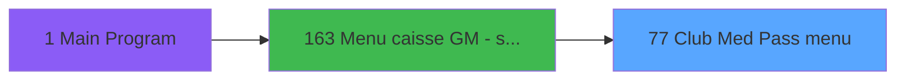

# ADH IDE 77 - Club Med Pass menu

> **Analyse**: Phases 1-4 2026-02-07 03:44 -> 03:45 (28s) | Assemblage 06:50
> **Pipeline**: V7.2 Enrichi
> **Structure**: 4 onglets (Resume | Ecrans | Donnees | Connexions)

<!-- TAB:Resume -->

## 1. FICHE D'IDENTITE

| Attribut | Valeur |
|----------|--------|
| Projet | ADH |
| IDE Position | 77 |
| Nom Programme | Club Med Pass menu |
| Fichier source | `Prg_77.xml` |
| Dossier IDE | EzCard |
| Taches | 9 (5 ecrans visibles) |
| Tables modifiees | 1 |
| Programmes appeles | 12 |

## 2. DESCRIPTION FONCTIONNELLE

**Club Med Pass menu** assure la gestion complete de ce processus, accessible depuis [Menu caisse GM - scroll (IDE 163)](ADH-IDE-163.md).

Le flux de traitement s'organise en **3 blocs fonctionnels** :

- **Traitement** (6 taches) : traitements metier divers
- **Saisie** (2 taches) : ecrans de saisie utilisateur (formulaires, champs, donnees)
- **Creation** (1 tache) : insertion d'enregistrements en base (mouvements, prestations)

**Donnees modifiees** : 1 tables en ecriture (ez_card).

**Logique metier** : 2 regles identifiees couvrant conditions metier.

Detail : phases du traitement

#### Phase 1 : Traitement (6 taches)

- **T1** - Club Med Pass menu **[ECRAN]**
- **T2** - Processing ... **[ECRAN]**
- **T5** - Opposition Club Med Pass
- **T6** - Delete Club Med Pass
- **T8** - paramètre
- **T9** - Club Med Pass menu **[ECRAN]**

Delegue a : [Appel programme (IDE 44)](ADH-IDE-44.md), [Balance Credit de conso (IDE 79)](ADH-IDE-79.md), [   Card scan read (IDE 80)](ADH-IDE-80.md), [Bar Limit (IDE 86)](ADH-IDE-86.md), [Gestion forfait TAI LOCAL (IDE 173)](ADH-IDE-173.md), [Set Listing Number (IDE 181)](ADH-IDE-181.md)

#### Phase 2 : Saisie (2 taches)

- **T3** - Detail des transactions CMP **[ECRAN]**
- **T4** - Transactions details **[ECRAN]**

Delegue a : [Print Ventes Club Med Pass (IDE 78)](ADH-IDE-78.md)

#### Phase 3 : Creation (1 tache)

- **T7** - Create Club Med Pass

Delegue a : [   Card scan create (IDE 81)](ADH-IDE-81.md)

#### Tables impactees

| Table | Operations | Role metier |
|-------|-----------|-------------|
| ez_card | **W**/L (4 usages) |  |

## 3. BLOCS FONCTIONNELS

### 3.1 Traitement (6 taches)

Traitements internes.

---

#### T1 - Club Med Pass menu [ECRAN]

**Role** : Tache d'orchestration : point d'entree du programme (6 sous-taches). Coordonne l'enchainement des traitements.
**Ecran** : 1056 x 256 DLU (MDI) | [Voir mockup](#ecran-t1)

5 sous-taches directes

| Tache | Nom | Bloc |
|-------|-----|------|
| [T2](#t2) | Processing ... **[ECRAN]** | Traitement |
| [T5](#t5) | Opposition Club Med Pass | Traitement |
| [T6](#t6) | Delete Club Med Pass | Traitement |
| [T8](#t8) | paramètre | Traitement |
| [T9](#t9) | Club Med Pass menu **[ECRAN]** | Traitement |

**Variables liees** : Y (v.Club Med Pass ID), Z (V.ID Club Med Pass scannee)
**Delegue a** : [Appel programme (IDE 44)](ADH-IDE-44.md), [Print Ventes Club Med Pass (IDE 78)](ADH-IDE-78.md), [Balance Credit de conso (IDE 79)](ADH-IDE-79.md)

---

#### T2 - Processing ... [ECRAN]

**Role** : Traitement : Processing ....
**Ecran** : 129 x 64 DLU (MDI) | [Voir mockup](#ecran-t2)
**Delegue a** : [Appel programme (IDE 44)](ADH-IDE-44.md), [Balance Credit de conso (IDE 79)](ADH-IDE-79.md), [   Card scan read (IDE 80)](ADH-IDE-80.md)

---

#### T5 - Opposition Club Med Pass

**Role** : Traitement : Opposition Club Med Pass.
**Variables liees** : Y (v.Club Med Pass ID), Z (V.ID Club Med Pass scannee)
**Delegue a** : [Appel programme (IDE 44)](ADH-IDE-44.md), [Balance Credit de conso (IDE 79)](ADH-IDE-79.md), [   Card scan read (IDE 80)](ADH-IDE-80.md)

---

#### T6 - Delete Club Med Pass

**Role** : Traitement : Delete Club Med Pass.
**Variables liees** : Y (v.Club Med Pass ID), Z (V.ID Club Med Pass scannee), BD (v.delete confirmation)
**Delegue a** : [Appel programme (IDE 44)](ADH-IDE-44.md), [Balance Credit de conso (IDE 79)](ADH-IDE-79.md), [   Card scan read (IDE 80)](ADH-IDE-80.md)

---

#### T8 - paramètre

**Role** : Traitement : paramètre.
**Delegue a** : [Appel programme (IDE 44)](ADH-IDE-44.md), [Balance Credit de conso (IDE 79)](ADH-IDE-79.md), [   Card scan read (IDE 80)](ADH-IDE-80.md)

---

#### T9 - Club Med Pass menu [ECRAN]

**Role** : Traitement : Club Med Pass menu.
**Ecran** : 1050 x 73 DLU (Modal) | [Voir mockup](#ecran-t9)
**Variables liees** : Y (v.Club Med Pass ID), Z (V.ID Club Med Pass scannee)
**Delegue a** : [Appel programme (IDE 44)](ADH-IDE-44.md), [Print Ventes Club Med Pass (IDE 78)](ADH-IDE-78.md), [Balance Credit de conso (IDE 79)](ADH-IDE-79.md)

### 3.2 Saisie (2 taches)

L'operateur saisit les donnees de la transaction via 2 ecrans (Detail des transactions CMP, Transactions details).

---

#### T3 - Detail des transactions CMP [ECRAN]

**Role** : Saisie des donnees : Detail des transactions CMP.
**Ecran** : 1190 x 294 DLU (MDI) | [Voir mockup](#ecran-t3)
**Variables liees** : BE (v.ez detail empty)
**Delegue a** : [Print Ventes Club Med Pass (IDE 78)](ADH-IDE-78.md)

---

#### T4 - Transactions details [ECRAN]

**Role** : Saisie des donnees : Transactions details.
**Ecran** : 594 x 87 DLU (Modal) | [Voir mockup](#ecran-t4)
**Delegue a** : [Print Ventes Club Med Pass (IDE 78)](ADH-IDE-78.md)

### 3.3 Creation (1 tache)

Insertion de nouveaux enregistrements en base.

---

#### T7 - Create Club Med Pass

**Role** : Traitement : Create Club Med Pass.
**Variables liees** : Y (v.Club Med Pass ID), Z (V.ID Club Med Pass scannee), BF (v.ok to create)
**Delegue a** : [   Card scan create (IDE 81)](ADH-IDE-81.md)

## 5. REGLES METIER

2 regles identifiees:

### Autres (2 regles)

#### [RM-001] Si GetParam ('CODELANGUE')='FRA' alors 'Cette carte n''appartient pas a ce compte' sinon 'This card do not belong to this account')

| Element | Detail |
|---------|--------|
| **Condition** | `GetParam ('CODELANGUE')='FRA'` |
| **Si vrai** | 'Cette carte n''appartient pas a ce compte' |
| **Si faux** | 'This card do not belong to this account') |
| **Expression source** | Expression 3 : `IF (GetParam ('CODELANGUE')='FRA','Cette carte n''appartient` |
| **Exemple** | Si GetParam ('CODELANGUE')='FRA' → 'Cette carte n''appartient pas a ce compte'. Sinon → 'This card do not belong to this account') |

#### [RM-002] Si [AJ]='O' alors IF ([AK]=0 sinon 'Bar Limit Activated for All','Bar Limit Activated under '&Trim (Str ([AK],'2'))),'Bar Limit Desactivated')

| Element | Detail |
|---------|--------|
| **Condition** | `[AJ]='O'` |
| **Si vrai** | IF ([AK]=0 |
| **Si faux** | 'Bar Limit Activated for All','Bar Limit Activated under '&Trim (Str ([AK],'2'))),'Bar Limit Desactivated') |
| **Expression source** | Expression 8 : `IF ([AJ]='O',IF ([AK]=0,'Bar Limit Activated for All','Bar L` |
| **Exemple** | Si [AJ]='O' → IF ([AK]=0 |

## 6. CONTEXTE

- **Appele par**: [Menu caisse GM - scroll (IDE 163)](ADH-IDE-163.md)
- **Appelle**: 12 programmes | **Tables**: 10 (W:1 R:4 L:6) | **Taches**: 9 | **Expressions**: 46

<!-- TAB:Ecrans -->

## 8. ECRANS

### 8.1 Forms visibles (5 / 9)

| # | Position | Tache | Nom | Type | Largeur | Hauteur | Bloc |
|---|----------|-------|-----|------|---------|---------|------|
| 1 | 77 | T1 | Club Med Pass menu | MDI | 1056 | 256 | Traitement |
| 2 | 77.1 | T2 | Processing ... | MDI | 129 | 64 | Traitement |
| 3 | 77.2 | T3 | Detail des transactions CMP | MDI | 1190 | 294 | Saisie |
| 4 | 77.2.1 | T4 | Transactions details | Modal | 594 | 87 | Saisie |
| 5 | 77.7 | T9 | Club Med Pass menu | Modal | 1050 | 73 | Traitement |

### 8.2 Mockups Ecrans

---

#### 77 - Club Med Pass menu
**Tache** : [T1](#t1) | **Type** : MDI | **Dimensions** : 1056 x 256 DLU
**Bloc** : Traitement | **Titre IDE** : Club Med Pass menu

<!-- FORM-DATA:
{
    "width":  1056,
    "vFactor":  8,
    "type":  "MDI",
    "hFactor":  8,
    "controls":  [
                     {
                         "x":  0,
                         "type":  "label",
                         "var":  "",
                         "y":  1,
                         "w":  1044,
                         "fmt":  "",
                         "name":  "",
                         "h":  21,
                         "color":  "",
                         "text":  "",
                         "parent":  null
                     },
                     {
                         "x":  0,
                         "type":  "label",
                         "var":  "",
                         "y":  231,
                         "w":  1044,
                         "fmt":  "",
                         "name":  "",
                         "h":  24,
                         "color":  "",
                         "text":  "",
                         "parent":  null
                     },
                     {
                         "x":  33,
                         "type":  "label",
                         "var":  "",
                         "y":  112,
                         "w":  997,
                         "fmt":  "",
                         "name":  "",
                         "h":  108,
                         "color":  "",
                         "text":  "",
                         "parent":  null
                     },
                     {
                         "x":  37,
                         "type":  "label",
                         "var":  "",
                         "y":  114,
                         "w":  306,
                         "fmt":  "",
                         "name":  "",
                         "h":  69,
                         "color":  "",
                         "text":  "",
                         "parent":  7
                     },
                     {
                         "x":  341,
                         "type":  "label",
                         "var":  "",
                         "y":  114,
                         "w":  344,
                         "fmt":  "",
                         "name":  "",
                         "h":  69,
                         "color":  "",
                         "text":  "",
                         "parent":  7
                     },
                     {
                         "x":  690,
                         "type":  "label",
                         "var":  "",
                         "y":  114,
                         "w":  336,
                         "fmt":  "",
                         "name":  "",
                         "h":  69,
                         "color":  "",
                         "text":  "",
                         "parent":  7
                     },
                     {
                         "x":  40,
                         "type":  "label",
                         "var":  "",
                         "y":  116,
                         "w":  42,
                         "fmt":  "",
                         "name":  "",
                         "h":  64,
                         "color":  "",
                         "text":  "",
                         "parent":  7
                     },
                     {
                         "x":  345,
                         "type":  "label",
                         "var":  "",
                         "y":  116,
                         "w":  42,
                         "fmt":  "",
                         "name":  "",
                         "h":  64,
                         "color":  "",
                         "text":  "",
                         "parent":  7
                     },
                     {
                         "x":  692,
                         "type":  "label",
                         "var":  "",
                         "y":  116,
                         "w":  42,
                         "fmt":  "",
                         "name":  "",
                         "h":  64,
                         "color":  "",
                         "text":  "",
                         "parent":  7
                     },
                     {
                         "x":  104,
                         "type":  "label",
                         "var":  "",
                         "y":  117,
                         "w":  223,
                         "fmt":  "",
                         "name":  "",
                         "h":  10,
                         "color":  "142",
                         "text":  "Sur le compte",
                         "parent":  7
                     },
                     {
                         "x":  390,
                         "type":  "label",
                         "var":  "",
                         "y":  117,
                         "w":  274,
                         "fmt":  "",
                         "name":  "",
                         "h":  10,
                         "color":  "142",
                         "text":  "Sur la filiation",
                         "parent":  7
                     },
                     {
                         "x":  739,
                         "type":  "label",
                         "var":  "",
                         "y":  117,
                         "w":  274,
                         "fmt":  "",
                         "name":  "",
                         "h":  10,
                         "color":  "142",
                         "text":  "Sur la carte",
                         "parent":  7
                     },
                     {
                         "x":  398,
                         "type":  "line",
                         "var":  "",
                         "y":  128,
                         "w":  274,
                         "fmt":  "",
                         "name":  "",
                         "h":  0,
                         "color":  "",
                         "text":  "",
                         "parent":  9
                     },
                     {
                         "x":  747,
                         "type":  "line",
                         "var":  "",
                         "y":  128,
                         "w":  274,
                         "fmt":  "",
                         "name":  "",
                         "h":  0,
                         "color":  "",
                         "text":  "",
                         "parent":  10
                     },
                     {
                         "x":  91,
                         "type":  "label",
                         "var":  "",
                         "y":  132,
                         "w":  222,
                         "fmt":  "",
                         "name":  "",
                         "h":  9,
                         "color":  "142",
                         "text":  "Création",
                         "parent":  7
                     },
                     {
                         "x":  395,
                         "type":  "label",
                         "var":  "",
                         "y":  132,
                         "w":  278,
                         "fmt":  "",
                         "name":  "",
                         "h":  9,
                         "color":  "142",
                         "text":  "Détail",
                         "parent":  7
                     },
                     {
                         "x":  742,
                         "type":  "label",
                         "var":  "",
                         "y":  132,
                         "w":  269,
                         "fmt":  "",
                         "name":  "",
                         "h":  9,
                         "color":  "142",
                         "text":  "Opposition",
                         "parent":  7
                     },
                     {
                         "x":  91,
                         "type":  "label",
                         "var":  "",
                         "y":  143,
                         "w":  222,
                         "fmt":  "",
                         "name":  "",
                         "h":  9,
                         "color":  "142",
                         "text":  "Détail",
                         "parent":  7
                     },
                     {
                         "x":  395,
                         "type":  "label",
                         "var":  "",
                         "y":  143,
                         "w":  278,
                         "fmt":  "",
                         "name":  "",
                         "h":  9,
                         "color":  "142",
                         "text":  "Balance crédit de conso",
                         "parent":  7
                     },
                     {
                         "x":  742,
                         "type":  "label",
                         "var":  "",
                         "y":  143,
                         "w":  269,
                         "fmt":  "",
                         "name":  "",
                         "h":  9,
                         "color":  "142",
                         "text":  "Annulation d\u0027opposition",
                         "parent":  7
                     },
                     {
                         "x":  742,
                         "type":  "label",
                         "var":  "",
                         "y":  155,
                         "w":  222,
                         "fmt":  "",
                         "name":  "",
                         "h":  9,
                         "color":  "142",
                         "text":  "Bar Limit",
                         "parent":  7
                     },
                     {
                         "x":  455,
                         "type":  "label",
                         "var":  "",
                         "y":  198,
                         "w":  120,
                         "fmt":  "",
                         "name":  "",
                         "h":  10,
                         "color":  "",
                         "text":  "Votre choix",
                         "parent":  7
                     },
                     {
                         "x":  104,
                         "type":  "line",
                         "var":  "",
                         "y":  128,
                         "w":  223,
                         "fmt":  "",
                         "name":  "",
                         "h":  0,
                         "color":  "",
                         "text":  "",
                         "parent":  8
                     },
                     {
                         "x":  579,
                         "type":  "edit",
                         "var":  "",
                         "y":  198,
                         "w":  26,
                         "fmt":  "UA",
                         "name":  "v.choix action",
                         "h":  10,
                         "color":  "6",
                         "text":  "",
                         "parent":  7
                     },
                     {
                         "x":  5,
                         "type":  "image",
                         "var":  "",
                         "y":  3,
                         "w":  59,
                         "fmt":  "",
                         "name":  "",
                         "h":  18,
                         "color":  "",
                         "text":  "",
                         "parent":  null
                     },
                     {
                         "x":  77,
                         "type":  "edit",
                         "var":  "",
                         "y":  7,
                         "w":  379,
                         "fmt":  "60",
                         "name":  "",
                         "h":  8,
                         "color":  "",
                         "text":  "",
                         "parent":  null
                     },
                     {
                         "x":  768,
                         "type":  "edit",
                         "var":  "",
                         "y":  7,
                         "w":  259,
                         "fmt":  "WWW DD MMM YYYYT",
                         "name":  "",
                         "h":  10,
                         "color":  "",
                         "text":  "",
                         "parent":  null
                     },
                     {
                         "x":  48,
                         "type":  "button",
                         "var":  "",
                         "y":  132,
                         "w":  27,
                         "fmt":  "A",
                         "name":  "A",
                         "h":  9,
                         "color":  "",
                         "text":  "",
                         "parent":  null
                     },
                     {
                         "x":  350,
                         "type":  "button",
                         "var":  "",
                         "y":  132,
                         "w":  29,
                         "fmt":  "E",
                         "name":  "E",
                         "h":  9,
                         "color":  "",
                         "text":  "",
                         "parent":  null
                     },
                     {
                         "x":  698,
                         "type":  "button",
                         "var":  "",
                         "y":  132,
                         "w":  27,
                         "fmt":  "C",
                         "name":  "C",
                         "h":  9,
                         "color":  "",
                         "text":  "",
                         "parent":  null
                     },
                     {
                         "x":  48,
                         "type":  "button",
                         "var":  "",
                         "y":  143,
                         "w":  29,
                         "fmt":  "B",
                         "name":  "B",
                         "h":  9,
                         "color":  "",
                         "text":  "",
                         "parent":  null
                     },
                     {
                         "x":  350,
                         "type":  "button",
                         "var":  "",
                         "y":  143,
                         "w":  29,
                         "fmt":  "F",
                         "name":  "F",
                         "h":  9,
                         "color":  "",
                         "text":  "",
                         "parent":  null
                     },
                     {
                         "x":  697,
                         "type":  "button",
                         "var":  "",
                         "y":  143,
                         "w":  29,
                         "fmt":  "D",
                         "name":  "D",
                         "h":  9,
                         "color":  "",
                         "text":  "",
                         "parent":  null
                     },
                     {
                         "x":  697,
                         "type":  "button",
                         "var":  "",
                         "y":  155,
                         "w":  29,
                         "fmt":  "P",
                         "name":  "P",
                         "h":  9,
                         "color":  "",
                         "text":  "",
                         "parent":  null
                     },
                     {
                         "x":  46,
                         "type":  "image",
                         "var":  "",
                         "y":  186,
                         "w":  94,
                         "fmt":  "",
                         "name":  "",
                         "h":  31,
                         "color":  "",
                         "text":  "",
                         "parent":  null
                     },
                     {
                         "x":  742,
                         "type":  "edit",
                         "var":  "",
                         "y":  198,
                         "w":  277,
                         "fmt":  "50",
                         "name":  "",
                         "h":  10,
                         "color":  "143",
                         "text":  "",
                         "parent":  7
                     },
                     {
                         "x":  8,
                         "type":  "button",
                         "var":  "",
                         "y":  234,
                         "w":  154,
                         "fmt":  "\u0026Quitter",
                         "name":  "",
                         "h":  18,
                         "color":  "",
                         "text":  "",
                         "parent":  6
                     },
                     {
                         "x":  817,
                         "type":  "button",
                         "var":  "",
                         "y":  234,
                         "w":  215,
                         "fmt":  "\u0026Scan Club Med Pass",
                         "name":  "Z",
                         "h":  18,
                         "color":  "",
                         "text":  "",
                         "parent":  6
                     },
                     {
                         "x":  3,
                         "type":  "subform",
                         "var":  "",
                         "y":  24,
                         "w":  1050,
                         "fmt":  "",
                         "name":  "LISTECARD",
                         "h":  88,
                         "color":  "",
                         "text":  "",
                         "parent":  null
                     }
                 ],
    "taskId":  "77",
    "height":  256
}
-->

<strong>Champs : 4 champs</strong>

| Pos (x,y) | Nom | Variable | Type |
|-----------|-----|----------|------|
| 579,198 | v.choix action | - | edit |
| 77,7 | 60 | - | edit |
| 768,7 | WWW DD MMM YYYYT | - | edit |
| 742,198 | 50 | - | edit |

<strong>Boutons : 9 boutons</strong>

| Bouton | Pos (x,y) | Action |
|--------|-----------|--------|
| A | 48,132 | Bouton fonctionnel |
| E | 350,132 | Bouton fonctionnel |
| C | 698,132 | Bouton fonctionnel |
| B | 48,143 | Bouton fonctionnel |
| F | 350,143 | Bouton fonctionnel |
| D | 697,143 | Bouton fonctionnel |
| P | 697,155 | Bouton fonctionnel |
| Quitter | 8,234 | Quitte le programme |
| Scan Club Med Pass | 817,234 | Appel [   Card scan read (IDE 80)](ADH-IDE-80.md) |

---

#### 77.1 - Processing ...
**Tache** : [T2](#t2) | **Type** : MDI | **Dimensions** : 129 x 64 DLU
**Bloc** : Traitement | **Titre IDE** : Processing ...

<!-- FORM-DATA:
{
    "width":  129,
    "vFactor":  8,
    "type":  "MDI",
    "hFactor":  4,
    "controls":  [
                     {
                         "x":  26,
                         "type":  "button",
                         "var":  "",
                         "y":  25,
                         "w":  77,
                         "fmt":  "",
                         "name":  "bouton",
                         "h":  14,
                         "color":  "",
                         "text":  "",
                         "parent":  null
                     }
                 ],
    "taskId":  "77.1",
    "height":  64
}
-->

<strong>Boutons : 1 boutons</strong>

| Bouton | Pos (x,y) | Action |
|--------|-----------|--------|
| (sans nom) | 26,25 | Action declenchee |

---

#### 77.2 - Detail des transactions CMP
**Tache** : [T3](#t3) | **Type** : MDI | **Dimensions** : 1190 x 294 DLU
**Bloc** : Saisie | **Titre IDE** : Detail des transactions CMP

<!-- FORM-DATA:
{
    "width":  1190,
    "vFactor":  8,
    "type":  "MDI",
    "hFactor":  8,
    "controls":  [
                     {
                         "x":  0,
                         "type":  "label",
                         "var":  "",
                         "y":  0,
                         "w":  1190,
                         "fmt":  "",
                         "name":  "",
                         "h":  21,
                         "color":  "",
                         "text":  "",
                         "parent":  null
                     },
                     {
                         "x":  10,
                         "type":  "table",
                         "var":  "",
                         "name":  "",
                         "titleH":  14,
                         "color":  "6",
                         "w":  1171,
                         "y":  43,
                         "fmt":  "",
                         "parent":  null,
                         "text":  "",
                         "rowH":  12,
                         "h":  114,
                         "cols":  [
                                      {
                                          "title":  "Bar",
                                          "layer":  1,
                                          "w":  160
                                      },
                                      {
                                          "title":  "Ticket #",
                                          "layer":  2,
                                          "w":  223
                                      },
                                      {
                                          "title":  "Vente",
                                          "layer":  3,
                                          "w":  167
                                      },
                                      {
                                          "title":  "Payant",
                                          "layer":  4,
                                          "w":  163
                                      },
                                      {
                                          "title":  "Crédit conso",
                                          "layer":  5,
                                          "w":  168
                                      },
                                      {
                                          "title":  "Date",
                                          "layer":  6,
                                          "w":  158
                                      },
                                      {
                                          "title":  "Heure",
                                          "layer":  7,
                                          "w":  97
                                      }
                                  ],
                         "rows":  7
                     },
                     {
                         "x":  8,
                         "type":  "edit",
                         "var":  "",
                         "y":  27,
                         "w":  296,
                         "fmt":  "",
                         "name":  "",
                         "h":  12,
                         "color":  "",
                         "text":  "",
                         "parent":  null
                     },
                     {
                         "x":  228,
                         "type":  "edit",
                         "var":  "",
                         "y":  28,
                         "w":  42,
                         "fmt":  "",
                         "name":  "",
                         "h":  10,
                         "color":  "",
                         "text":  "",
                         "parent":  null
                     },
                     {
                         "x":  395,
                         "type":  "edit",
                         "var":  "",
                         "y":  59,
                         "w":  151,
                         "fmt":  "",
                         "name":  "",
                         "h":  8,
                         "color":  "6",
                         "text":  "",
                         "parent":  8
                     },
                     {
                         "x":  566,
                         "type":  "edit",
                         "var":  "",
                         "y":  60,
                         "w":  151,
                         "fmt":  "",
                         "name":  "",
                         "h":  8,
                         "color":  "6",
                         "text":  "",
                         "parent":  8
                     },
                     {
                         "x":  739,
                         "type":  "edit",
                         "var":  "",
                         "y":  59,
                         "w":  151,
                         "fmt":  "",
                         "name":  "",
                         "h":  8,
                         "color":  "6",
                         "text":  "",
                         "parent":  8
                     },
                     {
                         "x":  918,
                         "type":  "edit",
                         "var":  "",
                         "y":  59,
                         "w":  124,
                         "fmt":  "",
                         "name":  "",
                         "h":  8,
                         "color":  "6",
                         "text":  "",
                         "parent":  8
                     },
                     {
                         "x":  1058,
                         "type":  "edit",
                         "var":  "",
                         "y":  59,
                         "w":  76,
                         "fmt":  "HH:MMZ",
                         "name":  "",
                         "h":  8,
                         "color":  "6",
                         "text":  "",
                         "parent":  8
                     },
                     {
                         "x":  980,
                         "type":  "button",
                         "var":  "",
                         "y":  159,
                         "w":  198,
                         "fmt":  "",
                         "name":  "bt view details",
                         "h":  18,
                         "color":  "",
                         "text":  "",
                         "parent":  null
                     },
                     {
                         "x":  5,
                         "type":  "image",
                         "var":  "",
                         "y":  2,
                         "w":  59,
                         "fmt":  "",
                         "name":  "",
                         "h":  18,
                         "color":  "",
                         "text":  "",
                         "parent":  null
                     },
                     {
                         "x":  77,
                         "type":  "edit",
                         "var":  "",
                         "y":  6,
                         "w":  267,
                         "fmt":  "30",
                         "name":  "",
                         "h":  8,
                         "color":  "",
                         "text":  "",
                         "parent":  null
                     },
                     {
                         "x":  905,
                         "type":  "edit",
                         "var":  "",
                         "y":  7,
                         "w":  259,
                         "fmt":  "WWW DD MMM YYYYT",
                         "name":  "",
                         "h":  8,
                         "color":  "",
                         "text":  "",
                         "parent":  null
                     },
                     {
                         "x":  322,
                         "type":  "edit",
                         "var":  "",
                         "y":  27,
                         "w":  314,
                         "fmt":  "60",
                         "name":  "",
                         "h":  12,
                         "color":  "",
                         "text":  "",
                         "parent":  null
                     },
                     {
                         "x":  18,
                         "type":  "edit",
                         "var":  "",
                         "y":  59,
                         "w":  150,
                         "fmt":  "30",
                         "name":  "",
                         "h":  8,
                         "color":  "6",
                         "text":  "",
                         "parent":  8
                     },
                     {
                         "x":  173,
                         "type":  "edit",
                         "var":  "",
                         "y":  59,
                         "w":  214,
                         "fmt":  "14",
                         "name":  "",
                         "h":  8,
                         "color":  "6",
                         "text":  "",
                         "parent":  8
                     },
                     {
                         "x":  578,
                         "type":  "button",
                         "var":  "",
                         "y":  159,
                         "w":  198,
                         "fmt":  "Printer",
                         "name":  "",
                         "h":  18,
                         "color":  "",
                         "text":  "",
                         "parent":  null
                     },
                     {
                         "x":  779,
                         "type":  "button",
                         "var":  "",
                         "y":  159,
                         "w":  198,
                         "fmt":  "\u0026Imprimer",
                         "name":  "Print",
                         "h":  18,
                         "color":  "",
                         "text":  "",
                         "parent":  null
                     },
                     {
                         "x":  976,
                         "type":  "button",
                         "var":  "",
                         "y":  276,
                         "w":  198,
                         "fmt":  "Exit",
                         "name":  "",
                         "h":  18,
                         "color":  "",
                         "text":  "",
                         "parent":  null
                     },
                     {
                         "x":  2,
                         "type":  "subform",
                         "var":  "",
                         "y":  179,
                         "w":  1187,
                         "fmt":  "",
                         "name":  "EZ details (ticket)",
                         "h":  96,
                         "color":  "",
                         "text":  "",
                         "parent":  null
                     }
                 ],
    "taskId":  "77.2",
    "height":  294
}
-->

<strong>Champs : 12 champs</strong>

| Pos (x,y) | Nom | Variable | Type |
|-----------|-----|----------|------|
| 8,27 | (sans nom) | - | edit |
| 228,28 | (sans nom) | - | edit |
| 395,59 | (sans nom) | - | edit |
| 566,60 | (sans nom) | - | edit |
| 739,59 | (sans nom) | - | edit |
| 918,59 | (sans nom) | - | edit |
| 1058,59 | HH:MMZ | - | edit |
| 77,6 | 30 | - | edit |
| 905,7 | WWW DD MMM YYYYT | - | edit |
| 322,27 | 60 | - | edit |
| 18,59 | 30 | - | edit |
| 173,59 | 14 | - | edit |

<strong>Boutons : 4 boutons</strong>

| Bouton | Pos (x,y) | Action |
|--------|-----------|--------|
| bt view details | 980,159 | Affiche les details |
| Printer | 578,159 | Appel [Print Ventes Club Med Pass (IDE 78)](ADH-IDE-78.md) |
| Imprimer | 779,159 | Lance l'impression |
| Exit | 976,276 | Quitte le programme |

---

#### 77.2.1 - Transactions details
**Tache** : [T4](#t4) | **Type** : Modal | **Dimensions** : 594 x 87 DLU
**Bloc** : Saisie | **Titre IDE** : Transactions details

<!-- FORM-DATA:
{
    "width":  594,
    "vFactor":  8,
    "type":  "Modal",
    "hFactor":  4,
    "controls":  [
                     {
                         "x":  26,
                         "type":  "table",
                         "var":  "",
                         "name":  "",
                         "titleH":  14,
                         "color":  "6",
                         "w":  542,
                         "y":  8,
                         "fmt":  "",
                         "parent":  null,
                         "text":  "",
                         "rowH":  14,
                         "h":  79,
                         "cols":  [
                                      {
                                          "title":  "Ticket #",
                                          "layer":  1,
                                          "w":  127
                                      },
                                      {
                                          "title":  "Article",
                                          "layer":  2,
                                          "w":  124
                                      },
                                      {
                                          "title":  "Quantité",
                                          "layer":  3,
                                          "w":  48
                                      },
                                      {
                                          "title":  "Montant",
                                          "layer":  4,
                                          "w":  90
                                      },
                                      {
                                          "title":  "Happy hour",
                                          "layer":  5,
                                          "w":  77
                                      },
                                      {
                                          "title":  "Quantité TAI",
                                          "layer":  6,
                                          "w":  59
                                      }
                                  ],
                         "rows":  6
                     },
                     {
                         "x":  157,
                         "type":  "edit",
                         "var":  "",
                         "y":  24,
                         "w":  116,
                         "fmt":  "",
                         "name":  "",
                         "h":  10,
                         "color":  "6",
                         "text":  "",
                         "parent":  1
                     },
                     {
                         "x":  281,
                         "type":  "edit",
                         "var":  "",
                         "y":  24,
                         "w":  30,
                         "fmt":  "",
                         "name":  "",
                         "h":  10,
                         "color":  "6",
                         "text":  "",
                         "parent":  1
                     },
                     {
                         "x":  329,
                         "type":  "edit",
                         "var":  "",
                         "y":  25,
                         "w":  83,
                         "fmt":  "",
                         "name":  "",
                         "h":  10,
                         "color":  "6",
                         "text":  "",
                         "parent":  1
                     },
                     {
                         "x":  433,
                         "type":  "combobox",
                         "var":  "",
                         "y":  24,
                         "w":  55,
                         "fmt":  "",
                         "name":  "",
                         "h":  12,
                         "color":  "6",
                         "text":  "Oui,Non",
                         "parent":  1
                     },
                     {
                         "x":  519,
                         "type":  "edit",
                         "var":  "",
                         "y":  24,
                         "w":  24,
                         "fmt":  "",
                         "name":  "",
                         "h":  10,
                         "color":  "6",
                         "text":  "",
                         "parent":  1
                     },
                     {
                         "x":  30,
                         "type":  "edit",
                         "var":  "",
                         "y":  24,
                         "w":  120,
                         "fmt":  "14",
                         "name":  "",
                         "h":  10,
                         "color":  "6",
                         "text":  "",
                         "parent":  1
                     }
                 ],
    "taskId":  "77.2.1",
    "height":  87
}
-->

<strong>Champs : 6 champs</strong>

| Pos (x,y) | Nom | Variable | Type |
|-----------|-----|----------|------|
| 157,24 | (sans nom) | - | edit |
| 281,24 | (sans nom) | - | edit |
| 329,25 | (sans nom) | - | edit |
| 433,24 | Oui,Non | - | combobox |
| 519,24 | (sans nom) | - | edit |
| 30,24 | 14 | - | edit |

---

#### 77.7 - Club Med Pass menu
**Tache** : [T9](#t9) | **Type** : Modal | **Dimensions** : 1050 x 73 DLU
**Bloc** : Traitement | **Titre IDE** : Club Med Pass menu

<!-- FORM-DATA:
{
    "width":  1050,
    "vFactor":  8,
    "type":  "Modal",
    "hFactor":  8,
    "controls":  [
                     {
                         "x":  22,
                         "type":  "label",
                         "var":  "",
                         "y":  1,
                         "w":  98,
                         "fmt":  "",
                         "name":  "",
                         "h":  10,
                         "color":  "",
                         "text":  "Account # :",
                         "parent":  null
                     },
                     {
                         "x":  20,
                         "type":  "table",
                         "var":  "",
                         "name":  "",
                         "titleH":  12,
                         "color":  "6",
                         "w":  1008,
                         "y":  12,
                         "fmt":  "",
                         "parent":  null,
                         "text":  "",
                         "rowH":  14,
                         "h":  58,
                         "cols":  [
                                      {
                                          "title":  "Filiation",
                                          "layer":  1,
                                          "w":  112
                                      },
                                      {
                                          "title":  "Prénom",
                                          "layer":  2,
                                          "w":  144
                                      },
                                      {
                                          "title":  "Nom",
                                          "layer":  3,
                                          "w":  314
                                      },
                                      {
                                          "title":  "Opération",
                                          "layer":  4,
                                          "w":  403
                                      }
                                  ],
                         "rows":  4
                     },
                     {
                         "x":  27,
                         "type":  "edit",
                         "var":  "",
                         "y":  26,
                         "w":  42,
                         "fmt":  "",
                         "name":  "",
                         "h":  8,
                         "color":  "6",
                         "text":  "",
                         "parent":  3
                     },
                     {
                         "x":  608,
                         "type":  "edit",
                         "var":  "",
                         "y":  26,
                         "w":  126,
                         "fmt":  "##/##/####Z",
                         "name":  "",
                         "h":  10,
                         "color":  "6",
                         "text":  "",
                         "parent":  3
                     },
                     {
                         "x":  758,
                         "type":  "edit",
                         "var":  "",
                         "y":  26,
                         "w":  91,
                         "fmt":  "HH:MMZ",
                         "name":  "",
                         "h":  10,
                         "color":  "6",
                         "text":  "",
                         "parent":  3
                     },
                     {
                         "x":  882,
                         "type":  "edit",
                         "var":  "",
                         "y":  26,
                         "w":  104,
                         "fmt":  "",
                         "name":  "",
                         "h":  10,
                         "color":  "6",
                         "text":  "",
                         "parent":  3
                     },
                     {
                         "x":  139,
                         "type":  "edit",
                         "var":  "",
                         "y":  26,
                         "w":  104,
                         "fmt":  "8",
                         "name":  "",
                         "h":  10,
                         "color":  "6",
                         "text":  "",
                         "parent":  3
                     },
                     {
                         "x":  283,
                         "type":  "edit",
                         "var":  "",
                         "y":  26,
                         "w":  299,
                         "fmt":  "U30",
                         "name":  "",
                         "h":  10,
                         "color":  "6",
                         "text":  "",
                         "parent":  3
                     },
                     {
                         "x":  126,
                         "type":  "edit",
                         "var":  "",
                         "y":  1,
                         "w":  98,
                         "fmt":  "",
                         "name":  "P.Code 8 chiffres",
                         "h":  10,
                         "color":  "",
                         "text":  "",
                         "parent":  null
                     }
                 ],
    "taskId":  "77.7",
    "height":  73
}
-->

<strong>Champs : 7 champs</strong>

| Pos (x,y) | Nom | Variable | Type |
|-----------|-----|----------|------|
| 27,26 | (sans nom) | - | edit |
| 608,26 | ##/##/####Z | - | edit |
| 758,26 | HH:MMZ | - | edit |
| 882,26 | (sans nom) | - | edit |
| 139,26 | 8 | - | edit |
| 283,26 | U30 | - | edit |
| 126,1 | P.Code 8 chiffres | - | edit |

## 9. NAVIGATION

### 9.1 Enchainement des ecrans

**Detail par enchainement :**

| Depuis | Action | Vers | Retour |
|--------|--------|------|--------|
| Club Med Pass menu | Sous-programme | [Appel programme (IDE 44)](ADH-IDE-44.md) | Retour ecran |
| Club Med Pass menu | Impression ticket/document | [Print Ventes Club Med Pass (IDE 78)](ADH-IDE-78.md) | Retour ecran |
| Club Med Pass menu | Sous-programme | [Balance Credit de conso (IDE 79)](ADH-IDE-79.md) | Retour ecran |
| Club Med Pass menu | Sous-programme | [   Card scan read (IDE 80)](ADH-IDE-80.md) | Retour ecran |
| Club Med Pass menu | Sous-programme | [   Card scan create (IDE 81)](ADH-IDE-81.md) | Retour ecran |
| Club Med Pass menu | Selection/consultation | [   Select affilies (IDE 82)](ADH-IDE-82.md) | Retour ecran |
| Club Med Pass menu | Sous-programme | [Bar Limit (IDE 86)](ADH-IDE-86.md) | Retour ecran |
| Club Med Pass menu | Gestion moyens paiement | [Gestion forfait TAI LOCAL (IDE 173)](ADH-IDE-173.md) | Retour ecran |
| Club Med Pass menu | Impression ticket/document | [Get Printer (IDE 179)](ADH-IDE-179.md) | Retour ecran |
| Club Med Pass menu | Impression ticket/document | [Printer choice (IDE 180)](ADH-IDE-180.md) | Retour ecran |
| Club Med Pass menu | Configuration impression | [Set Listing Number (IDE 181)](ADH-IDE-181.md) | Retour ecran |
| Club Med Pass menu | Impression ticket/document | [Raz Current Printer (IDE 182)](ADH-IDE-182.md) | Retour ecran |

### 9.3 Structure hierarchique (9 taches)

| Position | Tache | Type | Dimensions | Bloc |
|----------|-------|------|------------|------|
| **77.1** | [**Club Med Pass menu** (T1)](#t1) [mockup](#ecran-t1) | MDI | 1056x256 | Traitement |
| 77.1.1 | [Processing ... (T2)](#t2) [mockup](#ecran-t2) | MDI | 129x64 | |
| 77.1.2 | [Opposition Club Med Pass (T5)](#t5) | MDI | - | |
| 77.1.3 | [Delete Club Med Pass (T6)](#t6) | MDI | - | |
| 77.1.4 | [paramètre (T8)](#t8) | MDI | - | |
| 77.1.5 | [Club Med Pass menu (T9)](#t9) [mockup](#ecran-t9) | Modal | 1050x73 | |
| **77.2** | [**Detail des transactions CMP** (T3)](#t3) [mockup](#ecran-t3) | MDI | 1190x294 | Saisie |
| 77.2.1 | [Transactions details (T4)](#t4) [mockup](#ecran-t4) | Modal | 594x87 | |
| **77.3** | [**Create Club Med Pass** (T7)](#t7) | MDI | - | Creation |

### 9.4 Algorigramme

> *algo-data indisponible. Utiliser `/algorigramme` pour generer.*

<!-- TAB:Donnees -->

## 10. TABLES

### Tables utilisees (10)

| ID | Nom | Description | Type | R | W | L | Usages |
|----|-----|-------------|------|---|---|---|--------|
| 14 | transac_detail_bar |  | DB | R |   |   | 1 |
| 15 | transac_entete_bar |  | DB |   |   | L | 1 |
| 31 | gm-complet_______gmc |  | DB | R |   |   | 2 |
| 34 | hebergement______heb | Hebergement (chambres) | DB |   |   | L | 1 |
| 47 | compte_gm________cgm | Comptes GM (generaux) | DB |   |   | L | 1 |
| 131 | fichier_validation |  | DB |   |   | L | 1 |
| 312 | ez_card |  | DB |   | **W** | L | 4 |
| 470 | comptage_coffre | Etat du coffre | TMP |   |   | L | 1 |
| 728 | arc_cc_total |  | DB | R |   |   | 1 |
| 786 | qualite_avant_reprise |  | DB | R |   |   | 1 |

### Colonnes par table (5 / 5 tables avec colonnes identifiees)

Table 14 - transac_detail_bar (R) - 1 usages

| Lettre | Variable | Acces | Type |
|--------|----------|-------|------|
| A | P.Bar_id | R | Unicode |
| B | P.Pos_id | R | Unicode |
| C | P.Ticket_number | R | Unicode |
| D | TicketSelectionEzm | R | Alpha |

Table 31 - gm-complet_______gmc (R) - 2 usages

| Lettre | Variable | Acces | Type |
|--------|----------|-------|------|
| A | v.view detail | R | Logical |
| B | bt view details | R | Alpha |

Table 312 - ez_card (**W**/L) - 4 usages

| Lettre | Variable | Acces | Type |
|--------|----------|-------|------|
| A | r.other card valid | W | Logical |
| BA | V.Status card | W | Alpha |
| BB | V.Other card valid | W | Logical |

Table 728 - arc_cc_total (R) - 1 usages

*Table utilisee uniquement en Link ou aucune colonne Real identifiee dans le DataView.*

Table 786 - qualite_avant_reprise (R) - 1 usages

| Lettre | Variable | Acces | Type |
|--------|----------|-------|------|
| A | P.Societe | R | Alpha |
| B | P.Code 8 chiffres | R | Numeric |
| C | P.Filiation | R | Numeric |
| D | P.Masque montant | R | Alpha |
| E | P.Masque cumul | R | Alpha |
| F | P.TAI societe | R | Alpha |
| G | P.TAI Devise locale | R | Alpha |
| H | P.TAI Masque montant | R | Alpha |
| I | P.TAI Solde compte | R | Numeric |
| J | p.TAI.code GM | R | Numeric |
| K | P.TAI Filiation | R | Numeric |
| L | p.TAI.date deb sejour | R | Date |
| M | p.TAI.date fin sejour | R | Date |
| N | p.TAI.etat compte | R | Alpha |
| O | p.TAI.date du solde | R | Date |
| P | p.TAI.garantie O/N | R | Alpha |
| Q | p.TAI.Nom prenom | R | Alpha |
| R | p.TAI.Age | R | Alpha |
| S | p.village TAI | R | Alpha |
| T | P.Age num | R | Numeric |
| U | P.Nb mois | R | Numeric |
| V | V.TAI Obligatoire | R | Alpha |
| W | V.Nom complet | R | Alpha |
| X | V.Prenom complet | R | Alpha |
| Y | v.Club Med Pass ID | R | Alpha |
| Z | V.ID Club Med Pass scannee | R | Alpha |
| BA | V.Status card | R | Alpha |
| BB | V.Other card valid | R | Logical |
| BC | V.Date de naissance | R | Date |
| BD | v.delete confirmation | R | Numeric |
| BE | v.ez detail empty | R | Logical |
| BF | v.ok to create | R | Logical |
| BG | V.Action | R | Alpha |
| BH | V.Choix action | R | Alpha |
| BI | V.Age mineur | R | Numeric |
| BJ | v.Activation Bar Limit | R | Alpha |
| BK | v.Age Bar Limit | R | Numeric |
| BL | v.ActionPActive | R | Logical |
| BM | V.Compte scanne | R | Numeric |
| BN | V.Compte special | R | Logical |

## 11. VARIABLES

### 11.1 Parametres entrants (21)

Variables recues du programme appelant ([Menu caisse GM - scroll (IDE 163)](ADH-IDE-163.md)).

| Lettre | Nom | Type | Usage dans |
|--------|-----|------|-----------|
| A | P.Societe | Alpha | 1x parametre entrant |
| B | P.Code 8 chiffres | Numeric | 2x parametre entrant |
| C | P.Filiation | Numeric | 1x parametre entrant |
| D | P.Masque montant | Alpha | - |
| E | P.Masque cumul | Alpha | - |
| F | P.TAI societe | Alpha | - |
| G | P.TAI Devise locale | Alpha | - |
| H | P.TAI Masque montant | Alpha | - |
| I | P.TAI Solde compte | Numeric | - |
| J | p.TAI.code GM | Numeric | - |
| K | P.TAI Filiation | Numeric | - |
| L | p.TAI.date deb sejour | Date | - |
| M | p.TAI.date fin sejour | Date | 2x parametre entrant |
| N | p.TAI.etat compte | Alpha | - |
| O | p.TAI.date du solde | Date | - |
| P | p.TAI.garantie O/N | Alpha | - |
| Q | p.TAI.Nom prenom | Alpha | - |
| R | p.TAI.Age | Alpha | - |
| S | p.village TAI | Alpha | - |
| T | P.Age num | Numeric | - |
| U | P.Nb mois | Numeric | - |

### 11.2 Variables de session (19)

Variables persistantes pendant toute la session.

| Lettre | Nom | Type | Usage dans |
|--------|-----|------|-----------|
| V | V.TAI Obligatoire | Alpha | - |
| W | V.Nom complet | Alpha | - |
| X | V.Prenom complet | Alpha | - |
| Y | v.Club Med Pass ID | Alpha | [T1](#t1), [T5](#t5), [T6](#t6) |
| Z | V.ID Club Med Pass scannee | Alpha | - |
| BA | V.Status card | Alpha | - |
| BB | V.Other card valid | Logical | - |
| BC | V.Date de naissance | Date | - |
| BD | v.delete confirmation | Numeric | - |
| BE | v.ez detail empty | Logical | - |
| BF | v.ok to create | Logical | - |
| BG | V.Action | Alpha | - |
| BH | V.Choix action | Alpha | - |
| BI | V.Age mineur | Numeric | 2x session |
| BJ | v.Activation Bar Limit | Alpha | - |
| BK | v.Age Bar Limit | Numeric | - |
| BL | v.ActionPActive | Logical | - |
| BM | V.Compte scanne | Numeric | - |
| BN | V.Compte special | Logical | - |

Toutes les 40 variables (liste complete)

| Cat | Lettre | Nom Variable | Type |
|-----|--------|--------------|------|
| P0 | **A** | P.Societe | Alpha |
| P0 | **B** | P.Code 8 chiffres | Numeric |
| P0 | **C** | P.Filiation | Numeric |
| P0 | **D** | P.Masque montant | Alpha |
| P0 | **E** | P.Masque cumul | Alpha |
| P0 | **F** | P.TAI societe | Alpha |
| P0 | **G** | P.TAI Devise locale | Alpha |
| P0 | **H** | P.TAI Masque montant | Alpha |
| P0 | **I** | P.TAI Solde compte | Numeric |
| P0 | **J** | p.TAI.code GM | Numeric |
| P0 | **K** | P.TAI Filiation | Numeric |
| P0 | **L** | p.TAI.date deb sejour | Date |
| P0 | **M** | p.TAI.date fin sejour | Date |
| P0 | **N** | p.TAI.etat compte | Alpha |
| P0 | **O** | p.TAI.date du solde | Date |
| P0 | **P** | p.TAI.garantie O/N | Alpha |
| P0 | **Q** | p.TAI.Nom prenom | Alpha |
| P0 | **R** | p.TAI.Age | Alpha |
| P0 | **S** | p.village TAI | Alpha |
| P0 | **T** | P.Age num | Numeric |
| P0 | **U** | P.Nb mois | Numeric |
| V. | **V** | V.TAI Obligatoire | Alpha |
| V. | **W** | V.Nom complet | Alpha |
| V. | **X** | V.Prenom complet | Alpha |
| V. | **Y** | v.Club Med Pass ID | Alpha |
| V. | **Z** | V.ID Club Med Pass scannee | Alpha |
| V. | **BA** | V.Status card | Alpha |
| V. | **BB** | V.Other card valid | Logical |
| V. | **BC** | V.Date de naissance | Date |
| V. | **BD** | v.delete confirmation | Numeric |
| V. | **BE** | v.ez detail empty | Logical |
| V. | **BF** | v.ok to create | Logical |
| V. | **BG** | V.Action | Alpha |
| V. | **BH** | V.Choix action | Alpha |
| V. | **BI** | V.Age mineur | Numeric |
| V. | **BJ** | v.Activation Bar Limit | Alpha |
| V. | **BK** | v.Age Bar Limit | Numeric |
| V. | **BL** | v.ActionPActive | Logical |
| V. | **BM** | V.Compte scanne | Numeric |
| V. | **BN** | V.Compte special | Logical |

## 12. EXPRESSIONS

**46 / 46 expressions decodees (100%)**

### 12.1 Repartition par type

| Type | Expressions | Regles |
|------|-------------|--------|
| CONDITION | 28 | 2 |
| CAST_LOGIQUE | 1 | 0 |
| CONSTANTE | 5 | 0 |
| DATE | 1 | 0 |
| REFERENCE_VG | 1 | 0 |
| OTHER | 9 | 0 |
| NEGATION | 1 | 0 |

### 12.2 Expressions cles par type

#### CONDITION (28 expressions)

| Type | IDE | Expression | Regle |
|------|-----|------------|-------|
| CONDITION | 8 | `IF ([AJ]='O',IF ([AK]=0,'Bar Limit Activated for All','Bar Limit Activated under '&Trim (Str ([AK],'2'))),'Bar Limit Desactivated')` | [RM-002](#rm-RM-002) |
| CONDITION | 3 | `IF (GetParam ('CODELANGUE')='FRA','Cette carte n''appartient pas a ce compte','This card do not belong to this account')` | [RM-001](#rm-RM-001) |
| CONDITION | 27 | `[AG]='Z'` | - |
| CONDITION | 28 | `[AG]='F'` | - |
| CONDITION | 29 | `[AG]='P'` | - |
| ... | | *+23 autres* | |

#### CAST_LOGIQUE (1 expressions)

| Type | IDE | Expression | Regle |
|------|-----|------------|-------|
| CAST_LOGIQUE | 9 | `IF ([AJ]='O',IF ([AK]=0,'TRUE'LOG,IF ([AC]=0,'FALSE'LOG,(Date ()-[AC])/365<[AK])),'FALSE'LOG) AND [AB]` | - |

#### CONSTANTE (5 expressions)

| Type | IDE | Expression | Regle |
|------|-----|------------|-------|
| CONSTANTE | 42 | `'LISTECARD'` | - |
| CONSTANTE | 44 | `0` | - |
| CONSTANTE | 14 | `'H'` | - |
| CONSTANTE | 1 | `''` | - |
| CONSTANTE | 13 | `'EZGUA'` | - |

#### DATE (1 expressions)

| Type | IDE | Expression | Regle |
|------|-----|------------|-------|
| DATE | 4 | `Date ()` | - |

#### REFERENCE_VG (1 expressions)

| Type | IDE | Expression | Regle |
|------|-----|------------|-------|
| REFERENCE_VG | 5 | `VG2` | - |

#### OTHER (9 expressions)

| Type | IDE | Expression | Regle |
|------|-----|------------|-------|
| OTHER | 38 | `NOT([AZ])` | - |
| OTHER | 30 | `[AL]` | - |
| OTHER | 43 | `V.ID Club Med Pass sca... [Z]` | - |
| OTHER | 41 | `[AH]` | - |
| OTHER | 26 | `[AE]` | - |
| ... | | *+4 autres* | |

#### NEGATION (1 expressions)

| Type | IDE | Expression | Regle |
|------|-----|------------|-------|
| NEGATION | 46 | `NOT ExpCalc('45'EXP)` | - |

### 12.3 Toutes les expressions (46)

Voir les 46 expressions

#### CONDITION (28)

| IDE | Expression Decodee |
|-----|-------------------|
| 3 | `IF (GetParam ('CODELANGUE')='FRA','Cette carte n''appartient pas a ce compte','This card do not belong to this account')` |
| 8 | `IF ([AJ]='O',IF ([AK]=0,'Bar Limit Activated for All','Bar Limit Activated under '&Trim (Str ([AK],'2'))),'Bar Limit Desactivated')` |
| 16 | `IF (GetParam ('CODELANGUE')='FRA','Ce compte n''est pas garanti','This account is not guaranteed')` |
| 22 | `IF (GetParam ('CODELANGUE')='FRA',IF ([AG]='C','Voulez vous desactiver cette carte ?','Voulez vous annuler cette opposition'),IF ([AG]='C','Do you want to deactivate this card ?','Do you want to cancel the opposition'))` |
| 25 | `IF (GetParam ('CODELANGUE')='FRA','Il n''y a pas de transaction sur cette carte','There are no charges on this card')` |
| 32 | `IF (GetParam ('CODELANGUE')='FRA','Ce GM n''est pas logé','No room for this GM')` |
| 33 | `IF (GetParam ('CODELANGUE')='FRA','Ce GM n''est pas validé','This GM is not validated')` |
| 34 | `IF (GetParam ('CODELANGUE')='FRA','Ce compte n''est pas garanti','This account is not guaranteed')` |
| 2 | `V.ID Club Med Pass sca... [Z]>'' AND [AM]<>P.Code 8 chiffres [B]` |
| 6 | `[AA]='V'` |
| 7 | `[AA]='O' AND NOT ([AB]) AND [AP]='O' AND [AR]<=p.TAI.date fin sejour [M]` |
| 15 | `[AG]='A'` |
| 17 | `[AP]<>'O' AND [AY]='Oui' AND IF ([AZ],[AZ],[AV]='O')` |
| 18 | `[AP]='O' OR [AY]='Non' OR [AV]='N' OR VG74` |
| 20 | `v.Club Med Pass ID [Y]>'' AND [AF]` |
| 21 | `[AG]='C' OR [AG]='D'` |
| 23 | `[AD]=6` |
| 24 | `[AG]='E' OR [AG]='B'` |
| 27 | `[AG]='Z'` |
| 28 | `[AG]='F'` |
| 29 | `[AG]='P'` |
| 31 | `[AG]='G'` |
| 35 | `V.Age mineur [BI]=''` |
| 36 | `[AV]<>'O'` |
| 37 | `[AP]<>'O' AND [AY]='Oui' AND IF ([AZ],[AZ],[AV]='O')` |
| 39 | `V.Age mineur [BI]<>'' AND [AV]='O'` |
| 40 | `v.Club Med Pass ID [Y]<>''` |
| 45 | `[AH]>'' AND (InStr ('ABEFGHPZ',[AH])>0 OR [AA]='O' AND NOT ([AB]) AND [AQ]<>'S' AND [AP]='O' AND [AH]='D' OR [AA]='V' AND [AH]='C' OR [AA]='O' AND NOT ([AB]) AND [AR]<=p.TAI.date fin sejour [M] AND [AP]='O' AND [AH]='D')` |

#### CAST_LOGIQUE (1)

| IDE | Expression Decodee |
|-----|-------------------|
| 9 | `IF ([AJ]='O',IF ([AK]=0,'TRUE'LOG,IF ([AC]=0,'FALSE'LOG,(Date ()-[AC])/365<[AK])),'FALSE'LOG) AND [AB]` |

#### CONSTANTE (5)

| IDE | Expression Decodee |
|-----|-------------------|
| 1 | `''` |
| 13 | `'EZGUA'` |
| 14 | `'H'` |
| 42 | `'LISTECARD'` |
| 44 | `0` |

#### DATE (1)

| IDE | Expression Decodee |
|-----|-------------------|
| 4 | `Date ()` |

#### REFERENCE_VG (1)

| IDE | Expression Decodee |
|-----|-------------------|
| 5 | `VG2` |

#### OTHER (9)

| IDE | Expression Decodee |
|-----|-------------------|
| 10 | `P.Societe [A]` |
| 11 | `P.Code 8 chiffres [B]` |
| 12 | `P.Filiation [C]` |
| 19 | `[AF]` |
| 26 | `[AE]` |
| 30 | `[AL]` |
| 38 | `NOT([AZ])` |
| 41 | `[AH]` |
| 43 | `V.ID Club Med Pass sca... [Z]` |

#### NEGATION (1)

| IDE | Expression Decodee |
|-----|-------------------|
| 46 | `NOT ExpCalc('45'EXP)` |

<!-- TAB:Connexions -->

## 13. GRAPHE D'APPELS

### 13.1 Chaine depuis Main (Callers)

Main -> ... -> [Menu caisse GM - scroll (IDE 163)](ADH-IDE-163.md) -> **Club Med Pass menu (IDE 77)**

### 13.2 Callers

| IDE | Nom Programme | Nb Appels |
|-----|---------------|-----------|
| [163](ADH-IDE-163.md) | Menu caisse GM - scroll | 1 |

### 13.3 Callees (programmes appeles)

### 13.4 Detail Callees avec contexte

| IDE | Nom Programme | Appels | Contexte |
|-----|---------------|--------|----------|
| [44](ADH-IDE-44.md) | Appel programme | 1 | Sous-programme |
| [78](ADH-IDE-78.md) | Print Ventes Club Med Pass | 1 | Impression ticket/document |
| [79](ADH-IDE-79.md) | Balance Credit de conso | 1 | Sous-programme |
| [80](ADH-IDE-80.md) |    Card scan read | 1 | Sous-programme |
| [81](ADH-IDE-81.md) |    Card scan create | 1 | Sous-programme |
| [82](ADH-IDE-82.md) |    Select affilies | 1 | Selection/consultation |
| [86](ADH-IDE-86.md) | Bar Limit | 1 | Sous-programme |
| [173](ADH-IDE-173.md) | Gestion forfait TAI LOCAL | 1 | Gestion moyens paiement |
| [179](ADH-IDE-179.md) | Get Printer | 1 | Impression ticket/document |
| [180](ADH-IDE-180.md) | Printer choice | 1 | Impression ticket/document |
| [181](ADH-IDE-181.md) | Set Listing Number | 1 | Configuration impression |
| [182](ADH-IDE-182.md) | Raz Current Printer | 1 | Impression ticket/document |

## 14. RECOMMANDATIONS MIGRATION

### 14.1 Profil du programme

| Metrique | Valeur | Impact migration |
|----------|--------|-----------------|
| Lignes de logique | 261 | Taille moyenne |
| Expressions | 46 | Peu de logique |
| Tables WRITE | 1 | Impact faible |
| Sous-programmes | 12 | Forte dependance |
| Ecrans visibles | 5 | Quelques ecrans |
| Code desactive | 0% (0 / 261) | Code sain |
| Regles metier | 2 | Quelques regles a preserver |

### 14.2 Plan de migration par bloc

#### Traitement (6 taches: 3 ecrans, 3 traitements)

- **Strategie** : Orchestrateur avec 3 ecrans (Razor/React) et 3 traitements backend (services).
- Les ecrans deviennent des composants UI, les traitements invisibles deviennent des services injectables.
- 12 sous-programme(s) a migrer ou a reutiliser depuis les services existants.
- Decomposer les taches en services unitaires testables.

#### Saisie (2 taches: 2 ecrans, 0 traitement)

- **Strategie** : Formulaire React/Blazor avec validation Zod/FluentValidation.
- Reproduire 2 ecrans : Detail des transactions CMP, Transactions details
- Validation temps reel cote client + serveur

#### Creation (1 tache: 0 ecran, 1 traitement)

- **Strategie** : Repository pattern avec Entity Framework Core.
- Insertion via `IRepository<T>.CreateAsync()`

### 14.3 Dependances critiques

| Dependance | Type | Appels | Impact |
|------------|------|--------|--------|
| ez_card | Table WRITE (Database) | 3x | Schema + repository |
| [Get Printer (IDE 179)](ADH-IDE-179.md) | Sous-programme | 1x | Normale - Impression ticket/document |
| [Gestion forfait TAI LOCAL (IDE 173)](ADH-IDE-173.md) | Sous-programme | 1x | Normale - Gestion moyens paiement |
| [Bar Limit (IDE 86)](ADH-IDE-86.md) | Sous-programme | 1x | Normale - Sous-programme |
| [Raz Current Printer (IDE 182)](ADH-IDE-182.md) | Sous-programme | 1x | Normale - Impression ticket/document |
| [Set Listing Number (IDE 181)](ADH-IDE-181.md) | Sous-programme | 1x | Normale - Configuration impression |
| [Printer choice (IDE 180)](ADH-IDE-180.md) | Sous-programme | 1x | Normale - Impression ticket/document |
| [Balance Credit de conso (IDE 79)](ADH-IDE-79.md) | Sous-programme | 1x | Normale - Sous-programme |
| [Print Ventes Club Med Pass (IDE 78)](ADH-IDE-78.md) | Sous-programme | 1x | Normale - Impression ticket/document |
| [Appel programme (IDE 44)](ADH-IDE-44.md) | Sous-programme | 1x | Normale - Sous-programme |
| [   Select affilies (IDE 82)](ADH-IDE-82.md) | Sous-programme | 1x | Normale - Selection/consultation |

---
*Spec DETAILED generee par Pipeline V7.2 - 2026-02-07 06:50*
