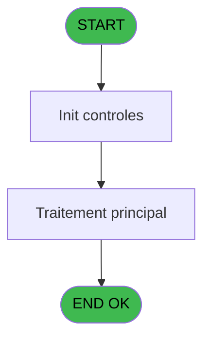

# ADH IDE 78 - Print Ventes Club Med Pass

> **Analyse**: Phases 1-4 2026-02-07 03:45 -> 02:15 (22h29min) | Assemblage 02:15
> **Pipeline**: V7.2 Enrichi
> **Structure**: 4 onglets (Resume | Ecrans | Donnees | Connexions)

<!-- TAB:Resume -->

## 1. FICHE D'IDENTITE

| Attribut | Valeur |
|----------|--------|
| Projet | ADH |
| IDE Position | 78 |
| Nom Programme | Print Ventes Club Med Pass |
| Fichier source | `Prg_78.xml` |
| Dossier IDE | Ventes |
| Taches | 14 (1 ecrans visibles) |
| Tables modifiees | 0 |
| Programmes appeles | 1 |
| Complexite | **BASSE** (score 12/100) |

## 2. DESCRIPTION FONCTIONNELLE

ADH IDE 78 gère l'édition et l'impression des ventes Club Med Pass depuis le menu spécialisé (IDE 77). Le programme récupère les paramètres de vente (société, compte, filiale) et les totaux du ticket dans deux tables de configuration (`transac_entete_bar` et `cc_total`), puis sélectionne dynamiquement l'une des 5 imprimantes disponibles basée sur le paramètre système `CURRENTPRINTERNUM`. Après affichage de l'écran d'impression avec les montants TTC, paiements payants et crédits de consommation débités, il appelle systématiquement le programme IDE 182 (Raz Current Printer) pour réinitialiser proprement l'imprimante.

La structure est composée de 14 tâches organisées en trois blocs : un bloc d'impression avec 6 variantes d'écran selon l'imprimante, un bloc d'initialisation réutilisable, et un bloc de saisie regroupant 7 écrans de détails de transactions. Complexité très basse (zéro logique métier, aucune écriture base, aucun code mort) — le programme est purement déclaratif, servant uniquement d'orchestrateur entre le menu IDE 77 et la couche d'impression.

Le couplage est étroit avec IDE 77 qui constitue l'unique point d'entrée ; IDE 78 n'existe que pour ce flux spécialisé Club Med Pass. La cascade d'appel garantie vers IDE 182 en fin assure un nettoyage d'état imprimante fiable après chaque impression, évitant les accumulations d'état ou les artefacts d'impression.

## 3. BLOCS FONCTIONNELS

### 3.1 Impression (6 taches)

Generation des documents et tickets.

---

#### 78 - Print [[ECRAN]](#ecran-t1)

**Role** : Tache d'orchestration : point d'entree du programme (6 sous-taches). Coordonne l'enchainement des traitements.
**Ecran** : 426 x 57 DLU (MDI) | [Voir mockup](#ecran-t1)

5 sous-taches directes

| Tache | Nom | Bloc |
|-------|-----|------|
| [78.2](#t3) | Printer 1 **[[ECRAN]](#ecran-t3)** | Impression |
| [78.3](#t6) | Printer 4 **[[ECRAN]](#ecran-t6)** | Impression |
| [78.4](#t9) | Printer 6 **[[ECRAN]](#ecran-t9)** | Impression |
| [78.5](#t11) | Printer 8 **[[ECRAN]](#ecran-t11)** | Impression |
| [78.6](#t13) | Printer 9 **[[ECRAN]](#ecran-t13)** | Impression |

**Variables liees** : EV (v.PrinterName)
**Delegue a** : [Raz Current Printer (IDE 182)](ADH-IDE-182.md)

---

#### 78.2 - Printer 1 [[ECRAN]](#ecran-t3)

**Role** : Generation du document : Printer 1.
**Ecran** : 434 x 62 DLU (MDI) | [Voir mockup](#ecran-t3)
**Variables liees** : EV (v.PrinterName)
**Delegue a** : [Raz Current Printer (IDE 182)](ADH-IDE-182.md)

---

#### 78.3 - Printer 4 [[ECRAN]](#ecran-t6)

**Role** : Generation du document : Printer 4.
**Ecran** : 434 x 62 DLU (MDI) | [Voir mockup](#ecran-t6)
**Variables liees** : EV (v.PrinterName)
**Delegue a** : [Raz Current Printer (IDE 182)](ADH-IDE-182.md)

---

#### 78.4 - Printer 6 [[ECRAN]](#ecran-t9)

**Role** : Generation du document : Printer 6.
**Ecran** : 434 x 62 DLU (MDI) | [Voir mockup](#ecran-t9)
**Variables liees** : EV (v.PrinterName)
**Delegue a** : [Raz Current Printer (IDE 182)](ADH-IDE-182.md)

---

#### 78.5 - Printer 8 [[ECRAN]](#ecran-t11)

**Role** : Generation du document : Printer 8.
**Ecran** : 434 x 62 DLU (MDI) | [Voir mockup](#ecran-t11)
**Variables liees** : EV (v.PrinterName)
**Delegue a** : [Raz Current Printer (IDE 182)](ADH-IDE-182.md)

---

#### 78.6 - Printer 9 [[ECRAN]](#ecran-t13)

**Role** : Generation du document : Printer 9.
**Ecran** : 434 x 62 DLU (MDI) | [Voir mockup](#ecran-t13)
**Variables liees** : EV (v.PrinterName)
**Delegue a** : [Raz Current Printer (IDE 182)](ADH-IDE-182.md)

### 3.2 Initialisation (1 tache)

Reinitialisation d'etats et variables de travail.

---

#### 78.1 - Init village [[ECRAN]](#ecran-t2)

**Role** : Reinitialisation : Init village.
**Ecran** : 274 x 204 DLU (MDI) | [Voir mockup](#ecran-t2)
**Variables liees** : ES (v.nom village), EX (v.RowInitial)

### 3.3 Saisie (7 taches)

L'operateur saisit les donnees de la transaction via 7 ecrans (Transactions details, Transactions details, Transactions details, Transactions details, Transactions details, Transactions details, Transactions details).

---

#### 78.2.1 - Transactions details [[ECRAN]](#ecran-t4)

**Role** : Saisie des donnees : Transactions details.
**Ecran** : 434 x 62 DLU (MDI) | [Voir mockup](#ecran-t4)

---

#### 78.2.2 - Transactions details [[ECRAN]](#ecran-t5)

**Role** : Saisie des donnees : Transactions details.
**Ecran** : 434 x 62 DLU (MDI) | [Voir mockup](#ecran-t5)

---

#### 78.3.1 - Transactions details [[ECRAN]](#ecran-t7)

**Role** : Saisie des donnees : Transactions details.
**Ecran** : 434 x 62 DLU (MDI) | [Voir mockup](#ecran-t7)

---

#### 78.3.2 - Transactions details [[ECRAN]](#ecran-t8)

**Role** : Saisie des donnees : Transactions details.
**Ecran** : 434 x 62 DLU (MDI) | [Voir mockup](#ecran-t8)

---

#### 78.4.1 - Transactions details [[ECRAN]](#ecran-t10)

**Role** : Saisie des donnees : Transactions details.
**Ecran** : 434 x 62 DLU (MDI) | [Voir mockup](#ecran-t10)

---

#### 78.5.1 - Transactions details [[ECRAN]](#ecran-t12)

**Role** : Saisie des donnees : Transactions details.
**Ecran** : 434 x 62 DLU (MDI) | [Voir mockup](#ecran-t12)

---

#### 78.6.1 - Transactions details [[ECRAN]](#ecran-t14)

**Role** : Saisie des donnees : Transactions details.
**Ecran** : 434 x 62 DLU (MDI) | [Voir mockup](#ecran-t14)

## 5. REGLES METIER

5 regles identifiees:

### Impression (5 regles)

#### [RM-001] Verification que l'imprimante courante est la n1

| Element | Detail |
|---------|--------|
| **Condition** | `GetParam ('CURRENTPRINTERNUM')=1` |
| **Si vrai** | Action si CURRENTPRINTERNUM = 1 |
| **Expression source** | Expression 3 : `GetParam ('CURRENTPRINTERNUM')=1` |
| **Exemple** | Si GetParam ('CURRENTPRINTERNUM')=1 → Action si CURRENTPRINTERNUM = 1 |
| **Impact** | [78 - Print](#t1) |

#### [RM-002] Verification que l'imprimante courante est la n4

| Element | Detail |
|---------|--------|
| **Condition** | `GetParam ('CURRENTPRINTERNUM')=4` |
| **Si vrai** | Action si CURRENTPRINTERNUM = 4 |
| **Expression source** | Expression 4 : `GetParam ('CURRENTPRINTERNUM')=4` |
| **Exemple** | Si GetParam ('CURRENTPRINTERNUM')=4 → Action si CURRENTPRINTERNUM = 4 |
| **Impact** | [78 - Print](#t1) |

#### [RM-003] Verification que l'imprimante courante est la n6

| Element | Detail |
|---------|--------|
| **Condition** | `GetParam ('CURRENTPRINTERNUM')=6` |
| **Si vrai** | Action si CURRENTPRINTERNUM = 6 |
| **Expression source** | Expression 5 : `GetParam ('CURRENTPRINTERNUM')=6` |
| **Exemple** | Si GetParam ('CURRENTPRINTERNUM')=6 → Action si CURRENTPRINTERNUM = 6 |
| **Impact** | [78 - Print](#t1) |

#### [RM-004] Verification que l'imprimante courante est la n8

| Element | Detail |
|---------|--------|
| **Condition** | `GetParam ('CURRENTPRINTERNUM')=8` |
| **Si vrai** | Action si CURRENTPRINTERNUM = 8 |
| **Expression source** | Expression 6 : `GetParam ('CURRENTPRINTERNUM')=8` |
| **Exemple** | Si GetParam ('CURRENTPRINTERNUM')=8 → Action si CURRENTPRINTERNUM = 8 |
| **Impact** | [78 - Print](#t1) |

#### [RM-005] Verification que l'imprimante courante est la n9

| Element | Detail |
|---------|--------|
| **Condition** | `GetParam ('CURRENTPRINTERNUM')=9` |
| **Si vrai** | Action si CURRENTPRINTERNUM = 9 |
| **Expression source** | Expression 7 : `GetParam ('CURRENTPRINTERNUM')=9` |
| **Exemple** | Si GetParam ('CURRENTPRINTERNUM')=9 → Action si CURRENTPRINTERNUM = 9 |
| **Impact** | [78 - Print](#t1) |

## 6. CONTEXTE

- **Appele par**: [Club Med Pass menu (IDE 77)](ADH-IDE-77.md)
- **Appelle**: 1 programmes | **Tables**: 4 (W:0 R:2 L:2) | **Taches**: 14 | **Expressions**: 8

<!-- TAB:Ecrans -->

## 8. ECRANS

### 8.1 Forms visibles (1 / 14)

| # | Position | Tache | Nom | Type | Largeur | Hauteur | Bloc |
|---|----------|-------|-----|------|---------|---------|------|
| 1 | 78 | 78 | Print | MDI | 426 | 57 | Impression |

### 8.2 Mockups Ecrans

---

#### 78 - Print
**Tache** : [78](#t1) | **Type** : MDI | **Dimensions** : 426 x 57 DLU
**Bloc** : Impression | **Titre IDE** : Print

<!-- FORM-DATA:
{
    "width":  426,
    "vFactor":  8,
    "type":  "MDI",
    "hFactor":  8,
    "controls":  [
                     {
                         "x":  2,
                         "type":  "label",
                         "var":  "",
                         "y":  0,
                         "w":  423,
                         "fmt":  "",
                         "name":  "",
                         "h":  29,
                         "color":  "",
                         "text":  "",
                         "parent":  null
                     },
                     {
                         "x":  122,
                         "type":  "label",
                         "var":  "",
                         "y":  10,
                         "w":  256,
                         "fmt":  "",
                         "name":  "",
                         "h":  8,
                         "color":  "142",
                         "text":  "Impression en cours ...",
                         "parent":  null
                     },
                     {
                         "x":  2,
                         "type":  "label",
                         "var":  "",
                         "y":  29,
                         "w":  423,
                         "fmt":  "",
                         "name":  "",
                         "h":  27,
                         "color":  "",
                         "text":  "",
                         "parent":  null
                     },
                     {
                         "x":  29,
                         "type":  "label",
                         "var":  "",
                         "y":  38,
                         "w":  375,
                         "fmt":  "",
                         "name":  "",
                         "h":  8,
                         "color":  "",
                         "text":  "Transactions Club Med Pass",
                         "parent":  null
                     },
                     {
                         "x":  6,
                         "type":  "image",
                         "var":  "",
                         "y":  2,
                         "w":  72,
                         "fmt":  "",
                         "name":  "",
                         "h":  25,
                         "color":  "",
                         "text":  "",
                         "parent":  null
                     }
                 ],
    "taskId":  "78",
    "height":  57
}
-->

## 9. NAVIGATION

Ecran unique: **Print**

### 9.3 Structure hierarchique (14 taches)

| Position | Tache | Type | Dimensions | Bloc |
|----------|-------|------|------------|------|
| **78.1** | [**Print** (78)](#t1) [mockup](#ecran-t1) | MDI | 426x57 | Impression |
| 78.1.1 | [Printer 1 (78.2)](#t3) [mockup](#ecran-t3) | MDI | 434x62 | |
| 78.1.2 | [Printer 4 (78.3)](#t6) [mockup](#ecran-t6) | MDI | 434x62 | |
| 78.1.3 | [Printer 6 (78.4)](#t9) [mockup](#ecran-t9) | MDI | 434x62 | |
| 78.1.4 | [Printer 8 (78.5)](#t11) [mockup](#ecran-t11) | MDI | 434x62 | |
| 78.1.5 | [Printer 9 (78.6)](#t13) [mockup](#ecran-t13) | MDI | 434x62 | |
| **78.2** | [**Init village** (78.1)](#t2) [mockup](#ecran-t2) | MDI | 274x204 | Initialisation |
| **78.3** | [**Transactions details** (78.2.1)](#t4) [mockup](#ecran-t4) | MDI | 434x62 | Saisie |
| 78.3.1 | [Transactions details (78.2.2)](#t5) [mockup](#ecran-t5) | MDI | 434x62 | |
| 78.3.2 | [Transactions details (78.3.1)](#t7) [mockup](#ecran-t7) | MDI | 434x62 | |
| 78.3.3 | [Transactions details (78.3.2)](#t8) [mockup](#ecran-t8) | MDI | 434x62 | |
| 78.3.4 | [Transactions details (78.4.1)](#t10) [mockup](#ecran-t10) | MDI | 434x62 | |
| 78.3.5 | [Transactions details (78.5.1)](#t12) [mockup](#ecran-t12) | MDI | 434x62 | |
| 78.3.6 | [Transactions details (78.6.1)](#t14) [mockup](#ecran-t14) | MDI | 434x62 | |

### 9.4 Algorigramme

> **Legende**: Vert = START/END OK | Rouge = END KO | Bleu = Decisions
> *Algorigramme auto-genere. Utiliser `/algorigramme` pour une synthese metier detaillee.*

<!-- TAB:Donnees -->

## 10. TABLES

### Tables utilisees (4)

| ID | Nom | Description | Type | R | W | L | Usages |
|----|-----|-------------|------|---|---|---|--------|
| 31 | gm-complet_______gmc |  | DB | R |   |   | 7 |
| 69 | initialisation___ini |  | DB | R |   |   | 1 |
| 15 | transac_entete_bar |  | DB |   |   | L | 7 |
| 271 | cc_total |  | DB |   |   | L | 7 |

### Colonnes par table (2 / 2 tables avec colonnes identifiees)

Table 31 - gm-complet_______gmc (R) - 7 usages

| Lettre | Variable | Acces | Type |
|--------|----------|-------|------|
| A | v.total ticket | R | Numeric |
| B | v.total payant | R | Numeric |
| C | v.total credit conso | R | Numeric |

Table 69 - initialisation___ini (R) - 1 usages

*Table utilisee uniquement en Link ou aucune colonne Real identifiee dans le DataView.*

## 11. VARIABLES

### 11.1 Parametres entrants (5)

Variables recues du programme appelant ([Club Med Pass menu (IDE 77)](ADH-IDE-77.md)).

| Lettre | Nom | Type | Usage dans |
|--------|-----|------|-----------|
| EN | P0 Societe | Alpha | - |
| EO | P0 compte | Numeric | - |
| EP | P0 filiation | Numeric | - |
| EQ | P0 masque montant | Alpha | - |
| ER | P0 action | Alpha | - |

### 11.2 Variables de session (6)

Variables persistantes pendant toute la session.

| Lettre | Nom | Type | Usage dans |
|--------|-----|------|-----------|
| ES | v.nom village | Alpha | - |
| ET | v.masque-mtt | Alpha | - |
| EU | v.code-devise | Alpha | - |
| EV | v.PrinterName | Alpha | - |
| EW | v.ChangeRowTo999 | Logical | - |
| EX | v.RowInitial | Alpha | - |

## 12. EXPRESSIONS

**8 / 8 expressions decodees (100%)**

### 12.1 Repartition par type

| Type | Expressions | Regles |
|------|-------------|--------|
| CONDITION | 5 | 5 |
| OTHER | 2 | 0 |
| CAST_LOGIQUE | 1 | 0 |

### 12.2 Expressions cles par type

#### CONDITION (5 expressions)

| Type | IDE | Expression | Regle |
|------|-----|------------|-------|
| CONDITION | 6 | `GetParam ('CURRENTPRINTERNUM')=8` | [RM-004](#rm-RM-004) |
| CONDITION | 7 | `GetParam ('CURRENTPRINTERNUM')=9` | [RM-005](#rm-RM-005) |
| CONDITION | 5 | `GetParam ('CURRENTPRINTERNUM')=6` | [RM-003](#rm-RM-003) |
| CONDITION | 3 | `GetParam ('CURRENTPRINTERNUM')=1` | [RM-001](#rm-RM-001) |
| CONDITION | 4 | `GetParam ('CURRENTPRINTERNUM')=4` | [RM-002](#rm-RM-002) |

#### OTHER (2 expressions)

| Type | IDE | Expression | Regle |
|------|-----|------------|-------|
| OTHER | 2 | `SetCrsr (1)` | - |
| OTHER | 1 | `SetCrsr (2)` | - |

#### CAST_LOGIQUE (1 expressions)

| Type | IDE | Expression | Regle |
|------|-----|------------|-------|
| CAST_LOGIQUE | 8 | `'TRUE'LOG` | - |

<!-- TAB:Connexions -->

## 13. GRAPHE D'APPELS

### 13.1 Chaine depuis Main (Callers)

Main -> ... -> [Club Med Pass menu (IDE 77)](ADH-IDE-77.md) -> **Print Ventes Club Med Pass (IDE 78)**

### 13.2 Callers

| IDE | Nom Programme | Nb Appels |
|-----|---------------|-----------|
| [77](ADH-IDE-77.md) | Club Med Pass menu | 1 |

### 13.3 Callees (programmes appeles)

### 13.4 Detail Callees avec contexte

| IDE | Nom Programme | Appels | Contexte |
|-----|---------------|--------|----------|
| [182](ADH-IDE-182.md) | Raz Current Printer | 1 | Impression ticket/document |

## 14. RECOMMANDATIONS MIGRATION

### 14.1 Profil du programme

| Metrique | Valeur | Impact migration |
|----------|--------|-----------------|
| Lignes de logique | 330 | Taille moyenne |
| Expressions | 8 | Peu de logique |
| Tables WRITE | 0 | Impact faible |
| Sous-programmes | 1 | Peu de dependances |
| Ecrans visibles | 1 | Ecran unique ou traitement batch |
| Code desactive | 0% (0 / 330) | Code sain |
| Regles metier | 5 | Quelques regles a preserver |

### 14.2 Plan de migration par bloc

#### Impression (6 taches: 6 ecrans, 0 traitement)

- **Strategie** : Templates HTML -> PDF via wkhtmltopdf ou Puppeteer.
- `PrintService` injectable avec choix imprimante

#### Initialisation (1 tache: 1 ecran, 0 traitement)

- **Strategie** : Constructeur/methode `InitAsync()` dans l'orchestrateur.

#### Saisie (7 taches: 7 ecrans, 0 traitement)

- **Strategie** : Formulaire React/Blazor avec validation Zod/FluentValidation.
- Reproduire 7 ecrans : Transactions details, Transactions details, Transactions details, Transactions details, Transactions details, Transactions details, Transactions details
- Validation temps reel cote client + serveur

### 14.3 Dependances critiques

| Dependance | Type | Appels | Impact |
|------------|------|--------|--------|
| [Raz Current Printer (IDE 182)](ADH-IDE-182.md) | Sous-programme | 1x | Normale - Impression ticket/document |

---
*Spec DETAILED generee par Pipeline V7.2 - 2026-02-08 02:16*
