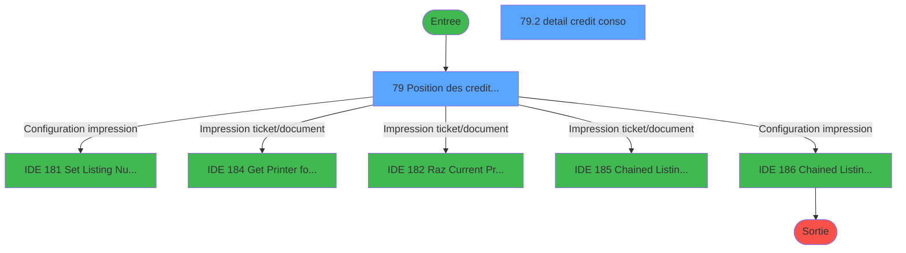
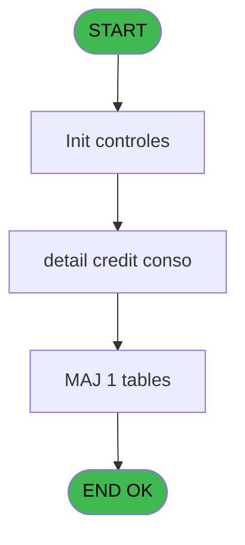
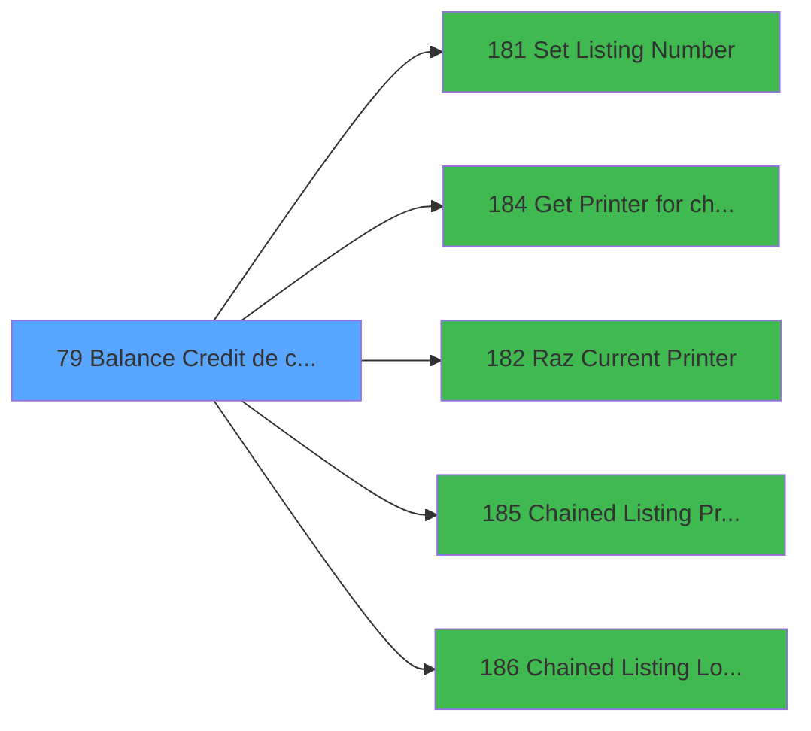

# ADH IDE 79 - Balance Credit de conso

> **Analyse**: Phases 1-4 2026-02-07 03:45 -> 02:16 (22h31min) | Assemblage 02:16
> **Pipeline**: V7.2 Enrichi
> **Structure**: 4 onglets (Resume | Ecrans | Donnees | Connexions)

<!-- TAB:Resume -->

## 1. FICHE D'IDENTITE

| Attribut | Valeur |
|----------|--------|
| Projet | ADH |
| IDE Position | 79 |
| Nom Programme | Balance Credit de conso |
| Fichier source | `Prg_79.xml` |
| Dossier IDE | General |
| Taches | 30 (2 ecrans visibles) |
| Tables modifiees | 1 |
| Programmes appeles | 5 |
| Complexite | **BASSE** (score 25/100) |

## 2. DESCRIPTION FONCTIONNELLE

ADH IDE 79 gère l'affichage du solde des crédits de consommation (balance) pour un compte client. Le programme récupère les informations de crédit depuis la table `cc_total_par_type` et les organise pour présentation. Il initialise d'abord les paramètres d'affichage liés au village client, puis charge les détails de chaque ligne de crédit de consommation avec le solde correspondant.

Le programme utilise intensivement le système d'impression chaîné (Chained Listing) pour formater et imprimer l'état des crédits. Il configure les paramètres d'impression via les IDE 181-186 : positionnement des éléments visuels, sélection de l'imprimante, et application des mises en page par défaut. Cette architecture modulaire permet de réutiliser les composants d'impression dans d'autres contextes (extraits de compte, factures).

ADH IDE 79 est appelé depuis deux contextes principaux : la vérification de garanties sur un compte (via IDE 0) et le menu Club Med Pass (IDE 77), ce qui suggère qu'il s'agit d'un utilitaire d'affichage de solde intégré à plusieurs workflows de gestion de compte. Le programme ne modifie que la table de totaux par type, gardant une responsabilité claire : présenter l'état des crédits sans modifier les données sous-jacentes.

## 3. BLOCS FONCTIONNELS

### 3.1 Traitement (5 taches)

Traitements internes.

---

#### 79 - Position des credits bar [[ECRAN]](#ecran-t1)

**Role** : Calcul fidelite/avantage : Position des credits bar.
**Ecran** : 728 x 276 DLU (MDI) | [Voir mockup](#ecran-t1)

4 sous-taches directes

| Tache | Nom | Bloc |
|-------|-----|------|
| [79.2](#t3) | detail credit conso **[[ECRAN]](#ecran-t3)** | Traitement |
| [79.3](#t4) | GLOBAL **[[ECRAN]](#ecran-t4)** | Traitement |
| [79.4](#t17) | DETAIL **[[ECRAN]](#ecran-t17)** | Traitement |
| [79.5](#t30) | get solde | Traitement |

**Delegue a** : [Set Listing Number (IDE 181)](ADH-IDE-181.md), [Chained Listing Load Default (IDE 186)](ADH-IDE-186.md)

---

#### 79.2 - detail credit conso [[ECRAN]](#ecran-t3)

**Role** : Calcul fidelite/avantage : detail credit conso.
**Ecran** : 349 x 81 DLU (Modal) | [Voir mockup](#ecran-t3)
**Variables liees** : ER (v.solde_credit_conso), EV (v.detail), EW (bt.detail)
**Delegue a** : [Set Listing Number (IDE 181)](ADH-IDE-181.md), [Chained Listing Load Default (IDE 186)](ADH-IDE-186.md)

---

#### 79.3 - GLOBAL [[ECRAN]](#ecran-t4)

**Role** : Traitement : GLOBAL.
**Ecran** : 1058 x 791 DLU (MDI) | [Voir mockup](#ecran-t4)
**Delegue a** : [Set Listing Number (IDE 181)](ADH-IDE-181.md), [Chained Listing Load Default (IDE 186)](ADH-IDE-186.md)

---

#### 79.4 - DETAIL [[ECRAN]](#ecran-t17)

**Role** : Traitement : DETAIL.
**Ecran** : 213 x 45 DLU (MDI) | [Voir mockup](#ecran-t17)
**Variables liees** : EV (v.detail), EW (bt.detail)
**Delegue a** : [Set Listing Number (IDE 181)](ADH-IDE-181.md), [Chained Listing Load Default (IDE 186)](ADH-IDE-186.md)

---

#### 79.5 - get solde

**Role** : Consultation/chargement : get solde.
**Variables liees** : ER (v.solde_credit_conso)
**Delegue a** : [Set Listing Number (IDE 181)](ADH-IDE-181.md), [Chained Listing Load Default (IDE 186)](ADH-IDE-186.md)

### 3.2 Initialisation (1 tache)

Reinitialisation d'etats et variables de travail.

---

#### 79.1 - Init village [[ECRAN]](#ecran-t2)

**Role** : Reinitialisation : Init village.
**Ecran** : 274 x 204 DLU (MDI) | [Voir mockup](#ecran-t2)
**Variables liees** : ES (v.nom village)

### 3.3 Impression (22 taches)

Generation des documents et tickets.

---

#### 79.3.1 - Printer 1 [[ECRAN]](#ecran-t5)

**Role** : Generation du document : Printer 1.
**Ecran** : 1058 x 791 DLU (MDI) | [Voir mockup](#ecran-t5)

---

#### 79.3.1.1 - edition extrait compte [[ECRAN]](#ecran-t6)

**Role** : Generation du document : edition extrait compte.
**Ecran** : 1058 x 791 DLU (MDI) | [Voir mockup](#ecran-t6)

---

#### 79.3.1.2 - edition extrait compte [[ECRAN]](#ecran-t7)

**Role** : Generation du document : edition extrait compte.
**Ecran** : 1058 x 791 DLU (MDI) | [Voir mockup](#ecran-t7)

---

#### 79.3.2 - Printer 4 [[ECRAN]](#ecran-t8)

**Role** : Generation du document : Printer 4.
**Ecran** : 1058 x 791 DLU (MDI) | [Voir mockup](#ecran-t8)

---

#### 79.3.2.1 - edition extrait compte [[ECRAN]](#ecran-t9)

**Role** : Generation du document : edition extrait compte.
**Ecran** : 1058 x 791 DLU (MDI) | [Voir mockup](#ecran-t9)

---

#### 79.3.2.2 - edition extrait compte [[ECRAN]](#ecran-t10)

**Role** : Generation du document : edition extrait compte.
**Ecran** : 1058 x 791 DLU (MDI) | [Voir mockup](#ecran-t10)

---

#### 79.3.3 - Printer 6 [[ECRAN]](#ecran-t11)

**Role** : Generation du document : Printer 6.
**Ecran** : 213 x 45 DLU (MDI) | [Voir mockup](#ecran-t11)

---

#### 79.3.4 - Printer 8 [[ECRAN]](#ecran-t13)

**Role** : Generation du document : Printer 8.
**Ecran** : 1058 x 791 DLU (MDI) | [Voir mockup](#ecran-t13)

---

#### 79.3.4.1 - edition extrait compte [[ECRAN]](#ecran-t14)

**Role** : Generation du document : edition extrait compte.
**Ecran** : 1058 x 791 DLU (MDI) | [Voir mockup](#ecran-t14)

---

#### 79.3.5 - Printer 9 [[ECRAN]](#ecran-t15)

**Role** : Generation du document : Printer 9.
**Ecran** : 1058 x 791 DLU (MDI) | [Voir mockup](#ecran-t15)

---

#### 79.3.5.1 - edition extrait compte [[ECRAN]](#ecran-t16)

**Role** : Generation du document : edition extrait compte.
**Ecran** : 1058 x 791 DLU (MDI) | [Voir mockup](#ecran-t16)

---

#### 79.4.1 - Printer 1 [[ECRAN]](#ecran-t18)

**Role** : Generation du document : Printer 1.
**Ecran** : 1058 x 791 DLU (MDI) | [Voir mockup](#ecran-t18)

---

#### 79.4.1.1 - edition extrait compte [[ECRAN]](#ecran-t19)

**Role** : Generation du document : edition extrait compte.
**Ecran** : 1058 x 791 DLU (MDI) | [Voir mockup](#ecran-t19)

---

#### 79.4.1.2 - edition extrait compte [[ECRAN]](#ecran-t20)

**Role** : Generation du document : edition extrait compte.
**Ecran** : 1058 x 791 DLU (MDI) | [Voir mockup](#ecran-t20)

---

#### 79.4.2 - Printer 4 [[ECRAN]](#ecran-t21)

**Role** : Generation du document : Printer 4.
**Ecran** : 1058 x 791 DLU (MDI) | [Voir mockup](#ecran-t21)

---

#### 79.4.2.1 - edition extrait compte [[ECRAN]](#ecran-t22)

**Role** : Generation du document : edition extrait compte.
**Ecran** : 1058 x 791 DLU (MDI) | [Voir mockup](#ecran-t22)

---

#### 79.4.2.2 - edition extrait compte [[ECRAN]](#ecran-t23)

**Role** : Generation du document : edition extrait compte.
**Ecran** : 1058 x 791 DLU (MDI) | [Voir mockup](#ecran-t23)

---

#### 79.4.3 - Printer 6 [[ECRAN]](#ecran-t24)

**Role** : Generation du document : Printer 6.
**Ecran** : 213 x 45 DLU (MDI) | [Voir mockup](#ecran-t24)

---

#### 79.4.4 - Printer 8 [[ECRAN]](#ecran-t26)

**Role** : Generation du document : Printer 8.
**Ecran** : 1058 x 791 DLU (MDI) | [Voir mockup](#ecran-t26)

---

#### 79.4.4.1 - edition extrait compte [[ECRAN]](#ecran-t27)

**Role** : Generation du document : edition extrait compte.
**Ecran** : 1058 x 791 DLU (MDI) | [Voir mockup](#ecran-t27)

---

#### 79.4.5 - Printer 9 [[ECRAN]](#ecran-t28)

**Role** : Generation du document : Printer 9.
**Ecran** : 1058 x 791 DLU (MDI) | [Voir mockup](#ecran-t28)

---

#### 79.4.5.1 - edition extrait compte [[ECRAN]](#ecran-t29)

**Role** : Generation du document : edition extrait compte.
**Ecran** : 1058 x 791 DLU (MDI) | [Voir mockup](#ecran-t29)

### 3.4 Saisie (2 taches)

L'operateur saisit les donnees de la transaction via 2 ecrans (Transactions details, Transactions details).

---

#### 79.3.3.1 - Transactions details [[ECRAN]](#ecran-t12)

**Role** : Saisie des donnees : Transactions details.
**Ecran** : 213 x 45 DLU (MDI) | [Voir mockup](#ecran-t12)

---

#### 79.4.3.1 - Transactions details [[ECRAN]](#ecran-t25)

**Role** : Saisie des donnees : Transactions details.
**Ecran** : 213 x 45 DLU (MDI) | [Voir mockup](#ecran-t25)

## 5. REGLES METIER

4 regles identifiees:

### Impression (2 regles)

#### [RM-001] Condition: LastClicked () egale 'PRINT'

| Element | Detail |
|---------|--------|
| **Condition** | `LastClicked ()='PRINT'` |
| **Si vrai** | Action si vrai |
| **Expression source** | Expression 1 : `LastClicked ()='PRINT'` |
| **Exemple** | Si LastClicked ()='PRINT' → Action si vrai |
| **Impact** | Bloc Impression |

#### [RM-002] Condition: LastClicked () egale 'PRINTDETAIL'

| Element | Detail |
|---------|--------|
| **Condition** | `LastClicked ()='PRINTDETAIL'` |
| **Si vrai** | Action si vrai |
| **Expression source** | Expression 2 : `LastClicked ()='PRINTDETAIL'` |
| **Exemple** | Si LastClicked ()='PRINTDETAIL' → Action si vrai |
| **Impact** | [79.2 - detail credit conso](#t3) |

### Autres (2 regles)

#### [RM-003] Si [X] alors 'Quit Detail' sinon 'Detail')

| Element | Detail |
|---------|--------|
| **Condition** | `[X]` |
| **Si vrai** | 'Quit Detail' |
| **Si faux** | 'Detail') |
| **Expression source** | Expression 14 : `IF ([X],'Quit Detail','Detail')` |
| **Exemple** | Si [X] → 'Quit Detail'. Sinon → 'Detail') |
| **Impact** | [79.2 - detail credit conso](#t3) |

#### [RM-004] Negation de ([X]) (condition inversee)

| Element | Detail |
|---------|--------|
| **Condition** | `NOT ([X])` |
| **Si vrai** | Action si vrai |
| **Expression source** | Expression 15 : `NOT ([X])` |
| **Exemple** | Si NOT ([X]) → Action si vrai |

## 6. CONTEXTE

- **Appele par**: [Garantie sur compte PMS-584 (IDE 0)](ADH-IDE-0.md), [Club Med Pass menu (IDE 77)](ADH-IDE-77.md)
- **Appelle**: 5 programmes | **Tables**: 6 (W:1 R:3 L:4) | **Taches**: 30 | **Expressions**: 23

<!-- TAB:Ecrans -->

## 8. ECRANS

### 8.1 Forms visibles (2 / 30)

| # | Position | Tache | Nom | Type | Largeur | Hauteur | Bloc |
|---|----------|-------|-----|------|---------|---------|------|
| 1 | 79 | 79 | Position des credits bar | MDI | 728 | 276 | Traitement |
| 2 | 79.2 | 79.2 | detail credit conso | Modal | 349 | 81 | Traitement |

### 8.2 Mockups Ecrans

---

#### 79 - Position des credits bar
**Tache** : [79](#t1) | **Type** : MDI | **Dimensions** : 728 x 276 DLU
**Bloc** : Traitement | **Titre IDE** : Position des credits bar

<!-- FORM-DATA:
{
    "width":  728,
    "vFactor":  8,
    "type":  "MDI",
    "hFactor":  8,
    "controls":  [
                     {
                         "x":  15,
                         "type":  "label",
                         "var":  "",
                         "y":  0,
                         "w":  699,
                         "fmt":  "",
                         "name":  "",
                         "h":  21,
                         "color":  "",
                         "text":  "",
                         "parent":  null
                     },
                     {
                         "x":  271,
                         "type":  "label",
                         "var":  "",
                         "y":  139,
                         "w":  151,
                         "fmt":  "",
                         "name":  "",
                         "h":  13,
                         "color":  "",
                         "text":  "Total",
                         "parent":  null
                     },
                     {
                         "x":  15,
                         "type":  "label",
                         "var":  "",
                         "y":  158,
                         "w":  699,
                         "fmt":  "",
                         "name":  "",
                         "h":  21,
                         "color":  "",
                         "text":  "",
                         "parent":  null
                     },
                     {
                         "x":  57,
                         "type":  "table",
                         "var":  "",
                         "name":  "",
                         "titleH":  12,
                         "color":  "6",
                         "w":  614,
                         "y":  43,
                         "fmt":  "",
                         "parent":  null,
                         "text":  "",
                         "rowH":  12,
                         "h":  90,
                         "cols":  [
                                      {
                                          "title":  "Type de crédit",
                                          "layer":  1,
                                          "w":  294
                                      },
                                      {
                                          "title":  "Total",
                                          "layer":  2,
                                          "w":  289
                                      }
                                  ],
                         "rows":  2
                     },
                     {
                         "x":  50,
                         "type":  "edit",
                         "var":  "",
                         "y":  27,
                         "w":  296,
                         "fmt":  "",
                         "name":  "",
                         "h":  12,
                         "color":  "",
                         "text":  "",
                         "parent":  null
                     },
                     {
                         "x":  270,
                         "type":  "edit",
                         "var":  "",
                         "y":  28,
                         "w":  42,
                         "fmt":  "",
                         "name":  "",
                         "h":  10,
                         "color":  "",
                         "text":  "",
                         "parent":  null
                     },
                     {
                         "x":  440,
                         "type":  "edit",
                         "var":  "",
                         "y":  58,
                         "w":  150,
                         "fmt":  "",
                         "name":  "",
                         "h":  8,
                         "color":  "6",
                         "text":  "",
                         "parent":  11
                     },
                     {
                         "x":  93,
                         "type":  "edit",
                         "var":  "",
                         "y":  58,
                         "w":  150,
                         "fmt":  "",
                         "name":  "libelle credit",
                         "h":  8,
                         "color":  "6",
                         "text":  "",
                         "parent":  11
                     },
                     {
                         "x":  430,
                         "type":  "edit",
                         "var":  "",
                         "y":  139,
                         "w":  225,
                         "fmt":  "",
                         "name":  "v.solde_credit_conso",
                         "h":  13,
                         "color":  "6",
                         "text":  "",
                         "parent":  null
                     },
                     {
                         "x":  195,
                         "type":  "button",
                         "var":  "",
                         "y":  160,
                         "w":  160,
                         "fmt":  "",
                         "name":  "DETAIL",
                         "h":  18,
                         "color":  "",
                         "text":  "",
                         "parent":  null
                     },
                     {
                         "x":  20,
                         "type":  "image",
                         "var":  "",
                         "y":  2,
                         "w":  59,
                         "fmt":  "",
                         "name":  "",
                         "h":  18,
                         "color":  "",
                         "text":  "",
                         "parent":  null
                     },
                     {
                         "x":  92,
                         "type":  "edit",
                         "var":  "",
                         "y":  6,
                         "w":  267,
                         "fmt":  "30",
                         "name":  "",
                         "h":  8,
                         "color":  "",
                         "text":  "",
                         "parent":  null
                     },
                     {
                         "x":  438,
                         "type":  "edit",
                         "var":  "",
                         "y":  7,
                         "w":  259,
                         "fmt":  "WWW DD MMM YYYYT",
                         "name":  "",
                         "h":  8,
                         "color":  "",
                         "text":  "",
                         "parent":  null
                     },
                     {
                         "x":  364,
                         "type":  "edit",
                         "var":  "",
                         "y":  27,
                         "w":  314,
                         "fmt":  "60",
                         "name":  "",
                         "h":  12,
                         "color":  "",
                         "text":  "",
                         "parent":  null
                     },
                     {
                         "x":  20,
                         "type":  "button",
                         "var":  "",
                         "y":  136,
                         "w":  160,
                         "fmt":  "Printer",
                         "name":  "",
                         "h":  18,
                         "color":  "",
                         "text":  "",
                         "parent":  null
                     },
                     {
                         "x":  545,
                         "type":  "button",
                         "var":  "",
                         "y":  160,
                         "w":  160,
                         "fmt":  "\u0026Imprimer",
                         "name":  "PRINT",
                         "h":  18,
                         "color":  "",
                         "text":  "",
                         "parent":  null
                     },
                     {
                         "x":  20,
                         "type":  "button",
                         "var":  "",
                         "y":  160,
                         "w":  160,
                         "fmt":  "Exit",
                         "name":  "",
                         "h":  18,
                         "color":  "",
                         "text":  "",
                         "parent":  null
                     },
                     {
                         "x":  370,
                         "type":  "button",
                         "var":  "",
                         "y":  160,
                         "w":  160,
                         "fmt":  "Print detail",
                         "name":  "PRINTDETAIL",
                         "h":  18,
                         "color":  "",
                         "text":  "",
                         "parent":  null
                     }
                 ],
    "taskId":  "79",
    "height":  276
}
-->

<strong>Champs : 8 champs</strong>

| Pos (x,y) | Nom | Variable | Type |
|-----------|-----|----------|------|
| 50,27 | (sans nom) | - | edit |
| 270,28 | (sans nom) | - | edit |
| 440,58 | (sans nom) | - | edit |
| 93,58 | libelle credit | - | edit |
| 430,139 | v.solde_credit_conso | - | edit |
| 92,6 | 30 | - | edit |
| 438,7 | WWW DD MMM YYYYT | - | edit |
| 364,27 | 60 | - | edit |

<strong>Boutons : 5 boutons</strong>

| Bouton | Pos (x,y) | Action |
|--------|-----------|--------|
| DETAIL | 195,160 | Affiche les details |
| Printer | 20,136 | Appel [Get Printer for chained list (IDE 184)](ADH-IDE-184.md) |
| Imprimer | 545,160 | Lance l'impression |
| Exit | 20,160 | Quitte le programme |
| Print detail | 370,160 | Appel [Get Printer for chained list (IDE 184)](ADH-IDE-184.md) |

---

#### 79.2 - detail credit conso
**Tache** : [79.2](#t3) | **Type** : Modal | **Dimensions** : 349 x 81 DLU
**Bloc** : Traitement | **Titre IDE** : detail credit conso

<!-- FORM-DATA:
{
    "width":  349,
    "vFactor":  8,
    "type":  "Modal",
    "hFactor":  4,
    "controls":  [
                     {
                         "x":  14,
                         "type":  "table",
                         "var":  "",
                         "name":  "",
                         "titleH":  12,
                         "color":  "6",
                         "w":  320,
                         "y":  0,
                         "fmt":  "",
                         "parent":  null,
                         "text":  "",
                         "rowH":  12,
                         "h":  76,
                         "cols":  [
                                      {
                                          "title":  "Montant",
                                          "layer":  1,
                                          "w":  69
                                      },
                                      {
                                          "title":  "Type de crédit",
                                          "layer":  2,
                                          "w":  102
                                      },
                                      {
                                          "title":  "Date",
                                          "layer":  3,
                                          "w":  63
                                      },
                                      {
                                          "title":  "Utilisateur",
                                          "layer":  4,
                                          "w":  68
                                      }
                                  ],
                         "rows":  4
                     },
                     {
                         "x":  18,
                         "type":  "edit",
                         "var":  "",
                         "y":  15,
                         "w":  61,
                         "fmt":  "",
                         "name":  "Montant",
                         "h":  9,
                         "color":  "6",
                         "text":  "",
                         "parent":  1
                     },
                     {
                         "x":  190,
                         "type":  "edit",
                         "var":  "",
                         "y":  15,
                         "w":  56,
                         "fmt":  "",
                         "name":  "Date operation",
                         "h":  9,
                         "color":  "6",
                         "text":  "",
                         "parent":  1
                     },
                     {
                         "x":  251,
                         "type":  "edit",
                         "var":  "",
                         "y":  15,
                         "w":  63,
                         "fmt":  "",
                         "name":  "user",
                         "h":  9,
                         "color":  "6",
                         "text":  "",
                         "parent":  1
                     },
                     {
                         "x":  87,
                         "type":  "edit",
                         "var":  "",
                         "y":  15,
                         "w":  94,
                         "fmt":  "",
                         "name":  "",
                         "h":  9,
                         "color":  "6",
                         "text":  "",
                         "parent":  1
                     }
                 ],
    "taskId":  "79.2",
    "height":  81
}
-->

<strong>Champs : 4 champs</strong>

| Pos (x,y) | Nom | Variable | Type |
|-----------|-----|----------|------|
| 18,15 | Montant | - | edit |
| 190,15 | Date operation | - | edit |
| 251,15 | user | - | edit |
| 87,15 | (sans nom) | - | edit |

## 9. NAVIGATION

### 9.1 Enchainement des ecrans

**Detail par enchainement :**

| Depuis | Action | Vers | Retour |
|--------|--------|------|--------|
| Position des credits bar | Configuration impression | [Set Listing Number (IDE 181)](ADH-IDE-181.md) | Retour ecran |
| Position des credits bar | Impression ticket/document | [Get Printer for chained list (IDE 184)](ADH-IDE-184.md) | Retour ecran |
| Position des credits bar | Impression ticket/document | [Raz Current Printer (IDE 182)](ADH-IDE-182.md) | Retour ecran |
| Position des credits bar | Impression ticket/document | [Chained Listing Printer Choice (IDE 185)](ADH-IDE-185.md) | Retour ecran |
| Position des credits bar | Configuration impression | [Chained Listing Load Default (IDE 186)](ADH-IDE-186.md) | Retour ecran |

### 9.3 Structure hierarchique (30 taches)

| Position | Tache | Type | Dimensions | Bloc |
|----------|-------|------|------------|------|
| **79.1** | [**Position des credits bar** (79)](#t1) [mockup](#ecran-t1) | MDI | 728x276 | Traitement |
| 79.1.1 | [detail credit conso (79.2)](#t3) [mockup](#ecran-t3) | Modal | 349x81 | |
| 79.1.2 | [GLOBAL (79.3)](#t4) [mockup](#ecran-t4) | MDI | 1058x791 | |
| 79.1.3 | [DETAIL (79.4)](#t17) [mockup](#ecran-t17) | MDI | 213x45 | |
| 79.1.4 | [get solde (79.5)](#t30) | - | - | |
| **79.2** | [**Init village** (79.1)](#t2) [mockup](#ecran-t2) | MDI | 274x204 | Initialisation |
| **79.3** | [**Printer 1** (79.3.1)](#t5) [mockup](#ecran-t5) | MDI | 1058x791 | Impression |
| 79.3.1 | [edition extrait compte (79.3.1.1)](#t6) [mockup](#ecran-t6) | MDI | 1058x791 | |
| 79.3.2 | [edition extrait compte (79.3.1.2)](#t7) [mockup](#ecran-t7) | MDI | 1058x791 | |
| 79.3.3 | [Printer 4 (79.3.2)](#t8) [mockup](#ecran-t8) | MDI | 1058x791 | |
| 79.3.4 | [edition extrait compte (79.3.2.1)](#t9) [mockup](#ecran-t9) | MDI | 1058x791 | |
| 79.3.5 | [edition extrait compte (79.3.2.2)](#t10) [mockup](#ecran-t10) | MDI | 1058x791 | |
| 79.3.6 | [Printer 6 (79.3.3)](#t11) [mockup](#ecran-t11) | MDI | 213x45 | |
| 79.3.7 | [Printer 8 (79.3.4)](#t13) [mockup](#ecran-t13) | MDI | 1058x791 | |
| 79.3.8 | [edition extrait compte (79.3.4.1)](#t14) [mockup](#ecran-t14) | MDI | 1058x791 | |
| 79.3.9 | [Printer 9 (79.3.5)](#t15) [mockup](#ecran-t15) | MDI | 1058x791 | |
| 79.3.10 | [edition extrait compte (79.3.5.1)](#t16) [mockup](#ecran-t16) | MDI | 1058x791 | |
| 79.3.11 | [Printer 1 (79.4.1)](#t18) [mockup](#ecran-t18) | MDI | 1058x791 | |
| 79.3.12 | [edition extrait compte (79.4.1.1)](#t19) [mockup](#ecran-t19) | MDI | 1058x791 | |
| 79.3.13 | [edition extrait compte (79.4.1.2)](#t20) [mockup](#ecran-t20) | MDI | 1058x791 | |
| 79.3.14 | [Printer 4 (79.4.2)](#t21) [mockup](#ecran-t21) | MDI | 1058x791 | |
| 79.3.15 | [edition extrait compte (79.4.2.1)](#t22) [mockup](#ecran-t22) | MDI | 1058x791 | |
| 79.3.16 | [edition extrait compte (79.4.2.2)](#t23) [mockup](#ecran-t23) | MDI | 1058x791 | |
| 79.3.17 | [Printer 6 (79.4.3)](#t24) [mockup](#ecran-t24) | MDI | 213x45 | |
| 79.3.18 | [Printer 8 (79.4.4)](#t26) [mockup](#ecran-t26) | MDI | 1058x791 | |
| 79.3.19 | [edition extrait compte (79.4.4.1)](#t27) [mockup](#ecran-t27) | MDI | 1058x791 | |
| 79.3.20 | [Printer 9 (79.4.5)](#t28) [mockup](#ecran-t28) | MDI | 1058x791 | |
| 79.3.21 | [edition extrait compte (79.4.5.1)](#t29) [mockup](#ecran-t29) | MDI | 1058x791 | |
| **79.4** | [**Transactions details** (79.3.3.1)](#t12) [mockup](#ecran-t12) | MDI | 213x45 | Saisie |
| 79.4.1 | [Transactions details (79.4.3.1)](#t25) [mockup](#ecran-t25) | MDI | 213x45 | |

### 9.4 Algorigramme

> **Legende**: Vert = START/END OK | Rouge = END KO | Bleu = Decisions
> *Algorigramme auto-genere. Utiliser `/algorigramme` pour une synthese metier detaillee.*

<!-- TAB:Donnees -->

## 10. TABLES

### Tables utilisees (6)

| ID | Nom | Description | Type | R | W | L | Usages |
|----|-----|-------------|------|---|---|---|--------|
| 268 | cc_total_par_type |  | DB |   | **W** | L | 16 |
| 272 | cc_type_detail |  | DB | R |   | L | 8 |
| 31 | gm-complet_______gmc |  | DB | R |   |   | 15 |
| 69 | initialisation___ini |  | DB | R |   |   | 1 |
| 273 | cc_type |  | DB |   |   | L | 16 |
| 271 | cc_total |  | DB |   |   | L | 15 |

### Colonnes par table (2 / 4 tables avec colonnes identifiees)

Table 268 - cc_total_par_type (**W**/L) - 16 usages

*Table utilisee uniquement en Link ou aucune colonne Real identifiee dans le DataView.*

Table 272 - cc_type_detail (R/L) - 8 usages

| Lettre | Variable | Acces | Type |
|--------|----------|-------|------|
| EV | v.detail | R | Logical |
| EW | bt.detail | R | Alpha |

Table 31 - gm-complet_______gmc (R) - 15 usages

| Lettre | Variable | Acces | Type |
|--------|----------|-------|------|
| A | p.societe | R | Alpha |
| B | p.code-8chiffres | R | Numeric |
| C | p.filiation | R | Numeric |
| D | p.masque montant | R | Alpha |
| E | v.solde_credit_conso | R | Numeric |
| F | v.nom village | R | Alpha |
| G | v.masque-mtt | R | Alpha |
| H | v.code-devise | R | Alpha |
| I | v.detail | R | Logical |
| J | bt.detail | R | Alpha |

Table 69 - initialisation___ini (R) - 1 usages

*Table utilisee uniquement en Link ou aucune colonne Real identifiee dans le DataView.*

## 11. VARIABLES

### 11.1 Parametres entrants (4)

Variables recues du programme appelant ([Garantie sur compte PMS-584 (IDE 0)](ADH-IDE-0.md)).

| Lettre | Nom | Type | Usage dans |
|--------|-----|------|-----------|
| EN | p.societe | Alpha | 1x parametre entrant |
| EO | p.code-8chiffres | Numeric | 1x parametre entrant |
| EP | p.filiation | Numeric | 1x parametre entrant |
| EQ | p.masque montant | Alpha | 1x parametre entrant |

### 11.2 Variables de session (5)

Variables persistantes pendant toute la session.

| Lettre | Nom | Type | Usage dans |
|--------|-----|------|-----------|
| ER | v.solde_credit_conso | Numeric | 1x session |
| ES | v.nom village | Alpha | [79.1](#t2) |
| ET | v.masque-mtt | Alpha | 1x session |
| EU | v.code-devise | Alpha | 1x session |
| EV | v.detail | Logical | - |

### 11.3 Autres (1)

Variables diverses.

| Lettre | Nom | Type | Usage dans |
|--------|-----|------|-----------|
| EW | bt.detail | Alpha | - |

## 12. EXPRESSIONS

**23 / 23 expressions decodees (100%)**

### 12.1 Repartition par type

| Type | Expressions | Regles |
|------|-------------|--------|
| CONDITION | 3 | 3 |
| NEGATION | 1 | 5 |
| CONSTANTE | 6 | 0 |
| DATE | 1 | 0 |
| OTHER | 9 | 0 |
| REFERENCE_VG | 1 | 0 |
| CAST_LOGIQUE | 1 | 0 |
| CONCATENATION | 1 | 0 |

### 12.2 Expressions cles par type

#### CONDITION (3 expressions)

| Type | IDE | Expression | Regle |
|------|-----|------------|-------|
| CONDITION | 14 | `IF ([X],'Quit Detail','Detail')` | [RM-003](#rm-RM-003) |
| CONDITION | 2 | `LastClicked ()='PRINTDETAIL'` | [RM-002](#rm-RM-002) |
| CONDITION | 1 | `LastClicked ()='PRINT'` | [RM-001](#rm-RM-001) |

#### NEGATION (1 expressions)

| Type | IDE | Expression | Regle |
|------|-----|------------|-------|
| NEGATION | 15 | `NOT ([X])` | [RM-004](#rm-RM-004) |

#### CONSTANTE (6 expressions)

| Type | IDE | Expression | Regle |
|------|-----|------------|-------|
| CONSTANTE | 21 | `0` | - |
| CONSTANTE | 22 | `0` | - |
| CONSTANTE | 23 | `0` | - |
| CONSTANTE | 18 | `2` | - |
| CONSTANTE | 19 | `38` | - |
| ... | | *+1 autres* | |

#### DATE (1 expressions)

| Type | IDE | Expression | Regle |
|------|-----|------------|-------|
| DATE | 9 | `Date ()` | - |

#### OTHER (9 expressions)

| Type | IDE | Expression | Regle |
|------|-----|------------|-------|
| OTHER | 12 | `p.code-8chiffres [B]` | - |
| OTHER | 11 | `p.societe [A]` | - |
| OTHER | 17 | `'N'&Left (Right (p.masque montant [D],13),12)` | - |
| OTHER | 13 | `p.filiation [C]` | - |
| OTHER | 7 | `v.masque-mtt [G]` | - |
| ... | | *+4 autres* | |

#### REFERENCE_VG (1 expressions)

| Type | IDE | Expression | Regle |
|------|-----|------------|-------|
| REFERENCE_VG | 8 | `VG1` | - |

#### CAST_LOGIQUE (1 expressions)

| Type | IDE | Expression | Regle |
|------|-----|------------|-------|
| CAST_LOGIQUE | 16 | `'FALSE'LOG` | - |

#### CONCATENATION (1 expressions)

| Type | IDE | Expression | Regle |
|------|-----|------------|-------|
| CONCATENATION | 10 | `Trim ([P])&' '&Trim ([O])` | - |

### 12.3 Toutes les expressions (23)

Voir les 23 expressions

#### CONDITION (3)

| IDE | Expression Decodee |
|-----|-------------------|
| 1 | `LastClicked ()='PRINT'` |
| 2 | `LastClicked ()='PRINTDETAIL'` |
| 14 | `IF ([X],'Quit Detail','Detail')` |

#### NEGATION (1)

| IDE | Expression Decodee |
|-----|-------------------|
| 15 | `NOT ([X])` |

#### CONSTANTE (6)

| IDE | Expression Decodee |
|-----|-------------------|
| 18 | `2` |
| 19 | `38` |
| 20 | `39` |
| 21 | `0` |
| 22 | `0` |
| 23 | `0` |

#### DATE (1)

| IDE | Expression Decodee |
|-----|-------------------|
| 9 | `Date ()` |

#### OTHER (9)

| IDE | Expression Decodee |
|-----|-------------------|
| 3 | `MlsTrans ('Balance des credits de consommation bar')` |
| 4 | `v.code-devise [H]` |
| 5 | `v.solde_credit_conso [E]` |
| 6 | `v.nom village [F]` |
| 7 | `v.masque-mtt [G]` |
| 11 | `p.societe [A]` |
| 12 | `p.code-8chiffres [B]` |
| 13 | `p.filiation [C]` |
| 17 | `'N'&Left (Right (p.masque montant [D],13),12)` |

#### REFERENCE_VG (1)

| IDE | Expression Decodee |
|-----|-------------------|
| 8 | `VG1` |

#### CAST_LOGIQUE (1)

| IDE | Expression Decodee |
|-----|-------------------|
| 16 | `'FALSE'LOG` |

#### CONCATENATION (1)

| IDE | Expression Decodee |
|-----|-------------------|
| 10 | `Trim ([P])&' '&Trim ([O])` |

<!-- TAB:Connexions -->

## 13. GRAPHE D'APPELS

### 13.1 Chaine depuis Main (Callers)

Main -> ... -> [Garantie sur compte PMS-584 (IDE 0)](ADH-IDE-0.md) -> **Balance Credit de conso (IDE 79)**

Main -> ... -> [Club Med Pass menu (IDE 77)](ADH-IDE-77.md) -> **Balance Credit de conso (IDE 79)**

### 13.2 Callers

| IDE | Nom Programme | Nb Appels |
|-----|---------------|-----------|
| [0](ADH-IDE-0.md) | Garantie sur compte PMS-584 | 2 |
| [77](ADH-IDE-77.md) | Club Med Pass menu | 1 |

### 13.3 Callees (programmes appeles)

### 13.4 Detail Callees avec contexte

| IDE | Nom Programme | Appels | Contexte |
|-----|---------------|--------|----------|
| [181](ADH-IDE-181.md) | Set Listing Number | 2 | Configuration impression |
| [184](ADH-IDE-184.md) | Get Printer for chained list | 2 | Impression ticket/document |
| [182](ADH-IDE-182.md) | Raz Current Printer | 1 | Impression ticket/document |
| [185](ADH-IDE-185.md) | Chained Listing Printer Choice | 1 | Impression ticket/document |
| [186](ADH-IDE-186.md) | Chained Listing Load Default | 1 | Configuration impression |

## 14. RECOMMANDATIONS MIGRATION

### 14.1 Profil du programme

| Metrique | Valeur | Impact migration |
|----------|--------|-----------------|
| Lignes de logique | 674 | Programme volumineux |
| Expressions | 23 | Peu de logique |
| Tables WRITE | 1 | Impact faible |
| Sous-programmes | 5 | Peu de dependances |
| Ecrans visibles | 2 | Quelques ecrans |
| Code desactive | 0% (0 / 674) | Code sain |
| Regles metier | 4 | Quelques regles a preserver |

### 14.2 Plan de migration par bloc

#### Traitement (5 taches: 4 ecrans, 1 traitement)

- **Strategie** : Orchestrateur avec 4 ecrans (Razor/React) et 1 traitements backend (services).
- Les ecrans deviennent des composants UI, les traitements invisibles deviennent des services injectables.
- 5 sous-programme(s) a migrer ou a reutiliser depuis les services existants.
- Decomposer les taches en services unitaires testables.

#### Initialisation (1 tache: 1 ecran, 0 traitement)

- **Strategie** : Constructeur/methode `InitAsync()` dans l'orchestrateur.

#### Impression (22 taches: 22 ecrans, 0 traitement)

- **Strategie** : Templates HTML -> PDF via wkhtmltopdf ou Puppeteer.
- `PrintService` injectable avec choix imprimante

#### Saisie (2 taches: 2 ecrans, 0 traitement)

- **Strategie** : Formulaire React/Blazor avec validation Zod/FluentValidation.
- Reproduire 2 ecrans : Transactions details, Transactions details
- Validation temps reel cote client + serveur

### 14.3 Dependances critiques

| Dependance | Type | Appels | Impact |
|------------|------|--------|--------|
| cc_total_par_type | Table WRITE (Database) | 1x | Schema + repository |
| [Get Printer for chained list (IDE 184)](ADH-IDE-184.md) | Sous-programme | 2x | Haute - Impression ticket/document |
| [Set Listing Number (IDE 181)](ADH-IDE-181.md) | Sous-programme | 2x | Haute - Configuration impression |
| [Chained Listing Load Default (IDE 186)](ADH-IDE-186.md) | Sous-programme | 1x | Normale - Configuration impression |
| [Chained Listing Printer Choice (IDE 185)](ADH-IDE-185.md) | Sous-programme | 1x | Normale - Impression ticket/document |
| [Raz Current Printer (IDE 182)](ADH-IDE-182.md) | Sous-programme | 1x | Normale - Impression ticket/document |

---
*Spec DETAILED generee par Pipeline V7.2 - 2026-02-08 02:17*
