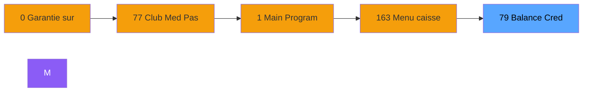
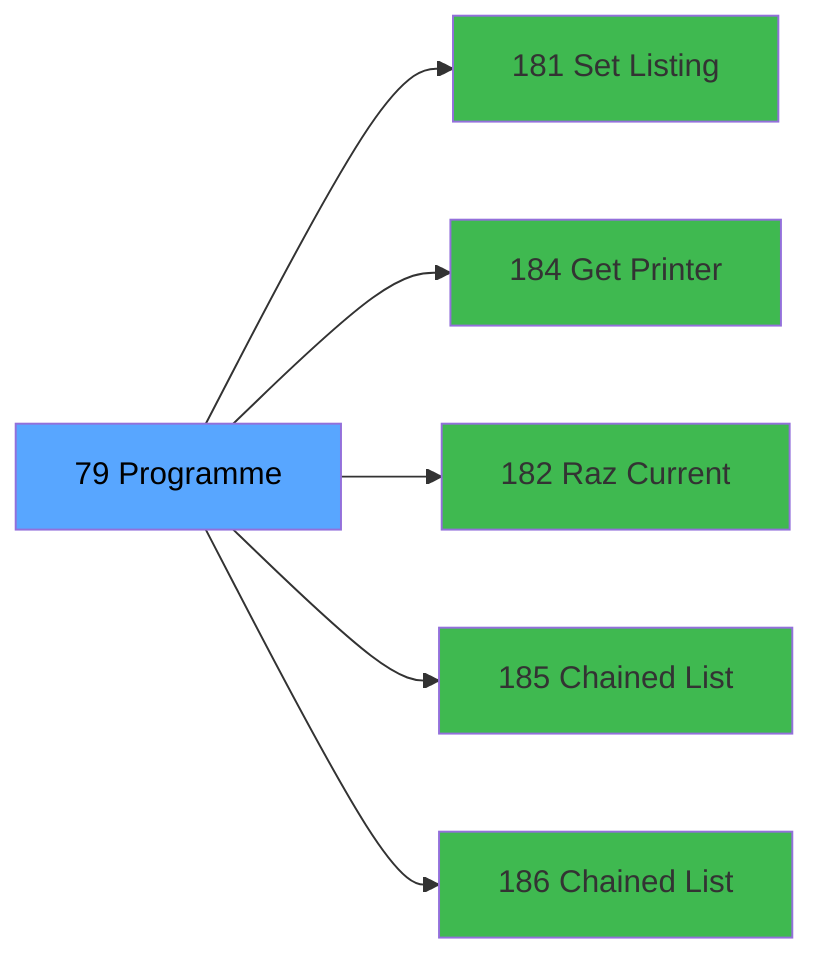

# ADH IDE 79 - Balance Credit de conso

> **Version spec**: 3.5
> **Analyse**: 2026-01-27 17:57
> **Source**: `Prg_XXX.xml`

---

<!-- TAB:Fonctionnel -->

## SPECIFICATION FONCTIONNELLE

### 1.1 Objectif metier

| Element | Description |
|---------|-------------|
| **Qui** | Operateur |
| **Quoi** | Balance Credit de conso
 |
| **Pourquoi** | A documenter |
| **Declencheur** | A identifier |

### 1.2 Regles metier

| Code | Regle | Condition |
|------|-------|-----------|
| RM-001 | A documenter | - |

### 1.3 Flux utilisateur

1. Demarrage programme
2. Traitement principal
3. Fin programme

### 1.4 Cas d'erreur

| Erreur | Comportement |
|--------|--------------|
| - | A documenter |

---

<!-- TAB:Technique -->

## SPECIFICATION TECHNIQUE

### 2.1 Identification

| Attribut | Valeur |
|----------|--------|
| **Format IDE** | ADH IDE 79 |
| **Description** | Balance Credit de conso
 |
| **Module** | ADH |

### 2.2 Tables

| # | Nom logique | Nom physique | Acces | Usage |
|---|-------------|--------------|-------|-------|
| 31 | gm-complet_______gmc | `cafil009_dat` | R | 15x |
| 69 | initialisation___ini | `cafil047_dat` | R | 1x |
| 268 | cc_total_par_type | `ccpartyp` | L | 15x |
| 268 | cc_total_par_type | `ccpartyp` | **W** | 1x |
| 271 | cc_total | `cctotal` | L | 15x |
| 272 | cc_type_detail | `cctypdet` | L | 7x |
| 272 | cc_type_detail | `cctypdet` | R | 1x |
| 273 | cc_type | `cctype` | L | 16x |
### 2.3 Parametres d'entree

| Variable | Nom | Type | Picture |
|----------|-----|------|---------|
| - | Aucun parametre | - | - |
### 2.4 Algorigramme

### 2.5 Expressions cles

| IDE | Expression | Commentaire |
|-----|------------|-------------|
| 1 | `LastClicked ()='PRINT'` | - |
| 2 | `LastClicked ()='PRINTDETAIL'` | - |
| 3 | `MlsTrans ('Balance des credits de consommation ...` | - |
| 4 | `{0,8}` | - |
| 5 | `{0,5}` | - |
| 6 | `{0,6}` | - |
| 7 | `{0,7}` | - |
| 8 | `{32768,1}` | - |
| 9 | `Date ()` | - |
| 10 | `Trim ({0,16})&' '&Trim ({0,15})` | - |
| 11 | `{0,1}` | - |
| 12 | `{0,2}` | - |
| 13 | `{0,3}` | - |
| 14 | `IF ({0,24},'Quit Detail','Detail')` | - |
| 15 | `NOT ({0,24})` | - |
| 16 | `'FALSE'LOG` | - |
| 17 | `'N'&Left (Right ({0,4},13),12)` | - |
| 18 | `2` | - |
| 19 | `38` | - |
| 20 | `39` | - |

> **Total**: 23 expressions (affichees: 20)
### 2.6 Variables importantes

### 2.7 Statistiques

| Metrique | Valeur |
|----------|--------|
| **Taches** | 30 |
| **Lignes logique** | 674 |
| **Lignes desactivees** | 0 |
---

<!-- TAB:Cartographie -->

## CARTOGRAPHIE APPLICATIVE

### 3.1 Chaine d'appels depuis Main

### 3.2 Callers directs

| IDE | Programme | Nb appels |
|-----|-----------|-----------|
| 0 | Garantie sur compte PMS-584 | 2 |
| 77 | Club Med Pass menu | 1 |
### 3.3 Callees

| Niv | IDE | Programme | Nb appels |
|-----|-----|-----------|-----------|
| 1 | 181 | Set Listing Number | 2 |
| 1 | 184 | Get Printer for chained list | 2 |
| 1 | 182 | Raz Current Printer | 1 |
| 1 | 185 | Chained Listing Printer Choice | 1 |
| 1 | 186 | Chained Listing Load Default | 1 |
### 3.4 Verification orphelin

| Critere | Resultat |
|---------|----------|
| Callers actifs | A verifier |
| **Conclusion** | A analyser |

---

## HISTORIQUE

| Date | Action | Auteur |
|------|--------|--------|
| 2026-01-27 20:19 | **DATA V2** - Tables reelles, Expressions, Stats, CallChain | Script |
| 2026-01-27 19:45 | **DATA POPULATED** - Tables, Callgraph (23 expr) | Script |
| 2026-01-27 17:57 | **Upgrade V3.5** - TAB markers, Mermaid | Claude |

---

*Specification V3.5 - Format avec TAB markers et Mermaid*
