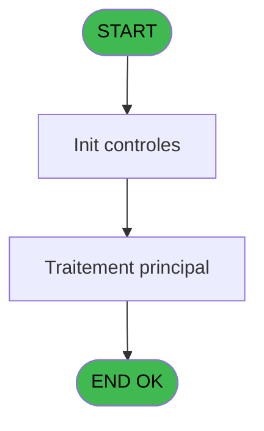

# ADH IDE 8 - Set Village info

> **Analyse**: Phases 1-4 2026-02-07 03:39 -> 01:05 (21h26min) | Assemblage 01:05
> **Pipeline**: V7.2 Enrichi
> **Structure**: 4 onglets (Resume | Ecrans | Donnees | Connexions)

<!-- TAB:Resume -->

## 1. FICHE D'IDENTITE

| Attribut | Valeur |
|----------|--------|
| Projet | ADH |
| IDE Position | 8 |
| Nom Programme | Set Village info |
| Fichier source | `Prg_8.xml` |
| Dossier IDE | General |
| Taches | 2 (0 ecrans visibles) |
| Tables modifiees | 0 |
| Programmes appeles | 0 |
| Complexite | **BASSE** (score 0/100) |

## 2. DESCRIPTION FONCTIONNELLE

ADH IDE 8 est un programme de gestion d'informations village appelé depuis le menu DataCatching (IDE 7). Il comporte deux tâches principales : **Set Village Address** qui permet de définir ou mettre à jour l'adresse du village dans un formulaire, et **Load Buffer** qui charge les données en mémoire temporaire avant traitement.

Le flux métier suit un pattern classique de capture de données : l'utilisateur saisit l'adresse village dans la première tâche, qui alimente ensuite un buffer en mémoire. Ce buffer sert probablement d'intermédiaire avant enregistrement en base de données ou transmission à d'autres programmes de la chaîne DataCatching.

Ce programme s'inscrit dans un contexte plus large de gestion d'établissements (village/résidence), où les données de localisation sont des informations critiques pour l'ensemble du système. L'intégration avec le menu DataCatching (IDE 7) indique qu'il fait partie d'un workflow de saisie/correction de données maître.

## 3. BLOCS FONCTIONNELS

### 3.1 Traitement (2 taches)

Traitements internes.

---

#### 8 - Set Village Address

**Role** : Traitement : Set Village Address.
**Variables liees** : EN (V lien adresse_service_village)

---

#### 8.1 - Load Buffer

**Role** : Traitement : Load Buffer.
**Variables liees** : EO (Buffer)

## 5. REGLES METIER

1 regles identifiees:

### Autres (1 regles)

#### [RM-001] Negation de ([Q]) (condition inversee)

| Element | Detail |
|---------|--------|
| **Condition** | `NOT ([Q])` |
| **Si vrai** | Action si vrai |
| **Expression source** | Expression 21 : `NOT ([Q])` |
| **Exemple** | Si NOT ([Q]) → Action si vrai |

## 6. CONTEXTE

- **Appele par**: [Menu Data Catching (IDE 7)](ADH-IDE-7.md)
- **Appelle**: 0 programmes | **Tables**: 2 (W:0 R:1 L:1) | **Taches**: 2 | **Expressions**: 22

<!-- TAB:Ecrans -->

## 8. ECRANS

*(Programme sans ecran visible)*

## 9. NAVIGATION

### 9.3 Structure hierarchique (2 taches)

| Position | Tache | Type | Dimensions | Bloc |
|----------|-------|------|------------|------|
| **8.1** | [**Set Village Address** (8)](#t1) | MDI | - | Traitement |
| 8.1.1 | [Load Buffer (8.1)](#t2) | MDI | - | |

### 9.4 Algorigramme

> **Legende**: Vert = START/END OK | Rouge = END KO | Bleu = Decisions
> *Algorigramme auto-genere. Utiliser `/algorigramme` pour une synthese metier detaillee.*

<!-- TAB:Donnees -->

## 10. TABLES

### Tables utilisees (2)

| ID | Nom | Description | Type | R | W | L | Usages |
|----|-----|-------------|------|---|---|---|--------|
| 904 | Boo_AvailibleEmployees |  | DB | R |   |   | 1 |
| 372 | pv_budget |  | DB |   |   | L | 1 |

### Colonnes par table (1 / 1 tables avec colonnes identifiees)

Table 904 - Boo_AvailibleEmployees (R) - 1 usages

| Lettre | Variable | Acces | Type |
|--------|----------|-------|------|
| A | V lien adresse_service_village | R | Logical |
| B | Buffer | R | Alpha |
| C | CounterTel | R | Numeric |
| D | CounterFax | R | Numeric |

## 11. VARIABLES

### 11.1 Variables de session (1)

Variables persistantes pendant toute la session.

| Lettre | Nom | Type | Usage dans |
|--------|-----|------|-----------|
| EN | V lien adresse_service_village | Logical | - |

### 11.2 Autres (3)

Variables diverses.

| Lettre | Nom | Type | Usage dans |
|--------|-----|------|-----------|
| EO | Buffer | Alpha | - |
| EP | CounterTel | Numeric | - |
| EQ | CounterFax | Numeric | - |

## 12. EXPRESSIONS

**22 / 22 expressions decodees (100%)**

### 12.1 Repartition par type

| Type | Expressions | Regles |
|------|-------------|--------|
| NEGATION | 1 | 5 |
| CONSTANTE | 1 | 0 |
| OTHER | 10 | 0 |
| STRING | 10 | 0 |

### 12.2 Expressions cles par type

#### NEGATION (1 expressions)

| Type | IDE | Expression | Regle |
|------|-----|------------|-------|
| NEGATION | 21 | `NOT ([Q])` | [RM-001](#rm-RM-001) |

#### CONSTANTE (1 expressions)

| Type | IDE | Expression | Regle |
|------|-----|------------|-------|
| CONSTANTE | 22 | `''` | - |

#### OTHER (10 expressions)

| Type | IDE | Expression | Regle |
|------|-----|------------|-------|
| OTHER | 13 | `SetParam ('VI_FAXN',MID ([BE],775,128))` | - |
| OTHER | 11 | `SetParam ('VI_PHON',MID ([BE],646,128))` | - |
| OTHER | 15 | `SetParam ('VI_MAIL',MID ([BE],904,128))` | - |
| OTHER | 19 | `SetParam ('VI_VATN',MID ([BE],1162,128))` | - |
| OTHER | 17 | `SetParam ('VI_SIRE',MID ([BE],1033,128))` | - |
| ... | | *+5 autres* | |

#### STRING (10 expressions)

| Type | IDE | Expression | Regle |
|------|-----|------------|-------|
| STRING | 14 | `SetParam ('VI_FAXN','Fax  '&Trim([BA]))` | - |
| STRING | 12 | `SetParam ('VI_PHON','Tel  '&Trim([Z]))` | - |
| STRING | 16 | `SetParam ('VI_MAIL',Trim([BD]))` | - |
| STRING | 20 | `SetParam ('VI_VATN',Trim([BC]))` | - |
| STRING | 18 | `SetParam ('VI_SIRE',Trim([BB]))` | - |
| ... | | *+5 autres* | |

### 12.3 Toutes les expressions (22)

Voir les 22 expressions

#### NEGATION (1)

| IDE | Expression Decodee |
|-----|-------------------|
| 21 | `NOT ([Q])` |

#### CONSTANTE (1)

| IDE | Expression Decodee |
|-----|-------------------|
| 22 | `''` |

#### OTHER (10)

| IDE | Expression Decodee |
|-----|-------------------|
| 1 | `SetParam ('VI_CLUB',MID ([BE],1,128))` |
| 3 | `SetParam ('VI_NAME',MID ([BE],130,128))` |
| 5 | `SetParam ('VI_ADR1',MID ([BE],259,128))` |
| 7 | `SetParam ('VI_ADR2',MID ([BE],388,128))` |
| 9 | `SetParam ('VI_ZIPC',MID ([BE],517,128))` |
| 11 | `SetParam ('VI_PHON',MID ([BE],646,128))` |
| 13 | `SetParam ('VI_FAXN',MID ([BE],775,128))` |
| 15 | `SetParam ('VI_MAIL',MID ([BE],904,128))` |
| 17 | `SetParam ('VI_SIRE',MID ([BE],1033,128))` |
| 19 | `SetParam ('VI_VATN',MID ([BE],1162,128))` |

#### STRING (10)

| IDE | Expression Decodee |
|-----|-------------------|
| 2 | `SetParam ('VI_CLUB',Trim([T]))` |
| 4 | `SetParam ('VI_NAME',Trim([U]))` |
| 6 | `SetParam ('VI_ADR1',Trim([V]))` |
| 8 | `SetParam ('VI_ADR2',Trim([W]))` |
| 10 | `SetParam ('VI_ZIPC',Trim([Y]))` |
| 12 | `SetParam ('VI_PHON','Tel  '&Trim([Z]))` |
| 14 | `SetParam ('VI_FAXN','Fax  '&Trim([BA]))` |
| 16 | `SetParam ('VI_MAIL',Trim([BD]))` |
| 18 | `SetParam ('VI_SIRE',Trim([BB]))` |
| 20 | `SetParam ('VI_VATN',Trim([BC]))` |

<!-- TAB:Connexions -->

## 13. GRAPHE D'APPELS

### 13.1 Chaine depuis Main (Callers)

Main -> ... -> [Menu Data Catching (IDE 7)](ADH-IDE-7.md) -> **Set Village info (IDE 8)**

### 13.2 Callers

| IDE | Nom Programme | Nb Appels |
|-----|---------------|-----------|
| [7](ADH-IDE-7.md) | Menu Data Catching | 1 |

### 13.3 Callees (programmes appeles)

### 13.4 Detail Callees avec contexte

| IDE | Nom Programme | Appels | Contexte |
|-----|---------------|--------|----------|
| - | (aucun) | - | - |

## 14. RECOMMANDATIONS MIGRATION

### 14.1 Profil du programme

| Metrique | Valeur | Impact migration |
|----------|--------|-----------------|
| Lignes de logique | 76 | Programme compact |
| Expressions | 22 | Peu de logique |
| Tables WRITE | 0 | Impact faible |
| Sous-programmes | 0 | Peu de dependances |
| Ecrans visibles | 0 | Ecran unique ou traitement batch |
| Code desactive | 0% (0 / 76) | Code sain |
| Regles metier | 1 | Quelques regles a preserver |

### 14.2 Plan de migration par bloc

#### Traitement (2 taches: 0 ecran, 2 traitements)

- **Strategie** : 2 service(s) backend injectable(s) (Domain Services).
- Decomposer les taches en services unitaires testables.

### 14.3 Dependances critiques

| Dependance | Type | Appels | Impact |
|------------|------|--------|--------|

---
*Spec DETAILED generee par Pipeline V7.2 - 2026-02-08 01:05*
