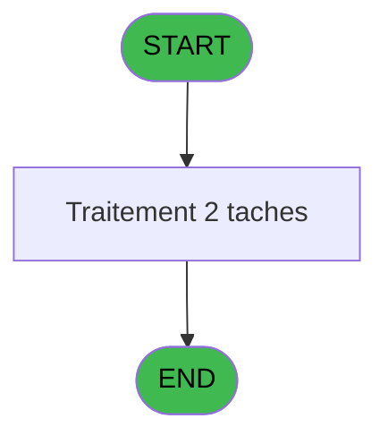

# ADH IDE 8 - Set Village info

> **Analyse**: Phases 1-4 2026-02-07 03:38 -> 03:39 (28s) | Assemblage 12:47
> **Pipeline**: V7.2 Enrichi
> **Structure**: 4 onglets (Resume | Ecrans | Donnees | Connexions)

<!-- TAB:Resume -->

## 1. FICHE D'IDENTITE

| Attribut | Valeur |
|----------|--------|
| Projet | ADH |
| IDE Position | 8 |
| Nom Programme | Set Village info |
| Fichier source | `Prg_8.xml` |
| Dossier IDE | General |
| Taches | 2 (0 ecrans visibles) |
| Tables modifiees | 0 |
| Programmes appeles | 0 |
| Complexite | **BASSE** (score 0/100) |

## 2. DESCRIPTION FONCTIONNELLE

**ADH IDE 8 - Set Village info** extrait et structure les informations du village depuis un buffer (variable AE) pour les paramétrer dans le système. Le programme parcourt 10 champs distincts d'identité du club (code, nom, adresses, code postal, téléphone, fax, email, SIRE, TVA) en utilisant la fonction MID pour découper des sections précises du buffer à des positions définies. Chaque extraction est ensuite trimmée et assignée à une variable VI_* correspondante via SetParam.

Le flux s'articule autour de deux tâches principales : **Set Village Address** qui gère l'affectation des paramètres d'identification, et **Load Buffer** qui charge les données brutes. La condition de sortie (NOT [Q]) vérifie que la variable Q n'est pas à vraie, contrôlant ainsi le flux d'exécution. Cette séparation entre extraction brute (MID) et nettoyage (Trim) permet à la fois de capturer des fragments longs depuis le buffer et de stocker des versions compactes pour l'affichage.

Le programme fait appel à une table externe (Boo_AvailibleEmployees) avec un lien vers pv_budget, mais l'analyse syntaxique montre qu'aucune logique métier complexe n'intervient—il s'agit essentiellement d'une mécanique de parsing structuré de données brutes vers des paramètres métier.

## 3. BLOCS FONCTIONNELS

### 3.1 Traitement (2 taches)

Traitements internes.

---

#### T1 - Set Village Address

**Role** : Traitement : Set Village Address.
**Variables liees** : A (V lien adresse_service_village)

---

#### T2 - Load Buffer

**Role** : Traitement : Load Buffer.
**Variables liees** : B (Buffer)

## 5. REGLES METIER

*(Aucune regle metier identifiee dans les expressions)*

## 6. CONTEXTE

- **Appele par**: [Menu Data Catching (IDE 7)](ADH-IDE-7.md)
- **Appelle**: 0 programmes | **Tables**: 2 (W:0 R:1 L:1) | **Taches**: 2 | **Expressions**: 22

<!-- TAB:Ecrans -->

## 8. ECRANS

*(Programme sans ecran visible)*

## 9. NAVIGATION

### 9.3 Structure hierarchique (2 taches)

| Position | Tache | Type | Dimensions | Bloc |
|----------|-------|------|------------|------|
| **8.1** | [**Set Village Address** (T1)](#t1) | MDI | - | Traitement |
| 8.1.1 | [Load Buffer (T2)](#t2) | MDI | - | |

### 9.4 Algorigramme

> *Algorigramme simplifie base sur les blocs fonctionnels. Utiliser `/algorigramme` pour une synthese metier detaillee.*

<!-- TAB:Donnees -->

## 10. TABLES

### Tables utilisees (2)

| ID | Nom | Description | Type | R | W | L | Usages |
|----|-----|-------------|------|---|---|---|--------|
| 904 | Boo_AvailibleEmployees |  | DB | R |   |   | 1 |
| 372 | pv_budget |  | DB |   |   | L | 1 |

### Colonnes par table (1 / 1 tables avec colonnes identifiees)

Table 904 - Boo_AvailibleEmployees (R) - 1 usages

| Lettre | Variable | Acces | Type |
|--------|----------|-------|------|
| A | V lien adresse_service_village | R | Logical |
| B | Buffer | R | Alpha |
| C | CounterTel | R | Numeric |
| D | CounterFax | R | Numeric |

## 11. VARIABLES

### 11.1 Variables de session (1)

Variables persistantes pendant toute la session.

| Lettre | Nom | Type | Usage dans |
|--------|-----|------|-----------|
| A | V lien adresse_service_village | Logical | - |

### 11.2 Autres (3)

Variables diverses.

| Lettre | Nom | Type | Usage dans |
|--------|-----|------|-----------|
| B | Buffer | Alpha | - |
| C | CounterTel | Numeric | - |
| D | CounterFax | Numeric | - |

## 12. EXPRESSIONS

**22 / 22 expressions decodees (100%)**

### 12.1 Repartition par type

| Type | Expressions | Regles |
|------|-------------|--------|
| CONSTANTE | 1 | 0 |
| OTHER | 10 | 0 |
| NEGATION | 1 | 0 |
| STRING | 10 | 0 |

### 12.2 Expressions cles par type

#### CONSTANTE (1 expressions)

| Type | IDE | Expression | Regle |
|------|-----|------------|-------|
| CONSTANTE | 22 | `''` | - |

#### OTHER (10 expressions)

| Type | IDE | Expression | Regle |
|------|-----|------------|-------|
| OTHER | 13 | `SetParam ('VI_FAXN',MID ([AE],775,128))` | - |
| OTHER | 11 | `SetParam ('VI_PHON',MID ([AE],646,128))` | - |
| OTHER | 15 | `SetParam ('VI_MAIL',MID ([AE],904,128))` | - |
| OTHER | 19 | `SetParam ('VI_VATN',MID ([AE],1162,128))` | - |
| OTHER | 17 | `SetParam ('VI_SIRE',MID ([AE],1033,128))` | - |
| ... | | *+5 autres* | |

#### NEGATION (1 expressions)

| Type | IDE | Expression | Regle |
|------|-----|------------|-------|
| NEGATION | 21 | `NOT ([Q])` | - |

#### STRING (10 expressions)

| Type | IDE | Expression | Regle |
|------|-----|------------|-------|
| STRING | 14 | `SetParam ('VI_FAXN','Fax  '&Trim([AA]))` | - |
| STRING | 12 | `SetParam ('VI_PHON','Tel  '&Trim([Z]))` | - |
| STRING | 16 | `SetParam ('VI_MAIL',Trim([AD]))` | - |
| STRING | 20 | `SetParam ('VI_VATN',Trim([AC]))` | - |
| STRING | 18 | `SetParam ('VI_SIRE',Trim([AB]))` | - |
| ... | | *+5 autres* | |

### 12.3 Toutes les expressions (22)

Voir les 22 expressions

#### CONSTANTE (1)

| IDE | Expression Decodee |
|-----|-------------------|
| 22 | `''` |

#### OTHER (10)

| IDE | Expression Decodee |
|-----|-------------------|
| 1 | `SetParam ('VI_CLUB',MID ([AE],1,128))` |
| 3 | `SetParam ('VI_NAME',MID ([AE],130,128))` |
| 5 | `SetParam ('VI_ADR1',MID ([AE],259,128))` |
| 7 | `SetParam ('VI_ADR2',MID ([AE],388,128))` |
| 9 | `SetParam ('VI_ZIPC',MID ([AE],517,128))` |
| 11 | `SetParam ('VI_PHON',MID ([AE],646,128))` |
| 13 | `SetParam ('VI_FAXN',MID ([AE],775,128))` |
| 15 | `SetParam ('VI_MAIL',MID ([AE],904,128))` |
| 17 | `SetParam ('VI_SIRE',MID ([AE],1033,128))` |
| 19 | `SetParam ('VI_VATN',MID ([AE],1162,128))` |

#### NEGATION (1)

| IDE | Expression Decodee |
|-----|-------------------|
| 21 | `NOT ([Q])` |

#### STRING (10)

| IDE | Expression Decodee |
|-----|-------------------|
| 2 | `SetParam ('VI_CLUB',Trim([T]))` |
| 4 | `SetParam ('VI_NAME',Trim([U]))` |
| 6 | `SetParam ('VI_ADR1',Trim([V]))` |
| 8 | `SetParam ('VI_ADR2',Trim([W]))` |
| 10 | `SetParam ('VI_ZIPC',Trim([Y]))` |
| 12 | `SetParam ('VI_PHON','Tel  '&Trim([Z]))` |
| 14 | `SetParam ('VI_FAXN','Fax  '&Trim([AA]))` |
| 16 | `SetParam ('VI_MAIL',Trim([AD]))` |
| 18 | `SetParam ('VI_SIRE',Trim([AB]))` |
| 20 | `SetParam ('VI_VATN',Trim([AC]))` |

<!-- TAB:Connexions -->

## 13. GRAPHE D'APPELS

### 13.1 Chaine depuis Main (Callers)

Main -> ... -> [Menu Data Catching (IDE 7)](ADH-IDE-7.md) -> **Set Village info (IDE 8)**

### 13.2 Callers

| IDE | Nom Programme | Nb Appels |
|-----|---------------|-----------|
| [7](ADH-IDE-7.md) | Menu Data Catching | 1 |

### 13.3 Callees (programmes appeles)

### 13.4 Detail Callees avec contexte

| IDE | Nom Programme | Appels | Contexte |
|-----|---------------|--------|----------|
| - | (aucun) | - | - |

## 14. RECOMMANDATIONS MIGRATION

### 14.1 Profil du programme

| Metrique | Valeur | Impact migration |
|----------|--------|-----------------|
| Lignes de logique | 76 | Programme compact |
| Expressions | 22 | Peu de logique |
| Tables WRITE | 0 | Impact faible |
| Sous-programmes | 0 | Peu de dependances |
| Ecrans visibles | 0 | Ecran unique ou traitement batch |
| Code desactive | 0% (0 / 76) | Code sain |
| Regles metier | 0 | Pas de regle identifiee |

### 14.2 Plan de migration par bloc

#### Traitement (2 taches: 0 ecran, 2 traitements)

- **Strategie** : 2 service(s) backend injectable(s) (Domain Services).
- Decomposer les taches en services unitaires testables.

### 14.3 Dependances critiques

| Dependance | Type | Appels | Impact |
|------------|------|--------|--------|

---
*Spec DETAILED generee par Pipeline V7.2 - 2026-02-07 12:48*
