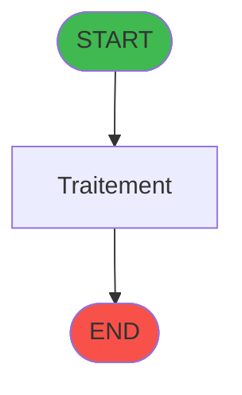
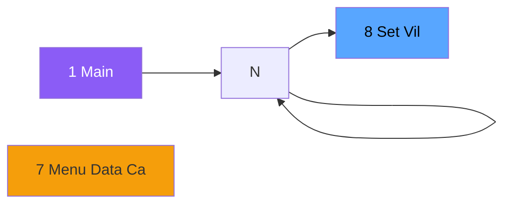

# ADH IDE 8 -      Set Village info

> **Version spec**: 3.5
> **Analyse**: 2026-01-27 17:56
> **Source**: `Prg_XXX.xml`

---

<!-- TAB:Fonctionnel -->

## SPECIFICATION FONCTIONNELLE

### 1.1 Objectif metier

| Element | Description |
|---------|-------------|
| **Qui** | Operateur |
| **Quoi** |      Set Village info
 |
| **Pourquoi** | A documenter |
| **Declencheur** | A identifier |

### 1.2 Regles metier

| Code | Regle | Condition |
|------|-------|-----------|
| RM-001 | A documenter | - |

### 1.3 Flux utilisateur

1. Demarrage programme
2. Traitement principal
3. Fin programme

### 1.4 Cas d'erreur

| Erreur | Comportement |
|--------|--------------|
| - | A documenter |

---

<!-- TAB:Technique -->

## SPECIFICATION TECHNIQUE

### 2.1 Identification

| Attribut | Valeur |
|----------|--------|
| **Format IDE** | ADH IDE 8 |
| **Description** |      Set Village info
 |
| **Module** | ADH |

### 2.2 Tables

| # | Nom logique | Nom physique | Acces | Usage |
|---|-------------|--------------|-------|-------|
| 372 | pv_budget | `pv_budget_dat` | L | 1x |
| 904 | Boo_AvailibleEmployees | `Boo_AvailibleEmployees` | R | 1x |
### 2.3 Parametres d'entree

| Variable | Nom | Type | Picture |
|----------|-----|------|---------|
| - | Aucun parametre | - | - |
### 2.4 Algorigramme

### 2.5 Expressions cles

| IDE | Expression | Commentaire |
|-----|------------|-------------|
| 1 | `SetParam ('VI_CLUB',MID ({0,31},1,128))` | - |
| 2 | `SetParam ('VI_CLUB',Trim({0,20}))` | - |
| 3 | `SetParam ('VI_NAME',MID ({0,31},130,128))` | - |
| 4 | `SetParam ('VI_NAME',Trim({0,21}))` | - |
| 5 | `SetParam ('VI_ADR1',MID ({0,31},259,128))` | - |
| 6 | `SetParam ('VI_ADR1',Trim({0,22}))` | - |
| 7 | `SetParam ('VI_ADR2',MID ({0,31},388,128))` | - |
| 8 | `SetParam ('VI_ADR2',Trim({0,23}))` | - |
| 9 | `SetParam ('VI_ZIPC',MID ({0,31},517,128))` | - |
| 10 | `SetParam ('VI_ZIPC',Trim({0,25}))` | - |
| 11 | `SetParam ('VI_PHON',MID ({0,31},646,128))` | - |
| 12 | `SetParam ('VI_PHON','Tel  '&Trim({0,26}))` | - |
| 13 | `SetParam ('VI_FAXN',MID ({0,31},775,128))` | - |
| 14 | `SetParam ('VI_FAXN','Fax  '&Trim({0,27}))` | - |
| 15 | `SetParam ('VI_MAIL',MID ({0,31},904,128))` | - |
| 16 | `SetParam ('VI_MAIL',Trim({0,30}))` | - |
| 17 | `SetParam ('VI_SIRE',MID ({0,31},1033,128))` | - |
| 18 | `SetParam ('VI_SIRE',Trim({0,28}))` | - |
| 19 | `SetParam ('VI_VATN',MID ({0,31},1162,128))` | - |
| 20 | `SetParam ('VI_VATN',Trim({0,29}))` | - |

> **Total**: 22 expressions (affichees: 20)
### 2.6 Variables importantes

### 2.7 Statistiques

| Metrique | Valeur |
|----------|--------|
| **Taches** | 2 |
| **Lignes logique** | 76 |
| **Lignes desactivees** | 0 |
---

<!-- TAB:Cartographie -->

## CARTOGRAPHIE APPLICATIVE

### 3.1 Chaine d'appels depuis Main

### 3.2 Callers directs

| IDE | Programme | Nb appels |
|-----|-----------|-----------|
| 7 | Menu Data Catching | 1 |
### 3.3 Callees

| Niv | IDE | Programme | Nb appels |
|-----|-----|-----------|-----------|
| - | - | Programme terminal | - |
### 3.4 Verification orphelin

| Critere | Resultat |
|---------|----------|
| Callers actifs | A verifier |
| **Conclusion** | A analyser |

---

## HISTORIQUE

| Date | Action | Auteur |
|------|--------|--------|
| 2026-01-27 20:17 | **DATA V2** - Tables reelles, Expressions, Stats, CallChain | Script |
| 2026-01-27 19:43 | **DATA POPULATED** - Tables, Callgraph (22 expr) | Script |
| 2026-01-27 17:56 | **Upgrade V3.5** - TAB markers, Mermaid | Claude |

---

*Specification V3.5 - Format avec TAB markers et Mermaid*
