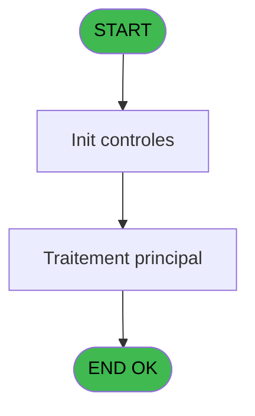
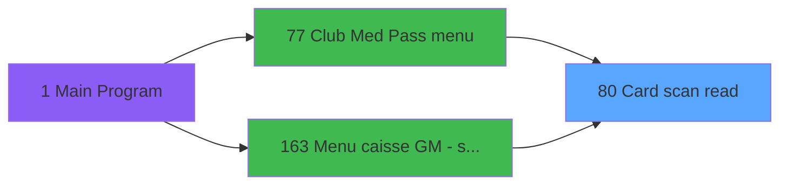
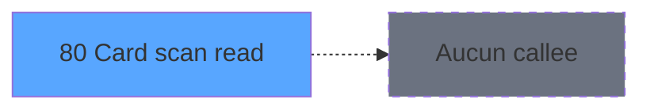

# ADH IDE 80 - Card scan read

> **Analyse**: Phases 1-4 2026-02-07 03:44 -> 03:45 (27s) | Assemblage 03:45
> **Pipeline**: V7.2 Enrichi
> **Structure**: 4 onglets (Resume | Ecrans | Donnees | Connexions)

<!-- TAB:Resume -->

## 1. FICHE D'IDENTITE

| Attribut | Valeur |
|----------|--------|
| Projet | ADH |
| IDE Position | 80 |
| Nom Programme | Card scan read |
| Fichier source | `Prg_80.xml` |
| Dossier IDE | General |
| Taches | 1 (1 ecrans visibles) |
| Tables modifiees | 0 |
| Programmes appeles | 0 |

## 2. DESCRIPTION FONCTIONNELLE

**Card scan read** assure la gestion complete de ce processus, accessible depuis [Transaction Nouv vente PMS-584 (IDE 0)](ADH-IDE-0.md), [Transaction Nouv vente PMS-710 (IDE 0)](ADH-IDE-0.md), [Transaction Nouv vente PMS-721 (IDE 0)](ADH-IDE-0.md), [Club Med Pass menu (IDE 77)](ADH-IDE-77.md), [Menu caisse GM - scroll (IDE 163)](ADH-IDE-163.md).

Le flux de traitement s'organise en **1 blocs fonctionnels** :

- **Traitement** (1 tache) : traitements metier divers

## 3. BLOCS FONCTIONNELS

### 3.1 Traitement (1 tache)

Traitements internes.

---

#### 80 - Club Med Pass Identification [[ECRAN]](#ecran-t1)

**Role** : Traitement : Club Med Pass Identification.
**Ecran** : 366 x 69 DLU (MDI) | [Voir mockup](#ecran-t1)
**Variables liees** : E (p.Club Med Pass select)

## 5. REGLES METIER

*(Aucune regle metier identifiee)*

## 6. CONTEXTE

- **Appele par**: [Transaction Nouv vente PMS-584 (IDE 0)](ADH-IDE-0.md), [Transaction Nouv vente PMS-710 (IDE 0)](ADH-IDE-0.md), [Transaction Nouv vente PMS-721 (IDE 0)](ADH-IDE-0.md), [Club Med Pass menu (IDE 77)](ADH-IDE-77.md), [Menu caisse GM - scroll (IDE 163)](ADH-IDE-163.md)
- **Appelle**: 0 programmes | **Tables**: 2 (W:0 R:1 L:1) | **Taches**: 1 | **Expressions**: 15

<!-- TAB:Ecrans -->

## 8. ECRANS

### 8.1 Forms visibles (1 / 1)

| # | Position | Tache | Nom | Type | Largeur | Hauteur | Bloc |
|---|----------|-------|-----|------|---------|---------|------|
| 1 | 80 | 80 | Club Med Pass Identification | MDI | 366 | 69 | Traitement |

### 8.2 Mockups Ecrans

---

#### 80 - Club Med Pass Identification
**Tache** : [80](#t1) | **Type** : MDI | **Dimensions** : 366 x 69 DLU
**Bloc** : Traitement | **Titre IDE** : Club Med Pass Identification

<!-- FORM-DATA:
{
    "width":  366,
    "vFactor":  4,
    "type":  "MDI",
    "hFactor":  4,
    "controls":  [
                     {
                         "x":  132,
                         "type":  "label",
                         "var":  "",
                         "y":  12,
                         "w":  88,
                         "fmt":  "",
                         "name":  "",
                         "h":  5,
                         "color":  "6",
                         "text":  "Scan Club Med Pass...",
                         "parent":  null
                     },
                     {
                         "x":  157,
                         "type":  "label",
                         "var":  "",
                         "y":  34,
                         "w":  171,
                         "fmt":  "",
                         "name":  "",
                         "h":  8,
                         "color":  "143",
                         "text":  "Carte inconnue",
                         "parent":  null
                     },
                     {
                         "x":  0,
                         "type":  "label",
                         "var":  "",
                         "y":  54,
                         "w":  363,
                         "fmt":  "",
                         "name":  "",
                         "h":  13,
                         "color":  "6",
                         "text":  "",
                         "parent":  null
                     },
                     {
                         "x":  203,
                         "type":  "edit",
                         "var":  "",
                         "y":  25,
                         "w":  83,
                         "fmt":  "",
                         "name":  "pv.card id",
                         "h":  8,
                         "color":  "",
                         "text":  "",
                         "parent":  null
                     },
                     {
                         "x":  16,
                         "type":  "image",
                         "var":  "",
                         "y":  8,
                         "w":  102,
                         "fmt":  "",
                         "name":  "",
                         "h":  39,
                         "color":  "",
                         "text":  "",
                         "parent":  null
                     },
                     {
                         "x":  262,
                         "type":  "button",
                         "var":  "",
                         "y":  57,
                         "w":  99,
                         "fmt":  "Cancel",
                         "name":  "CANCEL",
                         "h":  9,
                         "color":  "",
                         "text":  "",
                         "parent":  null
                     }
                 ],
    "taskId":  "80",
    "height":  69
}
-->

<strong>Champs : 1 champs</strong>

| Pos (x,y) | Nom | Variable | Type |
|-----------|-----|----------|------|
| 203,25 | pv.card id | - | edit |

<strong>Boutons : 1 boutons</strong>

| Bouton | Pos (x,y) | Action |
|--------|-----------|--------|
| Cancel | 262,57 | Annule et retour au menu |

## 9. NAVIGATION

Ecran unique: **Club Med Pass Identification**

### 9.3 Structure hierarchique (1 tache)

| Position | Tache | Type | Dimensions | Bloc |
|----------|-------|------|------------|------|
| **80.1** | [**Club Med Pass Identification** (80)](#t1) [mockup](#ecran-t1) | MDI | 366x69 | Traitement |

### 9.4 Algorigramme

> **Legende**: Vert = START/END OK | Rouge = END KO | Bleu = Decisions
> *Algorigramme auto-genere. Utiliser `/algorigramme` pour une synthese metier detaillee.*

<!-- TAB:Donnees -->

## 10. TABLES

### Tables utilisees (2)

| ID | Nom | Description | Type | R | W | L | Usages |
|----|-----|-------------|------|---|---|---|--------|
| 30 | gm-recherche_____gmr | Index de recherche | DB | R |   |   | 1 |
| 312 | ez_card |  | DB |   |   | L | 1 |

### Colonnes par table (2 / 1 tables avec colonnes identifiees)

Table 30 - gm-recherche_____gmr (R) - 1 usages

| Lettre | Variable | Acces | Type |
|--------|----------|-------|------|
| A | p.code-8chiffres | R | Numeric |
| B | p.filiation | R | Numeric |
| C | p.chaine U | R | Alpha |
| D | p.chaine U10 | R | Alpha |
| E | p.Club Med Pass select | R | Logical |
| F | pv.card id | R | Alpha |
| G | p.status | R | Alpha |
| H | r.card | R | Logical |

## 11. VARIABLES

### 11.1 Parametres entrants (6)

Variables recues du programme appelant ([Transaction Nouv vente PMS-584 (IDE 0)](ADH-IDE-0.md)).

| Lettre | Nom | Type | Usage dans |
|--------|-----|------|-----------|
| A | p.code-8chiffres | Numeric | - |
| B | p.filiation | Numeric | - |
| C | p.chaine U | Alpha | - |
| D | p.chaine U10 | Alpha | - |
| E | p.Club Med Pass select | Logical | - |
| G | p.status | Alpha | - |

### 11.2 Autres (2)

Variables diverses.

| Lettre | Nom | Type | Usage dans |
|--------|-----|------|-----------|
| F | pv.card id | Alpha | 2x refs |
| H | r.card | Logical | 4x refs |

## 12. EXPRESSIONS

**15 / 15 expressions decodees (100%)**

### 12.1 Repartition par type

| Type | Expressions | Regles |
|------|-------------|--------|
| CALCULATION | 1 | 0 |
| CONSTANTE | 1 | 0 |
| OTHER | 10 | 0 |
| CAST_LOGIQUE | 1 | 0 |
| NEGATION | 1 | 0 |
| CONDITION | 1 | 0 |

### 12.2 Expressions cles par type

#### CALCULATION (1 expressions)

| Type | IDE | Expression | Regle |
|------|-----|------------|-------|
| CALCULATION | 6 | `Right (Trim ([Q]),Len (Trim ([Q]))-1)` | - |

#### CONSTANTE (1 expressions)

| Type | IDE | Expression | Regle |
|------|-----|------------|-------|
| CONSTANTE | 1 | `''` | - |

#### OTHER (10 expressions)

| Type | IDE | Expression | Regle |
|------|-----|------------|-------|
| OTHER | 10 | `[K]` | - |
| OTHER | 9 | `[J]` | - |
| OTHER | 11 | `[L]` | - |
| OTHER | 14 | `pv.card id [F]` | - |
| OTHER | 13 | `r.card [H]` | - |
| ... | | *+5 autres* | |

#### CAST_LOGIQUE (1 expressions)

| Type | IDE | Expression | Regle |
|------|-----|------------|-------|
| CAST_LOGIQUE | 7 | `'TRUE'LOG` | - |

#### NEGATION (1 expressions)

| Type | IDE | Expression | Regle |
|------|-----|------------|-------|
| NEGATION | 12 | `NOT (r.card [H])` | - |

#### CONDITION (1 expressions)

| Type | IDE | Expression | Regle |
|------|-----|------------|-------|
| CONDITION | 15 | `pv.card id [F]>'' AND NOT (r.card [H])` | - |

<!-- TAB:Connexions -->

## 13. GRAPHE D'APPELS

### 13.1 Chaine depuis Main (Callers)

Main -> ... -> [Transaction Nouv vente PMS-584 (IDE 0)](ADH-IDE-0.md) -> **Card scan read (IDE 80)**

Main -> ... -> [Transaction Nouv vente PMS-710 (IDE 0)](ADH-IDE-0.md) -> **Card scan read (IDE 80)**

Main -> ... -> [Transaction Nouv vente PMS-721 (IDE 0)](ADH-IDE-0.md) -> **Card scan read (IDE 80)**

Main -> ... -> [Club Med Pass menu (IDE 77)](ADH-IDE-77.md) -> **Card scan read (IDE 80)**

Main -> ... -> [Menu caisse GM - scroll (IDE 163)](ADH-IDE-163.md) -> **Card scan read (IDE 80)**

### 13.2 Callers

| IDE | Nom Programme | Nb Appels |
|-----|---------------|-----------|
| [0](ADH-IDE-0.md) | Transaction Nouv vente PMS-584 | 2 |
| [0](ADH-IDE-0.md) | Transaction Nouv vente PMS-710 | 2 |
| [0](ADH-IDE-0.md) | Transaction Nouv vente PMS-721 | 2 |
| [77](ADH-IDE-77.md) | Club Med Pass menu | 1 |
| [163](ADH-IDE-163.md) | Menu caisse GM - scroll | 1 |

### 13.3 Callees (programmes appeles)

### 13.4 Detail Callees avec contexte

| IDE | Nom Programme | Appels | Contexte |
|-----|---------------|--------|----------|
| - | (aucun) | - | - |

## 14. RECOMMANDATIONS MIGRATION

### 14.1 Profil du programme

| Metrique | Valeur | Impact migration |
|----------|--------|-----------------|
| Lignes de logique | 34 | Programme compact |
| Expressions | 15 | Peu de logique |
| Tables WRITE | 0 | Impact faible |
| Sous-programmes | 0 | Peu de dependances |
| Ecrans visibles | 1 | Ecran unique ou traitement batch |
| Code desactive | 0% (0 / 34) | Code sain |
| Regles metier | 0 | Pas de regle identifiee |

### 14.2 Plan de migration par bloc

#### Traitement (1 tache: 1 ecran, 0 traitement)

- **Strategie** : 1 composant(s) UI (Razor/React) avec formulaires et validation.
- Decomposer les taches en services unitaires testables.

### 14.3 Dependances critiques

| Dependance | Type | Appels | Impact |
|------------|------|--------|--------|

---
*Spec DETAILED generee par Pipeline V7.2 - 2026-02-07 03:45*
