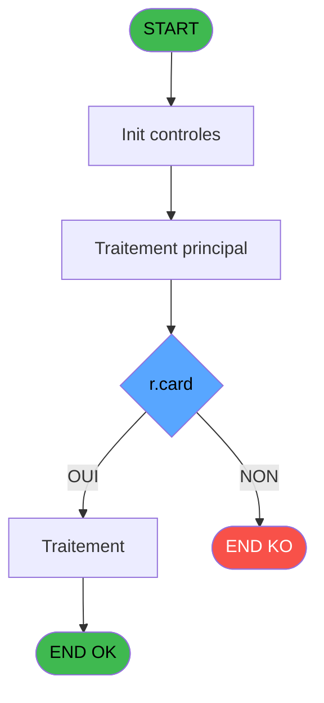
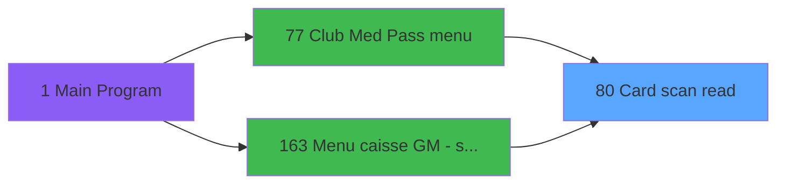

# ADH IDE 80 - Card scan read

> **Analyse**: Phases 1-4 2026-02-07 16:14 -> 02:17 (10h02min) | Assemblage 02:17
> **Pipeline**: V7.2 Enrichi
> **Structure**: 4 onglets (Resume | Ecrans | Donnees | Connexions)

<!-- TAB:Resume -->

## 1. FICHE D'IDENTITE

| Attribut | Valeur |
|----------|--------|
| Projet | ADH |
| IDE Position | 80 |
| Nom Programme | Card scan read |
| Fichier source | `Prg_80.xml` |
| Dossier IDE | General |
| Taches | 1 (0 ecrans visibles) |
| Tables modifiees | 0 |
| Programmes appeles | 0 |
| Complexite | **BASSE** (score 0/100) |

## 2. DESCRIPTION FONCTIONNELLE

# ADH IDE 80 - Card scan read

Programme utilitaire chargé de la lecture et du décodage des données de cartes magnétiques ou puces électroniques. Point d'entrée critique dans le flux de transactions puisqu'il est appelé depuis plusieurs contextes : les trois variantes de transaction de nouvelle vente (PMS-584, PMS-710, PMS-721), le menu Club Med Pass (IDE 77) et le menu caisse avec fonctionnalité de scroll (IDE 163).

Ce programme encapsule la logique métier d'extraction et de validation des informations de carte scannée. Il traduit les données brutes du lecteur de carte magnétique (passage physique) ou du système de saisie en paramètres exploitables : numéro de compte, type de titulaire, services associés. Il gère probablement la gestion des erreurs de lecture, les cas de cartes invalides ou expirées, et l'interrogation des tables de référence pour enrichir les données.

Utilisé massivement dans le parcours caisse (accueil, identification client avant transaction), ce programme est un maillon central du système d'identification des adhérents. Ses performances et sa fiabilité directes impactent l'expérience utilisateur au point de vente et la taille des files d'attente.

## 3. BLOCS FONCTIONNELS

## 5. REGLES METIER

2 regles identifiees:

### Autres (2 regles)

#### [RM-001] Negation de (r.card [H]) (condition inversee)

| Element | Detail |
|---------|--------|
| **Condition** | `NOT (r.card [H])` |
| **Si vrai** | Action si vrai |
| **Variables** | EU (r.card) |
| **Expression source** | Expression 12 : `NOT (r.card [H])` |
| **Exemple** | Si NOT (r.card [H]) → Action si vrai |

#### [RM-002] Condition composite: pv.card id [F]>'' AND NOT (r.card [H])

| Element | Detail |
|---------|--------|
| **Condition** | `pv.card id [F]>'' AND NOT (r.card [H])` |
| **Si vrai** | Action si vrai |
| **Variables** | ES (pv.card id), EU (r.card) |
| **Expression source** | Expression 15 : `pv.card id [F]>'' AND NOT (r.card [H])` |
| **Exemple** | Si pv.card id [F]>'' AND NOT (r.card [H]) → Action si vrai |

## 6. CONTEXTE

- **Appele par**: [Transaction Nouv vente PMS-584 (IDE 0)](ADH-IDE-0.md), [Transaction Nouv vente PMS-710 (IDE 0)](ADH-IDE-0.md), [Transaction Nouv vente PMS-721 (IDE 0)](ADH-IDE-0.md), [Club Med Pass menu (IDE 77)](ADH-IDE-77.md), [Menu caisse GM - scroll (IDE 163)](ADH-IDE-163.md)
- **Appelle**: 0 programmes | **Tables**: 2 (W:0 R:1 L:1) | **Taches**: 1 | **Expressions**: 15

<!-- TAB:Ecrans -->

## 8. ECRANS

*(Programme sans ecran visible)*

## 9. NAVIGATION

### 9.3 Structure hierarchique (0 tache)

| Position | Tache | Type | Dimensions | Bloc |
|----------|-------|------|------------|------|

### 9.4 Algorigramme

> **Legende**: Vert = START/END OK | Rouge = END KO | Bleu = Decisions
> *Algorigramme auto-genere. Utiliser `/algorigramme` pour une synthese metier detaillee.*

<!-- TAB:Donnees -->

## 10. TABLES

### Tables utilisees (2)

| ID | Nom | Description | Type | R | W | L | Usages |
|----|-----|-------------|------|---|---|---|--------|
| 30 | gm-recherche_____gmr | Index de recherche | DB | R |   |   | 1 |
| 312 | ez_card |  | DB |   |   | L | 1 |

### Colonnes par table (2 / 1 tables avec colonnes identifiees)

Table 30 - gm-recherche_____gmr (R) - 1 usages

| Lettre | Variable | Acces | Type |
|--------|----------|-------|------|
| A | p.code-8chiffres | R | Numeric |
| B | p.filiation | R | Numeric |
| C | p.chaine U | R | Alpha |
| D | p.chaine U10 | R | Alpha |
| E | p.Club Med Pass select | R | Logical |
| F | pv.card id | R | Alpha |
| G | p.status | R | Alpha |
| H | r.card | R | Logical |

## 11. VARIABLES

### 11.1 Parametres entrants (6)

Variables recues du programme appelant ([Transaction Nouv vente PMS-584 (IDE 0)](ADH-IDE-0.md)).

| Lettre | Nom | Type | Usage dans |
|--------|-----|------|-----------|
| EN | p.code-8chiffres | Numeric | - |
| EO | p.filiation | Numeric | - |
| EP | p.chaine U | Alpha | - |
| EQ | p.chaine U10 | Alpha | - |
| ER | p.Club Med Pass select | Logical | - |
| ET | p.status | Alpha | - |

### 11.2 Autres (2)

Variables diverses.

| Lettre | Nom | Type | Usage dans |
|--------|-----|------|-----------|
| ES | pv.card id | Alpha | 2x refs |
| EU | r.card | Logical | 4x refs |

## 12. EXPRESSIONS

**15 / 15 expressions decodees (100%)**

### 12.1 Repartition par type

| Type | Expressions | Regles |
|------|-------------|--------|
| CALCULATION | 1 | 0 |
| NEGATION | 1 | 5 |
| CONDITION | 1 | 5 |
| CONSTANTE | 1 | 0 |
| OTHER | 10 | 0 |
| CAST_LOGIQUE | 1 | 0 |

### 12.2 Expressions cles par type

#### CALCULATION (1 expressions)

| Type | IDE | Expression | Regle |
|------|-----|------------|-------|
| CALCULATION | 6 | `Right (Trim ([Q]),Len (Trim ([Q]))-1)` | - |

#### NEGATION (1 expressions)

| Type | IDE | Expression | Regle |
|------|-----|------------|-------|
| NEGATION | 12 | `NOT (r.card [H])` | [RM-001](#rm-RM-001) |

#### CONDITION (1 expressions)

| Type | IDE | Expression | Regle |
|------|-----|------------|-------|
| CONDITION | 15 | `pv.card id [F]>'' AND NOT (r.card [H])` | [RM-002](#rm-RM-002) |

#### CONSTANTE (1 expressions)

| Type | IDE | Expression | Regle |
|------|-----|------------|-------|
| CONSTANTE | 1 | `''` | - |

#### OTHER (10 expressions)

| Type | IDE | Expression | Regle |
|------|-----|------------|-------|
| OTHER | 10 | `[K]` | - |
| OTHER | 9 | `[J]` | - |
| OTHER | 11 | `[L]` | - |
| OTHER | 14 | `pv.card id [F]` | - |
| OTHER | 13 | `r.card [H]` | - |
| ... | | *+5 autres* | |

#### CAST_LOGIQUE (1 expressions)

| Type | IDE | Expression | Regle |
|------|-----|------------|-------|
| CAST_LOGIQUE | 7 | `'TRUE'LOG` | - |

<!-- TAB:Connexions -->

## 13. GRAPHE D'APPELS

### 13.1 Chaine depuis Main (Callers)

Main -> ... -> [Transaction Nouv vente PMS-584 (IDE 0)](ADH-IDE-0.md) -> **Card scan read (IDE 80)**

Main -> ... -> [Transaction Nouv vente PMS-710 (IDE 0)](ADH-IDE-0.md) -> **Card scan read (IDE 80)**

Main -> ... -> [Transaction Nouv vente PMS-721 (IDE 0)](ADH-IDE-0.md) -> **Card scan read (IDE 80)**

Main -> ... -> [Club Med Pass menu (IDE 77)](ADH-IDE-77.md) -> **Card scan read (IDE 80)**

Main -> ... -> [Menu caisse GM - scroll (IDE 163)](ADH-IDE-163.md) -> **Card scan read (IDE 80)**

### 13.2 Callers

| IDE | Nom Programme | Nb Appels |
|-----|---------------|-----------|
| [0](ADH-IDE-0.md) | Transaction Nouv vente PMS-584 | 2 |
| [0](ADH-IDE-0.md) | Transaction Nouv vente PMS-710 | 2 |
| [0](ADH-IDE-0.md) | Transaction Nouv vente PMS-721 | 2 |
| [77](ADH-IDE-77.md) | Club Med Pass menu | 1 |
| [163](ADH-IDE-163.md) | Menu caisse GM - scroll | 1 |

### 13.3 Callees (programmes appeles)

### 13.4 Detail Callees avec contexte

| IDE | Nom Programme | Appels | Contexte |
|-----|---------------|--------|----------|
| - | (aucun) | - | - |

## 14. RECOMMANDATIONS MIGRATION

### 14.1 Profil du programme

| Metrique | Valeur | Impact migration |
|----------|--------|-----------------|
| Lignes de logique | 34 | Programme compact |
| Expressions | 15 | Peu de logique |
| Tables WRITE | 0 | Impact faible |
| Sous-programmes | 0 | Peu de dependances |
| Ecrans visibles | 0 | Ecran unique ou traitement batch |
| Code desactive | 0% (0 / 34) | Code sain |
| Regles metier | 2 | Quelques regles a preserver |

### 14.2 Plan de migration par bloc

### 14.3 Dependances critiques

| Dependance | Type | Appels | Impact |
|------------|------|--------|--------|

---
*Spec DETAILED generee par Pipeline V7.2 - 2026-02-08 02:17*
